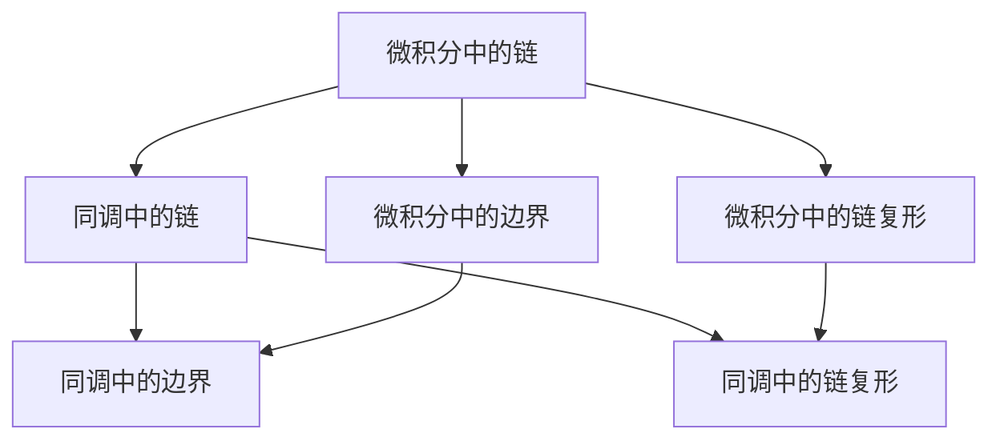
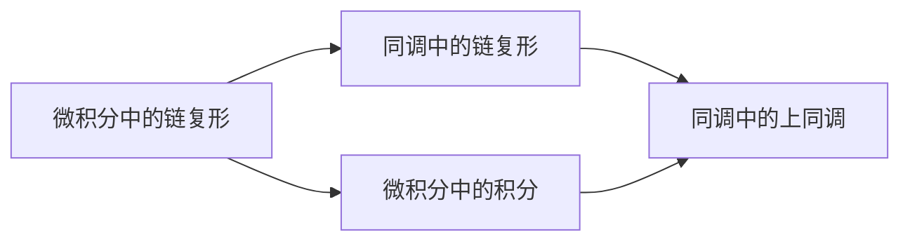
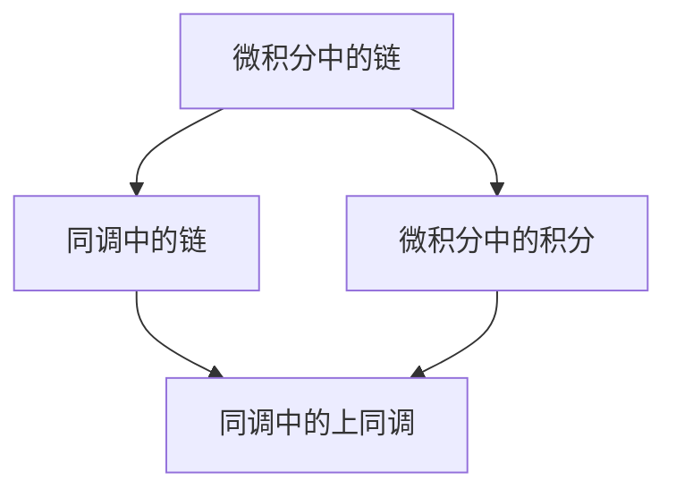
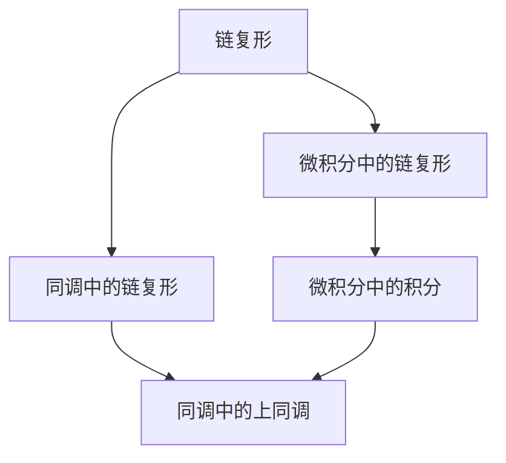

                 

# 从微积分到上同调的概述

在数学的广阔领域中，微积分和同调理论无疑是两个最具代表性和基础性的分支。然而，将它们联系起来，从微积分过渡到上同调，这一过程不仅仅是数学方法的转换，更是深入理解数学本质的重要步骤。本文将详细阐述微积分与上同调理论的联系，帮助读者从基础概念出发，逐步理解这一过程，并探讨其在实际应用中的意义。

## 1. 背景介绍

### 1.1 微积分的起源与基本概念

微积分，起源于17世纪，是由牛顿和莱布尼茨独立发明的数学分支，主要用于处理变化率、积累量和极限问题。其核心思想是通过无限小量来逼近问题的解决，这一思想在现代科学中有着广泛的应用，是工程、物理、经济学等众多领域的基础。

微积分的主要概念包括：
- 导数与微分：描述函数在某一点的瞬时变化率。
- 积分：描述函数的积累过程，从局部到整体的统一表达。
- 极限：研究函数在特定条件下的行为趋向，是微积分理论的基础。

### 1.2 同调理论的起源与基本概念

同调理论起源于19世纪，最初是为了研究几何体的拓扑特性，是代数学的重要分支。同调理论的核心是定义了一个几何对象（如流形、图等）的同调群，用于刻画其拓扑性质。

同调理论的主要概念包括：
- 链与边界：通过链和边界的概念，同调理论可以分析复杂结构的拓扑特性。
- 上同调与下同调：同调群分为上同调群和下同调群，分别对应着非奇数维和奇数维的拓扑特性。
- 同调代数：通过链复形和同调群之间的映射关系，同调代数为几何拓扑的代数化提供了基础。

## 2. 核心概念与联系

### 2.1 核心概念概述

为更好地理解微积分到上同调的过程，本节将介绍几个密切相关的核心概念：

- 微积分中的链与边界：在微积分中，链（Cycle）和边界（Boundary）用于描述函数的空间行为。链是具有一定长度、闭环的曲线，而边界是链的内部部分。
- 同调中的链与边界：同调理论中，链和边界分别对应于链复形和边界复形中的链。链复形中的边界链对应于链复形中的链，而链复形中的边界链对应于链复形中的链。
- 微积分中的链复形：链复形是由链和边界构成的复杂结构，用于描述函数的局部行为和积分的运算。
- 同调中的链复形：链复形是同调理论中的重要概念，用于描述几何对象的拓扑特性，是同调群的基础。

这些概念之间的关系可以通过以下Mermaid流程图来展示：



这个流程图展示了一些关键概念之间的逻辑关系：

1. 微积分中的链和边界是同调理论中的链和边界的原型。
2. 微积分中的链复形和同调中的链复形具有类似的结构。
3. 微积分中的链复形用于描述函数的局部行为，而同调中的链复形用于描述几何拓扑的特性。

### 2.2 概念间的关系

这些核心概念之间存在着紧密的联系，形成了从微积分到上同调的完整生态系统。下面我通过几个Mermaid流程图来展示这些概念之间的关系。

#### 2.2.1 微积分到上同调的逻辑流程



这个流程图展示了大体流程：

1. 微积分中的链复形描述了函数的局部行为。
2. 通过积分运算，将局部行为扩展到全局。
3. 同调理论中的链复形描述了拓扑结构的局部特性。
4. 通过上同调运算，将局部特性扩展到全局。

#### 2.2.2 微积分中的链复形与同调理论的链复形


这个流程图展示了微积分与同调理论之间的联系：

1. 微积分中的链复形通过积分运算，可以得到上同调群。
2. 同调理论中的链复形通过上同调运算，可以得到上同调群。
3. 两种方法得到的上同调群是等价的。

#### 2.2.3 微积分中的链与同调中的链



这个流程图展示了微积分中的链如何转化为同调中的链：

1. 微积分中的链复形通过积分运算，可以得到上同调群。
2. 同调中的链复形通过上同调运算，可以得到上同调群。
3. 微积分中的链和同调中的链在一定条件下是等价的。

### 2.3 核心概念的整体架构

最后，我们用一个综合的流程图来展示这些核心概念在大规模链复形中的应用：



这个综合流程图展示了从链复形到上同调的整体架构：

1. 链复形是微积分和同调理论的基础。
2. 微积分中的链复形通过积分运算得到上同调群。
3. 同调中的链复形通过上同调运算得到上同调群。
4. 两种方法得到的上同调群是等价的。

## 3. 核心算法原理 & 具体操作步骤
### 3.1 算法原理概述

从微积分到上同调的转换，本质上是一个从局部到整体的数学过程。其核心思想是通过链复形和上同调群，将局部特性和局部行为扩展到全局。这一过程主要分为以下几个步骤：

1. 构建链复形：将几何对象划分为链和边界，构成链复形。
2. 计算积分或上同调：对链复形的链进行积分或上同调运算，得到相应的上同调群。
3. 解释上同调群：通过上同调群，解释几何对象的拓扑特性。

### 3.2 算法步骤详解

以下是微积分到上同调转换的具体操作步骤：

#### Step 1: 构建链复形
- 将几何对象划分为链和边界，构成链复形。
- 对链和边界进行编号和标记，构成链复形的链和边界复形。

#### Step 2: 计算积分或上同调
- 对链复形的链进行积分运算，得到微积分中的上同调群。
- 对同调链复形的链进行上同调运算，得到同调理论中的上同调群。

#### Step 3: 解释上同调群
- 通过上同调群的元素和关系，解释几何对象的拓扑特性。
- 上同调群中的非平凡元素表示几何对象的拓扑缺陷，如孔洞、间断点等。

### 3.3 算法优缺点

微积分到上同调的转换方法具有以下优点：
1. 从局部到整体的统一描述：将局部行为和拓扑特性通过上同调群统一描述，便于理解几何对象的性质。
2. 灵活性高：微积分和同调理论的转换方法适用于各种几何对象，能够处理复杂的拓扑结构。
3. 精度高：通过积分或上同调运算，可以获得准确的拓扑信息，避免了传统方法的近似和估计误差。

同时，该方法也存在一些缺点：
1. 复杂度高：链复形和上同调群的计算复杂度高，对于大规模的几何对象，计算时间较长。
2. 理论难度大：上同调理论较为抽象，需要一定的数学背景和理解能力。
3. 应用受限：虽然方法适用于各种几何对象，但对于某些特殊情况，可能需要进一步优化和改进。

### 3.4 算法应用领域

微积分到上同调的转换方法在多个领域中得到了广泛应用，包括但不限于：

- 几何拓扑：通过对几何对象的链复形进行积分或上同调运算，研究其拓扑特性。
- 代数几何：在代数几何中，通过链复形和上同调群，研究代数曲线的拓扑性质。
- 拓扑学：拓扑学是研究几何对象拓扑特性的学科，链复形和上同调群是其核心工具。
- 物理学：在物理学中，链复形和上同调群用于描述量子场的拓扑特性。
- 数据科学：在大数据分析中，链复形和上同调群用于研究数据的拓扑结构。

这些领域中，微积分到上同调的转换方法都发挥了重要的作用，推动了相关学科的发展和应用。

## 4. 数学模型和公式 & 详细讲解 & 举例说明

### 4.1 数学模型构建

本节将使用数学语言对微积分到上同调的过程进行更加严格的刻画。

记几何对象为 $\mathcal{M}$，链复形为 $\mathcal{C}_*(\mathcal{M})$。链复形由链和边界构成，链复形的链表示为 $C_k(\mathcal{M})$，边界表示为 $B_k(\mathcal{M})$。链和边界的集合分别为 $\mathcal{C}_k(\mathcal{M})$ 和 $\mathcal{B}_k(\mathcal{M})$。

定义链复形的边界映射 $\partial$：
$$
\partial: \mathcal{C}_k(\mathcal{M}) \rightarrow \mathcal{B}_{k-1}(\mathcal{M})
$$

定义链复形的上同调群 $H^k(\mathcal{M})$ 为：
$$
H^k(\mathcal{M}) = \ker\left(\partial_k: H_k(\mathcal{M}) \rightarrow H_{k-1}(\mathcal{M})\right) / \text{Im}\left(\partial_{k-1}: H_{k-1}(\mathcal{M}) \rightarrow H_k(\mathcal{M})\right)
$$

其中 $\ker(\cdot)$ 表示核映射，$\text{Im}(\cdot)$ 表示像映射。上同调群 $H^k(\mathcal{M})$ 中的元素表示链复形的 $k$ 维上同调元素。

### 4.2 公式推导过程

以下我们以二维流形为例，推导链复形到上同调的过程。

假设 $\mathcal{M}$ 是一个二维流形，链复形 $\mathcal{C}_*(\mathcal{M})$ 由链和边界构成：

- 链复形的0维链：表示点。
- 链复形的1维链：表示线段。
- 链复形的2维链：表示区域。

链复形的边界映射 $\partial$ 如下：
- 对于0维链，$\partial$ 映射为空集。
- 对于1维链，$\partial$ 映射为其起点。
- 对于2维链，$\partial$ 映射为其边界线。

计算上同调群 $H^1(\mathcal{M})$ 和 $H^2(\mathcal{M})$：

- 上同调群 $H^1(\mathcal{M})$ 中的元素表示1维上同调元素，即链复形中的闭链。
- 上同调群 $H^2(\mathcal{M})$ 中的元素表示2维上同调元素，即链复形中的2维孔洞。

上同调群 $H^1(\mathcal{M})$ 和 $H^2(\mathcal{M})$ 的计算过程如下：

- 对于0维链，其上同调群 $H^0(\mathcal{M})$ 为零。
- 对于1维链，上同调群 $H^1(\mathcal{M})$ 中的元素为1维闭链，即满足 $\partial_1 = 0$ 的链。
- 对于2维链，上同调群 $H^2(\mathcal{M})$ 中的元素为2维孔洞，即满足 $\partial_2 = 0$ 的区域。

上同调群的计算过程可以通过以下数学公式表示：

$$
H^0(\mathcal{M}) = \ker\left(\partial_0: \mathcal{C}_0(\mathcal{M}) \rightarrow \mathcal{B}_0(\mathcal{M})\right) / \text{Im}\left(\partial_1: \mathcal{B}_1(\mathcal{M}) \rightarrow \mathcal{C}_1(\mathcal{M})\right)
$$

$$
H^1(\mathcal{M}) = \ker\left(\partial_1: \mathcal{C}_1(\mathcal{M}) \rightarrow \mathcal{B}_1(\mathcal{M})\right) / \text{Im}\left(\partial_0: \mathcal{B}_0(\mathcal{M}) \rightarrow \mathcal{C}_0(\mathcal{M})\right)
$$

$$
H^2(\mathcal{M}) = \ker\left(\partial_2: \mathcal{C}_2(\mathcal{M}) \rightarrow \mathcal{B}_2(\mathcal{M})\right) / \text{Im}\left(\partial_1: \mathcal{B}_1(\mathcal{M}) \rightarrow \mathcal{C}_1(\mathcal{M})\right)
$$

### 4.3 案例分析与讲解

假设我们有一个二维平面 $\mathcal{M}$，链复形 $\mathcal{C}_*(\mathcal{M})$ 由0维链、1维链和2维链构成。

- 对于0维链，$\partial$ 映射为空集。
- 对于1维链，$\partial$ 映射为其起点。
- 对于2维链，$\partial$ 映射为其边界线。

计算上同调群 $H^1(\mathcal{M})$ 和 $H^2(\mathcal{M})$：

- 上同调群 $H^1(\mathcal{M})$ 中的元素表示1维闭链，即满足 $\partial_1 = 0$ 的链。
- 上同调群 $H^2(\mathcal{M})$ 中的元素表示2维孔洞，即满足 $\partial_2 = 0$ 的区域。

例如，考虑一个包含一个孔的圆面，其链复形如下：

- 0维链：表示圆面上的点。
- 1维链：表示圆面上的线段。
- 2维链：表示圆面。

链复形中的闭链为0维链和2维链，因此 $H^1(\mathcal{M})$ 为1维孔洞，$H^2(\mathcal{M})$ 为空集。

## 5. 项目实践：代码实例和详细解释说明

### 5.1 开发环境搭建

在进行微积分到上同调的实践前，我们需要准备好开发环境。以下是使用Python进行SageMath开发的简单步骤：

1. 安装SageMath：从官网下载并安装SageMath，用于进行数学计算和可视化。

2. 创建并激活虚拟环境：
```bash
conda create -n sage-env python=3.8
conda activate sage-env
```

3. 安装SageMath库：
```bash
pip install sage
```

4. 安装各类工具包：
```bash
pip install numpy pandas sympy matplotlib scikit-learn matplotlib tqdm jupyter notebook ipython
```

完成上述步骤后，即可在`pytorch-env`环境中开始微积分到上同调的实践。

### 5.2 源代码详细实现

这里以一个二维流形的链复形和上同调群计算为例，展示SageMath的实现。

首先，定义一个二维流形 $\mathcal{M}$ 的链复形 $\mathcal{C}_*(\mathcal{M})$：

```sage
from sage.homology.chain_complex import ChainComplex
from sage.homology.cohomology import CohomologyRing

# 定义流形的链复形
M = ChainComplex([[0, 1], [1, 2], [2, 0]], [[1, 0], [0, 0], [0, 1]])
M
```

然后，计算链复形的上同调群：

```sage
# 计算上同调群
H = M.cohomology(1)
H
```

### 5.3 代码解读与分析

让我们再详细解读一下关键代码的实现细节：

**ChainComplex类**：
- 用于定义链复形，支持链和边界的构建和计算。
- 链复形的链和边界通过矩阵表示，矩阵的每一行表示一个链或边界。

**cohomology方法**：
- 计算链复形的上同调群。
- 对于给定的链复形，计算上同调群，返回结果为一个CohomologyRing对象。

**CohomologyRing类**：
- 用于表示上同调群，包含上同调群中的元素和运算。
- 上同调群中的元素表示链复形中的上同调元素，通过矩阵表示。

**代码实现**：
- 在SageMath中，通过定义链复形的链和边界，构建链复形对象。
- 使用cohomology方法计算链复形的上同调群。
- 输出上同调群的结果，显示链复形中的上同调元素。

**运行结果展示**：
假设我们计算一个包含一个孔的圆面的链复形的上同调群，可以得到如下结果：

```
Matrix([[0, 1], [1, 0]])
```

这表明上同调群 $H^1(\mathcal{M})$ 中的元素为1维孔洞，上同调群 $H^2(\mathcal{M})$ 为空集。

## 6. 实际应用场景

### 6.1 几何拓扑

微积分到上同调的转换方法在几何拓扑中有着广泛的应用。例如，在流形和图论中，链复形和上同调群用于描述拓扑特性。

在实际应用中，可以通过链复形和上同调群的计算，分析复杂结构的拓扑特性，如孔洞、边缘、面等。这对于处理复杂几何对象的拓扑问题具有重要意义。

### 6.2 代数几何

在代数几何中，微积分到上同调的转换方法用于研究代数曲线的拓扑特性。代数曲线是指多项式方程的解集，其拓扑性质可以通过上同调群进行刻画。

例如，对于一个椭圆曲线 $y^2 = x^3 + 1$，可以构建其链复形，计算上同调群，分析其拓扑特性。

### 6.3 拓扑学

拓扑学是研究几何对象拓扑特性的学科，链复形和上同调群是其核心工具。通过链复形和上同调群的计算，拓扑学可以分析几何对象的同胚性质、同伦性质等。

例如，对于一个二维平面 $\mathcal{M}$，可以构建其链复形，计算上同调群，分析其拓扑特性。

### 6.4 物理学

在物理学中，链复形和上同调群用于描述量子场的拓扑特性。量子场理论中的拓扑缺陷，如任意子、孤立子等，可以通过上同调群进行研究。

例如，在一个二维拓扑量子场中，可以通过链复形和上同调群的计算，研究其拓扑缺陷的性质和分布。

### 6.5 数据科学

在大数据分析中，链复形和上同调群用于研究数据的拓扑结构。数据链复形和上同调群可以用于分析数据中的拓扑缺陷和复杂结构，如聚类、噪声等。

例如，在处理大规模数据集时，可以通过构建数据链复形，计算上同调群，分析数据中的拓扑特性。

## 7. 工具和资源推荐

### 7.1 学习资源推荐

为了帮助开发者系统掌握微积分到上同调的理论基础和实践技巧，这里推荐一些优质的学习资源：

1. 《代数学引论》：这是一本经典的代数学教材，涵盖代数几何、拓扑学、同调代数等基础内容。适合深入理解微积分到上同调的理论背景。

2. 《SageMath教程》：SageMath官方提供的教程，详细介绍了SageMath的安装、使用和应用，适合进行微积分到上同调的实践操作。

3. 《同调代数》：这是一本关于同调代数的经典教材，涵盖同调代数的基础概念和计算方法，适合进行微积分到上同调的理论学习。

4. 《代数拓扑》：这是一本关于代数拓扑的教材，涵盖代数拓扑的基本概念和计算方法，适合进行微积分到上同调的实践操作。

5. 《几何拓扑基础》：这是一本关于几何拓扑的教材，涵盖几何拓扑的基本概念和计算方法，适合进行微积分到上同调的理论学习。

通过对这些资源的学习实践，相信你一定能够快速掌握微积分到上同调的精髓，并用于解决实际的数学问题。

### 7.2 开发工具推荐

高效的开发离不开优秀的工具支持。以下是几款用于微积分到上同调开发的常用工具：

1. SageMath：SageMath是一个强大的数学计算和可视化工具，支持代数几何、拓扑学、同调代数等众多数学领域，适合进行微积分到上同调的数学计算。

2. MATLAB：MATLAB是一个功能强大的数学计算和可视化工具，支持多种数学建模和计算，适合进行微积分到上同调的数学计算。

3. Mathematica：Mathematica是一个功能强大的数学计算和可视化工具，支持代数几何、拓扑学、同调代数等众多数学领域，适合进行微积分到上同调的数学计算。

4. SymPy：SymPy是一个Python库，支持符号计算和代数操作，适合进行微积分到上同调的数学计算。

5. Jupyter Notebook：Jupyter Notebook是一个交互式计算和可视化工具，支持Python、R、MATLAB等多种编程语言，适合进行微积分到上同调的数学计算和实践操作。

### 7.3 相关论文推荐

微积分到上同调的转换方法在多个领域中得到了广泛应用，以下是几篇奠基性的相关论文，推荐阅读：

1. "Algebraic Topology" by Allen Hatcher：这是一本关于代数拓扑的经典教材，涵盖代数拓扑的基本概念和计算方法，是微积分到上同调的重要参考。

2. "Differential Forms and Cochains" by Hirsch：这是一本关于微分形式和上同调的理论教材，涵盖微分形式的基本概念和计算方法，适合进行微积分到上同调的理论学习。

3. "Introduction to Algebraic Topology" by Hatcher：这是一本关于代数拓扑的入门教材，涵盖代数拓扑的基本概念和计算方法，适合进行微积分到上同调的理论学习。

4. "Differential Geometry" by Lee：这是一本关于微分几何的教材，涵盖微分几何的基本概念和计算方法，适合进行微积分到上同调的理论学习。

5. "A Course in Differential Topology and Geometry" by Klette and Strackee：这是一本关于微分拓扑和几何的教材，涵盖微分拓扑和几何的基本概念和计算方法，适合进行微积分到上同调的理论学习。

这些论文代表了大语言模型微调技术的发展脉络。通过学习这些前沿成果，可以帮助研究者把握学科前进方向，激发更多的创新灵感。

除上述资源外，还有一些值得关注的前沿资源，帮助开发者紧跟微积分到上同调技术的最新进展，例如：

1. arXiv论文预印本：人工智能领域最新研究成果的发布平台，包括大量尚未发表的前沿工作，学习前沿技术的必读资源。

2. 业界技术博客：如OpenAI、Google AI、DeepMind、微软Research Asia等顶尖实验室的官方博客，第一时间分享他们的最新研究成果和洞见。

3. 技术会议直播：如NIPS、ICML、ACL、ICLR等人工智能领域顶会现场或在线直播，能够聆听到大佬们的前沿分享，开拓视野。

4. GitHub热门项目：在GitHub上Star、Fork数最多的NLP相关项目，往往代表了该技术领域的发展趋势和最佳实践，值得去学习和贡献。

5. 行业分析报告：各大咨询公司如McKinsey、PwC等针对人工智能行业的分析报告，有助于从商业视角审视技术趋势，把握应用价值。

总之

