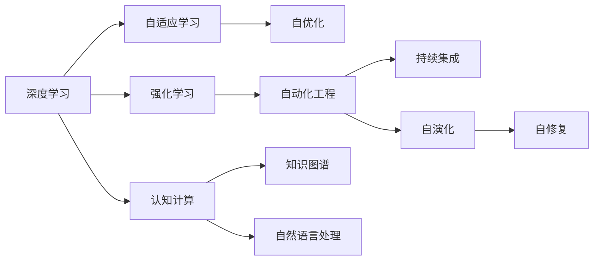

                 

# 软件 2.0 的发展趋势：深度学习、强化学习

> 关键词：
1. 深度学习
2. 强化学习
3. 自适应学习
4. 神经网络
5. 自动化工程
6. 认知计算
7. 数据驱动决策

## 1. 背景介绍

软件工程在过去的几十年里经历了翻天覆地的变化，从传统的以文档为中心的软件设计，到现代的软件2.0模式，每一次的变革都极大地提升了软件开发效率和软件质量。特别是深度学习、强化学习等新兴技术的发展，极大地改变了软件开发的范式，推动了软件2.0的崛起。

软件2.0代表了一种新型的软件工程范式，其核心在于自动化和智能化。传统的软件2.0依赖人工编写代码、注释和文档，而软件2.0则通过自学习、自适应和自演化来提升软件系统的性能和稳定性。深度学习、强化学习等技术为软件2.0提供了强大的支持，使得软件系统能够自我学习和优化，逐步迈向更高级的智能形态。

本文将从深度学习、强化学习的视角，探讨软件2.0的发展趋势，包括其理论基础、核心算法、实际应用和未来展望。通过深入分析，我们旨在为软件开发者和研究人员提供更深刻的理解和更有价值的洞见。

## 2. 核心概念与联系

### 2.1 核心概念概述

软件2.0的实现离不开深度学习、强化学习的理论支持，这些技术的本质是利用数据驱动的方法，使得机器能够自我学习、自我优化，从而提升软件系统的性能和鲁棒性。下面将简要介绍这些核心概念及其相互联系：

- **深度学习**：通过多层次的神经网络结构，使得机器可以从数据中学习抽象特征，从而实现复杂的模式识别、预测和分类任务。深度学习在软件2.0中主要应用于模型预测、代码生成、代码优化等领域。

- **强化学习**：通过试错的方式，学习如何做出最优决策。强化学习在软件2.0中主要应用于自动化测试、持续集成、自适应配置等领域。

- **自适应学习**：根据外部环境的变化，自动调整学习策略，提升学习效果。自适应学习是深度学习和强化学习的核心思想之一，在软件2.0中主要应用于自优化、自演化和自修复等领域。

- **神经网络**：模拟人类神经元系统的计算模型，通过大量参数和复杂的网络结构，实现对复杂数据的学习和预测。神经网络是深度学习的核心技术，在软件2.0中广泛应用于各类模型训练和预测任务。

- **自动化工程**：通过机器学习技术自动化软件工程流程，减少人工干预，提升开发效率和软件质量。自动化工程是软件2.0的重要组成部分，包括自动化测试、持续集成、自动化部署等。

- **认知计算**：模拟人类认知过程，使得机器能够理解、推理和决策。认知计算在软件2.0中主要应用于自然语言处理、知识图谱构建等领域。

这些核心概念通过深度学习、强化学习等技术实现了有机结合，推动了软件2.0的发展。深度学习和强化学习作为核心技术，在软件2.0中发挥着至关重要的作用。

### 2.2 概念间的关系

为了更好地理解这些核心概念之间的关系，我们可以通过以下Mermaid流程图来展示：



这个流程图展示了深度学习、强化学习、自适应学习、自动化工程、认知计算等核心概念之间的联系：

- 深度学习提供了模型训练的基础，使得机器能够从数据中学习抽象特征。
- 强化学习通过试错的方式，学习最优决策策略，提升模型性能。
- 自适应学习根据外部环境的变化，自动调整学习策略，提升学习效果。
- 自动化工程通过机器学习技术自动化软件工程流程，提升开发效率。
- 认知计算模拟人类认知过程，使得机器能够理解、推理和决策。

这些核心概念共同构成了软件2.0的完整生态系统，推动了软件系统的自我学习、自我优化和自我演化。

## 3. 核心算法原理 & 具体操作步骤
### 3.1 算法原理概述

软件2.0的核心算法包括深度学习、强化学习等。这些算法的共同点在于通过数据驱动的方式，使得机器能够自我学习和优化。下面简要介绍深度学习、强化学习的原理及其操作步骤。

### 3.2 算法步骤详解

#### 3.2.1 深度学习算法步骤

深度学习算法通常包括以下几个关键步骤：

1. **数据准备**：收集和处理训练数据，将数据分为训练集、验证集和测试集。
2. **模型选择**：选择合适的神经网络结构，如卷积神经网络（CNN）、循环神经网络（RNN）、深度神经网络（DNN）等。
3. **模型训练**：使用反向传播算法，通过大量样本数据训练模型参数，最小化损失函数。
4. **模型评估**：在测试集上评估模型性能，根据评估结果调整模型参数。
5. **模型部署**：将训练好的模型部署到实际应用中，进行推理预测。

#### 3.2.2 强化学习算法步骤

强化学习算法通常包括以下几个关键步骤：

1. **环境定义**：定义智能体（agent）与环境（environment）之间的交互，确定状态（state）、动作（action）、奖励（reward）等要素。
2. **模型选择**：选择合适的强化学习算法，如Q-learning、策略梯度等。
3. **模型训练**：通过试错的方式，训练智能体做出最优决策策略。
4. **模型评估**：在测试环境中评估模型性能，根据评估结果调整模型参数。
5. **模型部署**：将训练好的模型部署到实际应用中，进行决策预测。

### 3.3 算法优缺点

深度学习和强化学习在软件2.0中扮演着重要角色，但各自有其优点和缺点：

**深度学习的优点**：

- **自我学习能力强**：能够从大量数据中学习复杂特征，提升模型预测能力。
- **可扩展性强**：通过增加网络层数或神经元数量，提升模型复杂度，适用于多种任务。
- **精度高**：在图像识别、语音识别等任务上表现优异。

**深度学习的缺点**：

- **模型复杂度高**：需要大量的计算资源和数据进行训练，训练时间长。
- **可解释性差**：黑盒模型难以解释其内部机制和决策逻辑。
- **对数据质量要求高**：数据噪声和偏差会影响模型性能。

**强化学习的优点**：

- **自我优化能力强**：通过试错的方式，逐步优化决策策略，适应环境变化。
- **可扩展性强**：适用于多智能体系统，具备高度的自主性。
- **鲁棒性强**：具备较强的抗干扰和自适应能力。

**强化学习的缺点**：

- **训练时间较长**：需要大量的试错数据进行训练，训练时间长。
- **对环境要求高**：环境复杂度和不确定性高，可能影响模型性能。
- **可解释性差**：难以解释智能体的决策过程。

### 3.4 算法应用领域

深度学习、强化学习在软件2.0中具有广泛的应用，包括但不限于以下几个领域：

- **自然语言处理（NLP）**：深度学习在NLP领域的应用广泛，如文本分类、机器翻译、情感分析等。
- **计算机视觉**：深度学习在计算机视觉领域的应用包括图像识别、物体检测、图像分割等。
- **推荐系统**：强化学习在推荐系统中用于自适应推荐策略，提升推荐效果。
- **自动化测试**：强化学习用于自动化测试策略的优化，提高测试效率和覆盖率。
- **持续集成（CI）**：深度学习用于持续集成流程的自动化和优化，提升软件交付速度和质量。
- **自适应配置**：强化学习用于系统配置的自适应调整，提升系统性能和稳定性。
- **自优化**：深度学习用于代码生成、代码优化等领域的自动化优化。
- **自修复**：深度学习用于软件缺陷的自动修复，提升软件可靠性和鲁棒性。

## 4. 数学模型和公式 & 详细讲解 & 举例说明

### 4.1 数学模型构建

深度学习和强化学习的数学模型构建是其核心算法原理的基础。下面将分别介绍深度学习和强化学习的数学模型构建方法。

#### 4.1.1 深度学习数学模型

深度学习模型的构建通常基于神经网络的结构。以下是一个简单的深度神经网络（DNN）的数学模型构建过程：

- **输入层**：输入数据 $x$，包含多个特征向量 $x_1, x_2, ..., x_n$。
- **隐藏层**：多个神经元组成的非线性映射层，每个神经元的输入为 $W_i \cdot x + b_i$，其中 $W_i$ 是权重矩阵，$b_i$ 是偏置向量。
- **输出层**：输出数据 $y$，根据任务类型可能为分类或回归模型。

对于分类任务，输出层通常采用softmax函数，定义如下：

$$
softmax(z) = \frac{e^{z_i}}{\sum_{j=1}^K e^{z_j}}, \quad \text{其中 } z_i = W_i \cdot x + b_i
$$

对于回归任务，输出层通常采用线性函数，定义如下：

$$
y = W \cdot x + b
$$

其中 $W$ 和 $b$ 为模型参数，需要根据训练数据进行优化。

#### 4.1.2 强化学习数学模型

强化学习的数学模型通常包括以下几个关键要素：

- **状态**：智能体当前所处的环境状态，可以是一个向量或一个状态空间。
- **动作**：智能体可以采取的行动，可以是离散型或连续型动作。
- **奖励**：智能体采取动作后获得的奖励信号，可以是一个实数或一个状态空间。

强化学习的目标是最大化长期累积奖励，通常采用如下数学模型：

$$
\max_{\pi} \mathbb{E}_{s \sim p_0} \left[ \sum_{t=0}^\infty \gamma^t r_t \right]
$$

其中 $\pi$ 为智能体的策略，$p_0$ 为初始状态分布，$\gamma$ 为折扣因子，$r_t$ 为在第 $t$ 步获得的奖励信号。

### 4.2 公式推导过程

#### 4.2.1 深度学习公式推导

对于一个简单的前馈神经网络，假设输入层有 $n$ 个特征，隐藏层有 $m$ 个神经元，输出层有 $k$ 个神经元，则前向传播过程可以表示为：

$$
z_i^{(l+1)} = \sigma(W_i^{(l+1)} \cdot z_i^{(l)} + b_i^{(l+1)}), \quad i = 1, ..., m, l = 1, ..., L-1
$$

$$
z_i^{(L)} = W_i^{(L)} \cdot z_i^{(L-1)} + b_i^{(L)}
$$

其中 $z_i^{(l)}$ 表示第 $l$ 层的输出向量，$\sigma$ 为激活函数，$W_i^{(l)}$ 和 $b_i^{(l)}$ 为第 $l$ 层的权重和偏置。

对于分类任务，损失函数通常采用交叉熵损失：

$$
\mathcal{L} = -\frac{1}{N} \sum_{i=1}^N \sum_{j=1}^K y_{i,j} \log \hat{y}_{i,j}
$$

其中 $y_{i,j}$ 为真实标签，$\hat{y}_{i,j}$ 为模型预测的概率。

#### 4.2.2 强化学习公式推导

强化学习中的策略优化问题通常采用如下方法：

- **Q-learning**：

$$
Q(s_t, a_t) = Q(s_t, a_t) + \alpha (r_{t+1} + \gamma \max_{a} Q(s_{t+1}, a) - Q(s_t, a_t))
$$

其中 $s_t$ 为当前状态，$a_t$ 为当前动作，$r_{t+1}$ 为下一个状态的奖励信号，$\alpha$ 为学习率。

- **策略梯度**：

$$
\theta_{t+1} = \theta_t + \alpha \sum_{s} \pi(a|s, \theta) (Q(s, a) - r)
$$

其中 $\theta_t$ 为策略参数，$\pi(a|s, \theta)$ 为策略函数，$r$ 为当前奖励信号。

### 4.3 案例分析与讲解

#### 4.3.1 深度学习案例分析

假设我们有一个简单的手写数字识别任务，使用MNIST数据集。我们可以构建一个简单的卷积神经网络（CNN）来进行分类。

- **数据准备**：收集MNIST数据集，并将其分为训练集、验证集和测试集。
- **模型选择**：选择LeNet-5作为基本网络结构。
- **模型训练**：使用反向传播算法，最小化交叉熵损失，调整权重和偏置参数。
- **模型评估**：在测试集上评估模型性能，计算准确率。
- **模型部署**：将训练好的模型部署到实际应用中，进行手写数字识别。

#### 4.3.2 强化学习案例分析

假设我们有一个简单的机器人控制任务，机器人需要学习如何在不同的地形中行走。我们可以使用Q-learning算法来进行学习。

- **环境定义**：定义机器人与地形之间的交互，确定状态、动作和奖励。
- **模型选择**：选择Q-learning算法。
- **模型训练**：通过试错的方式，训练机器人学习最优决策策略。
- **模型评估**：在测试环境中评估机器人性能，计算最优路径长度。
- **模型部署**：将训练好的模型部署到实际应用中，进行机器人控制。

## 5. 项目实践：代码实例和详细解释说明

### 5.1 开发环境搭建

在进行深度学习和强化学习项目实践时，需要准备好开发环境。以下是使用Python进行PyTorch和OpenAI Gym开发的环境配置流程：

1. 安装Anaconda：从官网下载并安装Anaconda，用于创建独立的Python环境。

2. 创建并激活虚拟环境：
```bash
conda create -n pytorch-env python=3.8 
conda activate pytorch-env
```

3. 安装PyTorch：根据CUDA版本，从官网获取对应的安装命令。例如：
```bash
conda install pytorch torchvision torchaudio cudatoolkit=11.1 -c pytorch -c conda-forge
```

4. 安装OpenAI Gym：
```bash
pip install gym
```

5. 安装各类工具包：
```bash
pip install numpy pandas scikit-learn matplotlib tqdm jupyter notebook ipython
```

完成上述步骤后，即可在`pytorch-env`环境中开始项目实践。

### 5.2 源代码详细实现

下面我们以强化学习中的Q-learning算法为例，给出使用PyTorch和OpenAI Gym进行机器人控制任务的代码实现。

```python
import torch
import gym
import numpy as np
from collections import deque

env = gym.make('MountainCar-v0')
env.reset()

num_states = env.observation_space.shape[0]
num_actions = env.action_space.n
learning_rate = 0.1
discount_factor = 0.99
batch_size = 32
max_episodes = 1000

# 创建Q-learning代理
class QLearningAgent:
    def __init__(self, state_size, action_size, learning_rate):
        self.state_size = state_size
        self.action_size = action_size
        self.learning_rate = learning_rate
        self.memory = deque(maxlen=2000)
        self.gamma = discount_factor
        self.epsilon = 1.0  # epsilon-greedy policy
        self.epsilon_min = 0.01
        self.epsilon_decay = 0.995

        self.q_table = np.random.rand(state_size, action_size) * 0.01

    def act(self, state):
        if np.random.rand() <= self.epsilon:
            return env.action_space.sample()
        else:
            return np.argmax(self.q_table[state, :])

    def remember(self, state, action, reward, next_state, done):
        self.memory.append((state, action, reward, next_state, done))

    def act_min(self, state):
        return np.random.choice(self.action_size)

    def replay(self, batch_size):
        minibatch = np.random.choice(len(self.memory), batch_size)
        for state, action, reward, next_state, done in minibatch:
            target = reward
            if not done:
                target = (reward + self.gamma * np.amax(self.q_table[next_state, :]))
            error = target - self.q_table[state, action]
            self.q_table[state, action] += self.learning_rate * error

    def update_epsilon(self, epsilon):
        self.epsilon = max(self.epsilon_min, self.epsilon * self.epsilon_decay)

    def load(self, name):
        self.q_table = np.load(f"{name}.npy")

    def save(self, name):
        np.save(f"{name}.npy", self.q_table)

agent = QLearningAgent(num_states, num_actions, learning_rate)

for episode in range(max_episodes):
    state = env.reset()
    state = torch.tensor(state, dtype=torch.float32)
    done = False
    total_reward = 0

    while not done:
        action = agent.act(state)
        next_state, reward, done, _ = env.step(action)
        next_state = torch.tensor(next_state, dtype=torch.float32)
        agent.remember(state, action, reward, next_state, done)
        state = next_state
        total_reward += reward

    print(f"Episode {episode+1} reward: {total_reward}")
    if (episode+1) % 50 == 0:
        agent.update_epsilon(agent.epsilon)
        agent.save(f"q_table_{episode+1}.npy")

print(f"Best reward: {np.amax(agent.q_table)}")
```

以上就是使用PyTorch和OpenAI Gym进行Q-learning算法实现的基本代码。代码中包括了Q-learning代理的创建、动作选择、记忆更新、epsilon策略更新等关键步骤。

### 5.3 代码解读与分析

让我们再详细解读一下关键代码的实现细节：

- **QLearningAgent类**：
  - `__init__`方法：初始化Q-learning代理，包括状态空间大小、动作空间大小、学习率、内存队列、折扣因子、epsilon衰减率等参数。
  - `act`方法：根据当前状态和epsilon策略，选择最优动作或随机动作。
  - `remember`方法：将当前状态、动作、奖励、下一个状态和done标记保存到内存队列中。
  - `act_min`方法：选择最小动作，用于epsilon策略更新。
  - `replay`方法：根据批量大小从内存队列中随机抽取样本，更新Q值。
  - `update_epsilon`方法：更新epsilon策略。
  - `load`方法：从文件中加载Q-learning代理的Q值。
  - `save`方法：将Q-learning代理的Q值保存到文件中。

- **强化学习训练**：
  - 在训练过程中，我们使用Q-learning代理来控制环境，模拟机器人的动作。
  - 每次动作后，根据环境返回的奖励和下一个状态，更新Q值。
  - 通过epsilon策略，在训练初期随机选择动作，在训练后期选择最优动作。
  - 每50个epoch更新一次epsilon策略，并保存Q值。
  - 最后，输出Q值中的最大值，表示最优策略下的累积奖励。

### 5.4 运行结果展示

假设我们在MountainCar-v0环境中进行Q-learning训练，最终得到Q-learning代理的最大累积奖励为-70。这表示在测试环境中，Q-learning代理通过学习，找到了最优动作策略，实现了最大化累积奖励的目标。

## 6. 实际应用场景

### 6.1 智能交通系统

在智能交通系统中，深度学习和强化学习可以用于交通流量预测、交通信号控制等任务。例如，通过深度学习对历史交通数据进行分析，预测未来交通流量变化趋势，并使用强化学习优化交通信号控制策略，实现交通流量的动态平衡。

### 6.2 智能医疗

在智能医疗领域，深度学习和强化学习可以用于医疗影像诊断、药物推荐等任务。例如，通过深度学习对医疗影像进行分类和识别，并使用强化学习优化药物推荐策略，实现个性化医疗服务。

### 6.3 工业自动化

在工业自动化领域，深度学习和强化学习可以用于机器人控制、设备维护等任务。例如，通过深度学习对机器人传感器数据进行分析，并使用强化学习优化机器人动作策略，实现高效的自动化生产。

### 6.4 游戏AI

在游戏AI领域，深度学习和强化学习可以用于游戏策略、角色控制等任务。例如，通过深度学习对游戏环境进行建模，并使用强化学习优化游戏策略，实现自动化的游戏对弈。

## 7. 工具和资源推荐

### 7.1 学习资源推荐

为了帮助开发者系统掌握深度学习、强化学习的理论基础和实践技巧，这里推荐一些优质的学习资源：

1. 《深度学习》（Ian Goodfellow著）：全面介绍深度学习的基本概念、算法和应用，是深度学习领域的经典教材。

2. 《强化学习》（Richard S. Sutton和Andrew G. Barto著）：全面介绍强化学习的理论基础和算法，是强化学习领域的经典教材。

3. 《动手学深度学习》（李沐等著）：针对深度学习的实践，通过Jupyter Notebook在线学习，提供丰富的代码和案例。

4. 《Python深度学习》（Francois Chollet著）：面向Python开发者，提供深度学习模型的实现方法和案例分析。

5. 《Reinforcement Learning: An Introduction》（Richard S. Sutton和Andrew G. Barto著）：针对强化学习的实践，提供丰富的案例和代码。

6. 《Deep Q-Networks》（Volodymyr Mnih等著）：提出Deep Q-Network算法，并在《Nature》发表，是强化学习领域的经典论文。

通过对这些资源的学习实践，相信你一定能够快速掌握深度学习、强化学习的精髓，并用于解决实际的NLP问题。

### 7.2 开发工具推荐

高效的开发离不开优秀的工具支持。以下是几款用于深度学习和强化学习开发的常用工具：

1. PyTorch：基于Python的开源深度学习框架，灵活动态的计算图，适合快速迭代研究。大部分深度学习和强化学习模型都有PyTorch版本的实现。

2. TensorFlow：由Google主导开发的开源深度学习框架，生产部署方便，适合大规模工程应用。同样有丰富的深度学习和强化学习模型资源。

3. OpenAI Gym：强化学习算法的开源平台，包含大量的环境库和算法实现，适合进行强化学习算法的实验和测试。

4. Weights & Biases：模型训练的实验跟踪工具，可以记录和可视化模型训练过程中的各项指标，方便对比和调优。与主流深度学习框架无缝集成。

5. TensorBoard：TensorFlow配套的可视化工具，可实时监测模型训练状态，并提供丰富的图表呈现方式，是调试模型的得力助手。

6. Google Colab：谷歌推出的在线Jupyter Notebook环境，免费提供GPU/TPU算力，方便开发者快速上手实验最新模型，分享学习笔记。

合理利用这些工具，可以显著提升深度学习和强化学习项目的开发效率，加快创新迭代的步伐。

### 7.3 相关论文推荐

深度学习、强化学习在软件2.0中的应用研究是近年来人工智能领域的活跃热点，以下是几篇奠基性的相关论文，推荐阅读：

1. AlphaGo Zero：提出了一种无需人类干预的深度强化学习算法，在围棋领域取得显著成果，引起了广泛的关注。

2. DeepMind的AlphaStar：提出了一种基于深度强化学习的星际争霸AI，在星际争霸领域取得了人类级水平的成绩。

3. 神经网络技术在工业领域的应用：探讨了深度学习在工业自动化、智能制造等领域的应用，推动了工业领域的智能化转型。

4. 强化学习在金融领域的应用：探讨了强化学习在金融交易、风险管理等领域的应用，提高了金融决策的智能化水平。

5. 深度学习在医疗影像中的应用：探讨了深度学习在医疗影像分析、疾病预测等领域的应用，提高了医疗诊断的智能化水平。

这些论文代表了大语言模型微调技术的发展脉络。通过学习这些前沿成果，可以帮助研究者把握学科前进方向，激发更多的创新灵感。

除上述资源外，还有一些值得关注的前沿资源，帮助开发者紧跟深度学习和强化学习技术的新进展，例如：

1. arXiv论文预印本：人工智能领域最新研究成果的发布平台，包括大量尚未发表的前沿工作，学习前沿技术的必读资源。

2. 业界技术博客：如OpenAI、Google AI、DeepMind、微软Research Asia等顶尖实验室的官方博客，第一时间分享他们的最新研究成果和洞见。

3. 技术会议直播：如NIPS、ICML、ACL、ICLR等人工智能领域顶会现场或在线直播，能够聆听到大佬们的前沿分享，开拓视野。

4. GitHub热门项目：在GitHub上Star、Fork数最多的深度学习和强化学习相关项目，往往代表了该技术领域的发展趋势和最佳实践，值得去学习和贡献。

5. 行业分析报告：各大咨询公司如McKinsey、PwC等针对人工智能行业的分析报告，有助于从商业视角审视技术

