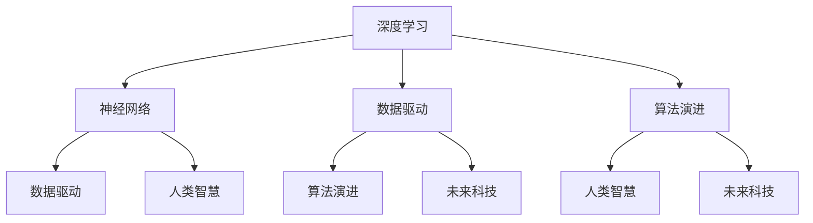

                 

# 从概念到洞见：思想的演变

> 关键词：
>
> - 深度学习
> - 神经网络
> - 数据驱动
> - 算法演进
> - 人类智慧
> - 未来科技

## 1. 背景介绍

### 1.1 问题由来

近几十年来，人类社会经历了翻天覆地的变化，特别是信息技术的迅猛发展，极大地改变了我们的生活和工作方式。在这一过程中，一个重要的驱动力是人工智能（AI）技术的不断突破和应用。深度学习和神经网络等关键技术的发展，使得计算机具备了处理复杂问题、自主学习和决策的能力，从而在诸多领域取得了显著的成果。

人工智能的快速发展，不仅带来了技术上的革新，也深刻地影响了我们对知识的理解、对世界的认知和对未来的想象。在这一过程中，思想和概念的演变，成为推动AI技术前进的重要力量。从最初的概念构想到最终的实际应用，这一过程蕴含着深层次的哲学思考和技术实践。

### 1.2 问题核心关键点

在人工智能领域，概念和洞见之间的演变，不仅涉及技术层面的突破，还包含着对人类智慧的重新认识和对未来科技的展望。这一过程中，重要的关键点包括：

1. **从浅层到深层网络：** 最初的人工神经网络只有几层，随着深度学习的不断发展，现在已出现了几十甚至几百层的深度神经网络。

2. **从监督学习到无监督学习：** 早期的人工智能主要依赖于监督学习，即需要大量标注数据来训练模型。近年来，无监督学习、半监督学习和自监督学习逐渐成为研究的热点。

3. **从批量训练到实时学习：** 传统的机器学习模型需要批量训练，才能在新数据上取得较好的效果。而现代的在线学习、增量学习和持续学习技术，使得模型能够在不断接收新数据的同时保持性能。

4. **从模型优化到算法创新：** 最初的人工智能研究主要集中在模型优化上，现在则更加注重算法创新，如强化学习、生成对抗网络（GAN）等。

5. **从单一任务到多任务学习：** 早期的人工智能主要集中在单一任务上，现在则探索多任务学习、跨领域学习和元学习等，以提高模型的泛化能力和适应性。

6. **从静态模型到动态系统：** 早期的AI模型通常是静态的，而现在则越来越多地使用动态系统，如递归神经网络（RNN）、变换器（Transformer）等，能够处理序列数据和变化的环境。

7. **从局部优化到全局优化：** 早期的AI研究主要关注单个任务的局部优化，现在则探索全局优化技术，如分布式学习、联邦学习等。

这些关键点的演变，不仅反映了技术的进步，也体现了人类对智慧的理解和探索的深化。

### 1.3 问题研究意义

了解这一过程中概念和洞见的演变，不仅有助于我们更好地理解人工智能技术的发展脉络，还可以为未来的研究和技术创新提供启示。具体而言：

1. **技术进步的推动力：** 概念和洞见的演变，为人工智能技术的进步提供了强有力的推动力。每个新的概念和技术，都为解决新的问题、应对新的挑战提供了新的思路和方法。

2. **人类智慧的反映：** 人工智能技术的每一步发展，都是对人类智慧的一次探索和深化。从最初的浅层神经网络到复杂的深度学习模型，从监督学习到无监督学习，每一步都反映了人类对智慧理解的深化。

3. **未来科技的引领：** 概念和洞见的演变，不仅推动了当前的人工智能技术发展，也为未来科技的发展提供了方向。例如，当前的热点如量子计算、脑机接口等，都是在人工智能概念和洞见的启发下产生的。

## 2. 核心概念与联系

### 2.1 核心概念概述

在这一过程中，出现了许多核心概念，它们相互联系、相互促进，共同推动了人工智能技术的发展。这些核心概念包括：

1. **深度学习：** 一种基于多层神经网络的机器学习技术，可以处理复杂的非线性关系，广泛应用于图像识别、语音识别、自然语言处理等领域。

2. **神经网络：** 一种模拟人脑神经元网络的计算模型，通过多个层次的节点和连接，实现对数据的非线性映射。

3. **数据驱动：** 一种基于数据训练模型的机器学习方法，通过大量数据来发现数据中的规律和模式。

4. **算法演进：** 从最初的浅层神经网络到深度学习、从监督学习到无监督学习等，每一次算法的演进都推动了人工智能技术的进步。

5. **人类智慧：** 人工智能技术的发展，不仅源于技术进步，还源于对人类智慧的深刻理解和应用。通过对人类智慧的模拟和扩展，人工智能技术能够解决更加复杂的问题。

6. **未来科技：** 人工智能技术的发展，为未来的科技革命提供了新的思路和方法，推动了量子计算、脑机接口、生物计算机等前沿技术的发展。

### 2.2 概念间的关系

这些核心概念之间的联系，可以用以下Mermaid流程图来展示：



这个流程图展示了深度学习、神经网络、数据驱动、算法演进、人类智慧和未来科技之间的联系。深度学习和神经网络是实现数据驱动和算法演进的基础；数据驱动和算法演进是深度学习和神经网络发展的动力；人类智慧是深度学习和神经网络的源泉，也是未来科技发展的方向；未来科技则是在深度学习、神经网络、数据驱动、算法演进和人类智慧的共同推动下不断进步的。

## 3. 核心算法原理 & 具体操作步骤

### 3.1 算法原理概述

人工智能的算法演进，是一个从浅层到深层、从监督学习到无监督学习、从批量训练到实时学习、从模型优化到算法创新、从单一任务到多任务学习、从静态模型到动态系统、从局部优化到全局优化等多个维度不断深入的过程。

在这一过程中，深度学习算法是最核心的算法之一。深度学习算法通过多层神经网络对数据进行非线性映射，从而可以处理复杂的数据结构和模式。深度学习算法的核心在于前向传播和反向传播两个过程。前向传播是将数据输入网络，通过一系列的非线性变换得到输出结果；反向传播则是根据输出结果和实际结果之间的误差，反向计算每个节点的梯度，从而更新网络参数，使得网络能够逐渐逼近真实的模型。

### 3.2 算法步骤详解

深度学习算法的基本步骤如下：

1. **数据预处理：** 对原始数据进行清洗、归一化和分块等预处理，以便于网络的训练。

2. **模型搭建：** 根据问题的特点，选择合适的网络结构，如卷积神经网络（CNN）、递归神经网络（RNN）或变换器（Transformer）等。

3. **模型训练：** 将数据输入网络，进行前向传播和反向传播，不断更新网络参数，直到网络收敛。

4. **模型评估：** 在测试集上评估模型的性能，如准确率、召回率等指标。

5. **模型优化：** 根据评估结果，调整模型参数和超参数，进行二次训练，以进一步提高模型的性能。

6. **模型应用：** 将训练好的模型应用到实际问题中，进行预测、分类、生成等任务。

### 3.3 算法优缺点

深度学习算法的优点包括：

1. **处理复杂数据：** 深度学习算法可以处理复杂的非线性关系，从而可以处理多种类型的数据，如图像、文本、语音等。

2. **自适应能力：** 深度学习算法可以根据数据的特点自动调整网络结构和参数，从而适应不同的问题。

3. **高精度：** 深度学习算法在许多任务上已经达到了或接近了人类的水平，如图像识别、语音识别和自然语言处理等。

深度学习算法的缺点包括：

1. **数据需求高：** 深度学习算法需要大量的标注数据进行训练，否则容易过拟合或欠拟合。

2. **计算资源消耗大：** 深度学习算法需要大量的计算资源进行训练和推理，从而增加了计算成本。

3. **解释性差：** 深度学习算法通常是一个"黑盒"模型，难以解释其内部的工作机制和决策逻辑。

4. **脆弱性：** 深度学习算法对输入数据的微小扰动非常敏感，容易受到对抗样本的攻击。

### 3.4 算法应用领域

深度学习算法在许多领域都得到了广泛的应用，包括但不限于：

1. **计算机视觉：** 图像识别、物体检测、人脸识别等。

2. **自然语言处理：** 机器翻译、语音识别、情感分析等。

3. **语音处理：** 语音识别、语音合成等。

4. **游戏与机器人：** 自动驾驶、机器人导航等。

5. **金融与商业：** 信用评估、股票预测、客户行为分析等。

6. **医疗与健康：** 疾病诊断、药物发现、基因分析等。

7. **科研与教育：** 科学计算、在线教育等。

8. **安全与防御：** 网络安全、恶意软件检测等。

## 4. 数学模型和公式 & 详细讲解 & 举例说明

### 4.1 数学模型构建

深度学习算法通常使用多层神经网络对数据进行建模。以卷积神经网络（CNN）为例，其数学模型可以表示为：

$$ y = \sigma (\sum_{i=1}^{n} w_i x_i + b) $$

其中，$x_i$为输入数据的第$i$个特征，$w_i$为第$i$个特征的权重，$b$为偏置项，$\sigma$为激活函数，$y$为输出结果。

### 4.2 公式推导过程

以简单的线性回归模型为例，推导其梯度下降算法的公式。

假设模型为$y = wx + b$，其中$w$为权重向量，$b$为偏置项，$x$为输入特征，$y$为输出结果，$\hat{y}$为模型的预测结果。其误差函数为均方误差（MSE）：

$$ \text{MSE} = \frac{1}{2} \sum_{i=1}^{N} (y_i - \hat{y}_i)^2 $$

根据误差函数对权重$w$和偏置$b$的偏导数，可以得到梯度下降算法的更新公式：

$$ \begin{aligned}
    w &= w - \eta \frac{1}{N} \sum_{i=1}^{N} (x_i - \bar{x}) (y_i - \hat{y}_i) \\
    b &= b - \eta \frac{1}{N} \sum_{i=1}^{N} (y_i - \hat{y}_i)
\end{aligned} $$

其中，$\eta$为学习率，$\bar{x}$为输入特征的均值。

### 4.3 案例分析与讲解

以卷积神经网络（CNN）为例，解释其在图像识别中的应用。

CNN是一种常用的深度学习模型，其主要特点是卷积层和池化层。卷积层通过卷积核提取输入特征的局部信息，池化层则通过降采样操作减少特征图的大小，从而降低计算复杂度。在图像识别任务中，CNN可以自动学习到图像中的特征，如边缘、纹理等，从而实现对图像的分类和识别。

## 5. 项目实践：代码实例和详细解释说明

### 5.1 开发环境搭建

在进行深度学习项目实践前，需要搭建好开发环境。以下是使用Python进行TensorFlow和Keras开发的环境配置流程：

1. 安装Anaconda：从官网下载并安装Anaconda，用于创建独立的Python环境。

2. 创建并激活虚拟环境：
```bash
conda create -n tf-env python=3.8 
conda activate tf-env
```

3. 安装TensorFlow和Keras：
```bash
pip install tensorflow==2.5 keras==2.5.0
```

4. 安装numpy、matplotlib等工具包：
```bash
pip install numpy matplotlib seaborn jupyter notebook ipython
```

完成上述步骤后，即可在`tf-env`环境中开始深度学习项目实践。

### 5.2 源代码详细实现

以下是一个简单的Keras代码实现，用于训练一个简单的线性回归模型，并对其进行评估。

```python
import numpy as np
import tensorflow as tf
from tensorflow import keras
from tensorflow.keras import layers
from tensorflow.keras.datasets import boston_housing

# 加载数据集
(x_train, y_train), (x_test, y_test) = boston_housing.load_data()

# 将数据标准化
x_train = x_train / 100
x_test = x_test / 100

# 构建模型
model = keras.Sequential([
    layers.Dense(1, input_shape=(13,))
])

# 编译模型
model.compile(optimizer=tf.keras.optimizers.Adam(0.001), loss='mse', metrics=['mae'])

# 训练模型
model.fit(x_train, y_train, epochs=100, validation_data=(x_test, y_test))

# 评估模型
model.evaluate(x_test, y_test)
```

### 5.3 代码解读与分析

这段代码实现了一个简单的线性回归模型，用于预测波士顿房价数据集中的房价。具体步骤如下：

1. 加载数据集，并将其标准化。

2. 构建一个只有一个密集层的模型，输入13个特征，输出房价。

3. 编译模型，使用Adam优化器，均方误差损失函数，平均绝对误差评估指标。

4. 训练模型，并进行100轮的迭代。

5. 评估模型，输出模型在测试集上的平均绝对误差。

## 6. 实际应用场景

### 6.1 智能推荐系统

深度学习算法在推荐系统中的应用非常广泛。通过分析用户的历史行为数据，推荐系统可以为用户推荐符合其兴趣的商品或内容。推荐系统的核心在于构建用户-物品之间的相似度矩阵，并根据用户的兴趣和物品的特征，进行预测和推荐。

在推荐系统中，深度学习算法通常使用协同过滤、矩阵分解、神经网络等方法。协同过滤方法通过分析用户的历史行为，构建用户之间的相似度矩阵，从而为用户推荐相似用户喜欢的物品。矩阵分解方法通过将用户-物品矩阵分解为两个低维矩阵，计算用户和物品的向量表示，并进行相似度计算。神经网络方法则通过构建多层神经网络，对用户行为数据进行建模，从而进行推荐。

### 6.2 语音识别

语音识别是深度学习算法在自然语言处理领域的重要应用之一。通过分析语音信号，语音识别系统可以将语音信号转换为文本，从而实现人机交互。语音识别系统的核心在于构建声学模型和语言模型。

声学模型通过分析语音信号的特征，将其转换为声学表示，如MFCC（Mel频率倒谱系数）特征。语言模型则通过分析文本的统计规律，计算词语之间的概率分布。在语音识别系统中，深度学习算法通常使用卷积神经网络（CNN）、递归神经网络（RNN）和变换器（Transformer）等模型。

### 6.3 图像分类

图像分类是深度学习算法在计算机视觉领域的重要应用之一。通过分析图像的特征，图像分类系统可以将图像分为不同的类别。图像分类系统的核心在于构建卷积神经网络（CNN）模型，对图像进行特征提取和分类。

在图像分类系统中，深度学习算法通常使用卷积神经网络（CNN）模型，通过卷积层和池化层提取图像的特征，并使用全连接层进行分类。在CNN中，每个卷积核都可以提取图像的特定特征，如边缘、纹理等。池化层则通过降采样操作减少特征图的大小，从而降低计算复杂度。

## 7. 工具和资源推荐

### 7.1 学习资源推荐

为了帮助开发者系统掌握深度学习算法的原理和实践，这里推荐一些优质的学习资源：

1. 《深度学习》一书：由Ian Goodfellow等人编写，全面介绍了深度学习算法的原理和应用，是深度学习领域的经典教材。

2. CS231n《卷积神经网络》课程：斯坦福大学开设的深度学习课程，深入浅出地介绍了卷积神经网络的理论和实践。

3. 《神经网络与深度学习》一书：由Michael Nielsen编写，介绍了神经网络和深度学习的基本概念和实现方法。

4. Coursera的深度学习专项课程：由Andrew Ng等人开设，包括多个深度学习课程，涵盖了深度学习的基本概念和实践。

5. TensorFlow官方文档：TensorFlow的官方文档，提供了丰富的教程和样例代码，是学习TensorFlow的好资料。

6. Keras官方文档：Keras的官方文档，提供了简单易用的接口和丰富的模型库，适合初学者上手实践。

通过对这些资源的学习实践，相信你一定能够快速掌握深度学习算法的精髓，并用于解决实际的机器学习问题。

### 7.2 开发工具推荐

高效的开发离不开优秀的工具支持。以下是几款用于深度学习开发的常用工具：

1. TensorFlow：由Google主导开发的开源深度学习框架，生产部署方便，适合大规模工程应用。

2. Keras：Keras是一个高层API，其界面简洁，易于上手，适合快速原型设计和实验。

3. PyTorch：由Facebook开发的开源深度学习框架，支持动态图和静态图，灵活高效，适合研究和原型开发。

4. Jupyter Notebook：一个交互式的Web应用，支持Python代码的执行和输出，适合进行实验和探索。

5. GitHub：一个代码托管平台，支持版本控制和协作开发，适合进行代码管理和项目共享。

合理利用这些工具，可以显著提升深度学习开发的效率，加快创新迭代的步伐。

### 7.3 相关论文推荐

深度学习算法的发展源于学界的持续研究。以下是几篇奠基性的相关论文，推荐阅读：

1. 《深度学习》论文：由Ian Goodfellow等人撰写，介绍了深度学习的基本概念和算法。

2. 《ImageNet Classification with Deep Convolutional Neural Networks》：Hinton等人提出的卷积神经网络模型，开创了深度学习在计算机视觉领域的应用。

3. 《Sequence to Sequence Learning with Neural Networks》：Cho等人提出的序列到序列模型，在自然语言处理领域取得了显著的成果。

4. 《Understanding the difficulty of training deep feedforward neural networks》：Hinton等人探讨了深度神经网络训练的困难性，提出了梯度消失和梯度爆炸等问题。

5. 《Deep Residual Learning for Image Recognition》：He等人提出的残差网络（ResNet）模型，解决了深度神经网络训练中的梯度消失问题，大幅提升了模型深度。

6. 《Attention is All You Need》：Vaswani等人提出的变换器（Transformer）模型，在自然语言处理领域取得了突破性的成果。

这些论文代表了大深度学习算法的发展脉络。通过学习这些前沿成果，可以帮助研究者把握学科前进方向，激发更多的创新灵感。

除上述资源外，还有一些值得关注的前沿资源，帮助开发者紧跟深度学习算法的最新进展，例如：

1. arXiv论文预印本：人工智能领域最新研究成果的发布平台，包括大量尚未发表的前沿工作，学习前沿技术的必读资源。

2. 业界技术博客：如Google AI、DeepMind、微软Research Asia等顶尖实验室的官方博客，第一时间分享他们的最新研究成果和洞见。

3. 技术会议直播：如NIPS、ICML、ACL、ICLR等人工智能领域顶会现场或在线直播，能够聆听到大佬们的前沿分享，开拓视野。

4. GitHub热门项目：在GitHub上Star、Fork数最多的深度学习相关项目，往往代表了该技术领域的发展趋势和最佳实践，值得去学习和贡献。

5. 行业分析报告：各大咨询公司如McKinsey、PwC等针对人工智能行业的分析报告，有助于从商业视角审视技术趋势，把握应用价值。

总之，对于深度学习算法的学习和实践，需要开发者保持开放的心态和持续学习的意愿。多关注前沿资讯，多动手实践，多思考总结，必将收获满满的成长收益。

## 8. 总结：未来发展趋势与挑战

### 8.1 总结

本文对深度学习算法从概念到洞见的演变进行了全面系统的介绍。首先阐述了深度学习算法的发展背景和意义，明确了算法演进在推动技术进步、人类智慧理解和未来科技发展中的重要价值。其次，从原理到实践，详细讲解了深度学习算法的数学模型和具体操作步骤，给出了深度学习算法在推荐系统、语音识别、图像分类等多个领域的实际应用示例。最后，推荐了学习资源、开发工具和相关论文，力求为读者提供全方位的技术指引。

通过本文的系统梳理，可以看到，深度学习算法在人工智能技术中的核心地位，以及其在多个领域的广泛应用。未来，深度学习算法将继续深化对人类智慧的理解，推动人工智能技术在更广阔的应用场景中落地实践。

### 8.2 未来发展趋势

展望未来，深度学习算法的发展趋势如下：

1. **更深的模型和更大规模的训练数据：** 深度学习算法将继续向更深、更宽的模型结构发展，训练数据规模也将不断扩大，以实现更强的表达能力和更广泛的泛化能力。

2. **无监督学习和自监督学习：** 深度学习算法将继续探索无监督学习和自监督学习等方法，以减少对标注数据的依赖，拓展算法的应用范围。

3. **模型可解释性：** 深度学习算法将继续探索如何提高模型的可解释性，以便更好地理解和信任模型的决策过程。

4. **实时学习与增量学习：** 深度学习算法将继续探索实时学习和增量学习方法，以实现更高效的模型训练和更灵活的应用场景。

5. **跨领域和跨模态学习：** 深度学习算法将继续探索跨领域和跨模态学习方法，以实现更广泛的语义理解和信息整合能力。

6. **分布式与联邦学习：** 深度学习算法将继续探索分布式和联邦学习方法，以实现更高效的模型训练和更广泛的数据分布。

7. **小样本学习和少样本学习：** 深度学习算法将继续探索小样本学习和少样本学习方法，以减少对大量数据的依赖，拓展算法在资源受限环境中的应用。

8. **多任务学习与元学习：** 深度学习算法将继续探索多任务学习和元学习方法，以实现更强的泛化能力和更高效的迁移能力。

9. **强化学习与自我优化：** 深度学习算法将继续探索强化学习和自我优化方法，以实现更智能的模型训练和更自适应的系统行为。

以上趋势反映了深度学习算法未来的发展方向，为后续的研究和技术创新提供了新的思路和方法。

### 8.3 面临的挑战

尽管深度学习算法取得了巨大成功，但在迈向更加智能化、普适化应用的过程中，它仍面临着诸多挑战：

1. **数据隐私与安全：** 深度学习算法需要大量数据进行训练，但数据隐私和安全问题仍然是一个重要的挑战。如何在保护数据隐私的前提下进行深度学习建模，是一个亟待解决的问题。

2. **模型鲁棒性与泛化能力：** 深度学习算法对数据的微小扰动非常敏感，容易受到对抗样本的攻击。如何提高模型的鲁棒性和泛化能力，仍然是一个重要的研究方向。

3. **模型可解释性与透明性：** 深度学习算法通常是一个"黑盒"模型，难以解释其内部的工作机制和决策逻辑。如何在保护模型复杂性的同时，提高模型的可解释性和透明性，是一个重要的研究方向。

4. **计算资源与计算效率：** 深度学习算法需要大量的计算资源进行训练和推理，从而增加了计算成本。如何提高计算效率和降低计算资源消耗，是一个重要的研究方向。

5. **跨领域与跨模态整合：** 深度学习算法通常聚焦于单一模态的数据，如何在跨领域和跨模态数据整合方面取得突破，仍然是一个重要的研究方向。

6. **大规模数据分布与迁移学习：** 深度学习算法通常在特定数据集上进行训练和测试，如何实现大规模数据分布的迁移学习，仍然是一个重要的研究方向。

7. **持续学习与适应性：** 深度学习算法需要不断适应新的数据和任务，如何实现持续学习和适应性，仍然是一个重要的研究方向。

8. **模型公平性与偏见：** 深度学习算法可能会学习到数据中的偏见和歧视，如何提高模型的公平性和减少偏见，仍然是一个重要的研究方向。

9. **对抗样本与鲁棒性：** 深度学习算法可能会受到对抗样本的攻击，如何提高模型的鲁棒性和防御能力，仍然是一个重要的研究方向。

以上挑战反映了深度学习算法未来的发展方向，为后续的研究和技术创新提供了新的思路和方法。

### 8.4 研究展望

面对深度学习算法面临的挑战，未来的研究需要在以下几个方面寻求新的突破：

1. **多任务学习和元学习：** 探索多任务学习和元学习方法，实现更强的泛化能力和更高效的迁移能力。

2. **对抗样本与鲁棒性：** 探索对抗样本生成和鲁棒性增强方法，提高模型的鲁棒性和防御能力。

3. **分布式与联邦学习：** 探索分布式和联邦学习方法，实现更高效的模型训练和更广泛的数据分布。

4. **跨领域与跨模态整合：** 探索跨领域和跨模态学习方法，实现更广泛的语义理解和信息整合能力。

5. **模型可解释性与透明性：** 探索模型可解释性与透明性方法，提高模型的可解释性和透明性。

6. **无监督学习和自监督学习：** 探索无监督学习和自监督学习方法，减少对标注数据的依赖，拓展算法的应用范围。

7. **实时学习与增量学习：** 探索实时学习和增量学习方法，实现更高效的模型训练和更灵活的应用场景。

8. **小样本学习和少样本学习：** 探索小样本学习和少样本学习方法，减少对大量数据的依赖，拓展算法在资源受限环境中的应用。

9. **模型公平性与偏见：** 探索模型公平性与偏见方法，提高模型的公平性和减少偏见。

这些

