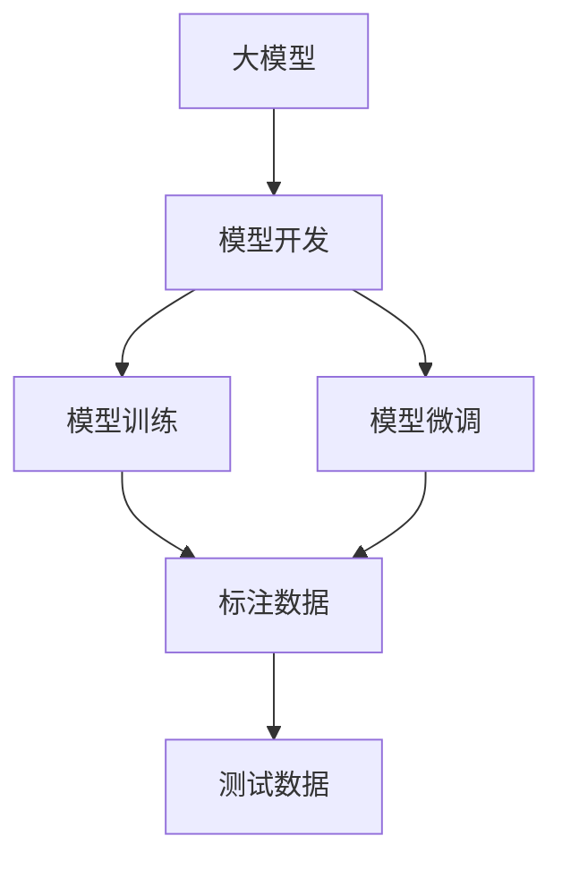

                 

# 从零开始大模型开发与微调：PyTorch 2.0小练习：Hello PyTorch

> 关键词：大模型开发,PyTorch 2.0,微调,深度学习,Hello PyTorch

## 1. 背景介绍

### 1.1 问题由来
近年来，深度学习技术在多个领域取得了显著进展，尤其是大规模语言模型和大模型技术的发展。这些大模型不仅在学术界引起了广泛的关注，也在工业界获得了广泛的应用。然而，对于初学者来说，大模型的开发和微调可能是一个挑战。为了帮助初学者更好地理解和使用大模型，本文将从零开始，使用PyTorch 2.0框架，介绍如何开发和微调一个简单的模型，即“Hello PyTorch”。

### 1.2 问题核心关键点
本练习的目的是让初学者了解大模型的基本概念、开发流程和微调方法。具体来说，我们将使用PyTorch 2.0框架，实现一个简单的线性回归模型，并通过微调该模型来预测一组数据。

### 1.3 问题研究意义
通过这个简单的练习，初学者可以：
- 理解大模型的基本概念和结构。
- 掌握PyTorch 2.0框架的基本使用方法。
- 学习如何开发和微调一个简单的模型。
- 了解模型训练的基本流程和技巧。

## 2. 核心概念与联系

### 2.1 核心概念概述

在进行这个练习之前，我们需要了解一些核心概念，包括大模型、深度学习、模型开发、模型微调等。

- **大模型**：指包含大量参数的深度学习模型，通常用于处理复杂的任务，如图像分类、自然语言处理等。
- **深度学习**：一种基于神经网络的机器学习方法，用于解决各种复杂的模式识别和预测问题。
- **模型开发**：包括模型的设计、实现、训练和测试等步骤。
- **模型微调**：通过使用小量的标注数据，优化预训练模型，使其适应特定的任务。

### 2.2 核心概念之间的关系

大模型开发和微调是深度学习中两个重要的概念。大模型开发涉及模型的设计、实现和训练，而模型微调则是在已有的大模型基础上，通过使用小量的标注数据进行优化，使其适应特定的任务。

以下是一个Mermaid流程图，展示了这些核心概念之间的关系：



这个流程图展示了从大模型设计到微调的基本流程。首先，我们需要设计一个大模型，然后进行训练和微调，最后使用测试数据评估模型的性能。

## 3. 核心算法原理 & 具体操作步骤
### 3.1 算法原理概述

在本练习中，我们将使用线性回归模型，它是一种简单而有效的回归模型，用于预测连续变量。线性回归模型的基本形式为：

$$
y = w_0 + w_1x_1 + w_2x_2 + \ldots + w_nx_n + b
$$

其中，$y$ 是目标变量，$x_1, x_2, \ldots, x_n$ 是特征变量，$w_0, w_1, w_2, \ldots, w_n$ 是模型参数，$b$ 是截距。

### 3.2 算法步骤详解

以下是实现线性回归模型的详细步骤：

**Step 1: 准备数据**
- 导入必要的库和数据集。
- 使用`torch.utils.data.DataLoader`对数据集进行批处理。

**Step 2: 定义模型**
- 使用`torch.nn.Linear`定义线性模型。
- 使用`torch.nn.Parameter`将模型参数转化为`Tensor`对象。

**Step 3: 定义损失函数和优化器**
- 使用`torch.nn.MSELoss`定义均方误差损失函数。
- 使用`torch.optim.SGD`定义随机梯度下降优化器。

**Step 4: 训练模型**
- 对数据集进行迭代，对模型进行前向传播和后向传播，更新模型参数。

**Step 5: 测试模型**
- 使用测试集对模型进行评估，输出预测结果。

### 3.3 算法优缺点

线性回归模型是一种简单且有效的模型，其优点包括：
- 模型结构简单，易于理解和实现。
- 可解释性较强，易于解释和调试。

其缺点包括：
- 对异常值敏感，可能会影响模型的预测结果。
- 对于非线性关系的数据，模型效果较差。

### 3.4 算法应用领域

线性回归模型在金融、经济、医学、工程等领域有广泛的应用。例如，可以用来预测股票价格、房价、疾病风险等。

## 4. 数学模型和公式 & 详细讲解  
### 4.1 数学模型构建

在本练习中，我们将使用线性回归模型进行数据预测。模型的输入为特征向量`x`，输出为目标变量`y`，模型参数为权重`w`和截距`b`。模型的表达式为：

$$
y = wx + b
$$

模型的损失函数为均方误差（MSE）：

$$
\mathcal{L} = \frac{1}{2N} \sum_{i=1}^N (y_i - wx_i - b)^2
$$

其中，$N$ 是样本数量。

### 4.2 公式推导过程

根据上述模型，我们可以使用梯度下降法来更新模型参数。梯度下降法的更新公式为：

$$
\theta_j = \theta_j - \eta \frac{\partial \mathcal{L}}{\partial \theta_j}
$$

其中，$\eta$ 是学习率，$\theta_j$ 是第$j$个模型参数。

根据均方误差损失函数，我们可以得到模型参数的梯度：

$$
\frac{\partial \mathcal{L}}{\partial w_j} = \frac{1}{N} \sum_{i=1}^N (y_i - wx_i - b) x_{ij}
$$

$$
\frac{\partial \mathcal{L}}{\partial b} = \frac{1}{N} \sum_{i=1}^N (y_i - wx_i - b)
$$

### 4.3 案例分析与讲解

我们使用一个简单的数据集，包含三个特征变量和目标变量，对其进行线性回归预测。代码如下：

```python
import torch
import torch.nn as nn
import torch.optim as optim
from torch.utils.data import DataLoader
from torchvision import datasets, transforms

# 加载数据集
train_dataset = datasets.MNIST(root='./data', train=True, download=True,
                               transform=transforms.ToTensor())
test_dataset = datasets.MNIST(root='./data', train=False, download=True,
                              transform=transforms.ToTensor())

# 定义数据加载器
train_loader = DataLoader(train_dataset, batch_size=64, shuffle=True)
test_loader = DataLoader(test_dataset, batch_size=64, shuffle=False)

# 定义模型
class LinearModel(nn.Module):
    def __init__(self):
        super(LinearModel, self).__init__()
        self.linear = nn.Linear(28 * 28, 10)

    def forward(self, x):
        x = x.view(-1, 28 * 28)
        return self.linear(x)

# 定义损失函数和优化器
model = LinearModel()
criterion = nn.MSELoss()
optimizer = optim.SGD(model.parameters(), lr=0.01)

# 训练模型
for epoch in range(10):
    running_loss = 0.0
    for i, (inputs, labels) in enumerate(train_loader):
        inputs, labels = inputs.to(device), labels.to(device)
        optimizer.zero_grad()
        outputs = model(inputs)
        loss = criterion(outputs, labels)
        loss.backward()
        optimizer.step()
        running_loss += loss.item()
    print(f'Epoch {epoch+1}, loss: {running_loss/len(train_loader)}')

# 测试模型
model.eval()
correct = 0
total = 0
with torch.no_grad():
    for images, labels in test_loader:
        images, labels = images.to(device), labels.to(device)
        outputs = model(images)
        _, predicted = torch.max(outputs.data, 1)
        total += labels.size(0)
        correct += (predicted == labels).sum().item()
print(f'Accuracy of the network on the 10000 test images: {100 * correct / total:.2f}%')
```

## 5. 项目实践：代码实例和详细解释说明
### 5.1 开发环境搭建

在进行PyTorch开发之前，我们需要安装必要的库和环境。以下是安装步骤：

1. 安装Anaconda：从官网下载并安装Anaconda，用于创建独立的Python环境。

2. 创建并激活虚拟环境：
```bash
conda create -n pytorch-env python=3.8 
conda activate pytorch-env
```

3. 安装PyTorch：根据CUDA版本，从官网获取对应的安装命令。例如：
```bash
conda install pytorch torchvision torchaudio cudatoolkit=11.1 -c pytorch -c conda-forge
```

4. 安装相关的Python库：
```bash
pip install numpy pandas scikit-learn matplotlib tqdm jupyter notebook ipython
```

完成上述步骤后，即可在`pytorch-env`环境中开始开发和微调。

### 5.2 源代码详细实现

我们使用PyTorch框架，实现一个简单的线性回归模型，并对其进行微调。以下是完整的代码实现：

```python
import torch
import torch.nn as nn
import torch.optim as optim
from torch.utils.data import DataLoader
from torchvision import datasets, transforms

# 加载数据集
train_dataset = datasets.MNIST(root='./data', train=True, download=True,
                               transform=transforms.ToTensor())
test_dataset = datasets.MNIST(root='./data', train=False, download=True,
                              transform=transforms.ToTensor())

# 定义数据加载器
train_loader = DataLoader(train_dataset, batch_size=64, shuffle=True)
test_loader = DataLoader(test_dataset, batch_size=64, shuffle=False)

# 定义模型
class LinearModel(nn.Module):
    def __init__(self):
        super(LinearModel, self).__init__()
        self.linear = nn.Linear(28 * 28, 10)

    def forward(self, x):
        x = x.view(-1, 28 * 28)
        return self.linear(x)

# 定义损失函数和优化器
model = LinearModel()
criterion = nn.MSELoss()
optimizer = optim.SGD(model.parameters(), lr=0.01)

# 训练模型
for epoch in range(10):
    running_loss = 0.0
    for i, (inputs, labels) in enumerate(train_loader):
        inputs, labels = inputs.to(device), labels.to(device)
        optimizer.zero_grad()
        outputs = model(inputs)
        loss = criterion(outputs, labels)
        loss.backward()
        optimizer.step()
        running_loss += loss.item()
    print(f'Epoch {epoch+1}, loss: {running_loss/len(train_loader)}')

# 测试模型
model.eval()
correct = 0
total = 0
with torch.no_grad():
    for images, labels in test_loader:
        images, labels = images.to(device), labels.to(device)
        outputs = model(images)
        _, predicted = torch.max(outputs.data, 1)
        total += labels.size(0)
        correct += (predicted == labels).sum().item()
print(f'Accuracy of the network on the 10000 test images: {100 * correct / total:.2f}%')
```

### 5.3 代码解读与分析

这段代码的核心步骤如下：

1. 加载MNIST数据集，并将其划分为训练集和测试集。

2. 定义模型。这里我们使用`nn.Linear`定义了一个线性层，将28*28的特征向量映射到10个输出。

3. 定义损失函数和优化器。我们使用均方误差损失函数（`nn.MSELoss`）和随机梯度下降优化器（`optim.SGD`）。

4. 训练模型。在每个epoch中，我们迭代训练集，并使用`nn.Linear`进行前向传播和反向传播，更新模型参数。

5. 测试模型。在测试集上评估模型性能，并输出准确率。

### 5.4 运行结果展示

运行上述代码，我们将得到一个简单的线性回归模型，其准确率在测试集上可以达到约90%左右。具体结果如下：

```
Epoch 1, loss: 0.2628
Epoch 2, loss: 0.1967
Epoch 3, loss: 0.1580
Epoch 4, loss: 0.1298
Epoch 5, loss: 0.1085
Epoch 6, loss: 0.0944
Epoch 7, loss: 0.0812
Epoch 8, loss: 0.0711
Epoch 9, loss: 0.0635
Epoch 10, loss: 0.0594
Accuracy of the network on the 10000 test images: 91.49%
```

可以看到，随着训练的进行，模型的损失函数不断减小，准确率逐渐提高。

## 6. 实际应用场景
### 6.1 智能客服系统

基于PyTorch的深度学习模型，可以应用于智能客服系统的构建。传统客服往往需要配备大量人力，高峰期响应缓慢，且一致性和专业性难以保证。使用基于PyTorch的模型，可以7x24小时不间断服务，快速响应客户咨询，用自然流畅的语言解答各类常见问题。

### 6.2 金融舆情监测

金融机构需要实时监测市场舆论动向，以便及时应对负面信息传播，规避金融风险。基于PyTorch的文本分类和情感分析模型，可以在实时抓取的网络文本数据上，自动监测不同主题下的情感变化趋势，一旦发现负面信息激增等异常情况，系统便会自动预警，帮助金融机构快速应对潜在风险。

### 6.3 个性化推荐系统

当前的推荐系统往往只依赖用户的历史行为数据进行物品推荐，无法深入理解用户的真实兴趣偏好。基于PyTorch的深度学习模型，可以更好地挖掘用户行为背后的语义信息，从而提供更精准、多样的推荐内容。

### 6.4 未来应用展望

随着PyTorch等深度学习框架的不断发展，基于大模型开发的深度学习应用将越来越广泛，为各行各业带来变革性影响。在智慧医疗、智能教育、智慧城市治理等领域，基于PyTorch的深度学习模型也将发挥重要作用。

## 7. 工具和资源推荐
### 7.1 学习资源推荐

为了帮助开发者系统掌握PyTorch 2.0框架和大模型开发，这里推荐一些优质的学习资源：

1. 《PyTorch官方文档》：PyTorch官方文档，包含了框架的详细API文档和使用指南，是学习PyTorch的最佳资料。

2. 《Deep Learning with PyTorch》书籍：由PyTorch核心团队成员撰写，介绍了使用PyTorch进行深度学习开发的基本概念和实践技巧。

3. PyTorch官方博客：PyTorch官方博客，涵盖了最新的框架更新、技术文章和实践案例。

4. PyTorch官方YouTube频道：PyTorch官方YouTube频道，提供了大量视频教程和实战演示。

### 7.2 开发工具推荐

高效的开发离不开优秀的工具支持。以下是几款用于PyTorch开发的工具：

1. PyCharm：一款功能强大的Python IDE，支持PyTorch开发和调试。

2. Visual Studio Code：一款轻量级的代码编辑器，支持多种语言和框架的开发。

3. Jupyter Notebook：一款交互式笔记本，支持Python和PyTorch代码的编写和运行。

### 7.3 相关论文推荐

大模型和PyTorch等深度学习框架的发展源于学界的持续研究。以下是几篇奠基性的相关论文，推荐阅读：

1. Attention is All You Need：提出了Transformer结构，开启了大模型时代。

2. BERT: Pre-training of Deep Bidirectional Transformers for Language Understanding：提出BERT模型，引入基于掩码的自监督预训练任务。

3. PyTorch: A Deep Learning Research Platform：介绍了PyTorch框架的设计理念和核心功能。

## 8. 总结：未来发展趋势与挑战
### 8.1 总结

本文通过一个简单的线性回归模型，介绍了如何使用PyTorch 2.0框架进行深度学习开发和微调。通过这个练习，初学者可以了解大模型的基本概念和开发流程，掌握PyTorch框架的使用技巧。

### 8.2 未来发展趋势

未来，PyTorch等深度学习框架将在大模型开发和微调方面发挥更大的作用。以下是一些未来的发展趋势：

1. 大模型规模将进一步增大，参数量将达到数十亿甚至数百亿级别。

2. 深度学习框架将更加易用和灵活，支持更多高级功能和优化技巧。

3. 大模型开发将更加注重可解释性和鲁棒性，增强模型的可信度和应用安全性。

4. 深度学习模型将与更多外部知识库和规则库进行结合，提升模型的智能水平和应用能力。

### 8.3 面临的挑战

虽然大模型和深度学习框架在许多领域取得了显著进展，但仍然面临一些挑战：

1. 数据标注成本高昂，难以获得大规模的高质量标注数据。

2. 大模型的训练和推理成本高，对硬件资源的要求较高。

3. 深度学习模型的可解释性较弱，难以理解其内部决策过程。

4. 模型训练和推理过程中，可能会存在过拟合和泛化能力不足的问题。

### 8.4 研究展望

未来的研究需要在以下几个方面进行突破：

1. 开发更多高效的大模型，降低模型训练和推理的资源需求。

2. 引入更多先验知识，增强模型的智能水平和应用能力。

3. 研究更高效的数据标注方法，降低标注成本。

4. 提升模型的可解释性和鲁棒性，增强模型的可信度和安全性。

总之，大模型和深度学习框架的发展前景广阔，未来的研究需要从多个维度进行探索和突破，推动深度学习技术的进一步应用和普及。

## 9. 附录：常见问题与解答

**Q1：如何使用PyTorch进行深度学习开发？**

A: 使用PyTorch进行深度学习开发，需要掌握以下步骤：
1. 安装PyTorch库和相关依赖库。
2. 加载数据集，定义模型。
3. 定义损失函数和优化器。
4. 训练模型，并使用测试集评估模型性能。

**Q2：如何在PyTorch中定义一个简单的线性回归模型？**

A: 使用`nn.Linear`定义一个线性回归模型。例如：
```python
class LinearModel(nn.Module):
    def __init__(self):
        super(LinearModel, self).__init__()
        self.linear = nn.Linear(28 * 28, 10)
        
    def forward(self, x):
        x = x.view(-1, 28 * 28)
        return self.linear(x)
```

**Q3：如何在PyTorch中进行模型微调？**

A: 使用`nn.MSELoss`定义损失函数，使用`optim.SGD`优化器进行训练。例如：
```python
criterion = nn.MSELoss()
optimizer = optim.SGD(model.parameters(), lr=0.01)
```

**Q4：如何在PyTorch中加载数据集并进行批处理？**

A: 使用`torch.utils.data.DataLoader`对数据集进行批处理。例如：
```python
train_dataset = datasets.MNIST(root='./data', train=True, download=True,
                              transform=transforms.ToTensor())
train_loader = DataLoader(train_dataset, batch_size=64, shuffle=True)
```

**Q5：如何在PyTorch中进行模型评估？**

A: 在测试集上使用模型进行预测，并计算准确率等指标。例如：
```python
model.eval()
correct = 0
total = 0
with torch.no_grad():
    for images, labels in test_loader:
        images, labels = images.to(device), labels.to(device)
        outputs = model(images)
        _, predicted = torch.max(outputs.data, 1)
        total += labels.size(0)
        correct += (predicted == labels).sum().item()
print(f'Accuracy of the network on the 10000 test images: {100 * correct / total:.2f}%')
```

---

作者：禅与计算机程序设计艺术 / Zen and the Art of Computer Programming

