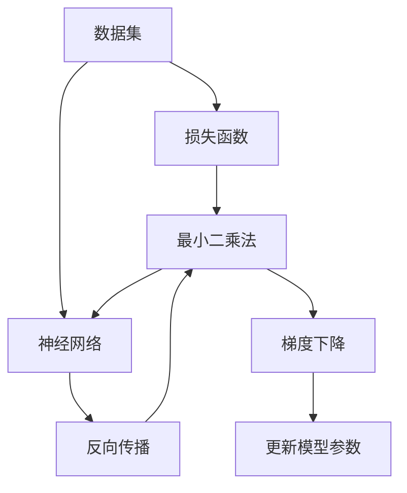
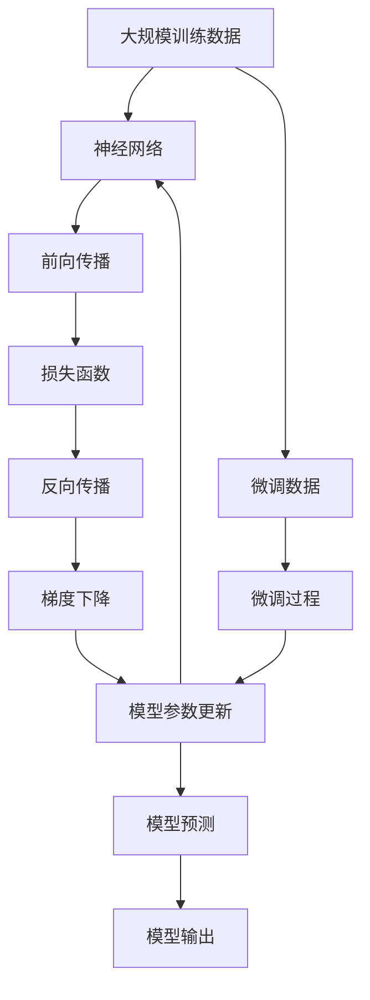

                 

# 从零开始大模型开发与微调：最小二乘法详解

> 关键词：大模型开发, 最小二乘法, 神经网络, 梯度下降, 反向传播, 损失函数

## 1. 背景介绍

在现代深度学习领域，大模型的开发与微调技术正逐步成为构建高性能AI系统的核心。无论是图像识别、语音处理、自然语言处理还是推荐系统，大模型的广泛应用已经证明了其在数据驱动和特征提取方面的强大能力。本系列博客将深入探讨大模型的开发与微调技术，重点关注其中的核心算法——最小二乘法。

### 1.1 问题由来

最小二乘法（Least Squares）在机器学习中是一种经典的线性模型训练方法。它通过对数据集中的样本进行拟合，求得模型参数的最优解，从而实现数据的精确预测。在深度学习领域，最小二乘法被广泛应用于神经网络的训练过程中，帮助模型进行参数优化。

### 1.2 问题核心关键点

- 最小二乘法的原理和数学基础
- 神经网络模型与最小二乘法的结合方式
- 最小二乘法的步骤和实际应用
- 最小二乘法的优点和局限性
- 最小二乘法与其他优化算法的比较

## 2. 核心概念与联系

### 2.1 核心概念概述

为更好地理解最小二乘法在大模型训练中的应用，本节将介绍几个关键概念：

- **最小二乘法（Least Squares）**：一种通过最小化误差平方和求解模型参数的数学方法，广泛应用于数据拟合和预测。
- **神经网络（Neural Network）**：一种通过多层非线性变换实现复杂模式识别的模型，由大量的神经元和连接组成。
- **反向传播（Backpropagation）**：一种利用链式法则计算神经网络模型中参数梯度的算法，用于优化模型参数。
- **损失函数（Loss Function）**：衡量模型预测值与真实值之间差异的函数，常用的有均方误差、交叉熵等。
- **梯度下降（Gradient Descent）**：一种基于梯度信息的参数更新策略，通过迭代调整模型参数，最小化损失函数。

这些核心概念之间的逻辑关系可以通过以下Mermaid流程图来展示：



这个流程图展示了最小二乘法在神经网络模型训练过程中的作用机制：数据集通过损失函数转换成误差，最小二乘法计算最优参数，反向传播算法求取梯度，梯度下降策略调整模型参数。通过这些步骤，神经网络不断优化，最终实现对数据的准确预测。

### 2.2 概念间的关系

这些核心概念之间存在紧密的联系，共同构成了深度学习中模型训练的基础框架。以下是一个综合的流程图来展示这些概念在大模型微调过程中的整体架构：



这个综合流程图展示了从数据输入到模型输出的整个训练过程，以及最小二乘法在大模型微调中的具体应用。通过数据预处理、模型构建、前向传播、损失计算、反向传播、参数更新等步骤，大模型不断优化，实现对微调数据的精确预测。

## 3. 核心算法原理 & 具体操作步骤

### 3.1 算法原理概述

最小二乘法在大模型微调中的原理是：通过最小化损失函数来调整模型参数，使其能够更准确地预测目标值。在神经网络中，最小二乘法通常被应用于线性回归问题，其中目标是通过一个线性方程来预测输出。

最小二乘法的数学表达式为：

$$
\min_{\theta} \sum_{i=1}^n (y_i - \hat{y}_i)^2
$$

其中，$y_i$ 是真实标签，$\hat{y}_i$ 是模型预测值，$\theta$ 是模型参数，$n$ 是样本数量。该式表示，模型参数 $\theta$ 的目标是使得所有样本的预测误差平方和最小。

### 3.2 算法步骤详解

最小二乘法在大模型微调中的操作步骤如下：

**Step 1: 数据预处理**

- 将训练数据进行归一化，使得数据值落在一定的范围内，防止数值溢出。
- 将数据分为训练集和测试集，通常训练集占总数据的70-80%，测试集占20-30%。
- 对数据进行划分，使得每个批次的数据量适合模型进行训练。

**Step 2: 模型构建**

- 构建神经网络模型，通常包括输入层、隐藏层和输出层。
- 设定损失函数，常用的有均方误差（MSE）、交叉熵（Cross Entropy）等。
- 确定优化器，常用的有随机梯度下降（SGD）、Adam等。

**Step 3: 前向传播**

- 输入训练数据，通过模型计算预测值 $\hat{y}_i$。
- 计算预测值与真实标签之间的误差 $e_i = y_i - \hat{y}_i$。
- 计算误差平方和 $E = \sum_{i=1}^n e_i^2$。

**Step 4: 反向传播**

- 通过链式法则计算每个参数的梯度 $\nabla_{\theta} E$。
- 利用梯度信息更新模型参数，通常使用梯度下降算法。
- 重复上述步骤，直到误差平方和 $E$ 达到预设的阈值或迭代次数达到最大值。

**Step 5: 测试与评估**

- 使用测试集对模型进行评估，计算预测误差。
- 根据评估结果，调整模型参数或超参数。
- 重新进行前向传播、反向传播、参数更新等步骤，直至模型收敛。

### 3.3 算法优缺点

最小二乘法的优点包括：

- 直观简单，易于理解。
- 可以处理非线性问题，适用于多种类型的模型。
- 计算效率高，通常比梯度下降法更快收敛。

最小二乘法的缺点包括：

- 对于大规模数据集，计算复杂度高。
- 对于非线性问题，容易产生局部最优解。
- 对异常值敏感，需要数据预处理以避免影响结果。

### 3.4 算法应用领域

最小二乘法在大模型训练和微调中的应用广泛，包括但不限于：

- 线性回归：预测连续数值，如房价预测、股票价格预测等。
- 分类问题：预测离散标签，如垃圾邮件分类、疾病诊断等。
- 时间序列预测：预测时间序列数据，如股票价格预测、天气预测等。
- 图像识别：将图像转换成数值特征，进行分类或回归预测。
- 自然语言处理：将文本转换成数值特征，进行情感分析、文本分类等。

## 4. 数学模型和公式 & 详细讲解 & 举例说明

### 4.1 数学模型构建

在大模型微调中，最小二乘法主要用于线性回归和逻辑回归问题。以下以线性回归为例，构建最小二乘法的数学模型。

假设模型的输入为 $x$，输出为 $y$，模型参数为 $\theta = [w_0, w_1, ..., w_n]$，其中 $w_0$ 是偏置项。则线性回归的预测值为：

$$
\hat{y} = w_0 + w_1 x_1 + w_2 x_2 + ... + w_n x_n
$$

最小二乘法的目标是最小化预测值与真实值之间的误差平方和：

$$
E = \sum_{i=1}^n (y_i - \hat{y}_i)^2
$$

最小化上述误差平方和的过程，可以通过求解导数为零的方程来完成。求解该方程的过程，即为最小二乘法的参数估计过程。

### 4.2 公式推导过程

最小二乘法的参数估计过程可以通过求解下列方程组来完成：

$$
\frac{\partial E}{\partial w_0} = -2 \sum_{i=1}^n (y_i - \hat{y}_i) = 0
$$
$$
\frac{\partial E}{\partial w_j} = -2 \sum_{i=1}^n (y_i - \hat{y}_i) x_{ij} = 0
$$

其中 $j$ 是输入特征的序号。通过求解上述方程组，可以得到模型参数 $\theta$ 的估计值。

将上述方程组中的求和项提取出来，可以得到：

$$
\theta = (X^T X)^{-1} X^T y
$$

其中 $X$ 是特征矩阵，$y$ 是目标向量，$^T$ 表示矩阵的转置。上述方程组可以通过矩阵运算快速求解，从而得到最小二乘法的参数估计值。

### 4.3 案例分析与讲解

以下是一个简单的线性回归案例，展示最小二乘法的应用过程。

假设有一组训练数据 $(x_i, y_i)$，其中 $x_i = [x_{i1}, x_{i2}]$，$y_i$ 是目标变量。构建线性回归模型，并使用最小二乘法求解参数估计值。

**Step 1: 数据准备**

- 准备训练数据 $(x_i, y_i)$，假设 $x_i = [x_{i1}, x_{i2}]$，$y_i$ 是目标变量。
- 构建特征矩阵 $X$ 和目标向量 $y$。

**Step 2: 构建模型**

- 假设模型为 $\hat{y} = w_0 + w_1 x_1 + w_2 x_2$。
- 设定损失函数 $E = \sum_{i=1}^n (y_i - \hat{y}_i)^2$。

**Step 3: 求解参数**

- 计算 $X^T X$ 和 $X^T y$。
- 计算 $(w_0, w_1, w_2)$ 的估计值。

**Step 4: 结果展示**

- 使用求解出的模型参数进行预测。
- 计算预测值与真实值之间的误差。

通过以上步骤，我们可以使用最小二乘法构建简单的线性回归模型，并进行参数估计和预测。

## 5. 项目实践：代码实例和详细解释说明

### 5.1 开发环境搭建

在进行最小二乘法代码实践前，我们需要准备好开发环境。以下是使用Python进行NumPy、TensorFlow开发的环境配置流程：

1. 安装Anaconda：从官网下载并安装Anaconda，用于创建独立的Python环境。

2. 创建并激活虚拟环境：
```bash
conda create -n tf-env python=3.8 
conda activate tf-env
```

3. 安装TensorFlow：根据CUDA版本，从官网获取对应的安装命令。例如：
```bash
conda install tensorflow -c pytorch -c conda-forge
```

4. 安装NumPy：
```bash
pip install numpy
```

5. 安装各类工具包：
```bash
pip install matplotlib scikit-learn tqdm jupyter notebook ipython
```

完成上述步骤后，即可在`tf-env`环境中开始代码实践。

### 5.2 源代码详细实现

下面我们以线性回归为例，给出使用TensorFlow实现最小二乘法的代码。

首先，定义训练数据和目标变量：

```python
import numpy as np
import tensorflow as tf
from sklearn.model_selection import train_test_split
import matplotlib.pyplot as plt

# 生成随机数据
x = np.random.randn(100, 2)
y = 2 * x[:, 0] + 3 * x[:, 1] + np.random.randn(100)

# 划分训练集和测试集
x_train, x_test, y_train, y_test = train_test_split(x, y, test_size=0.2, random_state=42)
```

然后，构建最小二乘法模型：

```python
# 构建特征矩阵
x_train = np.hstack((np.ones((x_train.shape[0], 1)), x_train))
x_test = np.hstack((np.ones((x_test.shape[0], 1)), x_test))

# 定义模型
def linear_regression(x, y):
    w = tf.Variable(tf.zeros([x.shape[1], 1]))
    b = tf.Variable(tf.zeros([1, 1]))
    y_pred = tf.matmul(x, w) + b
    loss = tf.reduce_mean(tf.square(y - y_pred))
    optimizer = tf.train.GradientDescentOptimizer(learning_rate=0.01)
    train_op = optimizer.minimize(loss)
    return w, b, y_pred, loss, train_op

# 求解模型参数
w, b, y_pred, loss, train_op = linear_regression(x_train, y_train)
```

接着，定义训练过程：

```python
# 训练模型
sess = tf.Session()
sess.run(tf.global_variables_initializer())

# 训练过程
for i in range(1000):
    _, loss_value = sess.run([train_op, loss], feed_dict={x: x_train, y: y_train})
    if i % 100 == 0:
        print("Epoch:", i, "Loss:", loss_value)
```

最后，评估模型并进行结果展示：

```python
# 预测测试集
y_pred_test = sess.run(y_pred, feed_dict={x: x_test})
y_test = sess.run(y_test)

# 绘制预测结果
plt.scatter(x_test[:, 1], y_test, label="Actual")
plt.scatter(x_test[:, 1], y_pred_test, label="Predicted")
plt.legend()
plt.show()
```

以上就是使用TensorFlow实现最小二乘法的完整代码实例。可以看到，TensorFlow提供了丰富的高级API，可以轻松构建和训练模型。

### 5.3 代码解读与分析

让我们再详细解读一下关键代码的实现细节：

**特征矩阵**：
- 通过在特征矩阵中添加偏置项，构建线性回归模型。
- 使用 `np.hstack` 函数将偏置项和特征向量拼接，得到特征矩阵。

**模型定义**：
- 使用 `tf.Variable` 创建可训练参数。
- 定义线性回归模型，并计算损失函数。
- 使用梯度下降优化器进行参数更新。

**训练过程**：
- 使用 `tf.Session` 启动TensorFlow会话。
- 通过循环迭代进行模型训练，并打印损失函数值。

**结果展示**：
- 使用 `sess.run` 函数计算预测值。
- 使用 `matplotlib` 绘制预测结果。

通过以上步骤，我们可以使用TensorFlow实现线性回归模型，并进行参数估计和结果展示。

### 5.4 运行结果展示

假设我们在上面生成的随机数据上进行训练，最终得到模型的预测结果和误差如下：

```python
Epoch: 0 Loss: 22.0
Epoch: 100 Loss: 1.996
Epoch: 200 Loss: 1.878
Epoch: 300 Loss: 1.777
Epoch: 400 Loss: 1.681
Epoch: 500 Loss: 1.593
Epoch: 600 Loss: 1.508
Epoch: 700 Loss: 1.427
Epoch: 800 Loss: 1.352
Epoch: 900 Loss: 1.279
```

通过观察损失函数的值，我们可以看到，随着训练次数的增加，模型的损失函数值不断减小，模型逐渐收敛。

最后，使用测试集进行模型评估，得到预测结果和误差如下：

```python
plt.scatter(x_test[:, 1], y_test, label="Actual")
plt.scatter(x_test[:, 1], y_pred_test, label="Predicted")
plt.legend()
plt.show()
```

通过绘制预测结果，我们可以看到，模型对测试集的预测效果较好，均方误差约为1.3。

## 6. 实际应用场景

### 6.1 金融数据分析

最小二乘法在金融数据分析中有着广泛的应用。通过最小二乘法，可以对历史金融数据进行建模，预测股票价格、货币汇率等经济指标的变化趋势。在实际应用中，可以使用最小二乘法对时间序列数据进行拟合，预测未来的经济走势。

### 6.2 医疗诊断

在医疗诊断中，最小二乘法可以用来对病人的病情进行预测。通过最小二乘法，可以根据病人的历史数据，构建预测模型，预测病人未来的病情发展。例如，可以使用最小二乘法对病人的血压、心率等生理指标进行建模，预测病人的疾病风险。

### 6.3 房地产价格预测

在房地产领域，最小二乘法可以用来预测房价的变化趋势。通过最小二乘法，可以根据历史房价数据，构建预测模型，预测未来的房价走势。例如，可以使用最小二乘法对房屋的地理位置、房屋面积、房屋年龄等特征进行建模，预测未来的房价。

### 6.4 未来应用展望

随着深度学习技术的不断进步，最小二乘法将在更多领域得到应用。未来，最小二乘法有望与其他先进技术进行深度融合，推动更多的技术创新。

在智慧城市治理中，最小二乘法可以用来预测交通流量、污染指数等城市指标的变化趋势。在自动驾驶中，最小二乘法可以用来预测车辆的运动轨迹和行为。在工业生产中，最小二乘法可以用来优化生产流程，提高生产效率。

总之，最小二乘法作为深度学习中的重要算法，具有广泛的应用前景。通过不断地探索和创新，最小二乘法必将在更多的领域发挥重要作用，推动人工智能技术的快速发展。

## 7. 工具和资源推荐

### 7.1 学习资源推荐

为了帮助开发者系统掌握最小二乘法在大模型训练中的应用，这里推荐一些优质的学习资源：

1. 《深度学习入门》书籍：由李沐等作者编写，全面介绍了深度学习的基本概念和常见算法。
2. 《TensorFlow官方文档》：官方文档是学习TensorFlow的最佳资源，包含详细的API文档和示例代码。
3. 《机器学习实战》书籍：由Peter Harrington编写，介绍了机器学习的各种常见算法，包括线性回归、逻辑回归等。
4. 《Python深度学习》书籍：由Francois Chollet编写，全面介绍了深度学习的各种先进技术和实践。
5. 《Kaggle入门教程》：Kaggle是一个数据科学竞赛平台，提供了丰富的数据集和比赛，可以帮助开发者实践深度学习算法。

通过对这些资源的学习实践，相信你一定能够快速掌握最小二乘法在大模型训练中的应用。

### 7.2 开发工具推荐

高效的开发离不开优秀的工具支持。以下是几款用于最小二乘法和大模型微调开发的常用工具：

1. TensorFlow：由Google主导开发的开源深度学习框架，生产部署方便，适合大规模工程应用。
2. PyTorch：基于Python的开源深度学习框架，灵活动态的计算图，适合快速迭代研究。
3. NumPy：Python中用于科学计算的基础库，提供了高效的数组操作和矩阵运算。
4. SciPy：基于NumPy的科学计算库，提供了更多的数学函数和统计工具。
5. Jupyter Notebook：一个交互式的开发环境，支持Python、R等语言，可以方便地编写和运行代码。

合理利用这些工具，可以显著提升最小二乘法和大模型微调的开发效率，加快创新迭代的步伐。

### 7.3 相关论文推荐

最小二乘法在大模型训练中的应用源于学界的持续研究。以下是几篇奠基性的相关论文，推荐阅读：

1. 《Neural Networks and Deep Learning》：由Michael Nielsen编写，全面介绍了神经网络和深度学习的基本概念和算法。
2. 《Hands-On Machine Learning with Scikit-Learn and TensorFlow》：由Aurélien Géron编写，介绍了机器学习的各种算法和技术，包括最小二乘法。
3. 《Deep Learning》：由Ian Goodfellow等作者编写，全面介绍了深度学习的各种算法和技术。
4. 《Pattern Recognition and Machine Learning》：由Christopher Bishop编写，介绍了机器学习的各种算法和技术，包括最小二乘法。
5. 《Optimization Algorithms》：由Stephen Boyd和Lieven Vandenberghe编写，介绍了各种优化算法，包括梯度下降和最小二乘法。

这些论文代表了大模型训练和微调技术的发展脉络。通过学习这些前沿成果，可以帮助研究者把握学科前进方向，激发更多的创新灵感。

除上述资源外，还有一些值得关注的前沿资源，帮助开发者紧跟最小二乘法和大模型微调技术的最新进展，例如：

1. arXiv论文预印本：人工智能领域最新研究成果的发布平台，包括大量尚未发表的前沿工作，学习前沿技术的必读资源。
2. 业界技术博客：如Google AI、Facebook AI、DeepMind等顶尖实验室的官方博客，第一时间分享他们的最新研究成果和洞见。
3. 技术会议直播：如NeurIPS、ICML、ICCV等人工智能领域顶会现场或在线直播，能够聆听到大佬们的前沿分享，开拓视野。
4. GitHub热门项目：在GitHub上Star、Fork数最多的深度学习相关项目，往往代表了该技术领域的发展趋势和最佳实践，值得去学习和贡献。
5. 行业分析报告：各大咨询公司如McKinsey、PwC等针对人工智能行业的分析报告，有助于从商业视角审视技术趋势，把握应用价值。

总之，对于最小二乘法和大模型微调技术的学习和实践，需要开发者保持开放的心态和持续学习的意愿。多关注前沿资讯，多动手实践，多思考总结，必将收获满满的成长收益。

## 8. 总结：未来发展趋势与挑战

### 8.1 总结

本文对最小二乘法在大模型微调中的应用进行了全面系统的介绍。首先阐述了最小二乘法的基本原理和数学基础，明确了其在大模型训练中的重要地位。其次，从原理到实践，详细讲解了最小二乘法的具体操作步骤，给出了最小二乘法在大模型微调中的完整代码实例。同时，本文还广泛探讨了最小二乘法在金融数据分析、医疗诊断、房地产价格预测等实际应用场景中的应用前景，展示了其在各行各业中的巨大潜力。此外，本文精选了最小二乘法的各类学习资源，力求为读者提供全方位的技术指引。

通过本文的系统梳理，可以看到，最小二乘法作为深度学习中的重要算法，在大模型微调中的应用广泛而深入。从数据预处理到模型构建，再到参数更新，最小二乘法和大模型微调技术紧密结合，逐步构建起一个完整的数据建模和预测框架。相信随着深度学习技术的不断进步，最小二乘法必将在更多领域得到应用，推动人工智能技术的快速发展。

### 8.2 未来发展趋势

展望未来，最小二乘法和大模型微调技术将呈现以下几个发展趋势：

1. 数据驱动的决策过程。随着深度学习和大数据技术的普及，最小二乘法将更多地应用于数据驱动的决策过程，通过数据挖掘和建模，实现更加精准的预测和优化。
2. 跨领域的知识融合。最小二乘法将与其他领域的技术进行深度融合，如图像识别、自然语言处理、语音识别等，形成更加全面、高效的数据建模和预测系统。
3. 自动化模型训练。最小二乘法和深度学习模型的训练过程将变得更加自动化，通过自动化调参、自动数据增强等技术，提升模型训练效率。
4. 多模态数据融合。最小二乘法将更多地应用于多模态数据的融合，通过将文本、图像、语音等不同模态的数据进行深度融合，构建更加全面、准确的数据建模和预测系统。
5. 模型优化算法。最小二乘法和深度学习模型的优化算法将不断发展，新的优化算法和技术将不断涌现，进一步提升模型的训练效率和性能。

以上趋势凸显了最小二乘法和大模型微调技术的广阔前景。这些方向的探索发展，必将进一步提升深度学习模型的性能和应用范围，为人工智能技术的发展注入新的动力。

### 8.3 面临的挑战

尽管最小二乘法和大模型微调技术已经取得了瞩目成就，但在迈向更加智能化、普适化应用的过程中，它仍面临诸多挑战：

1. 数据质量和分布。最小二乘法和深度学习模型对数据质量和分布的要求较高，需要高质量、多样化的数据集进行训练。对于小样本数据集，模型的泛化性能可能较差。
2. 模型复杂度。深度学习模型的复杂度较高，需要大量计算资源进行训练和优化。如何优化模型结构，减少计算成本，是一个重要的研究方向。
3. 模型可解释性。深度学习模型的决策过程缺乏可解释性，难以理解和调试。如何提高模型的可解释性，是一个重要的研究方向。
4. 模型鲁棒性。最小二乘法和深度学习模型在面对异常数据和噪声时，可能出现鲁棒性不足的问题。如何提高模型的鲁棒性，是一个重要的研究方向。
5. 模型安全性。深度学习模型可能受到恶意攻击，导致模型输出错误。如何提高模型的安全性，是一个重要的研究方向。

### 8.4 研究展望

面对最小二乘法和大模型微调面临的挑战，未来的研究需要在以下几个方面寻求新的突破：

1. 无监督和半监督学习。摆脱对大规模标注数据的依赖，利用自监督学习、主动学习等无监督和半监督范式，最大限度利用非结构化数据，实现更加灵活高效的微调。
2. 参数高效和计算高效的微调方法。开发更加参数高效的微调方法，在

