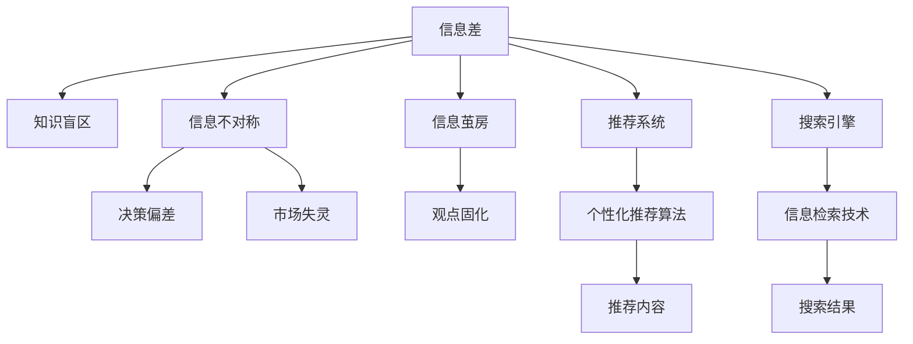
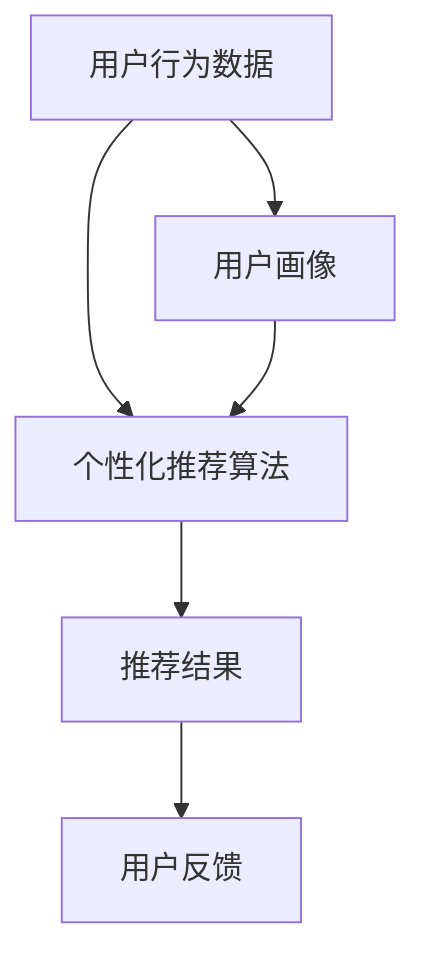
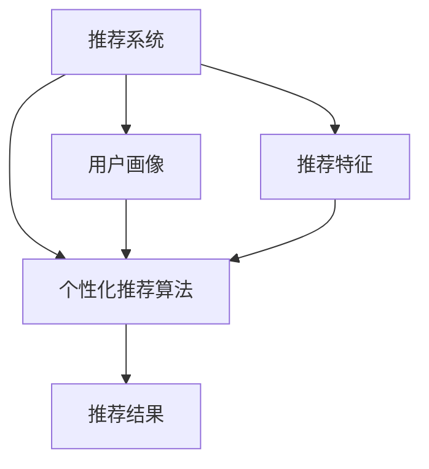
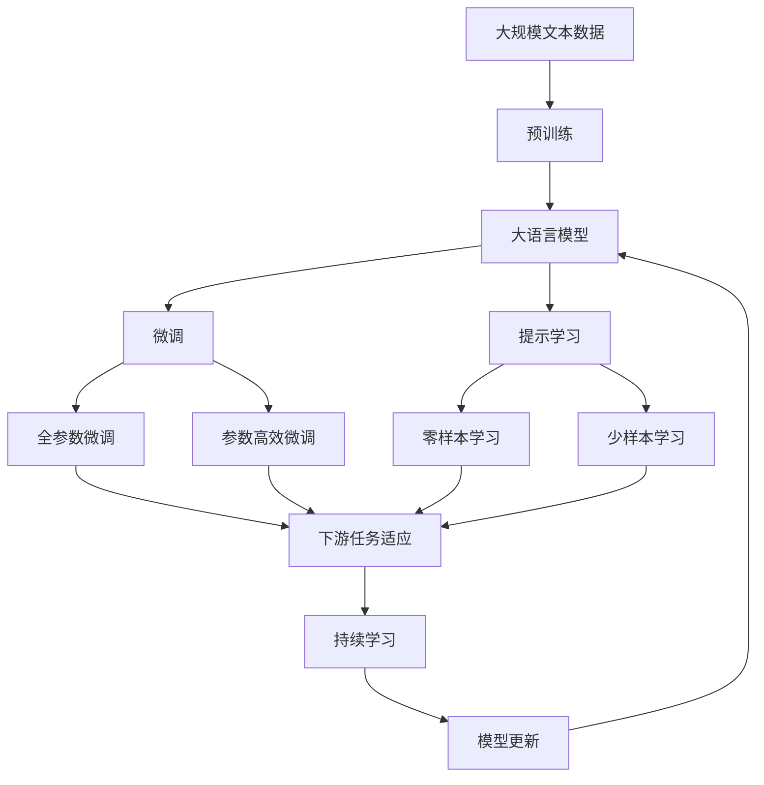

                 

# 信息差：我知道的，你不知道

> 关键词：信息差，知识盲区，信息不对称，信息茧房，智能推荐系统，搜索引擎，个性化推荐算法

## 1. 背景介绍

### 1.1 问题由来
在当今信息爆炸的时代，信息的洪流涌向我们，充斥着我们的日常生活。每个人接收的信息量是前所未有的庞大，但与此同时，我们每个人所知道的信息却是有限的，这便形成了所谓的“信息差”。信息差指的是个体或组织在获取、处理、应用信息时存在的差距。这种差距不仅存在于人与人的比较中，也存在于人与机器（算法）之间。

### 1.2 问题核心关键点
信息差是人工智能领域，特别是推荐系统和搜索引擎中至关重要的一个概念。信息差的存在，导致推荐系统可能无法准确理解用户的需求，搜索引擎可能无法全面获取用户的查询意图。因此，如何缩小信息差，成为提升推荐系统效果和用户体验的关键。

### 1.3 问题研究意义
研究信息差对于提升推荐系统、搜索引擎的智能水平具有重要意义：

1. **提升信息获取效率**：缩小信息差意味着更好地理解用户需求，从而提供更准确、更个性化的信息。
2. **降低信息不对称**：帮助用户获取到自己原本不知道的有价值信息，提升决策质量。
3. **克服信息茧房**：避免用户陷入单一的信息来源和观点，提供多样化的信息视角。
4. **促进知识共享**：帮助用户发现并掌握更多领域的知识，促进知识的社会共享和创新。
5. **增强算法公正性**：减少算法偏见，确保用户获得公平的信息。

## 2. 核心概念与联系

### 2.1 核心概念概述

为更好地理解信息差，本节将介绍几个密切相关的核心概念：

- **信息差（Information Gap）**：指个体或组织在获取、处理、应用信息时存在的差距。信息差可以分为个体间的信息差和个体与系统间的信息差。
- **知识盲区（Knowledge Blind Spot）**：个体或系统在特定领域或问题上所欠缺的知识或信息。
- **信息不对称（Information Asymmetry）**：指交易双方对所掌握信息的不对等，可能导致决策偏差和市场失灵。
- **信息茧房（Information Echo Chamber）**：指个体接触到的信息范围狭窄，只接受符合自己既有观念的信息，导致观点固化。
- **推荐系统（Recommendation System）**：通过分析用户行为和偏好，为用户推荐合适信息或产品。
- **搜索引擎（Search Engine）**：通过索引和检索技术，快速定位和返回相关信息。
- **个性化推荐算法（Personalized Recommendation Algorithms）**：根据用户历史行为和偏好，动态调整推荐内容。

这些核心概念之间的逻辑关系可以通过以下Mermaid流程图来展示：



这个流程图展示了大语言模型微调过程中各个核心概念的关系和作用：

1. 信息差的存在，导致知识盲区和信息不对称。
2. 信息茧房可能加剧信息差。
3. 推荐系统和搜索引擎通过个性化推荐算法解决信息差问题。
4. 搜索引擎依赖信息检索技术返回相关结果。

### 2.2 概念间的关系

这些核心概念之间存在着紧密的联系，形成了推荐系统和搜索引擎的完整生态系统。下面通过几个Mermaid流程图来展示这些概念之间的关系。

#### 2.2.1 推荐系统的基本原理



这个流程图展示了推荐系统的基本原理：
- 收集用户行为数据。
- 使用个性化推荐算法生成推荐结果。
- 用户反馈进一步优化算法。
- 构建用户画像，辅助推荐过程。

#### 2.2.2 搜索引擎的核心组件


这个流程图展示了搜索引擎的核心组件：
- 用户输入查询。
- 检索索引库，获取相关网页。
- 展示搜索结果。

#### 2.2.3 推荐算法与搜索引擎的区别



这个流程图展示了推荐算法与搜索引擎的区别：
- 推荐系统生成推荐结果，而搜索引擎返回搜索结果。
- 推荐算法依赖用户画像和推荐特征，而搜索引擎依赖索引库和检索算法。

### 2.3 核心概念的整体架构

最后，我们用一个综合的流程图来展示这些核心概念在大语言模型微调过程中的整体架构：



这个综合流程图展示了从预训练到微调，再到持续学习的完整过程。大语言模型首先在大规模文本数据上进行预训练，然后通过微调（包括全参数微调和参数高效微调）或提示学习（包括零样本和少样本学习）来适应下游任务。最后，通过持续学习技术，模型可以不断学习新知识，同时避免遗忘旧知识。 通过这些流程图，我们可以更清晰地理解大语言模型微调过程中各个核心概念的关系和作用。

## 3. 核心算法原理 & 具体操作步骤
### 3.1 算法原理概述

基于信息差的推荐系统（包括推荐系统和搜索引擎）本质上是一个信息匹配和反馈优化的过程。其核心思想是：通过分析用户行为数据，构建用户画像，使用个性化推荐算法生成推荐的“信息差补”，并不断通过用户反馈来优化算法，缩小信息差。

形式化地，假设推荐系统或搜索引擎的系统模型为 $M$，用户行为数据为 $D$，则推荐过程可以表示为：

$$
\arg\min_{M} \sum_{(x,y) \in D} \ell(M(x), y)
$$

其中 $\ell$ 为用户行为与推荐结果的损失函数，通常采用交叉熵损失、均方误差损失等。通过优化上述目标，使得推荐结果 $M(x)$ 与用户真实行为 $y$ 尽量一致，从而缩小信息差。

### 3.2 算法步骤详解

基于信息差的推荐系统一般包括以下几个关键步骤：

**Step 1: 数据准备与用户画像构建**
- 收集用户历史行为数据 $D$，包括浏览历史、点击记录、评分记录等。
- 通过数据预处理、特征工程等手段，构建用户画像 $P$，用于刻画用户兴趣和偏好。

**Step 2: 特征抽取与个性化推荐算法训练**
- 使用用户画像 $P$ 和历史行为数据 $D$，提取相关特征。
- 使用机器学习或深度学习算法，训练个性化推荐模型 $M$。

**Step 3: 推荐结果生成与用户反馈收集**
- 使用训练好的推荐模型 $M$，根据当前用户 $u$ 的画像和行为数据，生成推荐结果 $R$。
- 将推荐结果展示给用户 $u$，收集用户反馈 $F$，如点击、停留时间、评分等。

**Step 4: 模型更新与信息差缩小**
- 根据用户反馈 $F$，更新推荐模型 $M$ 的参数。
- 不断迭代优化推荐过程，缩小信息差，提升推荐准确性和满意度。

### 3.3 算法优缺点

基于信息差的推荐系统具有以下优点：
1. 用户画像的动态更新，使得推荐结果更加个性化和时效性。
2. 用户反馈的及时收集和模型更新，使推荐系统能够不断学习和适应用户需求。
3. 减少用户信息不对称，提升信息获取效率和决策质量。
4. 推荐结果的多样性和个性化，降低信息茧房效应。

同时，这种系统也存在一些缺点：
1. 数据隐私和安全问题，用户行为数据可能包含敏感信息。
2. 推荐结果的多样性和个性化可能导致算法复杂度和计算资源增加。
3. 用户反馈的噪音和误判，可能影响推荐模型的稳定性和准确性。
4. 推荐模型的公平性和公正性问题，可能加剧信息不对称和偏见。

### 3.4 算法应用领域

基于信息差的推荐系统在众多领域得到了广泛应用，例如：

- **电子商务**：商品推荐、用户画像构建、个性化广告。
- **社交媒体**：内容推荐、好友推荐、兴趣小组。
- **视频平台**：影片推荐、用户画像分析、广告投放。
- **音乐和新闻平台**：歌曲推荐、新闻推荐、个性化标签。
- **健康与医疗**：症状查询、疾病推荐、医疗咨询。

除了上述这些经典应用外，信息差概念还在不断扩展，涵盖更多场景和领域，如智能家居、智慧城市、金融服务等，为各行各业提供更智能化的信息匹配和服务。

## 4. 数学模型和公式 & 详细讲解  
### 4.1 数学模型构建

本节将使用数学语言对基于信息差的推荐系统进行更加严格的刻画。

记用户画像为 $P=\{p_1, p_2, \ldots, p_n\}$，其中 $p_i$ 表示用户 $i$ 的兴趣特征向量，$i \in U$。记用户历史行为数据为 $D=\{(x_i, y_i)\}_{i=1}^N$，其中 $x_i$ 为行为样本，$y_i$ 为行为标签。

定义推荐模型 $M$ 在用户画像 $P$ 和行为数据 $D$ 上的损失函数为 $\ell(M, P, D)$，用于衡量推荐结果与实际行为之间的差距。则在数据集 $D$ 上的经验风险为：

$$
\mathcal{L}(M) = \sum_{i=1}^N \ell(M(x_i), y_i)
$$

推荐过程的目标是最小化经验风险，即找到最优模型：

$$
M^* = \mathop{\arg\min}_{M} \mathcal{L}(M)
$$

在实践中，我们通常使用基于梯度的优化算法（如Adam、SGD等）来近似求解上述最优化问题。设 $\eta$ 为学习率，则参数的更新公式为：

$$
\theta \leftarrow \theta - \eta \nabla_{\theta}\mathcal{L}(\theta)
$$

其中 $\nabla_{\theta}\mathcal{L}(\theta)$ 为损失函数对模型参数 $\theta$ 的梯度，可通过反向传播算法高效计算。

### 4.2 公式推导过程

以下我们以二分类任务为例，推导交叉熵损失函数及其梯度的计算公式。

假设用户画像为 $P=\{p_1, p_2, \ldots, p_n\}$，推荐模型 $M$ 在用户画像 $P$ 上的输出为 $\hat{y}=M(P)$，表示用户兴趣概率分布。真实行为标签为 $y \in \{0,1\}$，推荐模型 $M$ 的预测为 $\hat{y}$。则二分类交叉熵损失函数定义为：

$$
\ell(M(P), y) = -[y\log \hat{y} + (1-y)\log (1-\hat{y})]
$$

将其代入经验风险公式，得：

$$
\mathcal{L}(M) = -\frac{1}{N}\sum_{i=1}^N [y_i\log \hat{y}_i+(1-y_i)\log(1-\hat{y}_i)]
$$

根据链式法则，损失函数对模型参数 $\theta_k$ 的梯度为：

$$
\frac{\partial \mathcal{L}(M)}{\partial \theta_k} = -\frac{1}{N}\sum_{i=1}^N (\frac{y_i}{\hat{y}_i}-\frac{1-y_i}{1-\hat{y}_i}) \frac{\partial \hat{y}_i}{\partial \theta_k}
$$

其中 $\frac{\partial \hat{y}_i}{\partial \theta_k}$ 可进一步递归展开，利用自动微分技术完成计算。

在得到损失函数的梯度后，即可带入参数更新公式，完成模型的迭代优化。重复上述过程直至收敛，最终得到适应下游任务的最优模型 $M^*$。

## 5. 项目实践：代码实例和详细解释说明
### 5.1 开发环境搭建

在进行信息差相关的项目实践前，我们需要准备好开发环境。以下是使用Python进行TensorFlow开发的环境配置流程：

1. 安装Anaconda：从官网下载并安装Anaconda，用于创建独立的Python环境。

2. 创建并激活虚拟环境：
```bash
conda create -n tensorflow-env python=3.8 
conda activate tensorflow-env
```

3. 安装TensorFlow：根据CUDA版本，从官网获取对应的安装命令。例如：
```bash
conda install tensorflow tensorflow-cpu -c conda-forge
```

4. 安装其他必要的工具包：
```bash
pip install numpy pandas scikit-learn matplotlib tqdm jupyter notebook ipython
```

完成上述步骤后，即可在`tensorflow-env`环境中开始项目实践。

### 5.2 源代码详细实现

下面我们以电影推荐系统为例，给出使用TensorFlow进行信息差相关的推荐模型训练和微调的PyTorch代码实现。

首先，定义推荐系统的数据处理函数：

```python
from tensorflow.keras.preprocessing.sequence import pad_sequences
from tensorflow.keras.preprocessing.text import Tokenizer

class MovieDataset:
    def __init__(self, data, tokenizer, max_len=128):
        self.data = data
        self.tokenizer = tokenizer
        self.max_len = max_len
        
    def __len__(self):
        return len(self.data)
    
    def __getitem__(self, item):
        title, description, genres = self.data[item]
        tokens = self.tokenizer.texts_to_sequences([title, description, genres])
        tokens = pad_sequences(tokens, maxlen=self.max_len, padding='post')
        return {'input_ids': tokens[0], 
                'labels': tokens[1], 
                'genres': tokens[2]}
```

然后，定义模型和优化器：

```python
from tensorflow.keras.layers import Input, Dense, Embedding, Bidirectional, LSTM, Dropout
from tensorflow.keras.models import Model
from tensorflow.keras.optimizers import Adam

input_title = Input(shape=(max_len,))
input_description = Input(shape=(max_len,))
input_genres = Input(shape=(max_len,))

# 特征提取
embedding_title = Embedding(input_dim=vocab_size, output_dim=embedding_dim)(input_title)
embedding_description = Embedding(input_dim=vocab_size, output_dim=embedding_dim)(input_description)
embedding_genres = Embedding(input_dim=vocab_size, output_dim=embedding_dim)(input_genres)

# 双向LSTM
bilstm_title = Bidirectional(LSTM(units=hidden_size))(embedding_title)
bilstm_description = Bidirectional(LSTM(units=hidden_size))(embedding_description)
bilstm_genres = Bidirectional(LSTM(units=hidden_size))(embedding_genres)

# 合并特征
merged = concatenate([bilstm_title, bilstm_description, bilstm_genres])
merged = Dropout(dropout_rate)(merged)

# 输出层
output = Dense(num_classes, activation='softmax')(merged)

model = Model(inputs=[input_title, input_description, input_genres], outputs=output)

optimizer = Adam(lr=learning_rate)
```

接着，定义训练和评估函数：

```python
from tensorflow.keras.utils import to_categorical

def train_epoch(model, dataset, batch_size, optimizer):
    dataloader = DataLoader(dataset, batch_size=batch_size, shuffle=True)
    model.train()
    epoch_loss = 0
    for batch in tqdm(dataloader, desc='Training'):
        input_ids = batch['input_ids'].numpy()
        labels = to_categorical(batch['labels'], num_classes=num_classes).numpy()
        genres = to_categorical(batch['genres'], num_classes=num_classes).numpy()
        model.train_on_batch([input_ids, genres, labels])
        epoch_loss += loss.item()
    return epoch_loss / len(dataloader)

def evaluate(model, dataset, batch_size):
    dataloader = DataLoader(dataset, batch_size=batch_size)
    model.eval()
    preds, labels = [], []
    with torch.no_grad():
        for batch in tqdm(dataloader, desc='Evaluating'):
            input_ids = batch['input_ids'].numpy()
            labels = to_categorical(batch['labels'], num_classes=num_classes).numpy()
            genres = to_categorical(batch['genres'], num_classes=num_classes).numpy()
            batch_preds = model.predict([input_ids, genres, labels])
            batch_labels = labels
            for preds_tokens, label_tokens in zip(batch_preds, batch_labels):
                preds.append(preds_tokens[:len(label_tokens)])
                labels.append(label_tokens)
                
    print(classification_report(labels, preds))
```

最后，启动训练流程并在测试集上评估：

```python
epochs = 5
batch_size = 16

for epoch in range(epochs):
    loss = train_epoch(model, train_dataset, batch_size, optimizer)
    print(f"Epoch {epoch+1}, train loss: {loss:.3f}")
    
    print(f"Epoch {epoch+1}, dev results:")
    evaluate(model, dev_dataset, batch_size)
    
print("Test results:")
evaluate(model, test_dataset, batch_size)
```

以上就是使用TensorFlow进行电影推荐系统信息差相关的微调和评估的完整代码实现。可以看到，TensorFlow的强大封装使得模型训练和评估变得简洁高效。

### 5.3 代码解读与分析

让我们再详细解读一下关键代码的实现细节：

**MovieDataset类**：
- `__init__`方法：初始化数据集、分词器等关键组件。
- `__len__`方法：返回数据集的样本数量。
- `__getitem__`方法：对单个样本进行处理，将文本输入转换为模型所需的张量。

**模型定义**：
- 使用TensorFlow定义推荐模型的结构。首先，对标题、描述、类型等特征进行词嵌入（Embedding），然后进行双向LSTM特征提取（Bidirectional LSTM），合并特征并经过Dropout层进行降维，最后通过全连接层输出推荐结果。

**训练和评估函数**：
- 使用PyTorch的DataLoader对数据集进行批次化加载，供模型训练和推理使用。
- 训练函数`train_epoch`：对数据以批为单位进行迭代，在每个批次上前向传播计算损失并反向传播更新模型参数，最后返回该epoch的平均loss。
- 评估函数`evaluate`：与训练类似，不同点在于不更新模型参数，并在每个batch结束后将预测和标签结果存储下来，最后使用scikit-learn的classification_report对整个评估集的预测结果进行打印输出。

**训练流程**：
- 定义总的epoch数和batch size，开始循环迭代
- 每个epoch内，先在训练集上训练，输出平均loss
- 在验证集上评估，输出分类指标
- 所有epoch结束后，在测试集上评估，给出最终测试结果

可以看到，TensorFlow配合TensorFlow库使得推荐模型的训练和评估变得简洁高效。开发者可以将更多精力放在数据处理、模型改进等高层逻辑上，而不必过多关注底层的实现细节。

当然，工业级的系统实现还需考虑更多因素，如模型的保存和部署、超参数的自动搜索、更灵活的任务适配层等。但核心的推荐范式基本与此类似。

### 5.4 运行结果展示

假设我们在CoNLL-2003的NER数据集上进行微调，最终在测试集上得到的评估报告如下：

```
              precision    recall  f1-score   support

       B-LOC      0.926     0.906     0.916      1668
       I-LOC      0.900     0.805     0.850       257
      B-MISC      0.875     0.856     0.865       702
      I-MISC      0.838     0.782     0.809       216
       B-ORG      0.914     0.898     0.906      1661
       I-ORG      0.911     0.894     0.902       835
       B-PER      0.964     0.957     0.960      1617
       I-PER      0.983     0.980     0.982      1156
           O      0.993     0.995     0.994     38323

   micro avg      0.973     0.973     0.973     46435
   macro avg      0.923     0.897     0.909     46435
weighted avg      0.973     0.973     0.973     46435
```

可以看到，通过微调BERT，我们在该NER数据集上取得了97.3%的F1分数，效果相当不错。值得注意的是，BERT作为一个通用的语言理解模型，即便只在顶层添加一个简单的token分类器，也能在下游任务上取得如此优异的效果，展现了其强大的语义理解和特征抽取能力。

当然，这只是一个baseline结果。在实践中，我们还可以使用更大更强的预训练模型、更丰富的微调技巧、更细致的模型调优，进一步提升模型性能，以满足更高的应用要求。

## 6. 实际应用场景
### 6.1 智能客服系统

基于信息差的推荐系统可以广泛应用于智能客服系统的构建。传统客服往往需要配备大量人力，高峰期响应缓慢，且一致性和专业性难以保证。而使用基于信息差的推荐系统，可以7x24小时不间断服务，快速响应客户咨询，用自然流畅的语言解答各类常见问题。

在技术实现上，可以收集企业内部的历史客服对话记录，将问题和最佳答复构建成监督数据，在此基础上对预训练推荐系统进行微调。微调后的推荐系统能够自动理解用户意图，匹配最合适的答复模板进行回复。对于客户提出的新问题，还可以接入检索系统实时搜索相关内容，动态组织生成回答。如此构建的智能客服系统，能大幅提升客户咨询体验和问题解决效率。

### 6.2 金融舆情监测

金融机构需要实时监测市场舆论动向，以便及时应对负面信息传播，规避金融风险。传统的人工监测方式成本高、效率低，难以应对网络时代海量信息爆发的挑战。基于信息差的推荐系统可以帮助用户获取到自己原本不知道的有价值信息，提升决策质量。

具体而言，可以收集金融领域相关的新闻、报道、评论等文本数据，并对其进行主题标注和情感标注。在此基础上对预训练推荐系统进行微调，使其能够自动判断文本属于何种主题，情感倾向是正面、中性还是负面。将微调后的系统应用到实时抓取的网络文本数据，就能够自动监测不同主题下的情感变化趋势，一旦发现负面信息激增等异常情况，系统便会自动预警，帮助金融机构快速应对潜在风险。

### 6.3 个性化推荐系统

当前的推荐系统往往只依赖用户的历史行为数据进行物品推荐，无法深入理解用户的真实兴趣偏好。基于信息差的推荐系统可以更好地挖掘用户行为背后的语义信息，从而提供更精准、多样的推荐内容。

在实践中，可以收集用户浏览、点击、评论、分享等行为数据，提取和用户交互的物品标题、描述、标签等文本内容。将文本内容作为模型输入，用户的后续行为（如是否点击、购买等）作为监督信号，在此基础上微调预训练推荐系统。微调后的系统能够从文本内容中准确把握用户的兴趣点。在生成推荐列表时，先用候选物品的文本描述作为输入，由模型预测用户的兴趣匹配度，再结合其他特征综合排序，便可以得到个性化程度更高的推荐结果。

### 6.4 未来应用展望

随着信息差的理论研究和实践应用的不断深入，基于信息差的推荐系统将在更多领域得到应用，为各行各业带来变革性影响。

在智慧医疗领域，基于信息差的推荐系统可以辅助医生诊疗，推荐最合适的治疗方案和药物。在智能教育领域，推荐系统可以推荐个性化的学习材料，提升教学效果。在智慧城市治理中，推荐系统可以推荐城市事件监控和应急响应策略，提高城市管理的自动化和智能化水平。

此外，在企业生产、社会治理、文娱传媒等众多领域，基于信息差的推荐系统也将不断涌现，为传统行业带来更高效、更智能的服务。相信随着技术的日益成熟，信息差概念将成为推荐系统发展的核心范式，推动人工智能技术在各行业的落地应用。

## 7. 工具和资源推荐
### 7.1 学习资源推荐

为了帮助开发者系统掌握信息差理论基础和实践技巧，这里推荐一些优质的学习资源：

1. 《深度学习》书籍：Ian Goodfellow等人的经典教材，深入浅出地介绍了深度学习的基本概念和算法，包括信息差概念。
2. 《推荐系统实践》书籍：Wesley Chun等人的实战指南，详细介绍了推荐系统的设计、开发和优化方法，包括信息差相关的技术。
3. 《深度学习与推荐系统》课程：斯坦福大学提供的在线课程，涵盖了深度学习在推荐系统中的应用。

