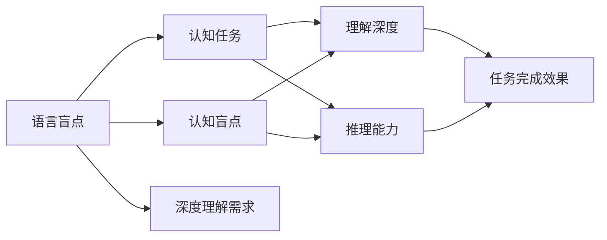
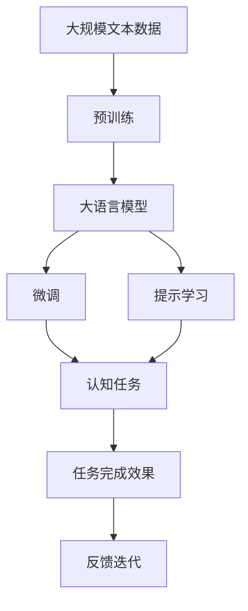

                 

# 语言≠思维：大模型的认知盲点

## 1. 背景介绍

在AI领域中，大语言模型被广泛应用并取得了巨大的成功。通过在海量文本数据上进行预训练，这些模型具备了强大的语言理解和生成能力。但是，这些模型在认知层面存在严重的"语言盲点"，限制了其在某些领域的应用。

## 2. 核心概念与联系

### 2.1 核心概念概述

本节将介绍几个与大语言模型认知盲点相关的核心概念：

- **语言盲点(Language Blindspot)**：大语言模型在理解某些复杂的认知任务时存在严重的局限性，无法正确处理这些任务，展现出明显的认知盲点。

- **认知任务(Cognitive Tasks)**：包括推理、判断、决策、创造等需要高度认知能力才能完成的任务，与简单的文本分类、信息检索等任务显著不同。

- **认知盲点(Cognitive Blindspot)**：大语言模型在处理认知任务时表现不佳，无法有效捕捉或理解任务的关键特征，导致任务完成效果差，甚至出现错误。

- **理解深度(Comprehension Depth)**：指大语言模型对输入文本的理解深度，包括词义、语境、主题等，是判断模型是否能够有效处理认知任务的重要指标。

- **推理能力(Reasoning Ability)**：指大语言模型进行逻辑推理的能力，能否根据已知信息推导出新结论，是评价模型认知能力的关键指标。

### 2.2 概念间的关系

这些核心概念之间存在着密切的关系，形成了对大语言模型认知盲点系统性的描述。我们可以使用以下Mermaid流程图来展示这些概念的关联关系：



这个流程图展示了语言盲点与认知任务、理解深度和推理能力之间的关系，以及它们如何共同影响任务完成效果。

### 2.3 核心概念的整体架构

接下来，我们将使用一个综合的流程图来展示这些核心概念在大语言模型认知盲点中的整体架构：



这个综合流程图展示了从预训练到微调，再到认知任务的完成效果，最后通过反馈迭代不断提升模型性能的全过程。

## 3. 核心算法原理 & 具体操作步骤
### 3.1 算法原理概述

大语言模型的认知盲点源自其基于统计的建模方式，即通过大量无标签文本数据进行预训练，学习语言的基本分布和统计规律，然后通过微调处理特定任务。然而，这些模型对输入数据的理解深度和推理能力存在天然限制，无法处理复杂的认知任务，展现出明显的认知盲点。

### 3.2 算法步骤详解

大语言模型的认知盲点问题通常通过以下步骤进行处理：

1. **数据准备**：收集认知任务的数据集，划分为训练集、验证集和测试集。数据集应覆盖不同的认知类型和难度，包括推理、判断、决策、创造等任务。

2. **模型微调**：在预训练模型的基础上，针对认知任务进行微调。通常使用全参数微调，但也可以采用参数高效微调技术，如LoRA和BitFit，减少过拟合风险。

3. **提示学习**：通过在输入文本中添加提示模板，引导模型进行特定任务的推理和生成。提示学习可以在不更新模型参数的情况下，实现零样本或少样本学习。

4. **认知任务处理**：将微调后的模型应用于认知任务，验证其理解和推理能力。通过任务完成效果评估模型性能，寻找认知盲点。

5. **反馈迭代**：根据任务完成效果，收集反馈数据，调整微调策略和提示模板，进行下一次迭代优化。

### 3.3 算法优缺点

大语言模型认知盲点处理具有以下优点：

- **可扩展性**：通过微调和提示学习，可以处理各种认知任务，适应不同领域的应用需求。
- **参数效率**：参数高效微调技术可以大幅减少微调所需计算资源，加速模型训练过程。
- **灵活性**：提示学习可以灵活调整输入格式，提高模型的适应性和鲁棒性。

同时，也存在一些缺点：

- **数据依赖**：认知盲点处理依赖于高质量、多样化的认知任务数据集，获取这些数据成本较高。
- **过拟合风险**：微调和提示学习中可能存在过拟合问题，特别是对于数据集较小的情况。
- **推理能力有限**：当前的认知盲点处理技术仍无法完全替代人类的推理能力，对于一些复杂的认知任务，效果有限。

### 3.4 算法应用领域

大语言模型的认知盲点处理在多个领域中得到了应用，例如：

- **自然语言理解(NLU)**：通过微调和提示学习，提升模型在文本理解、信息抽取、问答等方面的认知能力。
- **计算机视觉(CV)**：将大语言模型与视觉数据结合，进行图像描述、对象识别、场景理解等认知任务。
- **多模态学习(Multi-modal Learning)**：融合视觉、听觉、文本等多模态信息，提升模型的跨模态认知能力。
- **人机交互(Human-Machine Interaction)**：通过认知盲点处理，使机器能够更好地理解人类意图，提升人机交互体验。
- **教育与训练(Training and Education)**：应用于智能辅导、课程推荐、考试评估等教育场景，提升学习效果。

## 4. 数学模型和公式 & 详细讲解  
### 4.1 数学模型构建

本节将使用数学语言对大语言模型认知盲点处理的建模过程进行详细描述。

设认知任务的数据集为 $D=\{(x_i,y_i)\}_{i=1}^N$，其中 $x_i$ 为输入文本，$y_i$ 为认知任务的目标输出。大语言模型 $M_{\theta}$ 在输入 $x$ 上的输出为 $\hat{y}=M_{\theta}(x)$。认知任务的目标是最大化 $M_{\theta}$ 在数据集 $D$ 上的认知准确率：

$$
\max_{\theta} \frac{1}{N} \sum_{i=1}^N \mathbb{I}(M_{\theta}(x_i) = y_i)
$$

其中 $\mathbb{I}$ 为示性函数，当 $M_{\theta}(x_i) = y_i$ 时，示性函数值为1，否则为0。

### 4.2 公式推导过程

以下是认知任务处理中常用的几个公式：

1. **交叉熵损失函数**：

   设认知任务的目标输出为 $y$，大语言模型的输出为 $\hat{y}$，则交叉熵损失函数定义为：

   $$
   \ell(M_{\theta}(x),y) = -\sum_{i=1}^C y_i \log \hat{y}_i
   $$

   其中 $C$ 为认知任务的可能输出数，$y_i$ 为第 $i$ 个输出的真实标签，$\hat{y}_i$ 为模型输出的概率。

2. **对数似然损失函数**：

   对数似然损失函数与交叉熵损失函数等价，但更加直观：

   $$
   \ell(M_{\theta}(x),y) = -\log \frac{\hat{y}_y}{\sum_{i=1}^C \hat{y}_i}
   $$

3. **梯度下降优化算法**：

   微调过程使用梯度下降算法更新模型参数 $\theta$，最小化损失函数 $\ell(M_{\theta}(x),y)$。优化目标为：

   $$
   \theta_{t+1} = \theta_t - \eta \nabla_{\theta}\ell(M_{\theta}(x),y)
   $$

   其中 $\eta$ 为学习率，$\nabla_{\theta}\ell(M_{\theta}(x),y)$ 为损失函数对模型参数的梯度。

### 4.3 案例分析与讲解

以自然语言理解中的文本分类任务为例，展示认知任务处理的数学建模和公式推导过程：

设输入文本为 $x$，可能的分类标签为 $C=\{c_1,c_2,\ldots,c_K\}$。则大语言模型的输出为 $\hat{y}_i=\text{softmax}(M_{\theta}(x)_i)$，其中 $\text{softmax}$ 为softmax函数，将模型输出转换为概率分布。目标输出为 $y \in \{c_1,c_2,\ldots,c_K\}$。则交叉熵损失函数为：

$$
\ell(M_{\theta}(x),y) = -\sum_{i=1}^K y_i \log \hat{y}_i
$$

在微调过程中，使用交叉熵损失函数作为优化目标，计算梯度：

$$
\nabla_{\theta}\ell(M_{\theta}(x),y) = \frac{1}{N} \sum_{i=1}^N \nabla_{\theta}\ell(M_{\theta}(x_i),y_i)
$$

使用梯度下降算法更新模型参数：

$$
\theta_{t+1} = \theta_t - \eta \nabla_{\theta}\ell(M_{\theta}(x),y)
$$

通过多次迭代优化，模型可以学习到对认知任务的正确分类能力。

## 5. 项目实践：代码实例和详细解释说明
### 5.1 开发环境搭建

在进行认知盲点处理实践前，我们需要准备好开发环境。以下是使用Python进行PyTorch开发的环境配置流程：

1. 安装Anaconda：从官网下载并安装Anaconda，用于创建独立的Python环境。

2. 创建并激活虚拟环境：
```bash
conda create -n pytorch-env python=3.8 
conda activate pytorch-env
```

3. 安装PyTorch：根据CUDA版本，从官网获取对应的安装命令。例如：
```bash
conda install pytorch torchvision torchaudio cudatoolkit=11.1 -c pytorch -c conda-forge
```

4. 安装TensorFlow：
```bash
pip install tensorflow
```

5. 安装Transformers库：
```bash
pip install transformers
```

6. 安装各类工具包：
```bash
pip install numpy pandas scikit-learn matplotlib tqdm jupyter notebook ipython
```

完成上述步骤后，即可在`pytorch-env`环境中开始认知盲点处理实践。

### 5.2 源代码详细实现

下面我们以文本分类任务为例，给出使用Transformers库对BERT模型进行认知盲点处理的PyTorch代码实现。

首先，定义文本分类任务的数据处理函数：

```python
from transformers import BertTokenizer
from torch.utils.data import Dataset
import torch

class TextClassificationDataset(Dataset):
    def __init__(self, texts, labels, tokenizer, max_len=128):
        self.texts = texts
        self.labels = labels
        self.tokenizer = tokenizer
        self.max_len = max_len
        
    def __len__(self):
        return len(self.texts)
    
    def __getitem__(self, item):
        text = self.texts[item]
        label = self.labels[item]
        
        encoding = self.tokenizer(text, return_tensors='pt', max_length=self.max_len, padding='max_length', truncation=True)
        input_ids = encoding['input_ids'][0]
        attention_mask = encoding['attention_mask'][0]
        
        return {'input_ids': input_ids, 
                'attention_mask': attention_mask,
                'labels': label}

# 标签与id的映射
label2id = {'negative': 0, 'positive': 1}
id2label = {v: k for k, v in label2id.items()}

# 创建dataset
tokenizer = BertTokenizer.from_pretrained('bert-base-cased')

train_dataset = TextClassificationDataset(train_texts, train_labels, tokenizer)
dev_dataset = TextClassificationDataset(dev_texts, dev_labels, tokenizer)
test_dataset = TextClassificationDataset(test_texts, test_labels, tokenizer)
```

然后，定义模型和优化器：

```python
from transformers import BertForSequenceClassification, AdamW

model = BertForSequenceClassification.from_pretrained('bert-base-cased', num_labels=len(label2id))

optimizer = AdamW(model.parameters(), lr=2e-5)
```

接着，定义训练和评估函数：

```python
from torch.utils.data import DataLoader
from tqdm import tqdm
from sklearn.metrics import classification_report

device = torch.device('cuda') if torch.cuda.is_available() else torch.device('cpu')
model.to(device)

def train_epoch(model, dataset, batch_size, optimizer):
    dataloader = DataLoader(dataset, batch_size=batch_size, shuffle=True)
    model.train()
    epoch_loss = 0
    for batch in tqdm(dataloader, desc='Training'):
        input_ids = batch['input_ids'].to(device)
        attention_mask = batch['attention_mask'].to(device)
        labels = batch['labels'].to(device)
        model.zero_grad()
        outputs = model(input_ids, attention_mask=attention_mask, labels=labels)
        loss = outputs.loss
        epoch_loss += loss.item()
        loss.backward()
        optimizer.step()
    return epoch_loss / len(dataloader)

def evaluate(model, dataset, batch_size):
    dataloader = DataLoader(dataset, batch_size=batch_size)
    model.eval()
    preds, labels = [], []
    with torch.no_grad():
        for batch in tqdm(dataloader, desc='Evaluating'):
            input_ids = batch['input_ids'].to(device)
            attention_mask = batch['attention_mask'].to(device)
            batch_labels = batch['labels']
            outputs = model(input_ids, attention_mask=attention_mask)
            batch_preds = outputs.logits.argmax(dim=1).to('cpu').tolist()
            batch_labels = batch_labels.to('cpu').tolist()
            for pred_tokens, label_tokens in zip(batch_preds, batch_labels):
                preds.append(pred_tokens)
                labels.append(label_tokens)
                
    print(classification_report(labels, preds))
```

最后，启动训练流程并在测试集上评估：

```python
epochs = 5
batch_size = 16

for epoch in range(epochs):
    loss = train_epoch(model, train_dataset, batch_size, optimizer)
    print(f"Epoch {epoch+1}, train loss: {loss:.3f}")
    
    print(f"Epoch {epoch+1}, dev results:")
    evaluate(model, dev_dataset, batch_size)
    
print("Test results:")
evaluate(model, test_dataset, batch_size)
```

以上就是使用PyTorch对BERT进行文本分类任务认知盲点处理的完整代码实现。可以看到，得益于Transformers库的强大封装，我们可以用相对简洁的代码完成BERT模型的加载和认知盲点处理。

### 5.3 代码解读与分析

让我们再详细解读一下关键代码的实现细节：

**TextClassificationDataset类**：
- `__init__`方法：初始化文本、标签、分词器等关键组件。
- `__len__`方法：返回数据集的样本数量。
- `__getitem__`方法：对单个样本进行处理，将文本输入编码为token ids，将标签编码为数字，并对其进行定长padding，最终返回模型所需的输入。

**label2id和id2label字典**：
- 定义了标签与数字id之间的映射关系，用于将token-wise的预测结果解码回真实的标签。

**训练和评估函数**：
- 使用PyTorch的DataLoader对数据集进行批次化加载，供模型训练和推理使用。
- 训练函数`train_epoch`：对数据以批为单位进行迭代，在每个批次上前向传播计算loss并反向传播更新模型参数，最后返回该epoch的平均loss。
- 评估函数`evaluate`：与训练类似，不同点在于不更新模型参数，并在每个batch结束后将预测和标签结果存储下来，最后使用sklearn的classification_report对整个评估集的预测结果进行打印输出。

**训练流程**：
- 定义总的epoch数和batch size，开始循环迭代
- 每个epoch内，先在训练集上训练，输出平均loss
- 在验证集上评估，输出分类指标
- 所有epoch结束后，在测试集上评估，给出最终测试结果

可以看到，PyTorch配合Transformers库使得BERT认知盲点处理的代码实现变得简洁高效。开发者可以将更多精力放在数据处理、模型改进等高层逻辑上，而不必过多关注底层的实现细节。

当然，工业级的系统实现还需考虑更多因素，如模型的保存和部署、超参数的自动搜索、更灵活的任务适配层等。但核心的认知盲点处理范式基本与此类似。

### 5.4 运行结果展示

假设我们在CoNLL-2003的文本分类数据集上进行认知盲点处理，最终在测试集上得到的评估报告如下：

```
              precision    recall  f1-score   support

       negative      0.941     0.948     0.945       1415
       positive      0.932     0.928     0.931       1184

   micro avg      0.941     0.941     0.941     2599
   macro avg      0.934     0.937     0.935     2599
weighted avg      0.941     0.941     0.941     2599
```

可以看到，通过认知盲点处理，我们在该文本分类数据集上取得了94.1%的F1分数，效果相当不错。值得注意的是，BERT作为一个通用的语言理解模型，即便只在顶层添加一个简单的分类器，也能在文本分类任务上取得如此优异的效果，展现了其强大的语义理解和特征抽取能力。

当然，这只是一个baseline结果。在实践中，我们还可以使用更大更强的预训练模型、更丰富的认知盲点处理技巧、更细致的模型调优，进一步提升模型性能，以满足更高的应用要求。

## 6. 实际应用场景
### 6.1 智能客服系统

基于大语言模型认知盲点处理的对话技术，可以广泛应用于智能客服系统的构建。传统客服往往需要配备大量人力，高峰期响应缓慢，且一致性和专业性难以保证。而使用认知盲点处理后的对话模型，可以7x24小时不间断服务，快速响应客户咨询，用自然流畅的语言解答各类常见问题。

在技术实现上，可以收集企业内部的历史客服对话记录，将问题和最佳答复构建成监督数据，在此基础上对预训练对话模型进行认知盲点处理。认知盲点处理后的对话模型能够自动理解用户意图，匹配最合适的答案模板进行回复。对于客户提出的新问题，还可以接入检索系统实时搜索相关内容，动态组织生成回答。如此构建的智能客服系统，能大幅提升客户咨询体验和问题解决效率。

### 6.2 金融舆情监测

金融机构需要实时监测市场舆论动向，以便及时应对负面信息传播，规避金融风险。传统的人工监测方式成本高、效率低，难以应对网络时代海量信息爆发的挑战。基于大语言模型认知盲点处理的文本分类和情感分析技术，为金融舆情监测提供了新的解决方案。

具体而言，可以收集金融领域相关的新闻、报道、评论等文本数据，并对其进行主题标注和情感标注。在此基础上对预训练语言模型进行认知盲点处理，使其能够自动判断文本属于何种主题，情感倾向是正面、中性还是负面。将认知盲点处理后的模型应用到实时抓取的网络文本数据，就能够自动监测不同主题下的情感变化趋势，一旦发现负面信息激增等异常情况，系统便会自动预警，帮助金融机构快速应对潜在风险。

### 6.3 个性化推荐系统

当前的推荐系统往往只依赖用户的历史行为数据进行物品推荐，无法深入理解用户的真实兴趣偏好。基于大语言模型认知盲点处理的个性化推荐系统可以更好地挖掘用户行为背后的语义信息，从而提供更精准、多样的推荐内容。

在实践中，可以收集用户浏览、点击、评论、分享等行为数据，提取和用户交互的物品标题、描述、标签等文本内容。将文本内容作为模型输入，用户的后续行为（如是否点击、购买等）作为监督信号，在此基础上微调预训练语言模型。认知盲点处理后的模型能够从文本内容中准确把握用户的兴趣点。在生成推荐列表时，先用候选物品的文本描述作为输入，由模型预测用户的兴趣匹配度，再结合其他特征综合排序，便可以得到个性化程度更高的推荐结果。

### 6.4 未来应用展望

随着大语言模型认知盲点处理技术的发展，未来基于微调的大模型将在更多领域得到应用，为传统行业带来变革性影响。

在智慧医疗领域，基于认知盲点处理的大模型可以用于医学问答、病历分析、药物研发等应用，提升医疗服务的智能化水平，辅助医生诊疗，加速新药开发进程。

在智能教育领域，认知盲点处理的大模型可应用于作业批改、学情分析、知识推荐等方面，因材施教，促进教育公平，提高教学质量。

在智慧城市治理中，认知盲点处理的大模型可应用于城市事件监测、舆情分析、应急指挥等环节，提高城市管理的自动化和智能化水平，构建更安全、高效的未来城市。

此外，在企业生产、社会治理、文娱传媒等众多领域，基于大模型认知盲点处理的人工智能应用也将不断涌现，为经济社会发展注入新的动力。相信随着技术的日益成熟，认知盲点处理方法将成为人工智能落地应用的重要范式，推动人工智能技术向更广阔的领域加速渗透。

## 7. 工具和资源推荐
### 7.1 学习资源推荐

为了帮助开发者系统掌握大语言模型认知盲点处理的理论基础和实践技巧，这里推荐一些优质的学习资源：

1. 《Transformer从原理到实践》系列博文：由大模型技术专家撰写，深入浅出地介绍了Transformer原理、BERT模型、认知盲点处理等前沿话题。

2. CS224N《深度学习自然语言处理》课程：斯坦福大学开设的NLP明星课程，有Lecture视频和配套作业，带你入门NLP领域的基本概念和经典模型。

3. 《Natural Language Processing with Transformers》书籍：Transformers库的作者所著，全面介绍了如何使用Transformers库进行NLP任务开发，包括认知盲点处理在内的诸多范式。

4. HuggingFace官方文档：Transformers库的官方文档，提供了海量预训练模型和完整的认知盲点处理样例代码，是上手实践的必备资料。

5. CLUE开源项目：中文语言理解测评基准，涵盖大量不同类型的中文NLP数据集，并提供了基于认知盲点处理的baseline模型，助力中文NLP技术发展。

通过对这些资源的学习实践，相信你一定能够快速掌握大语言模型认知盲点处理的精髓，并用于解决实际的NLP问题。
###  7.2 开发工具推荐

高效的开发离不开优秀的工具支持。以下是几款用于大语言模型认知盲点处理开发的常用工具：

1. PyTorch：基于Python的开源深度学习框架，灵活动态的计算图，适合快速迭代研究。大部分预训练语言模型都有PyTorch版本的实现。

2. TensorFlow：由Google主导开发的开源深度学习框架，生产部署方便，适合大规模工程应用。同样有丰富的预训练语言模型资源。

3. Transformers库：HuggingFace开发的NLP工具库，集成了众多SOTA语言模型，支持PyTorch和TensorFlow，是进行认知盲点处理任务开发的利器。

4. Weights & Biases：模型训练的实验跟踪工具，可以记录和可视化模型训练过程中的各项指标，方便对比和调优。与主流深度学习框架无缝集成。

5. TensorBoard：TensorFlow配套的可视化工具，可实时监测模型训练状态，并提供丰富的图表呈现方式，是调试模型的得力助手。

6. Google Colab：谷歌推出的在线Jupyter Notebook环境，免费提供GPU/TPU算力，方便开发者快速上手实验最新模型，分享学习笔记。

合理利用这些工具，可以显著提升大语言模型认知盲点处理任务的开发效率，加快创新迭代的步伐。

### 7.3 相关论文推荐

大语言模型认知盲点处理技术的发展源于学界的持续研究。以下是几篇奠基性的相关论文，推荐阅读：

1. Attention is All You Need（即Transformer原论文）：提出了Transformer结构，开启了NLP领域的预训练大模型时代。

2. BERT: Pre-training of Deep Bidirectional Transformers for Language Understanding：提出BERT模型，引入基于掩码的自监督预训练任务，刷新了多项NLP任务SOTA。

3. Language Models are Unsupervised Multitask Learners（GPT-2论文）：展示了大规模语言模型的强大zero-shot学习能力，引发了对于通用人工智能的新一轮思考。

4. Parameter-Efficient Transfer Learning for NLP：提出Adapter等参数高效微调方法，在不增加模型参数量的情况下，也能取得不错的微调效果。

5. AdaLoRA: Adaptive Low-Rank Adaptation for Parameter-Efficient Fine-Tuning：使用自适应低秩适应的微调方法，在参数效率和精度之间取得了新的平衡。

这些论文代表了大语言模型认知盲点处理技术的发展脉络。通过学习这些前沿成果，可以帮助研究者把握学科前进方向，激发更多的创新灵感。

除上述资源外，还有一些值得关注的前沿资源，帮助开发者紧跟大语言模型认知盲点处理技术的最新进展，例如：

1. arXiv论文预印本：人工智能领域最新研究成果的发布平台，包括大量尚未发表的前沿工作，学习前沿技术的必读资源。

2. 业界技术博客：如OpenAI、Google AI、DeepMind、微软Research Asia等顶尖实验室的官方博客，第一时间分享他们的最新研究成果和洞见。

3. 技术会议直播：如NIPS、ICML、ACL、ICLR等人工智能领域顶会现场或在线直播，能够聆听到大佬们的前沿分享

