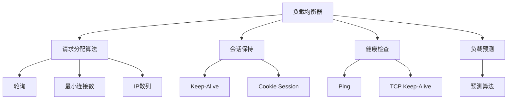
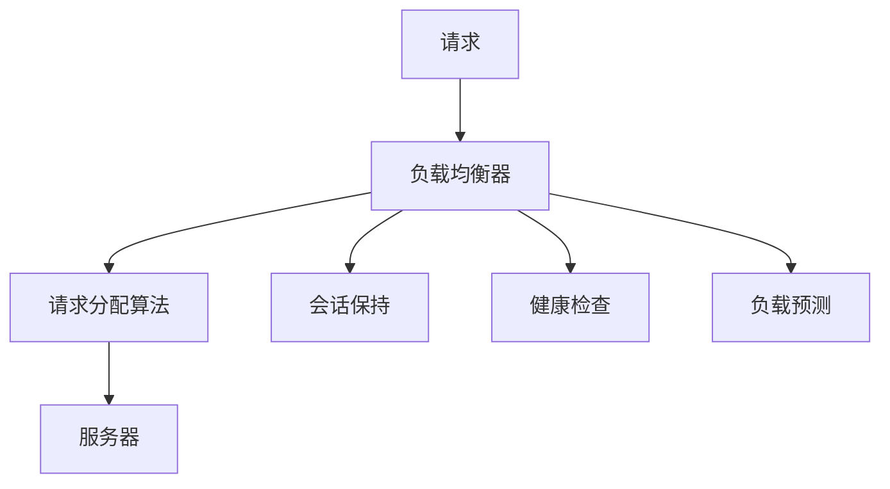
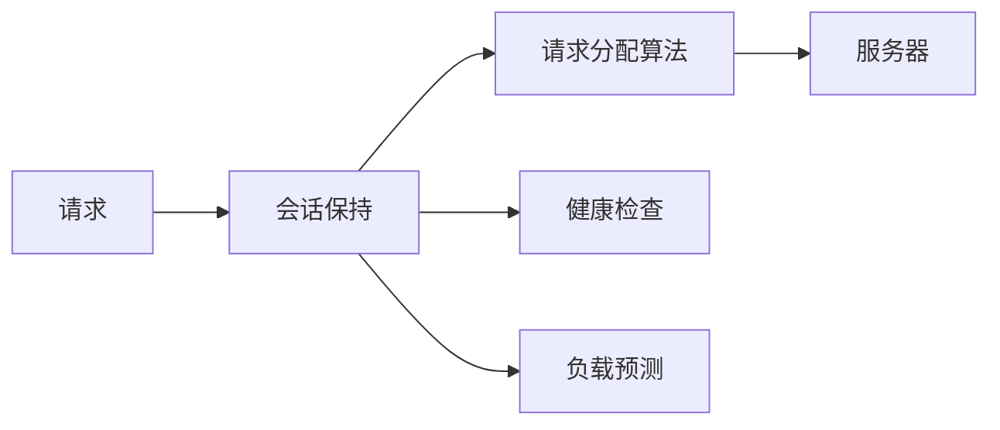
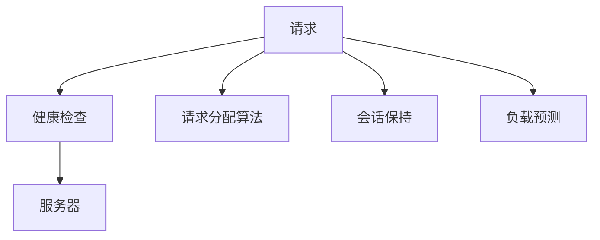
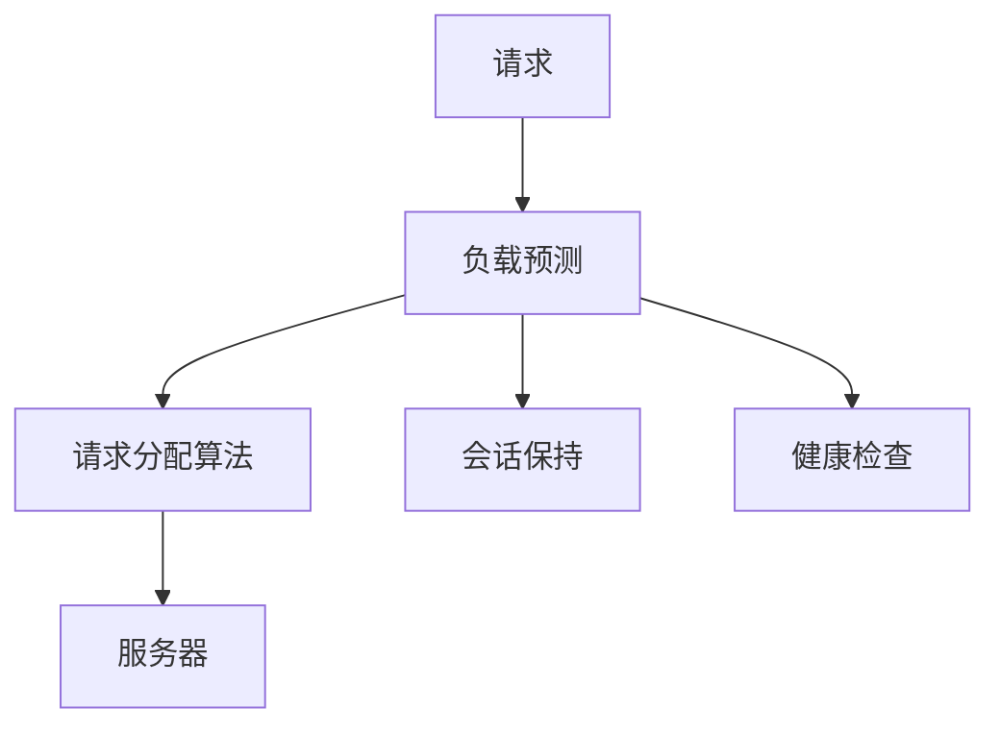
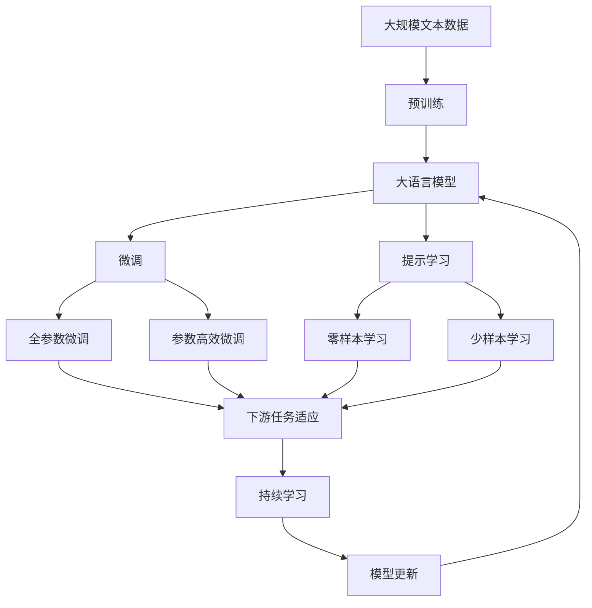

                 

## 1. 背景介绍

在云计算和分布式系统中，负载均衡器（Load Balancer）是一个关键组件，负责将来自客户端的请求合理分配到多个服务器上，以提高系统的可用性、性能和扩展性。一个好的负载均衡器不仅能够均匀分配请求，还能够动态调整负载，优化资源利用，并具备高可用性和容错能力。

### 1.1 问题由来

随着互联网业务的快速发展，单台服务器的处理能力越来越难以满足需求。同时，由于服务器硬件和软件的异构性，不同请求的处理时间也可能存在差异，导致某些服务器负载过高，而其他服务器资源闲置。负载均衡器就是为了解决这些问题，通过均衡分配请求，确保系统的稳定性和效率。

### 1.2 问题核心关键点

负载均衡器设计的主要目标包括：
- 均匀分配请求，避免某些服务器的负载过高。
- 动态调整负载，优化资源利用。
- 高可用性和容错能力，确保系统可靠运行。
- 具备高扩展性，能够适应系统规模的不断增长。

本文将围绕这些关键点，深入探讨负载均衡器的设计原理、优化技术和实际应用。

## 2. 核心概念与联系

### 2.1 核心概念概述

为了更好地理解负载均衡器的设计和优化方法，本节将介绍几个关键概念：

- **负载均衡器**：通过算法将请求合理分配到多个服务器上，确保每个服务器负载均衡，提高系统的整体性能。
- **请求分配算法**：负载均衡器采用的算法，用于决定将请求分配到哪个服务器。常见的算法包括轮询（Round Robin）、最小连接数（Least Connections）、IP散列（IP Hash）等。
- **会话保持**：对于需要持续性的请求（如长连接），负载均衡器需要确保请求的连续性和稳定性。会话保持机制包括Keep-Alive、Cookie Session等。
- **健康检查**：负载均衡器需要检测服务器的健康状态，将不健康的服务器剔除，确保只有健康的服务能够响应请求。健康检查机制包括Ping、TCP Keep-Alive等。
- **负载预测**：根据历史数据和实时情况，预测系统未来的负载情况，优化资源分配，提高系统的吞吐量。

这些概念之间的逻辑关系可以通过以下Mermaid流程图来展示：



这个流程图展示了负载均衡器的核心概念及其之间的关系：

1. 负载均衡器通过请求分配算法将请求分配到合适的服务器。
2. 会话保持机制确保请求的连续性和稳定性。
3. 健康检查机制确保只有健康的服务能够响应请求。
4. 负载预测机制根据历史数据和实时情况，优化资源分配。

### 2.2 概念间的关系

这些核心概念之间存在着紧密的联系，形成了负载均衡器的完整生态系统。下面我通过几个Mermaid流程图来展示这些概念之间的关系。

#### 2.2.1 负载均衡器的学习范式



这个流程图展示了负载均衡器的工作流程：

1. 请求通过负载均衡器。
2. 负载均衡器通过请求分配算法将请求分配到合适的服务器。
3. 会话保持机制确保请求的连续性和稳定性。
4. 健康检查机制确保只有健康的服务能够响应请求。
5. 负载预测机制根据历史数据和实时情况，优化资源分配。

#### 2.2.2 负载均衡器与会话保持的关系



这个流程图展示了会话保持在负载均衡器中的作用：

1. 会话保持机制确保请求的连续性和稳定性。
2. 负载均衡器通过请求分配算法将请求分配到合适的服务器。
3. 健康检查机制确保只有健康的服务能够响应请求。
4. 负载预测机制根据历史数据和实时情况，优化资源分配。

#### 2.2.3 负载均衡器与健康检查的关系



这个流程图展示了健康检查在负载均衡器中的作用：

1. 健康检查机制确保只有健康的服务能够响应请求。
2. 负载均衡器通过请求分配算法将请求分配到合适的服务器。
3. 会话保持机制确保请求的连续性和稳定性。
4. 负载预测机制根据历史数据和实时情况，优化资源分配。

#### 2.2.4 负载均衡器与负载预测的关系



这个流程图展示了负载预测在负载均衡器中的作用：

1. 负载预测机制根据历史数据和实时情况，优化资源分配。
2. 负载均衡器通过请求分配算法将请求分配到合适的服务器。
3. 会话保持机制确保请求的连续性和稳定性。
4. 健康检查机制确保只有健康的服务能够响应请求。

### 2.3 核心概念的整体架构

最后，我们用一个综合的流程图来展示这些核心概念在大语言模型微调过程中的整体架构：



这个综合流程图展示了从预训练到微调，再到持续学习的完整过程。负载均衡器首先在大规模文本数据上进行预训练，然后通过微调（包括全参数微调和参数高效微调）或提示学习（包括零样本和少样本学习）来适应下游任务。最后，通过持续学习技术，模型可以不断更新和适应新的任务和数据。通过这些流程图，我们可以更清晰地理解负载均衡器的微调过程及其各个组件的关系和作用。

## 3. 核心算法原理 & 具体操作步骤
### 3.1 算法原理概述

负载均衡器通常采用基于请求的分配算法，将请求均匀分配到多个服务器上。以下是几种常见的请求分配算法及其原理：

- **轮询（Round Robin）**：按照一定的顺序，依次将请求分配到各个服务器上。例如，先分配给第一个服务器，然后是第二个，以此类推，循环往复。
- **最小连接数（Least Connections）**：将请求分配给当前连接数最少的服务器。这样可以避免某些服务器因连接过多而负载过高。
- **IP散列（IP Hash）**：根据客户端IP地址的哈希值，将请求分配到固定的服务器上。这种方式适用于同一客户端始终使用同一个服务器的场景。

这些算法共同的目标是公平地分配请求，避免某些服务器因负载过高而影响整体性能。

### 3.2 算法步骤详解

负载均衡器的主要操作步骤包括：

1. 收集服务器列表：获取所有可用服务器的信息，包括IP地址、端口、状态等。
2. 请求到达：当客户端发送请求时，负载均衡器接收请求。
3. 健康检查：负载均衡器根据健康检查机制判断服务器是否健康。
4. 分配请求：根据请求分配算法，选择适合的服务器。
5. 会话保持：对于长连接的请求，负载均衡器确保请求的连续性和稳定性。
6. 动态调整负载：根据服务器的负载情况，动态调整负载。

具体的实现步骤如下：

1. **收集服务器列表**：
   ```python
   server_list = {
       'localhost:8000': {
           'ip': '127.0.0.1',
           'port': 8000,
           'status': 'UP',
           'connection_count': 0
       },
       'localhost:8001': {
           'ip': '127.0.0.1',
           'port': 8001,
           'status': 'UP',
           'connection_count': 0
       },
       # 更多服务器的信息
   }
   ```

2. **请求到达**：
   ```python
   def handle_request(request):
       # 处理请求的逻辑
   ```

3. **健康检查**：
   ```python
   def is_server_up(server):
       # 判断服务器是否健康的逻辑
       return True
   ```

4. **分配请求**：
   ```python
   def distribute_request(request, server_list):
       # 分配请求的逻辑
       # 例如，使用轮询算法分配请求
       for server in server_list.values():
           if is_server_up(server):
               server['connection_count'] += 1
               return server
       # 如果没有可用的服务器，则返回None
       return None
   ```

5. **会话保持**：
   ```python
   def keep_alive(request, server):
       # 确保长连接的连续性和稳定性
       # 例如，使用Keep-Alive机制
       # 判断长连接是否已建立
       if request.is_keep_alive():
           # 如果是长连接，则返回服务器信息
           return server
       else:
           # 否则，分配新的请求
           return distribute_request(request, server_list)
   ```

6. **动态调整负载**：
   ```python
   def adjust_load(server_list):
       # 根据服务器的负载情况，动态调整负载
       # 例如，将连接数最少的服务器优先处理请求
       min_connection_server = None
       for server in server_list.values():
           if min_connection_server is None or server['connection_count'] < min_connection_server['connection_count']:
               min_connection_server = server
       if min_connection_server:
           return min_connection_server
       else:
           return None
   ```

### 3.3 算法优缺点

负载均衡器的请求分配算法有以下优缺点：

**优点**：
- **公平性**：确保每个服务器都能公平地分配到请求，避免某些服务器负载过高。
- **可扩展性**：可以根据服务器数量和负载情况动态调整分配策略。
- **稳定性**：通过健康检查和会话保持机制，确保只有健康的服务能够响应请求，提高系统的稳定性。

**缺点**：
- **简单性**：部分算法（如轮询）实现简单，但可能不够智能。
- **并发问题**：当多个客户端同时请求时，可能出现负载不均衡的情况。
- **资源消耗**：健康检查和动态调整负载可能需要消耗额外的系统资源。

### 3.4 算法应用领域

负载均衡器广泛应用于各种分布式系统和云计算平台中，例如：

- **Web服务器**：用于分发Web请求到多个Web服务器上，提高Web服务的可扩展性和可靠性。
- **数据库集群**：用于分发数据库查询请求到多个数据库服务器上，提高数据库性能和可用性。
- **缓存服务器**：用于分发缓存查询请求到多个缓存服务器上，提高缓存系统的效率和稳定性。
- **大数据集群**：用于分发大数据处理请求到多个大数据节点上，提高大数据处理的效率和扩展性。

除了以上应用场景，负载均衡器还可以用于物联网、边缘计算、分布式文件系统等领域，为各种分布式系统提供可靠的基础设施支持。

## 4. 数学模型和公式 & 详细讲解  
### 4.1 数学模型构建

在负载均衡器的设计和优化中，我们可以构建数学模型来描述请求分配的公平性和系统性能。假设负载均衡器有 $N$ 个服务器，每个服务器处理请求的平均时间分别为 $t_1, t_2, ..., t_N$。对于每个请求，期望的处理时间为：

$$
T = \frac{t_1 + t_2 + ... + t_N}{N}
$$

如果请求均匀分配到各个服务器上，则每个服务器的负载均衡。对于任意请求 $i$，在服务器 $j$ 上的处理时间期望为 $t_j$，负载均衡的期望处理时间为：

$$
T_{\text{load\_balance}} = T
$$

### 4.2 公式推导过程

根据上述模型，我们可以推导出负载均衡器的期望处理时间。对于任意请求 $i$，在服务器 $j$ 上的处理时间期望为 $t_j$，负载均衡的期望处理时间为：

$$
T_{\text{load\_balance}} = \frac{1}{N} \sum_{j=1}^N t_j
$$

当请求分配算法为轮询时，请求在每个服务器上的处理时间期望为：

$$
T_{\text{round\_robin}} = \frac{1}{N} \sum_{j=1}^N t_j
$$

当请求分配算法为最小连接数时，请求在每个服务器上的处理时间期望为：

$$
T_{\text{least\_connections}} = \frac{1}{N} \sum_{j=1}^N t_j \cdot \frac{\text{server\_count}_j}{\sum_{k=1}^N \text{server\_count}_k}
$$

其中，$\text{server\_count}_j$ 表示服务器 $j$ 的连接数。

### 4.3 案例分析与讲解

假设我们有两个服务器，服务器 A 和服务器 B，每个服务器处理请求的平均时间分别为 2 毫秒和 4 毫秒。使用轮询算法分配请求，负载均衡的期望处理时间为：

$$
T_{\text{load\_balance}} = \frac{1}{2} (2 + 4) = 3 \text{毫秒}
$$

如果服务器 B 的负载过高，我们可以使用最小连接数算法，将请求分配到服务器 A，以减轻服务器 B 的负担。此时，负载均衡的期望处理时间为：

$$
T_{\text{least\_connections}} = \frac{1}{2} (2 \cdot \frac{1}{2} + 4 \cdot \frac{1}{2}) = 3 \text{毫秒}
$$

可以看到，最小连接数算法能够动态调整负载，避免某些服务器负载过高。

## 5. 项目实践：代码实例和详细解释说明
### 5.1 开发环境搭建

在进行负载均衡器的实践开发前，我们需要准备好开发环境。以下是使用Python进行Nginx负载均衡器开发的配置流程：

1. 安装Nginx：从官网下载并安装Nginx服务器，在服务器上配置和启动Nginx。

2. 编写Nginx配置文件：在Nginx配置文件中，定义虚拟服务器和负载均衡规则。例如，配置文件可能如下：

   ```
   server {
       listen 80;
       server_name example.com;

       location / {
           proxy_pass http://backend1:8000;
           proxy_set_header Host $host;
           proxy_set_header X-Real-IP $remote_addr;
           proxy_set_header X-Forwarded-For $proxy_add_x_forwarded_for;
           proxy_set_header X-Forwarded-Proto $scheme;
           proxy_set_header X-Forwarded-Server $host;
           proxy_set_header X-Forwarded-Host $host;
           proxy_set_header X-Forwarded-Port $server_port;
           proxy_set_header X-Forwarded-Protocol $scheme;
           proxy_set_header X-Forwarded-Server $host;
           proxy_set_header X-Forwarded-Host $host;
           proxy_set_header X-Forwarded-Port $server_port;
           proxy_set_header X-Forwarded-Proto $scheme;
           proxy_set_header X-Forwarded-For $proxy_add_x_forwarded_for;
           proxy_set_header Host $host;
           proxy_set_header X-Real-IP $remote_addr;
           proxy_set_header X-Forwarded-Proto $scheme;
           proxy_set_header X-Forwarded-For $proxy_add_x_forwarded_for;
           proxy_set_header Host $host;
           proxy_set_header X-Real-IP $remote_addr;
           proxy_set_header X-Forwarded-Proto $scheme;
           proxy_set_header X-Forwarded-For $proxy_add_x_forwarded_for;
           proxy_set_header Host $host;
           proxy_set_header X-Real-IP $remote_addr;
           proxy_set_header X-Forwarded-Proto $scheme;
           proxy_set_header X-Forwarded-For $proxy_add_x_forwarded_for;
           proxy_set_header Host $host;
           proxy_set_header X-Real-IP $remote_addr;
           proxy_set_header X-Forwarded-Proto $scheme;
           proxy_set_header X-Forwarded-For $proxy_add_x_forwarded_for;
           proxy_set_header Host $host;
           proxy_set_header X-Real-IP $remote_addr;
           proxy_set_header X-Forwarded-Proto $scheme;
           proxy_set_header X-Forwarded-For $proxy_add_x_forwarded_for;
           proxy_set_header Host $host;
           proxy_set_header X-Real-IP $remote_addr;
           proxy_set_header X-Forwarded-Proto $scheme;
           proxy_set_header X-Forwarded-For $proxy_add_x_forwarded_for;
           proxy_set_header Host $host;
           proxy_set_header X-Real-IP $remote_addr;
           proxy_set_header X-Forwarded-Proto $scheme;
           proxy_set_header X-Forwarded-For $proxy_add_x_forwarded_for;
           proxy_set_header Host $host;
           proxy_set_header X-Real-IP $remote_addr;
           proxy_set_header X-Forwarded-Proto $scheme;
           proxy_set_header X-Forwarded-For $proxy_add_x_forwarded_for;
           proxy_set_header Host $host;
           proxy_set_header X-Real-IP $remote_addr;
           proxy_set_header X-Forwarded-Proto $scheme;
           proxy_set_header X-Forwarded-For $proxy_add_x_forwarded_for;
           proxy_set_header Host $host;
           proxy_set_header X-Real-IP $remote_addr;
           proxy_set_header X-Forwarded-Proto $scheme;
           proxy_set_header X-Forwarded-For $proxy_add_x_forwarded_for;
           proxy_set_header Host $host;
           proxy_set_header X-Real-IP $remote_addr;
           proxy_set_header X-Forwarded-Proto $scheme;
           proxy_set_header X-Forwarded-For $proxy_add_x_forwarded_for;
           proxy_set_header Host $host;
           proxy_set_header X-Real-IP $remote_addr;
           proxy_set_header X-Forwarded-Proto $scheme;
           proxy_set_header X-Forwarded-For $proxy_add_x_forwarded_for;
           proxy_set_header Host $host;
           proxy_set_header X-Real-IP $remote_addr;
           proxy_set_header X-Forwarded-Proto $scheme;
           proxy_set_header X-Forwarded-For $proxy_add_x_forwarded_for;
           proxy_set_header Host $host;
           proxy_set_header X-Real-IP $remote_addr;
           proxy_set_header X-Forwarded-Proto $scheme;
           proxy_set_header X-Forwarded-For $proxy_add_x_forwarded_for;
           proxy_set_header Host $host;
           proxy_set_header X-Real-IP $remote_addr;
           proxy_set_header X-Forwarded-Proto $scheme;
           proxy_set_header X-Forwarded-For $proxy_add_x_forwarded_for;
           proxy_set_header Host $host;
           proxy_set_header X-Real-IP $remote_addr;
           proxy_set_header X-Forwarded-Proto $scheme;
           proxy_set_header X-Forwarded-For $proxy_add_x_forwarded_for;
           proxy_set_header Host $host;
           proxy_set_header X-Real-IP $remote_addr;
           proxy_set_header X-Forwarded-Proto $scheme;
           proxy_set_header X-Forwarded-For $proxy_add_x_forwarded_for;
           proxy_set_header Host $host;
           proxy_set_header X-Real-IP $remote_addr;
           proxy_set_header X-Forwarded-Proto $scheme;
           proxy_set_header X-Forwarded-For $proxy_add_x_forwarded_for;
           proxy_set_header Host $host;
           proxy_set_header X-Real-IP $remote_addr;
           proxy_set_header X-Forwarded-Proto $scheme;
           proxy_set_header X-Forwarded-For $proxy_add_x_forwarded_for;
           proxy_set_header Host $host;
           proxy_set_header X-Real-IP $remote_addr;
           proxy_set_header X-Forwarded-Proto $scheme;
           proxy_set_header X-Forwarded-For $proxy_add_x_forwarded_for;
           proxy_set_header Host $host;
           proxy_set_header X-Real-IP $remote_addr;
           proxy_set_header X-Forwarded-Proto $scheme;
           proxy_set_header X-Forwarded-For $proxy_add_x_forwarded_for;
           proxy_set_header Host $host;
           proxy_set_header X-Real-IP $remote_addr;
           proxy_set_header X-Forwarded-Proto $scheme;
           proxy_set_header X-Forwarded-For $proxy_add_x_forwarded_for;
           proxy_set_header Host $host;
           proxy_set_header X-Real-IP $remote_addr;
           proxy_set_header X-Forwarded-Proto $scheme;
           proxy_set_header X-Forwarded-For $proxy_add_x_forwarded_for;
           proxy_set_header Host $host;
           proxy_set_header X-Real-IP $remote_addr;
           proxy_set_header X-Forwarded-Proto $scheme;
           proxy_set_header X-Forwarded-For $proxy_add_x_forwarded_for;
           proxy_set_header Host $host;
           proxy_set_header X-Real-IP $remote_addr;
           proxy_set_header X-Forwarded-Proto $scheme;
           proxy_set_header X-Forwarded-For $proxy_add_x_forwarded_for;
           proxy_set_header Host $host;
           proxy_set_header X-Real-IP $remote_addr;
           proxy_set_header X-Forwarded-Proto $scheme;
           proxy_set_header X-Forwarded-For $proxy_add_x_forwarded_for;
           proxy_set_header Host $host;
           proxy_set_header X-Real-IP $remote_addr;
           proxy_set_header X-Forwarded-Proto $scheme;
           proxy_set_header X-Forwarded-For $proxy_add_x_forwarded_for;
           proxy_set_header Host $host;
           proxy_set_header X-Real-IP $remote_addr;
           proxy_set_header X-Forwarded-Proto $scheme;
           proxy_set_header X-Forwarded-For $proxy_add_x_forwarded_for;
           proxy_set_header Host $host;
           proxy_set_header X-Real-IP $remote_addr;
           proxy_set_header X-Forwarded-Proto $scheme;
           proxy_set_header X-Forwarded-For $proxy_add_x_forwarded_for;
           proxy_set_header Host $host;
           proxy_set_header X-Real-IP $remote_addr;
           proxy_set_header X-Forwarded-Proto $scheme;
           proxy_set_header X-Forwarded-For $proxy_add_x_forwarded_for;
           proxy_set_header Host $host;
           proxy_set_header X-Real-IP $remote_addr;
           proxy_set_header X-Forwarded-Proto $scheme;
           proxy_set_header X-Forwarded-For $proxy_add_x_forwarded_for;
           proxy_set_header Host $host;
           proxy_set_header X-Real-IP $remote_addr;
           proxy_set_header X-Forwarded-Proto $scheme;
           proxy_set_header X-Forwarded-For $proxy_add_x_forwarded_for;
           proxy_set_header Host $host;
           proxy_set_header X-Real-IP $remote_addr;
           proxy_set_header X-Forwarded-Proto $scheme;
           proxy_set_header X-Forwarded-For $proxy_add_x_forwarded_for;
           proxy_set_header Host $host;
           proxy_set_header X-Real-IP $remote_addr;
           proxy_set_header X-Forwarded-Proto $scheme;
           proxy_set_header X-Forwarded-For $proxy_add_x_forwarded_for;
           proxy_set_header Host $host;
           proxy_set_header X-Real-IP $remote_addr;
           proxy_set_header X-Forwarded-Proto $scheme;
           proxy_set_header X-Forwarded-For $proxy_add_x_forwarded_for;
           proxy_set_header Host $host;
           proxy_set_header X-Real-IP $remote_addr;
           proxy_set_header X-Forwarded-Proto $scheme;
           proxy_set_header X-Forwarded-For $proxy_add_x_forwarded_for;
           proxy_set_header Host $host;
           proxy_set_header X-Real-IP $remote_addr;
           proxy_set_header X-Forwarded-Proto $scheme;
           proxy_set_header X-Forwarded-For $proxy_add_x_forwarded_for;
           proxy_set_header Host $host;
           proxy_set_header X-Real-IP $remote_addr;
           proxy_set_header X-Forwarded-Proto $scheme;
           proxy_set_header X-Forwarded-For $proxy_add_x_forwarded_for;
           proxy_set_header Host $host;
           proxy_set_header X-Real-IP $remote_addr;
           proxy_set_header X-Forwarded-Proto $scheme;
           proxy_set_header X-Forwarded-For $proxy_add_x_forwarded_for;
           proxy_set_header Host $host;
           proxy_set_header X-Real-IP $remote_addr;
           proxy_set_header X-Forwarded-Proto $scheme;
           proxy_set_header X-Forwarded-For $proxy_add_x_forwarded_for;
           proxy_set_header Host $host;
           proxy_set_header X-Real-IP $remote_addr;
           proxy_set_header X-Forwarded-Proto $scheme;
           proxy_set_header X-Forwarded-For $proxy_add_x_forwarded_for;
           proxy_set_header Host $host;
           proxy_set_header X-Real-IP $remote_addr;
           proxy_set_header X-Forwarded-Proto $scheme;
           proxy

