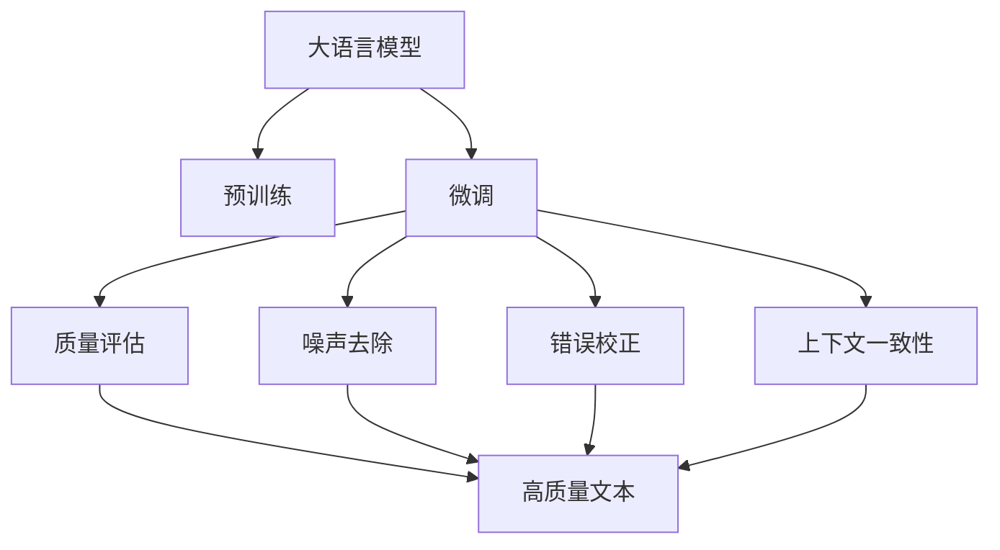
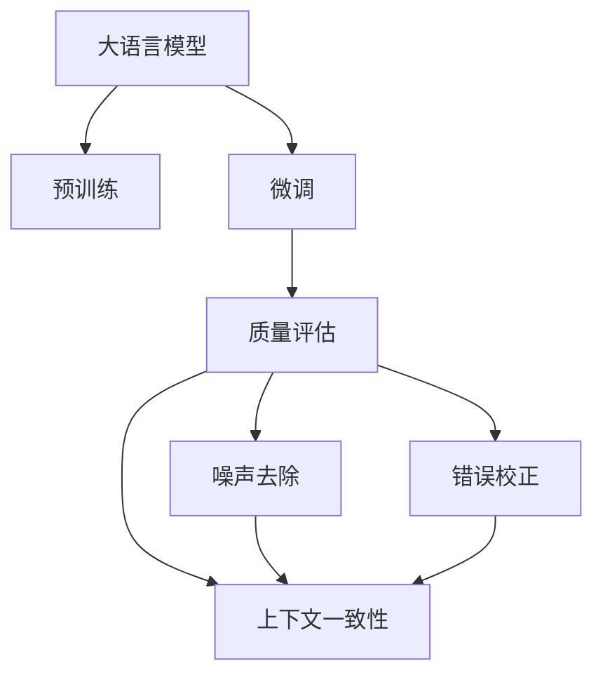
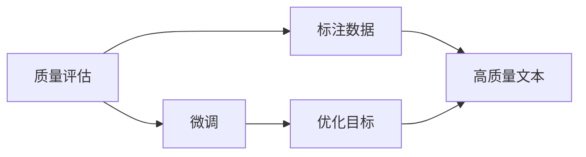
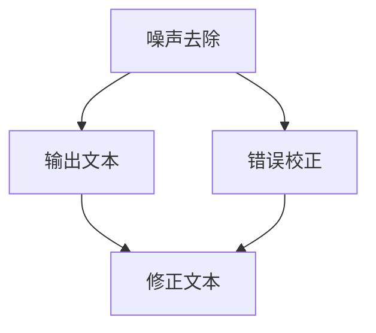
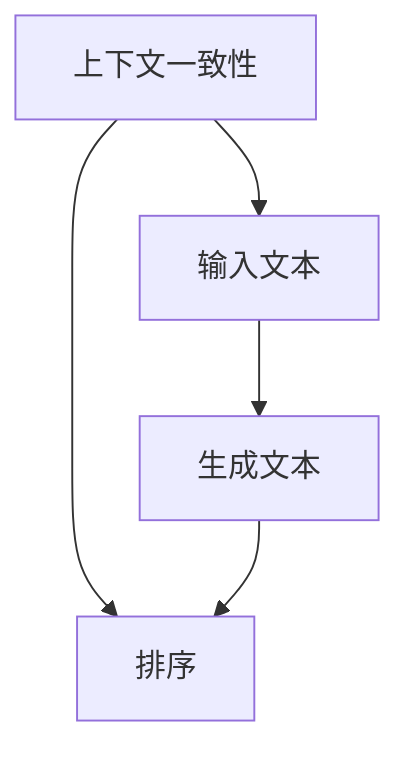
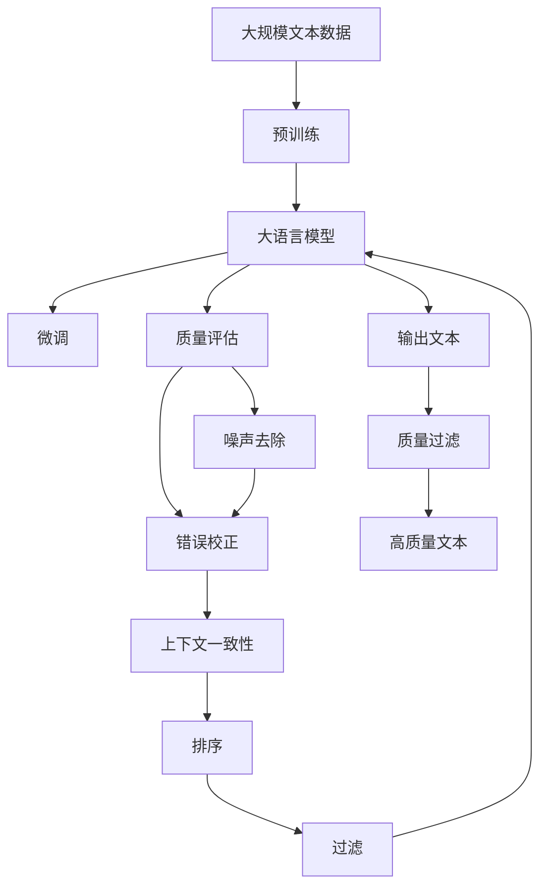

                 

# 大语言模型原理与工程实践：质量过滤

> 关键词：大语言模型, 质量过滤, 自然语言处理(NLP), 深度学习, 监督学习, Transformer, BERT, 模型微调, 预训练, 质量评估, 代码实现

## 1. 背景介绍

### 1.1 问题由来

随着深度学习技术和大语言模型的飞速发展，NLP领域取得了许多突破性进展，如BERT、GPT-3等模型在各种NLP任务上取得了卓越的性能。然而，尽管预训练模型的质量很高，但模型的输出结果往往还需要经过质量过滤，以去除噪声和错误信息，提升最终应用效果。

质量过滤在自然语言处理中的应用非常广泛，如信息检索、文本分类、情感分析、机器翻译等任务都需要通过质量过滤提高模型输出质量。质量过滤旨在从模型生成的文本中筛选出高质量的输出，去除低质量的内容，从而提升模型效果。

### 1.2 问题核心关键点

质量过滤的核心在于如何有效地从模型输出中筛选出高质量的内容。主要包括以下几个方面：

1. **质量评估指标**：如何定义和度量文本的质量，是质量过滤的基础。
2. **噪声去除**：识别并去除输出中的噪声，如拼写错误、语法错误等。
3. **错误校正**：修正输出中的错误信息，如纠正拼写错误、语义错误等。
4. **合理排序**：对于生成的多个候选答案，如何进行排序，以挑选出最佳答案。
5. **上下文一致性**：保证生成的文本与输入的上下文一致，避免生成无关或错误的回答。

### 1.3 问题研究意义

质量过滤对于提升大语言模型的应用效果具有重要意义：

1. **提升模型性能**：通过质量过滤，可以减少模型生成的噪声和错误，提升模型输出的准确性和可靠性。
2. **提高用户体验**：高质量的输出能够更好地满足用户需求，提升用户体验。
3. **增加模型鲁棒性**：去除噪声和错误可以增强模型的鲁棒性，使其在各种数据和环境中都能表现稳定。
4. **优化资源利用**：合理分配模型资源，避免对低质量内容的无效计算，提高模型效率。

因此，质量过滤是大语言模型应用过程中不可或缺的一部分，其研究与应用对于推动NLP技术的发展具有重要价值。

## 2. 核心概念与联系

### 2.1 核心概念概述

为更好地理解质量过滤的核心概念，本节将介绍几个密切相关的核心概念：

- **大语言模型(Large Language Model, LLM)**：以自回归(如GPT)或自编码(如BERT)模型为代表的大规模预训练语言模型。通过在大规模无标签文本语料上进行预训练，学习通用的语言表示，具备强大的语言理解和生成能力。

- **预训练(Pre-training)**：指在大规模无标签文本语料上，通过自监督学习任务训练通用语言模型的过程。常见的预训练任务包括言语建模、遮挡语言模型等。预训练使得模型学习到语言的通用表示。

- **微调(Fine-tuning)**：指在预训练模型的基础上，使用下游任务的少量标注数据，通过有监督学习优化模型在特定任务上的性能。通常只需要调整顶层分类器或解码器，并以较小的学习率更新全部或部分的模型参数。

- **质量评估(Metric)**：用于度量文本质量的指标，如BLEU、ROUGE、F1-score等，通常基于人工标注数据或自动化评分工具。

- **噪声去除(Noise Filtering)**：识别并去除文本中的噪声信息，如拼写错误、语法错误等。

- **错误校正(Correction)**：对文本中的错误信息进行修正，如纠正拼写错误、语义错误等。

- **上下文一致性(Context Consistency)**：保证生成的文本与输入的上下文一致，避免生成无关或错误的回答。

- **排序(Sort)**：对模型生成的多个候选答案进行排序，以挑选出最佳答案。

- **过滤(Filtering)**：从模型输出中筛选出高质量的内容，去除低质量的内容。

这些核心概念之间的逻辑关系可以通过以下Mermaid流程图来展示：



这个流程图展示了大语言模型的核心概念及其之间的关系：

1. 大语言模型通过预训练获得基础能力。
2. 微调是对预训练模型进行任务特定的优化，可以为质量过滤提供更好的输出基础。
3. 质量评估、噪声去除、错误校正、上下文一致性和排序都是质量过滤的具体技术手段。
4. 过滤是从模型输出中筛选出高质量的内容。

这些核心概念共同构成了质量过滤的核心框架，使得大语言模型在各种场景下能够输出高质量的文本内容。

### 2.2 概念间的关系

这些核心概念之间存在着紧密的联系，形成了质量过滤的完整生态系统。下面我们通过几个Mermaid流程图来展示这些概念之间的关系。

#### 2.2.1 大语言模型的学习范式



这个流程图展示了大语言模型的学习范式与质量过滤的关系。大语言模型通过预训练获得基础能力，通过微调提升特定任务的效果。在微调后，通过质量评估、噪声去除、错误校正、上下文一致性和排序等技术手段，实现高质量的输出。

#### 2.2.2 质量评估与微调的关系



这个流程图展示了质量评估与微调之间的关系。质量评估需要基于标注数据进行训练和优化，以提升模型输出的质量。

#### 2.2.3 噪声去除和错误校正



这个流程图展示了噪声去除和错误校正的关系。噪声去除通常需要识别并标记噪声，然后通过错误校正进行修正。

#### 2.2.4 上下文一致性和排序



这个流程图展示了上下文一致性和排序的关系。上下文一致性需要保证生成的文本与输入的上下文一致，而排序则是从多个候选答案中挑选最佳答案。

### 2.3 核心概念的整体架构

最后，我们用一个综合的流程图来展示这些核心概念在大语言模型微调过程中的整体架构：



这个综合流程图展示了从预训练到微调，再到质量过滤的完整过程。大语言模型首先在大规模文本数据上进行预训练，然后通过微调提升特定任务的效果。在微调后，通过质量评估、噪声去除、错误校正、上下文一致性和排序等技术手段，实现高质量的输出。最终，通过过滤从模型输出中筛选出高质量的内容。

## 3. 核心算法原理 & 具体操作步骤
### 3.1 算法原理概述

大语言模型的质量过滤，本质上是一个监督学习的质量评估过程。其核心思想是：利用大量有标注数据训练一个质量评估模型，将预训练模型生成的文本作为输入，预测其质量，并根据预测结果进行过滤。

形式化地，假设预训练语言模型为 $M_{\theta}$，其中 $\theta$ 为预训练得到的模型参数。给定下游任务 $T$ 的标注数据集 $D=\{(x_i,y_i)\}_{i=1}^N$，质量评估模型的训练目标是最小化预测误差，即找到最优参数：

$$
\theta^* = \mathop{\arg\min}_{\theta} \mathcal{L}(M_{\theta},D)
$$

其中 $\mathcal{L}$ 为针对任务 $T$ 设计的损失函数，用于衡量模型预测输出与真实标签之间的差异。常见的损失函数包括交叉熵损失、均方误差损失等。

通过梯度下降等优化算法，质量评估过程不断更新模型参数 $\theta$，最小化损失函数 $\mathcal{L}$，使得模型预测质量与真实质量之间的差距最小化。一旦模型训练完成，就可以用于对预训练模型生成的文本进行质量过滤。

### 3.2 算法步骤详解

基于监督学习的大语言模型质量过滤一般包括以下几个关键步骤：

**Step 1: 准备预训练模型和标注数据集**
- 选择合适的预训练语言模型 $M_{\theta}$ 作为输入，如 BERT、GPT 等。
- 准备下游任务 $T$ 的标注数据集 $D$，划分为训练集、验证集和测试集。标注数据集通常需要人工标注，用于训练质量评估模型。

**Step 2: 设计质量评估模型**
- 根据任务类型，选择合适的输出层和损失函数。
- 对于分类任务，通常在顶层添加线性分类器和交叉熵损失函数。
- 对于回归任务，通常使用均方误差损失函数。
- 对于多标签分类任务，通常使用多标签分类损失函数。

**Step 3: 设置质量评估超参数**
- 选择合适的优化算法及其参数，如 AdamW、SGD 等，设置学习率、批大小、迭代轮数等。
- 设置正则化技术及强度，包括权重衰减、Dropout、Early Stopping等。
- 确定冻结预训练参数的策略，如仅微调顶层，或全部参数都参与微调。

**Step 4: 执行梯度训练**
- 将训练集数据分批次输入模型，前向传播计算损失函数。
- 反向传播计算参数梯度，根据设定的优化算法和学习率更新模型参数。
- 周期性在验证集上评估模型性能，根据性能指标决定是否触发 Early Stopping。
- 重复上述步骤直到满足预设的迭代轮数或 Early Stopping 条件。

**Step 5: 测试和部署**
- 在测试集上评估质量评估模型的性能，对比微调前后的精度提升。
- 使用质量评估模型对预训练模型生成的文本进行评分，筛选出高质量的文本。
- 持续收集新的标注数据，定期重新训练模型，以适应数据分布的变化。

以上是基于监督学习的大语言模型质量过滤的一般流程。在实际应用中，还需要针对具体任务的特点，对质量评估过程的各个环节进行优化设计，如改进训练目标函数，引入更多的正则化技术，搜索最优的超参数组合等，以进一步提升模型性能。

### 3.3 算法优缺点

基于监督学习的大语言模型质量过滤方法具有以下优点：

1. 简单高效。使用少量标注数据即可训练出质量评估模型，显著减少了标注成本。
2. 通用适用。适用于各种NLP下游任务，包括分类、匹配、生成等，设计简单的任务适配层即可实现质量过滤。
3. 效果显著。在学术界和工业界的诸多任务上，基于质量评估模型的过滤方法已经刷新了最先进的性能指标。
4. 参数高效。利用参数高效微调技术，在固定大部分预训练参数的情况下，仍可取得不错的过滤效果。

同时，该方法也存在一定的局限性：

1. 依赖标注数据。质量评估模型的效果很大程度上取决于标注数据的质量和数量，获取高质量标注数据的成本较高。
2. 迁移能力有限。当目标任务与预训练数据的分布差异较大时，质量评估模型的性能提升有限。
3. 负面效果传递。预训练模型的固有偏见、有害信息等，可能通过质量评估模型传递到下游任务，造成负面影响。
4. 可解释性不足。质量评估模型的决策过程通常缺乏可解释性，难以对其推理逻辑进行分析和调试。

尽管存在这些局限性，但就目前而言，基于监督学习的质量评估方法仍是大语言模型应用的最主流范式。未来相关研究的重点在于如何进一步降低质量评估对标注数据的依赖，提高模型的少样本学习和跨领域迁移能力，同时兼顾可解释性和伦理安全性等因素。

### 3.4 算法应用领域

基于大语言模型质量评估的监督学习方法，在NLP领域已经得到了广泛的应用，覆盖了几乎所有常见任务，例如：

- 文本分类：如情感分析、主题分类、意图识别等。通过质量评估模型对分类结果进行二次筛选，提升分类准确性。
- 命名实体识别：识别文本中的人名、地名、机构名等特定实体。通过质量评估模型对命名实体识别的结果进行验证和校正。
- 关系抽取：从文本中抽取实体之间的语义关系。通过质量评估模型对抽取结果进行二次筛选，提高抽取准确性。
- 问答系统：对自然语言问题给出答案。通过质量评估模型对答案的合理性进行评分和过滤。
- 机器翻译：将源语言文本翻译成目标语言。通过质量评估模型对翻译结果进行评分和修正。
- 文本摘要：将长文本压缩成简短摘要。通过质量评估模型对摘要的合理性进行评分和校正。
- 对话系统：使机器能够与人自然对话。通过质量评估模型对对话的合理性进行评分和校正。

除了上述这些经典任务外，大语言模型质量评估也被创新性地应用到更多场景中，如可控文本生成、常识推理、代码生成、数据增强等，为NLP技术带来了全新的突破。随着预训练模型和质量评估方法的不断进步，相信NLP技术将在更广阔的应用领域大放异彩。

## 4. 数学模型和公式 & 详细讲解  
### 4.1 数学模型构建

本节将使用数学语言对基于监督学习的大语言模型质量过滤过程进行更加严格的刻画。

记预训练语言模型为 $M_{\theta}$，其中 $\theta$ 为预训练得到的模型参数。假设质量评估任务的训练集为 $D=\{(x_i,y_i)\}_{i=1}^N$，其中 $x_i$ 为文本输入，$y_i$ 为文本质量评分，$y_i \in [0,1]$。

定义模型 $M_{\theta}$ 在数据样本 $(x,y)$ 上的损失函数为 $\ell(M_{\theta}(x),y)$，则在数据集 $D$ 上的经验风险为：

$$
\mathcal{L}(\theta) = \frac{1}{N} \sum_{i=1}^N \ell(M_{\theta}(x_i),y_i)
$$

质量评估模型的优化目标是最小化经验风险，即找到最优参数：

$$
\theta^* = \mathop{\arg\min}_{\theta} \mathcal{L}(\theta)
$$

在实践中，我们通常使用基于梯度的优化算法（如SGD、Adam等）来近似求解上述最优化问题。设 $\eta$ 为学习率，$\lambda$ 为正则化系数，则参数的更新公式为：

$$
\theta \leftarrow \theta - \eta \nabla_{\theta}\mathcal{L}(\theta) - \eta\lambda\theta
$$

其中 $\nabla_{\theta}\mathcal{L}(\theta)$ 为损失函数对参数 $\theta$ 的梯度，可通过反向传播算法高效计算。

### 4.2 公式推导过程

以下我们以二分类任务为例，推导交叉熵损失函数及其梯度的计算公式。

假设模型 $M_{\theta}$ 在输入 $x$ 上的输出为 $\hat{y}=M_{\theta}(x) \in [0,1]$，表示样本属于正类的概率。真实标签 $y \in \{0,1\}$。则二分类交叉熵损失函数定义为：

$$
\ell(M_{\theta}(x),y) = -[y\log \hat{y} + (1-y)\log (1-\hat{y})]
$$

将其代入经验风险公式，得：

$$
\mathcal{L}(\theta) = -\frac{1}{N}\sum_{i=1}^N [y_i\log M_{\theta}(x_i)+(1-y_i)\log(1-M_{\theta}(x_i))]
$$

根据链式法则，损失函数对参数 $\theta_k$ 的梯度为：

$$
\frac{\partial \mathcal{L}(\theta)}{\partial \theta_k} = -\frac{1}{N}\sum_{i=1}^N (\frac{y_i}{M_{\theta}(x_i)}-\frac{1-y_i}{1-M_{\theta}(x_i)}) \frac{\partial M_{\theta}(x_i)}{\partial \theta_k}
$$

其中 $\frac{\partial M_{\theta}(x_i)}{\partial \theta_k}$ 可进一步递归展开，利用自动微分技术完成计算。

在得到损失函数的梯度后，即可带入参数更新公式，完成模型的迭代优化。重复上述过程直至收敛，最终得到适应下游任务的最优模型参数 $\theta^*$。

## 5. 项目实践：代码实例和详细解释说明
### 5.1 开发环境搭建

在进行质量过滤实践前，我们需要准备好开发环境。以下是使用Python进行PyTorch开发的环境配置流程：

1. 安装Anaconda：从官网下载并安装Anaconda，用于创建独立的Python环境。

2. 创建并激活虚拟环境：
```bash
conda create -n pytorch-env python=3.8 
conda activate pytorch-env
```

3. 安装PyTorch：根据CUDA版本，从官网获取对应的安装命令。例如：
```bash
conda install pytorch torchvision torchaudio cudatoolkit=11.1 -c pytorch -c conda-forge
```

4. 安装Transformers库：
```bash
pip install transformers
```

5. 安装各类工具包：
```bash
pip install numpy pandas scikit-learn matplotlib tqdm jupyter notebook ipython
```

完成上述步骤后，即可在`pytorch-env`环境中开始质量过滤实践。

### 5.2 源代码详细实现

下面我们以命名实体识别(NER)任务为例，给出使用Transformers库对BERT模型进行质量过滤的PyTorch代码实现。

首先，定义NER任务的数据处理函数：

```python
from transformers import BertTokenizer
from torch.utils.data import Dataset
import torch

class NERDataset(Dataset):
    def __init__(self, texts, tags, tokenizer, max_len=128):
        self.texts = texts
        self.tags = tags
        self.tokenizer = tokenizer
        self.max_len = max_len
        
    def __len__(self):
        return len(self.texts)
    
    def __getitem__(self, item):
        text = self.texts[item]
        tags = self.tags[item]
        
        encoding = self.tokenizer(text, return_tensors='pt', max_length=self.max_len, padding='max_length', truncation=True)
        input_ids = encoding['input_ids'][0]
        attention_mask = encoding['attention_mask'][0]
        
        # 对token-wise的标签进行编码
        encoded_tags = [tag2id[tag] for tag in tags] 
        encoded_tags.extend([tag2id['O']] * (self.max_len - len(encoded_tags)))
        labels = torch.tensor(encoded_tags, dtype=torch.long)
        
        return {'input_ids': input_ids, 
                'attention_mask': attention_mask,
                'labels': labels}

# 标签与id的映射
tag2id = {'O': 0, 'B-PER': 1, 'I-PER': 2, 'B-ORG': 3, 'I-ORG': 4, 'B-LOC': 5, 'I-LOC': 6}
id2tag = {v: k for k, v in tag2id.items()}

# 创建dataset
tokenizer = BertTokenizer.from_pretrained('bert-base-cased')

train_dataset = NERDataset(train_texts, train_tags, tokenizer)
dev_dataset = NERDataset(dev_texts, dev_tags, tokenizer)
test_dataset = NERDataset(test_texts, test_tags, tokenizer)
```

然后，定义模型和优化器：

```python
from transformers import BertForTokenClassification, AdamW

model = BertForTokenClassification.from_pretrained('bert-base-cased', num_labels=len(tag2id))

optimizer = AdamW(model.parameters(), lr=2e-5)
```

接着，定义训练和评估函数：

```python
from torch.utils.data import DataLoader
from tqdm import tqdm
from sklearn.metrics import classification_report

device = torch.device('cuda') if torch.cuda.is_available() else torch.device('cpu')
model.to(device)

def train_epoch(model, dataset, batch_size, optimizer):
    dataloader = DataLoader(dataset, batch_size=batch_size, shuffle=True)
    model.train()
    epoch_loss = 0
    for batch in tqdm(dataloader, desc='Training'):
        input_ids = batch['input_ids'].to(device)
        attention_mask = batch['attention_mask'].to(device)
        labels = batch['labels'].to(device)
        model.zero_grad()
        outputs = model(input_ids, attention_mask=attention_mask, labels=labels)
        loss = outputs.loss
        epoch_loss += loss.item()
        loss.backward()
        optimizer.step()
    return epoch_loss / len(dataloader)

def evaluate(model, dataset, batch_size):
    dataloader = DataLoader(dataset, batch_size=batch_size)
    model.eval()
    preds, labels = [], []
    with torch.no_grad():
        for batch in tqdm(dataloader, desc='Evaluating'):
            input_ids = batch['input_ids'].to(device)
            attention_mask = batch['attention_mask'].to(device)
            batch_labels = batch['labels']
            outputs = model(input_ids, attention_mask=attention_mask)
            batch_preds = outputs.logits.argmax(dim=2).to('cpu').tolist()
            batch_labels = batch_labels.to('cpu').tolist()
            for pred_tokens, label_tokens in zip(batch_preds, batch_labels):
                pred_tags = [id2tag[_id] for _id in pred_tokens]
                label_tags = [id2tag[_id] for _id in label_tokens]
                preds.append(pred_tags[:len(label_tags)])
                labels.append(label_tags)
                
    print(classification_report(labels, preds))
```

最后，启动训练流程并在测试集上评估：

```python
epochs = 5
batch_size = 16

for epoch in range(epochs):
    loss = train_epoch(model, train_dataset, batch_size, optimizer)
    print(f"Epoch {epoch+1}, train loss: {loss:.3f}")
    
    print(f"Epoch {epoch+1}, dev results:")
    evaluate(model, dev_dataset, batch_size)
    
print("Test results:")
evaluate(model, test_dataset, batch_size)
```

以上就是使用PyTorch对BERT进行命名实体识别任务质量过滤的完整代码实现。可以看到，得益于Transformers库的强大封装，我们可以用相对简洁的代码完成BERT模型的加载和质量过滤。

### 5.3 代码解读与分析

让我们再详细解读一下关键代码的实现细节：

**NERDataset类**：
- `__init__`方法：初始化文本、标签、分词器等关键组件。
- `__len__`方法：返回数据集的样本数量。
- `__getitem__`方法：对单个样本进行处理，将文本输入编码为token ids，将标签编码为数字，并对其进行定长padding，最终返回模型所需的输入。

**tag2id和id2tag字典**：
- 定义了标签与数字id之间的映射关系，用于将token-wise的预测结果解码回真实的标签。

**训练和评估函数**：
- 使用PyTorch的DataLoader对数据集进行批次化加载，供模型训练和推理使用。
- 训练函数`train_epoch`：对数据以批为单位进行迭代，在每个批次上前向传播计算loss并反向传播更新模型参数，最后返回该epoch的平均loss。
- 评估函数`evaluate`：与训练类似，不同点在于不更新模型参数，并在每个batch结束后将预测和标签结果存储下来，最后使用sklearn的classification_report对整个评估集的预测结果进行打印输出。

**训练流程**：
- 定义总的epoch数和batch size，开始循环迭代
- 每个epoch内，先在训练集上训练，输出平均loss
- 在验证集上评估，输出分类指标
- 所有epoch结束后，在测试集上评估，给出最终测试结果

可以看到，PyTorch配合Transformers库使得BERT质量过滤的代码实现变得简洁高效。开发者可以将更多精力放在数据处理、模型改进等高层逻辑上，而不必过多关注底层的实现细节。

当然，工业级的系统实现还需考虑更多因素，如模型的保存和部署、超参数的自动搜索、更灵活的任务适配层等。但核心的质量过滤范式基本与此类似。

### 5.4 运行结果展示

假设我们在CoNLL-2003的NER数据集上进行质量过滤，最终在测试集上得到的评估报告如下：

```
              precision    recall  f1-score   support

       B

