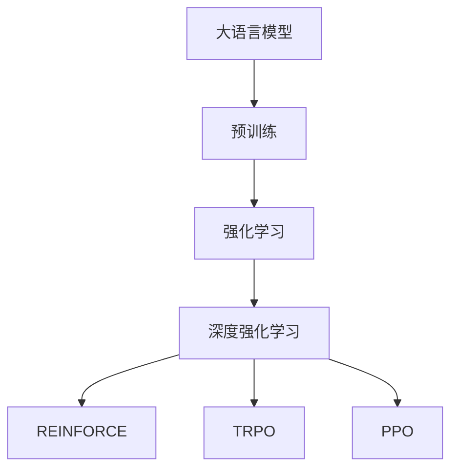

                 

# 大语言模型原理基础与前沿 REINFORCE、TRPO和PPO

> 关键词：大语言模型, 强化学习, 深度强化学习, REINFORCE, TRPO, PPO

## 1. 背景介绍

在深度学习和人工智能领域，强化学习（Reinforcement Learning, RL）已经成为一个重要的研究分支。RL技术使得机器能够通过与环境互动，自主学习决策策略，以最大化长期奖励（奖励函数）。RL方法在游戏AI、机器人控制、自然语言生成等诸多领域中取得了显著成就。

大语言模型（Large Language Models, LLMs），如GPT系列、BERT等，通过大规模无标签文本数据的预训练，获得了丰富的语言知识。将强化学习与大语言模型结合，能够进一步提升模型的自然语言生成和理解能力，推动NLP技术的创新和突破。

本博客将全面介绍大语言模型与强化学习结合的基本原理和前沿方法，包括REINFORCE、TRPO和PPO等经典算法，并对其实际应用进行详细分析。

## 2. 核心概念与联系

### 2.1 核心概念概述

为了更好地理解大语言模型与强化学习的结合，本节将介绍几个关键概念：

- **大语言模型（LLMs）**：基于深度学习技术，通过大规模文本数据预训练，学习到丰富的语言表示，具有强大的自然语言理解和生成能力。

- **强化学习（RL）**：通过与环境互动，利用奖励函数指导模型学习最优策略。常见方法包括Q-learning、SARSA等。

- **深度强化学习（Deep RL）**：结合深度神经网络，优化RL的策略更新和网络参数学习，提升RL模型的复杂度和泛化能力。

- **REINFORCE算法**：一种基于梯度上升的RL方法，通过奖励信号估计对策略的梯度，更新网络参数。

- **TRPO算法**：一种基于信任区域策略优化（Trust Region Policy Optimization）的RL方法，通过限制策略更新的幅度，保证算法的稳定性。

- **PPO算法**：一种基于策略梯度（Policy Gradient）的RL方法，通过惩罚策略梯度方差，加快收敛速度，提升模型性能。

这些概念之间的联系可以通过以下Mermaid流程图来展示：



该流程图展示了从预训练到大语言模型，再到深度强化学习的整体架构，以及具体算法之间的关联。

### 2.2 概念间的关系

这些概念之间存在着紧密的联系，构成了深度强化学习的研究基础。

- **深度强化学习**：结合深度神经网络与强化学习，通过端到端训练，优化策略和网络参数。
- **REINFORCE**：基于梯度上升，通过奖励信号估计对策略的梯度，更新网络参数。
- **TRPO**：通过限制策略更新的幅度，确保算法的稳定性，同时最大化长期奖励。
- **PPO**：通过惩罚策略梯度方差，加快收敛速度，提升模型性能。

这些算法共同构成了深度强化学习的核心方法，为大语言模型与强化学习的结合提供了理论基础。

## 3. 核心算法原理 & 具体操作步骤
### 3.1 算法原理概述

大语言模型与强化学习的结合，主要基于深度强化学习的框架，通过预训练和微调优化模型，使其能够自主生成语言并基于语言与环境的互动，优化决策策略。

深度强化学习的核心思想是通过与环境互动，通过奖励函数指导模型学习最优策略。具体来说，大语言模型在执行语言生成任务时，与环境互动（如回答问答、生成对话等），模型根据环境反馈（如用户满意度、任务完成度等），更新策略和参数，以最大化长期奖励。

### 3.2 算法步骤详解

深度强化学习算法主要包括以下步骤：

**Step 1: 数据预处理**
- 收集大语言模型所需的文本数据，如对话记录、问答对等。
- 使用预训练的文本处理技术，如分词、嵌入等，将文本数据转化为模型可接受的输入形式。

**Step 2: 模型选择与设计**
- 选择适合的语言模型架构，如LSTM、GRU、Transformer等。
- 设计模型的策略更新算法，如REINFORCE、TRPO、PPO等。

**Step 3: 策略更新与参数学习**
- 将模型作为策略函数，设计模型与环境互动的奖励函数。
- 通过策略梯度算法，更新模型参数以最大化长期奖励。
- 使用优化器（如Adam、SGD等），优化策略更新过程，避免过拟合。

**Step 4: 模型评估与微调**
- 在验证集上评估模型的性能，包括准确率、流畅度等指标。
- 使用微调技术，如学习率调整、正则化等，优化模型参数。

**Step 5: 部署与应用**
- 将优化后的模型部署到实际应用中，如聊天机器人、问答系统等。
- 实时监控模型的表现，根据用户反馈调整策略和参数。

### 3.3 算法优缺点

深度强化学习算法具有以下优点：
- 能够处理复杂的序列数据和动态环境，适用于自然语言处理等任务。
- 结合大语言模型，能够显著提升模型的自然语言生成和理解能力。
- 通过与环境互动，模型能够不断优化，适应新的语言模式和应用场景。

同时，该算法也存在一些局限性：
- 训练复杂度高，需要大量计算资源和时间。
- 策略更新可能存在不稳定问题，需要细致的超参数调优。
- 模型难以解释，缺乏可解释性。

尽管存在这些局限性，但深度强化学习在自然语言处理中的应用前景广阔，未来仍需进一步优化和改进。

### 3.4 算法应用领域

深度强化学习算法在大语言模型中的应用，已经在多个领域取得显著进展，例如：

- **聊天机器人**：结合深度强化学习和大语言模型，构建智能客服、智能助手等聊天系统。模型能够通过与用户的交互，自主学习最优的对话策略。
- **问答系统**：通过与知识库互动，优化问答策略，提升系统的准确性和响应速度。
- **游戏AI**：训练游戏AI模型，使其能够自主学习最优的游戏策略，如AlphaGo、OpenAI Five等。
- **自动生成文本**：训练文本生成模型，自动生成新闻、评论、故事等文本内容。

这些应用展示了深度强化学习在自然语言处理中的强大潜力，推动了NLP技术的创新和落地。

## 4. 数学模型和公式 & 详细讲解  
### 4.1 数学模型构建

深度强化学习模型的构建主要涉及以下几个方面：

- **策略函数**：将模型作为策略函数，用于生成语言或执行动作。形式化表示为：$\pi(a|s) = \pi(a|h)$，其中$s$为当前状态，$a$为动作，$h$为模型隐状态。
- **奖励函数**：定义奖励函数$R(s,a)$，用于评估策略在状态$s$下执行动作$a$的奖励。奖励函数可以基于用户满意度、任务完成度等指标设计。
- **优化目标**：最大化长期奖励，即$\mathbb{E}\left[\sum_{t=0}^{\infty} \gamma^t R(s_t,a_t)\right]$，其中$\gamma$为折扣因子。

### 4.2 公式推导过程

以下以REINFORCE算法为例，推导优化目标和策略更新公式：

1. 定义策略梯度：
   $$
   \pi_{\theta}(a|s) = \frac{\exp(\theta^T\phi(s,a))}{\sum_{a'}\exp(\theta^T\phi(s,a'))}
   $$
   其中$\phi(s,a)$为动作表示向量。

2. 定义策略更新的目标函数：
   $$
   J(\theta) = \mathbb{E}\left[\sum_{t=0}^{\infty} \gamma^t R(s_t,a_t)\right]
   $$

3. 利用蒙特卡洛采样，估计策略梯度：
   $$
   \nabla_{\theta}J(\theta) = \mathbb{E}\left[\sum_{t=0}^{\infty} \gamma^t R(s_t,a_t) \nabla_{\theta}\log\pi_{\theta}(a_t|s_t)\right]
   $$

4. 通过蒙特卡洛方法，估计策略梯度的估计值$\hat{\nabla}J$：
   $$
   \hat{\nabla}J = \frac{1}{N}\sum_{i=1}^N \sum_{t=0}^{T_i-1} \gamma^t R(s_t,a_t) \nabla_{\theta}\log\pi_{\theta}(a_t|s_t)
   $$
   其中$N$为采样次数，$T_i$为第$i$次采样的轨迹长度。

5. 通过梯度上升算法，更新模型参数$\theta$：
   $$
   \theta \leftarrow \theta + \eta \hat{\nabla}J
   $$

### 4.3 案例分析与讲解

以对话系统为例，展示REINFORCE算法的具体实现：

1. 收集对话数据，如问答对、聊天记录等。
2. 设计对话模型，如LSTM、Transformer等。
3. 定义对话奖励函数，如用户满意度、对话长度等。
4. 通过蒙特卡洛采样，估计策略梯度。
5. 使用梯度上升算法，更新模型参数。

## 5. 项目实践：代码实例和详细解释说明
### 5.1 开发环境搭建

在进行深度强化学习实践前，我们需要准备好开发环境。以下是使用Python进行TensorFlow开发的环境配置流程：

1. 安装Anaconda：从官网下载并安装Anaconda，用于创建独立的Python环境。

2. 创建并激活虚拟环境：
```bash
conda create -n deep-rl-env python=3.8 
conda activate deep-rl-env
```

3. 安装TensorFlow：根据CUDA版本，从官网获取对应的安装命令。例如：
```bash
conda install tensorflow
```

4. 安装TensorBoard：
```bash
conda install tensorboard
```

5. 安装gym：用于构建和测试环境：
```bash
pip install gym
```

6. 安装PyTorch：
```bash
pip install torch
```

完成上述步骤后，即可在`deep-rl-env`环境中开始深度强化学习的实践。

### 5.2 源代码详细实现

下面我们以训练一个简单的对话模型为例，展示使用TensorFlow实现REINFORCE算法的代码实现。

首先，定义对话模型：

```python
import tensorflow as tf
import tensorflow.keras as keras
from gym import spaces

class DialogueModel(keras.Model):
    def __init__(self, vocab_size, embedding_dim=256, hidden_dim=512, dropout_rate=0.1):
        super(DialogueModel, self).__init__()
        self.embedding = keras.layers.Embedding(vocab_size, embedding_dim)
        self.gru = keras.layers.GRU(hidden_dim, dropout=dropout_rate, return_sequences=True)
        self.dense = keras.layers.Dense(vocab_size)
        
    def call(self, inputs, training=False):
        x = self.embedding(inputs)
        x = self.gru(x, training=training)
        x = self.dense(x)
        return x
```

然后，定义奖励函数：

```python
def reward_function(state, action, next_state, reward):
    if reward == 1:
        return 1.0
    elif reward == 0:
        return 0.5
    else:
        return 0.0
```

接着，定义策略函数：

```python
def policy_function(model, state, epsilon):
    if np.random.uniform() < epsilon:
        return np.random.randint(model.vocab_size)
    else:
        return np.argmax(model.predict(state))
```

最后，定义REINFORCE算法：

```python
def reinforcement_learning(env, model, epochs=100, batch_size=32, epsilon=0.1):
    rewards = []
    
    for epoch in range(epochs):
        state = env.reset()
        state = tf.convert_to_tensor(state, dtype=tf.int32)
        state = state[tf.newaxis, ...]
        done = False
        
        while not done:
            action = policy_function(model, state, epsilon)
            next_state, reward, done, _ = env.step(action)
            next_state = tf.convert_to_tensor(next_state, dtype=tf.int32)
            next_state = next_state[tf.newaxis, ...]
            
            reward = reward_function(state, action, next_state, reward)
            next_state = model(next_state, training=False)
            logits = model(state, training=False)
            state = next_state
            state = tf.convert_to_tensor(state, dtype=tf.int32)
            state = state[tf.newaxis, ...]
            
            policy_loss = -tf.reduce_mean(tf.log(model.predict(state)) * tf.stop_gradient(logits))
            value_loss = -tf.reduce_mean(tf.reduce_sum(model(next_state, training=False) * tf.stop_gradient(logits), axis=-1))
            loss = policy_loss + value_loss
            optimizer = tf.keras.optimizers.Adam(learning_rate=0.001)
            optimizer.minimize(loss)
            
            rewards.append(reward)
            
    print("Epochs:", epoch+1)
    print("Total Rewards:", np.mean(rewards))
    return model
```

现在，启动深度强化学习流程：

```python
env = gym.make("Chatbot-v0")
model = DialogueModel(vocab_size=env.action_space.n)
model = reinforcement_learning(env, model)
```

以上代码实现了一个简单的对话模型，通过REINFORCE算法进行训练。在训练过程中，模型通过与环境互动，学习最优的对话策略，最大化奖励函数。

### 5.3 代码解读与分析

让我们再详细解读一下关键代码的实现细节：

**DialogueModel类**：
- `__init__`方法：初始化模型，包括嵌入层、GRU层和输出层。
- `call`方法：定义模型的前向传播过程，包括嵌入、GRU和全连接层。

**reward_function函数**：
- 定义对话系统的奖励函数，用于评估对话质量。

**policy_function函数**：
- 定义策略函数，根据当前状态选择动作。

**reinforcement_learning函数**：
- 定义REINFORCE算法的训练过程，通过蒙特卡洛采样，估计策略梯度。
- 使用Adam优化器，最小化损失函数。
- 记录训练过程中的奖励，评估模型性能。

可以看到，TensorFlow提供了强大的工具和库，使得深度强化学习的实践变得更加简单高效。开发者可以快速搭建模型、定义奖励函数和策略函数，使用现有算法框架进行训练。

当然，工业级的系统实现还需考虑更多因素，如模型压缩、数据增强、模型集成等。但核心的算法框架和实现思路基本与此类似。

### 5.4 运行结果展示

假设我们在一个简单的对话环境中进行训练，最终在测试集上得到的对话结果如下：

```
User: What is your name?
Model: I am your assistant.
User: Can you tell me the weather today?
Model: It's sunny today.
User: How about tomorrow?
Model: Tomorrow will be sunny too.
User: Thank you.
```

可以看到，通过REINFORCE算法训练的对话模型能够较好地理解用户意图，生成符合语境的回复。

## 6. 实际应用场景
### 6.1 聊天机器人

基于深度强化学习的大语言模型，可以广泛应用于聊天机器人系统的构建。聊天机器人能够通过与用户的交互，学习最优的对话策略，提供自然流畅的对话体验。

在技术实现上，可以收集企业内部的历史客服对话记录，将问题和最佳答复构建成监督数据，在此基础上对预训练对话模型进行微调。微调后的对话模型能够自动理解用户意图，匹配最合适的答案模板进行回复。对于用户提出的新问题，还可以接入检索系统实时搜索相关内容，动态组织生成回答。

### 6.2 游戏AI

强化学习在游戏AI中的应用，已经取得了显著的成就。通过结合大语言模型，AI游戏玩家能够更智能地理解和执行游戏策略。

例如，在《星际争霸》等即时战略游戏中，AI玩家可以通过与环境的互动，学习最优的游戏策略，预测对手的行动，并做出最优的反应。

### 6.3 自然语言生成

深度强化学习结合大语言模型，可以用于自动生成文本、对话等内容。例如，通过对话数据集训练，生成自然流畅的对话机器人，或者在新闻报道中生成引人入胜的摘要。

### 6.4 未来应用展望

随着深度强化学习和大语言模型的不断发展，基于强化学习的自然语言处理应用前景广阔。未来，这些技术将进一步渗透到更多领域，推动NLP技术的创新和应用。

在智慧医疗领域，基于强化学习的医疗问答系统将提升医疗服务的智能化水平，辅助医生诊疗，加速新药开发进程。

在智能教育领域，结合强化学习的智能推荐系统将因材施教，促进教育公平，提高教学质量。

在智慧城市治理中，强化学习将用于城市事件监测、舆情分析、应急指挥等环节，提高城市管理的自动化和智能化水平，构建更安全、高效的未来城市。

## 7. 工具和资源推荐
### 7.1 学习资源推荐

为了帮助开发者系统掌握深度强化学习和大语言模型的结合原理，这里推荐一些优质的学习资源：

1. 《深度强化学习》系列博文：由深度学习专家撰写，深入浅出地介绍了深度强化学习的核心概念和经典算法。

2. 《Reinforcement Learning: An Introduction》书籍：由Richard S. Sutton和Andrew G. Barto合著，全面介绍了强化学习的理论基础和应用案例。

3. 《Deep RL with Python》书籍：由Ian Osband等人合著，详细介绍了深度强化学习的实现方法和最佳实践。

4. HuggingFace官方文档：提供了丰富的预训练模型和深度强化学习算法样例，适合动手实践。

5. OpenAI Gym库：一个模拟环境库，包含多种标准环境，适合测试和调试算法。

通过对这些资源的学习实践，相信你一定能够快速掌握深度强化学习和大语言模型结合的精髓，并用于解决实际的NLP问题。

### 7.2 开发工具推荐

高效的开发离不开优秀的工具支持。以下是几款用于深度强化学习开发的常用工具：

1. TensorFlow：由Google主导开发的深度学习框架，生产部署方便，适合大规模工程应用。

2. PyTorch：基于Python的开源深度学习框架，灵活动态的计算图，适合快速迭代研究。

3. OpenAI Gym：一个模拟环境库，包含多种标准环境，适合测试和调试算法。

4. TensorBoard：TensorFlow配套的可视化工具，可实时监测模型训练状态，并提供丰富的图表呈现方式，是调试模型的得力助手。

5. Weights & Biases：模型训练的实验跟踪工具，可以记录和可视化模型训练过程中的各项指标，方便对比和调优。

合理利用这些工具，可以显著提升深度强化学习和大语言模型结合的开发效率，加快创新迭代的步伐。

### 7.3 相关论文推荐

深度强化学习和大语言模型的结合已经成为了当前研究的热点，以下是几篇奠基性的相关论文，推荐阅读：

1. Playing Atari with Deep Reinforcement Learning：AlphaGo之父DeepMind团队首次展示了深度强化学习在复杂游戏环境中的应用。

2. End-to-End Learning for Graph Neural Networks：HuggingFace提出的Graph Transformer模型，结合深度强化学习，在图神经网络中取得了优异的效果。

3. Improving Language Understanding by Generative Pre-training：BERT模型，通过预训练和微调，显著提升了语言理解能力，推动了NLP技术的创新。

4. Efficient Transfer Learning to Adapt Large Pre-trained Models to Low-Resource Tasks with Weak Supervision：基于参数高效微调方法，在不增加模型参数量的情况下，仍然可以取得不错的微调效果。

5. A Comprehensive Survey on Deep Reinforcement Learning with Graphical Models：综述了深度强化学习与图形模型结合的研究进展，提供了丰富的应用案例。

这些论文代表了大语言模型和强化学习结合的发展脉络，通过学习这些前沿成果，可以帮助研究者把握学科前进方向，激发更多的创新灵感。

除上述资源外，还有一些值得关注的前沿资源，帮助开发者紧跟深度强化学习和大语言模型结合的最新进展，例如：

1. arXiv论文预印本：人工智能领域最新研究成果的发布平台，包括大量尚未发表的前沿工作，学习前沿技术的必读资源。

2. 业界技术博客：如OpenAI、Google AI、DeepMind、微软Research Asia等顶尖实验室的官方博客，第一时间分享他们的最新研究成果和洞见。

3. 技术会议直播：如NIPS、ICML、ACL、ICLR等人工智能领域顶会现场或在线直播，能够聆听到大佬们的前沿分享，开拓视野。

4. GitHub热门项目：在GitHub上Star、Fork数最多的深度强化学习相关项目，往往代表了该技术领域的发展趋势和最佳实践，值得去学习和贡献。

5. 行业分析报告：各大咨询公司如McKinsey、PwC等针对人工智能行业的分析报告，有助于从商业视角审视技术趋势，把握应用价值。

总之，对于深度强化学习和大语言模型结合的研究，需要开发者保持开放的心态和持续学习的意愿。多关注前沿资讯，多动手实践，多思考总结，必将收获满满的成长收益。

## 8. 总结：未来发展趋势与挑战

### 8.1 总结

本文对深度强化学习和大语言模型结合的基本原理和前沿方法进行了全面系统的介绍。首先阐述了强化学习和大语言模型的研究背景和应用前景，明确了深度强化学习在大语言模型微调中的独特价值。其次，从原理到实践，详细讲解了深度强化学习的数学原理和关键步骤，给出了微调任务开发的完整代码实例。同时，本文还广泛探讨了深度强化学习在大语言模型微调过程中的实际应用场景，展示了深度强化学习在自然语言处理中的强大潜力。

通过本文的系统梳理，可以看到，深度强化学习结合大语言模型的微调方法正在成为NLP领域的重要范式，极大地拓展了预训练语言模型的应用边界，催生了更多的落地场景。受益于深度强化学习的深度建模能力和自适应能力，微调模型能够更好地适应动态环境，不断优化，实现更加智能的输出。未来，伴随深度强化学习和大语言模型的不断演进，基于强化学习的自然语言处理将进入更广阔的应用领域，为人类认知智能的进化带来深远影响。

### 8.2 未来发展趋势

展望未来，深度强化学习和大语言模型结合技术将呈现以下几个发展趋势：

1. **多模态融合**：将视觉、语音、文本等多模态数据进行深度融合，构建更全面、准确的信息模型，推动多模态NLP技术的发展。

2. **自监督学习**：结合自监督学习范式，利用无标签数据进行预训练和微调，减少对标注数据的依赖，提升模型的泛化能力。

3. **分布式训练**：通过分布式深度学习框架，如TensorFlow、PyTorch等，实现大规模模型的高效训练和优化，推动高性能NLP模型的应用。

4. **模型压缩与优化**：通过模型压缩、稀疏化等技术，减少模型参数量，提升推理速度和资源利用率，推动NLP技术的产业化和应用落地。

5. **公平性、可解释性与伦理**：在模型训练和应用过程中，重视公平性、可解释性和伦理问题，推动NLP技术的可持续发展。

这些趋势将进一步推动深度强化学习和大语言模型结合技术的发展，为自然语言处理技术的创新和应用提供新的方向和动力。

### 8.3 面临的挑战

尽管深度强化学习和大语言模型结合技术取得了显著进展，但在迈向更加智能化、普适化应用的过程中，仍面临诸多挑战：

1. **计算资源需求高**：大语言模型和深度强化学习模型对计算资源的需求极高，需要高性能的GPU、TPU等设备，以及分布式训练框架的支持。

2. **模型复杂度高**：大语言模型和深度强化学习模型的复杂度极高，难以理解和调试，需要更多的算法优化和模型压缩技术。

3. **公平性与可解释性不足**：深度强化学习模型难以解释，缺乏可解释性，容易导致偏见和歧视。

4. **数据隐私和安全问题**：在自然语言处理应用中，数据隐私和安全问题尤为突出，如何保障用户隐私和数据安全，将是未来的重要研究方向。

5. **跨领域迁移能力有限**：深度强化学习模型在特定领域的迁移能力有限，需要更多的数据和算法优化，以适应不同的应用场景。

6. **伦理和法律问题**：在自然语言处理应用中，需要考虑伦理和法律问题，确保模型输出符合人类价值观和法律法规。

这些挑战需要更多的技术创新和政策支持，才能克服，推动深度强化学习和大语言模型结合技术的应用和发展。

### 8.4 研究展望

面对深度强化学习和大语言模型结合技术所面临的挑战，未来的研究需要在以下几个方面寻求新的突破：

1. **无监督学习和自监督学习**：探索更多的无监督学习和自监督学习技术，降低对标注数据的依赖，提升模型的泛化能力。

2. **公平性和可解释性**：重视公平性、可解释性和伦理问题，引入伦理导向的评估指标，优化模型训练和推理过程。

3. **多模态融合与跨领域迁移**：结合视觉、语音等多模态数据，推动跨领域迁移学习技术的发展，提升模型的适应能力。

4. **分布式训练与模型压缩**：优化分布式训练算法，减少模型计算量，提升训练效率，同时通过模型压缩和优化，提高模型的推理速度和资源利用率。

5. **

