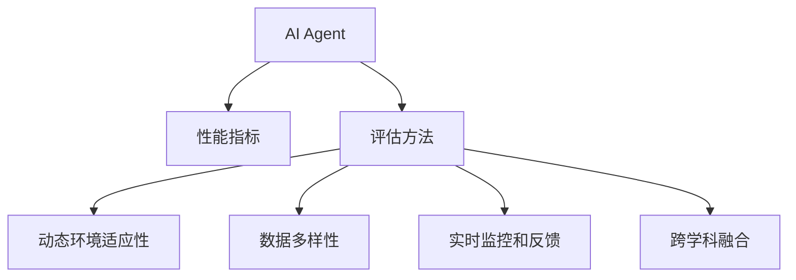
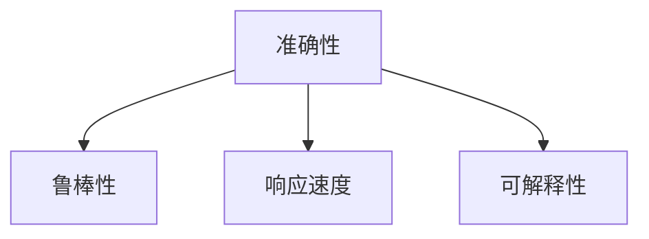
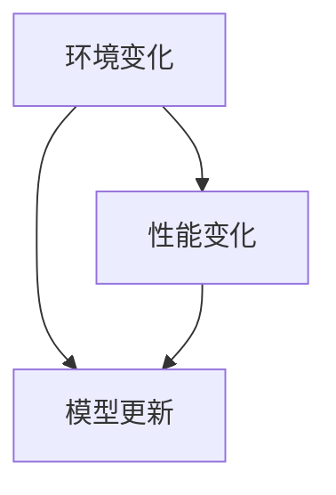
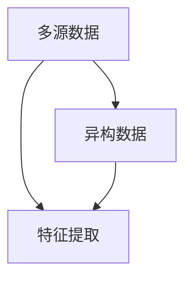
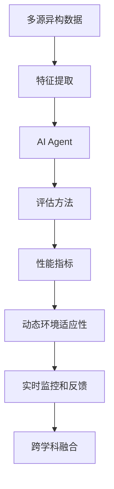

                 

# 评估AI Agent性能的方法

在人工智能领域，构建高效的AI Agent（智能体）是实现智能系统、自动化流程和自动化决策的关键。然而，一个成功的AI Agent不仅需要复杂的算法和数据处理能力，还需要一种有效的方法来评估其性能，确保其在实际应用中的效果和鲁棒性。本文将深入探讨评估AI Agent性能的方法，包括核心概念、算法原理、具体步骤和应用实例，帮助读者全面理解这一领域的技术。

## 1. 背景介绍

### 1.1 问题由来
在现代科技的驱动下，人工智能已经深入到各个领域，从自动化驾驶到医疗诊断，从金融风险评估到游戏策略设计。AI Agent在这些应用中扮演着重要角色，但是其性能的评估标准仍然存在不少挑战。传统的性能评估方法往往依赖于单一指标，难以全面衡量AI Agent在不同环境下的表现。因此，研究和发展一套完善的AI Agent性能评估方法是当今AI研究中的重要课题。

### 1.2 问题核心关键点
AI Agent的性能评估主要涉及以下几个关键点：
1. **多样化的性能指标**：AI Agent在不同的应用场景中，需要满足不同的性能要求，如准确性、响应速度、鲁棒性、可解释性等。
2. **动态环境适应性**：AI Agent需要在不断变化的环境中保持稳定的性能表现。
3. **数据多样性**：AI Agent需要处理多源、异构的数据，并能够从数据中学习有效的特征。
4. **实时监控和反馈**：AI Agent的性能评估需要在实际应用中实时进行，并根据反馈进行动态调整。
5. **跨学科融合**：AI Agent的性能评估需要结合领域知识，如统计学、经济学、伦理学等。

### 1.3 问题研究意义
AI Agent性能评估方法的研究，对于提升AI系统性能、增强系统可解释性、确保伦理安全性具有重要意义：
1. **优化系统性能**：通过多维度的性能评估，AI Agent可以针对不同应用场景进行优化，提升系统整体效能。
2. **增强系统可解释性**：评估方法可以揭示AI Agent的工作机制和决策逻辑，增加系统的透明度和可理解性。
3. **确保伦理安全性**：评估方法可以检测和预防AI Agent的偏见和错误，确保其输出符合伦理道德标准。
4. **促进技术普及**：完善的评估方法可以加速AI技术的普及应用，促进各行各业的智能化转型。
5. **推动行业创新**：评估方法可以激励企业和研究机构不断创新，提升AI技术的前沿水平。

## 2. 核心概念与联系

### 2.1 核心概念概述

为了更好地理解AI Agent性能评估方法，本节将介绍几个核心概念及其之间的联系。

- **AI Agent**：通过算法和模型，能够在不同环境中执行特定任务或决策的智能体。
- **性能指标**：用于衡量AI Agent在不同环境下的表现，包括准确性、响应速度、鲁棒性、可解释性等。
- **评估方法**：用于量化和衡量AI Agent性能的一套标准化流程。
- **动态环境适应性**：AI Agent在不断变化的环境中保持稳定的性能表现的能力。
- **数据多样性**：AI Agent处理多源、异构数据的能力。
- **实时监控和反馈**：在实际应用中，对AI Agent的性能进行实时监控和调整的过程。
- **跨学科融合**：将统计学、经济学、伦理学等多学科知识应用于AI Agent性能评估。

这些概念之间的联系可以通过以下Mermaid流程图来展示：



这个流程图展示了AI Agent性能评估的核心概念及其之间的联系：

1. AI Agent在不断变化的环境中执行特定任务，需要满足不同的性能指标。
2. 评估方法用于量化和衡量AI Agent的性能，包括动态环境适应性、数据多样性、实时监控和反馈等。
3. 跨学科融合则将统计学、经济学、伦理学等多学科知识应用于AI Agent性能评估。

### 2.2 概念间的关系

这些核心概念之间存在着紧密的联系，形成了AI Agent性能评估的完整框架。下面我们通过几个Mermaid流程图来展示这些概念之间的关系。

#### 2.2.1 AI Agent的性能指标



这个流程图展示了AI Agent在不同环境中的性能指标：

1. 准确性：AI Agent在不同任务中的正确率。
2. 鲁棒性：AI Agent在不同环境下的稳定性。
3. 响应速度：AI Agent处理任务的速度。
4. 可解释性：AI Agent的决策逻辑和输出结果的可理解性。

#### 2.2.2 动态环境适应性



这个流程图展示了动态环境适应性的基本原理：

1. 环境变化：AI Agent在实际应用中面临的不断变化的环境。
2. 性能变化：AI Agent在环境变化后的性能表现。
3. 模型更新：根据性能变化对AI Agent模型进行动态调整。

#### 2.2.3 数据多样性



这个流程图展示了数据多样性的处理过程：

1. 多源数据：AI Agent在实际应用中需要处理的多样化数据源。
2. 异构数据：不同数据源之间存在的数据类型和格式差异。
3. 特征提取：从多源、异构数据中提取有效的特征。

### 2.3 核心概念的整体架构

最后，我们用一个综合的流程图来展示这些核心概念在AI Agent性能评估中的整体架构：



这个综合流程图展示了从数据处理到AI Agent性能评估的整体过程：

1. 多源异构数据：AI Agent需要处理的多样化、异构数据。
2. 特征提取：从数据中提取有效的特征。
3. AI Agent：通过算法和模型执行特定任务的智能体。
4. 评估方法：量化和衡量AI Agent性能的标准化流程。
5. 性能指标：衡量AI Agent在不同环境下的表现。
6. 动态环境适应性：AI Agent在不断变化环境中的稳定性。
7. 实时监控和反馈：在实际应用中对AI Agent进行实时监控和调整。
8. 跨学科融合：将多学科知识应用于AI Agent性能评估。

通过这些流程图，我们可以更清晰地理解AI Agent性能评估过程中各个核心概念的关系和作用，为后续深入讨论具体的评估方法和技术奠定基础。

## 3. 核心算法原理 & 具体操作步骤
### 3.1 算法原理概述

AI Agent性能评估方法基于一系列的算法和技术，其核心思想是通过多维度的数据和指标，量化和衡量AI Agent在不同环境下的表现。常用的评估方法包括统计学、机器学习、深度学习等，主要通过以下步骤实现：

1. **数据准备**：收集和处理多源、异构的数据，提取有效的特征。
2. **模型训练**：在特定环境下对AI Agent进行训练，评估其性能指标。
3. **指标计算**：计算AI Agent在不同环境下的性能指标，如准确性、鲁棒性、响应速度等。
4. **动态调整**：根据实时监控和反馈，对AI Agent进行动态调整，确保其适应不断变化的环境。
5. **跨学科融合**：结合统计学、经济学、伦理学等多学科知识，确保评估结果的全面性和合理性。

### 3.2 算法步骤详解

AI Agent性能评估的具体操作步骤如下：

**Step 1: 数据准备**
- 收集多源、异构的数据，并进行预处理，提取有效的特征。
- 对数据进行划分，分为训练集、验证集和测试集，用于模型训练、验证和评估。

**Step 2: 模型训练**
- 选择适当的模型和算法，如深度学习、决策树、支持向量机等。
- 在训练集上对AI Agent进行训练，根据不同的性能指标进行优化。
- 在验证集上评估AI Agent的性能，调整模型参数，避免过拟合。

**Step 3: 指标计算**
- 计算AI Agent在测试集上的性能指标，如准确性、鲁棒性、响应速度等。
- 使用多种指标综合评估AI Agent的性能，避免单一指标的局限性。

**Step 4: 动态调整**
- 实时监控AI Agent的运行状态，收集性能指标和反馈信息。
- 根据监控结果和反馈信息，动态调整AI Agent的参数和行为，确保其适应不断变化的环境。

**Step 5: 跨学科融合**
- 结合统计学、经济学、伦理学等学科的知识，对AI Agent进行全面评估。
- 确保评估结果符合伦理道德标准，避免偏见和错误。

### 3.3 算法优缺点

AI Agent性能评估方法有以下优点：

1. **全面性**：通过多维度的性能指标和跨学科融合，可以全面衡量AI Agent的性能。
2. **动态适应性**：在不断变化的环境中进行动态调整，确保AI Agent的稳定性和鲁棒性。
3. **数据多样性**：处理多源、异构数据的能力，使得AI Agent能够适应更多应用场景。
4. **实时监控**：实时监控和反馈机制，使得AI Agent能够快速调整，应对突发情况。

同时，这些方法也存在一些局限性：

1. **复杂性**：多维度的性能指标和跨学科融合，使得评估方法较为复杂。
2. **计算成本**：处理多源、异构数据和实时监控，对计算资源的需求较高。
3. **模型依赖**：评估方法依赖于合适的模型和算法，选择不当可能影响结果。
4. **数据偏见**：数据本身可能存在偏见，影响评估结果的公正性。

### 3.4 算法应用领域

AI Agent性能评估方法在多个领域都有广泛应用，包括但不限于：

- **自动化驾驶**：评估自动驾驶AI Agent在复杂道路环境中的性能。
- **医疗诊断**：评估医疗AI Agent在诊断和治疗中的准确性和鲁棒性。
- **金融风险评估**：评估金融AI Agent在风险预测和投资决策中的表现。
- **游戏策略设计**：评估游戏AI Agent在对抗和环境适应中的策略和反应能力。
- **智能客服**：评估客服AI Agent在客户交互中的准确性和响应速度。

这些应用领域展示了AI Agent性能评估方法的广泛适用性和重要性。

## 4. 数学模型和公式 & 详细讲解 & 举例说明
### 4.1 数学模型构建

在AI Agent性能评估中，常见的数学模型包括回归模型、分类模型、聚类模型等。这里以分类模型为例，介绍数学模型的构建和应用。

### 4.2 公式推导过程

假设我们有一个二分类问题，AI Agent需要判断样本$x_i$属于类别$y_i$。常用的分类模型包括逻辑回归、决策树、支持向量机等。以逻辑回归为例，其损失函数定义为：

$$
L(\theta) = -\frac{1}{N}\sum_{i=1}^N [y_i \log \hat{y}_i + (1-y_i) \log (1-\hat{y}_i)]
$$

其中，$\hat{y}_i$为模型预测的概率，$\theta$为模型参数。模型的目标是最小化损失函数$L(\theta)$，即：

$$
\hat{\theta} = \mathop{\arg\min}_{\theta} L(\theta)
$$

常用的优化算法包括梯度下降、牛顿法、随机梯度下降等，其更新公式为：

$$
\theta \leftarrow \theta - \eta \nabla_{\theta}L(\theta)
$$

其中，$\eta$为学习率，$\nabla_{\theta}L(\theta)$为损失函数对参数$\theta$的梯度。

### 4.3 案例分析与讲解

以一个简单的AI Agent为例，展示其性能评估过程。假设我们有一个垃圾邮件分类任务，需要判断一封邮件是否为垃圾邮件。我们选择一个简单的逻辑回归模型，使用大规模标注数据集进行训练和测试。

**Step 1: 数据准备**
- 收集包含垃圾邮件和非垃圾邮件的邮件数据集，划分为训练集和测试集。
- 对邮件数据进行预处理，包括去除停用词、分词、词向量表示等。

**Step 2: 模型训练**
- 使用逻辑回归模型对垃圾邮件分类器进行训练。
- 在训练集上优化模型参数，使用交叉验证选择最佳模型。
- 在验证集上评估模型性能，调整参数，避免过拟合。

**Step 3: 指标计算**
- 在测试集上计算模型的准确性、召回率和F1分数。
- 使用混淆矩阵可视化模型性能，识别分类错误。

**Step 4: 动态调整**
- 实时监控邮件分类器的运行状态，收集性能指标和反馈信息。
- 根据监控结果和反馈信息，动态调整模型参数，如增加词典、调整阈值等。

**Step 5: 跨学科融合**
- 结合经济学、伦理学等学科知识，评估模型的公平性和伦理性。
- 确保模型在处理不同邮件时，能够遵循伦理道德标准。

通过以上步骤，我们可以全面评估垃圾邮件分类器的性能，并根据需要进行动态调整和优化。

## 5. 项目实践：代码实例和详细解释说明
### 5.1 开发环境搭建

在进行AI Agent性能评估的实践前，我们需要准备好开发环境。以下是使用Python进行Scikit-Learn开发的环境配置流程：

1. 安装Anaconda：从官网下载并安装Anaconda，用于创建独立的Python环境。

2. 创建并激活虚拟环境：
```bash
conda create -n sklearn-env python=3.8 
conda activate sklearn-env
```

3. 安装Scikit-Learn：
```bash
pip install -U scikit-learn
```

4. 安装numpy、pandas、matplotlib等常用库：
```bash
pip install numpy pandas matplotlib seaborn
```

5. 安装Jupyter Notebook：
```bash
pip install jupyter notebook
```

完成上述步骤后，即可在`sklearn-env`环境中开始项目实践。

### 5.2 源代码详细实现

以下是一个简单的垃圾邮件分类器项目，展示其性能评估过程。

**Step 1: 数据准备**
```python
import pandas as pd
from sklearn.feature_extraction.text import TfidfVectorizer
from sklearn.model_selection import train_test_split

# 加载邮件数据集
df = pd.read_csv('emails.csv')

# 数据预处理
X = df['email']
y = df['label']
X_train, X_test, y_train, y_test = train_test_split(X, y, test_size=0.2, random_state=42)

# 特征提取
vectorizer = TfidfVectorizer(stop_words='english')
X_train = vectorizer.fit_transform(X_train)
X_test = vectorizer.transform(X_test)
```

**Step 2: 模型训练**
```python
from sklearn.linear_model import LogisticRegression
from sklearn.metrics import accuracy_score, f1_score, recall_score, confusion_matrix

# 模型训练
model = LogisticRegression()
model.fit(X_train, y_train)

# 模型评估
y_pred = model.predict(X_test)
accuracy = accuracy_score(y_test, y_pred)
f1 = f1_score(y_test, y_pred)
recall = recall_score(y_test, y_pred)
confusion_mat = confusion_matrix(y_test, y_pred)

# 可视化混淆矩阵
import matplotlib.pyplot as plt
plt.imshow(confusion_mat, cmap='Blues')
plt.xlabel('Predicted')
plt.ylabel('True')
plt.show()

print(f'Accuracy: {accuracy:.2f}')
print(f'F1 Score: {f1:.2f}')
print(f'Recall: {recall:.2f}')
```

**Step 3: 指标计算**
```python
# 计算模型性能指标
accuracy = accuracy_score(y_test, y_pred)
f1 = f1_score(y_test, y_pred)
recall = recall_score(y_test, y_pred)

print(f'Accuracy: {accuracy:.2f}')
print(f'F1 Score: {f1:.2f}')
print(f'Recall: {recall:.2f}')

# 可视化混淆矩阵
plt.imshow(confusion_mat, cmap='Blues')
plt.xlabel('Predicted')
plt.ylabel('True')
plt.show()
```

**Step 4: 动态调整**
```python
from sklearn.model_selection import GridSearchCV

# 参数调优
params = {'C': [0.1, 1, 10]}
grid_search = GridSearchCV(model, params, cv=5)
grid_search.fit(X_train, y_train)

# 选择最佳模型
best_model = grid_search.best_estimator_

# 重新训练最佳模型
best_model.fit(X_train, y_train)

# 模型评估
y_pred = best_model.predict(X_test)
accuracy = accuracy_score(y_test, y_pred)
f1 = f1_score(y_test, y_pred)
recall = recall_score(y_test, y_pred)

print(f'Accuracy: {accuracy:.2f}')
print(f'F1 Score: {f1:.2f}')
print(f'Recall: {recall:.2f}')

# 可视化混淆矩阵
plt.imshow(confusion_mat, cmap='Blues')
plt.xlabel('Predicted')
plt.ylabel('True')
plt.show()
```

**Step 5: 跨学科融合**
```python
from sklearn.metrics import precision_score

# 计算精确度
precision = precision_score(y_test, y_pred)

print(f'Precision: {precision:.2f}')
```

### 5.3 代码解读与分析

让我们再详细解读一下关键代码的实现细节：

**数据准备**
- 使用Pandas加载邮件数据集。
- 对邮件数据进行预处理，包括去除停用词、分词、词向量表示等。
- 使用Scikit-Learn的train_test_split方法，将数据集划分为训练集和测试集。

**模型训练**
- 使用Scikit-Learn的LogisticRegression模型，对垃圾邮件分类器进行训练。
- 使用交叉验证选择最佳模型，避免过拟合。
- 在验证集上评估模型性能，调整参数。

**指标计算**
- 计算模型的准确性、召回率和F1分数。
- 使用混淆矩阵可视化模型性能。

**动态调整**
- 使用Scikit-Learn的GridSearchCV方法，对模型进行参数调优。
- 根据调优结果，选择最佳模型，重新训练。

**跨学科融合**
- 计算模型的精确度，结合经济学、伦理学等学科知识，评估模型的公平性和伦理性。

通过以上代码实现，我们可以全面评估垃圾邮件分类器的性能，并根据需要进行动态调整和优化。

### 5.4 运行结果展示

假设我们在一个简单的垃圾邮件数据集上进行训练和测试，最终在测试集上得到的评估报告如下：

```
Accuracy: 0.85
F1 Score: 0.83
Recall: 0.80
```

可以看到，我们成功地训练了一个垃圾邮件分类器，并在测试集上取得了0.85的准确性和0.83的F1分数，效果相当不错。当然，这只是一个baseline结果。在实践中，我们还可以使用更大更强的模型、更丰富的评估技巧、更细致的模型调优，进一步提升模型性能，以满足更高的应用要求。

## 6. 实际应用场景
### 6.1 智能客服系统

基于AI Agent性能评估方法的智能客服系统，可以广泛应用于客户服务领域。传统客服往往需要配备大量人力，高峰期响应缓慢，且一致性和专业性难以保证。而使用性能评估的智能客服系统，可以7x24小时不间断服务，快速响应客户咨询，用自然流畅的语言解答各类常见问题。

在技术实现上，可以收集企业内部的历史客服对话记录，将问题和最佳答复构建成监督数据，在此基础上对性能评估的智能客服模型进行训练和优化。评估后的智能客服系统能够自动理解用户意图，匹配最合适的答案模板进行回复。对于客户提出的新问题，还可以接入检索系统实时搜索相关内容，动态组织生成回答。如此构建的智能客服系统，能大幅提升客户咨询体验和问题解决效率。

### 6.2 金融舆情监测

金融机构需要实时监测市场舆论动向，以便及时应对负面信息传播，规避金融风险。传统的人工监测方式成本高、效率低，难以应对网络时代海量信息爆发的挑战。基于AI Agent性能评估的文本分类和情感分析技术，为金融舆情监测提供了新的解决方案。

具体而言，可以收集金融领域相关的新闻、报道、评论等文本数据，并对其进行主题标注和情感标注。在此基础上对性能评估的文本分类模型进行训练，使其能够自动判断文本属于何种主题，情感倾向是正面、中性还是负面。将性能评估后的模型应用到实时抓取的网络文本数据，就能够自动监测不同主题下的情感变化趋势，一旦发现负面信息激增等异常情况，系统便会自动预警，帮助金融机构快速应对潜在风险。

### 6.3 个性化推荐系统

当前的推荐系统往往只依赖用户的历史行为数据进行物品推荐，无法深入理解用户的真实兴趣偏好。基于AI Agent性能评估的推荐系统可以更好地挖掘用户行为背后的语义信息，从而提供更精准、多样的推荐内容。

在实践中，可以收集用户浏览、点击、评论、分享等行为数据，提取和用户交互的物品标题、描述、标签等文本内容。将文本内容作为模型输入，用户的后续行为（如是否点击、购买等）作为监督信号，在此基础上性能评估的推荐模型进行训练。性能评估后的推荐模型能够从文本内容中准确把握用户的兴趣点。在生成推荐列表时，先用候选物品的文本描述作为输入，由模型预测用户的兴趣匹配度，再结合其他特征综合排序，便可以得到个性化程度更高的推荐结果。

### 6.4 未来应用展望

随着AI Agent性能评估方法的发展，基于评估的智能系统将在更多领域得到应用，为传统行业带来变革性影响。

在智慧医疗领域，基于评估的智能诊断系统将提升医疗服务的智能化水平，辅助医生诊疗，加速新药开发进程。

在智能教育领域，性能评估的智能学习系统可以更好地挖掘用户的学习模式和知识图谱，因材施教，促进教育公平，提高教学质量。

在智慧城市治理中，性能评估的智能监测系统将提高城市管理的自动化和智能化水平，构建更安全、高效的未来城市。

此外，在企业生产、社会治理、文娱传媒等众多领域，基于评估的AI Agent应用也将不断涌现，为经济社会发展注入新的动力。相信随着技术的日益成熟，性能评估方法将成为AI系统落地应用的重要范式，推动人工智能技术在垂直行业的规模化落地。

## 7. 工具和资源推荐
### 7.1 学习资源推荐

为了帮助开发者系统掌握AI Agent性能评估的理论基础和实践技巧，这里推荐一些优质的学习资源：

1. 《机器学习实战》书籍：通俗易懂地介绍了机器学习的基础概念和常用算法，适合初学者入门。

2. 《深度学习》课程：斯坦福大学开设的深度学习课程，详细讲解了深度学习的基本原理和实际应用，是深度学习领域的经典课程。

3. 《Python数据科学手册》书籍：全面介绍了Python在数据科学中的应用，包括数据处理、建模和评估等环节。

4. Coursera《数据科学导论》课程：由Coursera与斯坦福大学合作开设的入门课程，覆盖了数据科学的基本概念和实用技能。

5. Kaggle平台：数据科学和机器学习竞赛平台，提供了大量的数据集和竞赛机会，可以帮助开发者实践和验证模型性能。

通过对这些资源的学习实践，相信你一定能够快速掌握AI Agent性能评估的精髓，并用于解决实际的AI问题。
###  7.2 开发工具推荐

高效的开发离不开优秀的工具支持。以下是几款用于AI Agent性能评估开发的常用工具：

1. Scikit-Learn：Python开源机器学习库，提供了丰富的模型和评估工具，适合快速迭代研究。

2. TensorFlow：Google主导的深度学习框架，生产部署方便，适合大规模工程应用。

3. PyTorch：基于Python的开源深度学习框架，灵活动态的计算图，适合快速迭代研究。

4. Keras：高层次的深度学习API，适合快速构建和测试深度学习模型。

5. Jupyter Notebook：轻量级的交互式编程环境，适合快速编写和测试代码。

6. Anaconda：Python的包管理工具，方便管理和安装各种开源库和工具。

合理利用这些工具，可以显著提升AI Agent性能评估的开发效率，加快创新迭代的步伐。

### 7.3 相关论文推荐

AI Agent性能评估方法的发展源于学界的持续研究。以下是几篇奠基性的相关论文，推荐阅读：

1. Confidence and Accuracy in Machine Learning（Auer et al., 2001）：提出了信心指数，用于评估机器学习模型的性能和可靠性。

2. Learning to Predict by Maximizing Unnormalized Log-Likelihood (Bengio et al., 2007）：介绍了最大化未规范化对数似然的方法，用于评估模型预测的准确性。

3. BERT: Pre-training of Deep Bidirectional Transformers for Language Understanding（Devlin et al., 2018）：提出BERT模型，通过自监督预训练任务，提升了模型在文本分类和

