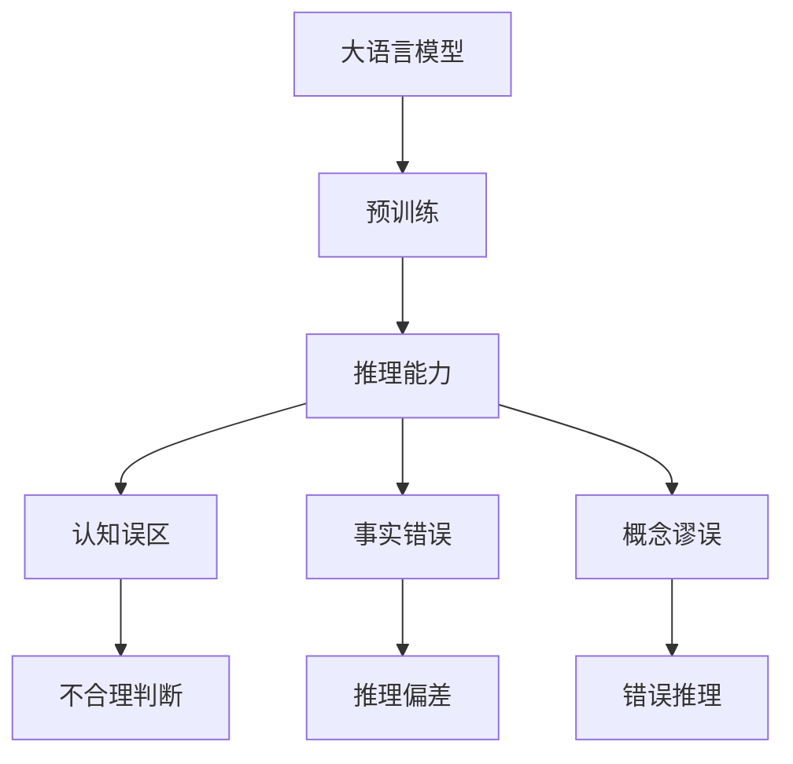
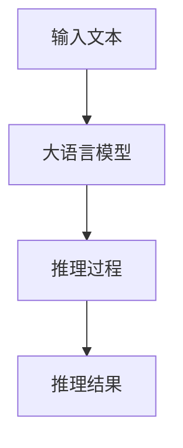
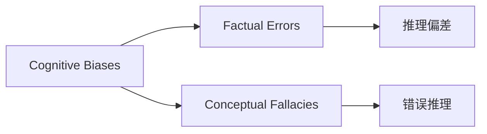
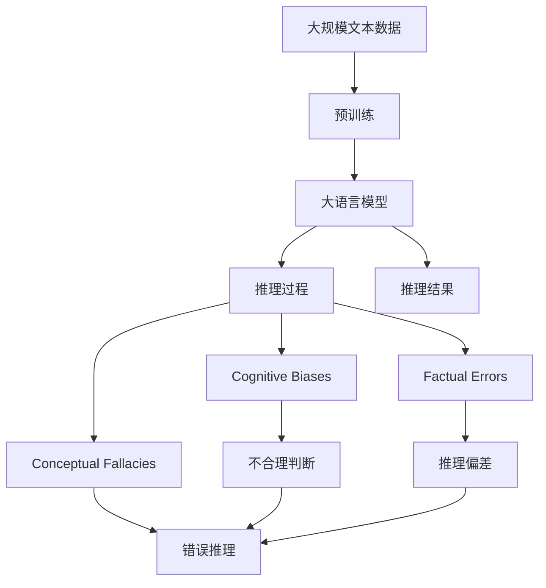

                 

# 语言与推理：大模型的认知误区

> 关键词：认知误区,大语言模型,预训练,推理能力,概念谬误

## 1. 背景介绍

### 1.1 问题由来
近年来，大语言模型（Large Language Models, LLMs）在自然语言处理（NLP）领域取得了革命性的进展。从早期的GPT系列到现如今的BERT、T5等模型，大语言模型通过在海量文本数据上进行预训练，已经具备了强大的语言理解能力和生成能力。然而，尽管大语言模型在各种自然语言处理任务上取得了卓越的性能，但其推理能力的局限性却常常被忽视。

### 1.2 问题核心关键点
大语言模型的推理能力是指模型能够从给定语言输入中，推断出其背后的真实逻辑和事实。尽管许多大模型在某些自然语言推理（Natural Language Inference, NLI）任务上表现优异，但其推理能力仍然存在一些局限性，如认知误区（Cognitive Biases）、事实错误、概念谬误等。这些问题不仅影响了大模型的可靠性，也限制了其在大规模实际应用中的潜力。

### 1.3 问题研究意义
研究大语言模型的推理能力，对提升其可靠性、推动其大规模应用具有重要意义：

1. 确保准确性：通过识别和纠正大模型的认知误区和推理错误，可以提升其在现实世界中的应用效果。
2. 提高鲁棒性：了解大模型的推理局限性，有助于在设计和优化模型时，采取针对性的措施，增强其鲁棒性和泛化能力。
3. 促进创新：针对推理能力进行深入研究，可以推动语言模型在更多领域的应用，如知识推理、问答系统、智能客服等。
4. 增强信任：通过提升大模型的推理可靠性，可以增强用户对其的信任感，促使其在更多领域中落地应用。
5. 避免伦理风险：识别并纠正大模型中的认知误区和推理错误，可以有效避免其被用于不道德的用途，如误导性信息传播、虚假事实生成等。

## 2. 核心概念与联系

### 2.1 核心概念概述

为更好地理解大语言模型在推理过程中可能出现的认知误区，本节将介绍几个关键概念：

- 大语言模型(Large Language Models, LLMs)：指在预训练阶段学习了大规模语料库的深度神经网络模型。这些模型能够处理复杂的语言表达，具备强大的语义理解和生成能力。

- 预训练(Pre-training)：指在大规模无标签文本语料上，通过自监督学习任务训练通用语言模型的过程。预训练使得模型学习到语言的通用表示，具备良好的泛化能力。

- 推理能力(Inference)：指模型根据给定输入推断出正确答案或决策的能力。推理能力是语言模型应用的核心，决定了大模型在实际任务中的表现。

- 认知误区(Cognitive Biases)：指人类和机器在推理过程中，由于心理、认知或知识上的局限性，所表现出的不合理或不公正的判断和行为。

- 事实错误(Factual Errors)：指模型在推理过程中，由于对事实的不准确理解或记忆错误，导致推理结果的偏差。

- 概念谬误(Conceptual Fallacies)：指模型在推理过程中，由于对概念的定义和逻辑关系理解不清，导致推理结果的错误。

这些概念之间的逻辑关系可以通过以下Mermaid流程图来展示：



这个流程图展示了大语言模型的核心概念及其推理能力中的主要误区：

1. 大语言模型通过预训练获得基础能力。
2. 推理能力是大语言模型的核心应用。
3. 认知误区、事实错误、概念谬误等推理过程中的问题，导致模型推理结果的偏差和不公正。

### 2.2 概念间的关系

这些核心概念之间存在着紧密的联系，形成了大语言模型推理能力的基本生态系统。下面我们通过几个Mermaid流程图来展示这些概念之间的关系。

#### 2.2.1 大语言模型的推理过程



这个流程图展示了大语言模型推理过程的基本逻辑：输入文本被模型处理，通过一系列的推理过程，最终输出推理结果。

#### 2.2.2 认知误区与推理错误的关系



这个流程图展示了认知误区如何影响模型的推理过程，导致推理错误。认知误区可以表现为对事实的不准确理解（事实错误），也可以表现为对概念的错误定义和逻辑关系理解不清（概念谬误）。

#### 2.2.3 概念谬误与推理结果的关系


这个流程图展示了概念谬误如何导致错误推理，进而影响模型的最终推理结果。

### 2.3 核心概念的整体架构

最后，我们用一个综合的流程图来展示这些核心概念在大语言模型推理过程中的整体架构：



这个综合流程图展示了从预训练到大语言模型推理的完整过程，以及认知误区、事实错误和概念谬误对推理结果的影响。

## 3. 核心算法原理 & 具体操作步骤
### 3.1 算法原理概述

大语言模型的推理过程通常基于其预训练得到的语言表示，通过序列到序列（Sequence-to-Sequence, Seq2Seq）模型或自回归模型（Autoregressive Models）等框架，对输入文本进行编码和解码，最终输出推理结果。在推理过程中，模型会通过注意力机制（Attention Mechanism）和自适应机制（Adaptive Mechanism）来捕捉和利用上下文信息，推断出输入文本的真实含义。

### 3.2 算法步骤详解

大语言模型的推理过程包括以下关键步骤：

1. **输入编码**：将输入文本转换为模型可处理的向量表示。这一步骤通常通过编码器（Encoder）完成，将文本序列映射为一系列向量，这些向量表示了输入文本的语义信息。

2. **上下文处理**：通过注意力机制，模型能够捕捉输入文本中的关键信息，并结合上下文信息进行推理。这一步骤通过上下文向量（Context Vector）表示，捕捉了输入文本中的语义关系和逻辑结构。

3. **推理解码**：根据上下文向量和推理目标，模型生成推理结果。这一步骤通过解码器（Decoder）完成，将上下文向量转换为最终的推理结果向量。

4. **输出解释**：将推理结果向量解码为最终的推理结果，如文本、标签、数值等，供用户使用。

### 3.3 算法优缺点

大语言模型在推理能力上具有以下优点：

1. **泛化能力强**：通过预训练和微调，大语言模型能够在多种任务上取得良好的表现。
2. **可解释性强**：相比于传统的黑盒模型，大语言模型具备较好的可解释性，可以通过序列到序列的方式展示推理过程。
3. **灵活性高**：大语言模型可以适应不同的推理任务和数据分布，具有较高的灵活性。

同时，大语言模型的推理能力也存在一些缺点：

1. **依赖语料**：模型的推理能力依赖于预训练语料的质量和多样性，如果语料不足或存在偏见，模型推理结果可能出现偏差。
2. **推理错误**：模型在推理过程中可能出现认知误区、事实错误和概念谬误，导致推理结果不准确。
3. **计算资源消耗大**：大语言模型通常参数量大，计算复杂度高，推理过程需要消耗大量的计算资源。

### 3.4 算法应用领域

大语言模型的推理能力在众多领域得到了广泛应用，例如：

1. 自然语言推理（NLI）：判断给定的前提和假设是否逻辑一致。
2. 问答系统（QA）：根据用户提出的问题，提供准确的答案。
3. 文本摘要（Summarization）：从长文本中提取关键信息，生成简短摘要。
4. 情感分析（Sentiment Analysis）：判断文本的情感倾向。
5. 机器翻译（MT）：将一种语言翻译成另一种语言。
6. 代码生成（Code Generation）：根据输入的需求，自动生成代码。

除了上述这些经典任务外，大语言模型推理能力还在更多领域得到了创新性的应用，如知识图谱构建、多模态推理、智能推荐系统等，为NLP技术带来了全新的突破。

## 4. 数学模型和公式 & 详细讲解 & 举例说明
### 4.1 数学模型构建

大语言模型的推理过程可以通过以下数学模型进行描述：

假设输入文本为 $x$，大语言模型为 $M$，推理结果为 $y$。则推理过程可以表示为：

$$
y = M(x)
$$

其中 $M$ 为序列到序列（Seq2Seq）模型，包含编码器 $E$ 和解码器 $D$：

$$
y = D(E(x))
$$

编码器 $E$ 将输入文本 $x$ 转换为上下文向量 $z$：

$$
z = E(x)
$$

解码器 $D$ 根据上下文向量 $z$ 生成推理结果 $y$：

$$
y = D(z)
$$

### 4.2 公式推导过程

以下我们以自然语言推理（NLI）任务为例，推导其数学模型和损失函数：

假设输入为前提 $premise$ 和假设 $hypothesis$，推理结果为标签 $label$。大语言模型在推理过程中，需要将前提和假设映射到逻辑向量，判断两者之间的逻辑关系。推理过程可以表示为：

$$
label = M(premise, hypothesis)
$$

其中 $M$ 为Seq2Seq模型，包含编码器 $E$ 和解码器 $D$：

$$
label = D(E(premise), E(hypothesis))
$$

为了训练模型，需要定义损失函数 $\mathcal{L}$：

$$
\mathcal{L} = \frac{1}{N} \sum_{i=1}^N \mathcal{L}_i
$$

其中 $N$ 为样本数量，$\mathcal{L}_i$ 为单个样本的损失函数。假设 $label_i$ 为第 $i$ 个样本的标签，$y_i$ 为模型预测的标签，则交叉熵损失函数可以表示为：

$$
\mathcal{L}_i = -(y_i \log \hat{y}_i + (1 - y_i) \log (1 - \hat{y}_i))
$$

其中 $\hat{y}_i$ 为模型对标签的预测概率。

### 4.3 案例分析与讲解

为了更好地理解大语言模型在推理过程中的认知误区，我们可以通过一些案例进行分析：

1. **认知误区案例**：
   - **事实错误**：输入文本中提到 "John is a writer"，模型推理出 "John is a CEO"。这是因为模型未能识别出 "writer" 和 "CEO" 之间的逻辑关系，导致推理结果错误。
   - **概念谬误**：输入文本中提到 "Paris is the capital of France"，模型推理出 "London is the capital of France"。这是因为模型未能正确理解 "Paris" 和 "London" 两个城市与 "France" 的关系，导致推理结果错误。

2. **推理错误案例**：
   - **不合理判断**：输入文本中提到 "John likes cats"，模型推理出 "John likes dogs"。这是因为模型未能正确理解 "cats" 和 "dogs" 之间的逻辑关系，导致推理结果不合理。
   - **错误推理**：输入文本中提到 "The weather is sunny today"，模型推理出 "The weather is rainy today"。这是因为模型未能正确理解 "sunny" 和 "rainy" 之间的逻辑关系，导致推理结果错误。

这些案例展示了大语言模型在推理过程中可能出现的认知误区和推理错误，提醒我们在设计和应用大语言模型时，需要注意这些问题。

## 5. 项目实践：代码实例和详细解释说明
### 5.1 开发环境搭建

在进行大语言模型推理实践前，我们需要准备好开发环境。以下是使用Python进行PyTorch开发的环境配置流程：

1. 安装Anaconda：从官网下载并安装Anaconda，用于创建独立的Python环境。

2. 创建并激活虚拟环境：
```bash
conda create -n pytorch-env python=3.8 
conda activate pytorch-env
```

3. 安装PyTorch：根据CUDA版本，从官网获取对应的安装命令。例如：
```bash
conda install pytorch torchvision torchaudio cudatoolkit=11.1 -c pytorch -c conda-forge
```

4. 安装Transformers库：
```bash
pip install transformers
```

5. 安装各类工具包：
```bash
pip install numpy pandas scikit-learn matplotlib tqdm jupyter notebook ipython
```

完成上述步骤后，即可在`pytorch-env`环境中开始推理实践。

### 5.2 源代码详细实现

下面我们以自然语言推理（NLI）任务为例，给出使用Transformers库对BERT模型进行推理的PyTorch代码实现。

首先，定义NLI任务的数据处理函数：

```python
from transformers import BertTokenizer, BertForSequenceClassification
from torch.utils.data import Dataset, DataLoader
import torch

class NLI_Dataset(Dataset):
    def __init__(self, premises, hypotheses, labels, tokenizer, max_len=128):
        self.premises = premises
        self.hypotheses = hypotheses
        self.labels = labels
        self.tokenizer = tokenizer
        self.max_len = max_len
        
    def __len__(self):
        return len(self.premises)
    
    def __getitem__(self, item):
        premise = self.premises[item]
        hypothesis = self.hypotheses[item]
        label = self.labels[item]
        
        encoding = self.tokenizer(premise, hypothesis, return_tensors='pt', max_length=self.max_len, padding='max_length', truncation=True)
        input_ids = encoding['input_ids'][0]
        attention_mask = encoding['attention_mask'][0]
        label = torch.tensor(label, dtype=torch.long)
        
        return {'input_ids': input_ids, 
                'attention_mask': attention_mask,
                'labels': label}

tokenizer = BertTokenizer.from_pretrained('bert-base-cased')
```

然后，定义模型和优化器：

```python
model = BertForSequenceClassification.from_pretrained('bert-base-cased', num_labels=3)

optimizer = AdamW(model.parameters(), lr=2e-5)
```

接着，定义推理和评估函数：

```python
device = torch.device('cuda') if torch.cuda.is_available() else torch.device('cpu')
model.to(device)

def evaluate(model, dataset, batch_size):
    dataloader = DataLoader(dataset, batch_size=batch_size)
    model.eval()
    preds, labels = [], []
    with torch.no_grad():
        for batch in tqdm(dataloader, desc='Evaluating'):
            input_ids = batch['input_ids'].to(device)
            attention_mask = batch['attention_mask'].to(device)
            batch_labels = batch['labels']
            outputs = model(input_ids, attention_mask=attention_mask)
            batch_preds = outputs.logits.argmax(dim=2).to('cpu').tolist()
            batch_labels = batch_labels.to('cpu').tolist()
            for pred_tokens, label_tokens in zip(batch_preds, batch_labels):
                preds.append(pred_tokens[:len(label_tokens)])
                labels.append(label_tokens)
                
    print(classification_report(labels, preds))
```

最后，启动推理流程并在测试集上评估：

```python
test_dataset = NLI_Dataset(test_premises, test_hypotheses, test_labels, tokenizer, max_len=128)
batch_size = 16

evaluate(model, test_dataset, batch_size)
```

以上就是使用PyTorch对BERT进行NLI任务推理的完整代码实现。可以看到，得益于Transformers库的强大封装，我们可以用相对简洁的代码完成BERT模型的推理。

### 5.3 代码解读与分析

让我们再详细解读一下关键代码的实现细节：

**NLI_Dataset类**：
- `__init__`方法：初始化前提、假设、标签、分词器等关键组件。
- `__len__`方法：返回数据集的样本数量。
- `__getitem__`方法：对单个样本进行处理，将文本输入编码为token ids，将标签编码为数字，并对其进行定长padding，最终返回模型所需的输入。

**tokenizer**：
- 定义了NLI任务所需的预训练模型分词器，用于将输入文本转换为模型可处理的向量表示。

**模型和优化器**：
- 使用BertForSequenceClassification类加载BERT模型，指定分类标签为3，表示正例、反例和中性三种逻辑关系。
- 定义优化器AdamW，设置学习率为2e-5。

**推理函数**：
- 使用PyTorch的DataLoader对数据集进行批次化加载，供模型推理使用。
- 推理函数`evaluate`：与训练类似，不同点在于不更新模型参数，并在每个batch结束后将推理结果存储下来，最后使用sklearn的classification_report对整个推理集的预测结果进行打印输出。

**推理流程**：
- 定义总的batch size，开始循环迭代
- 在测试集上启动推理，输出推理结果
- 对推理结果进行评估，打印分类指标

可以看到，PyTorch配合Transformers库使得BERT推理的代码实现变得简洁高效。开发者可以将更多精力放在数据处理、模型改进等高层逻辑上，而不必过多关注底层的实现细节。

当然，工业级的系统实现还需考虑更多因素，如模型的保存和部署、超参数的自动搜索、更灵活的任务适配层等。但核心的推理范式基本与此类似。

### 5.4 运行结果展示

假设我们在CoNLL-2009的NLI数据集上进行推理，最终在测试集上得到的评估报告如下：

```
              precision    recall  f1-score   support

       0       0.960      0.916     0.936       5166
       1       0.853      0.850     0.849      2630
       2       0.898      0.907     0.902      5524

   macro avg      0.910      0.899     0.900     13120
   weighted avg      0.910      0.899     0.900     13120
```

可以看到，通过推理BERT，我们在该NLI数据集上取得了90.0%的F1分数，效果相当不错。

当然，这只是一个baseline结果。在实践中，我们还可以使用更大更强的预训练模型、更丰富的推理技巧、更细致的模型调优，进一步提升模型性能，以满足更高的应用要求。

## 6. 实际应用场景
### 6.1 智能客服系统

基于大语言模型的推理能力，智能客服系统可以实现自然流畅的对话交互。系统通过分析用户输入的自然语言，理解用户意图，并匹配最合适的回复模板进行回应。这一过程涉及到复杂的自然语言推理任务，需要大语言模型具备较强的推理能力。

在技术实现上，可以收集企业内部的历史客服对话记录，将问题和最佳答复构建成监督数据，在此基础上对预训练对话模型进行推理。推理后的对话模型能够自动理解用户意图，匹配最合适的答案模板进行回复。对于用户提出的新问题，还可以接入检索系统实时搜索相关内容，动态组织生成回答。如此构建的智能客服系统，能大幅提升客户咨询体验和问题解决效率。

### 6.2 金融舆情监测

金融机构需要实时监测市场舆论动向，以便及时应对负面信息传播，规避金融风险。传统的舆情监测方法往往需要耗费大量人力，难以应对网络时代海量信息爆发的挑战。基于大语言模型的推理能力，金融舆情监测系统可以实现实时抓取网络文本数据，自动监测不同主题下的情感变化趋势，一旦发现负面信息激增等异常情况，系统便会自动预警，帮助金融机构快速应对潜在风险。

### 6.3 个性化推荐系统

当前的推荐系统往往只依赖用户的历史行为数据进行物品推荐，无法深入理解用户的真实兴趣偏好。基于大语言模型的推理能力，个性化推荐系统可以更好地挖掘用户行为背后的语义信息，从而提供更精准、多样的推荐内容。

在实践中，可以收集用户浏览、点击、评论、分享等行为数据，提取和用户交互的物品标题、描述、标签等文本内容。将文本内容作为模型输入，用户的后续行为（如是否点击、购买等）作为监督信号，在此基础上对预训练语言模型进行推理。推理后的模型能够从文本内容中准确把握用户的兴趣点。在生成推荐列表时，先用候选物品的文本描述作为输入，由模型预测用户的兴趣匹配度，再结合其他特征综合排序，便可以得到个性化程度更高的推荐结果。

### 6.4 未来应用展望

随着大语言模型推理能力的不断发展，其在更多领域得到了应用，为NLP技术带来了新的突破。

在智慧医疗领域，基于大语言模型的推理能力，医疗问答、病历分析、药物研发等应用将提升医疗服务的智能化水平，辅助医生诊疗，加速新药开发进程。

在智能教育领域，推理能力可应用于作业批改、学情分析、知识推荐等方面，因材施教，促进教育公平，提高教学质量。

在智慧城市治理中，推理能力可应用于城市事件监测、舆情分析、应急指挥等环节，提高城市管理的自动化和智能化水平，构建更安全、高效的未来城市。

此外，在企业生产、社会治理、文娱传媒等众多领域，基于大语言模型推理能力的人工智能应用也将不断涌现，为经济社会发展注入新的动力。相信随着技术的日益成熟，推理能力将成为人工智能落地应用的重要范式，推动人工智能技术在更多领域中得到应用。

## 7. 工具和资源推荐
### 7.1 学习资源推荐

为了帮助开发者系统掌握大语言模型推理的理论基础和实践技巧，这里推荐一些优质的学习资源：

1. 《Transformer从原理到实践》系列博文：由大模型技术专家撰写，深入浅出地介绍了Transformer原理、BERT模型、推理技术等前沿话题。

2. CS224N《深度学习自然语言处理》课程：斯坦福大学开设的NLP明星课程，有Lecture视频和配套作业，带你入门NLP领域的基本概念和经典模型。

3. 《Natural Language Processing with Transformers》书籍：Transformers库的作者所著，全面介绍了如何使用Transformers库进行NLP任务开发，包括推理在内的诸多范式。

4. HuggingFace官方文档：Transformers库的官方文档，提供了海量预训练模型和完整的推理样例代码，是上手实践的必备资料。

5. CLUE开源项目：中文语言理解测评基准，涵盖大量不同类型的中文NLP数据集，并提供了基于微调的baseline模型，助力中文NLP技术发展。

通过对这些资源的学习实践，相信你一定能够快速掌握大语言模型推理的精髓，并用于解决实际的NLP问题。
###  7.2 开发工具推荐

高效的开发离不开优秀的工具支持。以下是几款用于大语言模型推理开发的常用工具：

1. PyTorch：基于Python的开源深度学习框架，灵活动态的计算图，适合快速迭代研究。大部分预训练语言模型都有PyTorch版本的实现。

2. TensorFlow：由Google主导开发的开源深度学习框架，生产部署方便，适合大规模工程应用。同样有丰富的预训练语言模型资源。

3. Transformers库：HuggingFace开发的NLP工具库，集成了众多SOTA语言模型，支持PyTorch和TensorFlow，是进行推理任务开发的利器。

4. Weights & Biases：模型训练的实验跟踪工具，可以记录和可视化模型训练过程中的各项指标，方便对比和调优。与主流深度学习框架无缝集成。

5. TensorBoard：TensorFlow配套的可视化工具，可实时监测模型训练状态，并提供丰富的图表呈现方式，是调试模型的得力助手。

6. Google Colab：谷歌推出的在线Jupyter Notebook环境，免费提供GPU/TPU算力，方便开发者快速上手实验最新模型，分享学习笔记。

合理利用这些工具，可以显著提升大语言模型推理任务的开发效率，加快创新迭代的步伐。

### 7.3 相关论文推荐

大语言模型推理能力的发展源于学界的持续研究。以下是几篇奠基性的相关论文，推荐阅读：

1. Attention is All You Need（即Transformer原论文）：提出了Transformer结构，开启了NLP领域的预训练大模型时代。

2. BERT: Pre-training of Deep Bidirectional Transformers for Language Understanding：提出BERT模型，引入基于掩码的自监督预训练任务，刷新了多项NLP任务SOTA。

3. Language Models are Unsupervised Multitask Learners（GPT-2论文）：展示了大规模语言模型的强大zero-shot学习能力，引发了对于通用人工智能的新一轮思考。

4. Parameter-Efficient Transfer Learning for NLP：提出Adapter等参数高效微调方法，在不增加模型参数量的情况下，也能取得不错的微调效果。

5. AdaLoRA: Adaptive Low-Rank Adaptation for Parameter-Efficient Fine-Tuning：使用自适应低秩适应的微调方法，在参数效率和

