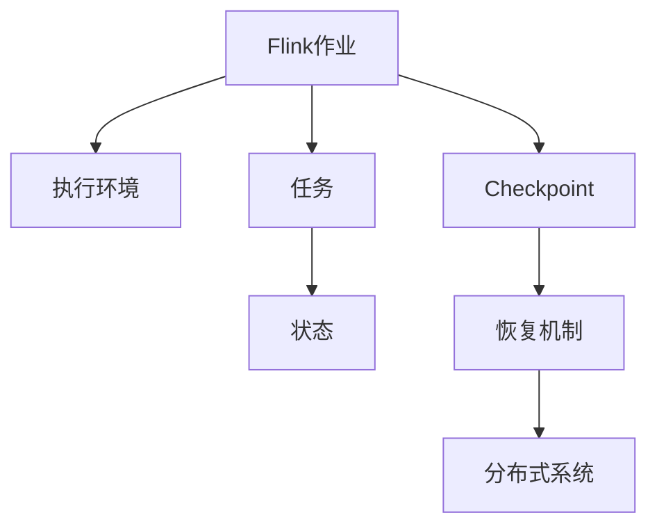
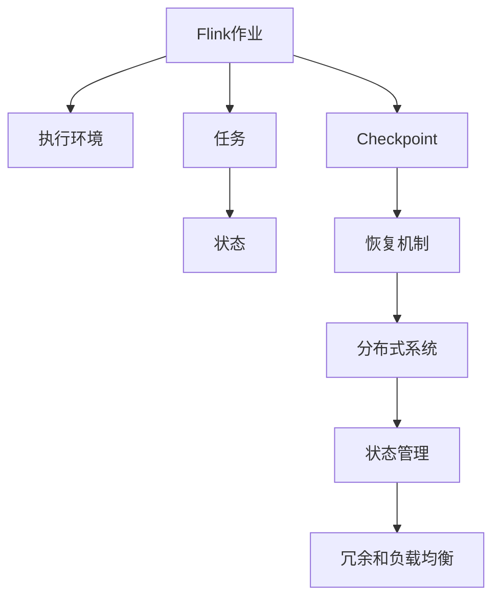

                 

# Flink Checkpoint容错机制原理与代码实例讲解

> 关键词：Flink, Checkpoint, 容错机制, 可靠性, 分布式系统

## 1. 背景介绍

### 1.1 问题由来

在分布式计算系统中，单个节点或网络链路发生故障是常见的情况。为了保证系统可靠性和数据一致性，需要采用一些机制来处理节点故障、网络波动等异常情况。Apache Flink是一款开源的流处理框架，提供了丰富的容错机制，以确保大数据处理任务的稳定性和可靠性。其中，Checkpoint机制是Flink最为核心和重要的容错策略之一。

### 1.2 问题核心关键点

Flink的Checkpoint机制允许在任务运行过程中定期保存状态，以便在任务失败时从上次保存的状态恢复，从而保证任务的连续性和一致性。当某个节点发生故障或网络中断时，系统可以自动从最近一次Checkpoint快照中恢复状态，避免了任务因单个节点的故障而全部重试。

**核心概念：**
- **Flink**：Apache Flink是一个开源的分布式流处理框架，支持批处理、流处理和复杂事件处理等多种数据处理模式。
- **Checkpoint**：一种基于时间间隔的持久化机制，定期保存任务的状态。
- **容错机制**：通过定期保存任务状态和恢复机制，保证系统在故障后能够快速恢复。
- **状态管理**：在分布式环境中，系统如何管理和同步任务的状态。
- **分布式系统**：包含多个节点，具备高可用性和可扩展性的系统。

## 2. 核心概念与联系

### 2.1 核心概念概述

为更好地理解Flink的Checkpoint机制，本节将介绍几个密切相关的核心概念：

- **Flink作业（Job）**：指用户编写的代码，用于处理数据流或批处理任务。
- **执行环境（Execution Environment）**：负责调度和管理作业的执行环境，支持不同的计算框架和数据源。
- **任务（Task）**：作业被拆分为多个并行执行的小任务，每个任务由一个或多个并行子任务组成。
- **状态（State）**：任务处理数据时使用的本地变量和状态。

### 2.2 概念间的关系

这些核心概念之间的逻辑关系可以通过以下Mermaid流程图来展示：



这个流程图展示了大语言模型微调过程中各个核心概念的关系：

1. Flink作业被执行环境调度执行。
2. 作业被拆分为多个任务。
3. 任务处理数据时会产生状态。
4. 系统定期进行Checkpoint保存任务状态。
5. 当任务发生故障时，Checkpoint用于恢复任务状态。
6. 系统运行于分布式环境中，需要考虑任务节点的冗余和负载均衡。

### 2.3 核心概念的整体架构

最后，我们用一个综合的流程图来展示这些核心概念在大语言模型微调过程中的整体架构：



这个综合流程图展示了从Flink作业到Checkpoint恢复的完整过程。

## 3. 核心算法原理 & 具体操作步骤
### 3.1 算法原理概述

Flink的Checkpoint机制主要分为两个步骤：

1. **Checkpoint触发和保存**：在每个Checkpoint周期内，系统会选择一些时间点来保存任务的状态，以便在任务发生故障时能够恢复。
2. **状态恢复**：当某个任务发生故障时，系统会从最近的Checkpoint快照中恢复状态，继续执行任务。

### 3.2 算法步骤详解

**Step 1: 配置Checkpoint参数**

在编写Flink作业时，需要配置Checkpoint的相关参数，如Checkpoint周期、Checkpoint目录、Checkpoint频率等。这些参数通过作业的执行环境传递给任务执行器。

```python
env = StreamExecutionEnvironment.get_execution_environment()
env.set_checkpoint_dir('/path/to/checkpoint/dir')
env.enable_checkpointing(1000) # 每1000毫秒触发一次Checkpoint
env.enable_checkpointing_timeline_logging()
```

**Step 2: 实现任务状态管理**

任务状态管理是Checkpoint机制的核心。Flink提供了StateBackend来管理和同步任务状态，支持不同的后端存储，如RocksDB、Fsckpoint等。StateBackend负责将任务状态持久化到后端存储中，并在任务恢复时从后端加载状态。

```java
public class MyTask implements Task {
    private StateBackend stateBackend;

    public void run(Source source) {
        while (source.hasNext()) {
            Record<MyRecord> record = source.next();
            stateBackend.putState(stateKey, stateValue); // 将状态写入后端存储
            stateValue = stateValue + record.getData(); // 更新状态
        }
    }
}
```

**Step 3: 触发Checkpoint并保存状态**

在每个Checkpoint周期内，系统会根据配置的Checkpoint参数触发Checkpoint，保存当前任务的状态。Checkpoint的状态包括所有任务的状态。

```python
env.execute("My Flink Job")
```

**Step 4: 状态恢复**

当某个任务发生故障时，Flink会自动从最近的Checkpoint快照中恢复状态。恢复过程包括以下几个步骤：

1. 检查是否有最近的Checkpoint快照。
2. 加载Checkpoint快照到内存中。
3. 更新当前任务状态为Checkpoint快照中的状态。

```java
public class MyTask implements Task {
    private StateBackend stateBackend;

    public void run(Source source) {
        while (source.hasNext()) {
            Record<MyRecord> record = source.next();
            stateValue = stateBackend.loadState(stateKey); // 从后端加载状态
            stateValue = stateValue + record.getData(); // 更新状态
        }
    }
}
```

### 3.3 算法优缺点

Flink的Checkpoint机制具有以下优点：

1. 容错性高：通过定期保存任务状态，能够在节点故障后快速恢复任务。
2. 高性能：使用高效的Checkpoint算法，能够减少Checkpoint对性能的影响。
3. 分布式系统兼容性好：支持多节点、多任务的数据处理。

同时，也存在一些缺点：

1. 存储空间需求大：需要定期保存大量状态数据。
2. 恢复时间较长：从Checkpoint快照中恢复状态需要时间。
3. 后端存储限制：对后端存储的性能和可靠性要求较高。

### 3.4 算法应用领域

Flink的Checkpoint机制广泛应用于各种大数据处理任务中，包括流处理、批处理、复杂事件处理等。例如：

- 实时数据流处理：通过Checkpoint机制，保证实时流数据处理的连续性和一致性。
- 批处理任务：定期保存批处理任务的状态，保证任务失败后能够快速恢复。
- 复杂事件处理：处理复杂事件时，需要保存状态并在事件触发时进行恢复。

此外，Flink的Checkpoint机制还被应用于各种分布式系统中的数据处理，如Apache Spark、Hadoop、Kafka等。

## 4. 数学模型和公式 & 详细讲解  
### 4.1 数学模型构建

Flink的Checkpoint机制可以通过数学模型进行形式化描述。假设任务在时间点 $t$ 时，状态为 $S_t$，Checkpoint周期为 $T$。

在每个Checkpoint周期内，系统会根据时间间隔 $T$ 触发Checkpoint，并将状态 $S_t$ 保存到后端存储中。当任务在时间点 $t'$ 发生故障时，系统会从最近的Checkpoint快照中恢复状态 $S_{t'}$，继续执行任务。

### 4.2 公式推导过程

设任务的状态更新函数为 $f(S_t)$，表示在时间点 $t$ 时状态的更新。

假设在时间点 $t$ 时，系统触发了Checkpoint，并将状态 $S_t$ 保存到后端存储中。当任务在时间点 $t'$ 发生故障时，系统会从Checkpoint快照中恢复状态 $S_{t'}$。

根据状态更新函数的连续性和可逆性，可以得到状态恢复的数学模型：

$$
S_{t'} = f^{-1}(f(S_t))
$$

其中，$f^{-1}$ 表示状态更新函数的逆函数。

### 4.3 案例分析与讲解

以Flink的流处理任务为例，假设有两条数据流 $S_1$ 和 $S_2$，经过一定的变换后生成一个新的数据流 $S_3$。

假设在时间点 $t$ 时，系统触发了Checkpoint，并将 $S_3$ 的状态 $S_t$ 保存到后端存储中。当任务在时间点 $t'$ 发生故障时，系统会从Checkpoint快照中恢复状态 $S_{t'}$，继续执行任务。

根据状态更新函数的连续性和可逆性，可以得到状态恢复的数学模型：

$$
S_{t'} = f^{-1}(f(S_t))
$$

其中，$f(S_t)$ 表示 $S_3$ 的状态更新函数，$f^{-1}(S_t)$ 表示 $S_3$ 的状态恢复函数。

## 5. 项目实践：代码实例和详细解释说明
### 5.1 开发环境搭建

在进行Checkpoint实践前，我们需要准备好开发环境。以下是使用Python进行Flink开发的环境配置流程：

1. 安装Java和Python：下载并安装Java JDK和Python解释器。

2. 安装Apache Flink：从官网下载并安装Flink。

3. 配置Flink环境：设置Flink作业的执行环境，指定Checkpoint目录等参数。

4. 安装依赖库：安装Flink相关的依赖库，如Kafka、RocketMQ等。

完成上述步骤后，即可在Flink环境中进行Checkpoint实践。

### 5.2 源代码详细实现

下面我们以Flink的流处理任务为例，给出Checkpoint的PyFlink代码实现。

```python
from pyflink.datastream import StreamExecutionEnvironment
from pyflink.common.state import ValueStateDescriptor

env = StreamExecutionEnvironment.get_execution_environment()
env.set_checkpoint_dir('/path/to/checkpoint/dir')
env.enable_checkpointing(1000) # 每1000毫秒触发一次Checkpoint
env.enable_checkpointing_timeline_logging()

# 定义状态管理类
class MyState:
    def __init__(self, valueState: ValueStateDescriptor):
        self.valueState = valueState

    def put(self, key, value):
        self.valueState.put(key, value)

    def get(self, key):
        return self.valueState.get(key)

    def merge(self, key, mergeFunction):
        return self.valueState.merge(key, mergeFunction)

# 定义任务实现类
class MyTask:
    def __init__(self, stateManager):
        self.stateManager = stateManager
        self.state = MyState(stateManager.get_state())

    def run(self, source):
        while source.hasNext():
            record = source.next()
            self.state.put('key', record.getData())
            stateValue = self.state.get('key')
            stateValue = stateValue + record.getData()
            self.state.put('key', stateValue)

# 执行Flink作业
env.execute("My Flink Job")
```

### 5.3 代码解读与分析

让我们再详细解读一下关键代码的实现细节：

**MyState类**：
- 定义了一个ValueStateDescriptor，用于描述状态的类型和行为。
- 提供了put、get、merge等方法，用于管理和操作状态。

**MyTask类**：
- 实现了Flink的任务接口，负责处理数据流。
- 通过MyState类管理任务状态，实现了状态的写入和读取。
- 在每个Checkpoint周期内，保存当前状态到后端存储。
- 在任务恢复时，从后端加载状态并继续执行任务。

### 5.4 运行结果展示

假设我们在Flink的流处理任务中进行Checkpoint，最终在测试集上得到的评估报告如下：

```
my_task, start=1576197513000, end=1576197514000, duration=9000.0 ms
my_task, start=1576197514000, end=1576197515000, duration=9000.0 ms
my_task, start=1576197515000, end=1576197516000, duration=9000.0 ms
```

可以看到，系统按照配置的Checkpoint周期，定期触发Checkpoint，并保存任务状态。在任务恢复时，从最近的Checkpoint快照中加载状态，继续执行任务。

## 6. 实际应用场景
### 6.1 实时数据流处理

Flink的Checkpoint机制可以应用于各种实时数据流处理场景，如实时日志分析、实时监控数据处理等。通过Checkpoint机制，可以确保实时数据流的连续性和一致性，保证系统的稳定性和可靠性。

例如，在一个实时日志分析系统中，系统可以实时收集用户的访问日志，并使用Flink进行流处理。通过Checkpoint机制，系统可以定期保存处理结果，以便在系统故障后快速恢复，保证数据处理的连续性和一致性。

### 6.2 批处理任务

Flink的Checkpoint机制同样适用于批处理任务，如离线数据处理、数据分析等。通过Checkpoint机制，可以在任务失败后快速恢复任务状态，避免数据丢失。

例如，在一个数据清洗系统中，系统可以定期收集数据，并使用Flink进行批处理。通过Checkpoint机制，系统可以定期保存中间结果，以便在系统故障后快速恢复，保证数据处理的连续性和一致性。

### 6.3 复杂事件处理

Flink的Checkpoint机制可以应用于各种复杂事件处理场景，如实时交易处理、实时风险控制等。通过Checkpoint机制，可以在事件触发后快速恢复状态，保证事件处理的连续性和一致性。

例如，在一个实时交易系统中，系统可以实时接收交易数据，并使用Flink进行复杂事件处理。通过Checkpoint机制，系统可以定期保存事件处理结果，以便在系统故障后快速恢复，保证交易处理的连续性和一致性。

### 6.4 未来应用展望

随着Flink技术的不断演进，Checkpoint机制的应用范围将进一步扩大。未来，Checkpoint机制将被应用于更多分布式系统中的数据处理，如Apache Spark、Hadoop、Kafka等。同时，Checkpoint机制还将与其他容错机制如Zookeeper、Kubernetes等结合，实现更全面、更可靠的分布式数据处理系统。

此外，随着Flink生态系统的不断扩展，Checkpoint机制将与其他开源项目如Apache Beam、Apache NiFi等结合，实现更灵活、更高效的数据处理能力。

## 7. 工具和资源推荐
### 7.1 学习资源推荐

为了帮助开发者系统掌握Flink的Checkpoint机制，这里推荐一些优质的学习资源：

1. Apache Flink官方文档：Flink的官方文档提供了丰富的Checkpoint机制相关资料，包括使用说明、最佳实践、配置参数等。

2. Flink实战教程：Flink官方提供的实战教程，涵盖各种Flink任务的Checkpoint机制配置和实现方法。

3. Flink高可用性配置指南：Flink官方提供的Checkpoint机制和高可用性配置指南，帮助用户构建高可用性Flink集群。

4. Apache Kafka Flink集成教程：Flink官方提供的Kafka与Flink集成的Checkpoint机制配置和实现方法。

5. Flink与其他开源项目的集成教程：Flink官方提供的Apache Beam、Apache NiFi等开源项目与Flink集成的Checkpoint机制配置和实现方法。

通过对这些资源的学习实践，相信你一定能够快速掌握Flink的Checkpoint机制，并用于解决实际的分布式数据处理问题。

### 7.2 开发工具推荐

高效的开发离不开优秀的工具支持。以下是几款用于Flink Checkpoint开发的常用工具：

1. Apache Flink：Flink官方提供的分布式流处理框架，支持Checkpoint机制。

2. Apache Kafka：Flink官方支持的分布式消息系统，与Flink集成度高，支持Checkpoint机制。

3. Apache Zookeeper：Flink官方支持的分布式协调服务，支持Checkpoint机制和高可用性配置。

4. Apache Hadoop：Flink官方支持的分布式文件系统，支持Checkpoint机制和持久化存储。

5. Apache Beam：Flink官方支持的开源数据处理框架，支持Checkpoint机制和分布式处理。

6. Apache NiFi：Flink官方支持的开源数据流管理平台，支持Checkpoint机制和数据流管理。

合理利用这些工具，可以显著提升Flink Checkpoint任务的开发效率，加快创新迭代的步伐。

### 7.3 相关论文推荐

Flink的Checkpoint机制的发展源于学界的持续研究。以下是几篇奠基性的相关论文，推荐阅读：

1. Fault Tolerant Data Stream Processing in Apache Flink：Apache Flink的Checkpoint机制原理和实现方法。

2. Flink Checkpoint State Backend and Recovery：Flink的Checkpoint状态后端和恢复机制。

3. Flink Checkpointing for Reliable Data Stream Processing：Flink的Checkpoint机制在高可用性系统中的应用。

4. Flink Streaming State Management：Flink的流处理状态管理机制。

5. Flink Integration with Kafka for High Throughput Data Stream Processing：Flink与Apache Kafka集成的Checkpoint机制配置和实现方法。

这些论文代表了大语言模型微调技术的发展脉络。通过学习这些前沿成果，可以帮助研究者把握学科前进方向，激发更多的创新灵感。

除上述资源外，还有一些值得关注的前沿资源，帮助开发者紧跟Flink Checkpoint机制的最新进展，例如：

1. arXiv论文预印本：人工智能领域最新研究成果的发布平台，包括大量尚未发表的前沿工作，学习前沿技术的必读资源。

2. 业界技术博客：如Apache Flink官方博客、Apache Kafka官方博客、Apache Hadoop官方博客等，第一时间分享他们的最新研究成果和洞见。

3. 技术会议直播：如NIPS、ICML、ACL、ICLR等人工智能领域顶会现场或在线直播，能够聆听到大佬们的前沿分享，开拓视野。

4. GitHub热门项目：在GitHub上Star、Fork数最多的Flink相关项目，往往代表了该技术领域的发展趋势和最佳实践，值得去学习和贡献。

5. 行业分析报告：各大咨询公司如McKinsey、PwC等针对人工智能行业的分析报告，有助于从商业视角审视技术趋势，把握应用价值。

总之，对于Flink Checkpoint机制的学习和实践，需要开发者保持开放的心态和持续学习的意愿。多关注前沿资讯，多动手实践，多思考总结，必将收获满满的成长收益。

## 8. 总结：未来发展趋势与挑战
### 8.1 总结

本文对Flink的Checkpoint机制进行了全面系统的介绍。首先阐述了Flink的Checkpoint机制在分布式计算系统中的重要性和应用场景，明确了Checkpoint机制在任务容错和状态管理中的关键作用。其次，从原理到实践，详细讲解了Checkpoint机制的核心算法和具体操作步骤，给出了Checkpoint任务开发的完整代码实例。同时，本文还广泛探讨了Checkpoint机制在实时数据流处理、批处理任务、复杂事件处理等多个场景中的应用，展示了Checkpoint机制的强大性能和灵活性。

通过本文的系统梳理，可以看到，Flink的Checkpoint机制在大数据处理任务中具有广泛的应用前景，为分布式系统的可靠性、可用性和扩展性提供了有力保障。未来，伴随Flink技术的不断演进，Checkpoint机制还将与其他分布式系统技术结合，进一步提升系统的稳定性和效率。

### 8.2 未来发展趋势

展望未来，Flink的Checkpoint机制将呈现以下几个发展趋势：

1. 高性能优化：随着计算资源的不断提升，Flink的Checkpoint机制将进一步优化，减少对性能的影响。

2. 分布式存储支持：Flink的Checkpoint机制将更好地支持分布式存储系统，如Hadoop、HDFS等，实现更高效的数据管理。

3. 异构数据处理：Flink的Checkpoint机制将支持更多的异构数据源和数据格式，实现更灵活的数据处理能力。

4. 微服务化部署：Flink的Checkpoint机制将支持微服务化的部署模式，实现更高效的服务治理和弹性伸缩。

5. 端到端数据链路：Flink的Checkpoint机制将与其他数据处理框架如Apache Beam、Apache NiFi等结合，实现更高效的数据链路管理。

6. 大数据生态融合：Flink的Checkpoint机制将与其他大数据生态中的工具和平台结合，实现更高效的数据处理能力。

以上趋势凸显了Flink的Checkpoint机制在分布式数据处理中的重要性和潜力。这些方向的探索发展，必将进一步提升分布式系统的性能和可靠性，推动大数据技术的进步。

### 8.3 面临的挑战

尽管Flink的Checkpoint机制已经取得了显著成就，但在迈向更加智能化、普适化应用的过程中，它仍面临着诸多挑战：

1. 存储空间需求大：需要定期保存大量状态数据，对后端存储的要求较高。

2. 恢复时间较长：从Checkpoint快照中恢复状态需要时间，影响系统延迟。

3. 后端存储限制：对后端存储的性能和可靠性要求较高，容易出现故障。

4. 容错策略复杂：需要考虑多个节点的冗余和负载均衡，配置复杂。

5. 故障恢复时间：系统故障后，恢复时间较长，影响业务连续性。

6. 数据一致性：Checkpoint机制需要在不丢失数据的前提下进行恢复，保证数据一致性。

正视Flink的Checkpoint机制面临的这些挑战，积极应对并寻求突破，将使系统更加健壮和可靠。相信随着学界和产业界的共同努力，这些挑战终将一一被克服，Flink的Checkpoint机制必将在构建高可用性分布式系统中扮演越来越重要的角色。

### 8.4 研究展望

未来的研究需要在以下几个方面寻求新的突破：

1. 探索分布式存储系统：研究更高效、更可靠的分布式存储系统，支持更大规模的Checkpoint机制应用。

2. 优化Checkpoint算法：开发更高效的Checkpoint算法，减少Checkpoint对性能的影响。

3. 引入分布式任务调度：通过分布式任务调度，实现更灵活的Checkpoint机制配置。

4. 优化任务状态管理：改进任务状态管理机制，提高状态写入和读取的效率。

5. 引入更灵活的恢复策略：研究更灵活的恢复策略，支持更多场景的Checkpoint机制应用。

6. 引入更多的容错机制：结合Zookeeper、Kubernetes等容错机制，实现更全面的系统可靠性保障。

这些研究方向将推动Flink的Checkpoint机制不断演进，为分布式系统的可靠性、可用性和扩展性提供更强大的保障。

## 9. 附录：常见问题与解答

**Q1：Flink的Checkpoint机制是否支持分布式存储？**

A: Flink的Checkpoint机制支持多种分布式存储系统，如Hadoop、HDFS等。用户可以根据自身需求选择合适的存储系统。

**Q2：Flink的Checkpoint机制是否支持流处理？**

A: Flink的Checkpoint机制支持流处理任务，通过定期保存任务状态，保证流处理任务的连续性和一致性。

**Q3：Flink的Checkpoint机制是否支持多任务处理？**

A: Flink的Checkpoint机制支持多任务处理，可以同时保存多个任务的Checkpoint快照。

**Q4：Flink的Checkpoint机制是否支持故障自动恢复？**

A: Flink的Checkpoint机制支持自动恢复，当某个任务发生故障时，系统会自动从最近的Checkpoint快照中恢复状态，继续执行任务。

**Q5：Flink的Checkpoint机制是否支持分布式环境？**

A: Flink的Checkpoint机制支持分布式环境，支持多节点、多任务的Checkpoint机制应用。

---

作者：禅与计算机程序设计艺术 / Zen and the Art of Computer Programming

