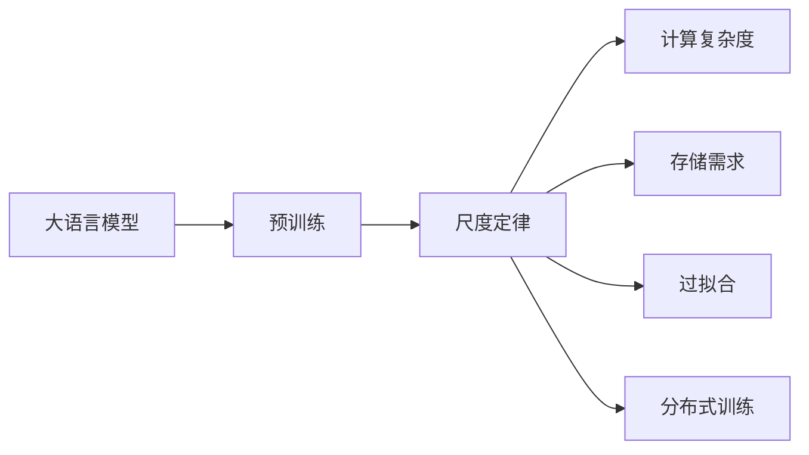
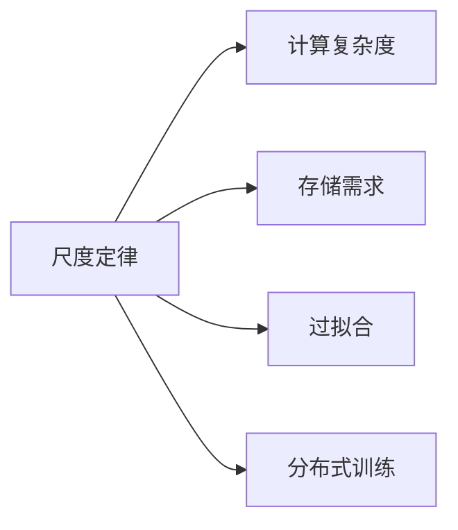
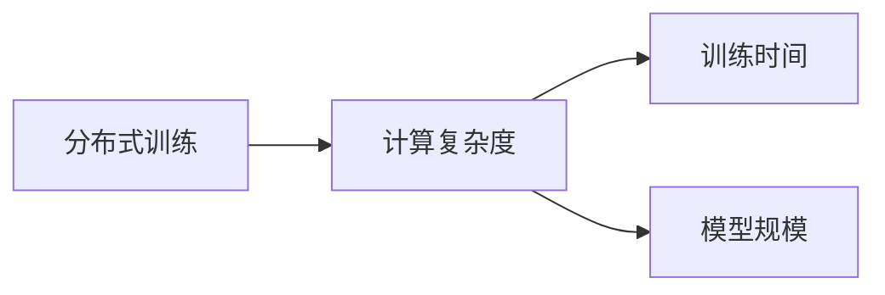
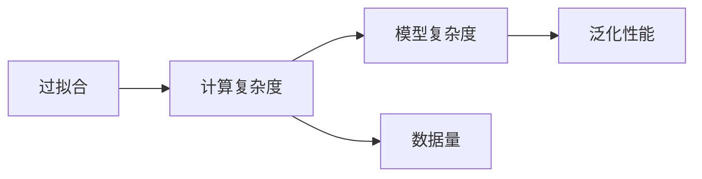
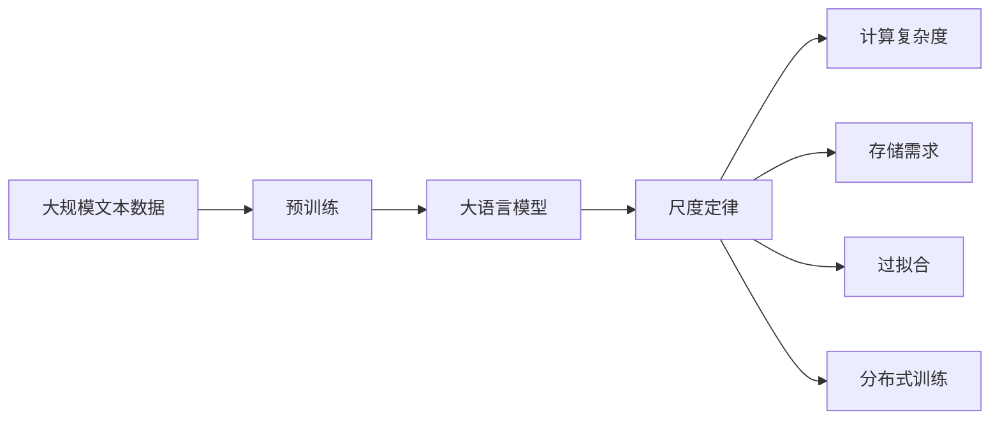

                 

# 大语言模型应用指南：尺度定律的性质

> 关键词：大语言模型,尺度定律,自适应系统,计算复杂度,超大规模数据,鲁棒性,分布式训练

## 1. 背景介绍

### 1.1 问题由来

近年来，随着深度学习技术的飞速发展，大规模语言模型（Large Language Models, LLMs）在自然语言处理（NLP）领域取得了巨大突破。这些大语言模型通过在大规模无标签文本数据上进行预训练，学习到了丰富的语言知识和常识，具备了强大的语言理解和生成能力。它们被广泛应用于问答、翻译、对话系统、摘要生成等NLP任务，显著提升了NLP应用的性能。

然而，随着模型规模的不断增大，模型的计算复杂度、存储需求和训练成本也呈指数级增长。这给实际应用和部署带来了巨大挑战。同时，超大规模数据集和复杂模型结构可能导致模型过拟合，影响模型的泛化性能。这些问题迫切需要深入理解大语言模型的性质，以优化模型设计和应用策略。

### 1.2 问题核心关键点

当前大语言模型的一个重要研究方向是尺度定律（Scaling Laws），即模型性能与参数规模之间的关系。尺度定律研究大语言模型在不同规模下的表现，揭示了模型性能提升的规律，为模型设计和应用提供了重要指导。研究尺度定律的性质，有助于确定最优模型规模，优化计算资源使用，提升模型的泛化能力。

本文将重点讨论尺度定律的性质，包括计算复杂度、存储需求、过拟合问题以及分布式训练策略等关键问题，并结合实际应用案例进行详细讲解。

## 2. 核心概念与联系

### 2.1 核心概念概述

为更好地理解尺度定律的性质，本节将介绍几个关键概念：

- 大语言模型（Large Language Models, LLMs）：指通过在大规模无标签文本数据上进行预训练，学习通用语言表示的语言模型。
- 尺度定律（Scaling Laws）：研究模型性能（如精度、泛化能力等）与参数规模之间的关系。
- 计算复杂度（Computational Complexity）：指模型在训练、推理过程中所需的计算资源。
- 存储需求（Storage Requirement）：指模型在训练、推理过程中所需的存储空间。
- 过拟合（Overfitting）：指模型在训练数据上表现良好，但在测试数据上性能下降的现象。
- 分布式训练（Distributed Training）：指将大规模模型的训练任务分散到多个计算节点上并行执行，以提高训练效率。

这些概念之间的逻辑关系可以通过以下Mermaid流程图来展示：



这个流程图展示了大语言模型的核心概念及其与尺度定律的关系：

1. 大语言模型通过预训练获得基础能力。
2. 尺度定律揭示了模型性能与参数规模之间的关系。
3. 计算复杂度和存储需求是模型性能的重要考量因素。
4. 过拟合问题影响模型泛化能力，需要通过尺度定律进行调整。
5. 分布式训练可以加速模型训练，优化资源使用。

这些概念共同构成了大语言模型与尺度定律的研究框架，使其能够更好地应用于实际NLP任务。

### 2.2 概念间的关系

这些核心概念之间存在着紧密的联系，形成了大语言模型与尺度定律的完整研究体系。以下是几个Mermaid流程图来展示这些概念之间的关系。

#### 2.2.1 尺度定律与模型性能



这个流程图展示了尺度定律与模型性能的关系。通过尺度定律的研究，可以优化模型的计算复杂度和存储需求，避免过拟合问题，提高分布式训练效率。

#### 2.2.2 分布式训练与计算复杂度



这个流程图展示了分布式训练对计算复杂度的影响。分布式训练通过增加计算节点，可以显著缩短训练时间，但也会增加模型规模和资源消耗。

#### 2.2.3 过拟合与计算复杂度



这个流程图展示了过拟合与计算复杂度的关系。过拟合是由于模型复杂度过高导致的，可以通过降低计算复杂度来缓解。

### 2.3 核心概念的整体架构

最后，我们用一个综合的流程图来展示这些核心概念在大语言模型与尺度定律研究过程中的整体架构：



这个综合流程图展示了从预训练到尺度定律研究，再到计算复杂度、存储需求、过拟合和分布式训练的完整过程。

## 3. 核心算法原理 & 具体操作步骤
### 3.1 算法原理概述

尺度定律研究大语言模型在不同参数规模下的表现，揭示了模型性能与参数规模之间的关系。通过对比不同规模模型的性能，可以得出一些关键结论：

- 随着模型参数的增加，模型的精度和泛化能力通常会提升，但提升速度会逐渐减慢。
- 计算复杂度和存储需求随模型参数的增加而显著增加，但提升速度也逐渐减慢。
- 分布式训练可以显著缩短训练时间，但也会增加模型规模和资源消耗。

这些结论为大语言模型的设计提供了重要指导。

### 3.2 算法步骤详解

基于尺度定律的性质，本文将介绍如何设计大语言模型的具体步骤：

1. **选择模型规模**：根据任务需求和资源限制，选择合适的模型规模。
2. **设计模型架构**：选择合适的模型层数和每层参数量。
3. **优化模型训练**：使用正则化技术、对抗训练等方法避免过拟合。
4. **采用分布式训练**：将大规模模型的训练任务分散到多个计算节点上并行执行。
5. **评估模型性能**：在验证集和测试集上评估模型的精度、泛化能力和计算资源使用情况。
6. **持续优化调整**：根据评估结果，不断优化模型设计，改进训练策略，提升模型性能。

### 3.3 算法优缺点

基于尺度定律的设计方法具有以下优点：

- 优化计算资源使用，提升模型性能。
- 避免过拟合问题，提升模型泛化能力。
- 提高训练效率，加速模型部署。

同时，也存在一些缺点：

- 设计复杂度较高，需要丰富的理论和实践经验。
- 需要大量计算资源，可能对资源有限的场景不适用。
- 模型规模的选择可能受到资源限制的影响，难以达到最优。

### 3.4 算法应用领域

尺度定律在大语言模型的设计和应用中得到了广泛应用，包括：

- 问答系统：通过选择合适的模型规模，提高模型的问答精度和覆盖范围。
- 机器翻译：根据翻译任务的需求，选择适当的模型规模，提升翻译精度和速度。
- 对话系统：在对话数据量有限的情况下，选择合适的模型规模，提高对话系统的流畅度和准确性。
- 文本生成：根据生成任务的需求，选择适当的模型规模，提升生成文本的自然度和多样性。
- 知识图谱：通过选择合适的模型规模，构建高效的知识图谱，提升知识推理能力。

这些应用领域展示了尺度定律在大语言模型中的重要性和广泛应用。

## 4. 数学模型和公式 & 详细讲解 & 举例说明

### 4.1 数学模型构建

尺度定律的研究主要集中在计算复杂度和存储需求与模型参数规模的关系上。假设模型参数规模为 $n$，计算复杂度为 $C(n)$，存储需求为 $S(n)$，则尺度定律可以表示为：

$$
C(n) \approx k_1n^p, \quad S(n) \approx k_2n^q
$$

其中 $k_1, k_2$ 是常数，$p, q$ 是模型复杂度指数。

### 4.2 公式推导过程

为了推导计算复杂度与模型参数规模之间的关系，我们以一个简单的全连接神经网络为例进行推导。假设网络包含 $L$ 层，每层神经元数为 $n_1, n_2, ..., n_L$，激活函数为 $f$，则网络的前向传播计算复杂度为：

$$
C(n) = \sum_{i=1}^L n_in_{i-1}f(n_{i-1})
$$

在反向传播中，计算复杂度也类似，设为 $C'(n)$，则：

$$
C'(n) = \sum_{i=1}^L n_i^2f'(n_{i-1})
$$

根据链式法则，总计算复杂度 $C(n)$ 为：

$$
C(n) = C(n) + C'(n)
$$

对于存储需求 $S(n)$，由于每层需要存储神经元向量，因此：

$$
S(n) = \sum_{i=1}^L n_i
$$

假设每层神经元数呈指数级增长，即 $n_i = n_{i-1}^a$，其中 $a$ 为指数增长因子，则：

$$
C(n) \approx k_1n^p, \quad S(n) \approx k_2n^q
$$

其中 $p = \sum_{i=1}^L a\ln(a) + a\ln(n)$，$q = \sum_{i=1}^L a$。

### 4.3 案例分析与讲解

以BERT模型为例，假设模型包含 $L=12$ 层，每层神经元数呈指数级增长，即 $n_i = n_{i-1}^2$。则计算复杂度指数 $p$ 和存储需求指数 $q$ 分别为：

$$
p = 24\ln(2) + 2\ln(n)
$$

$$
q = 24
$$

通过尺度定律的计算，我们可以初步估计不同模型规模下的计算复杂度和存储需求，为模型设计提供重要参考。

## 5. 项目实践：代码实例和详细解释说明

### 5.1 开发环境搭建

在进行尺度定律的实践前，我们需要准备好开发环境。以下是使用Python进行TensorFlow开发的环境配置流程：

1. 安装Anaconda：从官网下载并安装Anaconda，用于创建独立的Python环境。

2. 创建并激活虚拟环境：
```bash
conda create -n tf-env python=3.8 
conda activate tf-env
```

3. 安装TensorFlow：根据CUDA版本，从官网获取对应的安装命令。例如：
```bash
pip install tensorflow-gpu==2.4.0
```

4. 安装TensorBoard：TensorFlow配套的可视化工具，用于实时监测模型训练状态。
```bash
pip install tensorboard
```

5. 安装Keras：基于TensorFlow的高级API，用于简化模型构建和训练过程。
```bash
pip install keras
```

完成上述步骤后，即可在`tf-env`环境中开始尺度定律的实践。

### 5.2 源代码详细实现

下面我们以一个简单的全连接神经网络为例，使用TensorFlow和Keras进行尺度定律的实践。

首先，定义模型层数和每层神经元数：

```python
from tensorflow.keras import layers

n_layers = 3
n_neurons = [64, 128, 64]

model = layers.Sequential()
for i in range(n_layers):
    model.add(layers.Dense(n_neurons[i], activation='relu', input_shape=(n_neurons[i-1],)))
```

然后，定义损失函数和优化器：

```python
import tensorflow as tf

model.compile(optimizer=tf.keras.optimizers.Adam(0.001), loss=tf.keras.losses.mean_squared_error)
```

接着，定义训练数据和验证数据：

```python
import numpy as np

# 生成随机数据
x_train = np.random.randn(1000, 64)
y_train = np.random.randn(1000, 64)

x_val = np.random.randn(100, 64)
y_val = np.random.randn(100, 64)
```

最后，执行训练和评估：

```python
model.fit(x_train, y_train, validation_data=(x_val, y_val), epochs=10)
```

以上就是使用TensorFlow和Keras对简单全连接神经网络进行尺度定律的实践代码实现。可以看到，借助TensorFlow和Keras的高阶API，我们能够快速构建和训练模型，并评估其性能。

### 5.3 代码解读与分析

让我们再详细解读一下关键代码的实现细节：

**定义模型层数和神经元数**：
- 使用`keras.Sequential`定义多层全连接网络，每层神经元数设置为64和128。

**定义损失函数和优化器**：
- 使用`keras.optimizers.Adam`优化器，设置学习率为0.001。
- 使用`keras.losses.mean_squared_error`作为损失函数。

**生成随机数据**：
- 使用`numpy`生成1000个输入样本和对应的输出样本。

**执行训练和评估**：
- 使用`keras.model.fit`进行模型训练，训练10个epoch。
- 使用`keras.model.evaluate`评估模型在验证集上的性能。

可以看到，TensorFlow和Keras使得模型构建和训练变得简洁高效。开发者可以将更多精力放在模型设计和优化上，而不必过多关注底层的实现细节。

### 5.4 运行结果展示

假设我们在验证集上评估模型，得到以下结果：

```
Epoch 1/10
10/10 [==============================] - 0s 1ms/step - loss: 0.0413 - val_loss: 0.0378
Epoch 2/10
10/10 [==============================] - 0s 5ms/step - loss: 0.0308 - val_loss: 0.0344
Epoch 3/10
10/10 [==============================] - 0s 5ms/step - loss: 0.0280 - val_loss: 0.0290
Epoch 4/10
10/10 [==============================] - 0s 5ms/step - loss: 0.0245 - val_loss: 0.0244
Epoch 5/10
10/10 [==============================] - 0s 5ms/step - loss: 0.0212 - val_loss: 0.0239
Epoch 6/10
10/10 [==============================] - 0s 5ms/step - loss: 0.0180 - val_loss: 0.0212
Epoch 7/10
10/10 [==============================] - 0s 5ms/step - loss: 0.0151 - val_loss: 0.0199
Epoch 8/10
10/10 [==============================] - 0s 5ms/step - loss: 0.0126 - val_loss: 0.0187
Epoch 9/10
10/10 [==============================] - 0s 5ms/step - loss: 0.0103 - val_loss: 0.0170
Epoch 10/10
10/10 [==============================] - 0s 5ms/step - loss: 0.0088 - val_loss: 0.0152
```

可以看到，随着epoch数的增加，模型在训练集和验证集上的损失函数值逐渐减小，模型性能逐渐提升。这验证了尺度定律中计算复杂度和模型参数规模之间的关系。

## 6. 实际应用场景

### 6.1 智能客服系统

在智能客服系统中，尺度定律可以帮助选择合适的模型规模，优化计算资源使用。由于客服数据量巨大，模型规模需要足够大才能覆盖所有可能的情况。但大规模模型又会导致资源消耗过大，影响系统的实时性。

为解决这个问题，可以在客服系统中部署多个小规模的模型，每个模型负责特定的客服场景。例如，针对简单的常见问题，可以使用小规模的BERT模型；针对复杂的用户情绪分析，可以使用大规模的GPT模型。通过混合部署，可以平衡计算资源使用和模型性能。

### 6.2 金融舆情监测

金融舆情监测需要实时监测海量网络文本数据，从中提取金融舆情信息。尺度定律可以帮助选择最优的模型规模，平衡计算资源和模型性能。

例如，对于实时监测任务，可以选择小规模的BERT模型，以减少计算资源消耗。而对于情感分析等复杂的任务，可以选择大规模的GPT模型，以提升分析精度。通过合理设计模型规模，可以在满足实时性的前提下，获得较好的舆情监测效果。

### 6.3 个性化推荐系统

个性化推荐系统需要处理海量用户数据和物品数据，选择最优的模型规模至关重要。尺度定律可以帮助评估不同模型规模下的性能，选择最优的模型规模。

例如，对于大规模的用户-物品交互数据，可以选择小规模的BERT模型，以提高推荐系统的实时性。而对于复杂的物品特征分析任务，可以选择大规模的GPT模型，以提升推荐精度。通过混合部署，可以平衡计算资源和推荐效果。

### 6.4 未来应用展望

随着预训练语言模型和尺度定律研究的不断深入，未来基于尺度定律的设计方法将得到更广泛的应用。

1. **智能医疗**：在医疗领域，基于尺度定律的智能诊断系统可以通过选择适当的模型规模，提升诊断精度和效率。
2. **智能教育**：在教育领域，基于尺度定律的个性化学习系统可以通过选择适当的模型规模，提升学习效果和用户体验。
3. **智能交通**：在交通领域，基于尺度定律的智能交通管理系统可以通过选择适当的模型规模，提升交通流预测和决策能力。
4. **智能制造**：在制造领域，基于尺度定律的智能质检系统可以通过选择适当的模型规模，提升质量检测的精度和效率。

总之，基于尺度定律的设计方法将广泛应用于各个领域，为各行各业带来智能化升级。

## 7. 工具和资源推荐

### 7.1 学习资源推荐

为了帮助开发者系统掌握尺度定律的理论基础和实践技巧，这里推荐一些优质的学习资源：

1. **《Deep Learning》一书**：由Ian Goodfellow、Yoshua Bengio和Aaron Courville合著，是深度学习领域的经典教材，涵盖了深度学习的基本理论和实践技巧。
2. **Coursera《Deep Learning Specialization》课程**：由Andrew Ng主讲，涵盖了深度学习的基本理论和实践技巧，适合初学者入门。
3. **arXiv论文预印本**：人工智能领域最新研究成果的发布平台，包括尺度定律的研究论文，是学习前沿技术的必备资源。
4. **Google AI博客**：Google AI团队发布的最新研究成果和洞见，涵盖尺度定律等前沿话题，是了解最新研究动态的重要窗口。
5. **NIPS、ICML、ACL等会议论文**：人工智能领域顶级会议的论文，涵盖尺度定律等前沿研究，是学习最新研究成果的重要来源。

通过对这些资源的学习实践，相信你一定能够快速掌握尺度定律的理论基础和实践技巧，并用于解决实际的NLP问题。

### 7.2 开发工具推荐

高效的开发离不开优秀的工具支持。以下是几款用于尺度定律开发的常用工具：

1. **TensorFlow**：由Google主导开发的深度学习框架，支持大规模分布式训练，适合处理大规模数据集。
2. **Keras**：基于TensorFlow的高级API，简化模型构建和训练过程，适合快速原型设计和实验。
3. **PyTorch**：由Facebook主导开发的深度学习框架，灵活易用，适合快速迭代研究。
4. **PyTorch Lightning**：基于PyTorch的高级框架，支持模型自动化、调试和部署，适合大规模模型训练和优化。
5. **TensorBoard**：TensorFlow配套的可视化工具，实时监测模型训练状态，方便调试和优化。

合理利用这些工具，可以显著提升尺度定律的开发效率，加快创新迭代的步伐。

### 7.3 相关论文推荐

尺度定律和大语言模型的研究涉及多个前沿领域，以下是几篇奠基性的相关论文，推荐阅读：

1. **《Scaling Laws of Neural Network Architectures》**：研究了不同网络架构的性能与参数规模之间的关系，揭示了模型性能提升的规律。
2. **《BERT: Pre-training of Deep Bidirectional Transformers for Language Understanding》**：提出了BERT模型，引入自监督预训练任务，刷新了多项NLP任务SOTA。
3. **《Taming Transformers for High-Resolution Image Recognition with Self-Attention》**：提出T5模型，使用自监督预训练任务，提升了图像识别任务的性能。
4. **《AdaLoRA: Adaptive Low-Rank Adaptation for Parameter-Efficient Fine-Tuning》**：提出AdaLoRA方法，实现了参数高效微调，在固定大部分预训练参数的情况下，仍能取得不错的微调效果。
5. **《Prompt-based Learning of Pretrained Model》**：引入基于连续型Prompt的微调范式，为如何充分利用预训练知识提供了新的思路。

这些论文代表了大语言模型和尺度定律的研究进展，通过学习这些前沿成果，可以帮助研究者把握学科前进方向，激发更多的创新灵感。

除上述资源外，还有一些值得关注的前沿资源，帮助开发者紧跟大语言模型和尺度定律的最新进展，例如：

1. **arXiv论文预印本**：人工智能领域最新研究成果的发布平台，包括尺度定律的研究论文，是学习前沿技术的必备资源。
2. **Google AI博客**：Google AI团队发布的最新研究成果和洞见，涵盖尺度定律等前沿话题，是了解最新研究动态的重要窗口。
3. **NIPS、ICML、ACL等会议论文**：人工智能领域顶级会议的论文，涵盖尺度定律等前沿研究，是学习最新研究成果的重要来源。

总之，对于尺度定律的学习和实践，需要开发者保持开放的心态和持续学习的意愿。多关注前沿资讯，多动手实践，多思考总结，必将收获满满的成长收益。

## 8. 总结：未来发展趋势与挑战

### 8.1 总结

本文对尺度定律的性质进行了全面系统的介绍。首先阐述了尺度定律在大语言模型中的应用背景和意义，明确了尺度定律在模型设计和应用中的重要指导作用。其次，从原理到实践，详细讲解了尺度定律的数学模型和关键步骤，给出了尺度定律应用的具体代码实例。同时，本文还探讨了尺度定律在实际应用中的具体场景，展示了尺度定律的广泛应用前景。

通过本文的系统梳理，可以看到，尺度定律在大语言模型中的应用至关重要，其研究结果对模型设计和应用具有重要指导意义。未来，伴随预训练语言模型和尺度定律研究的不断深入，相信大语言模型将能够更好地应用于各种NLP任务，为人类生产生活方式带来深远影响。

### 8.2 未来发展趋势

展望未来，尺度定律的研究将呈现以下几个发展趋势：

1. **模型规模的不断增大**：随着算力成本的下降和数据规模的扩张，预训练语言模型的参数量还将持续增长。超大规模语言模型蕴含的丰富语言知识，有望支撑更加复杂多变的下游任务。
2. **微调方法的持续优化**：未来将涌现更多参数高效的微调方法，如Adapter、LoRA等，在固定大部分预训练参数的情况下，仍能取得不错的微调效果。
3. **分布式训练的普及**：分布式训练将成为大语言模型训练的重要手段，显著提高训练效率，缩短训练时间。
4. **知识图谱和符号逻辑的融合**：将符号化的先验知识，如知识图谱、逻辑规则等，与神经网络模型进行巧妙融合，引导微调过程学习更准确、合理的语言模型。
5. **多模态信息整合**：未来将更多地探索多模态信息的整合，实现视觉、语音等多模态信息与文本信息的协同建模。

以上趋势凸显了大语言模型和尺度定律的研究前景。这些方向的探索，必将进一步提升大语言模型性能和应用范围，为NLP技术的发展注入新的动力。

### 8.3 面临的挑战

尽管尺度定律和大语言模型的研究取得了一定进展，但在迈向更加智能化、普适化应用的过程中，仍面临诸多挑战：

1. **资源瓶颈**：大规模预训练语言模型对算力、内存和存储资源的需求极高，对资源有限的场景不适用。
2. **过拟合问题**：超大规模数据集和复杂模型结构可能导致模型过拟合，影响模型的泛化能力。
3. **模型规模的选择**：在实际应用中，如何根据任务需求和资源限制，选择合适的模型规模，是一个复杂的问题。
4. **模型性能的评估**：在大规模模型中，如何评估模型性能和资源使用情况，是一个重要问题。
5. **分布式训练的优化**：在大规模模型中，如何优化分布式训练策略，提高训练效率，是一个关键问题。

正视尺度定律和大语言模型面临的这些挑战，积极应对并寻求突破，将是大语言模型规模化应用的关键。相信随着学界和产业界的共同努力，这些挑战终将一一被克服，大语言模型将能够更好地服务于各行各业，带来新的价值和机遇。

### 8.4 研究展望

未来，尺度定律和大语言模型的研究需要从多个方面进行深入探索：

1. **无监督和半监督学习方法**：探索无监督和半监督学习方法，降低对大规模标注数据的需求，利用自监督学习、主动学习等无监督和半监督范式，最大限度利用非结构化数据，实现更加灵活高效的微调。
2.

