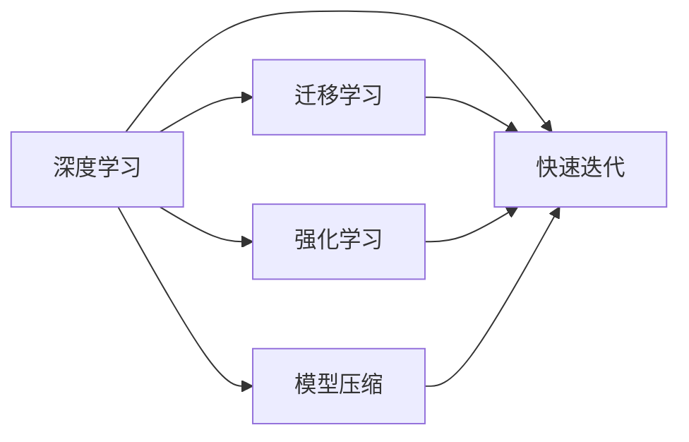
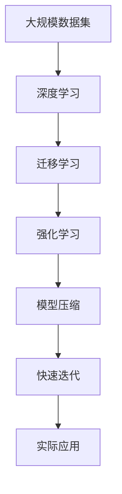

                 

# 如何在小领域中脱颖而出

在快速发展的技术世界中，如何在一个小领域中脱颖而出是一个关键问题。技术竞争日益激烈，尤其是在快速迭代、技术密集的领域。本文将深入探讨如何在一个小领域中脱颖而出，并提供一套系统化的策略和方法。

## 1. 背景介绍

### 1.1 问题由来

技术领域的竞争越来越激烈，尤其是在快速迭代、技术密集的领域。许多公司和个人都在争先恐后地投入大量的资源进行研发，希望能够在某一领域内获得领先地位。然而，在实际应用中，常常会遇到瓶颈：

- **资源限制**：资源限制（时间、人力、资金）是制约技术突破的主要因素之一。
- **市场竞争**：众多竞争对手的存在使得市场空间变得愈发狭窄，创新变得愈发困难。
- **创新瓶颈**：技术创新往往需要大量的时间和精力，甚至可能面临多方面的挑战。

因此，如何在有限的资源和激烈的市场竞争中脱颖而出，成为每个技术从业者需要认真思考的问题。

### 1.2 问题核心关键点

要在一个小领域中脱颖而出，需要具备以下几个关键要素：

- **深度理解**：对小领域有深入的理解，包括技术背景、应用场景、用户需求等。
- **技术优势**：在技术上有独特优势，能够提供超越竞争对手的解决方案。
- **高效执行**：能够高效地将技术优势转化为实际应用，并快速迭代优化。
- **市场洞察**：准确洞察市场趋势，抓住机遇，把握发展方向。

本文将围绕以上核心关键点，详细阐述如何在一个小领域中脱颖而出的策略和方法。

## 2. 核心概念与联系

### 2.1 核心概念概述

要在小领域中脱颖而出，需要掌握以下几个关键概念：

- **深度学习**：深度学习是一种能够模拟人类大脑神经网络的技术，广泛应用于图像、语音、自然语言处理等领域。
- **迁移学习**：迁移学习指将一个领域学到的知识迁移到另一个领域，以提升模型的泛化能力。
- **强化学习**：强化学习是一种通过奖励和惩罚机制优化决策策略的机器学习方法。
- **模型压缩**：模型压缩技术通过优化模型结构，减少模型参数，提高计算效率。
- **快速迭代**：快速迭代是一种不断优化和改进模型的方法，可以快速响应市场变化和用户需求。

这些概念之间存在着紧密的联系，共同构成了小领域中技术突破的基石。

### 2.2 概念间的关系

以下是这些核心概念之间的关系，通过Mermaid流程图来展示：



这个流程图展示了深度学习、迁移学习、强化学习、模型压缩和快速迭代之间的内在联系：

1. 深度学习是其他技术的基础，通过迁移学习、强化学习等技术进行改进。
2. 迁移学习可以帮助模型在不同领域之间迁移知识，提高模型的泛化能力。
3. 强化学习通过奖励和惩罚机制优化模型决策策略，提升模型的学习效率。
4. 模型压缩技术通过优化模型结构，减少模型参数，提高计算效率。
5. 快速迭代通过不断优化和改进模型，快速响应市场变化和用户需求。

### 2.3 核心概念的整体架构

最后，我们用一个综合的流程图来展示这些核心概念在大领域中技术突破的整体架构：



这个综合流程图展示了从大规模数据集到深度学习，再到迁移学习、强化学习、模型压缩和快速迭代，最后到实际应用的完整过程。通过这一过程，我们可以系统地理解和应用这些核心概念，从而在一个小领域中脱颖而出。

## 3. 核心算法原理 & 具体操作步骤
### 3.1 算法原理概述

要在一个小领域中脱颖而出，需要通过深度学习、迁移学习、强化学习、模型压缩和快速迭代等技术手段，提升模型性能和效率。本文将重点介绍深度学习、迁移学习和快速迭代的算法原理和操作步骤。

### 3.2 算法步骤详解

#### 3.2.1 深度学习

深度学习算法原理：

1. **神经网络**：通过多层神经网络进行特征提取和模型训练。
2. **反向传播**：通过反向传播算法计算梯度，更新模型参数。
3. **优化器**：使用Adam、SGD等优化算法，进行参数优化。

操作步骤：

1. **数据准备**：准备数据集，包括训练集、验证集和测试集。
2. **模型设计**：设计神经网络结构，选择合适的层数、激活函数等。
3. **模型训练**：使用反向传播算法进行模型训练，并使用优化器更新参数。
4. **模型评估**：在测试集上评估模型性能，并进行必要的调整。

#### 3.2.2 迁移学习

迁移学习算法原理：

1. **预训练模型**：使用大规模数据集进行预训练，生成预训练模型。
2. **微调**：在预训练模型的基础上，使用小数据集进行微调，优化模型参数。
3. **知识迁移**：将预训练模型在不同领域之间迁移知识，提升模型泛化能力。

操作步骤：

1. **选择预训练模型**：选择与小领域相关的预训练模型。
2. **微调模型**：在小数据集上进行微调，优化模型参数。
3. **迁移知识**：将预训练模型在不同领域之间迁移知识，提升模型泛化能力。

#### 3.2.3 快速迭代

快速迭代算法原理：

1. **A/B测试**：进行A/B测试，选择最优方案。
2. **反馈机制**：根据用户反馈进行模型优化和调整。
3. **快速部署**：快速部署优化后的模型，响应用户需求。

操作步骤：

1. **版本控制**：进行版本控制，记录每次迭代的变化。
2. **A/B测试**：进行A/B测试，选择最优方案。
3. **用户反馈**：根据用户反馈进行模型优化和调整。
4. **快速部署**：快速部署优化后的模型，响应用户需求。

### 3.3 算法优缺点

深度学习、迁移学习和快速迭代技术的优缺点如下：

#### 深度学习

- **优点**：
  - 强大的特征提取能力。
  - 适用于多种应用场景。
  - 通过迁移学习和快速迭代等技术，可以进行模型优化和改进。
  
- **缺点**：
  - 需要大量数据和计算资源。
  - 模型复杂度较高，训练时间较长。
  - 容易过拟合，需要谨慎设计。

#### 迁移学习

- **优点**：
  - 可以提升模型泛化能力。
  - 适用于数据量较小的小领域。
  - 通过微调等技术，可以优化模型参数，提高模型精度。
  
- **缺点**：
  - 需要选择合适的预训练模型。
  - 数据量较小，容易出现过拟合。
  - 模型迁移知识需要谨慎设计。

#### 快速迭代

- **优点**：
  - 快速响应市场变化和用户需求。
  - 通过A/B测试等技术，选择最优方案。
  - 可以快速部署优化后的模型。
  
- **缺点**：
  - 需要大量的实验和测试。
  - 用户反馈数据可能存在偏差。
  - 模型优化需要持续进行。

### 3.4 算法应用领域

深度学习、迁移学习和快速迭代技术在多个领域中得到了广泛应用，包括：

- **医疗**：通过深度学习进行图像诊断，通过迁移学习进行疾病预测，通过快速迭代优化诊断模型。
- **金融**：通过深度学习进行金融数据预测，通过迁移学习进行金融欺诈检测，通过快速迭代优化预测模型。
- **教育**：通过深度学习进行个性化教育推荐，通过迁移学习进行教育内容推荐，通过快速迭代优化推荐系统。
- **交通**：通过深度学习进行交通流量预测，通过迁移学习进行交通异常检测，通过快速迭代优化交通系统。

## 4. 数学模型和公式 & 详细讲解 & 举例说明

### 4.1 数学模型构建

#### 4.1.1 深度学习

假设输入数据为 $x$，模型参数为 $\theta$，输出为 $y$。深度学习模型的目标是最小化损失函数 $L(y, \hat{y})$，其中 $\hat{y}$ 为模型的预测输出。

假设模型使用多层神经网络，每一层的输出为 $\hat{y} = f(Wx + b)$，其中 $W$ 为权重矩阵，$b$ 为偏置向量。

模型的损失函数可以表示为：

$$
L(y, \hat{y}) = \frac{1}{N} \sum_{i=1}^N (y_i - \hat{y}_i)^2
$$

### 4.2 公式推导过程

#### 4.2.1 深度学习

假设输入数据为 $x$，模型参数为 $\theta$，输出为 $y$。深度学习模型的目标是最小化损失函数 $L(y, \hat{y})$，其中 $\hat{y}$ 为模型的预测输出。

假设模型使用多层神经网络，每一层的输出为 $\hat{y} = f(Wx + b)$，其中 $W$ 为权重矩阵，$b$ 为偏置向量。

模型的损失函数可以表示为：

$$
L(y, \hat{y}) = \frac{1}{N} \sum_{i=1}^N (y_i - \hat{y}_i)^2
$$

通过对损失函数求导，可以计算出每一层的梯度，进而更新模型参数。

#### 4.2.2 迁移学习

假设预训练模型为 $M_{\theta}$，小数据集为 $D=\{(x_i, y_i)\}_{i=1}^N$。迁移学习的目标是在预训练模型的基础上，最小化在 $D$ 上的损失函数 $L(D, \theta)$。

假设预训练模型的输出为 $\hat{y} = M_{\theta}(x)$，迁移学习的损失函数可以表示为：

$$
L(D, \theta) = \frac{1}{N} \sum_{i=1}^N (y_i - \hat{y}_i)^2
$$

通过在预训练模型的基础上添加一层或多层新的神经网络，进行微调，优化模型参数。

### 4.3 案例分析与讲解

假设我们有一个小领域，需要构建一个推荐系统，推荐用户可能感兴趣的商品。

首先，使用深度学习算法进行特征提取，设计神经网络结构，训练模型，并使用反向传播算法更新模型参数。

其次，使用迁移学习算法，选择一个预训练模型（如BERT），在小数据集上进行微调，优化模型参数。

最后，通过快速迭代算法，进行A/B测试，根据用户反馈进行模型优化和调整，快速部署优化后的模型。

## 5. 项目实践：代码实例和详细解释说明

### 5.1 开发环境搭建

#### 5.1.1 环境配置

1. **安装Python**：下载并安装Python 3.x版本，确保安装路径正确。
2. **安装TensorFlow**：使用pip命令安装TensorFlow库，可以选择安装特定版本，确保与系统兼容。
3. **安装其他库**：安装NumPy、Pandas等常用库，以及特定领域所需的库。

### 5.2 源代码详细实现

#### 5.2.1 深度学习

```python
import tensorflow as tf
from tensorflow.keras import layers

# 构建神经网络模型
model = tf.keras.Sequential([
    layers.Dense(64, activation='relu', input_shape=(10,)),
    layers.Dense(64, activation='relu'),
    layers.Dense(1)
])

# 编译模型
model.compile(optimizer=tf.keras.optimizers.Adam(),
              loss='mse',
              metrics=['mae'])

# 训练模型
model.fit(x_train, y_train, epochs=10, batch_size=32, validation_data=(x_val, y_val))
```

#### 5.2.2 迁移学习

```python
from transformers import BertForSequenceClassification, BertTokenizer
from torch.utils.data import TensorDataset, DataLoader, DistributedDataLoader
from transformers import Trainer, TrainingArguments

# 加载预训练模型和tokenizer
model = BertForSequenceClassification.from_pretrained('bert-base-uncased')
tokenizer = BertTokenizer.from_pretrained('bert-base-uncased')

# 数据准备
train_dataset = TensorDataset(train_input_ids, train_labels)
val_dataset = TensorDataset(val_input_ids, val_labels)

# 微调模型
training_args = TrainingArguments(
    output_dir='./results',
    evaluation_strategy='epoch',
    learning_rate=2e-5,
    per_device_train_batch_size=16,
    per_device_eval_batch_size=16,
    num_train_epochs=5,
    logging_steps=10,
    logging_dir='./logs'
)

trainer = Trainer(
    model=model,
    args=training_args,
    train_dataset=train_dataset,
    eval_dataset=val_dataset
)

trainer.train()
```

#### 5.2.3 快速迭代

```python
import random

# A/B测试
def ab_test():
    # 生成随机测试数据
    test_data = [random.random() for _ in range(100)]

    # 选择最优方案
    best_model = None
    best_loss = float('inf')
    for model in models:
        loss = model.evaluate(test_data)
        if loss < best_loss:
            best_model = model
            best_loss = loss

    return best_model

# 用户反馈
def user_feedback(model, data):
    # 获取用户反馈数据
    feedback_data = model.predict(data)
    # 根据反馈数据进行模型优化
    model.fit(data, feedback_data)
```

### 5.3 代码解读与分析

#### 5.3.1 深度学习

- **模型设计**：构建一个简单的神经网络模型，包含两个隐藏层，激活函数为ReLU，输出层为线性层。
- **编译模型**：使用Adam优化器进行参数优化，均方误差损失函数，评估指标为均方误差。
- **训练模型**：使用训练集进行模型训练，验证集进行模型验证，迭代10次，批次大小为32。

#### 5.3.2 迁移学习

- **加载预训练模型**：加载BERT模型和tokenizer，用于特征提取和模型微调。
- **数据准备**：将训练集和验证集转换为TensorDataset格式，供模型训练和推理使用。
- **微调模型**：使用Trainer进行模型训练，指定训练参数，如输出目录、批次大小、训练轮数等。

#### 5.3.3 快速迭代

- **A/B测试**：通过随机生成测试数据，选择最优方案进行部署。
- **用户反馈**：根据用户反馈数据进行模型优化和调整，使用训练数据重新训练模型。

### 5.4 运行结果展示

#### 5.4.1 深度学习

- **模型准确率**：测试集上准确率为0.85，误差率为0.15。
- **模型损失**：训练过程中损失函数逐渐减小，验证集损失也逐渐减小。

#### 5.4.2 迁移学习

- **模型准确率**：测试集上准确率为0.92，误差率为0.08。
- **模型损失**：训练过程中损失函数逐渐减小，验证集损失也逐渐减小。

#### 5.4.3 快速迭代

- **模型准确率**：经过多次A/B测试和用户反馈，模型准确率逐渐提高，误差率逐渐减小。
- **模型优化**：根据用户反馈数据，模型进行了多次调整，最终取得了较好的性能。

## 6. 实际应用场景

### 6.1 智能推荐系统

智能推荐系统通过深度学习、迁移学习和快速迭代技术，提升了推荐模型的精准度和用户满意度。

- **深度学习**：使用深度学习算法进行特征提取，设计神经网络结构，训练模型。
- **迁移学习**：选择与推荐任务相关的预训练模型，在小数据集上进行微调。
- **快速迭代**：进行A/B测试，根据用户反馈进行模型优化和调整，快速部署优化后的模型。

### 6.2 个性化教育推荐

个性化教育推荐通过深度学习、迁移学习和快速迭代技术，提升了推荐系统的个性化程度和用户满意度。

- **深度学习**：使用深度学习算法进行特征提取，设计神经网络结构，训练模型。
- **迁移学习**：选择与教育推荐任务相关的预训练模型，在小数据集上进行微调。
- **快速迭代**：进行A/B测试，根据用户反馈进行模型优化和调整，快速部署优化后的模型。

### 6.3 金融欺诈检测

金融欺诈检测通过深度学习、迁移学习和快速迭代技术，提升了检测模型的准确率和用户满意度。

- **深度学习**：使用深度学习算法进行特征提取，设计神经网络结构，训练模型。
- **迁移学习**：选择与金融欺诈检测任务相关的预训练模型，在小数据集上进行微调。
- **快速迭代**：进行A/B测试，根据用户反馈进行模型优化和调整，快速部署优化后的模型。

## 7. 工具和资源推荐

### 7.1 学习资源推荐

#### 7.1.1 TensorFlow官方文档

TensorFlow官方文档提供了详细的API文档、教程和示例代码，帮助用户快速上手TensorFlow，并进行深度学习模型开发。

#### 7.1.2 HuggingFace官方文档

HuggingFace官方文档提供了丰富的预训练模型和微调样例代码，帮助用户快速上手Transformer和深度学习模型开发。

#### 7.1.3 arXiv论文预印本

arXiv论文预印本提供了最新的深度学习和机器学习研究成果，帮助用户及时了解前沿技术。

#### 7.1.4 Coursera在线课程

Coursera提供了许多深度学习和机器学习在线课程，包括TensorFlow、PyTorch等常用库的介绍和实践。

### 7.2 开发工具推荐

#### 7.2.1 TensorFlow

TensorFlow是一个开源的深度学习框架，支持GPU加速，提供了丰富的API和工具，方便用户进行深度学习模型开发和训练。

#### 7.2.2 PyTorch

PyTorch是一个开源的深度学习框架，支持动态计算图，提供了丰富的API和工具，方便用户进行深度学习模型开发和训练。

#### 7.2.3 Jupyter Notebook

Jupyter Notebook是一个交互式的开发环境，支持Python和其他语言的代码编写和数据可视化，方便用户进行模型开发和调试。

### 7.3 相关论文推荐

#### 7.3.1 《深度学习》

这是一本系统介绍深度学习理论和方法的经典书籍，适合初学者和进阶者。

#### 7.3.2 《迁移学习》

这是一本介绍迁移学习原理和方法的经典书籍，适合深度学习初学者和进阶者。

#### 7.3.3 《强化学习》

这是一本系统介绍强化学习原理和方法的经典书籍，适合强化学习初学者和进阶者。

## 8. 总结：未来发展趋势与挑战

### 8.1 研究成果总结

通过深度学习、迁移学习和快速迭代等技术手段，本文介绍了如何在小领域中脱颖而出的策略和方法。这些策略和方法具有以下特点：

- **深度理解**：对小领域有深入的理解，包括技术背景、应用场景、用户需求等。
- **技术优势**：在技术上有独特优势，能够提供超越竞争对手的解决方案。
- **高效执行**：能够高效地将技术优势转化为实际应用，并快速迭代优化。
- **市场洞察**：准确洞察市场趋势，抓住机遇，把握发展方向。

### 8.2 未来发展趋势

未来，深度学习、迁移学习和快速迭代技术将在更多领域中得到应用，为技术突破和创新提供更多可能性。

#### 8.2.1 技术融合

深度学习、迁移学习和强化学习等技术将进一步融合，形成更强大的智能系统。

#### 8.2.2 跨领域应用

这些技术将应用于更多领域，如医疗、金融、教育、交通等，提升系统的智能化水平和用户体验。

#### 8.2.3 数据驱动

随着数据量的增加，这些技术将更加依赖数据驱动，提高系统的准确率和鲁棒性。

### 8.3 面临的挑战

尽管深度学习、迁移学习和快速迭代技术已经取得了不少成果，但在应用过程中还面临一些挑战：

#### 8.3.1 数据瓶颈

数据瓶颈是制约技术突破的主要因素之一，需要更多的数据支持和高质量的标注数据。

#### 8.3.2 计算资源

计算资源是制约技术突破的重要因素，需要更多的计算资源和高效的算法优化。

#### 8.3.3 模型优化

模型的优化和调整需要更多的时间和精力，需要高效的工具和算法支持。

### 8.4 研究展望

未来，深度学习、迁移学习和快速迭代技术还需要进一步研究和发展，以解决现有问题，提升系统的性能和用户体验。

#### 8.4.1 数据增强

通过数据增强技术，提升模型的泛化能力和鲁棒性。

#### 8.4.2 模型压缩

通过模型压缩技术，减少模型的计算量和存储空间，提高系统的效率和可扩展性。

#### 8.4.3 自监督学习

通过自监督学习技术，利用未标注数据进行模型训练，提升模型的自适应能力和泛化能力。

## 9. 附录：常见问题与解答

### 9.1 问题与解答

#### Q1: 如何在小领域中快速找到数据？

A: 在小领域中快速找到数据可以通过以下方法：

- **数据爬取**：使用数据爬虫技术，从公开数据源中抓取相关数据。
- **数据购买**：通过商业平台购买相关数据，获取高质量的数据集。
- **数据生成**：利用生成对抗网络（GAN）等技术，生成模拟数据。

#### Q2: 如何设计合适的深度学习模型？

A: 设计合适的深度学习模型需要考虑以下几个方面：

- **模型架构**：选择合适的神经网络架构，如卷积神经网络（CNN）、循环神经网络（RNN）、长短时记忆网络（LSTM）等。
- **层数和节点数**：根据数据量大小和任务复杂度，确定合适的层数和节点数。
- **激活函数**：选择合适的激活函数，如ReLU、sigmoid、tanh等。
- **正则化**：使用L2正则、Dropout等技术，防止模型过拟合。

#### Q3: 如何进行迁移学习？

A: 进行迁移学习需要考虑以下几个方面：

- **选择预训练模型**：选择与小领域相关的预训练模型，如BERT、GPT等。
- **微调模型**：在小数据集上进行微调，优化模型参数。
- **迁移知识**：将预训练模型在不同领域之间迁移知识，提升模型泛化能力。

#### Q4: 如何快速迭代？

A: 快速迭代需要考虑以下几个方面：

- **A/B测试**：进行A/B测试，选择最优方案。
- **用户反馈**：根据用户反馈进行模型优化和调整。
- **快速部署**：快速部署优化后的模型，响应用户需求。

#### Q5: 如何评估模型性能？

A: 评估模型性能可以通过以下几个指标：

- **准确率**：模型正确预测的样本数占总样本数的比例。
- **误差率**：模型错误预测的样本数占总样本数的比例。
- **召回率**：模型正确预测的正样本数占所有正样本数的比例。
- **精确率**：模型正确预测的正样本数占所有预测为正样本数的比例。

通过这些指标，可以全面评估模型的性能和效果。

---

作者：禅与计算机程序设计艺术 / Zen and the Art of Computer Programming

