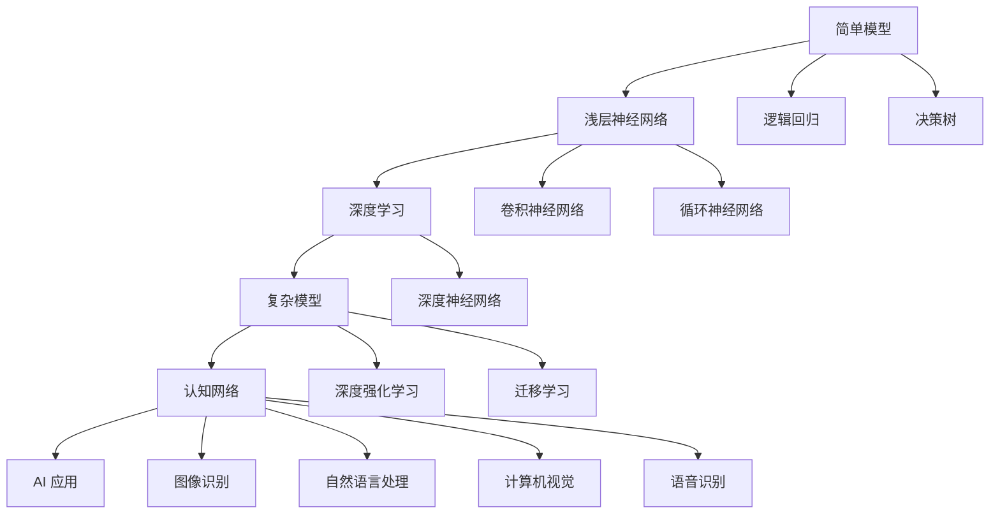
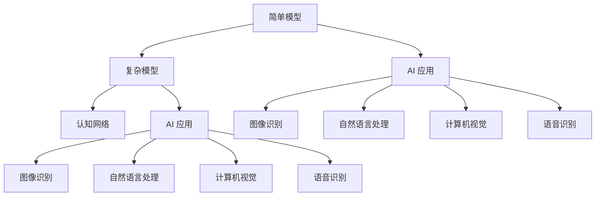

                 

# 认知发展中的简单与深刻变化

> 关键词：认知发展, 人工智能, 深度学习, 简单模型, 复杂模型, 人类认知, 计算机认知

## 1. 背景介绍

在人类发展的历史长河中，认知模式一直是一个重要的话题。无论是古人的“心”与“意”，还是现代科学中的神经网络，认知的发展始终与我们息息相关。而在计算机领域，随着深度学习技术的兴起，人们开始尝试构建“智能”的计算机系统，将人类对认知的理解应用到机器学习算法中，以期实现计算机的“认知”。

而本文聚焦于人工智能领域中认知发展中的“简单与深刻变化”，旨在探讨如何构建简单而高效、深刻而复杂的计算机认知模型，为认知科学和技术提供新的思考和突破。

## 2. 核心概念与联系

### 2.1 核心概念概述

在人工智能的发展过程中，“简单”与“深刻”是两个重要的概念，其关系贯穿于从“浅层神经网络”到“深度学习”，再到“认知网络”的整个演变过程。

**简单模型(Simple Models)**：这类模型结构简单，参数数量少，主要用于处理一些相对简单的任务，如线性回归、逻辑回归、决策树等。

**复杂模型(Complex Models)**：这类模型结构复杂，参数数量多，如深度神经网络、卷积神经网络、循环神经网络等，主要用于处理更复杂、更抽象的任务，如图像识别、语音识别、自然语言处理等。

**人类认知(Human Cognition)**：人类认知是复杂而深邃的，涉及感知、记忆、推理、语言等多个方面。而计算机的认知，即AI，是否能够理解并模拟人类认知，是当前人工智能领域的重要研究方向。

**计算机认知(Computer Cognition)**：即通过计算机算法和模型来模仿人类的认知过程，实现对环境的理解、对任务的解决等。深度学习和神经网络是实现这一目标的主要工具。

这些核心概念间的关系可以用以下Mermaid流程图来展示：



这个流程图展示了简单模型到复杂模型的演变过程，以及这些模型在认知网络中的应用。

### 2.2 概念间的关系

这些核心概念间的关系可以总结如下：

- **从简单到复杂**：认知的发展是从简单到复杂的，由浅层神经网络到深度神经网络，再到认知网络。
- **从浅层到深层**：模型的结构从浅层到深层，参数数量从少到多，可以处理更复杂、更抽象的任务。
- **从人类到机器**：认知的模仿从人类到机器，人类认知是计算机认知的灵感来源，而计算机认知则是人类认知的延伸。
- **从理解到应用**：认知的应用从对环境的理解到对任务的解决，最终实现人工智能的应用。

这些概念的关系通过以下Mermaid流程图来进一步说明：



这个流程图展示了简单模型到复杂模型在AI应用中的变化，以及这些模型在认知网络中的应用。

## 3. 核心算法原理 & 具体操作步骤
### 3.1 算法原理概述

人工智能领域的认知发展，主要依赖于深度学习和神经网络。其核心算法原理可以简单概括为以下几点：

1. **前馈神经网络**：基本模型结构，由输入层、隐藏层和输出层组成，每个神经元通过前馈方式连接。
2. **反向传播算法**：用于训练模型，通过前向传播和反向传播两个过程，不断调整神经元权重，以最小化损失函数。
3. **卷积神经网络**：主要用于图像处理，通过卷积操作提取局部特征，再通过池化操作进行降维。
4. **循环神经网络**：主要用于序列数据处理，通过记忆和更新机制，保留历史信息。
5. **深度神经网络**：由多个隐藏层组成，具有更强的表达能力和泛化能力。
6. **深度强化学习**：通过与环境的交互，不断优化策略，实现复杂的决策和控制。
7. **迁移学习**：将一个领域学到的知识迁移到另一个领域，提高模型的泛化能力。
8. **认知网络**：将认知科学中的认知理论应用于神经网络模型，模拟人类认知过程。

### 3.2 算法步骤详解

以深度神经网络为例，其基本算法步骤包括：

1. **数据预处理**：对原始数据进行标准化、归一化等处理，以便于模型训练。
2. **模型定义**：定义神经网络的层数、每层神经元数量等参数。
3. **前向传播**：输入数据通过神经网络，得到模型的预测结果。
4. **损失函数计算**：根据预测结果和真实标签，计算损失函数。
5. **反向传播**：通过反向传播算法，计算每个神经元的梯度。
6. **权重更新**：根据梯度下降法，更新每个神经元的权重。
7. **模型评估**：在测试集上评估模型性能，调整超参数。

### 3.3 算法优缺点

**深度神经网络的优点**：
- 表达能力强，能够处理复杂的数据结构和任务。
- 具有很强的泛化能力，能够在不同领域和任务中迁移应用。
- 能够自动学习特征，不需要手动设计特征提取器。

**深度神经网络的缺点**：
- 需要大量数据进行训练，否则容易过拟合。
- 模型结构复杂，难以解释，缺乏可解释性。
- 计算量大，训练和推理速度慢。

### 3.4 算法应用领域

深度神经网络在各个领域都有广泛应用，例如：

- **计算机视觉**：图像识别、物体检测、图像生成等。
- **自然语言处理**：机器翻译、文本生成、情感分析等。
- **语音识别**：语音识别、语音合成等。
- **推荐系统**：商品推荐、广告推荐等。
- **游戏AI**：游戏决策、动作规划等。

## 4. 数学模型和公式 & 详细讲解

### 4.1 数学模型构建

深度神经网络的基本数学模型为：

$$
f(x; \theta) = W^{(L)} \cdot \sigma(Z^{(L)}) + b^{(L)}
$$

其中，$f(x; \theta)$ 表示神经网络对输入 $x$ 的输出，$W^{(L)}$ 和 $b^{(L)}$ 分别是第 $L$ 层的权重和偏置，$\sigma(Z^{(L)})$ 是激活函数，$Z^{(L)} = W^{(L)} \cdot \sigma(Z^{(L-1)}) + b^{(L)}$。

### 4.2 公式推导过程

以简单的两层神经网络为例，其数学推导过程如下：

1. **前向传播**：
   $$
   Z^{(1)} = W^{(1)} \cdot X + b^{(1)}
   $$
   $$
   Z^{(2)} = W^{(2)} \cdot \sigma(Z^{(1)}) + b^{(2)}
   $$
   $$
   Y = W^{(2)} \cdot \sigma(Z^{(2)}) + b^{(2)}
   $$

2. **损失函数**：
   $$
   L(Y, Y^*) = \frac{1}{2} ||Y - Y^*||^2
   $$

3. **反向传播**：
   $$
   \frac{\partial L}{\partial W^{(2)}} = \sigma(Z^{(2)}) (Y - Y^*)
   $$
   $$
   \frac{\partial L}{\partial Z^{(1)}} = W^{(2)} \cdot \sigma'(Z^{(2)}) \cdot \frac{\partial L}{\partial W^{(2)}}
   $$
   $$
   \frac{\partial L}{\partial W^{(1)}} = X^T \cdot \frac{\partial L}{\partial Z^{(1)}}
   $$

4. **权重更新**：
   $$
   W^{(1)} = W^{(1)} - \eta \cdot \frac{\partial L}{\partial W^{(1)}}
   $$
   $$
   W^{(2)} = W^{(2)} - \eta \cdot \frac{\partial L}{\partial W^{(2)}}
   $$

### 4.3 案例分析与讲解

以图像识别为例，其基本模型为卷积神经网络（CNN），包含卷积层、池化层、全连接层等。

1. **卷积层**：通过卷积操作提取局部特征，减少参数数量。
2. **池化层**：通过池化操作进行降维，减少模型复杂度。
3. **全连接层**：通过全连接操作进行分类，最终输出预测结果。

以LeNet-5为例，其基本结构如下：

```
input -> Conv -> MaxPool -> Conv -> MaxPool -> FullyConnected -> Output
```

其中，Conv表示卷积层，MaxPool表示池化层，FullyConnected表示全连接层，Output表示输出层。

## 5. 项目实践：代码实例和详细解释说明
### 5.1 开发环境搭建

使用Python的TensorFlow库搭建深度神经网络模型，具体步骤如下：

1. **安装TensorFlow**：
   ```
   pip install tensorflow
   ```

2. **安装Keras**：
   ```
   pip install keras
   ```

3. **安装数据集**：
   ```
   wget http://civetdata.biol.ou.edu/clipcnn/clipcnn.tar.gz
   tar -xvf clipcnn.tar.gz
   ```

4. **数据预处理**：
   ```
   from tensorflow.keras.preprocessing.image import ImageDataGenerator
   from tensorflow.keras.datasets import cifar10
   from tensorflow.keras.models import Sequential
   from tensorflow.keras.layers import Dense, Flatten, Conv2D, MaxPooling2D

   # 加载数据集
   (x_train, y_train), (x_test, y_test) = cifar10.load_data()

   # 数据预处理
   train_datagen = ImageDataGenerator(rescale=1./255, validation_split=0.2)
   x_train, x_val = train_datagen.flow(x_train, y_train, batch_size=64, shuffle=True, validation_split=0.2)
   ```

5. **模型定义**：
   ```
   model = Sequential()
   model.add(Conv2D(32, kernel_size=(3, 3), activation='relu', input_shape=x_train.shape[1:]))
   model.add(MaxPooling2D(pool_size=(2, 2)))
   model.add(Conv2D(64, kernel_size=(3, 3), activation='relu'))
   model.add(MaxPooling2D(pool_size=(2, 2)))
   model.add(Flatten())
   model.add(Dense(64, activation='relu'))
   model.add(Dense(10, activation='softmax'))
   ```

6. **模型训练**：
   ```
   model.compile(optimizer='adam', loss='categorical_crossentropy', metrics=['accuracy'])
   model.fit(x_train, y_train, epochs=10, validation_data=(x_val, y_val))
   ```

7. **模型评估**：
   ```
   model.evaluate(x_test, y_test)
   ```

### 5.2 源代码详细实现

以下是一个简单的两层神经网络的Python代码实现：

```python
import numpy as np
import tensorflow as tf

# 定义模型
class NeuralNetwork(tf.keras.Model):
    def __init__(self, input_size, hidden_size, output_size):
        super(NeuralNetwork, self).__init__()
        self.fc1 = tf.keras.layers.Dense(hidden_size, activation='relu')
        self.fc2 = tf.keras.layers.Dense(output_size, activation='softmax')

    def call(self, inputs):
        x = self.fc1(inputs)
        x = self.fc2(x)
        return x

# 创建模型
input_size = 784
hidden_size = 256
output_size = 10

model = NeuralNetwork(input_size, hidden_size, output_size)

# 编译模型
model.compile(optimizer='adam', loss='categorical_crossentropy', metrics=['accuracy'])

# 训练模型
model.fit(x_train, y_train, epochs=10, batch_size=64)

# 评估模型
test_loss, test_acc = model.evaluate(x_test, y_test, verbose=2)
print('Test accuracy:', test_acc)
```

### 5.3 代码解读与分析

以上代码实现了简单的两层神经网络，包括输入层、隐藏层和输出层。具体步骤如下：

1. **定义模型**：使用Keras库定义模型结构，包括输入层、隐藏层和输出层。
2. **编译模型**：使用Adam优化器进行编译，设置损失函数和评估指标。
3. **训练模型**：使用训练集数据进行模型训练，设置训练轮数和批次大小。
4. **评估模型**：使用测试集数据评估模型性能，输出准确率。

## 6. 实际应用场景

深度神经网络在各个领域都有广泛应用，以下是几个典型的实际应用场景：

### 6.1 图像识别

图像识别是深度神经网络的重要应用之一。通过卷积神经网络（CNN），可以对图像进行分类、检测、识别等操作。例如，Google的Inception网络、Microsoft的ResNet网络等都是著名的图像识别模型。

### 6.2 自然语言处理

自然语言处理（NLP）是深度神经网络的另一个重要应用领域。通过循环神经网络（RNN）、长短时记忆网络（LSTM）、Transformer等模型，可以进行文本分类、情感分析、机器翻译、文本生成等操作。例如，Google的BERT模型、OpenAI的GPT-3模型等都是著名的NLP模型。

### 6.3 语音识别

语音识别是深度神经网络的另一个重要应用领域。通过卷积神经网络（CNN）、循环神经网络（RNN）、深度神经网络（DNN）等模型，可以对语音进行识别、合成等操作。例如，Google的DeepSpeech、Amazon的Alexa等都是著名的语音识别系统。

### 6.4 推荐系统

推荐系统是深度神经网络的另一个重要应用领域。通过深度神经网络，可以对用户行为进行分析，进行商品推荐、广告推荐等操作。例如，Netflix、Amazon等公司的推荐系统都是基于深度神经网络构建的。

### 6.5 游戏AI

游戏AI是深度神经网络的另一个重要应用领域。通过深度神经网络，可以对游戏场景进行分析，进行决策、动作规划等操作。例如，OpenAI的Dota2 AI、AlphaGo等都是著名的游戏AI系统。

## 7. 工具和资源推荐

### 7.1 学习资源推荐

为了帮助开发者系统掌握深度神经网络的理论基础和实践技巧，这里推荐一些优质的学习资源：

1. 《深度学习》（Ian Goodfellow等著）：全面介绍了深度学习的理论基础和实践技巧，是学习深度学习的经典教材。
2. 《神经网络与深度学习》（Michael Nielsen著）：通俗易懂的介绍了神经网络的工作原理和应用场景，适合初学者学习。
3. TensorFlow官方文档：提供了TensorFlow的详细介绍和实例代码，是TensorFlow学习的必备资源。
4. Keras官方文档：提供了Keras的详细介绍和实例代码，是Keras学习的必备资源。
5. PyTorch官方文档：提供了PyTorch的详细介绍和实例代码，是PyTorch学习的必备资源。
6. Coursera深度学习课程：斯坦福大学开设的深度学习课程，有Lecture视频和配套作业，带你入门深度学习领域的基本概念和经典模型。
7. Udacity深度学习课程：Google AI课程，提供了深度学习的实践项目和课程评估，适合动手实践。

通过对这些资源的学习实践，相信你一定能够快速掌握深度神经网络的理论基础和实践技巧。

### 7.2 开发工具推荐

高效的开发离不开优秀的工具支持。以下是几款用于深度神经网络开发的常用工具：

1. PyTorch：由Facebook开发的开源深度学习框架，灵活高效，适合快速迭代研究。
2. TensorFlow：由Google主导开发的开源深度学习框架，生产部署方便，适合大规模工程应用。
3. Keras：基于TensorFlow和Theano的高级深度学习框架，易于上手，适合快速开发原型。
4. Jupyter Notebook：开源的交互式Python开发环境，支持代码块、注释、公式等，适合交互式开发。
5. Visual Studio Code：开源的代码编辑器，支持多种编程语言和调试工具，适合代码开发。
6. Google Colab：谷歌提供的免费在线Jupyter Notebook环境，方便快速上手实验最新模型，分享学习笔记。

合理利用这些工具，可以显著提升深度神经网络开发的效率，加快创新迭代的步伐。

### 7.3 相关论文推荐

深度神经网络的发展源于学界的持续研究。以下是几篇奠基性的相关论文，推荐阅读：

1. ImageNet Classification with Deep Convolutional Neural Networks（AlexNet论文）：提出了卷积神经网络，刷新了图像分类任务的SOTA。
2. Deep Residual Learning for Image Recognition（ResNet论文）：提出了残差网络，使得深度神经网络可以更深、更大。
3. Rethinking the Inception Architecture for Computer Vision（Inception论文）：提出了Inception网络，提高了深度神经网络的表达能力。
4. Attention Is All You Need（Transformer论文）：提出了Transformer模型，提高了自然语言处理的性能。
5. Training Deep Architectures for AI，ADAS（DNN论文）：提出了深度神经网络，实现了语音识别等任务的突破。

这些论文代表了大深度神经网络的发展脉络。通过学习这些前沿成果，可以帮助研究者把握学科前进方向，激发更多的创新灵感。

除上述资源外，还有一些值得关注的前沿资源，帮助开发者紧跟深度神经网络微调技术的最新进展，例如：

1. arXiv论文预印本：人工智能领域最新研究成果的发布平台，包括大量尚未发表的前沿工作，学习前沿技术的必读资源。
2. 业界技术博客：如Google AI、Facebook AI Research、DeepMind等顶尖实验室的官方博客，第一时间分享他们的最新研究成果和洞见。
3. 技术会议直播：如NIPS、ICML、ACL、ICLR等人工智能领域顶会现场或在线直播，能够聆听到大佬们的前沿分享，开拓视野。
4. GitHub热门项目：在GitHub上Star、Fork数最多的深度神经网络相关项目，往往代表了该技术领域的发展趋势和最佳实践，值得去学习和贡献。
5. 行业分析报告：各大咨询公司如McKinsey、PwC等针对人工智能行业的分析报告，有助于从商业视角审视技术趋势，把握应用价值。

总之，对于深度神经网络技术的学习和实践，需要开发者保持开放的心态和持续学习的意愿。多关注前沿资讯，多动手实践，多思考总结，必将收获满满的成长收益。

## 8. 总结：未来发展趋势与挑战

### 8.1 总结

本文对深度神经网络的简单与深刻变化进行了全面系统的介绍。首先阐述了深度神经网络从简单到复杂的发展历程，并从理论和实践两方面对其核心算法和操作步骤进行了详细讲解。接着，通过对实际应用场景的探讨，展示了深度神经网络在各个领域的广泛应用。最后，通过推荐学习资源、开发工具和相关论文，为深度神经网络的学习和实践提供了全面指导。

通过本文的系统梳理，可以看到，深度神经网络在人工智能领域中的应用和发展，已经从简单的线性回归、逻辑回归等浅层模型，发展到了复杂的卷积神经网络、循环神经网络、深度神经网络等深层模型。未来，随着深度神经网络的不断演进，其表达能力和泛化能力将进一步提升，将在更多领域发挥重要作用。

### 8.2 未来发展趋势

展望未来，深度神经网络的发展趋势可以概括为以下几点：

1. **从浅层到深层**：深度神经网络将进一步发展，从浅层模型发展到深层模型，从单一任务发展到多任务学习。
2. **从简单到复杂**：深度神经网络将进一步复杂化，从简单的线性回归、逻辑回归等模型，发展到复杂的卷积神经网络、循环神经网络、深度神经网络等。
3. **从通用到专用**：深度神经网络将进一步专业化，从通用的模型，发展到专门针对特定任务的模型。
4. **从静态到动态**：深度神经网络将进一步动态化，从静态的模型，发展到可以自适应、自优化的动态模型。
5. **从局部到全局**：深度神经网络将进一步全局化，从局部的特征提取，发展到全局的语义理解。
6. **从数据驱动到知识驱动**：深度神经网络将进一步知识化，从数据驱动的模型，发展到知识驱动的模型。

### 8.3 面临的挑战

尽管深度神经网络已经取得了瞩目成就，但在迈向更加智能化、普适化应用的过程中，它仍面临诸多挑战：

1. **数据依赖**：深度神经网络需要大量的数据进行训练，而高质量、大规模的数据获取和处理成本较高。
2. **过拟合问题**：深度神经网络在训练过程中容易过拟合，特别是在数据较少的情况下。
3. **可解释性问题**：深度神经网络通常是“黑盒”模型，难以解释其内部工作机制和决策逻辑，缺乏可解释性。
4. **计算资源**：深度神经网络需要大量的计算资源进行训练和推理，硬件成本较高。
5. **安全问题**：深度神经网络可能存在数据泄露、模型篡改等安全隐患，缺乏必要的安全防护措施。

### 8.4 研究展望

面对深度神经网络所面临的挑战，未来的研究需要在以下几个方面寻求新的突破：

1. **数据增强**：通过数据增强技术，提高深度神经网络的泛化能力，降低对数据量的依赖。
2. **正则化技术**：引入正则化技术，防止深度神经网络过拟合，提高模型的泛化能力。
3. **模型压缩**：通过模型压缩技术，提高深度神经网络的计算效率，降低硬件成本。
4. **可解释性**：引入可解释性技术，提高深度神经网络的可解释性，增强用户信任。
5. **安全防护**：引入安全防护技术，保护深度神经网络免受数据泄露、模型篡改等安全隐患。

这些研究方向的探索，必将引领深度神经网络技术的不断进步，为认知科学和技术带来新的突破。面向未来，深度神经网络技术还需要与其他人工智能技术进行更深入的融合，如知识表示、因果推理、强化学习等，多路径协同发力，共同推动自然语言理解和智能交互系统的进步。只有勇于创新、敢于突破，才能不断拓展深度神经网络边界的，让智能技术更好地造福人类社会。

## 9. 附录：常见问题与解答

**Q1：深度神经网络与浅层神经网络的区别是什么？**

A: 深度神经网络与浅层神经网络的主要区别在于其结构复杂度。浅层神经网络只有一层或两层，主要用于简单的线性回归、逻辑回归等任务；而深度神经网络有多层结构，可以处理复杂的非线性关系，适用于图像识别、自然语言处理、语音识别等复杂任务。

**Q2：深度神经网络的训练过程是怎样的？**

A: 深度神经网络的训练过程包括以下几个步骤：
1. 前向传播：将输入数据通过神经网络，得到模型的预测结果。
2. 损失函数计算：根据预测结果和真实标签，计算损失函数。
3. 反向传播：通过反向传播算法，计算每个神经元的梯度。
4. 权重更新：根据梯度下降法，更新每个神经元的权重。
5. 模型评估：在测试集上评估模型性能，调整超参数。

**Q3：深度神经网络有哪些常用的激活函数？**

A: 深度神经网络常用的激活函数包括：
1. Sigmoid函数：将输入压缩到0-1之间，用于二分类问题。
2. ReLU函数：将负数部分置为0，加速训练过程。
3. Tanh函数：将输入压缩到-1-1之间，用于某些特定的神经网络结构。
4. Softmax函数：将输出归一化，用于多分类问题。

**Q4：如何选择合适的深度神经网络模型？**

A: 选择合适的深度神经网络模型需要考虑以下几个因素：
1. 任务的复杂度：对于复杂的任务，需要选择更深、更宽的模型，如卷积神经网络、循环神经网络等。
2. 数据的规模：对于大规模数据，需要选择容量更大的模型，如深度神经网络。
3. 计算资源：对于计算资源有限的情况，需要选择参数数量更少的模型，如浅层神经网络。
4. 可解释性：对于需要可解释性的应用，需要选择可解释性较好的模型，如线性回归、决策树等。

**Q5：深度神经网络有哪些常见的正则化技术？**

A: 深度神经网络常见的正则化技术包括：
1. L1正则化：通过限制权重的大小，防止过拟合。
2. L2正则化：通过限制权重的平方和，防止过拟合。
3. Dropout：随机丢弃一部分神经元，防止过拟合。
4. Early Stopping：在训练过程中停止训练，防止过拟合。

通过对这些常见问题的解答，希望能够更好地理解和应用

