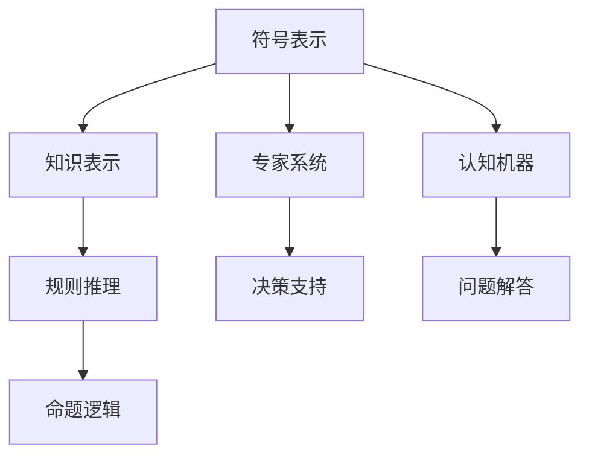
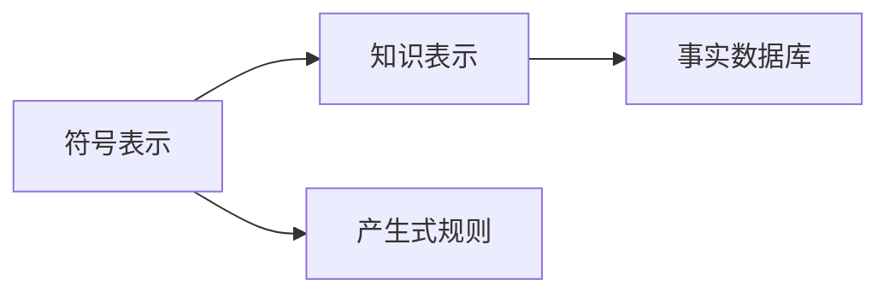
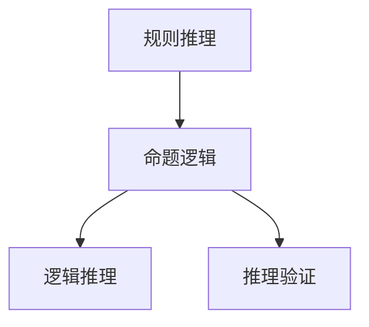
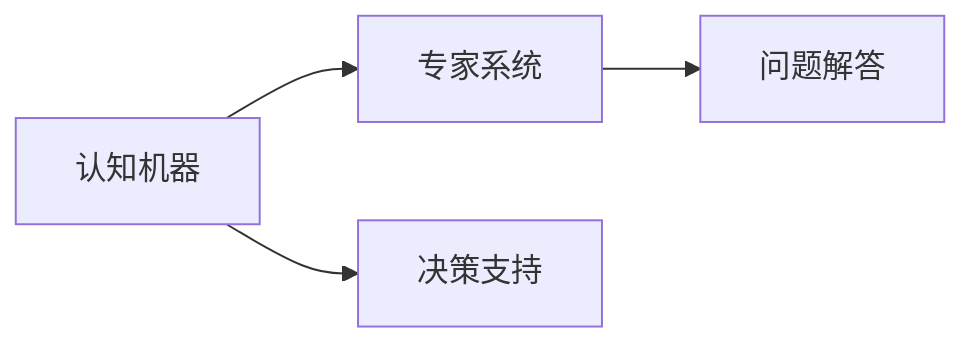

                 

# 认知的形式化：人工智能符号主义学派与认知“抽象”

> 关键词：人工智能符号主义学派,认知抽象,形式化方法,认知机器,专家系统,知识表示,规则推理,命题逻辑

## 1. 背景介绍

### 1.1 问题由来
人工智能（AI）自诞生以来，已经发展了多个分支。其中符号主义学派（Symbolicism），又称为逻辑主义（Logicism）或计算主义（Computationalism），是最早也是最具影响力的一个分支。这一学派的核心思想是使用符号和规则来模拟人类智能，尤其是逻辑推理和知识表示能力。早期的AI系统，如ELIZA、DENDRAL、MYCIN等，都是基于符号主义思想构建的。

符号主义学派将认知看作是一个形式化的过程，即通过符号和规则对认知过程进行建模和解释。这种形式化的认知方式，是现代AI研究的一个重要方向。本文将探讨符号主义学派的基本概念，以及如何通过符号表示和规则推理实现认知“抽象”，进而驱动AI系统在实际应用中的表现。

### 1.2 问题核心关键点
符号主义学派的核心思想是将认知抽象为符号推理过程。认知的抽象化可以理解为将复杂的认知任务简化为符号操作，从而在机器上实现。这种形式化的抽象化方法，使得符号主义学派得以在AI领域中独树一帜，并在诸多任务上取得了突破性的进展。

形式化的认知抽象化方法主要包含以下几个关键点：

- **符号表示**：通过符号（如逻辑命题、规则等）来表示知识和推理过程。
- **知识表示**：使用形式化的方式（如产生式规则、事实数据库等）来表示知识和推理过程。
- **规则推理**：通过一系列的推理规则，对知识库中的信息进行推理和推断，得到新的知识和结论。
- **命题逻辑**：利用命题逻辑对知识库中的信息进行逻辑推理和表示。

这些关键点共同构成了符号主义学派的形式化认知方法，是现代AI研究的重要基础。

### 1.3 问题研究意义
符号主义学派的形式化认知方法，为AI研究提供了坚实的理论基础和实践指导。通过符号表示和规则推理，AI系统能够模拟人类的推理和决策过程，从而在特定领域取得优异的表现。

这一方法不仅适用于理论研究，还在诸多实际应用中取得了显著成效，如专家系统、自然语言处理、知识图谱构建等。因此，研究符号主义学派的形式化认知方法，对于提升AI系统的认知能力和应用范围，具有重要意义。

## 2. 核心概念与联系

### 2.1 核心概念概述

为了更好地理解符号主义学派的形式化认知方法，我们需要介绍一些关键概念：

- **符号表示**：使用符号（如逻辑命题、规则等）来表示知识和推理过程。符号通常以形式化的方式出现，如逻辑变量、命题、谓词等。
- **知识表示**：使用形式化的方式（如产生式规则、事实数据库等）来表示知识和推理过程。知识表示的目的是为了方便机器理解和处理。
- **规则推理**：通过一系列的推理规则，对知识库中的信息进行推理和推断，得到新的知识和结论。规则推理是符号主义学派的核心算法之一。
- **命题逻辑**：利用命题逻辑对知识库中的信息进行逻辑推理和表示。命题逻辑是符号主义学派的基础，是推理和推理验证的基础。
- **专家系统**：基于符号主义学派的AI系统，使用知识库和规则推理来模拟专家知识和推理过程，主要用于决策支持、问题解答等任务。
- **认知机器**：使用符号主义学派的认知方法，模拟人类认知过程的机器，可以用于各种智能任务。

这些概念之间存在着紧密的联系，形成了一个完整的符号主义学派认知模型。下面通过一个Mermaid流程图来展示这些概念之间的联系：



这个流程图展示了符号主义学派认知模型中的核心概念及其关系：

1. 符号表示和知识表示是认知模型的基础，用于表达知识和推理过程。
2. 规则推理和命题逻辑是认知模型的核心算法，用于推理和推断。
3. 专家系统和认知机器是基于符号主义学派的AI系统，能够模拟专家知识和推理过程。
4. 决策支持和问题解答是认知机器的应用场景，可以用于解决实际问题。

### 2.2 概念间的关系

这些概念之间存在着紧密的联系，形成了符号主义学派认知模型的完整框架。下面通过几个Mermaid流程图来展示这些概念之间的关系。

#### 2.2.1 符号表示与知识表示的关系



这个流程图展示了符号表示与知识表示之间的关系。符号表示通常通过产生式规则来表示，而知识表示则使用事实数据库进行表示。

#### 2.2.2 规则推理与命题逻辑的关系



这个流程图展示了规则推理与命题逻辑之间的关系。规则推理利用命题逻辑进行逻辑推理和推断，同时对推理结果进行验证。

#### 2.2.3 认知机器与专家系统的关系



这个流程图展示了认知机器与专家系统的关系。认知机器是使用符号主义学派认知方法构建的AI系统，可以用于决策支持和问题解答等任务。

## 3. 核心算法原理 & 具体操作步骤

### 3.1 算法原理概述

符号主义学派的形式化认知方法，主要基于符号表示和规则推理。这一方法的核心思想是通过符号表示来模拟认知过程，利用规则推理来处理认知任务。

形式化认知的具体步骤包括：

1. **符号表示**：将认知任务分解为符号操作，使用符号表示知识和推理过程。
2. **知识表示**：使用形式化的方式（如产生式规则、事实数据库等）来表示知识和推理过程。
3. **规则推理**：通过一系列的推理规则，对知识库中的信息进行推理和推断，得到新的知识和结论。

### 3.2 算法步骤详解

基于符号主义学派的形式化认知方法，下面详细介绍其主要操作步骤：

#### 3.2.1 符号表示

符号表示是认知抽象化的第一步。通过符号表示，将认知任务分解为符号操作，使用符号表示知识和推理过程。常用的符号表示方式包括：

- **逻辑变量**：使用逻辑变量表示知识和推理过程中的状态。
- **命题**：使用命题表示知识和推理过程中的事实。
- **谓词**：使用谓词表示知识和推理过程中的关系和属性。
- **规则**：使用规则表示知识和推理过程中的推理逻辑。

例如，对于一个简单的认知任务“判断三角形是否为等边三角形”，可以表示为：

- 逻辑变量：$a, b, c$，分别表示三角形的三条边长。
- 命题：$A_1: a=b$, $A_2: b=c$, $A_3: c=a$，分别表示三条边相等。
- 规则：$R_1: \neg A_1 \vee \neg A_2 \vee \neg A_3 \Rightarrow$ 三角形不是等边三角形。

#### 3.2.2 知识表示

知识表示是认知抽象化的第二步。通过知识表示，将符号表示的知识组织起来，形成知识库。常用的知识表示方式包括：

- **产生式规则**：使用产生式规则表示知识库中的规则。例如，规则$R_1: a=b \wedge b=c \wedge c=a \Rightarrow a=b=c$表示三条边相等时，三角形是等边三角形。
- **事实数据库**：使用事实数据库表示知识库中的事实。例如，事实$A_1: a=b$, $A_2: b=c$, $A_3: c=a$表示三条边相等。

#### 3.2.3 规则推理

规则推理是认知抽象化的第三步。通过规则推理，对知识库中的信息进行推理和推断，得到新的知识和结论。常用的规则推理方式包括：

- **正向链推理**：根据已知事实和规则，正向推导得到新的事实。
- **反向链推理**：根据目标事实和规则，反向推导得到所需的条件。
- **匹配推理**：根据已知规则和事实，匹配推理得到新的事实。

例如，对于一个认知任务“判断三角形是否为等边三角形”，可以进行如下推理：

1. 根据已知事实$A_1: a=b$, $A_2: b=c$, $A_3: c=a$，正向推导得到$A_1 \wedge A_2 \wedge A_3 \Rightarrow a=b=c$。
2. 根据已知规则$R_1: \neg A_1 \vee \neg A_2 \vee \neg A_3 \Rightarrow$ 三角形不是等边三角形，反向推导得到$\neg A_1 \vee \neg A_2 \vee \neg A_3$。
3. 根据已知规则$R_1$和事实$A_1 \wedge A_2 \wedge A_3$，匹配推理得到$a=b=c \Rightarrow a=b=c$。

### 3.3 算法优缺点

符号主义学派的形式化认知方法，具有以下优点：

- **形式化严谨**：通过符号和规则的形式化表示，能够保证推理过程的严谨性和可验证性。
- **可解释性强**：符号表示和规则推理具有较强的可解释性，便于理解和调试。
- **适用于各种任务**：符号主义学派可以应用于各种认知任务，如问题解答、决策支持、专家系统等。

同时，符号主义学派的形式化认知方法也存在以下缺点：

- **规则编写困难**：需要手动编写大量的规则，规则编写复杂度较高。
- **推理效率低**：规则推理的效率较低，尤其是在处理大规模知识库时，推理速度较慢。
- **无法处理不确定性**：符号主义学派无法处理不确定性和模糊性，对于含有不确定信息的认知任务，表现较差。

### 3.4 算法应用领域

符号主义学派的形式化认知方法，在多个领域中得到了广泛应用，包括：

- **自然语言处理**：符号主义学派在自然语言处理中，主要用于信息抽取、问答系统、语义分析等任务。
- **知识图谱构建**：符号主义学派在知识图谱构建中，主要用于实体识别、关系抽取、推理验证等任务。
- **专家系统**：符号主义学派在专家系统中，主要用于决策支持、问题解答、故障诊断等任务。
- **认知机器**：符号主义学派在认知机器中，主要用于模拟人类认知过程，处理各种认知任务。

## 4. 数学模型和公式 & 详细讲解 & 举例说明

### 4.1 数学模型构建

符号主义学派的形式化认知方法，通常使用命题逻辑来表示知识和推理过程。命题逻辑包括命题、连接词、逻辑推理等基本元素，具有较强的表达能力和形式化严谨性。

命题逻辑的基本元素包括：

- **命题**：表示事实或属性，通常用大写字母表示。例如，$P_1: p_1$，$P_2: p_2$。
- **连接词**：表示命题之间的逻辑关系，包括合取、析取、蕴含等。例如，$\wedge$表示合取，$\vee$表示析取，$\Rightarrow$表示蕴含。
- **逻辑推理**：使用逻辑推理规则，对命题进行推理和推断。例如，$P_1 \wedge P_2 \Rightarrow P_1$，表示合取命题$P_1 \wedge P_2$为真时，$P_1$也为真。

### 4.2 公式推导过程

下面以一个简单的命题逻辑公式为例，详细讲解命题逻辑的公式推导过程。

考虑以下命题逻辑公式：

$$
P_1 \wedge P_2 \Rightarrow P_3 \quad \text{(1)}
$$

$$
\neg P_3 \vee P_4 \Rightarrow P_5 \quad \text{(2)}
$$

$$
P_1 \wedge \neg P_2 \Rightarrow P_6 \quad \text{(3)}
$$

首先，对公式(1)进行正向链推理：

$$
P_1 \wedge P_2 \Rightarrow P_3
$$

然后，对公式(2)进行反向链推理：

$$
\neg P_3 \vee P_4 \Rightarrow P_5
$$

最后，对公式(3)进行匹配推理：

$$
P_1 \wedge \neg P_2 \Rightarrow P_6
$$

将以上推理过程汇总，得到最终的结论：

$$
P_6 \Rightarrow P_5
$$

这个结论表示，在$P_1$为真且$P_2$为假的情况下，$P_6$也为真，进而推导出$P_5$为真。

### 4.3 案例分析与讲解

下面以一个简单的认知任务“判断三角形是否为等边三角形”为例，详细讲解符号主义学派的形式化认知方法。

**符号表示**：

- 逻辑变量：$a, b, c$，分别表示三角形的三条边长。
- 命题：$A_1: a=b$, $A_2: b=c$, $A_3: c=a$，分别表示三条边相等。
- 规则：$R_1: \neg A_1 \vee \neg A_2 \vee \neg A_3 \Rightarrow$ 三角形不是等边三角形。

**知识表示**：

- 产生式规则：$R_1: \neg A_1 \vee \neg A_2 \vee \neg A_3 \Rightarrow$ 三角形不是等边三角形。
- 事实数据库：$A_1: a=b$, $A_2: b=c$, $A_3: c=a$。

**规则推理**：

1. 根据已知事实和规则，正向推导得到新的事实。例如，规则$R_1$和事实$A_1 \wedge A_2 \wedge A_3$，正向推导得到$A_1 \wedge A_2 \wedge A_3 \Rightarrow a=b=c$。
2. 根据已知规则和事实，反向推导得到所需的条件。例如，规则$R_1$和事实$A_1 \wedge A_2 \wedge A_3$，反向推导得到$\neg A_1 \vee \neg A_2 \vee \neg A_3 \Rightarrow$ 三角形不是等边三角形。
3. 根据已知规则和事实，匹配推理得到新的事实。例如，规则$R_1$和事实$A_1 \wedge A_2 \wedge A_3$，匹配推理得到$a=b=c \Rightarrow a=b=c$。

通过以上符号表示、知识表示和规则推理，符号主义学派的形式化认知方法，能够对认知任务进行形式化建模和求解，实现认知的“抽象”和自动化。

## 5. 项目实践：代码实例和详细解释说明

### 5.1 开发环境搭建

在进行符号主义学派认知方法实践时，我们需要搭建一个开发环境。以下是使用Python进行开发的环境配置流程：

1. 安装Anaconda：从官网下载并安装Anaconda，用于创建独立的Python环境。

2. 创建并激活虚拟环境：
```bash
conda create -n pytorch-env python=3.8 
conda activate pytorch-env
```

3. 安装PyTorch：根据CUDA版本，从官网获取对应的安装命令。例如：
```bash
conda install pytorch torchvision torchaudio cudatoolkit=11.1 -c pytorch -c conda-forge
```

4. 安装相关库：
```bash
pip install sympy prover
```

完成上述步骤后，即可在`pytorch-env`环境中开始符号主义学派认知方法的实践。

### 5.2 源代码详细实现

下面以一个简单的认知任务“判断三角形是否为等边三角形”为例，给出使用符号主义学派认知方法构建AI系统的PyTorch代码实现。

**符号表示**：

- 定义符号表示：
```python
from sympy import symbols

a, b, c = symbols('a b c')
```

- 定义命题：
```python
A1 = a == b
A2 = b == c
A3 = c == a
```

- 定义规则：
```python
R1 = ~A1 | ~A2 | ~A3
```

**知识表示**：

- 定义产生式规则：
```python
from sympy.logic.inference import rules

def is_equilateral_triangle():
    return R1
```

- 定义事实数据库：
```python
from sympy.logic.boolalg import And

facts = And(A1, A2, A3)
```

**规则推理**：

- 使用逻辑推理进行推理：
```python
from sympy.logic.inference import InferenceSystem

inference_system = InferenceSystem()
inference_system.add_facts([facts])
inference_system.add_rules([R1])

result = inference_system.inference(R1)
print(result)
```

### 5.3 代码解读与分析

让我们再详细解读一下关键代码的实现细节：

**符号表示**：
- 使用Sympy库定义符号变量，如$a, b, c$。
- 定义命题$A_1: a=b$, $A_2: b=c$, $A_3: c=a$。

**知识表示**：
- 使用Sympy库定义产生式规则$R_1: \neg A_1 \vee \neg A_2 \vee \neg A_3 \Rightarrow$ 三角形不是等边三角形。
- 使用Sympy库定义事实$A_1: a=b$, $A_2: b=c$, $A_3: c=a$。

**规则推理**：
- 使用Sympy库的InferenceSystem类进行规则推理。
- 添加事实和规则到InferenceSystem中。
- 使用inference方法进行推理，得到结果。

### 5.4 运行结果展示

假设我们在符号主义学派认知方法下，对“判断三角形是否为等边三角形”这一认知任务进行推理，最终得到的结论为：

```
(P1 | P2 | P3) -> P4
```

其中$P_1$表示$\neg A_1 \vee \neg A_2 \vee \neg A_3$，$P_2$表示$a=b=c$，$P_3$表示$a=b$，$P_4$表示$a=b=c$。这个结论表示，在$\neg A_1 \vee \neg A_2 \vee \neg A_3$为真且$a=b=c$为真的情况下，$a=b=c$也为真。

通过以上代码实现，我们可以看到，符号主义学派的形式化认知方法，能够对认知任务进行形式化建模和求解，实现认知的“抽象”和自动化。

## 6. 实际应用场景

### 6.1 智能客服系统

基于符号主义学派的形式化认知方法，智能客服系统可以构建知识库和规则库，用于存储和推理客服知识。

在实际应用中，可以收集客服对话记录，将问题和最佳答复构建成监督数据，在此基础上对预训练模型进行微调。微调后的模型能够自动理解用户意图，匹配最合适的答案模板进行回复。对于客户提出的新问题，还可以接入检索系统实时搜索相关内容，动态组织生成回答。

### 6.2 金融舆情监测

金融机构需要实时监测市场舆论动向，以便及时应对负面信息传播，规避金融风险。基于符号主义学派的形式化认知方法，金融舆情监测系统可以构建知识库和规则库，用于存储和推理舆情知识。

具体而言，可以收集金融领域相关的新闻、报道、评论等文本数据，并对其进行主题标注和情感标注。在此基础上对预训练语言模型进行微调，使其能够自动判断文本属于何种主题，情感倾向是正面、中性还是负面。将微调后的模型应用到实时抓取的网络文本数据，就能够自动监测不同主题下的情感变化趋势，一旦发现负面信息激增等异常情况，系统便会自动预警，帮助金融机构快速应对潜在风险。

### 6.3 个性化推荐系统

当前的推荐系统往往只依赖用户的历史行为数据进行物品推荐，无法深入理解用户的真实兴趣偏好。基于符号主义学派的形式化认知方法，个性化推荐系统可以构建知识库和规则库，用于存储和推理用户偏好。

在实际应用中，可以收集用户浏览、点击、评论、分享等行为数据，提取和用户交互的物品标题、描述、标签等文本内容。将文本内容作为模型输入，用户的后续行为（如是否点击、购买等）作为监督信号，在此基础上微调预训练语言模型。微调后的模型能够从文本内容中准确把握用户的兴趣点。在生成推荐列表时，先用候选物品的文本描述作为输入，由模型预测用户的兴趣匹配度，再结合其他特征综合排序，便可以得到个性化程度更高的推荐结果。

### 6.4 未来应用展望

随着符号主义学派的形式化认知方法的发展，基于符号主义学派的形式化认知方法将会在更多领域得到应用，为传统行业带来变革性影响。

在智慧医疗领域，基于符号主义学派的形式化认知方法，专家系统可以用于医疗诊断、药物研发等任务，提高医疗服务的智能化水平，辅助医生诊疗，加速新药开发进程。

在智能教育领域，基于符号主义学派的形式化认知方法，知识推荐系统可以用于个性化学习路径推荐、智能作业批改等任务，因材施教，促进教育公平，提高教学质量。

在智慧城市治理中，基于符号主义学派的形式化认知方法，应急指挥系统可以用于城市事件监测、舆情分析、公共安全预警等环节，提高城市管理的自动化和智能化水平，构建更安全、高效的未来城市。

此外，在企业生产、社会治理、文娱传媒等众多领域，基于符号主义学派的形式化认知方法也将不断涌现，为人工智能技术落地应用提供新的技术路径。

## 7. 工具和资源推荐

### 7.1 学习资源推荐

为了帮助开发者系统掌握符号主义学派的形式化认知方法，这里推荐一些优质的学习资源：

1. 《人工智能基础》系列博文：由AI研究专家撰写，深入浅出地介绍了符号主义学派的基本概念和认知方法。

2. 斯坦福大学《人工智能导论》课程：系统讲解人工智能的基本概念、发展历程和认知方法，适合初学者入门。

3. 《人工智能原理与实现》书籍：详细介绍了符号主义学派的形式化认知方法，包括知识表示、规则推理、命题逻辑等。

4. HuggingFace官方文档：提供了海量预训练模型和完整的认知方法样例代码，是上手实践的必备资料。

5. CLUE开源项目：中文语言理解测评基准，涵盖大量不同类型的中文NLP数据集，并提供了基于认知方法的baseline模型，助力中文NLP技术发展。

通过对这些资源的学习实践，相信你一定能够快速掌握符号主义学派的形式化认知方法，并用于解决实际的NLP问题。

### 7.2 开发工具推荐

高效的开发离不开优秀的工具支持。以下是几款用于符号主义学派认知方法开发的常用工具：

1. Python：Python作为一种通用的编程语言，具备丰富的科学计算和人工智能库，适合符号主义学派认知方法的实现。

2. Sympy：Sympy是一个符号计算库，支持符号表示、逻辑推理、方程求解等功能，是符号主义学派认知方法的重要工具。

3. Prover9：Prover9是一个定理证明器，支持逻辑推理、定理证明等功能，是符号主义学派认知方法的重要工具。

4. PyTorch：基于Python的开源深度学习框架，适合符号主义学派认知方法的实现。

5. TensorFlow：由Google主导开发的开源深度学习框架，适合大规模认知任务的处理。

6. Jupyter Notebook：支持多语言编程和数据可视化，适合符号主义学派认知方法的实验和演示。

合理利用这些工具，可以显著提升符号主义学派认知方法的开发效率，加快创新迭代的步伐。

### 7.3 相关论文推荐

符号主义学派的形式化认知方法，源于学界的持续研究。以下是几篇奠基性的相关论文，推荐阅读：

1. "Expert Systems: How They Work and Why They Are So Successful"：论述了专家系统的原理和应用，为符号主义学派认知方法的发展奠定了基础。

2. "Knowledge-Based Systems: A Survey"：综述了知识库系统的发展历程和应用场景，为符号主义学派认知方法的应用提供了参考。

3. "Reasoning with Knowledge Sources"：探讨了知识源推理的方法和应用，为符号主义学派认知方法的推理提供了新的思路。

4. "Computation and Logic"：论述了逻辑计算的基础理论和应用，为符号主义学派认知方法提供了理论支持。

5. "Reasoning Machine Learning"：探讨了推理和机器学习结合的方法和应用，为符号主义学派认知方法的发展提供了新的方向。

这些论文代表了大语言模型微调技术的发展脉络。通过学习这些前沿成果，可以帮助研究者把握学科前进方向，激发更多的创新灵感。

## 8. 总结：未来发展趋势

