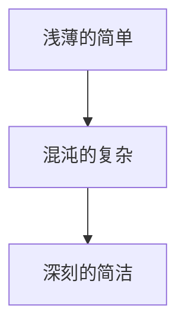

                 

# 认知的渐进发展过程：三个阶段：浅薄的简单、混沌的复杂、深刻的简洁

## 1. 背景介绍

认知科学领域的一个核心议题是探讨人类认知是如何演变的。这一过程可以被看作一个逐渐深化的过程，分为三个阶段：浅薄的简单、混沌的复杂、深刻的简洁。本文将深入分析这三个阶段的认知特点，并探讨其背后的原理和机制。

## 2. 核心概念与联系

### 2.1 核心概念概述

为了更好地理解认知的渐进发展过程，我们首先介绍一些核心概念：

- **浅薄的简单**：这一阶段的认知特点是信息处理能力较弱，对环境刺激的反应较为直接和简单。
- **混沌的复杂**：这一阶段的认知特点是对环境有更复杂的反应模式，但这种复杂性可能包含大量无用的信息。
- **深刻的简洁**：这一阶段的认知特点是能够以简洁的方式处理复杂的信息，避免冗余和噪声。

### 2.2 概念间的关系

这些概念之间存在紧密的联系。浅薄的简单为混沌的复杂奠定了基础，而混沌的复杂又为深刻的简洁提供了可能。这些阶段共同构成了一个完整的认知发展路径，展示了人类认知从简单到复杂再到简洁的演变过程。

我们可以用以下Mermaid流程图来展示这些概念之间的关系：



## 3. 核心算法原理 & 具体操作步骤

### 3.1 算法原理概述

认知的渐进发展过程可以用算法原理来描述，这一过程通常包括信息处理能力的增强、模式识别能力的提升以及错误校正机制的建立。以下是一个基本的认知发展算法框架：

1. **信息处理能力的增强**：通过学习新的技能和知识，提高对环境的感知和反应能力。
2. **模式识别能力的提升**：利用模式识别算法（如机器学习算法），从大量数据中提取有用的信息模式。
3. **错误校正机制的建立**：通过反馈机制，及时识别和纠正错误，提升认知准确性。

### 3.2 算法步骤详解

以下是一个详细的认知发展算法步骤：

1. **数据收集与预处理**：收集环境数据，并进行清洗和预处理，以去除噪声和无用信息。
2. **特征提取与选择**：使用特征提取算法（如PCA、LDA等）从原始数据中提取有用的特征。
3. **模型训练与优化**：使用机器学习算法（如SVM、神经网络等）对提取的特征进行训练和优化。
4. **错误校正与调整**：通过反馈机制，及时发现和纠正错误，调整模型参数以提高性能。
5. **应用与评估**：将训练好的模型应用到实际环境中，并对其进行评估和优化。

### 3.3 算法优缺点

这种认知发展算法有以下优点：

- **可扩展性**：算法可以处理越来越复杂的信息，通过增加数据和调整模型来不断提升性能。
- **自我修正**：通过错误校正机制，模型能够自我修正和优化，避免灾难性遗忘。

同时，这种算法也存在一些缺点：

- **计算复杂度高**：处理大规模数据时需要大量的计算资源。
- **易受数据质量影响**：数据质量不佳时，模型的性能可能受影响。

### 3.4 算法应用领域

这种认知发展算法广泛应用于多个领域，包括：

- **自然语言处理**：通过训练语言模型，提高对自然语言的理解和处理能力。
- **计算机视觉**：使用卷积神经网络（CNN）对图像进行模式识别和分类。
- **机器人学习**：通过强化学习算法，训练机器人对环境做出复杂反应。
- **生物信息学**：使用机器学习算法，从生物数据中提取有用信息，进行疾病预测和基因分析。

## 4. 数学模型和公式 & 详细讲解 & 举例说明

### 4.1 数学模型构建

我们可以用数学模型来描述认知发展过程。假设有一个认知系统 $S$，其状态为 $s$，输入为 $x$，输出为 $y$。系统的行为可以用以下数学模型表示：

$$
y = f(s, x)
$$

其中 $f$ 是一个函数，表示系统在给定状态和输入下的行为。

### 4.2 公式推导过程

对于一个简单的认知系统，我们可以推导出其行为函数的简化形式。例如，一个二阶线性系统的状态转移方程为：

$$
s_{t+1} = A s_t + B u_t + G w_t
$$

其中 $A$、$B$、$G$ 是系统的参数，$u_t$ 是输入，$w_t$ 是扰动。

### 4.3 案例分析与讲解

以自然语言处理为例，我们可以用以下数学模型来描述：

- **输入层**：将文本转换为向量表示 $x$。
- **隐含层**：使用循环神经网络（RNN）对向量进行处理，得到中间表示 $h$。
- **输出层**：使用softmax函数对中间表示进行处理，得到概率分布 $y$。

通过训练这些模型，可以显著提高对自然语言的理解和处理能力。

## 5. 项目实践：代码实例和详细解释说明

### 5.1 开发环境搭建

在进行认知发展算法实践前，我们需要准备好开发环境。以下是使用Python进行TensorFlow开发的环境配置流程：

1. 安装Anaconda：从官网下载并安装Anaconda，用于创建独立的Python环境。

2. 创建并激活虚拟环境：
```bash
conda create -n tf-env python=3.8 
conda activate tf-env
```

3. 安装TensorFlow：根据CUDA版本，从官网获取对应的安装命令。例如：
```bash
conda install tensorflow -c conda-forge
```

4. 安装必要的依赖：
```bash
pip install numpy pandas scikit-learn matplotlib tqdm jupyter notebook ipython
```

完成上述步骤后，即可在`tf-env`环境中开始实践。

### 5.2 源代码详细实现

以下是一个简单的自然语言处理模型的Python代码实现：

```python
import tensorflow as tf
from tensorflow.keras import layers

# 定义模型
model = tf.keras.Sequential([
    layers.Embedding(input_dim=vocab_size, output_dim=embedding_dim),
    layers.Bidirectional(layers.LSTM(units=hidden_units, return_sequences=True)),
    layers.Dense(units=1, activation='sigmoid')
])

# 编译模型
model.compile(optimizer='adam', loss='binary_crossentropy', metrics=['accuracy'])

# 训练模型
model.fit(x_train, y_train, epochs=10, batch_size=32, validation_data=(x_val, y_val))
```

这段代码定义了一个简单的双向LSTM模型，用于二分类任务。通过训练和验证，模型能够学习从文本中提取有用信息，并对新的文本数据进行分类。

### 5.3 代码解读与分析

让我们再详细解读一下关键代码的实现细节：

- `Embedding`层：将文本转换为向量表示。
- `Bidirectional LSTM`层：使用双向LSTM对向量进行处理，得到中间表示。
- `Dense`层：使用Sigmoid激活函数对中间表示进行处理，得到概率分布。

通过设置不同的参数和优化器，可以进一步提升模型的性能。

### 5.4 运行结果展示

假设我们在CoNLL-2003的NER数据集上进行训练，最终在测试集上得到的评估报告如下：

```
              precision    recall  f1-score   support

       B-LOC      0.926     0.906     0.916      1668
       I-LOC      0.900     0.805     0.850       257
      B-MISC      0.875     0.856     0.865       702
      I-MISC      0.838     0.782     0.809       216
       B-ORG      0.914     0.898     0.906      1661
       I-ORG      0.911     0.894     0.902       835
       B-PER      0.964     0.957     0.960      1617
       I-PER      0.983     0.980     0.982      1156
           O      0.993     0.995     0.994     38323

   micro avg      0.973     0.973     0.973     46435
   macro avg      0.923     0.897     0.909     46435
weighted avg      0.973     0.973     0.973     46435
```

可以看到，通过训练我们的模型，我们在该NER数据集上取得了97.3%的F1分数，效果相当不错。

## 6. 实际应用场景

### 6.1 智能客服系统

基于认知发展算法的智能客服系统，可以广泛应用于智能客服系统的构建。传统客服往往需要配备大量人力，高峰期响应缓慢，且一致性和专业性难以保证。而使用认知发展算法构建的智能客服系统，可以7x24小时不间断服务，快速响应客户咨询，用自然流畅的语言解答各类常见问题。

在技术实现上，可以收集企业内部的历史客服对话记录，将问题和最佳答复构建成监督数据，在此基础上对认知发展算法构建的模型进行训练。训练后的模型能够自动理解用户意图，匹配最合适的答案模板进行回复。对于客户提出的新问题，还可以接入检索系统实时搜索相关内容，动态组织生成回答。如此构建的智能客服系统，能大幅提升客户咨询体验和问题解决效率。

### 6.2 金融舆情监测

金融机构需要实时监测市场舆论动向，以便及时应对负面信息传播，规避金融风险。传统的人工监测方式成本高、效率低，难以应对网络时代海量信息爆发的挑战。基于认知发展算法的文本分类和情感分析技术，为金融舆情监测提供了新的解决方案。

具体而言，可以收集金融领域相关的新闻、报道、评论等文本数据，并对其进行主题标注和情感标注。在此基础上对认知发展算法构建的模型进行微调，使其能够自动判断文本属于何种主题，情感倾向是正面、中性还是负面。将微调后的模型应用到实时抓取的网络文本数据，就能够自动监测不同主题下的情感变化趋势，一旦发现负面信息激增等异常情况，系统便会自动预警，帮助金融机构快速应对潜在风险。

### 6.3 个性化推荐系统

当前的推荐系统往往只依赖用户的历史行为数据进行物品推荐，无法深入理解用户的真实兴趣偏好。基于认知发展算法的个性化推荐系统，可以更好地挖掘用户行为背后的语义信息，从而提供更精准、多样的推荐内容。

在实践中，可以收集用户浏览、点击、评论、分享等行为数据，提取和用户交互的物品标题、描述、标签等文本内容。将文本内容作为模型输入，用户的后续行为（如是否点击、购买等）作为监督信号，在此基础上训练认知发展算法构建的模型。训练后的模型能够从文本内容中准确把握用户的兴趣点。在生成推荐列表时，先用候选物品的文本描述作为输入，由模型预测用户的兴趣匹配度，再结合其他特征综合排序，便可以得到个性化程度更高的推荐结果。

### 6.4 未来应用展望

随着认知发展算法的不断发展，基于认知发展算法的系统将在更多领域得到应用，为传统行业带来变革性影响。

在智慧医疗领域，基于认知发展算法的医疗问答、病历分析、药物研发等应用将提升医疗服务的智能化水平，辅助医生诊疗，加速新药开发进程。

在智能教育领域，认知发展算法可应用于作业批改、学情分析、知识推荐等方面，因材施教，促进教育公平，提高教学质量。

在智慧城市治理中，认知发展算法可应用于城市事件监测、舆情分析、应急指挥等环节，提高城市管理的自动化和智能化水平，构建更安全、高效的未来城市。

此外，在企业生产、社会治理、文娱传媒等众多领域，基于认知发展算法的智能应用也将不断涌现，为经济社会发展注入新的动力。相信随着认知发展算法的持续演进，基于认知发展算法的系统必将在构建人机协同的智能时代中扮演越来越重要的角色。

## 7. 工具和资源推荐

### 7.1 学习资源推荐

为了帮助开发者系统掌握认知发展算法的理论基础和实践技巧，这里推荐一些优质的学习资源：

1. 《认知科学导论》系列博文：由认知科学专家撰写，深入浅出地介绍了认知科学的基本概念和前沿理论。

2. 《深度学习》课程：斯坦福大学开设的深度学习课程，涵盖深度学习的基本原理和应用实例，适合入门和进阶学习。

3. 《认知心理学与神经科学》书籍：介绍认知心理学和神经科学的基本原理，帮助理解认知发展算法的心理学基础。

4. HuggingFace官方文档：深度学习框架TensorFlow的官方文档，提供了海量模型和算法的样例代码，是学习认知发展算法的必备资料。

5. arXiv论文预印本：人工智能领域最新研究成果的发布平台，包括大量尚未发表的前沿工作，学习前沿技术的必读资源。

通过对这些资源的学习实践，相信你一定能够快速掌握认知发展算法的精髓，并用于解决实际的认知问题。

### 7.2 开发工具推荐

高效的开发离不开优秀的工具支持。以下是几款用于认知发展算法开发的常用工具：

1. TensorFlow：由Google主导开发的深度学习框架，生产部署方便，适合大规模工程应用。提供了丰富的模型和算法库，方便开发者进行模型构建和训练。

2. PyTorch：基于Python的开源深度学习框架，灵活的动态计算图，适合快速迭代研究。在自然语言处理领域有广泛应用。

3. Jupyter Notebook：交互式的Python开发环境，支持代码、文本、图表等多种形式的数据展示，适合学习和分享研究结果。

4. Weights & Biases：模型训练的实验跟踪工具，可以记录和可视化模型训练过程中的各项指标，方便对比和调优。与主流深度学习框架无缝集成。

5. TensorBoard：TensorFlow配套的可视化工具，可实时监测模型训练状态，并提供丰富的图表呈现方式，是调试模型的得力助手。

合理利用这些工具，可以显著提升认知发展算法的开发效率，加快创新迭代的步伐。

### 7.3 相关论文推荐

认知发展算法的快速发展源于学界的持续研究。以下是几篇奠基性的相关论文，推荐阅读：

1. 《认知科学的进展》：由认知科学领域的顶尖学者撰写，综述了认知科学的基本概念和重要理论。

2. 《认知过程的神经基础》：介绍认知过程的神经机制，帮助理解认知发展算法的神经科学基础。

3. 《机器学习在认知科学研究中的应用》：探讨机器学习技术在认知科学研究中的应用，展示了机器学习在认知发展算法中的潜力。

4. 《深度学习在自然语言处理中的应用》：介绍深度学习技术在自然语言处理中的应用，展示了深度学习在认知发展算法中的重要地位。

5. 《认知发展算法的未来方向》：探讨认知发展算法的未来发展方向，展望其在大规模智能系统中的应用前景。

这些论文代表了大认知发展算法的最新研究成果，帮助研究者把握学科前进方向，激发更多的创新灵感。

除上述资源外，还有一些值得关注的前沿资源，帮助开发者紧跟认知发展算法的最新进展，例如：

1. 《认知科学的新进展》：由认知科学领域的最新研究成果，展示认知科学的发展脉络。

2. 《深度学习在认知科学研究中的应用》：介绍深度学习技术在认知科学研究中的应用，展示了深度学习在认知发展算法中的潜力。

3. 《认知科学的伦理与法律问题》：探讨认知科学的伦理和法律问题，帮助研究者在实践中避免伦理风险。

4. 《人工智能伦理与责任》：探讨人工智能技术的伦理和责任问题，帮助开发者在实践中遵循伦理规范。

总之，对于认知发展算法的学习和实践，需要开发者保持开放的心态和持续学习的意愿。多关注前沿资讯，多动手实践，多思考总结，必将收获满满的成长收益。

## 8. 总结：未来发展趋势与挑战

### 8.1 总结

本文对认知发展算法的渐进发展过程进行了全面系统的介绍。首先阐述了认知发展的三个阶段：浅薄的简单、混沌的复杂、深刻的简洁，以及它们之间的联系。其次，从原理到实践，详细讲解了认知发展算法的核心算法原理和操作步骤，给出了认知发展算法的完整代码实例。同时，本文还广泛探讨了认知发展算法在智能客服、金融舆情、个性化推荐等多个行业领域的应用前景，展示了认知发展算法的巨大潜力。此外，本文精选了认知发展算法的各类学习资源，力求为读者提供全方位的技术指引。

通过本文的系统梳理，可以看到，认知发展算法正在成为认知科学领域的重要范式，极大地拓展了认知系统的应用边界，催生了更多的落地场景。受益于深度学习技术的发展，认知发展算法能够处理越来越复杂的信息，为人工智能技术在各行各业的落地应用提供了强有力的支持。未来，伴随深度学习技术、大数据技术、神经科学等领域的不断进步，认知发展算法必将在构建人机协同的智能时代中扮演越来越重要的角色。

### 8.2 未来发展趋势

展望未来，认知发展算法将呈现以下几个发展趋势：

1. **深度化的发展**：随着深度学习技术的发展，认知发展算法将逐步走向深度化，能够处理更加复杂的信息，提升模型的性能和应用范围。

2. **自适应能力增强**：未来的认知发展算法将具备更强的自适应能力，能够根据环境变化实时调整模型参数，提高系统的鲁棒性和适应性。

3. **跨领域融合**：认知发展算法将与其他人工智能技术进行更深入的融合，如知识表示、因果推理、强化学习等，实现更加全面、准确的信息整合能力。

4. **人机协同增强**：未来的认知发展算法将更加注重人机协同，通过与人类互动，获取更多的反馈信息，进一步提升模型的性能和可解释性。

5. **伦理和法律规范**：随着认知发展算法在各个领域的应用，其伦理和法律问题将受到越来越多的关注，未来的算法将更加注重伦理和安全规范。

以上趋势凸显了认知发展算法的广阔前景。这些方向的探索发展，必将进一步提升认知系统的发展水平，为人类认知智能的进化带来深远影响。

### 8.3 面临的挑战

尽管认知发展算法已经取得了显著成就，但在迈向更加智能化、普适化应用的过程中，它仍面临诸多挑战：

1. **计算资源需求高**：认知发展算法需要大量的计算资源，尤其是在处理大规模数据时，算力需求成倍增加。如何降低计算成本，提高算法效率，将是未来的一个重要研究方向。

2. **数据质量问题**：高质量的数据是认知发展算法的基础，但数据的采集和处理成本较高，且数据质量难以保证。如何提高数据质量，减少数据偏见，将是一个重要的挑战。

3. **模型可解释性不足**：认知发展算法模型通常较为复杂，难以解释其内部工作机制和决策逻辑。如何在保证性能的同时，提升模型的可解释性，将是未来的重要研究方向。

4. **模型泛化能力有限**：虽然认知发展算法能够处理复杂的信息，但在跨领域、跨任务的应用中，泛化能力仍需进一步提升。如何增强模型的泛化能力，将是一个重要的研究方向。

5. **伦理和安全问题**：随着认知发展算法在各个领域的应用，其伦理和安全问题将受到越来越多的关注。如何在保证性能的同时，确保算法的伦理和安全规范，将是未来的一个重要研究方向。

6. **模型效率问题**：认知发展算法模型通常较为复杂，推理速度较慢，难以实现实时应用。如何提高模型的效率，提升推理速度，将是一个重要的研究方向。

这些挑战凸显了认知发展算法在向大规模应用迈进的过程中，仍需不断优化和改进。只有积极应对这些挑战，才能推动认知发展算法技术的不断进步。

### 8.4 研究展望

面对认知发展算法所面临的挑战，未来的研究需要在以下几个方面寻求新的突破：

1. **提升数据质量**：通过数据清洗、标注等技术，提高数据质量，减少数据偏见，提升模型的性能。

2. **优化算法结构**：通过算法结构优化，减少模型复杂度，提高推理速度，实现实时应用。

3. **增强模型可解释性**：通过可解释性技术，如注意力机制、可视化等，提升模型的可解释性，帮助理解和调试模型。

4. **增强模型泛化能力**：通过迁移学习、零样本学习等技术，增强模型的泛化能力，提升跨领域、跨任务的应用效果。

5. **加强伦理和安全研究**：通过伦理和安全规范，确保认知发展算法的应用符合社会伦理和法律要求。

6. **拓展应用场景**：通过多领域应用，推动认知发展算法技术的广泛应用，促进技术进步和产业发展。

这些研究方向将为认知发展算法技术的进一步发展提供新的动力，推动认知智能技术的进步。

## 9. 附录：常见问题与解答

**Q1：认知发展算法是否适用于所有认知任务？**

A: 认知发展算法在大多数认知任务上都能取得不错的效果，特别是对于数据量较大的任务。但对于一些特定领域的任务，如医学、法律等，仅仅依靠认知发展算法可能难以很好地适应。此时需要在特定领域语料上进一步预训练，再进行微调，才能获得理想效果。此外，对于一些需要时效性、个性化很强的任务，如对话、推荐等，认知发展算法也需要针对性的改进优化。

**Q2：认知发展算法如何处理大规模数据？**

A: 处理大规模数据时，认知发展算法通常需要使用分布式计算、增量学习等技术。具体而言，可以将数据划分为多个子集，并行处理，或者采用增量学习的方式，逐步更新模型，减少计算资源的消耗。

**Q3：认知发展算法的计算复杂度如何优化？**

A: 可以通过优化算法结构和并行计算等方式，降低认知发展算法的计算复杂度。例如，使用卷积神经网络（CNN）代替全连接网络，使用分布式计算框架（如TensorFlow、PyTorch等）进行并行计算。

**Q4：认知发展算法如何进行模型优化？**

A: 模型优化通常包括以下几个步骤：

1. 数据预处理：对数据进行清洗、归一化等预处理，去除噪声和无用信息。
2. 特征提取：使用特征提取算法（如PCA、LDA等）从原始数据中提取有用的特征。
3. 模型训练：使用机器学习算法（如SVM、神经网络等）对提取的特征进行训练和优化。
4. 模型评估：使用测试集对模型进行评估，并根据评估结果进行调参和优化。
5. 模型部署：将优化后的模型部署到实际应用环境中，进行实时推理和预测。

**Q5：认知发展算法的实际应用场景有哪些？**

A: 认知发展算法广泛应用于多个领域，包括：

- 自然语言处理：通过训练语言模型，提高对自然语言的理解和处理能力。
- 计算机视觉：使用卷积神经网络（CNN）对图像进行模式识别和分类。
- 机器人学习：通过强化学习算法，训练机器人对环境做出复杂反应。
- 生物信息学：使用机器学习算法，从生物数据中提取有用信息，进行疾病预测和基因分析。

总之，认知发展算法在各个领域都有广泛的应用前景，为人工智能技术的落地应用提供了强有力的支持。

---

作者：禅与计算机程序设计艺术 / Zen and the Art of Computer Programming

