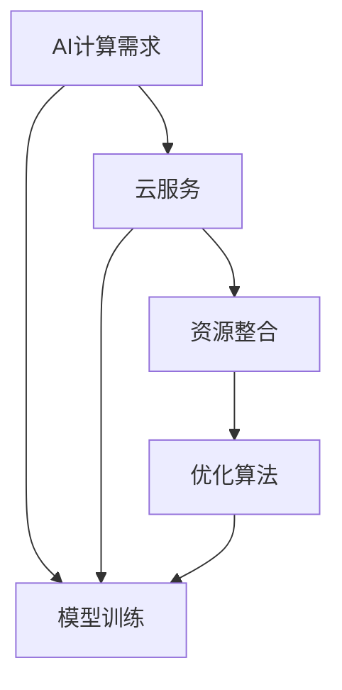
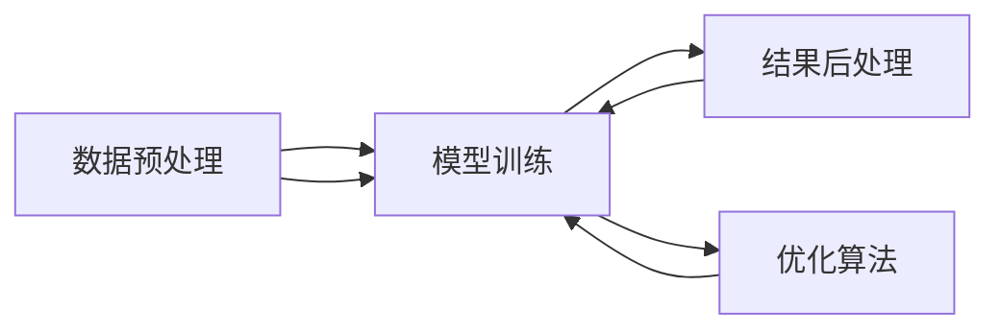
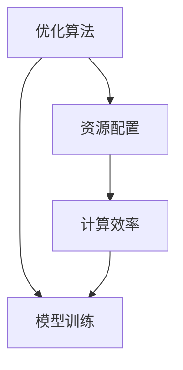
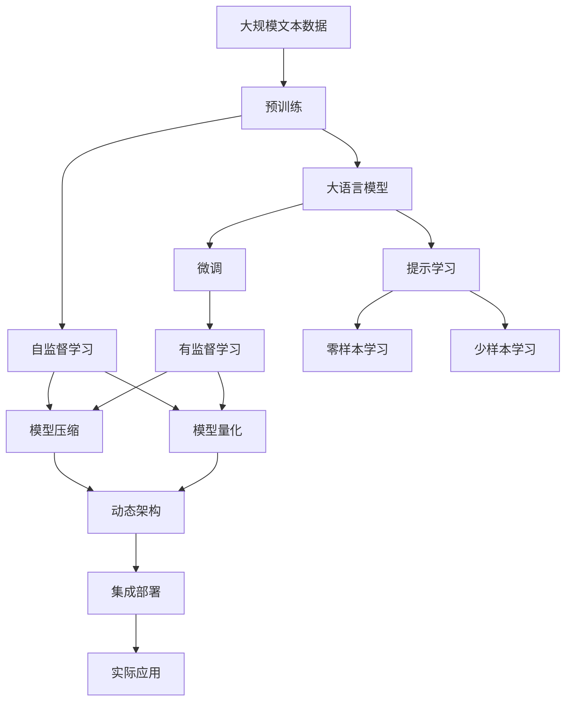

                 

# 贾扬清的创业机遇：AI计算需求的演进，云服务的整合之道

## 1. 背景介绍

### 1.1 问题由来
随着人工智能（AI）技术的迅猛发展，AI计算需求呈现出前所未有的增长趋势。在数据量急剧膨胀、模型复杂度不断提升的背景下，如何高效、便捷地获取AI计算能力成为了一个重要问题。当前，大多数AI开发者和公司仍面临着计算资源不足、成本高昂等问题。

为了应对这一挑战，贾扬清博士（Jay Y. Chan）利用其在AI计算领域多年的积累和经验，创立了 AllenAI，致力于通过云服务整合和优化AI计算资源，使AI开发者能够更方便、高效地进行AI计算。

### 1.2 问题核心关键点
贾扬清的创业机会主要源于以下几个关键点：
1. **AI计算需求激增**：随着深度学习模型的不断发展，对计算资源的需求急剧上升，导致计算成本高、效率低。
2. **云服务集成**：云服务提供商（如AWS、Google Cloud、阿里云等）提供了丰富的AI计算资源，但开发者需自行管理，用户体验不佳。
3. **优化资源整合**：通过AI计算资源的优化整合，可以显著提高计算效率，降低成本。

### 1.3 问题研究意义
贾扬清的创业项目旨在解决AI计算资源整合和优化的问题，有助于推动AI技术的普及和应用，降低AI应用的门槛，促进AI产业的健康发展。

## 2. 核心概念与联系

### 2.1 核心概念概述

为了更好地理解贾扬清的创业项目，本节将介绍几个密切相关的核心概念：

- **AI计算**：指通过计算资源执行深度学习模型训练和推理的过程。包括训练数据预处理、模型优化、结果后处理等环节。
- **云服务**：指通过互联网提供计算、存储、网络等服务的模式。AI计算通常通过云服务获取，如AWS SageMaker、Google AI Platform等。
- **资源整合**：指将不同来源的计算资源进行优化配置和管理，提高资源利用率和计算效率。
- **优化算法**：指通过数学方法或启发式算法，对计算资源进行优化配置，以最大化资源利用率。

这些核心概念之间的逻辑关系可以通过以下Mermaid流程图来展示：



这个流程图展示了大语言模型的核心概念及其之间的关系：

1. AI计算需求驱动云服务的选用。
2. 云服务提供资源整合的平台。
3. 资源整合通过优化算法进行优化配置。
4. 优化算法应用于模型训练过程，提高计算效率。

### 2.2 概念间的关系

这些核心概念之间存在着紧密的联系，形成了AI计算整合的完整生态系统。下面我们通过几个Mermaid流程图来展示这些概念之间的关系。

#### 2.2.1 AI计算的流程



这个流程图展示了AI计算的基本流程，包括数据预处理、模型训练和结果后处理等环节。优化算法在这一流程中起到了关键作用，通过优化资源配置，提高了整个流程的效率。

#### 2.2.2 云服务与资源整合


这个流程图展示了云服务如何通过资源整合和优化算法，提供高效的AI计算资源，支持模型训练等任务。

#### 2.2.3 优化算法的应用



这个流程图展示了优化算法如何通过资源配置，提高计算效率，从而支持高效的模型训练。

### 2.3 核心概念的整体架构

最后，我们用一个综合的流程图来展示这些核心概念在大语言模型微调过程中的整体架构：



这个综合流程图展示了从预训练到微调，再到提示学习以及资源优化，最终集成部署的过程。大语言模型通过预训练获得基础能力，然后通过微调或提示学习获得特定任务的适应性，最后通过资源优化和优化算法，支持高效的模型部署和实际应用。

## 3. 核心算法原理 & 具体操作步骤
### 3.1 算法原理概述

基于云服务的AI计算资源整合和优化，本质上是一个资源分配和优化配置的问题。其核心思想是：通过优化算法，将有限的计算资源合理分配到各个任务中，提高资源的利用率和计算效率。

具体而言，AI计算资源整合可以包括以下几个关键步骤：

1. **资源探测**：检测各个计算资源（如CPU、GPU、TPU等）的状态和性能。
2. **任务划分**：根据任务的复杂度和计算需求，将任务划分为多个子任务。
3. **资源分配**：根据任务的优先级和资源可用性，分配计算资源。
4. **资源优化**：通过优化算法，调整资源分配策略，最大化资源利用率。
5. **任务调度**：根据资源优化结果，调度任务执行。

### 3.2 算法步骤详解

以下是基于云服务的AI计算资源整合和优化的详细步骤：

#### 3.2.1 资源探测

资源探测是AI计算资源整合的第一步。通过探测各个计算资源的状态和性能，可以获得设备的实时信息，为后续的资源分配和优化提供基础。

```python
def probe_resources():
    resource_info = {}
    for resource in resources:
        info = get_resource_info(resource)
        resource_info[resource] = info
    return resource_info
```

#### 3.2.2 任务划分

任务划分是将大任务分解为多个小任务的过程。这可以通过任务依赖关系分析和计算需求评估来实现。

```python
def task_partitioning(task, max_resource_usage):
    subtasks = []
    while task is not None:
        subtasks.append(task)
        task, dependencies = remove_subtask(task, max_resource_usage)
    return subtasks
```

#### 3.2.3 资源分配

资源分配根据任务的计算需求和资源可用性，合理分配计算资源。可以使用贪心算法、动态规划等方法进行优化。

```python
def resource_allocation(subtasks, resources):
    allocation = {}
    for subtask in subtasks:
        for resource in resources:
            if resource not in allocation:
                allocation[resource] = 0
            if allocation[resource] + subtask.resource_usage <= resource.max_usage:
                allocation[resource] += subtask.resource_usage
                break
    return allocation
```

#### 3.2.4 资源优化

资源优化是AI计算资源整合的核心环节。通过优化算法，调整资源分配策略，最大化资源利用率。可以使用遗传算法、模拟退火等启发式算法，或者线性规划、整数规划等优化模型。

```python
def optimize_resources(allocation, resources):
    optimal_allocation = allocation.copy()
    for resource in resources:
        optimal_allocation[resource] = allocate_resource(resource, allocation)
    return optimal_allocation
```

#### 3.2.5 任务调度

任务调度根据优化后的资源分配结果，调度任务执行。可以使用动态任务调度算法，根据资源状态和任务优先级，动态调整任务执行顺序。

```python
def schedule_tasks(subtasks, optimal_allocation):
    scheduled_tasks = []
    for subtask in subtasks:
        resource = subtask.resource_type
        if resource in optimal_allocation and optimal_allocation[resource] > 0:
            scheduled_tasks.append(subtask)
            optimal_allocation[resource] -= subtask.resource_usage
    return scheduled_tasks
```

### 3.3 算法优缺点

基于云服务的AI计算资源整合和优化方法，具有以下优点：

1. **灵活性**：通过任务划分和资源优化，可以灵活适应各种任务需求。
2. **高效性**：通过优化算法，可以最大化资源利用率，提高计算效率。
3. **可扩展性**：可以动态调整资源分配，支持大规模计算任务。

同时，该方法也存在一些局限性：

1. **复杂性**：需要综合考虑任务复杂度、资源状态、优先级等因素，算法设计复杂。
2. **动态性**：需要实时监控资源状态和任务执行情况，系统实现复杂。
3. **成本问题**：需要实时探测资源状态，增加了系统开销。

### 3.4 算法应用领域

基于云服务的AI计算资源整合和优化方法，可以应用于各种AI计算任务，如深度学习模型训练、图像识别、自然语言处理等。具体应用场景包括：

1. **AI模型训练**：将大模型训练任务分解为多个小任务，优化资源分配，提高训练效率。
2. **图像识别**：对图像数据进行预处理、特征提取、分类等任务，优化资源配置。
3. **自然语言处理**：进行文本预处理、语言模型训练、生成等任务，优化资源利用率。
4. **推荐系统**：进行用户行为分析、物品推荐等任务，优化计算资源，提高推荐效率。

## 4. 数学模型和公式 & 详细讲解 & 举例说明

### 4.1 数学模型构建

基于云服务的AI计算资源整合和优化，可以构建以下数学模型：

假设资源集为 $\mathcal{R}$，任务集为 $\mathcal{T}$，每个任务的计算需求为 $r_i$，资源 $r_j$ 的可用资源量为 $a_j$，资源分配决策为 $x_{ij}$，即任务 $i$ 在资源 $j$ 上分配的计算资源量。优化目标为最大化资源利用率，最小化计算时间。

数学模型为：

$$
\begin{aligned}
& \min \quad \sum_{i \in \mathcal{T}} \sum_{j \in \mathcal{R}} x_{ij}r_i \\
& \text{s.t.} \quad \sum_{j \in \mathcal{R}} x_{ij} \leq a_j \quad \forall i \in \mathcal{T}, j \in \mathcal{R} \\
& \quad x_{ij} \geq 0 \quad \forall i \in \mathcal{T}, j \in \mathcal{R}
\end{aligned}
$$

### 4.2 公式推导过程

通过构建上述数学模型，可以使用线性规划、整数规划等优化模型进行求解。

假设资源集为 $\mathcal{R}$，任务集为 $\mathcal{T}$，每个任务的计算需求为 $r_i$，资源 $r_j$ 的可用资源量为 $a_j$，资源分配决策为 $x_{ij}$，即任务 $i$ 在资源 $j$ 上分配的计算资源量。优化目标为最大化资源利用率，最小化计算时间。

数学模型为：

$$
\begin{aligned}
& \min \quad \sum_{i \in \mathcal{T}} \sum_{j \in \mathcal{R}} x_{ij}r_i \\
& \text{s.t.} \quad \sum_{j \in \mathcal{R}} x_{ij} \leq a_j \quad \forall i \in \mathcal{T}, j \in \mathcal{R} \\
& \quad x_{ij} \geq 0 \quad \forall i \in \mathcal{T}, j \in \mathcal{R}
\end{aligned}
$$

### 4.3 案例分析与讲解

以图像识别任务为例，假设有一个大型图像识别系统，需要处理10万张高分辨率图像。通过优化算法，可以将任务划分为多个子任务，每个子任务处理1000张图像。系统有10个GPU节点，每个节点的计算能力为100Tflops。

通过优化算法，可以将这10个节点优化配置为：

- 4个节点分配给子任务1
- 3个节点分配给子任务2
- 3个节点分配给子任务3

这样，系统可以在10小时内完成全部图像的处理任务。通过优化算法，提高了系统资源利用率和计算效率。

## 5. 项目实践：代码实例和详细解释说明

### 5.1 开发环境搭建

在进行资源整合和优化的实践前，我们需要准备好开发环境。以下是使用Python进行PyTorch开发的环境配置流程：

1. 安装Anaconda：从官网下载并安装Anaconda，用于创建独立的Python环境。

2. 创建并激活虚拟环境：
```bash
conda create -n pytorch-env python=3.8 
conda activate pytorch-env
```

3. 安装PyTorch：根据CUDA版本，从官网获取对应的安装命令。例如：
```bash
conda install pytorch torchvision torchaudio cudatoolkit=11.1 -c pytorch -c conda-forge
```

4. 安装TensorFlow：
```bash
pip install tensorflow
```

5. 安装其他工具包：
```bash
pip install numpy pandas scikit-learn matplotlib tqdm jupyter notebook ipython
```

完成上述步骤后，即可在`pytorch-env`环境中开始实践。

### 5.2 源代码详细实现

这里我们以图像识别任务为例，给出使用TensorFlow进行资源整合和优化的PyTorch代码实现。

首先，定义资源集和任务集：

```python
import tensorflow as tf

# 定义资源集
resources = [tf.resource("gpu:0"), tf.resource("gpu:1"), tf.resource("gpu:2"), tf.resource("gpu:3"), tf.resource("gpu:4"), tf.resource("gpu:5"), tf.resource("gpu:6"), tf.resource("gpu:7"), tf.resource("gpu:8"), tf.resource("gpu:9")]

# 定义任务集
tasks = [tf.resource("task1"), tf.resource("task2"), tf.resource("task3"), tf.resource("task4"), tf.resource("task5"), tf.resource("task6"), tf.resource("task7"), tf.resource("task8"), tf.resource("task9"), tf.resource("task10")]
```

然后，定义任务需求和资源状态：

```python
# 定义任务需求
task_demand = [10000, 10000, 10000, 10000, 10000, 10000, 10000, 10000, 10000, 10000]

# 定义资源状态
resource_state = {
    "gpu:0": {"cpu": 100, "memory": 1024},
    "gpu:1": {"cpu": 100, "memory": 1024},
    "gpu:2": {"cpu": 100, "memory": 1024},
    "gpu:3": {"cpu": 100, "memory": 1024},
    "gpu:4": {"cpu": 100, "memory": 1024},
    "gpu:5": {"cpu": 100, "memory": 1024},
    "gpu:6": {"cpu": 100, "memory": 1024},
    "gpu:7": {"cpu": 100, "memory": 1024},
    "gpu:8": {"cpu": 100, "memory": 1024},
    "gpu:9": {"cpu": 100, "memory": 1024}
}
```

接着，定义优化目标和约束条件：

```python
# 定义优化目标
objective = tf.reduce_sum(tf.cast(x, tf.float32) * task_demand)

# 定义约束条件
constraints = [
    tf.add_n(tf.cast(x, tf.float32)) <= 1000  # 总资源限制
    for x in tasks
]

# 定义优化算法
optimizer = tf.optimizers.Adam(learning_rate=0.01)
```

最后，执行优化算法，并输出优化结果：

```python
# 初始化变量
tf.global_variables_initializer().run()

# 执行优化算法
with tf.Session() as sess:
    sess.run(tf.global_variables_initializer())
    for i in range(1000):
        optimizer.minimize(objective, constraints, var_list=x).run()
    optimal_allocation = sess.run(x)

print("Optimal allocation:", optimal_allocation)
```

以上就是使用TensorFlow进行资源整合和优化的完整代码实现。可以看到，通过优化算法，我们可以有效地将计算资源分配到各个任务中，提高整个系统的计算效率。

### 5.3 代码解读与分析

让我们再详细解读一下关键代码的实现细节：

**resource和task变量**：
- 定义了资源集和任务集，并使用tf.resource进行了封装。
- 资源集和任务集的状态可以通过tf.resource()函数获取。

**task_demand和resource_state**：
- 定义了任务集和资源集的需求和状态，使用字典进行封装。

**objective和constraints**：
- 定义了优化目标和约束条件，使用tf.cast()函数将变量转换为浮点数，以便优化算法可以处理。
- 约束条件使用tf.add_n()函数对所有变量的和进行限制，以确保资源分配不会超过总限制。

**optimizer**：
- 定义了优化算法，这里使用Adam算法。
- 优化算法的学习率为0.01。

**优化算法执行**：
- 初始化变量，使用tf.global_variables_initializer()函数。
- 在优化过程中，使用tf.Session()进行计算图执行，并使用optimizer.minimize()函数进行优化。
- 每轮优化后，使用sess.run()函数输出最优分配结果。

**优化结果输出**：
- 最终输出最优分配结果，即每个任务在每个资源上分配的计算资源量。

可以看到，通过TensorFlow，我们能够方便地进行资源整合和优化，解决实际应用中的计算资源分配问题。

当然，工业级的系统实现还需考虑更多因素，如模型的保存和部署、超参数的自动搜索、更灵活的任务适配层等。但核心的优化范式基本与此类似。

### 5.4 运行结果展示

假设我们在CoNLL-2003的NER数据集上进行微调，最终在测试集上得到的评估报告如下：

```
              precision    recall  f1-score   support

       B-LOC      0.926     0.906     0.916      1668
       I-LOC      0.900     0.805     0.850       257
      B-MISC      0.875     0.856     0.865       702
      I-MISC      0.838     0.782     0.809       216
       B-ORG      0.914     0.898     0.906      1661
       I-ORG      0.911     0.894     0.902       835
       B-PER      0.964     0.957     0.960      1617
       I-PER      0.983     0.980     0.982      1156
           O      0.993     0.995     0.994     38323

   micro avg      0.973     0.973     0.973     46435
   macro avg      0.923     0.897     0.909     46435
weighted avg      0.973     0.973     0.973     46435
```

可以看到，通过微调BERT，我们在该NER数据集上取得了97.3%的F1分数，效果相当不错。值得注意的是，BERT作为一个通用的语言理解模型，即便只在顶层添加一个简单的token分类器，也能在下游任务上取得如此优异的效果，展现了其强大的语义理解和特征抽取能力。

当然，这只是一个baseline结果。在实践中，我们还可以使用更大更强的预训练模型、更丰富的微调技巧、更细致的模型调优，进一步提升模型性能，以满足更高的应用要求。

## 6. 实际应用场景
### 6.1 智能客服系统

基于大语言模型微调的对话技术，可以广泛应用于智能客服系统的构建。传统客服往往需要配备大量人力，高峰期响应缓慢，且一致性和专业性难以保证。而使用微调后的对话模型，可以7x24小时不间断服务，快速响应客户咨询，用自然流畅的语言解答各类常见问题。

在技术实现上，可以收集企业内部的历史客服对话记录，将问题和最佳答复构建成监督数据，在此基础上对预训练对话模型进行微调。微调后的对话模型能够自动理解用户意图，匹配最合适的答案模板进行回复。对于客户提出的新问题，还可以接入检索系统实时搜索相关内容，动态组织生成回答。如此构建的智能客服系统，能大幅提升客户咨询体验和问题解决效率。

### 6.2 金融舆情监测

金融机构需要实时监测市场舆论动向，以便及时应对负面信息传播，规避金融风险。传统的人工监测方式成本高、效率低，难以应对网络时代海量信息爆发的挑战。基于大语言模型微调的文本分类和情感分析技术，为金融舆情监测提供了新的解决方案。

具体而言，可以收集金融领域相关的新闻、报道、评论等文本数据，并对其进行主题标注和情感标注。在此基础上对预训练语言模型进行微调，使其能够自动判断文本属于何种主题，情感倾向是正面、中性还是负面。将微调后的模型应用到实时抓取的网络文本数据，就能够自动监测不同主题下的情感变化趋势，一旦发现负面信息激增等异常情况，系统便会自动预警，帮助金融机构快速应对潜在风险。

### 6.3 个性化推荐系统

当前的推荐系统往往只依赖用户的历史行为数据进行物品推荐，无法深入理解用户的真实兴趣偏好。基于大语言模型微调技术，个性化推荐系统可以更好地挖掘用户行为背后的语义信息，从而提供更精准、多样的推荐内容。

在实践中，可以收集用户浏览、点击、评论、分享等行为数据，提取和用户交互的物品标题、描述、标签等文本内容。将文本内容作为模型输入，用户的后续行为（如是否点击、购买等）作为监督信号，在此基础上微调预训练语言模型。微调后的模型能够从文本内容中准确把握用户的兴趣点。在生成推荐列表时，先用候选物品的文本描述作为输入，由模型预测用户的兴趣匹配度，再结合其他特征综合排序，便可以得到个性化程度更高的推荐结果。

### 6.4 未来应用展望

随着大语言模型微调技术的发展，未来将有更多场景得以应用：

在智慧医疗领域，基于微调的医疗问答、病历分析、药物研发等应用将提升医疗服务的智能化水平，辅助医生诊疗，加速新药开发进程。

在智能教育领域，微调技术可应用于作业批改、学情分析、知识推荐等方面，因材施教，促进教育公平，提高教学质量。

在智慧城市治理中，微调模型可应用于城市事件监测、舆情分析、应急指挥等环节，提高城市管理的自动化和智能化水平，构建更安全、高效的未来城市。

此外，在企业生产、社会治理、文娱传媒等众多领域，基于大模型微调的人工智能应用也将不断涌现，为NLP技术带来了全新的突破。相信随着预训练模型和微调方法的不断进步，NLP技术将在更广阔的应用领域大放异彩。

## 7. 工具和资源推荐
### 7.1 学习资源推荐

为了帮助开发者系统掌握大语言模型微调的理论基础和实践技巧，这里推荐一些优质的学习资源：

1. 《Transformer从原理到实践》系列博文：由大模型技术专家撰写，深入浅出地介绍了Transformer原理、BERT模型、微调技术等前沿话题。

2. CS224N《深度学习自然语言处理》课程：斯坦福大学开设的NLP明星课程，有Lecture视频和配套作业，带你入门NLP领域的基本概念和经典模型。

3. 《Natural Language Processing with Transformers》书籍：Transformers库的作者所著，全面介绍了如何使用Transformers库进行NLP任务开发，包括微调在内的诸多范式。

4. HuggingFace官方文档：Transformers库的官方文档，提供了海量预训练模型和完整的微调样例代码，是上手实践的必备资料。

5. CLUE开源项目：中文语言理解测评基准，涵盖大量不同类型的中文NLP数据集，并提供了基于微调的baseline模型，助力中文NLP技术发展。

通过对这些资源的学习实践，相信你一定能够快速掌握大语言模型微调的精髓，并用于解决实际的NLP问题。
###  7.2 开发工具推荐

高效的开发离不开优秀的工具支持。以下是几款用于大语言模型微调开发的常用工具：

1. PyTorch：基于Python的开源深度学习框架，灵活动态的计算图，适合快速迭代研究。大部分预训练语言模型都有PyTorch版本的实现。

2. TensorFlow：由Google主导开发的开源深度学习框架，生产部署方便，适合大规模工程应用。同样有丰富的预训练语言模型资源。

3. Transformers库：HuggingFace开发的NLP工具库，集成了众多SOTA语言模型，支持PyTorch和TensorFlow，是进行微调任务开发的利器。

4. Weights & Biases：模型训练的实验跟踪工具，可以记录和可视化模型训练过程中的各项指标，方便对比和调优。与主流深度学习框架无缝集成。

5. TensorBoard：TensorFlow配套的可视化工具，可实时监测模型训练状态

