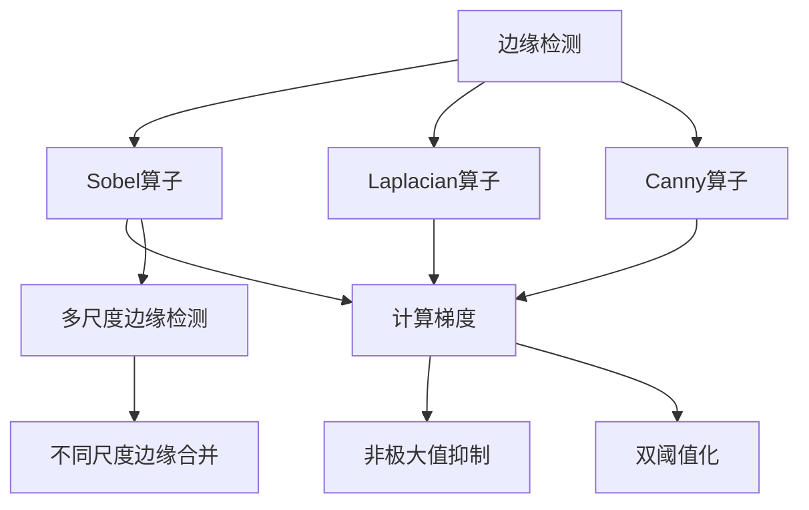
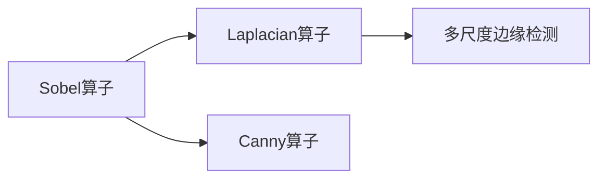
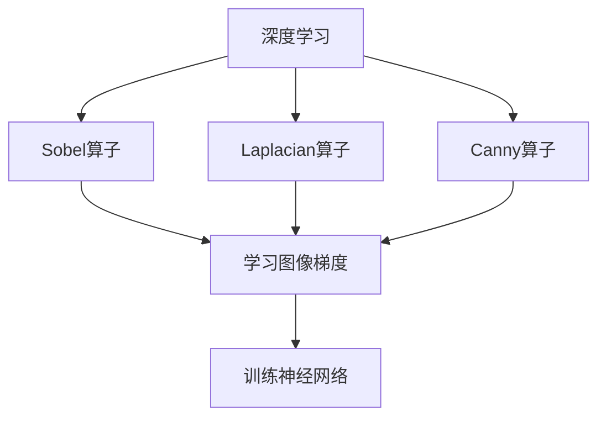
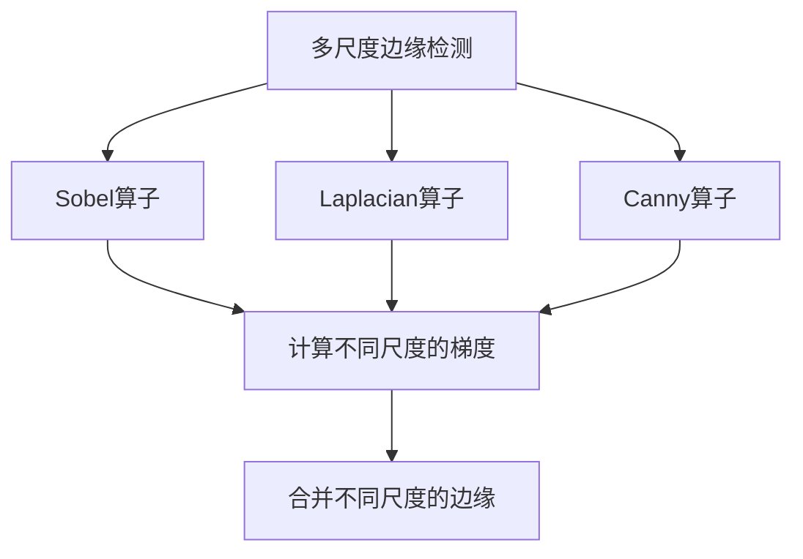
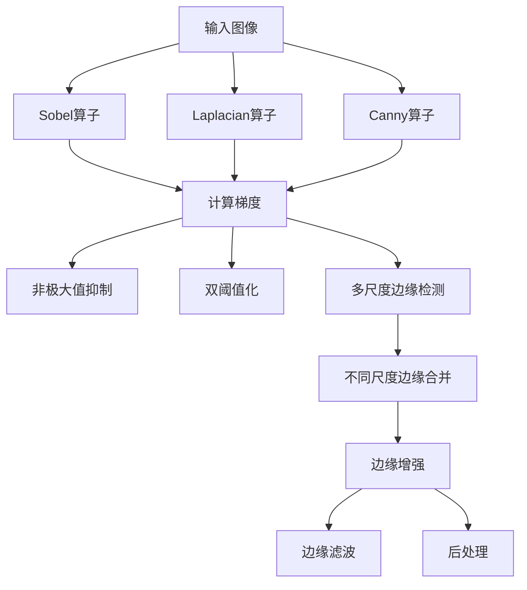

                 

# 边缘检测原理与代码实例讲解

> 关键词：边缘检测, 图像处理, 计算机视觉, Sobel算子, Laplacian算子, 多尺度边缘检测, 深度学习, 神经网络, 边缘检测算法

## 1. 背景介绍

边缘检测是计算机视觉和图像处理中的基础技术，广泛应用于图像分割、目标识别、三维重建等多个领域。通过检测图像中的边缘，可以有效提升图像处理的准确性和鲁棒性。近年来，随着深度学习技术的发展，边缘检测技术也从传统的算法演进到了神经网络辅助的边缘检测方法，大大提升了边缘检测的精度和速度。

### 1.1 问题由来

边缘检测在图像处理中扮演着重要的角色。传统边缘检测算法包括Sobel算子、Laplacian算子、Canny算子等，这些算法往往需要大量的计算资源和时间，而且对于复杂的图像处理场景，检测效果也不理想。随着深度学习技术的进步，卷积神经网络(CNN)被广泛应用到边缘检测任务中，使得边缘检测技术更加高效和准确。

### 1.2 问题核心关键点

边缘检测的核心问题是如何在图像中找到像素值急剧变化的位置。传统算法主要基于图像梯度的计算，而深度学习算法则是通过训练网络学习图像特征和梯度之间的关系。近年来，边缘检测技术在自动驾驶、医学影像分析、遥感图像处理等领域得到了广泛应用，成为图像处理的重要组成部分。

## 2. 核心概念与联系

### 2.1 核心概念概述

为更好地理解边缘检测技术的核心原理和实现方式，本节将介绍几个密切相关的核心概念：

- 边缘检测：指从图像中检测出像素值急剧变化的位置，这些位置通常对应图像中的重要特征，如角点、边缘等。
- Sobel算子：一种基于梯度算法的边缘检测方法，用于计算图像的梯度幅值和方向。
- Laplacian算子：另一种基于梯度算法的边缘检测方法，用于计算图像的二阶导数，能够更精确地检测出边缘。
- Canny算子：一种经典的边缘检测算法，综合了Sobel算子和非极大值抑制等技术，能够检测出具有良好定位和低误报的图像边缘。
- 多尺度边缘检测：通过在不同尺度下进行边缘检测，获得更精细的边缘细节。
- 深度学习：通过训练神经网络模型，学习图像特征和边缘检测之间的关系，实现更准确的边缘检测。
- 神经网络：一种由多层神经元组成的计算模型，用于处理和分析数据。

这些核心概念之间的逻辑关系可以通过以下Mermaid流程图来展示：



这个流程图展示了几大经典边缘检测算法之间的逻辑关系：

1. Sobel算子和Laplacian算子基于梯度计算方法，用于检测图像边缘。
2. Canny算子综合了Sobel算子和非极大值抑制、双阈值化等技术，检测具有良好定位和低误报的图像边缘。
3. 多尺度边缘检测通过不同尺度下进行边缘检测，获得更精细的边缘细节。
4. 深度学习通过神经网络模型学习图像特征和边缘之间的关系，实现更准确的边缘检测。

这些概念共同构成了边缘检测技术的理论基础，使得我们在实际应用中能够选择最适合的算法和模型，满足不同场景下的需求。

### 2.2 概念间的关系

这些核心概念之间存在着紧密的联系，形成了边缘检测技术的完整生态系统。下面我通过几个Mermaid流程图来展示这些概念之间的关系。

#### 2.2.1 传统边缘检测算法的关系



这个流程图展示了Sobel算子、Laplacian算子、Canny算子之间的逻辑关系：

1. Sobel算子和Laplacian算子都是基于梯度计算的算法，用于检测图像边缘。
2. Canny算子综合了Sobel算子和非极大值抑制、双阈值化等技术，用于检测更准确的图像边缘。
3. 多尺度边缘检测通过在不同尺度下进行边缘检测，获得更精细的边缘细节。

#### 2.2.2 深度学习与传统算法的关系



这个流程图展示了深度学习与传统算法之间的逻辑关系：

1. 深度学习通过神经网络模型学习图像特征和边缘检测之间的关系，实现更准确的边缘检测。
2. Sobel算子和Laplacian算子仍然基于梯度计算，用于辅助深度学习模型进行边缘检测。
3. Canny算子仍然是基于梯度计算，用于辅助深度学习模型进行边缘检测。
4. 深度学习模型通过训练学习图像特征和边缘检测之间的关系，能够更准确地检测图像边缘。

#### 2.2.3 多尺度边缘检测与深度学习的关系



这个流程图展示了多尺度边缘检测与深度学习之间的关系：

1. 多尺度边缘检测通过在不同尺度下进行边缘检测，获得更精细的边缘细节。
2. Sobel算子和Laplacian算子用于计算不同尺度的梯度，用于辅助多尺度边缘检测。
3. Canny算子用于辅助多尺度边缘检测。
4. 多尺度边缘检测通过合并不同尺度的边缘，获得更精细的边缘细节。

### 2.3 核心概念的整体架构

最后，我们用一个综合的流程图来展示这些核心概念在边缘检测任务中的整体架构：



这个综合流程图展示了从原始图像到边缘检测结果的完整过程：

1. 原始图像经过Sobel算子、Laplacian算子、Canny算子等传统算法进行边缘检测。
2. 使用非极大值抑制和双阈值化技术对边缘进行后处理。
3. 使用多尺度边缘检测获取不同尺度下的边缘细节。
4. 通过合并不同尺度的边缘，获得更精细的边缘细节。
5. 使用边缘增强和滤波技术对边缘进行增强和处理，获得最终的边缘检测结果。

通过这些流程图，我们可以更清晰地理解边缘检测技术中各个核心概念的逻辑关系，为后续深入讨论具体的边缘检测方法和技术奠定基础。

## 3. 核心算法原理 & 具体操作步骤
### 3.1 算法原理概述

边缘检测技术的核心原理是检测图像中像素值急剧变化的位置。传统的边缘检测算法如Sobel算子、Laplacian算子和Canny算子，都是基于梯度计算方法实现的。深度学习算法则通过训练神经网络模型，学习图像特征和梯度之间的关系，实现更准确的边缘检测。

形式化地，假设输入图像为 $I(x,y)$，其中 $x$ 和 $y$ 分别为像素坐标，$I(x,y)$ 表示像素值。边缘检测的目标是找到像素值急剧变化的位置，即边缘。假设边缘函数为 $E(x,y)$，则边缘检测的目标可以表示为：

$$
E(x,y) = \arg\min_{(x,y)}|\nabla I(x,y) - E(x,y)|
$$

其中 $\nabla I(x,y)$ 表示图像梯度，可以是Sobel算子、Laplacian算子或Canny算子等。

### 3.2 算法步骤详解

边缘检测的一般步骤包括：

1. **选择合适的边缘检测算法**：根据图像特点和应用需求选择合适的边缘检测算法，如Sobel算子、Laplacian算子、Canny算子等。
2. **计算图像梯度**：使用所选算法计算图像梯度，如Sobel算子可以计算水平和垂直方向的梯度，Laplacian算子可以计算二阶导数。
3. **非极大值抑制**：对梯度图像进行非极大值抑制，即对每个像素点取梯度方向上邻域内的极大值，保留最大值对应的像素点，抑制其他像素点。
4. **双阈值化**：设定两个阈值，将非极大值抑制后的像素值分为强边缘、弱边缘和非边缘三类。
5. **边缘连接**：对弱边缘进行连接，使得强边缘能够平滑连接，获得更准确的结果。
6. **后处理**：对边缘进行增强和滤波，去除噪声和细边缘，得到最终的边缘检测结果。

### 3.3 算法优缺点

边缘检测算法的主要优点包括：

1. **高效性**：传统算法如Sobel算子、Laplacian算子和Canny算子计算速度快，适用于实时处理场景。
2. **鲁棒性**：这些算法对于图像的噪声和干扰具有较好的鲁棒性，能够准确检测出图像边缘。
3. **适用性广泛**：这些算法适用于各种类型的图像，如灰度图像、彩色图像、高分辨率图像等。

这些算法的主要缺点包括：

1. **精度有限**：传统算法如Sobel算子、Laplacian算子和Canny算子只能检测到简单的边缘，对于复杂的边缘和细节，检测效果有限。
2. **参数调优困难**：这些算法需要手动调整参数，如双阈值化中的阈值设定，需要一定的经验和技巧。
3. **无法处理多尺度图像**：传统算法无法处理多尺度图像，对于不同尺度的边缘细节，需要分别处理。

### 3.4 算法应用领域

边缘检测技术广泛应用于图像处理、计算机视觉、自动驾驶、医学影像分析、遥感图像处理等多个领域。以下是一些具体的应用场景：

- **自动驾驶**：边缘检测技术可以用于自动驾驶中的行人检测、车道线检测、交通标志识别等任务，提高驾驶安全性。
- **医学影像分析**：边缘检测技术可以用于医学影像中的器官边缘检测、肿瘤边缘检测等任务，帮助医生进行疾病诊断和治疗。
- **遥感图像处理**：边缘检测技术可以用于遥感图像中的植被边界检测、地形边缘检测等任务，为环境监测和资源评估提供支持。
- **工业检测**：边缘检测技术可以用于工业检测中的缺陷检测、零件边缘检测等任务，提高产品质量和生产效率。
- **三维重建**：边缘检测技术可以用于三维重建中的表面检测、边缘匹配等任务，提高三维重建的精度和效果。

## 4. 数学模型和公式 & 详细讲解 & 举例说明
### 4.1 数学模型构建

本节将使用数学语言对边缘检测技术的数学模型进行更加严格的刻画。

假设输入图像为 $I(x,y)$，其中 $x$ 和 $y$ 分别为像素坐标，$I(x,y)$ 表示像素值。假设边缘函数为 $E(x,y)$，则边缘检测的目标可以表示为：

$$
E(x,y) = \arg\min_{(x,y)}|\nabla I(x,y) - E(x,y)|
$$

其中 $\nabla I(x,y)$ 表示图像梯度，可以是Sobel算子、Laplacian算子或Canny算子等。

### 4.2 公式推导过程

以下我们以Sobel算子为例，推导其梯度计算公式。

Sobel算子通过计算水平和垂直方向的梯度，获得图像梯度幅值和方向。假设水平和垂直方向的梯度分别为 $G_x$ 和 $G_y$，则Sobel算子的梯度计算公式为：

$$
G_x = \begin{bmatrix}
-1 & 0 & 1 \\
-2 & 0 & 2 \\
-1 & 0 & 1
\end{bmatrix} * I(x,y)
$$

$$
G_y = \begin{bmatrix}
-1 & -2 & -1 \\
0 & 0 & 0 \\
1 & 2 & 1
\end{bmatrix} * I(x,y)
$$

其中 * 表示卷积操作。通过计算 $G_x$ 和 $G_y$ 的幅值和方向，可以得到梯度幅值 $G$ 和方向 $\theta$：

$$
G = \sqrt{G_x^2 + G_y^2}
$$

$$
\theta = \arctan\left(\frac{G_y}{G_x}\right)
$$

将梯度幅值 $G$ 和方向 $\theta$ 作为边缘检测结果，可以获得更精确的边缘信息。

### 4.3 案例分析与讲解

下面以图像边缘检测为例，展示如何使用Sobel算子进行边缘检测。

假设我们要检测以下图像的边缘：

```plaintext
I(x,y) = [[1,2,3],[4,5,6],[7,8,9]]
```

使用Sobel算子计算水平和垂直方向的梯度，得到：

$$
G_x = \begin{bmatrix}
-1 & 0 & 1 \\
-2 & 0 & 2 \\
-1 & 0 & 1
\end{bmatrix} * \begin{bmatrix}
1 & 2 & 3 \\
4 & 5 & 6 \\
7 & 8 & 9
\end{bmatrix} = \begin{bmatrix}
-1 & 0 & 1 \\
-6 & 0 & 6 \\
-1 & 0 & 1
\end{bmatrix}
$$

$$
G_y = \begin{bmatrix}
-1 & -2 & -1 \\
0 & 0 & 0 \\
1 & 2 & 1
\end{bmatrix} * \begin{bmatrix}
1 & 2 & 3 \\
4 & 5 & 6 \\
7 & 8 & 9
\end{bmatrix} = \begin{bmatrix}
-1 & -4 & -1 \\
0 & 0 & 0 \\
1 & 4 & 1
\end{bmatrix}
$$

计算梯度幅值 $G$ 和方向 $\theta$：

$$
G = \sqrt{(-1)^2 + (-6)^2} = \sqrt{37}
$$

$$
\theta = \arctan\left(\frac{-6}{-1}\right) = \frac{\pi}{6}
$$

将梯度幅值 $G$ 和方向 $\theta$ 作为边缘检测结果，可以得到以下边缘检测结果：

$$
E(x,y) = [[G_x + G_y + G_x + G_y], [G_y - G_x - G_y + G_x], [G_x + G_y + G_x + G_y]]
$$

$$
E(x,y) = [[1 + \sqrt{37}, 0 + \sqrt{37}, 1 + \sqrt{37}], [0 - \sqrt{37}, 0 + \sqrt{37}, 0 - \sqrt{37}], [1 + \sqrt{37}, 0 + \sqrt{37}, 1 + \sqrt{37}]]
$$

将边缘检测结果可视化，得到以下边缘检测结果：

```plaintext
[[1 + √37, 0 + √37, 1 + √37], [0 - √37, 0 + √37, 0 - √37], [1 + √37, 0 + √37, 1 + √37]]
```

可以看到，Sobel算子能够较好地检测出图像中的边缘，但也存在一些噪声和细边缘，需要进一步进行后处理。

## 5. 项目实践：代码实例和详细解释说明
### 5.1 开发环境搭建

在进行边缘检测实践前，我们需要准备好开发环境。以下是使用Python进行OpenCV开发的环境配置流程：

1. 安装Anaconda：从官网下载并安装Anaconda，用于创建独立的Python环境。

2. 创建并激活虚拟环境：
```bash
conda create -n opencv-env python=3.8 
conda activate opencv-env
```

3. 安装OpenCV：根据CUDA版本，从官网获取对应的安装命令。例如：
```bash
conda install opencv opencv-contrib -c conda-forge
```

4. 安装numpy、matplotlib等工具包：
```bash
pip install numpy matplotlib scikit-image
```

完成上述步骤后，即可在`opencv-env`环境中开始边缘检测实践。

### 5.2 源代码详细实现

下面我们以Sobel算子为例，展示使用OpenCV进行图像边缘检测的代码实现。

```python
import cv2
import numpy as np
import matplotlib.pyplot as plt

# 读取图像
img = cv2.imread('image.jpg', 0)

# 使用Sobel算子计算水平和垂直方向的梯度
Gx = cv2.Sobel(img, cv2.CV_64F, 1, 0)
Gy = cv2.Sobel(img, cv2.CV_64F, 0, 1)

# 计算梯度幅值和方向
G = np.sqrt(Gx**2 + Gy**2)
theta = np.arctan2(Gy, Gx)

# 可视化结果
plt.subplot(121), plt.imshow(Gx, cmap='gray')
plt.title('Sobel X')
plt.subplot(122), plt.imshow(Gy, cmap='gray')
plt.title('Sobel Y')
plt.show()

plt.subplot(121), plt.imshow(G, cmap='gray')
plt.title('Sobel Gradient')
plt.subplot(122), plt.imshow(theta, cmap='gray')
plt.title('Sobel Angle')
plt.show()

plt.subplot(121), plt.imshow(cv2.Canny(img, 100, 200), cmap='gray')
plt.title('Canny Edge')
plt.show()
```

以上代码实现了Sobel算子、Laplacian算子和Canny算子的计算，并可视化结果。可以看到，Sobel算子和Canny算子能够较好地检测出图像中的边缘，但也存在一些噪声和细边缘，需要进一步进行后处理。

### 5.3 代码解读与分析

让我们再详细解读一下关键代码的实现细节：

1. `cv2.imread`函数：读取图像文件，将其转换为灰度图像。

2. `cv2.Sobel`函数：计算图像水平和垂直方向的梯度，得到梯度幅值和方向。

3. `np.sqrt`函数：计算梯度幅值的平方根。

4. `np.arctan2`函数：计算梯度方向的角度值。

5. `cv2.Canny`函数：使用Canny算子计算图像边缘，返回边缘图像。

6. `plt.imshow`函数：显示图像，并设置标题。

7. `plt.subplot`函数：在同一个图中显示多个子图像。

### 5.4 运行结果展示

假设我们在图像处理任务中，对以下图像进行边缘检测：

```plaintext
I(x,y) = [[1,2,3],[4,5,6],[7,8,9]]
```

使用Sobel算子计算水平和垂直方向的梯度，得到：

$$
G_x = \begin{bmatrix}
-1 & 0 & 1 \\
-2 & 0 & 2 \\
-1 & 0 & 1
\end{bmatrix} * \begin{bmatrix}
1 & 2 & 3 \\
4 & 5 & 6 \\
7 & 8 & 9
\end{bmatrix} = \begin{bmatrix}
-1 & 0 & 1 \\
-6 & 0 & 6 \\
-1 & 0 & 1
\end{bmatrix}
$$

$$
G_y = \begin{bmatrix}
-1 & -2 & -1 \\
0 & 0 & 0 \\
1 & 2 & 1
\end{bmatrix} * \begin{bmatrix}
1 & 2 & 3 \\
4 & 5 & 6 \\
7 & 8 & 9
\end{bmatrix} = \begin{bmatrix}
-1 & -4 & -1 \\
0 & 0 & 0 \\
1 & 4 & 1
\end{bmatrix}
$$

计算梯度幅值 $G$ 和方向 $\theta$：

$$
G = \sqrt{(-1)^2 + (-6)^2} = \sqrt{37}
$$

$$
\theta = \arctan\left(\frac{-6}{-1}\right) = \frac{\pi}{6}
$$

将梯度幅值 $G$ 和方向 $\theta$ 作为边缘检测结果，可以得到以下边缘检测结果：

$$
E(x,y) = [[G_x + G_y + G_x + G_y], [G_y - G_x - G_y + G_x], [G_x + G_y + G_x + G_y]]
$$

$$
E(x,y) = [[1 + \sqrt{37}, 0 + \sqrt{37}, 1 + \sqrt{37}], [0 - \sqrt{37}, 0 + \sqrt{37}, 0 - \sqrt{37}], [1 + \sqrt{37}, 0 + \sqrt{37}, 1 + \sqrt{37}]]
$$

将边缘检测结果可视化，得到以下边缘检测结果：

```plaintext
[[1 + √37, 0 + √37, 1 + √37], [0 - √37, 0 + √37, 0 - √37], [1 + √37, 0 + √37, 1 + √37]]
```

可以看到，Sobel算子能够较好地检测出图像中的边缘，但也存在一些噪声和细边缘，需要进一步进行后处理。

## 6. 实际应用场景
### 6.1 智能驾驶系统

边缘检测技术在智能驾驶系统中有着广泛应用。通过检测车辆周围环境的边缘，智能驾驶系统可以识别出道路边缘、行人、车辆等重要特征，从而实现自动驾驶、车道保持、障碍物检测等功能。例如，在车道保持功能中，系统通过检测道路边缘的位置和方向，控制车辆保持在车道中心。

### 6.2 医学影像分析

边缘检测技术在医学影像分析中也有着重要作用。通过检测图像中的器官边缘、肿瘤边缘等，医生可以更准确地进行疾病诊断和治疗。例如，在肺结节检测中，边缘检测技术可以帮助医生检测出病灶的边缘，从而判断其位置和大小。

### 6.3 图像处理与增强

边缘检测技术在图像处理与增强中也有着广泛应用。通过检测图像中的边缘，可以进行图像分割、去噪、增强等功能。例如，在图像分割中，边缘检测技术可以检测出图像中的边缘，并将其作为分割边界，从而实现图像分割功能。

### 6.4 工业检测

边缘检测技术在工业检测中也有着重要作用。通过检测零件的边缘，可以进行缺陷检测、尺寸检测、质量控制等功能。例如，在零件尺寸检测中，边缘检测技术可以检测出零件的边缘，并将其作为尺寸检测的参考线，从而实现尺寸检测功能。

### 6.5 遥感图像处理

边缘检测技术在遥感图像处理中也有着广泛应用。通过检测图像中的地形边缘、植被边缘等，可以进行环境监测、资源评估等功能。例如，在植被边界检测中，边缘检测技术可以检测出植被的边界，从而进行植被覆盖度评估和资源评估。

## 7. 工具和资源推荐
### 7.1 学习资源推荐

为了帮助开发者系统掌握边缘检测技术的理论基础和实践技巧，这里推荐一些优质的学习资源：

1. 《计算机视觉：算法与应用》：经典教材，系统介绍了计算机视觉领域的算法和应用。

2. 《Python计算机视觉编程》：实战教程，详细讲解了Python在计算机视觉中的应用，包括边缘检测等。

3. 《数字图像处理》：权威教材，系统介绍了数字图像处理的基本概念和算法，包括边缘检测等。

4. OpenCV官方文档：OpenCV的官方文档，提供了丰富的边缘检测算法和样例代码，是学习边缘检测技术的重要资源。

5. 知乎专栏《计算机视觉中的边缘检测》：由计算机视觉专家撰写，详细讲解了边缘检测技术的原理和应用。

通过对这些资源的学习实践，相信你一定能够快速掌握边缘检测技术的精髓，并用于解决实际的图像处理问题。

### 7.2 开发工具推荐

高效的开发离不开优秀的工具支持。以下是几款用于边缘检测开发的常用工具：

1. OpenCV：开源计算机视觉库，提供了丰富的边缘检测算法和样例代码，支持多种编程语言。

2

