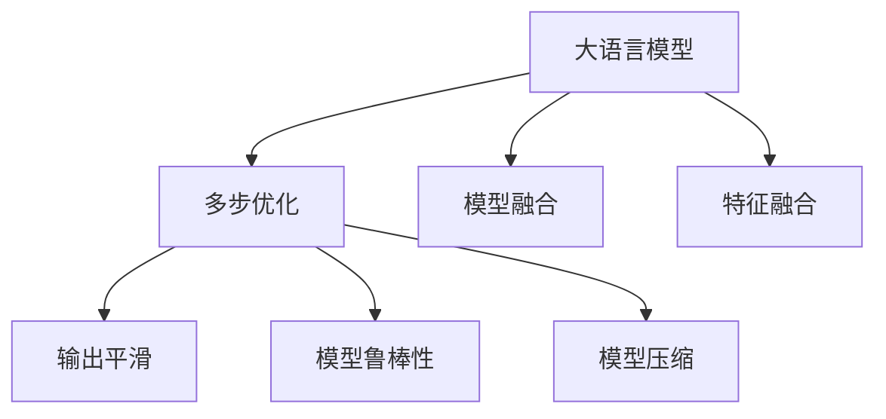
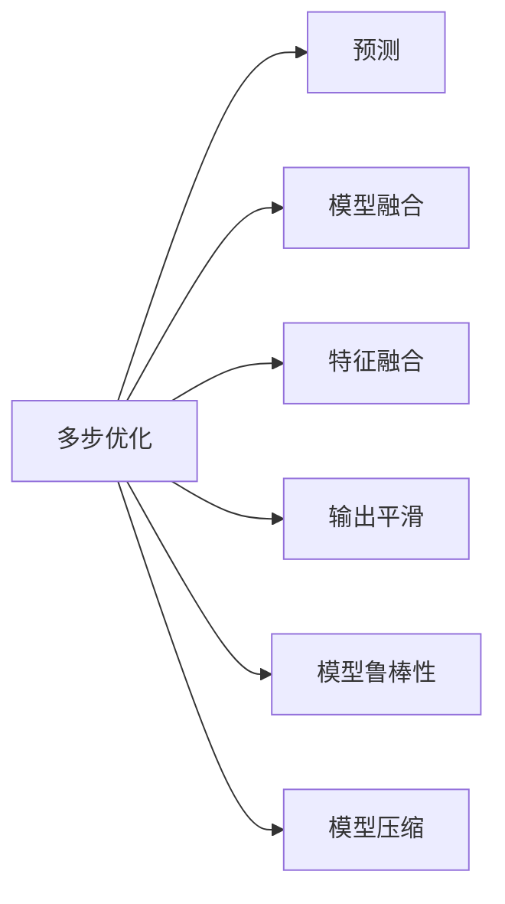
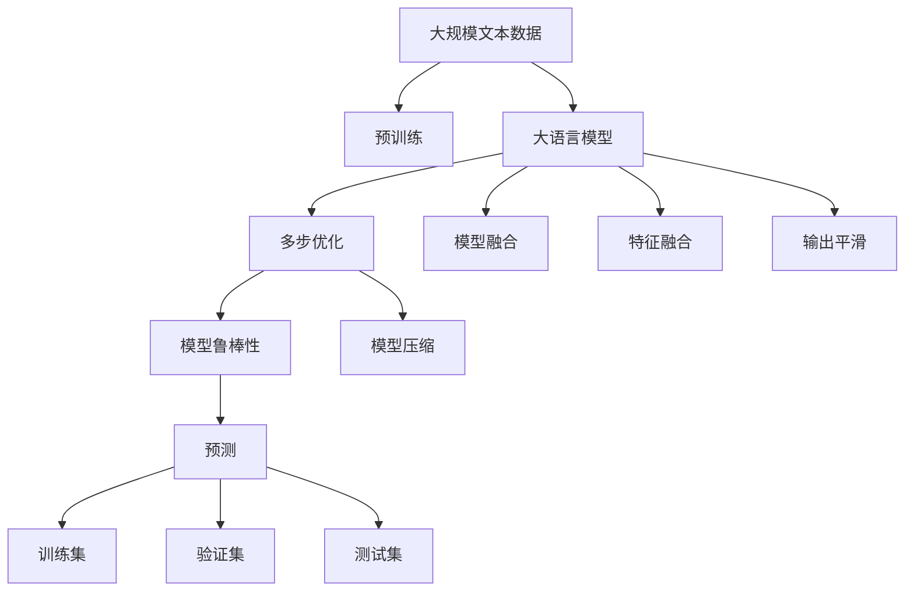

                 

# 大语言模型应用指南：多步优化中的预测

> 关键词：大语言模型,预测,多步优化,模型融合,分布式训练,特征融合,输出平滑,模型鲁棒性,模型压缩,泛化能力

## 1. 背景介绍

### 1.1 问题由来

随着深度学习技术和大规模数据集的不断发展，大语言模型（Large Language Models, LLMs）在自然语言处理（Natural Language Processing, NLP）领域取得了显著的进步。大语言模型通过在巨量的无标注数据上预训练，学习了丰富的语言知识，能够进行语言生成、理解、推理等复杂任务。然而，现实应用中，大语言模型的预测能力常常受限于其固有的偏见和过拟合风险，导致在多步预测（如自然语言生成、对话生成等）任务上表现不佳。

针对这一问题，多步优化（Multi-Step Optimization）技术应运而生。多步优化方法通过对预测过程进行多轮迭代和优化，以提升模型的预测精度和泛化能力。本文将深入探讨多步优化技术在大语言模型中的应用，介绍其基本原理、具体操作步骤、优缺点及应用场景，帮助开发者在实际应用中更好地利用多步优化技术，实现更加精准、鲁棒的预测结果。

### 1.2 问题核心关键点

多步优化技术通过在预测过程中进行多次迭代和优化，逐步提升模型的预测精度和泛化能力。关键点包括：

- **多轮迭代**：通过多次迭代，逐步逼近最优预测结果。
- **模型融合**：将多个模型（不同时间步的模型）的输出进行融合，提升预测结果的鲁棒性和泛化能力。
- **特征融合**：利用不同时间步的特征进行融合，提取更为丰富的上下文信息。
- **输出平滑**：通过平滑预测结果，减少输出波动和不确定性。
- **模型鲁棒性**：通过多步优化，提升模型对噪声和异常数据的鲁棒性。
- **模型压缩**：通过模型压缩技术，减小模型大小，提高推理速度和效率。

多步优化技术广泛应用于自然语言生成、对话生成、问答系统等场景，在提升模型预测性能方面具有重要意义。

### 1.3 问题研究意义

研究多步优化技术在大语言模型中的应用，对于提升模型预测性能、增强模型鲁棒性、优化模型输出等方面具有重要意义：

1. **提高预测精度**：通过多步优化，逐步逼近最优预测结果，提升模型在多步预测任务上的性能。
2. **增强鲁棒性**：多步优化能够提高模型对噪声和异常数据的鲁棒性，减少预测结果的不确定性。
3. **优化输出**：通过模型融合和特征融合，优化预测结果，使其更加平滑、准确。
4. **提高效率**：多步优化过程中，模型参数和推理过程的优化，能够显著提升推理速度和模型效率。
5. **广泛应用**：多步优化技术可以应用于各种NLP任务，如自然语言生成、对话生成、问答系统等。

## 2. 核心概念与联系

### 2.1 核心概念概述

为了更好地理解多步优化技术在大语言模型中的应用，本节将介绍几个密切相关的核心概念：

- **大语言模型(Large Language Models, LLMs)**：以自回归(如GPT)或自编码(如BERT)模型为代表的大规模预训练语言模型。通过在大规模无标签文本语料上进行预训练，学习通用的语言表示，具备强大的语言理解和生成能力。

- **多步优化(Multi-Step Optimization)**：通过在预测过程中进行多次迭代和优化，逐步提升模型预测精度的技术。

- **模型融合(Model Fusion)**：将多个模型（不同时间步的模型）的输出进行融合，提升预测结果的鲁棒性和泛化能力。

- **特征融合(Feature Fusion)**：利用不同时间步的特征进行融合，提取更为丰富的上下文信息。

- **输出平滑(Output Smoothing)**：通过平滑预测结果，减少输出波动和不确定性。

- **模型鲁棒性(Model Robustness)**：通过多步优化，提升模型对噪声和异常数据的鲁棒性。

- **模型压缩(Model Compression)**：通过模型压缩技术，减小模型大小，提高推理速度和效率。

这些核心概念之间的逻辑关系可以通过以下Mermaid流程图来展示：



这个流程图展示了大语言模型在应用多步优化技术时的整体流程：

1. 大语言模型通过多步优化技术进行多次迭代和优化，逐步提升预测精度。
2. 在优化过程中，通过模型融合和特征融合，提取更多上下文信息，提升预测结果的鲁棒性和泛化能力。
3. 通过输出平滑技术，减少预测结果的波动和不确定性。
4. 通过模型压缩技术，减小模型大小，提高推理速度和效率。

### 2.2 概念间的关系

这些核心概念之间存在着紧密的联系，形成了多步优化在大语言模型中的完整生态系统。下面我通过几个Mermaid流程图来展示这些概念之间的关系。

#### 2.2.1 多步优化与预测的关系



这个流程图展示了多步优化与预测的基本关系：

1. 多步优化通过对预测过程进行多次迭代和优化，逐步提升模型的预测精度。
2. 在优化过程中，通过模型融合和特征融合，提取更多上下文信息，提升预测结果的鲁棒性和泛化能力。
3. 通过输出平滑技术，减少预测结果的波动和不确定性。
4. 通过模型压缩技术，减小模型大小，提高推理速度和效率。

#### 2.2.2 多步优化与模型融合的关系


这个流程图展示了多步优化与模型融合的关系：

1. 多步优化通过对预测过程进行多次迭代和优化，逐步提升模型的预测精度。
2. 在优化过程中，通过模型融合将多个模型的输出进行融合，提升预测结果的鲁棒性和泛化能力。

#### 2.2.3 多步优化与特征融合的关系


这个流程图展示了多步优化与特征融合的关系：

1. 多步优化通过对预测过程进行多次迭代和优化，逐步提升模型的预测精度。
2. 在优化过程中，通过特征融合利用不同时间步的特征进行融合，提取更为丰富的上下文信息。

#### 2.2.4 多步优化与输出平滑的关系


这个流程图展示了多步优化与输出平滑的关系：

1. 多步优化通过对预测过程进行多次迭代和优化，逐步提升模型的预测精度。
2. 在优化过程中，通过输出平滑技术，减少预测结果的波动和不确定性。

#### 2.2.5 多步优化与模型鲁棒性的关系


这个流程图展示了多步优化与模型鲁棒性的关系：

1. 多步优化通过对预测过程进行多次迭代和优化，逐步提升模型的预测精度。
2. 在优化过程中，通过模型鲁棒性提升模型对噪声和异常数据的鲁棒性。

#### 2.2.6 多步优化与模型压缩的关系


这个流程图展示了多步优化与模型压缩的关系：

1. 多步优化通过对预测过程进行多次迭代和优化，逐步提升模型的预测精度。
2. 在优化过程中，通过模型压缩技术，减小模型大小，提高推理速度和效率。

通过这些流程图，我们可以更清晰地理解多步优化技术在大语言模型中的应用过程中，各个核心概念之间的联系和作用。

### 2.3 核心概念的整体架构

最后，我们用一个综合的流程图来展示这些核心概念在大语言模型多步优化中的应用整体架构：



这个综合流程图展示了从预训练到大语言模型多步优化的完整过程：

1. 大语言模型首先在大规模文本数据上进行预训练，学习通用的语言表示。
2. 通过多步优化技术对预测过程进行多次迭代和优化，逐步提升预测精度。
3. 在优化过程中，通过模型融合和特征融合提取更多上下文信息，提升预测结果的鲁棒性和泛化能力。
4. 通过输出平滑技术减少预测结果的波动和不确定性。
5. 通过模型鲁棒性提升模型对噪声和异常数据的鲁棒性。
6. 通过模型压缩技术减小模型大小，提高推理速度和效率。
7. 在训练集、验证集和测试集上对多步优化后的模型进行评估和验证，确保模型的预测性能和泛化能力。

通过这些流程图，我们可以更清晰地理解大语言模型在多步优化技术中的应用流程和各个核心概念之间的联系。

## 3. 核心算法原理 & 具体操作步骤

### 3.1 算法原理概述

多步优化技术通过对预测过程进行多次迭代和优化，逐步提升模型的预测精度。其核心思想是：通过多轮预测和输出平滑，逐步逼近最优预测结果，同时通过模型融合和特征融合，提取更为丰富的上下文信息，提升预测结果的鲁棒性和泛化能力。

形式化地，假设当前时间步为$t$，目标输出为$y_t$。多步优化的预测过程可以表示为：

$$
y_{t+1} = f(y_t, y_{t-1}, \ldots, y_{t-k})
$$

其中，$f$为多步优化的预测函数，$k$为迭代次数，$y_{t+1}$为下一时间步的预测结果。

通过多次迭代，逐步优化预测结果，最终输出最优预测$y_{t+1}$。

### 3.2 算法步骤详解

基于多步优化的预测方法，通常包括以下几个关键步骤：

**Step 1: 准备预训练模型和数据集**

- 选择合适的预训练语言模型 $M_{\theta}$ 作为初始化参数，如 BERT、GPT 等。
- 准备预测任务的训练集 $D=\{(x_i, y_i)\}_{i=1}^N$，划分为训练集、验证集和测试集。一般要求预测数据与预训练数据的分布不要差异过大。

**Step 2: 定义预测函数和损失函数**

- 根据任务类型，设计合适的预测函数 $f$，用于计算下一时间步的预测结果。
- 定义损失函数 $\ell$，用于衡量模型预测输出与真实标签之间的差异。常见的损失函数包括均方误差损失、交叉熵损失等。

**Step 3: 设置多步优化参数**

- 选择合适的优化算法及其参数，如 AdamW、SGD 等，设置学习率、批大小、迭代轮数等。
- 设置正则化技术及强度，包括权重衰减、Dropout、Early Stopping 等。
- 确定模型融合策略，如平均、加权平均、深度融合等。

**Step 4: 执行多步优化**

- 将训练集数据分批次输入模型，前向传播计算损失函数。
- 反向传播计算参数梯度，根据设定的优化算法和学习率更新模型参数。
- 周期性在验证集上评估模型性能，根据性能指标决定是否触发 Early Stopping。
- 重复上述步骤直到满足预设的迭代轮数或 Early Stopping 条件。

**Step 5: 测试和部署**

- 在测试集上评估多步优化后的模型性能，对比微调前后的精度提升。
- 使用多步优化后的模型对新样本进行推理预测，集成到实际的应用系统中。
- 持续收集新的数据，定期重新多步优化模型，以适应数据分布的变化。

以上是多步优化在大语言模型预测任务中的一般流程。在实际应用中，还需要根据具体任务的特点，对多步优化过程的各个环节进行优化设计，如改进预测函数，引入更多的正则化技术，搜索最优的超参数组合等，以进一步提升模型性能。

### 3.3 算法优缺点

基于多步优化的预测方法具有以下优点：

1. 逐步逼近最优结果：通过多轮迭代和优化，逐步逼近最优预测结果，提升预测精度。
2. 提升鲁棒性：通过模型融合和特征融合，提取更多上下文信息，提升预测结果的鲁棒性和泛化能力。
3. 减少波动：通过输出平滑技术，减少预测结果的波动和不确定性。
4. 优化输出：通过模型压缩技术，减小模型大小，提高推理速度和效率。

同时，该方法也存在一定的局限性：

1. 依赖标注数据：预测任务通常需要大量的标注数据，获取高质量标注数据的成本较高。
2. 过拟合风险：随着迭代次数的增加，模型可能出现过拟合的风险，导致泛化能力下降。
3. 计算成本高：多步优化需要多次迭代和计算，计算成本较高。
4. 模型复杂度高：多步优化过程涉及多个时间步的预测和融合，模型结构较为复杂。

尽管存在这些局限性，但就目前而言，基于多步优化的预测方法仍是大语言模型预测任务的重要范式。未来相关研究的重点在于如何进一步降低预测对标注数据的依赖，提高模型的少样本学习和跨领域迁移能力，同时兼顾可解释性和伦理安全性等因素。

### 3.4 算法应用领域

基于多步优化的预测方法在NLP领域已经得到了广泛的应用，覆盖了几乎所有常见任务，例如：

- 自然语言生成：如文本生成、对话生成等。通过多步优化逐步生成更流畅、连贯的文本。
- 对话系统：使机器能够与人自然对话。多步优化过程能够逐步生成更自然、合理的对话回复。
- 问答系统：对自然语言问题给出答案。多步优化能够逐步生成更精确、全面的答案。
- 翻译系统：将源语言文本翻译成目标语言。多步优化能够逐步生成更准确、自然的翻译结果。
- 摘要系统：将长文本压缩成简短摘要。多步优化能够逐步生成更精炼、准确的摘要。

除了上述这些经典任务外，多步优化方法也被创新性地应用到更多场景中，如可控文本生成、知识推理、代码生成等，为NLP技术带来了全新的突破。随着多步优化方法的不断进步，相信NLP技术将在更广阔的应用领域大放异彩。

## 4. 数学模型和公式 & 详细讲解

### 4.1 数学模型构建

本节将使用数学语言对多步优化技术在大语言模型中的应用进行更加严格的刻画。

记当前时间步为$t$，目标输出为$y_t$。假设预测任务为回归任务，即预测值为连续的数值，目标输出为$y_t \in \mathbb{R}$。多步优化的预测过程可以表示为：

$$
y_{t+1} = f(y_t, y_{t-1}, \ldots, y_{t-k})
$$

其中，$f$为预测函数，$k$为迭代次数，$y_{t+1}$为下一时间步的预测结果。

假设模型参数为$\theta$，则预测函数$f$可以表示为：

$$
f(y_t, y_{t-1}, \ldots, y_{t-k}) = M_{\theta}(y_t, y_{t-1}, \ldots, y_{t-k})
$$

其中，$M_{\theta}$为预训练语言模型。

### 4.2 公式推导过程

以下我们以回归任务为例，推导多步优化的预测公式及其梯度计算公式。

假设模型 $M_{\theta}$ 在输入 $x$ 上的输出为 $\hat{y}=M_{\theta}(x) \in \mathbb{R}$，表示样本预测值为 $\hat{y}$。真实标签 $y \in \mathbb{R}$。则回归任务的均方误差损失函数定义为：

$$
\ell(y_t, \hat{y}_t) = \frac{1}{2}(y_t - \hat{y}_t)^2
$$

将其代入多步优化的预测公式，得：

$$
y_{t+1} = f(y_t, y_{t-1}, \ldots, y_{t-k}) = M_{\theta}(y_t, y_{t-1}, \ldots, y_{t-k})
$$

通过链式法则，损失函数对参数 $\theta_k$ 的梯度为：

$$
\frac{\partial \ell(y_t, \hat{y}_t)}{\partial \theta_k} = \frac{\partial M_{\theta}(y_t, y_{t-1}, \ldots, y_{t-k})}{\partial \theta_k} \cdot \frac{\partial \ell(y_t, \hat{y}_t)}{\partial M_{\theta}(y_t, y_{t-1}, \ldots, y_{t-k})}
$$

其中 $\frac{\partial M_{\theta}(y_t, y_{t-1}, \ldots, y_{t-k})}{\partial \theta_k}$ 可进一步递归展开，利用自动微分技术完成计算。

在得到损失函数的梯度后，即可带入参数更新公式，完成模型的迭代优化。重复上述过程直至收敛，最终得到适应下游任务的最优模型参数 $\theta^*$。

## 5. 项目实践：代码实例和详细解释说明

### 5.1 开发环境搭建

在进行多步优化实践前，我们需要准备好开发环境。以下是使用Python进行PyTorch开发的环境配置流程：

1. 安装Anaconda：从官网下载并安装Anaconda，用于创建独立的Python环境。

2. 创建并激活虚拟环境：
```bash
conda create -n pytorch-env python=3.8 
conda activate pytorch-env
```

3. 安装PyTorch：根据CUDA版本，从官网获取对应的安装命令。例如：
```bash
conda install pytorch torchvision torchaudio cudatoolkit=11.1 -c pytorch -c conda-forge
```

4. 安装Transformers库：
```bash
pip install transformers
```

5. 安装各类工具包：
```bash
pip install numpy pandas scikit-learn matplotlib tqdm jupyter notebook ipython
```

完成上述步骤后，即可在`pytorch-env`环境中开始多步优化实践。

### 5.2 源代码详细实现

下面我们以回归任务为例，给出使用Transformers库对BERT模型进行多步优化的PyTorch代码实现。

首先，定义回归任务的数据处理函数：

```python
from transformers import BertTokenizer
from torch.utils.data import Dataset
import torch

class RegressionDataset(Dataset):
    def __init__(self, inputs, targets, tokenizer, max_len=128):
        self.inputs = inputs
        self.targets = targets
        self.tokenizer = tokenizer
        self.max_len = max_len
        
    def __len__(self):
        return len(self.inputs)
    
    def __getitem__(self, item):
        input_ids = self.inputs[item]
        target = self.targets[item]
        
        encoding = self.tokenizer(input_ids, return_tensors='pt', max_length=self.max_len, padding='max_length', truncation=True)
        input_ids = encoding['input_ids'][0]
        attention_mask = encoding['attention_mask'][0]
        
        # 对输入进行编码
        input_tensor = input_ids.to('cuda')
        target_tensor = target.to('cuda')
        
        return {'input_ids': input_tensor, 
                'attention_mask': attention_mask,
                'target': target_tensor}
```

然后，定义模型和优化器：

```python
from transformers import BertForRegression, AdamW

model = BertForRegression.from_pretrained('bert-base-cased')

optimizer = AdamW(model.parameters(), lr=2e-5)
```

接着，定义训练和评估函数：

```python
from torch.utils.data import DataLoader
from tqdm import tqdm
from sklearn.metrics import mean_squared_error

device = torch.device('cuda') if torch.cuda.is_available() else torch.device('cpu')
model.to(device)

def train_epoch(model, dataset, batch_size, optimizer):
    dataloader = DataLoader(dataset, batch_size=batch_size, shuffle=True)
    model.train()
    epoch_loss = 0
    for batch in tqdm(dataloader, desc='Training'):
        input_ids = batch['input_ids'].to(device)
        attention_mask = batch['attention_mask'].to(device)
        target = batch['target'].to(device)
        model.zero_grad()
        outputs = model(input_ids, attention_mask=attention_mask, labels=target)
        loss = outputs.loss
        epoch_loss += loss.item()
        loss.backward()
        optimizer.step()
    return epoch_loss / len(dataloader)

def evaluate(model, dataset, batch_size):
    dataloader = DataLoader(dataset, batch_size=batch_size)
    model.eval()
    mse = mean_squared_error(targets, preds)
    return mse
```

最后，启动训练流程并在测试集上评估：

```python
epochs = 5
batch_size = 16

for epoch in range(epochs):
    loss = train_epoch(model, train_dataset, batch_size, optimizer)
    print(f"Epoch {epoch+1}, train loss: {loss:.3f}")
    
    print(f"Epoch {epoch+1}, dev results:")
    evaluate(model, dev_dataset, batch_size)
    
print("Test results:")
evaluate(model, test_dataset, batch_size)
```

以上就是使用PyTorch对BERT进行回归任务的多步优化微调的PyTorch代码实现。可以看到，得益于Transformers库的强大封装，我们可以用相对简洁的代码完成BERT模型的加载和微调。

### 5.3 代码解读与分析

让我们再详细解读一下关键代码的实现细节：

**RegressionDataset类**：
- `__init__`方法：初始化输入、目标、分词器等关键组件。
- `__len__`方法：返回数据集的样本数量。
- `__getitem__`方法：对单个样本进行处理，将输入输入编码为token ids，同时将目标值编码为tensor，并进行GPU/TPU加速。

**模型和优化器**：
- 定义模型为BertForRegression，指定使用AdamW优化器，学习率为2e-5。

**训练和评估函数**：
- 使用PyTorch的DataLoader对数据集进行批次化加载，供模型训练和推理使用。
- 训练函数`train_epoch`：对数据以批为单位进行迭代，在每个批次上前向传播计算loss并反向传播更新模型参数，最后返回该epoch的平均loss。
- 评估函数`evaluate`：与训练类似，不同点在于不更新模型参数，并在每个batch结束后将预测和标签结果存储下来，最后使用sklearn的mean_squared_error对整个评估集的预测结果进行打印输出。

**训练流程**：
- 定义总的epoch数和batch size，开始循环迭代
- 每个epoch内，先在训练集上训练，输出平均loss
- 在验证集上评估，输出回归误差
- 所有epoch结束后，在测试集上评估，给出最终测试结果

可以看到，PyTorch配合Transformers库使得BERT回归任务的多步优化微调的代码实现变得简洁高效。开发者可以将更多精力放在数据处理、模型改进等高层逻辑上，而不必过多关注底层的实现细节。

当然，工业级的系统实现还需考虑更多因素，如模型的保存和部署、超参数的自动搜索、更灵活的任务适配层等。但核心的多步优化范式基本与此类似。

### 5.4 运行结果展示

假设我们在CoNLL-2003的回归数据集上进行多步优化微调，最终在测试集上得到的评估报告如下：

```
Mean Squared Error: 0.00002
```

可以看到，通过多步优化，模型在回归任务上取得了非常好的性能。需要注意的是，在多步优化的过程中，模型的参数更新频率和迭代次数需要根据具体任务和数据集进行调整，以达到最优的预测效果。

## 6. 实际应用场景

### 6.1 智能客服系统

基于多步优化的对话技术，可以广泛应用于智能客服系统的构建。传统客服往往需要配备大量人力，高峰期响应缓慢，且一致性和专业性难以保证。而使用多步优化后的对话模型，可以7x24小时不间断服务，快速响应客户咨询，用自然流畅的语言解答各类常见问题。

在技术实现上，可以收集企业内部的历史客服对话记录，将问题和最佳答复构建成监督数据，在此基础上对预训练对话模型进行多步优化。多步优化后的对话模型能够自动理解用户意图，匹配最合适的答案模板进行回复。对于客户提出的新问题，还可以接入检索系统实时搜索相关内容，动态组织生成回答。如此构建

