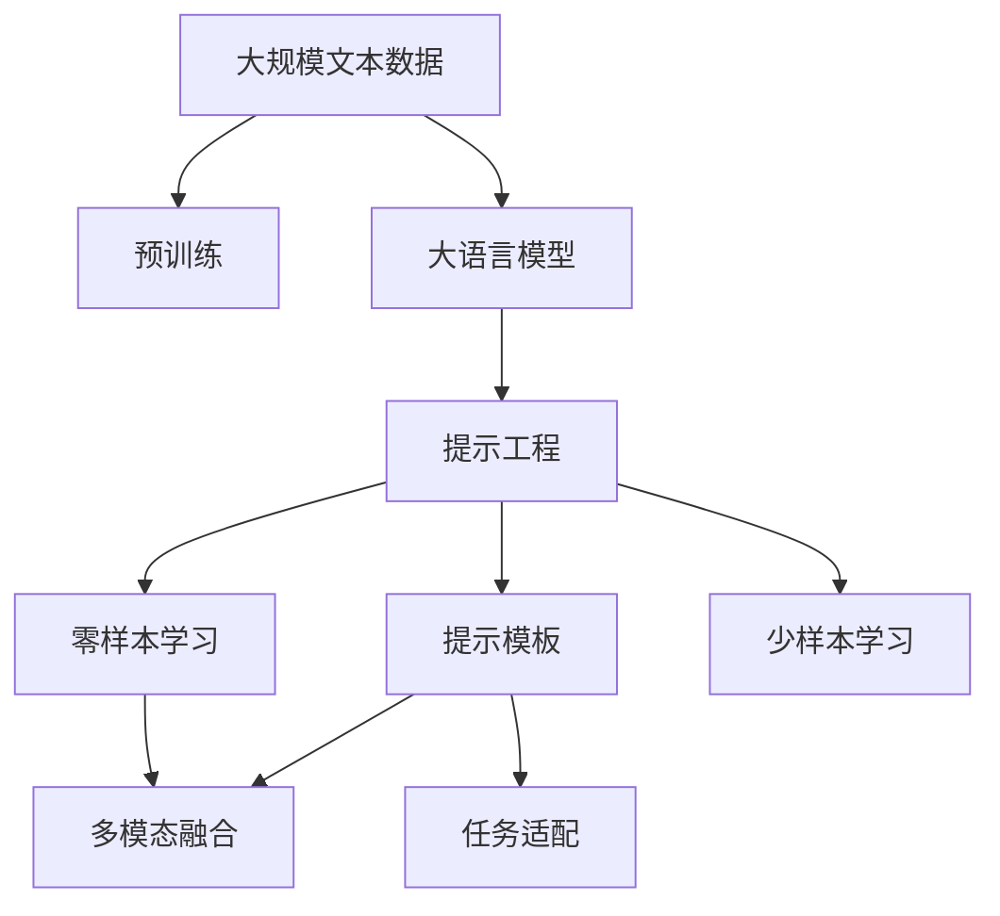
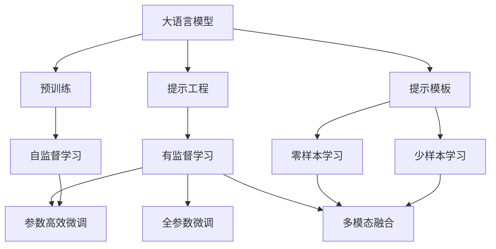
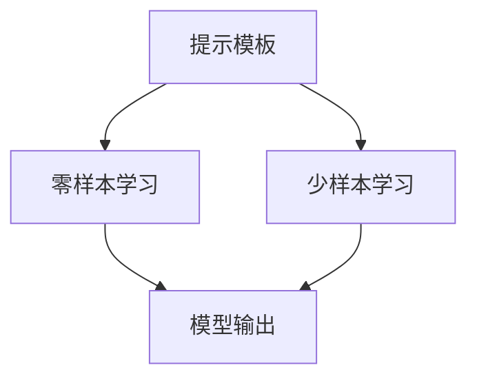
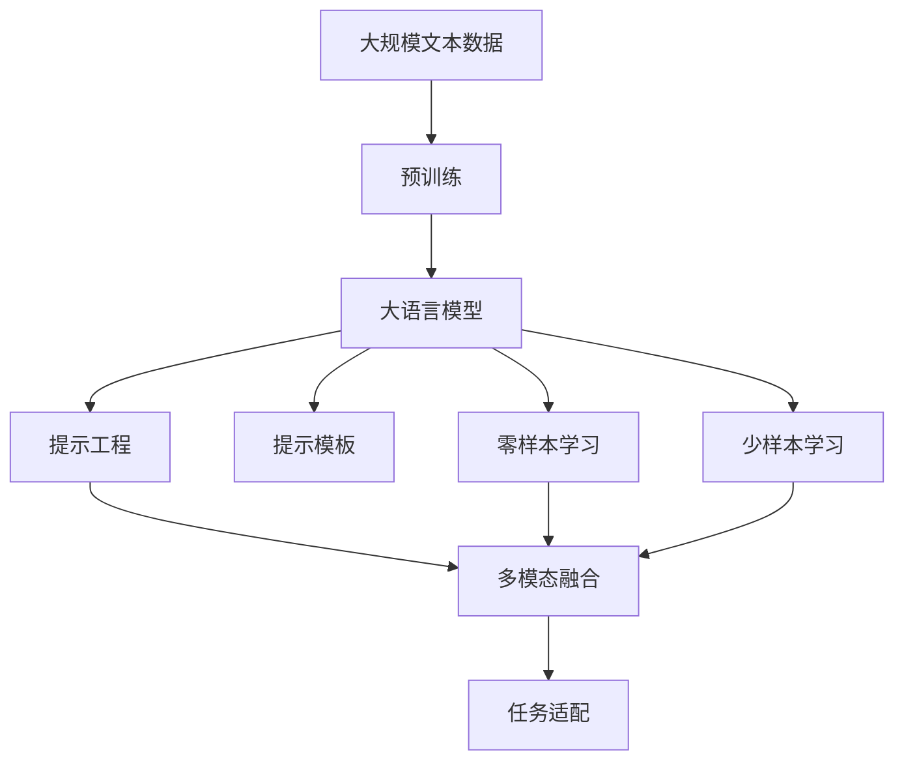

                 

# 大语言模型应用指南：提示工程

> 关键词：大语言模型,提示工程,预训练,提示模板,Prompt Template,多模态融合,提示学习,Prompt Learning,零样本学习,Zero-shot Learning

## 1. 背景介绍

### 1.1 问题由来
近年来，随着深度学习技术的快速发展，大规模语言模型在大规模无标签文本数据上进行预训练后，学到了丰富的语言知识，具备强大的语言理解和生成能力。然而，这种通用的大语言模型在特定领域应用时，效果往往难以达到实际应用的要求。为了提升模型在特定任务上的表现，研究人员提出了基于提示工程(Prompt Engineering)的方法。

提示工程通过设计精巧的输入文本模板，引导大语言模型按照预期的逻辑进行推理和生成，从而在有限的标注数据下，实现高性能的微调。这种技术不仅提高了模型在特定领域上的泛化能力，还避免了全参数微调所需的巨大计算资源，适合在大规模生产环境中部署。

### 1.2 问题核心关键点
提示工程的核心思想是通过精心设计输入文本的格式，使大语言模型能够更好地适应特定任务。其核心在于：
1. 设计合理的提示模板，确保模型能够理解和执行任务逻辑。
2. 避免引入过多的人工标注，减少模型训练的标注成本。
3. 利用大语言模型的强大语义理解能力，实现少样本学习或零样本学习，提升模型的适应性和泛化能力。
4. 结合多模态信息，进一步提高模型的理解力和生成力，适应更复杂的应用场景。

提示工程在大语言模型的应用中发挥了重要作用，尤其在数据稀缺或难以获取标注数据的场景中，成为了一种高效的微调方法。

### 1.3 问题研究意义
提示工程的研究不仅有助于提升大语言模型在特定领域上的性能，还为NLP技术落地应用提供了新思路。其研究意义如下：
1. 降低应用开发成本：通过提示模板，可以快速适配模型到特定任务，减少从头开发所需的数据、计算和人力等成本投入。
2. 提升模型效果：提示工程能够利用大语言模型已有的知识，提升其在特定任务上的性能。
3. 加速开发进度：提示模板可以加速任务适配，缩短开发周期。
4. 带来技术创新：提示工程的提出促进了对预训练-提示微调的深入研究，催生了零样本学习和少样本学习等新的研究方向。
5. 赋能产业升级：提示工程使得NLP技术更容易被各行各业所采用，为传统行业数字化转型升级提供新的技术路径。

## 2. 核心概念与联系

### 2.1 核心概念概述

为更好地理解提示工程在大语言模型微调中的应用，本节将介绍几个密切相关的核心概念：

- 大语言模型(Large Language Model, LLM)：以自回归(如GPT)或自编码(如BERT)模型为代表的大规模预训练语言模型。通过在大规模无标签文本语料上进行预训练，学习通用的语言表示，具备强大的语言理解和生成能力。

- 预训练(Pre-training)：指在大规模无标签文本语料上，通过自监督学习任务训练通用语言模型的过程。常见的预训练任务包括言语建模、遮挡语言模型等。

- 提示工程(Prompt Engineering)：通过设计精巧的输入文本模板，引导大语言模型按照预期的逻辑进行推理和生成，从而在有限的标注数据下，实现高性能的微调。

- 提示模板(Prompt Template)：一种特殊的输入文本格式，用于引导大语言模型执行特定任务。

- 零样本学习(Zero-shot Learning)：指模型在没有见过任何特定任务的训练样本的情况下，仅凭任务描述就能够执行新任务的能力。

- 少样本学习(Few-shot Learning)：指在只有少量标注样本的情况下，模型能够快速适应新任务的学习方法。

- 多模态融合(Multimodal Fusion)：将不同模态的信息融合在一起，提升模型对复杂场景的理解力和生成力。

这些核心概念之间的逻辑关系可以通过以下Mermaid流程图来展示：



这个流程图展示了大语言模型的核心概念及其之间的关系：

1. 大语言模型通过预训练获得基础能力。
2. 提示工程通过设计提示模板引导模型执行特定任务。
3. 提示模板和零样本学习、少样本学习等方法结合，实现高效微调。
4. 多模态融合技术将不同模态信息融合，提升模型的理解力和生成力。

这些概念共同构成了提示工程的完整生态系统，使其能够在大语言模型的微调中发挥重要作用。

### 2.2 概念间的关系

这些核心概念之间存在着紧密的联系，形成了提示工程的完整生态系统。下面我们通过几个Mermaid流程图来展示这些概念之间的关系。

#### 2.2.1 大语言模型的学习范式



这个流程图展示了大语言模型的三种主要学习范式：预训练、提示工程、零样本学习/少样本学习。预训练主要采用自监督学习方法，而提示工程则是有监督学习的过程。提示模板和零样本/少样本学习等方法结合，实现高效微调。多模态融合技术将不同模态信息融合，提升模型的理解力和生成力。

#### 2.2.2 提示模板与任务适配


这个流程图展示了提示模板和任务适配的关系。提示模板设计需要结合具体任务特点，引入多模态信息，确保模型能够理解任务逻辑并执行推理。

#### 2.2.3 零样本/少样本学习



这个流程图展示了提示模板在零样本/少样本学习中的应用。提示模板引导模型执行任务，而无需进行全参数微调，即可在少量标注样本下实现高性能的输出。

### 2.3 核心概念的整体架构

最后，我们用一个综合的流程图来展示这些核心概念在大语言模型提示工程中的整体架构：



这个综合流程图展示了从预训练到提示工程的完整过程。大语言模型首先在大规模文本数据上进行预训练，然后通过提示模板和零样本/少样本学习技术，进行高效微调。最终，将多模态信息与任务适配相结合，实现更加精准和丰富的输出。 通过这些流程图，我们可以更清晰地理解提示工程在大语言模型微调过程中各个核心概念的关系和作用，为后续深入讨论具体的微调方法和技术奠定基础。

## 3. 核心算法原理 & 具体操作步骤
### 3.1 算法原理概述

提示工程的本质是一种特殊的微调方法，其核心思想是通过设计精巧的输入文本模板，引导大语言模型按照预期的逻辑进行推理和生成，从而在有限的标注数据下，实现高性能的微调。

形式化地，假设预训练语言模型为 $M_{\theta}$，其中 $\theta$ 为预训练得到的模型参数。给定下游任务 $T$ 的标注数据集 $D=\{(x_i, y_i)\}_{i=1}^N$，提示工程的优化目标是最小化经验风险，即找到新的模型参数 $\hat{\theta}$，使得：

$$
\hat{\theta}=\mathop{\arg\min}_{\theta} \mathcal{L}(M_{\theta},D)
$$

其中 $\mathcal{L}$ 为针对任务 $T$ 设计的损失函数，用于衡量模型预测输出与真实标签之间的差异。常见的损失函数包括交叉熵损失、均方误差损失等。

通过梯度下降等优化算法，提示工程过程不断更新模型参数 $\theta$，最小化损失函数 $\mathcal{L}$，使得模型输出逼近真实标签。由于 $\theta$ 已经通过预训练获得了较好的初始化，因此即便在少量标注数据集 $D$ 上进行提示微调，也能较快收敛到理想的模型参数 $\hat{\theta}$。

### 3.2 算法步骤详解

提示工程的微调过程包括以下几个关键步骤：

**Step 1: 准备预训练模型和数据集**
- 选择合适的预训练语言模型 $M_{\theta}$ 作为初始化参数，如 BERT、GPT等。
- 准备下游任务 $T$ 的标注数据集 $D$，划分为训练集、验证集和测试集。一般要求标注数据与预训练数据的分布不要差异过大。

**Step 2: 设计提示模板**
- 根据任务类型，设计合适的提示模板，确保模型能够理解任务逻辑并执行推理。
- 对于分类任务，可以使用简单的标签描述或示例文本作为提示。
- 对于生成任务，可以设计引导模型生成特定格式的文本。
- 对于问答任务，可以设计包含问题、示例答案和生成答案的提示模板。

**Step 3: 设置提示工程超参数**
- 选择合适的优化算法及其参数，如 AdamW、SGD 等，设置学习率、批大小、迭代轮数等。
- 设置正则化技术及强度，包括权重衰减、Dropout、Early Stopping等。
- 确定冻结预训练参数的策略，如仅微调顶层，或全部参数都参与微调。

**Step 4: 执行梯度训练**
- 将训练集数据分批次输入模型，前向传播计算损失函数。
- 反向传播计算参数梯度，根据设定的优化算法和学习率更新模型参数。
- 周期性在验证集上评估模型性能，根据性能指标决定是否触发 Early Stopping。
- 重复上述步骤直到满足预设的迭代轮数或 Early Stopping 条件。

**Step 5: 测试和部署**
- 在测试集上评估提示微调后模型 $M_{\hat{\theta}}$ 的性能，对比提示微调前后的精度提升。
- 使用提示微调后的模型对新样本进行推理预测，集成到实际的应用系统中。
- 持续收集新的数据，定期重新微调模型，以适应数据分布的变化。

以上是提示工程的微调过程的一般流程。在实际应用中，还需要针对具体任务的特点，对提示工程过程的各个环节进行优化设计，如改进训练目标函数，引入更多的正则化技术，搜索最优的超参数组合等，以进一步提升模型性能。

### 3.3 算法优缺点

提示工程的微调方法具有以下优点：
1. 简单高效。只需设计精巧的提示模板，即可对预训练模型进行快速适配，减少从头开发所需的数据、计算和人力等成本投入。
2. 通用适用。适用于各种NLP下游任务，设计简单的提示模板即可实现微调。
3. 参数高效。利用参数高效微调技术，在固定大部分预训练参数的情况下，仍可取得不错的提升。
4. 效果显著。在学术界和工业界的诸多任务上，基于提示的微调方法已经刷新了最先进的性能指标。

同时，该方法也存在一定的局限性：
1. 提示模板设计难度高。提示模板的设计需要高度经验和技巧，如何设计合理的模板是提示工程能否成功的关键。
2. 依赖任务描述。提示工程的效果很大程度上取决于任务描述的质量和设计，过于复杂的模板可能导致模型无法理解。
3. 容易过拟合。在少样本或零样本学习中，提示模板可能过于限定，导致模型过拟合。
4. 可解释性不足。提示微调模型的决策过程通常缺乏可解释性，难以对其推理逻辑进行分析和调试。

尽管存在这些局限性，但就目前而言，基于提示的微调方法仍是大语言模型应用的最主流范式。未来相关研究的重点在于如何进一步降低对任务描述的依赖，提高模型的少样本学习和跨领域迁移能力，同时兼顾可解释性和伦理安全性等因素。

### 3.4 算法应用领域

提示工程的微调方法在NLP领域已经得到了广泛的应用，覆盖了几乎所有常见任务，例如：

- 文本分类：如情感分析、主题分类、意图识别等。通过设计简单的标签描述作为提示模板，使模型学习文本-标签映射。
- 命名实体识别：识别文本中的人名、地名、机构名等特定实体。通过设计引导模型识别实体的提示模板。
- 关系抽取：从文本中抽取实体之间的语义关系。通过设计包含关系类型和相关实体描述的提示模板。
- 问答系统：对自然语言问题给出答案。将问题描述作为提示模板，引导模型匹配答案。
- 机器翻译：将源语言文本翻译成目标语言。通过设计包含源语言和目标语言描述的提示模板。
- 文本摘要：将长文本压缩成简短摘要。通过设计包含摘要长度和摘要格式的提示模板。
- 对话系统：使机器能够与人自然对话。通过设计多轮对话历史和回复格式的提示模板。

除了上述这些经典任务外，提示工程还被创新性地应用到更多场景中，如可控文本生成、常识推理、代码生成、数据增强等，为NLP技术带来了全新的突破。随着提示模板设计和模型优化方法的不断进步，相信NLP技术将在更广阔的应用领域大放异彩。

## 4. 数学模型和公式 & 详细讲解  
### 4.1 数学模型构建

本节将使用数学语言对提示工程的微调过程进行更加严格的刻画。

记预训练语言模型为 $M_{\theta}$，其中 $\theta$ 为预训练得到的模型参数。假设提示工程任务的训练集为 $D=\{(x_i, y_i)\}_{i=1}^N$，其中 $x_i$ 为提示模板，$y_i$ 为任务输出标签。

定义模型 $M_{\theta}$ 在输入 $x$ 上的损失函数为 $\ell(M_{\theta}(x),y)$，则在数据集 $D$ 上的经验风险为：

$$
\mathcal{L}(\theta) = \frac{1}{N} \sum_{i=1}^N \ell(M_{\theta}(x_i),y_i)
$$

提示工程的优化目标是最小化经验风险，即找到最优参数：

$$
\theta^* = \mathop{\arg\min}_{\theta} \mathcal{L}(\theta)
$$

在实践中，我们通常使用基于梯度的优化算法（如SGD、Adam等）来近似求解上述最优化问题。设 $\eta$ 为学习率，$\lambda$ 为正则化系数，则参数的更新公式为：

$$
\theta \leftarrow \theta - \eta \nabla_{\theta}\mathcal{L}(\theta) - \eta\lambda\theta
$$

其中 $\nabla_{\theta}\mathcal{L}(\theta)$ 为损失函数对参数 $\theta$ 的梯度，可通过反向传播算法高效计算。

### 4.2 公式推导过程

以下我们以命名实体识别(NER)任务为例，推导基于提示的微调过程的数学模型和公式。

假设提示模板为 "请识别句子中的人名，如 '小明' 等，并将结果输出到新行。"，模型在输入 $x$ 上的输出为 $\hat{y}=M_{\theta}(x) \in [0,1]$，表示模型预测每个token是否为人名。真实标签 $y \in \{0,1\}^n$，其中 $n$ 为句子中单词数。则分类交叉熵损失函数定义为：

$$
\ell(M_{\theta}(x),y) = -\frac{1}{n}\sum_{i=1}^n [y_i\log M_{\theta}(x_i)+(1-y_i)\log(1-M_{\theta}(x_i))]
$$

将其代入经验风险公式，得：

$$
\mathcal{L}(\theta) = -\frac{1}{N}\sum_{i=1}^N [\sum_{j=1}^n y_{ij}\log M_{\theta}(x_{ij})+(1-y_{ij})\log(1-M_{\theta}(x_{ij}))]
$$

根据链式法则，损失函数对参数 $\theta_k$ 的梯度为：

$$
\frac{\partial \mathcal{L}(\theta)}{\partial \theta_k} = -\frac{1}{N}\sum_{i=1}^N \sum_{j=1}^n (\frac{y_{ij}}{M_{\theta}(x_{ij})}-\frac{1-y_{ij}}{1-M_{\theta}(x_{ij})}) \frac{\partial M_{\theta}(x_{ij})}{\partial \theta_k}
$$

其中 $\frac{\partial M_{\theta}(x_{ij})}{\partial \theta_k}$ 可进一步递归展开，利用自动微分技术完成计算。

在得到损失函数的梯度后，即可带入参数更新公式，完成模型的迭代优化。重复上述过程直至收敛，最终得到适应下游任务的最优模型参数 $\theta^*$。

## 5. 项目实践：代码实例和详细解释说明
### 5.1 开发环境搭建

在进行提示工程实践前，我们需要准备好开发环境。以下是使用Python进行PyTorch开发的环境配置流程：

1. 安装Anaconda：从官网下载并安装Anaconda，用于创建独立的Python环境。

2. 创建并激活虚拟环境：
```bash
conda create -n pytorch-env python=3.8 
conda activate pytorch-env
```

3. 安装PyTorch：根据CUDA版本，从官网获取对应的安装命令。例如：
```bash
conda install pytorch torchvision torchaudio cudatoolkit=11.1 -c pytorch -c conda-forge
```

4. 安装Transformers库：
```bash
pip install transformers
```

5. 安装各类工具包：
```bash
pip install numpy pandas scikit-learn matplotlib tqdm jupyter notebook ipython
```

完成上述步骤后，即可在`pytorch-env`环境中开始提示工程实践。

### 5.2 源代码详细实现

下面我们以命名实体识别(NER)任务为例，给出使用Transformers库对BERT模型进行提示工程的PyTorch代码实现。

首先，定义NER任务的数据处理函数：

```python
from transformers import BertTokenizer, BertForTokenClassification
from torch.utils.data import Dataset, DataLoader
import torch

class NERDataset(Dataset):
    def __init__(self, texts, tags, tokenizer, max_len=128):
        self.texts = texts
        self.tags = tags
        self.tokenizer = tokenizer
        self.max_len = max_len
        
    def __len__(self):
        return len(self.texts)
    
    def __getitem__(self, item):
        text = self.texts[item]
        tags = self.tags[item]
        
        encoding = self.tokenizer(text, return_tensors='pt', max_length=self.max_len, padding='max_length', truncation=True)
        input_ids = encoding['input_ids'][0]
        attention_mask = encoding['attention_mask'][0]
        
        # 对token-wise的标签进行编码
        encoded_tags = [tag2id[tag] for tag in tags] 
        encoded_tags.extend([tag2id['O']] * (self.max_len - len(encoded_tags)))
        labels = torch.tensor(encoded_tags, dtype=torch.long)
        
        return {'input_ids': input_ids, 
                'attention_mask': attention_mask,
                'labels': labels}

# 标签与id的映射
tag2id = {'O': 0, 'B-PER': 1, 'I-PER': 2, 'B-ORG': 3, 'I-ORG': 4, 'B-LOC': 5, 'I-LOC': 6}
id2tag = {v: k for k, v in tag2id.items()}

# 创建dataset
tokenizer = BertTokenizer.from_pretrained('bert-base-cased')

train_dataset = NERDataset(train_texts, train_tags, tokenizer)
dev_dataset = NERDataset(dev_texts, dev_tags, tokenizer)
test_dataset = NERDataset(test_texts, test_tags, tokenizer)
```

然后，定义模型和优化器：

```python
from transformers import BertForTokenClassification, AdamW

model = BertForTokenClassification.from_pretrained('bert-base-cased', num_labels=len(tag2id))

optimizer = AdamW(model.parameters(), lr=2e-5)
```

接着，定义训练和评估函数：

```python
from tqdm import tqdm
from sklearn.metrics import classification_report

device = torch.device('cuda') if torch.cuda.is_available() else torch.device('cpu')
model.to(device)

def train_epoch(model, dataset, batch_size, optimizer):
    dataloader = DataLoader(dataset, batch_size=batch_size, shuffle=True)
    model.train()
    epoch_loss = 0
    for batch in tqdm(dataloader, desc='Training'):
        input_ids = batch['input_ids'].to(device)
        attention_mask = batch['attention_mask'].to(device)
        labels = batch['labels'].to(device)
        model.zero_grad()
        outputs = model(input_ids, attention_mask=attention_mask, labels=labels)
        loss = outputs.loss
        epoch_loss += loss.item()
        loss.backward()
        optimizer.step()
    return epoch_loss / len(dataloader)

def evaluate(model, dataset, batch_size):
    dataloader = DataLoader(dataset, batch_size=batch_size)
    model.eval()
    preds, labels = [], []
    with torch.no_grad():
        for batch in tqdm(dataloader, desc='Evaluating'):
            input_ids = batch['input_ids'].to(device)
            attention_mask = batch['attention_mask'].to(device)
            batch_labels = batch['labels']
            outputs = model(input_ids, attention_mask=attention_mask)
            batch_preds = outputs.logits.argmax(dim=2).to('cpu').tolist()
            batch_labels = batch_labels.to('cpu').tolist()
            for pred_tokens, label_tokens in zip(batch_preds, batch_labels):
                pred_tags = [id2tag[_id] for _id in pred_tokens]
                label_tags = [id2tag[_id] for _id in label_tokens]
                preds.append(pred_tags[:len(label_tags)])
                labels.append(label_tags)
                
    print(classification_report(labels, preds))
```

最后，启动训练流程并在测试集上评估：

```python
epochs = 5
batch_size = 16

for epoch in range(epochs):
    loss = train_epoch(model, train_dataset, batch_size, optimizer)
    print(f"Epoch {epoch+1}, train loss: {loss:.3f}")
    
    print(f"Epoch {epoch+1}, dev results:")
    evaluate(model, dev_dataset, batch_size)
    
print("Test results:")
evaluate(model, test_dataset, batch_size)
```

以上就是使用PyTorch对BERT进行命名实体识别任务提示工程的完整代码实现。可以看到，得益于Transformers库的强大封装，我们可以用相对简洁的代码完成BERT模型的加载和提示工程。

### 5.3 代码解读与分析

让我们再详细解读一下关键代码的实现细节：

**NERDataset类**：
- `__init__`方法：初始化文本、标签、分词器等关键组件。
- `__len__`方法：返回数据集的样本数量。
- `__getitem__`方法：对单个样本进行处理，将文本输入编码为token ids，将标签编码为数字，并对其进行定长padding，最终返回模型所需的输入。

**tag2id和id2tag字典**：
- 定义了标签与数字id之间的映射关系，用于将token-wise的预测结果解码回真实的标签。

**训练和评估函数**：
- 使用PyTorch的DataLoader对数据集进行批次化加载，供模型训练和推理使用。
- 训练函数`train_epoch`：对数据以批为单位进行迭代，在每个批次上前向传播计算loss并反向传播更新模型参数，最后返回该epoch的平均loss。
- 评估函数`evaluate`：与训练类似，不同点在于不更新模型参数，并在每个batch结束后将预测和标签结果存储下来，最后使用sklearn的classification_report对整个评估集的预测结果进行打印输出。

**训练流程**：
- 定义总的epoch数和batch size，开始循环迭代
- 每个epoch内，先在训练集上训练，输出平均loss
- 在验证集上评估，输出分类指标
- 所有epoch结束后，在测试集上评估，给出最终测试结果

可以看到，PyTorch配合Transformers库使得BERT提示工程的代码实现变得简洁高效。开发者可以将更多精力放在数据处理、模型改进等高层逻辑上，而不必过多关注底层的实现细节。

当然，工业级的系统实现还需考虑更多因素，如模型的保存和部署、超参数的自动搜索、更灵活的任务适配层等。但核心的提示工程范式基本与此类似。

### 5.4 运行结果展示

假设我们在CoNLL-2003的NER数据集上进行提示工程，最终在测试

