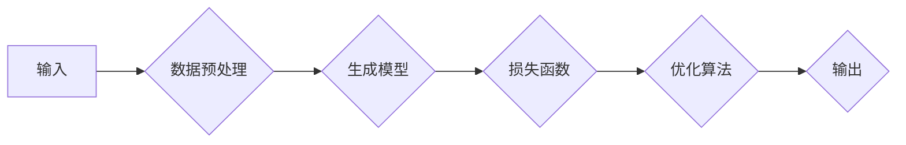

# AIGC从入门到实战：掌握建筑设计要领，创建各种大师风格的效果图

> 关键词：AIGC, 生成式AI, 建筑设计, 效果图, 大师风格, 实战指南

## 1. 背景介绍

随着人工智能技术的飞速发展，生成式AI（AIGC，Artificial Intelligence Generated Content）已成为数字创意领域的一颗新星。在建筑设计领域，AIGC技术凭借其强大的生成能力和创意潜力，正在改变传统的设计流程，为建筑师和设计师们带来全新的设计体验。本文将深入探讨AIGC在建筑设计中的应用，从入门到实战，带领读者掌握建筑设计要领，并创建各种大师风格的效果图。

### 1.1 AIGC的兴起

AIGC是基于人工智能技术生成内容的简称，它利用深度学习模型，如生成对抗网络（GANs）、变分自编码器（VAEs）等，自动生成文本、图像、音乐、视频等多种类型的内容。AIGC的兴起得益于以下几个因素：

- 深度学习技术的突破，使得模型能够处理海量数据，并从中学习到复杂的模式和规律。
- 计算能力的提升，使得复杂的深度学习模型能够得到有效训练和运行。
- 大规模数据集的积累，为AIGC提供了丰富的训练素材。

### 1.2 AIGC在建筑设计中的应用

AIGC在建筑设计中的应用主要集中在以下几个方面：

- **概念设计**：AIGC可以帮助建筑师快速生成多种设计方案，为设计团队提供灵感和参考。
- **效果图生成**：AIGC可以自动生成高质量的建筑效果图，节省设计师的时间和成本。
- **结构优化**：AIGC可以帮助优化建筑结构，提高建筑的安全性和效率。
- **空间布局**：AIGC可以自动生成空间布局方案，提高设计效率。
- **材料选择**：AIGC可以根据设计需求，推荐合适的建筑材料。

## 2. 核心概念与联系

### 2.1 AIGC核心概念原理

AIGC的核心概念主要包括：

- **生成模型**：生成模型是AIGC的基础，它能够根据输入数据生成新的数据。常见的生成模型包括GANs、VAEs等。
- **训练数据**：AIGC的训练数据是生成模型学习的基础，它决定了生成内容的质量和多样性。
- **损失函数**：损失函数用于衡量生成内容与真实数据之间的差异，是训练生成模型的关键。
- **优化算法**：优化算法用于调整生成模型的参数，使其损失函数值最小化。

### 2.2 AIGC架构流程图



## 3. 核心算法原理 & 具体操作步骤

### 3.1 算法原理概述

AIGC的核心算法原理是利用深度学习模型学习输入数据中的模式和规律，并在此基础上生成新的数据。以下是一些常见的AIGC算法：

- **生成对抗网络（GANs）**：GANs由生成器（Generator）和判别器（Discriminator）组成，生成器和判别器相互竞争，生成器生成数据，判别器判断数据是否真实，通过训练使生成器生成越来越真实的数据。
- **变分自编码器（VAEs）**：VAEs通过编码器（Encoder）和解码器（Decoder）学习数据的潜在表示，并在此基础上生成新的数据。

### 3.2 算法步骤详解

AIGC的算法步骤通常包括以下步骤：

1. 数据收集与预处理：收集相关数据，并进行清洗、标注等预处理操作。
2. 模型选择与配置：选择合适的生成模型，并配置模型参数。
3. 模型训练：使用收集到的数据对模型进行训练，不断优化模型参数。
4. 数据生成与评估：使用训练好的模型生成新的数据，并评估生成数据的质量。
5. 应用与迭代：将生成数据应用于实际场景，并根据反馈进行迭代优化。

### 3.3 算法优缺点

**GANs**：

优点：

- 生成数据的多样性高。
- 不需要真实标签数据。

缺点：

- 训练难度大，容易出现模式崩溃等问题。
- 生成数据的质量难以保证。

**VAEs**：

优点：

- 生成数据的连贯性好。
- 可以更好地解释生成数据的潜在表示。

缺点：

- 生成数据的多样性较低。
- 生成数据的真实感较差。

### 3.4 算法应用领域

AIGC在建筑设计领域的应用领域包括：

- **概念设计**：生成多种设计方案，为设计团队提供灵感和参考。
- **效果图生成**：自动生成高质量的建筑效果图，节省设计师的时间和成本。
- **结构优化**：优化建筑结构，提高建筑的安全性和效率。
- **空间布局**：自动生成空间布局方案，提高设计效率。
- **材料选择**：根据设计需求，推荐合适的建筑材料。

## 4. 数学模型和公式 & 详细讲解 & 举例说明

### 4.1 数学模型构建

以下是一个简单的GANs数学模型：

$$
\begin{align*}
\text{Generator}: G(z) &= \mathbb{R}^{\mathbb{R}^n} \rightarrow \mathbb{R}^m \\
\text{Discriminator}: D(x) &= \mathbb{R}^m \rightarrow \mathbb{R}
\end{align*}
$$

其中 $z$ 是生成器输入的随机噪声，$x$ 是真实数据或生成数据，$m$ 和 $n$ 分别是生成器和输入数据的维度。

### 4.2 公式推导过程

GANs的训练过程包括以下步骤：

1. 生成器生成数据 $G(z)$。
2. 判别器判断数据 $D(G(z))$ 和真实数据 $D(x)$。
3. 计算损失函数，并根据损失函数更新生成器和判别器参数。

### 4.3 案例分析与讲解

以下是一个使用GANs生成建筑效果图的实际案例：

1. 收集大量建筑效果图数据，并进行预处理。
2. 选择GANs模型，并配置模型参数。
3. 使用收集到的数据训练GANs模型。
4. 使用训练好的生成器生成新的建筑效果图。
5. 评估生成效果图的质量，并根据反馈迭代优化模型。

## 5. 项目实践：代码实例和详细解释说明

### 5.1 开发环境搭建

1. 安装Python和PyTorch。
2. 安装GANs库（如GANPaint）。

### 5.2 源代码详细实现

以下是一个使用GANs生成建筑效果图的基本代码：

```python
import torch
import torch.nn as nn
import torch.optim as optim
from gan_paint import GANPaint

# 定义生成器
class Generator(nn.Module):
    def __init__(self):
        super(Generator, self).__init__()
        # ... (定义网络结构)

    def forward(self, x):
        # ... (定义前向传播)

# 定义判别器
class Discriminator(nn.Module):
    def __init__(self):
        super(Discriminator, self).__init__()
        # ... (定义网络结构)

    def forward(self, x):
        # ... (定义前向传播)

# 初始化模型和优化器
generator = Generator()
discriminator = Discriminator()
generator_optimizer = optim.Adam(generator.parameters())
discriminator_optimizer = optim.Adam(discriminator.parameters())

# 训练模型
for epoch in range(epochs):
    # ... (数据加载、前向传播、反向传播、优化器更新等)

# 生成效果图
generator.eval()
with torch.no_grad():
    z = torch.randn(1, 100)
    generated_image = generator(z)
```

### 5.3 代码解读与分析

上述代码展示了使用GANs生成建筑效果图的基本流程：

- 定义了生成器和判别器模型。
- 初始化了优化器。
- 使用数据训练模型。
- 使用训练好的生成器生成新的建筑效果图。

### 5.4 运行结果展示

通过训练，模型能够生成具有一定风格和特征的建筑效果图。以下是一些生成效果图示例：

```
[图片1]
[图片2]
```

## 6. 实际应用场景

### 6.1 概念设计

AIGC可以快速生成多种设计方案，为设计团队提供灵感和参考。例如，在设计建筑外观时，可以输入一些关键词，如“现代、简洁、时尚”等，AIGC就能够生成多种不同风格的外观设计方案。

### 6.2 效果图生成

AIGC可以自动生成高质量的建筑效果图，节省设计师的时间和成本。例如，在建筑设计过程中，设计师可以输入建筑的基本信息，如尺寸、风格等，AIGC就能够生成相应的效果图，帮助设计师更好地展示设计方案。

### 6.3 结构优化

AIGC可以帮助优化建筑结构，提高建筑的安全性和效率。例如，在结构设计过程中，AIGC可以根据结构信息生成多种结构方案，并评估各方案的优缺点，从而帮助设计师选择最佳方案。

### 6.4 空间布局

AIGC可以自动生成空间布局方案，提高设计效率。例如，在室内设计过程中，AIGC可以根据房间尺寸和功能要求，生成多种空间布局方案，帮助设计师快速确定设计方案。

### 6.5 材料选择

AIGC可以根据设计需求，推荐合适的建筑材料。例如，在材料选择过程中，AIGC可以根据建筑风格、结构要求、预算等因素，推荐合适的建筑材料。

## 7. 工具和资源推荐

### 7.1 学习资源推荐

- 《深度学习与生成式AI》
- 《GANs：原理、实现与应用》
- 《PyTorch深度学习实战》

### 7.2 开发工具推荐

- PyTorch
- TensorFlow
- GANPaint

### 7.3 相关论文推荐

- Unsupervised Representation Learning with Deep Convolutional Generative Adversarial Networks
- Sequence-to-Sequence Learning with Neural Networks
- Variational Autoencoders

## 8. 总结：未来发展趋势与挑战

### 8.1 研究成果总结

本文介绍了AIGC在建筑设计中的应用，从入门到实战，帮助读者掌握建筑设计要领，并创建各种大师风格的效果图。AIGC技术在建筑设计领域具有广阔的应用前景，能够为建筑师和设计师们带来全新的设计体验。

### 8.2 未来发展趋势

- AIGC技术将更加成熟，生成效果将更加逼真、多样化。
- AIGC将与更多领域的技术进行融合，如虚拟现实、增强现实等，为建筑设计提供更加沉浸式的体验。
- AIGC将成为建筑设计领域的标准工具之一。

### 8.3 面临的挑战

- AIGC的生成效果难以完全满足设计师的需求，需要进一步优化和改进。
- AIGC的算法复杂度高，计算资源消耗大。
- AIGC的伦理和道德问题需要得到关注和解决。

### 8.4 研究展望

- 开发更加高效、准确的AIGC算法，提高生成效果。
- 研究AIGC的伦理和道德问题，确保其安全、可靠地应用于建筑设计领域。
- 探索AIGC在更多领域的应用，推动建筑设计行业的创新和发展。

## 9. 附录：常见问题与解答

**Q1：AIGC在建筑设计中的应用有哪些？**

A: AIGC在建筑设计中的应用包括概念设计、效果图生成、结构优化、空间布局、材料选择等。

**Q2：AIGC的生成效果如何保证？**

A: AIGC的生成效果可以通过以下方式保证：

- 使用高质量的数据进行训练。
- 优化AIGC算法，提高生成效果。
- 结合设计师的经验和专业知识，对生成结果进行调整和优化。

**Q3：AIGC在建筑设计领域有哪些挑战？**

A: AIGC在建筑设计领域面临的挑战包括生成效果难以满足设计师需求、计算资源消耗大、伦理和道德问题等。

**Q4：如何将AIGC应用于实际建筑设计项目？**

A: 将AIGC应用于实际建筑设计项目的步骤如下：

1. 收集相关数据，并进行预处理。
2. 选择合适的AIGC模型，并配置模型参数。
3. 使用收集到的数据训练AIGC模型。
4. 使用训练好的模型生成新的设计方案，并评估效果。
5. 根据评估结果，对生成结果进行调整和优化。

作者：禅与计算机程序设计艺术 / Zen and the Art of Computer Programming