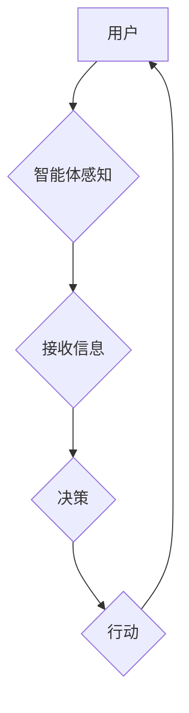

> 人工智能, 智能体, 零售业, 购物助手, 客户体验, 个性化推荐, 供应链优化, 自动化决策

# AI人工智能 Agent：零售业中智能体的应用

在数字化的浪潮中，零售业正经历着前所未有的变革。人工智能（AI）技术的飞速发展，为零售业带来了新的机遇和挑战。智能体（Agent）作为AI的一种形式，通过模拟人类决策过程，在零售业中扮演着越来越重要的角色。本文将深入探讨智能体在零售业中的应用，分析其原理、实践案例和发展趋势。

## 1. 背景介绍

### 1.1 零售业变革

随着互联网的普及和电子商务的兴起，传统零售业面临着巨大的冲击。为了适应市场的变化，零售业正朝着数字化转型方向发展。数字化转型不仅包括线上购物平台的搭建，还包括线下门店的智能化升级。

### 1.2 人工智能与零售业

人工智能技术为零售业带来了新的解决方案，如智能客服、个性化推荐、智能物流等。智能体作为人工智能的一种，通过模拟人类决策过程，能够帮助零售企业实现自动化、智能化运营。

## 2. 核心概念与联系

### 2.1 智能体的定义

智能体（Agent）是一种能够感知环境、接收信息、做出决策并采取行动的实体。在人工智能领域，智能体可以是一个软件程序、一个机器人，甚至是人类。

### 2.2 智能体与零售业的联系

在零售业中，智能体可以应用于以下几个方面：

- **客户服务**：提供智能客服，解答客户疑问，提升客户体验。
- **个性化推荐**：根据客户喜好和行为，推荐个性化的商品和服务。
- **供应链优化**：优化库存管理、物流配送等环节，降低运营成本。
- **自动化决策**：自动处理日常运营中的决策，提高运营效率。

### 2.3 智能体架构的 Mermaid 流程图



## 3. 核心算法原理 & 具体操作步骤

### 3.1 算法原理概述

智能体的核心是算法，主要包括以下几个部分：

- **感知算法**：智能体通过传感器或数据接口接收外部信息。
- **决策算法**：根据感知到的信息，智能体进行决策。
- **行动算法**：智能体根据决策结果采取行动。

### 3.2 算法步骤详解

智能体算法的具体步骤如下：

1. **感知**：智能体通过传感器或数据接口接收外部信息。
2. **处理**：智能体对感知到的信息进行处理和分析。
3. **决策**：根据处理后的信息，智能体进行决策。
4. **行动**：智能体根据决策结果采取行动。
5. **反馈**：智能体根据行动结果进行自我评估和调整。

### 3.3 算法优缺点

智能体算法的优点：

- **自动化**：能够自动化执行任务，提高工作效率。
- **智能化**：能够根据环境变化做出智能决策。
- **个性化**：能够根据用户需求提供个性化服务。

智能体算法的缺点：

- **成本高**：开发和维护智能体算法需要投入大量人力和物力。
- **数据依赖**：智能体算法需要大量的数据支持。
- **技术门槛**：需要具备一定的AI技术知识才能开发和维护智能体算法。

### 3.4 算法应用领域

智能体算法在零售业中的应用领域包括：

- **客户服务**：智能客服、聊天机器人、智能导购等。
- **个性化推荐**：基于用户行为的个性化推荐系统。
- **供应链优化**：库存管理、物流配送、需求预测等。
- **自动化决策**：自动化的价格调整、促销活动管理等。

## 4. 数学模型和公式 & 详细讲解 & 举例说明

### 4.1 数学模型构建

智能体算法的数学模型主要包括：

- **马尔可夫决策过程（MDP）**：用于描述智能体在不确定环境中做出决策的过程。
- **强化学习（RL）**：通过奖励信号来指导智能体学习最优策略。

### 4.2 公式推导过程

以下是一个简单的MDP模型示例：

$$
V^*(s) = \max_{a} \sum_{s'} P(s'|s,a) \times [R(s,a,s') + \gamma V^*(s')]
$$

其中，$V^*(s)$ 表示状态 $s$ 的最优价值函数，$a$ 表示动作，$s'$ 表示下一个状态，$R(s,a,s')$ 表示状态 $s$ 下采取动作 $a$ 得到的即时奖励，$\gamma$ 表示折扣因子。

### 4.3 案例分析与讲解

以智能客服为例，我们可以将智能客服系统视为一个MDP模型。智能客服接收用户的问题作为状态，根据问题内容生成回复作为动作，用户的反馈作为奖励信号。通过训练，智能客服能够学习到最优的回复策略，提高服务质量。

## 5. 项目实践：代码实例和详细解释说明

### 5.1 开发环境搭建

为了实现智能体在零售业中的应用，我们需要搭建以下开发环境：

- **编程语言**：Python
- **库**：TensorFlow、Keras、Scikit-learn等
- **工具**：Jupyter Notebook、TensorBoard等

### 5.2 源代码详细实现

以下是一个简单的智能客服代码实例：

```python
# 导入必要的库
import tensorflow as tf
from tensorflow.keras.layers import Input, Dense, Embedding, LSTM
from tensorflow.keras.models import Model

# 定义模型
input_ids = Input(shape=(None,), dtype='int32')
embedding = Embedding(vocab_size, embedding_dim)(input_ids)
lstm = LSTM(128)(embedding)
output = Dense(num_classes, activation='softmax')(lstm)
model = Model(inputs=input_ids, outputs=output)

# 编译模型
model.compile(optimizer='adam', loss='categorical_crossentropy', metrics=['accuracy'])

# 训练模型
model.fit(input_data, labels, epochs=5, batch_size=32, validation_split=0.2)

# 预测
predictions = model.predict(input_data)

# 生成回复
def generate_response(text):
    # ...（此处实现根据输入文本生成回复的逻辑）
    return response

# 生成回复示例
response = generate_response("我想购买一部手机")
print(response)
```

### 5.3 代码解读与分析

以上代码展示了如何使用TensorFlow和Keras构建一个简单的智能客服模型。首先，我们定义了一个输入层、一个嵌入层和一个LSTM层，用于处理文本数据。然后，我们定义了一个输出层，用于生成回复。最后，我们编译模型、训练模型，并使用模型生成回复。

### 5.4 运行结果展示

假设我们有一个包含问题和标签的数据集，通过训练模型，我们可以在新的问题上进行预测，并生成相应的回复。

## 6. 实际应用场景

### 6.1 个性化推荐

智能体可以根据用户的购物历史、浏览记录等数据，为用户推荐个性化的商品和服务。例如，电商平台可以利用智能体技术，根据用户的浏览和购买行为，推荐相似的商品，提高用户的购物体验。

### 6.2 供应链优化

智能体可以用于优化供应链管理，例如，通过预测销量、优化库存、优化物流等，降低运营成本，提高供应链效率。

### 6.3 自动化决策

智能体可以用于自动化处理日常运营中的决策，例如，自动调整价格、自动处理促销活动等，提高运营效率。

## 7. 工具和资源推荐

### 7.1 学习资源推荐

- 《深度学习》（Goodfellow, Bengio, Courville）
- 《机器学习》（Tom Mitchell）
- 《人工智能：一种现代的方法》（Stuart Russell, Peter Norvig）

### 7.2 开发工具推荐

- TensorFlow
- Keras
- Scikit-learn
- Jupyter Notebook

### 7.3 相关论文推荐

- "A Few Useful Things to Know about Machine Learning" (Pedregosa et al., 2011)
- "Deep Learning for Natural Language Processing" (Duchi et al., 2014)
- "Reinforcement Learning: An Introduction" (Sutton and Barto, 2018)

## 8. 总结：未来发展趋势与挑战

### 8.1 研究成果总结

智能体技术在零售业中的应用取得了显著成果，为零售业的数字化转型提供了新的动力。未来，智能体技术将继续在零售业中发挥重要作用。

### 8.2 未来发展趋势

- **更强大的智能体**：智能体将具备更强大的学习能力、决策能力和适应性。
- **多模态智能体**：智能体将能够处理文本、图像、音频等多种模态的信息。
- **更加个性化**：智能体将能够根据用户的需求和行为，提供更加个性化的服务。

### 8.3 面临的挑战

- **数据隐私和安全**：如何保护用户数据的安全和隐私是一个重要挑战。
- **技术复杂性**：智能体技术的开发和应用需要较高的技术门槛。
- **伦理和社会影响**：智能体技术的应用可能带来伦理和社会影响，需要引起重视。

### 8.4 研究展望

未来，智能体技术在零售业中的应用将更加广泛，为零售业的数字化转型提供更多可能性。同时，随着技术的不断进步，智能体技术将更加成熟，为零售业带来更大的价值。

## 9. 附录：常见问题与解答

**Q1：智能体技术在零售业中的应用有哪些具体案例？**

A1：智能体技术在零售业中的应用案例包括智能客服、个性化推荐、供应链优化、自动化决策等。

**Q2：智能体技术有哪些优势和局限性？**

A2：智能体技术的优势包括自动化、智能化、个性化等，局限性包括成本高、数据依赖、技术门槛等。

**Q3：如何开发智能体技术？**

A3：开发智能体技术需要掌握编程语言、机器学习框架、相关算法等知识。

**Q4：智能体技术对零售业有哪些影响？**

A4：智能体技术可以提高零售业的效率、降低成本、提升客户体验等。

作者：禅与计算机程序设计艺术 / Zen and the Art of Computer Programming