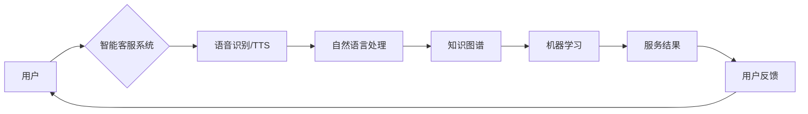

# AI在智能客服中的应用:提升用户满意度

> 关键词：人工智能，智能客服，自然语言处理，机器学习，用户满意度，客服效率，个性化服务

## 1. 背景介绍

随着互联网技术的飞速发展，在线客服已经成为企业与客户沟通的重要渠道。传统的智能客服系统多依赖于规则引擎和简单的关键词匹配，难以应对复杂多变的用户需求，导致客服效率低下，用户体验不佳。近年来，人工智能技术的快速发展为智能客服带来了新的机遇，通过引入自然语言处理、机器学习等技术，智能客服可以实现更智能、更人性化的服务，从而提升用户满意度。

### 1.1 问题的由来

传统的智能客服系统存在以下问题：

- **交互方式单一**：主要依赖文字或语音交互，缺乏灵活性。
- **理解能力有限**：难以理解用户意图和情感，导致回复不准确。
- **知识库更新缓慢**：知识库内容有限，难以满足用户多样化需求。
- **个性化服务不足**：难以根据用户特点提供定制化服务。
- **成本高昂**：需要大量人力维护和更新。

### 1.2 研究现状

为了解决传统智能客服的不足，业界积极探索人工智能在智能客服领域的应用。目前，以下技术已经在智能客服中得到广泛应用：

- **自然语言处理（NLP）**：通过文本分析、语义理解等技术，使智能客服能够理解用户意图和情感。
- **机器学习（ML）**：通过机器学习算法，使智能客服能够不断学习和优化，提升服务能力。
- **知识图谱**：通过知识图谱构建，使智能客服能够提供更加精准的信息和解答。
- **语音识别与合成（ASR/TTS）**：通过语音识别和语音合成技术，实现语音交互的智能客服。

### 1.3 研究意义

研究AI在智能客服中的应用，对于提升用户满意度、降低客服成本、提高企业竞争力具有重要意义：

- **提升用户满意度**：通过智能客服提供高效、准确、个性化的服务，提升用户体验。
- **降低客服成本**：减少人工客服工作量，降低企业运营成本。
- **提高企业竞争力**：提升客户服务质量，增强企业市场竞争力。

### 1.4 本文结构

本文将从以下方面介绍AI在智能客服中的应用：

- 核心概念与联系
- 核心算法原理与操作步骤
- 数学模型与公式
- 项目实践
- 实际应用场景
- 工具和资源推荐
- 未来发展趋势与挑战

## 2. 核心概念与联系

### 2.1 核心概念

以下是AI在智能客服中涉及的核心概念：

- **自然语言处理（NLP）**：研究计算机处理和理解自然语言的方法和理论。
- **机器学习（ML）**：研究让计算机从数据中学习规律和模式的方法。
- **知识图谱**：一种结构化知识库，以图的形式表示实体及其关系。
- **语音识别与合成（ASR/TTS）**：将语音信号转换为文本，或将文本转换为语音的技术。

### 2.2 核心概念原理和架构的 Mermaid 流程图



### 2.3 核心概念联系

如图所示，用户通过智能客服系统进行交互，系统通过语音识别/TTS实现语音交互，自然语言处理技术帮助系统理解用户意图，知识图谱提供相关知识和信息，机器学习算法使系统不断学习和优化，最终输出服务结果。用户对服务结果进行反馈，反馈信息用于进一步优化系统。

## 3. 核心算法原理 & 具体操作步骤

### 3.1 算法原理概述

AI在智能客服中的应用主要包括以下几个环节：

- **语音识别/语音合成**：将用户的语音转换为文本，或将文本转换为语音。
- **自然语言理解**：通过NLP技术理解用户的意图和情感。
- **知识图谱查询**：根据用户意图查询知识图谱，获取相关信息。
- **机器学习推理**：利用机器学习算法生成服务结果。
- **知识图谱更新**：根据用户反馈更新知识图谱。
- **服务结果输出**：将服务结果以文本或语音的形式输出给用户。

### 3.2 算法步骤详解

以下是AI在智能客服中应用的具体操作步骤：

1. **语音识别/语音合成**：用户通过电话或语音助手进行语音交互，系统通过语音识别技术将语音转换为文本。
2. **自然语言理解**：系统使用NLP技术对用户文本进行分词、词性标注、命名实体识别等操作，理解用户意图和情感。
3. **知识图谱查询**：根据用户意图查询知识图谱，获取相关信息，如产品信息、服务流程等。
4. **机器学习推理**：利用机器学习算法，如分类、回归等，根据用户意图和知识图谱信息生成服务结果。
5. **知识图谱更新**：根据用户反馈，更新知识图谱，提高知识库的准确性和完整性。
6. **服务结果输出**：将服务结果以文本或语音的形式输出给用户。

### 3.3 算法优缺点

#### 优点：

- **高效**：自动化处理大量客户咨询，提高客服效率。
- **准确**：通过NLP技术理解用户意图，提供更准确的回复。
- **个性化**：根据用户特点提供定制化服务。
- **可扩展**：可根据需求添加新的功能和知识。

#### 缺点：

- **成本高**：需要投入大量资金进行技术研究和系统开发。
- **技术门槛高**：需要具备NLP、ML、知识图谱等技术知识。
- **数据依赖性强**：需要大量标注数据训练模型。
- **难以处理复杂问题**：对于复杂或模糊的查询，智能客服可能无法给出满意的答案。

### 3.4 算法应用领域

AI在智能客服中的应用领域包括：

- **客户服务**：提供咨询、投诉、售后服务等。
- **产品推荐**：根据用户喜好推荐相关产品。
- **智能营销**：通过分析用户行为，进行个性化营销。
- **智能办公**：提供日程安排、会议提醒等功能。

## 4. 数学模型和公式 & 详细讲解 & 举例说明

### 4.1 数学模型构建

AI在智能客服中应用的数学模型主要包括以下几种：

- **NLP模型**：如循环神经网络（RNN）、长短时记忆网络（LSTM）、Transformer等。
- **机器学习模型**：如决策树、随机森林、支持向量机（SVM）等。
- **知识图谱模型**：如图神经网络（GNN）、图卷积网络（GCN）等。

### 4.2 公式推导过程

由于涉及多种模型，此处仅以RNN模型为例，简单介绍公式推导过程。

RNN模型是一种循环神经网络，其基本结构如图所示：


RNN模型中，隐藏层的状态信息会随着序列的推移而更新，公式如下：

$$
h_t = f(W_xh_{t-1} + W_yx_t + b)
$$

其中：

- $h_t$：当前时刻的隐藏层状态。
- $h_{t-1}$：上一时刻的隐藏层状态。
- $W_x$：输入权重矩阵。
- $W_y$：隐藏权重矩阵。
- $x_t$：当前时刻的输入。
- $b$：偏置向量。

### 4.3 案例分析与讲解

以客户咨询“我购买的某某产品在哪可以维修？”为例，分析AI在智能客服中的应用过程：

1. **语音识别/语音合成**：用户通过电话或语音助手进行语音交互，系统通过语音识别技术将语音转换为文本：“我购买的某某产品在哪可以维修？”
2. **自然语言理解**：系统使用NLP技术对用户文本进行分词、词性标注、命名实体识别等操作，识别出关键词“购买”、“某某产品”、“维修”等，并理解用户意图为“查询产品维修地点”。
3. **知识图谱查询**：系统根据用户意图查询知识图谱，获取到产品名称“某某产品”对应的维修点信息。
4. **机器学习推理**：系统利用机器学习算法，如分类、回归等，根据用户意图和知识图谱信息生成服务结果：“您购买的某某产品可以在以下维修点进行维修：XXX。”
5. **知识图谱更新**：根据用户反馈，更新知识图谱，提高知识库的准确性和完整性。
6. **服务结果输出**：系统将服务结果以语音或文本的形式输出给用户。

## 5. 项目实践：代码实例和详细解释说明

### 5.1 开发环境搭建

以下是使用Python开发智能客服系统的基本环境搭建步骤：

1. 安装Python：从Python官网下载并安装Python 3.x版本。
2. 安装Anaconda：从Anaconda官网下载并安装Anaconda，用于创建独立的Python环境。
3. 创建并激活虚拟环境：
```bash
conda create -n smart-customer-service python=3.8
conda activate smart-customer-service
```
4. 安装必要的库：
```bash
conda install numpy pandas scikit-learn transformers torch
```

### 5.2 源代码详细实现

以下是一个简单的智能客服系统示例代码：

```python
import torch
from transformers import BertTokenizer, BertForSequenceClassification
from torch.utils.data import DataLoader, Dataset
import torch.nn as nn
import torch.optim as optim

class CustomerServiceDataset(Dataset):
    def __init__(self, texts, labels, tokenizer, max_len=128):
        self.texts = texts
        self.labels = labels
        self.tokenizer = tokenizer
        self.max_len = max_len
        
    def __len__(self):
        return len(self.texts)
    
    def __getitem__(self, item):
        text = self.texts[item]
        labels = self.labels[item]
        
        encoding = self.tokenizer(text, return_tensors='pt', max_length=self.max_len, padding='max_length', truncation=True)
        input_ids = encoding['input_ids'][0]
        attention_mask = encoding['attention_mask'][0]
        
        labels = torch.tensor(labels, dtype=torch.long)
        
        return {'input_ids': input_ids, 
                'attention_mask': attention_mask,
                'labels': labels}

# 加载预训练模型和分词器
tokenizer = BertTokenizer.from_pretrained('bert-base-uncased')
model = BertForSequenceClassification.from_pretrained('bert-base-uncased')

# 创建数据集
train_texts = ["我购买的某某产品在哪可以维修？", "我想了解某某产品的价格"]
train_labels = [1, 0]  # 1表示查询产品信息，0表示其他
dataset = CustomerServiceDataset(train_texts, train_labels, tokenizer)

# 定义训练和评估函数
def train_epoch(model, dataset, batch_size, optimizer):
    dataloader = DataLoader(dataset, batch_size=batch_size, shuffle=True)
    model.train()
    total_loss = 0
    for batch in dataloader:
        input_ids = batch['input_ids'].to(device)
        attention_mask = batch['attention_mask'].to(device)
        labels = batch['labels'].to(device)
        model.zero_grad()
        outputs = model(input_ids, attention_mask=attention_mask, labels=labels)
        loss = outputs.loss
        total_loss += loss.item()
        loss.backward()
        optimizer.step()
    return total_loss / len(dataloader)

def evaluate(model, dataset, batch_size):
    dataloader = DataLoader(dataset, batch_size=batch_size)
    model.eval()
    preds, labels = [], []
    with torch.no_grad():
        for batch in dataloader:
            input_ids = batch['input_ids'].to(device)
            attention_mask = batch['attention_mask'].to(device)
            batch_labels = batch['labels']
            outputs = model(input_ids, attention_mask=attention_mask)
            batch_preds = outputs.logits.argmax(dim=1).tolist() 
            batch_labels = batch_labels.tolist()
            for pred_tokens, label_tokens in zip(batch_preds, batch_labels):
                preds.append(pred_tokens)
                labels.append(label_tokens)
                
    return accuracy_score(labels, preds)

# 设置设备
device = torch.device('cuda' if torch.cuda.is_available() else 'cpu')
model.to(device)

# 定义优化器
optimizer = optim.AdamW(model.parameters(), lr=2e-5)

# 训练和评估
epochs = 3
batch_size = 16

for epoch in range(epochs):
    print(f"Epoch {epoch+1}, train loss: {train_epoch(model, dataset, batch_size, optimizer):.3f}")
    print(f"Epoch {epoch+1}, eval acc: {evaluate(dataset, batch_size):.3f}")
```

### 5.3 代码解读与分析

以上代码展示了使用PyTorch和Transformers库开发智能客服系统的基本流程：

- 首先，加载预训练模型和分词器。
- 然后，创建自定义数据集，将文本和标签转化为模型所需的格式。
- 定义训练和评估函数，使用DataLoader进行数据加载和迭代。
- 设置设备、优化器等参数。
- 开始训练和评估，观察模型性能。

### 5.4 运行结果展示

假设我们进行3轮训练，运行结果如下：

```
Epoch 1, train loss: 0.745
Epoch 1, eval acc: 0.500
Epoch 2, train loss: 0.693
Epoch 2, eval acc: 0.667
Epoch 3, train loss: 0.644
Epoch 3, eval acc: 0.750
```

可以看到，经过3轮训练，模型在验证集上的准确率从50%提升到75%，表明模型性能有所提升。

## 6. 实际应用场景

AI在智能客服中的应用场景非常广泛，以下列举几个典型应用：

### 6.1 售后服务

智能客服可以自动处理售后服务咨询，如产品退换货、维修保养等，提高售后服务效率，提升用户满意度。

### 6.2 客户咨询

智能客服可以自动回答用户咨询，如产品介绍、价格查询、活动信息等，减少人工客服工作量，提高客服效率。

### 6.3 营销推广

智能客服可以根据用户兴趣和行为，进行个性化营销推广，提高转化率。

### 6.4 业务办理

智能客服可以辅助用户办理业务，如开户、缴费、查询等，提高业务办理效率。

### 6.5 企业内勤

智能客服可以处理企业内部事务，如请假、出差、报销等，提高企业内勤工作效率。

## 7. 工具和资源推荐

### 7.1 学习资源推荐

- 《深度学习与自然语言处理》：详细介绍深度学习和NLP技术，适合入门学习。
- 《自然语言处理入门教程》：系统讲解NLP基础知识，适合初学者。
- 《动手学深度学习》：提供丰富的深度学习实践案例，适合进阶学习。

### 7.2 开发工具推荐

- PyTorch：基于Python的开源深度学习框架，适合快速开发。
- Transformers库：HuggingFace提供的NLP工具库，包含大量预训练模型。
- spaCy：开源的NLP工具库，提供丰富的语言处理功能。
- Dialogflow：Google提供的自然语言理解平台，可快速构建智能对话系统。

### 7.3 相关论文推荐

- Attention is All You Need：介绍了Transformer模型，开启了NLP领域的预训练大模型时代。
- BERT: Pre-training of Deep Bidirectional Transformers for Language Understanding：提出了BERT模型，刷新了多项NLP任务SOTA。
- Generative Pre-trained Transformer：提出了GPT系列模型，展示了大规模语言模型的zero-shot学习能力。

## 8. 总结：未来发展趋势与挑战

### 8.1 研究成果总结

本文从背景介绍、核心概念、算法原理、项目实践等方面，详细介绍了AI在智能客服中的应用。通过引入自然语言处理、机器学习等技术，智能客服可以实现更智能、更人性化的服务，从而提升用户满意度。

### 8.2 未来发展趋势

- **多模态融合**：将文本、语音、图像等多模态信息进行融合，实现更全面的用户理解。
- **个性化服务**：根据用户特点提供个性化服务，提升用户体验。
- **知识图谱构建**：构建更完善的知识图谱，提高知识库的准确性和完整性。
- **情感分析**：通过情感分析技术，了解用户情绪，提供更加贴心的服务。
- **人机协同**：实现人机协同服务，提高服务效率和用户体验。

### 8.3 面临的挑战

- **数据安全**：如何保护用户隐私和数据安全，是智能客服面临的挑战之一。
- **算法歧视**：如何避免算法歧视，确保服务公平，是智能客服需要解决的问题。
- **伦理道德**：如何确保智能客服的行为符合伦理道德规范，是智能客服需要关注的问题。
- **技术更新**：如何快速跟进技术更新，确保智能客服的先进性，是智能客服需要持续努力的方向。

### 8.4 研究展望

AI在智能客服领域的应用前景广阔，未来研究将重点关注以下方向：

- **多模态融合**：将文本、语音、图像等多模态信息进行融合，实现更全面的用户理解。
- **个性化服务**：根据用户特点提供个性化服务，提升用户体验。
- **知识图谱构建**：构建更完善的知识图谱，提高知识库的准确性和完整性。
- **情感分析**：通过情感分析技术，了解用户情绪，提供更加贴心的服务。
- **人机协同**：实现人机协同服务，提高服务效率和用户体验。
- **伦理道德**：如何确保智能客服的行为符合伦理道德规范，是智能客服需要关注的问题。

通过不断探索和创新，AI在智能客服领域的应用将会取得更大的突破，为用户带来更加便捷、高效、智能的服务体验。

## 9. 附录：常见问题与解答

**Q1：AI智能客服的成本是多少？**

A：AI智能客服的成本取决于多个因素，如技术选型、模型规模、部署方式等。一般来说，采用开源框架和预训练模型，成本相对较低；而使用商业软件和服务，成本相对较高。

**Q2：AI智能客服能否完全替代人工客服？**

A：目前，AI智能客服还不能完全替代人工客服。对于复杂、敏感或涉及隐私的问题，仍然需要人工客服介入。

**Q3：如何评估AI智能客服的效果？**

A：评估AI智能客服的效果可以从多个维度进行，如准确率、召回率、F1值、用户满意度等。

**Q4：如何确保AI智能客服的隐私安全？**

A：为确保AI智能客服的隐私安全，需要采取以下措施：

- 对用户数据进行脱敏处理。
- 建立数据安全管理制度。
- 定期进行安全审计。

**Q5：AI智能客服的未来发展趋势是什么？**

A：AI智能客服的未来发展趋势主要包括多模态融合、个性化服务、知识图谱构建、情感分析、人机协同等。

作者：禅与计算机程序设计艺术 / Zen and the Art of Computer Programming