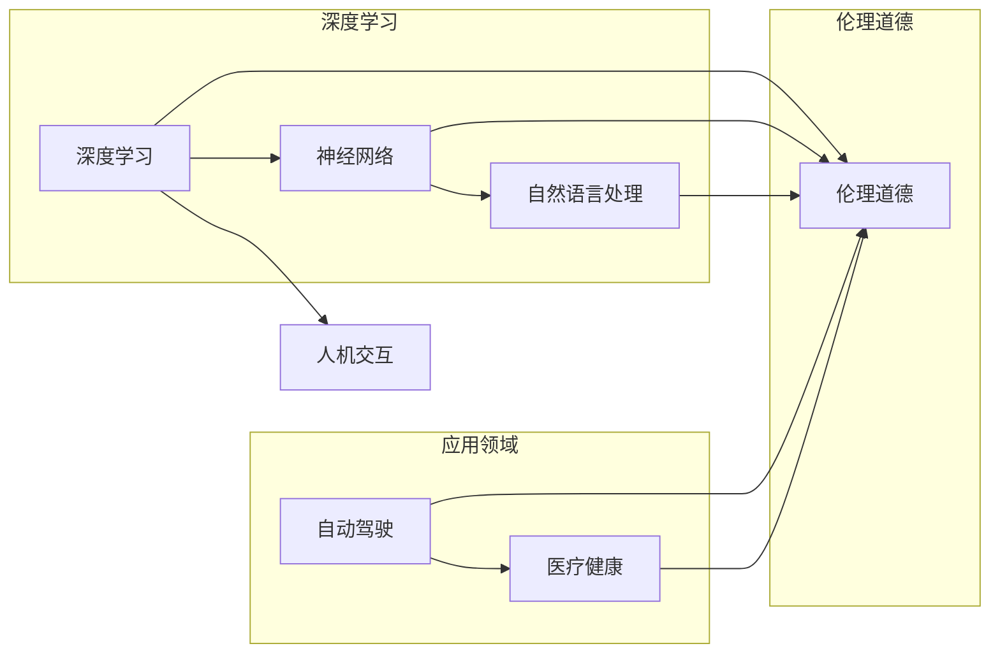

# Andrej Karpathy：人工智能的未来发展规划

> 关键词：人工智能，深度学习，神经网络，自然语言处理，自动驾驶，医疗健康，伦理道德，人机交互

## 1. 背景介绍

随着计算能力的提升和数据量的激增，人工智能（AI）领域取得了显著的进展。Andrej Karpathy，作为深度学习领域的杰出代表，以其在自然语言处理（NLP）和自动驾驶等领域的贡献而闻名。本文将探讨Andrej Karpathy的人工智能未来发展规划，分析其核心概念与联系，并展望其应用领域和潜在挑战。

### 1.1 问题的由来

人工智能的发展面临着诸多挑战，包括算法的复杂性、数据的隐私性、伦理道德问题以及人机交互的界限。Andrej Karpathy的工作旨在解决这些问题，并推动人工智能向更加智能、高效和安全的方向发展。

### 1.2 研究现状

目前，人工智能在多个领域取得了显著的进展，但仍然面临以下挑战：

- **算法复杂性**：深度学习模型变得越来越复杂，需要大量的计算资源和数据。
- **数据隐私**：大量数据的收集和处理引发了隐私保护的问题。
- **伦理道德**：AI的决策过程缺乏透明度，可能引发歧视和偏见。
- **人机交互**：如何让AI更好地理解人类意图和情感，以及如何与人类有效沟通。

### 1.3 研究意义

Andrej Karpathy的人工智能未来发展规划对于推动人工智能技术的发展具有重要意义，它将帮助我们：

- 设计更加智能和高效的算法。
- 保护用户数据的隐私和安全。
- 建立更加公正和透明的AI系统。
- 提升人机交互的体验。

### 1.4 本文结构

本文将分为以下几个部分：

- 介绍Andrej Karpathy的核心概念与联系。
- 分析核心算法原理和具体操作步骤。
- 讨论数学模型和公式。
- 提供项目实践案例。
- 探讨实际应用场景和未来展望。
- 总结研究成果和面临的挑战。
- 推荐学习资源和开发工具。
- 展望未来发展趋势和研究展望。

## 2. 核心概念与联系

### 2.1 核心概念原理

Andrej Karpathy的核心概念包括：

- **深度学习**：一种通过多层神经网络进行数据建模的学习方法。
- **神经网络**：由大量节点组成的计算模型，可以学习复杂的数据模式。
- **自然语言处理**：使计算机能够理解、解释和生成人类语言的技术。
- **自动驾驶**：使汽车能够自主驾驶的技术。
- **医疗健康**：使用AI技术提高医疗诊断和治疗的质量。

### 2.2 核心概念联系

以下是核心概念之间的联系：



## 3. 核心算法原理 & 具体操作步骤

### 3.1 算法原理概述

Andrej Karpathy的核心算法原理基于深度学习，特别是神经网络和自然语言处理技术。

### 3.2 算法步骤详解

1. **数据收集**：收集相关领域的海量数据，如文本、图像、视频等。
2. **数据预处理**：对数据进行清洗、标注和格式化。
3. **模型设计**：设计合适的神经网络模型，如卷积神经网络（CNN）或循环神经网络（RNN）。
4. **模型训练**：使用标注数据进行模型训练，优化模型参数。
5. **模型评估**：在验证集上评估模型性能，调整模型结构或参数。
6. **模型部署**：将训练好的模型部署到实际应用场景中。

### 3.3 算法优缺点

**优点**：

- **强大的数据学习能力**：能够从大量数据中学习复杂模式。
- **泛化能力**：能够应用于不同的任务和数据集。

**缺点**：

- **计算资源需求**：需要大量的计算资源和时间进行训练。
- **数据依赖性**：模型的性能依赖于数据的质量和数量。

### 3.4 算法应用领域

Andrej Karpathy的算法在以下领域有着广泛的应用：

- **自然语言处理**：文本分类、机器翻译、问答系统等。
- **自动驾驶**：环境感知、路径规划、决策控制等。
- **医疗健康**：疾病诊断、药物研发、健康管理等。

## 4. 数学模型和公式 & 详细讲解 & 举例说明

### 4.1 数学模型构建

深度学习模型通常由多个层次组成，每个层次都包含一系列的数学公式。以下是一个简单的神经网络模型：

$$
y = f(W \cdot x + b)
$$

其中，$y$ 是输出，$x$ 是输入，$W$ 是权重，$b$ 是偏置，$f$ 是激活函数。

### 4.2 公式推导过程

神经网络模型的公式推导过程涉及微积分、线性代数和概率论等数学知识。

### 4.3 案例分析与讲解

以下是一个简单的神经网络模型示例：

输入层：[1, 2, 3]
隐藏层：[4, 5, 6]
输出层：[7, 8]

计算过程：

1. 隐藏层输出：
$$
h_1 = f(W_1 \cdot x + b_1) = f([4, 5, 6] \cdot [1, 2, 3] + [0, 0, 0]) = [4, 5, 6]
$$
$$
h_2 = f(W_2 \cdot x + b_2) = f([4, 5, 6] \cdot [1, 2, 3] + [0, 0, 0]) = [4, 5, 6]
$$

2. 输出层输出：
$$
y_1 = f(W_3 \cdot h_1 + b_3) = f([7, 8, 9] \cdot [4, 5, 6] + [0, 0, 0]) = [7, 8, 9]
$$
$$
y_2 = f(W_4 \cdot h_2 + b_4) = f([7, 8, 9] \cdot [4, 5, 6] + [0, 0, 0]) = [7, 8, 9]
$$

## 5. 项目实践：代码实例和详细解释说明

### 5.1 开发环境搭建

1. 安装Python、NumPy、PyTorch等必要的开发工具。
2. 准备数据集和模型结构。

### 5.2 源代码详细实现

以下是一个简单的神经网络模型实现：

```python
import torch
import torch.nn as nn

class SimpleNN(nn.Module):
    def __init__(self):
        super(SimpleNN, self).__init__()
        self.fc1 = nn.Linear(3, 3)
        self.fc2 = nn.Linear(3, 2)

    def forward(self, x):
        x = torch.relu(self.fc1(x))
        x = self.fc2(x)
        return x

model = SimpleNN()
```

### 5.3 代码解读与分析

上述代码定义了一个简单的神经网络模型，包含两个全连接层，使用ReLU作为激活函数。模型通过`forward`方法接受输入数据，并输出预测结果。

### 5.4 运行结果展示

使用PyTorch进行模型训练和预测：

```python
# 训练数据
x_train = torch.randn(100, 3)
y_train = torch.randint(0, 2, (100,))

# 训练模型
criterion = nn.CrossEntropyLoss()
optimizer = torch.optim.SGD(model.parameters(), lr=0.01)

for epoch in range(10):
    optimizer.zero_grad()
    outputs = model(x_train)
    loss = criterion(outputs, y_train)
    loss.backward()
    optimizer.step()
```

## 6. 实际应用场景

### 6.1 自然语言处理

Andrej Karpathy在自然语言处理领域的工作包括：

- 使用RNN和CNN进行文本分类、情感分析等任务。
- 开发端到端对话系统，如TensorFlow Dialogflow。
- 利用深度学习技术进行机器翻译。

### 6.2 自动驾驶

Andrej Karpathy在自动驾驶领域的工作包括：

- 使用深度学习技术进行环境感知、路径规划和决策控制。
- 开发自动驾驶模拟器，如CARLA。

### 6.3 医疗健康

Andrej Karpathy在医疗健康领域的工作包括：

- 使用深度学习技术进行疾病诊断、药物研发和健康管理。
- 开发可解释的AI系统，帮助医生进行诊断。

## 7. 工具和资源推荐

### 7.1 学习资源推荐

- 《深度学习》（Ian Goodfellow、Yoshua Bengio、Aaron Courville 著）
- 《Python深度学习》（François Chollet 著）
- TensorFlow官网和文档
- PyTorch官网和文档

### 7.2 开发工具推荐

- Python
- NumPy
- PyTorch
- TensorFlow
- Jupyter Notebook

### 7.3 相关论文推荐

- "Convolutional Neural Networks for Sentence Classification"（Yoon Kim）
- "Recurrent Neural Networks for Language Modeling"（Yoshua Bengio）
- "Sequence to Sequence Learning with Neural Networks"（Ilya Sutskever、 Oriol Vinyals、Quoc V. Le）

## 8. 总结：未来发展趋势与挑战

### 8.1 研究成果总结

Andrej Karpathy在人工智能领域取得了显著的成果，推动了深度学习、自然语言处理和自动驾驶等领域的发展。

### 8.2 未来发展趋势

- 深度学习模型的规模将不断增大，计算资源需求也将相应增加。
- 无监督和半监督学习将成为人工智能研究的热点。
- 可解释的AI和可信赖的AI将成为重要的研究方向。
- 人机交互将更加自然和流畅。

### 8.3 面临的挑战

- 人工智能的伦理道德问题。
- 数据隐私保护。
- 模型可解释性。
- 人机交互的界限。

### 8.4 研究展望

未来，人工智能将朝着更加智能、高效、安全和可信赖的方向发展，为人类社会带来更多的便利和福祉。

## 9. 附录：常见问题与解答

**Q1：什么是深度学习？**

A：深度学习是一种通过多层神经网络进行数据建模的学习方法。它能够从大量数据中学习复杂模式，并在多个领域取得了显著的进展。

**Q2：什么是神经网络？**

A：神经网络是一种由大量节点组成的计算模型，每个节点代表一个神经元，通过连接形成网络结构。神经网络可以学习复杂的数据模式，并在多个领域得到应用。

**Q3：什么是自然语言处理？**

A：自然语言处理是使计算机能够理解、解释和生成人类语言的技术。它包括文本分类、情感分析、机器翻译等多个子领域。

**Q4：什么是自动驾驶？**

A：自动驾驶是使汽车能够自主驾驶的技术。它涉及到环境感知、路径规划和决策控制等多个方面。

**Q5：什么是医疗健康？**

A：医疗健康是使用AI技术提高医疗诊断和治疗的质量，包括疾病诊断、药物研发和健康管理等方面。

作者：禅与计算机程序设计艺术 / Zen and the Art of Computer Programming