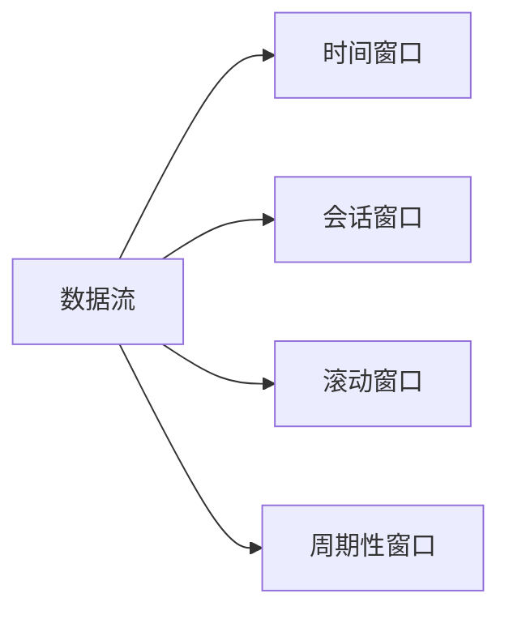
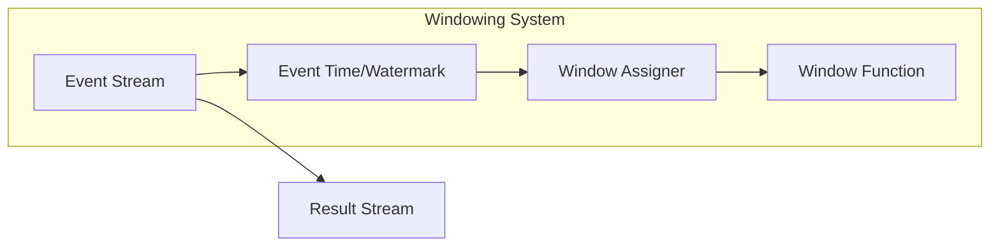

# Flink Window原理与代码实例讲解

> 关键词：Flink, Window, 时间窗口, 会话窗口, 滚动窗口, Sliding Window, 周期性窗口, 微批处理, 实时计算

## 1. 背景介绍

随着大数据时代的到来，实时数据处理成为了数据处理领域的一个重要方向。Apache Flink 作为一款流行的分布式流处理框架，以其强大的实时数据处理能力受到了广泛关注。在Flink中，Window机制是实现复杂事件时间处理的核心。本文将深入探讨Flink Window的原理，并通过实例代码展示如何使用Window进行实时计算。

### 1.1 Window的概念

在数据处理中，Window是一个时间或数据流中数据的子集，它可以用来对数据进行分组和聚合。Flink提供了多种类型的Window，包括：

- 时间窗口（Time Windows）
- 会话窗口（Session Windows）
- 滚动窗口（Sliding Windows）
- 周期性窗口（Tumbling Windows）

### 1.2 研究意义

理解Flink Window机制对于开发者来说至关重要，因为它能够帮助开发者构建复杂的数据处理流程，实现实时数据的精确聚合和计算。通过Window机制，Flink能够处理时间敏感型的数据，如股票交易、网络流量分析等。

## 2. 核心概念与联系

### 2.1 Window核心概念原理

在Flink中，Window是数据流中的一个逻辑分区，用于对数据进行聚合操作。每个Window包含一定时间范围内的数据或数据序列。



### 2.2 Window架构流程图



在这个流程图中，事件流中的每个事件都会被赋予一个事件时间戳（Event Time）和一个水位线（Watermark）。Watermark用于保证事件顺序的正确性。Window Assigner根据时间戳将事件分配到相应的窗口中，Window Function则对每个窗口内的数据进行聚合操作。

## 3. 核心算法原理 & 具体操作步骤

### 3.1 算法原理概述

Flink的Window机制主要基于以下原理：

- 事件时间（Event Time）和处理时间（Processing Time）的区分
- Watermark机制保证事件顺序
- Window Function进行数据聚合

### 3.2 算法步骤详解

1. 事件时间戳和Watermark的生成
2. 事件流进入Window Assigner，根据时间戳和Watermark分配到窗口
3. Window Function对每个窗口内的数据进行聚合操作
4. 聚合结果输出到结果流

### 3.3 算法优缺点

**优点**：

- 支持复杂的时间窗口操作
- 保证了事件顺序的正确性
- 高效的窗口管理和数据聚合

**缺点**：

- 需要处理事件时间戳和Watermark，增加了复杂性
- 在某些情况下，可能需要额外的状态管理

### 3.4 算法应用领域

Flink Window机制适用于以下场景：

- 实时数据分析
- 实时监控
- 实时推荐系统
- 实时广告投放

## 4. 数学模型和公式 & 详细讲解 & 举例说明

### 4.1 数学模型构建

假设我们有一个时间窗口，时间范围为 `[t0, t1]`，窗口内的数据序列为 `x1, x2, ..., xn`。

### 4.2 公式推导过程

窗口内的数据聚合操作可以通过以下公式进行：

$$
\text{聚合结果} = f(x1, x2, ..., xn)
$$

其中，`f` 为聚合函数，可以是求和、求平均、最大值、最小值等。

### 4.3 案例分析与讲解

以下是一个简单的示例，使用Flink对股票交易数据按照时间窗口进行聚合：

```java
DataStream<StockTransaction> transactions = ... // 获取股票交易事件流

transactions
    .assignTimestampsAndWatermarks(...) // 分配时间戳和Watermark
    .keyBy(...) // 分组键
    .window(TumblingEventTimeWindows.of(Time.minutes(1))) // 设置滚动窗口
    .apply(new StockTransactionAggregateFunction()); // 应用聚合函数
```

在这个示例中，我们首先将事件流中的每个事件分配一个时间戳和Watermark，然后按照时间窗口对事件进行分组，最后应用聚合函数计算每个窗口的聚合结果。

## 5. 项目实践：代码实例和详细解释说明

### 5.1 开发环境搭建

1. 安装Java开发环境（如JDK 1.8+）
2. 安装Apache Flink环境（可通过Maven或Gradle）
3. 配置Flink集群

### 5.2 源代码详细实现

以下是一个简单的Flink程序，使用滚动窗口计算每分钟的平均股票交易价格：

```java
public class StockTransactionAverage {

    public static void main(String[] args) throws Exception {
        // 创建执行环境
        StreamExecutionEnvironment env = StreamExecutionEnvironment.getExecutionEnvironment();

        // 获取股票交易事件流
        DataStream<StockTransaction> transactions = ... // 代码省略，假设已有数据源

        // 分配时间戳和Watermark
        transactions.assignTimestampsAndWatermarks(
            WatermarkStrategy.<StockTransaction>forBoundedOutOfOrderness(Duration.ofMinutes(1))
                .withTimestampAssigner(StockTransaction::getTimestamp)
        );

        // 分组并设置滚动窗口
        transactions
            .keyBy(StockTransaction::getSymbol)
            .window(SlidingEventTimeWindows.of(Time.minutes(1)))
            .aggregate(new AverageAggregateFunction());

        // 执行程序
        env.execute("Stock Transaction Average");
    }
}
```

### 5.3 代码解读与分析

- `assignTimestampsAndWatermarks` 方法用于为事件流分配时间戳和Watermark。
- `keyBy` 方法用于对事件流进行分组。
- `window` 方法用于设置窗口类型和窗口大小。
- `aggregate` 方法用于应用聚合函数。

### 5.4 运行结果展示

运行上述程序后，你将得到每分钟每个股票的均价。这个结果可以用于实时监控股票市场，或者为交易决策提供支持。

## 6. 实际应用场景

Flink Window机制在实际应用中非常广泛，以下是一些常见的应用场景：

- 实时监控网络流量，识别异常流量模式
- 实时分析用户行为，进行个性化推荐
- 实时处理金融交易数据，进行风险评估
- 实时分析社交媒体数据，进行舆情监测

## 7. 工具和资源推荐

### 7.1 学习资源推荐

- Flink官方文档：https://flink.apache.org/docs/latest/
- 《Apache Flink：大规模数据流处理平台》
- Flink中文社区：https://github.com/apache/flink-chinese-community

### 7.2 开发工具推荐

- IntelliJ IDEA：支持Flink开发插件
- Eclipse：支持Flink开发插件
- Maven：用于构建Flink程序

### 7.3 相关论文推荐

- "Apache Flink: A Stream Processing System"
- "Window Functions in Dataflows"

## 8. 总结：未来发展趋势与挑战

### 8.1 研究成果总结

Flink Window机制是Flink实时数据处理的核心，它为开发者提供了强大的数据处理能力。通过Window机制，开发者可以轻松实现复杂的时间窗口操作，并对数据进行精确的聚合和计算。

### 8.2 未来发展趋势

随着Flink的不断发展，Window机制将会更加完善，包括：

- 支持更多的窗口类型
- 优化窗口管理和数据聚合性能
- 提供更丰富的API和工具

### 8.3 面临的挑战

Flink Window机制在实际应用中仍面临一些挑战，包括：

- 时间戳和Watermark的生成
- 状态管理和恢复
- 跨集群的Window处理

### 8.4 研究展望

Flink Window机制的研究将继续深入，以解决实际应用中的挑战，并推动实时数据处理技术的发展。

## 9. 附录：常见问题与解答

**Q1：什么是Watermark？**

A：Watermark是Flink用于处理乱序数据的一个机制。它是一个时间戳，表示在这个时间戳之前的数据都已经到达，后续的数据不会再有更早的时间戳。

**Q2：如何选择合适的窗口类型？**

A：选择合适的窗口类型取决于具体的应用场景。例如，对于实时监控，可以使用滚动窗口；对于会话分析，可以使用会话窗口。

**Q3：Flink的Window机制如何处理乱序数据？**

A：Flink通过Watermark机制处理乱序数据。Watermark表示在这个时间戳之前的数据都已经到达，后续的数据不会再有更早的时间戳。

**Q4：Flink的Window机制如何保证状态管理的一致性？**

A：Flink使用分布式状态管理来保证状态的一致性。每个状态都存储在分布式存储系统中，可以保证在节点故障时状态的恢复。

**Q5：Flink的Window机制如何处理窗口溢出问题？**

A：Flink通过滑动窗口和周期性窗口的方式处理窗口溢出问题。滑动窗口会不断移动，周期性窗口会周期性地重置。

作者：禅与计算机程序设计艺术 / Zen and the Art of Computer Programming