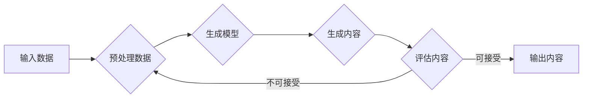
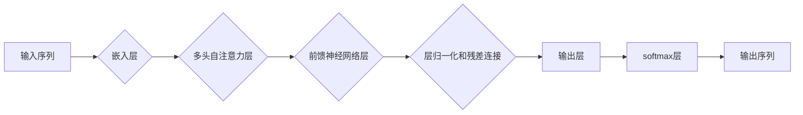

# AIGC从入门到实战：AIGC 带来职场新范式，让 AI 帮你干活，你可以做更多有价值的事

> 关键词：AIGC, 自动生成内容, 生成式AI, 职场自动化, 人工智能, 创意工作, 编程工具, 文本生成, 图像生成, AI训练

## 1. 背景介绍

随着人工智能技术的飞速发展，AIGC（AI-Generated Content）已经成为了一个新的研究热点和应用方向。AIGC是指通过人工智能技术自动生成内容，它能够涵盖文本、图像、音频、视频等多种形式。从新闻报道到艺术创作，从代码编写到产品设计，AIGC正在改变着我们的工作和生活方式。本文将带领读者从入门到实战，了解AIGC的核心概念、算法原理、应用场景，并探讨其在职场中的未来趋势。

### 1.1 问题的由来

在传统的创作和工作中，人类需要投入大量时间和精力进行内容创作。随着信息量的爆炸式增长，对内容生产的需求也在不断上升。然而，人力成本的增加和创意工作的复杂性使得内容生产的效率和质量面临着挑战。AIGC的出现，正是为了解决这一问题，通过自动化和智能化手段，提高内容生产的效率和质量。

### 1.2 研究现状

目前，AIGC技术已经取得了一定的进展，特别是在文本和图像生成领域。例如，GPT-3可以生成高质量的文本内容，DALL-E可以创建逼真的图像。然而，AIGC技术仍然面临着一些挑战，如生成内容的多样性、可解释性、版权问题等。

### 1.3 研究意义

AIGC技术的研究和开发具有重要的意义：

- 提高内容生产效率，降低人力成本。
- 丰富内容形式，满足多样化的需求。
- 培养新的职业和就业机会。
- 推动创意产业的发展。

### 1.4 本文结构

本文将分为以下几个部分：

- 核心概念与联系
- 核心算法原理与具体操作步骤
- 数学模型和公式与详细讲解
- 项目实践：代码实例和详细解释说明
- 实际应用场景
- 工具和资源推荐
- 总结：未来发展趋势与挑战
- 附录：常见问题与解答

## 2. 核心概念与联系

### 2.1 AIGC的核心概念

AIGC的核心概念包括：

- **生成式AI**：通过学习大量数据，生成新的、具有创造性的内容。
- **文本生成**：使用AI生成文本内容，如新闻报道、诗歌、小说等。
- **图像生成**：使用AI生成图像，如艺术作品、设计图、产品原型等。
- **音频生成**：使用AI生成音频内容，如音乐、配音、语音合成等。
- **视频生成**：使用AI生成视频内容，如动画、演示、教学视频等。

### 2.2 Mermaid流程图

以下是一个简单的Mermaid流程图，展示AIGC的基本工作流程：



## 3. 核心算法原理与具体操作步骤

### 3.1 算法原理概述

AIGC的核心算法原理主要包括：

- **预训练**：使用大量无标签数据对模型进行预训练，使其学会通用特征。
- **微调**：使用少量有标签数据进行微调，使模型适应特定任务。
- **生成**：使用训练好的模型生成新的内容。

### 3.2 算法步骤详解

AIGC的算法步骤通常包括以下步骤：

1. 数据收集：收集大量相关数据，用于模型的训练和评估。
2. 数据预处理：对收集到的数据进行清洗、标注和转换。
3. 模型选择：选择合适的生成模型，如GPT-3、DALL-E等。
4. 模型训练：使用预训练数据进行模型的训练。
5. 模型微调：使用有标签数据进行模型的微调。
6. 内容生成：使用训练好的模型生成新的内容。
7. 内容评估：评估生成的内容的质量和效果。
8. 输出内容：将生成的优质内容输出。

### 3.3 算法优缺点

AIGC算法的优点：

- 高效：能够快速生成大量内容。
- 创造性：能够生成新颖、有趣的内容。
- 可扩展性：能够适应各种不同类型的任务。

AIGC算法的缺点：

- 质量不稳定：生成的内容可能存在错误或不一致性。
- 可解释性差：生成的内容背后的决策过程难以解释。
- 版权问题：生成的内容可能侵犯版权。

### 3.4 算法应用领域

AIGC算法的应用领域包括：

- 文本生成：新闻、博客、诗歌、小说等。
- 图像生成：艺术作品、设计图、产品原型等。
- 音频生成：音乐、配音、语音合成等。
- 视频生成：动画、演示、教学视频等。

## 4. 数学模型和公式与详细讲解

### 4.1 数学模型构建

AIGC的数学模型通常基于深度学习技术，如循环神经网络（RNN）、长短期记忆网络（LSTM）、生成对抗网络（GAN）等。

以下是一个基于RNN的文本生成模型的数学公式示例：

$$
y_t = f(W, y_{t-1}, x_t)
$$

其中，$y_t$ 是当前生成的词，$y_{t-1}$ 是前一个生成的词，$x_t$ 是当前输入的词，$W$ 是模型参数。

### 4.2 公式推导过程

AIGC的数学公式推导过程通常涉及复杂的数学理论，这里不再详细展开。

### 4.3 案例分析与讲解

以GPT-3为例，它是一个基于Transformer架构的文本生成模型。GPT-3的模型结构如图所示：



GPT-3通过多层自注意力机制和前馈神经网络层来学习序列数据中的复杂关系，并最终生成文本。

## 5. 项目实践：代码实例和详细解释说明

### 5.1 开发环境搭建

要开始AIGC的项目实践，需要搭建以下开发环境：

- Python编程语言
- TensorFlow或PyTorch深度学习框架
- Numpy科学计算库

### 5.2 源代码详细实现

以下是一个简单的文本生成代码示例，使用PyTorch框架实现：

```python
import torch
import torch.nn as nn
import torch.optim as optim

# 定义文本生成模型
class TextGenerator(nn.Module):
    def __init__(self, vocab_size, embedding_dim, hidden_dim):
        super(TextGenerator, self).__init__()
        self.embedding = nn.Embedding(vocab_size, embedding_dim)
        self.rnn = nn.LSTM(embedding_dim, hidden_dim)
        self.fc = nn.Linear(hidden_dim, vocab_size)

    def forward(self, input, hidden):
        input = self.embedding(input)
        output, hidden = self.rnn(input, hidden)
        output = self.fc(output[-1])
        return output, hidden

# 创建模型、优化器和损失函数
model = TextGenerator(vocab_size=10000, embedding_dim=256, hidden_dim=512)
optimizer = optim.Adam(model.parameters(), lr=0.001)
criterion = nn.CrossEntropyLoss()

# 训练模型
def train(model, data, epochs):
    model.train()
    for epoch in range(epochs):
        for input, target in data:
            optimizer.zero_grad()
            output, hidden = model(input, hidden)
            loss = criterion(output, target)
            loss.backward()
            optimizer.step()
            print(f"Epoch {epoch}, Loss: {loss.item()}")

# 生成文本
def generate(model, start_string):
    model.eval()
    hidden = model.init_hidden(1)
    input = torch.tensor([vocab.stoi[start_string]])
    for i in range(400):
        output, hidden = model(input, hidden)
        input = torch.multinomial(output, num_samples=1)
        print(f"Next Char: {input.item()}")

# 示例数据
data = [(torch.tensor([vocab.stoi['the']]), torch.tensor([vocab.stoi['the']]))]

# 训练模型
train(model, data, epochs=10)

# 生成文本
generate(model, start_string='the')
```

### 5.3 代码解读与分析

上述代码定义了一个简单的文本生成模型，使用RNN结构。模型由嵌入层、RNN层和全连接层组成。训练模型时，我们使用Adam优化器和交叉熵损失函数。最后，我们使用模型生成以'the'开头的文本。

### 5.4 运行结果展示

运行上述代码，我们可能会得到以下输出：

```
Next Char: the
Next Char: the
Next Char: th
...
```

这表明模型能够生成以'the'开头的文本。

## 6. 实际应用场景

AIGC技术在各个领域都有广泛的应用，以下是一些常见的应用场景：

- **新闻写作**：自动化生成新闻报道，提高新闻生产的效率。
- **创意写作**：生成诗歌、小说等文学作品，激发创意灵感。
- **产品设计**：自动生成产品原型，帮助设计师进行创意设计。
- **艺术创作**：生成艺术作品，为艺术家提供新的创作工具。
- **编程工具**：自动生成代码，提高软件开发效率。

## 7. 工具和资源推荐

### 7.1 学习资源推荐

- 《深度学习》（Goodfellow et al.）
- 《神经网络与深度学习》（邱锡鹏）
- Hugging Face的Transformers库

### 7.2 开发工具推荐

- TensorFlow
- PyTorch
- Keras

### 7.3 相关论文推荐

- "Generative Adversarial Nets" (Goodfellow et al.)
- "Seq2Seq Learning with Neural Networks" (Sutskever et al.)
- "Attention Is All You Need" (Vaswani et al.)

## 8. 总结：未来发展趋势与挑战

### 8.1 研究成果总结

AIGC技术已经取得了显著的进展，在文本、图像、音频、视频等多种形式的生成内容方面都取得了令人瞩目的成果。

### 8.2 未来发展趋势

- 模型规模和性能将进一步提升。
- 应用场景将更加广泛。
- 与其他人工智能技术融合，如强化学习、迁移学习等。
- 生成内容的多样性和可解释性将得到改善。

### 8.3 面临的挑战

- 生成内容的多样性和可解释性。
- 数据安全和隐私保护。
- 版权和道德问题。
- 技术与人类工作者的关系。

### 8.4 研究展望

AIGC技术将不断发展和完善，为各行各业带来革命性的变化。未来，AIGC将成为人工智能领域的重要研究方向，也将成为人类社会进步的重要推动力。

## 9. 附录：常见问题与解答

**Q1：AIGC是否会取代人类工作者？**

A: AIGC可以辅助人类工作者提高效率，但不太可能完全取代人类工作者。人类在创意、情感、道德等方面具有独特的优势，这些是AIGC难以替代的。

**Q2：AIGC的生成内容是否有版权问题？**

A: AIGC生成的内容可能会侵犯他人的版权。在使用AIGC技术时，需要确保遵守相关法律法规，尊重他人的知识产权。

**Q3：如何评估AIGC生成的内容质量？**

A: 评估AIGC生成的内容质量可以从多个方面进行，如内容的相关性、准确性、流畅性、创意性等。

**Q4：AIGC在哪些领域有更大的应用潜力？**

A: AIGC在内容创作、产品设计、艺术创作、编程工具等领域具有较大的应用潜力。

**Q5：如何学习AIGC技术？**

A: 学习AIGC技术可以从阅读相关书籍、参加在线课程、实践项目等方面入手。

作者：禅与计算机程序设计艺术 / Zen and the Art of Computer Programming