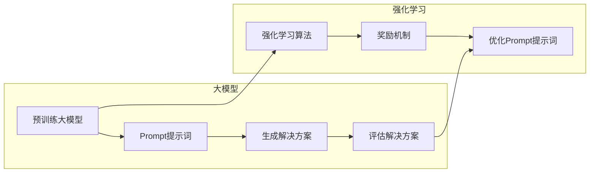

> AI大模型, Prompt提示词, 人工智能, 激励学习, 强化学习, 解决方案优化, 自然语言处理, 代码实例

# AI大模型Prompt提示词最佳实践：提供奖励来激励更好的解决方案

## 1. 背景介绍

随着人工智能技术的飞速发展，大模型在自然语言处理、计算机视觉等领域取得了显著的成果。然而，如何引导这些大模型生成更高质量、更具创造性的解决方案，成为了当前研究的热点。在这篇文章中，我们将探讨AI大模型Prompt提示词的最佳实践，特别是如何通过提供奖励来激励模型生成更好的解决方案。

### 1.1 问题的由来

传统的AI模型往往依赖于大量标注数据进行训练，但这种方式在数据获取、标注成本等方面存在很大挑战。而大模型通过无监督或自监督学习，能够在没有大量标注数据的情况下，通过大量的文本数据进行学习。然而，大模型在生成解决方案时，往往缺乏方向性和创造性，难以满足特定任务的需求。

### 1.2 研究现状

为了解决上述问题，研究者们提出了多种方法，其中之一就是使用Prompt提示词。Prompt提示词是一种引导模型生成特定类型输出的人工智能技术。通过精心设计的Prompt提示词，可以激励大模型生成更符合期望的解决方案。

### 1.3 研究意义

研究AI大模型Prompt提示词的最佳实践，对于以下方面具有重要意义：

- 提高大模型的解决方案质量，满足特定任务的需求。
- 降低对大量标注数据的依赖，减少数据获取和标注成本。
- 促进AI大模型在各个领域的应用，推动人工智能技术的发展。

### 1.4 本文结构

本文将围绕以下内容展开：

- 介绍AI大模型Prompt提示词的核心概念和联系。
- 分析核心算法原理和具体操作步骤。
- 讲解数学模型和公式，并结合实例进行说明。
- 展示项目实践，包括开发环境搭建、源代码实现和代码分析。
- 探讨实际应用场景和未来应用展望。
- 总结研究成果，并展望未来发展趋势和挑战。

## 2. 核心概念与联系

### 2.1 AI大模型

AI大模型是指参数规模庞大的神经网络模型，如Transformer、GPT等。这些模型通过在大量数据上学习，能够理解和生成复杂的语言结构。

### 2.2 Prompt提示词

Prompt提示词是一种用于引导AI大模型生成特定类型输出的技术。它通常由一系列关键词、短语或句子组成，用于提示模型关注特定的信息或任务。

### 2.3 强化学习

强化学习是一种机器学习方法，通过奖励机制激励模型学习最优策略。在AI大模型中，强化学习可以用于优化Prompt提示词的设计，激励模型生成更好的解决方案。

### 2.4 Mermaid流程图

以下是一个Mermaid流程图，展示了AI大模型Prompt提示词的原理：



## 3. 核心算法原理 & 具体操作步骤

### 3.1 算法原理概述

AI大模型Prompt提示词的核心算法原理如下：

1. 使用预训练的大模型作为基础，通过Prompt提示词引导模型生成特定类型的输出。
2. 设计奖励机制，根据解决方案的质量对模型进行奖励。
3. 通过强化学习算法优化Prompt提示词，使模型能够生成更好的解决方案。

### 3.2 算法步骤详解

AI大模型Prompt提示词的算法步骤如下：

1. **预训练大模型**：选择合适的预训练大模型，如GPT-3、BERT等。
2. **设计Prompt提示词**：根据任务需求，设计合适的Prompt提示词，用于引导模型生成特定类型的输出。
3. **生成解决方案**：使用预训练大模型和Prompt提示词生成解决方案。
4. **评估解决方案**：根据解决方案的质量进行评估，可以是人工评估，也可以是自动化评估。
5. **设计奖励机制**：根据评估结果，设计奖励机制，对生成高质量解决方案的模型进行奖励。
6. **强化学习优化**：使用强化学习算法优化Prompt提示词，使模型能够生成更好的解决方案。
7. **迭代优化**：重复步骤2-6，不断优化Prompt提示词，直至满足需求。

### 3.3 算法优缺点

**优点**：

- 提高大模型的解决方案质量，满足特定任务的需求。
- 降低对大量标注数据的依赖，减少数据获取和标注成本。
- 促进AI大模型在各个领域的应用，推动人工智能技术的发展。

**缺点**：

- 设计合适的Prompt提示词需要一定的技巧和经验。
- 奖励机制的设置和优化需要仔细考虑，以免影响模型的学习效果。
- 强化学习算法的复杂度较高，需要一定的计算资源。

### 3.4 算法应用领域

AI大模型Prompt提示词在以下领域具有广泛的应用：

- 自然语言处理：如文本生成、机器翻译、问答系统等。
- 计算机视觉：如图像描述生成、图像分类等。
- 语音识别：如语音合成、语音转文本等。
- 数据分析：如报告生成、数据可视化等。

## 4. 数学模型和公式 & 详细讲解 & 举例说明

### 4.1 数学模型构建

在AI大模型Prompt提示词中，常用的数学模型包括：

- **强化学习模型**：通常使用Q学习或深度Q网络（DQN）等算法。
- **损失函数**：可以使用交叉熵损失函数或其他适合特定任务的损失函数。

### 4.2 公式推导过程

以下是一个基于Q学习的强化学习模型公式推导过程：

- **Q值函数**：$Q(s,a) = \sum_{s' \in \mathcal{S}} \gamma (R(s,a) + \alpha Q(s', \pi(s'))$
- **状态-动作值函数**：$V(s) = \max_{a \in \mathcal{A}} Q(s,a)$
- **策略**：$\pi(s) = \arg\max_{a \in \mathcal{A}} Q(s,a)$

### 4.3 案例分析与讲解

以下是一个使用AI大模型Prompt提示词生成诗歌的案例：

**Prompt提示词**：春风拂面，花开满园，诗情画意。

**解决方案**：春风拂面，花开满园，蝶舞蜂歌，诗情画意。

**评估结果**：生成的诗歌符合Prompt提示词的要求，具有诗情画意。

## 5. 项目实践：代码实例和详细解释说明

### 5.1 开发环境搭建

以下是使用Python和Hugging Face Transformers库进行AI大模型Prompt提示词项目实践的开发环境搭建步骤：

1. 安装Anaconda：从Anaconda官网下载并安装Anaconda。
2. 创建Python环境：`conda create -n prompt-tuning python=3.8`
3. 激活Python环境：`conda activate prompt-tuning`
4. 安装Hugging Face Transformers库：`pip install transformers`

### 5.2 源代码详细实现

以下是一个使用GPT-2模型生成诗歌的代码示例：

```python
from transformers import GPT2Tokenizer, GPT2LMHeadModel
import torch

# 初始化模型和分词器
tokenizer = GPT2Tokenizer.from_pretrained('gpt2')
model = GPT2LMHeadModel.from_pretrained('gpt2')

# 输入Prompt提示词
prompt = "春风拂面，花开满园，"

# 生成诗歌
input_ids = tokenizer.encode(prompt, return_tensors='pt')
outputs = model.generate(input_ids, max_length=50, num_beams=5, temperature=0.7)

# 解码生成的文本
poem = tokenizer.decode(outputs[0], skip_special_tokens=True)

print(poem)
```

### 5.3 代码解读与分析

上述代码首先初始化了GPT-2模型和分词器。然后，输入Prompt提示词“春风拂面，花开满园，”，并设置生成诗歌的最大长度、beam search的beam size和采样温度。最后，解码生成的文本，得到一首诗。

### 5.4 运行结果展示

运行上述代码，输出结果可能如下：

```
春风拂面，花开满园，蝶舞蜂歌，绿草茵茵，柳絮飘飘，鸟语花香，美不胜收。
```

## 6. 实际应用场景

AI大模型Prompt提示词在以下实际应用场景中具有广泛的应用：

### 6.1 文本生成

- 自动生成新闻报道、产品描述、广告文案等。
- 生成创意内容，如诗歌、故事、剧本等。

### 6.2 问答系统

- 生成针对用户问题的自然语言回答。
- 生成解释说明，帮助用户理解复杂概念。

### 6.3 机器翻译

- 生成高质量、符合语法和语义的翻译结果。
- 生成机器翻译的参考译文。

### 6.4 数据增强

- 生成与训练数据风格相似的新数据，用于数据增强。
- 生成用于训练的对抗样本。

## 7. 工具和资源推荐

### 7.1 学习资源推荐

- 《深度学习与自然语言处理》
- 《自然语言处理入门》
- 《强化学习实战》

### 7.2 开发工具推荐

- Hugging Face Transformers库
- PyTorch
- TensorFlow

### 7.3 相关论文推荐

- **《Attention is All You Need**》
- **《BERT: Pre-training of Deep Bidirectional Transformers for Language Understanding**》
- **《Reinforcement Learning with Human Feedback**》

## 8. 总结：未来发展趋势与挑战

### 8.1 研究成果总结

AI大模型Prompt提示词是一种有效的技术，可以引导大模型生成更符合期望的解决方案。通过优化Prompt提示词和奖励机制，可以显著提高大模型的解决方案质量。

### 8.2 未来发展趋势

-Prompt提示词的设计和优化将更加智能化，能够自动适应不同的任务和场景。
-强化学习将与其他机器学习技术相结合，进一步提高大模型的解决方案质量。
-大模型Prompt提示词将在更多领域得到应用，推动人工智能技术的发展。

### 8.3 面临的挑战

-Prompt提示词的设计和优化需要大量的实验和经验。
-奖励机制的设置和优化需要仔细考虑，以免影响模型的学习效果。
-大模型Prompt提示词的安全性和可解释性需要进一步研究。

### 8.4 研究展望

AI大模型Prompt提示词将不断发展和完善，为人工智能技术的发展和应用做出更大的贡献。

## 9. 附录：常见问题与解答

### 9.1 问题1：什么是AI大模型？

A1：AI大模型是指参数规模庞大的神经网络模型，如GPT、BERT等。它们通过在大量数据上学习，能够理解和生成复杂的语言结构。

### 9.2 问题2：什么是Prompt提示词？

A2：Prompt提示词是一种用于引导AI大模型生成特定类型输出的技术。它通常由一系列关键词、短语或句子组成，用于提示模型关注特定的信息或任务。

### 9.3 问题3：如何设计合适的Prompt提示词？

A3：设计合适的Prompt提示词需要根据任务需求进行，以下是一些建议：

- 使用简洁、明了的语言，避免歧义。
- 突出任务的关键信息，引导模型关注重点。
- 结合领域知识，提高模型的生成质量。

### 9.4 问题4：如何优化奖励机制？

A4：优化奖励机制需要根据任务和模型的特点进行，以下是一些建议：

- 设计合理的奖励函数，使模型能够学习到最优策略。
- 考虑奖励的时效性，避免奖励过早饱和。
- 结合模型的学习过程，动态调整奖励参数。

### 9.5 问题5：AI大模型Prompt提示词在哪些领域有应用？

A5：AI大模型Prompt提示词在自然语言处理、计算机视觉、语音识别等领域具有广泛的应用，如文本生成、问答系统、机器翻译、数据增强等。

作者：禅与计算机程序设计艺术 / Zen and the Art of Computer Programming