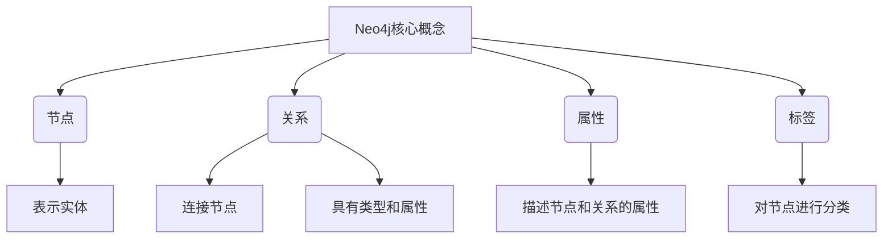
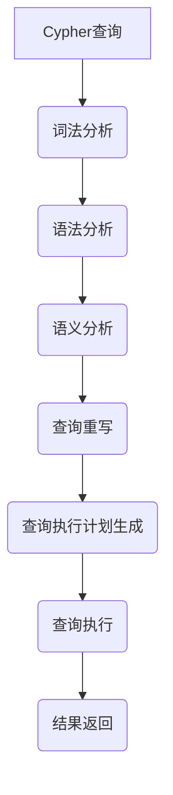
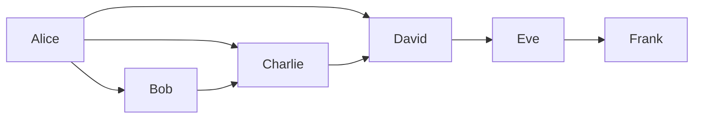
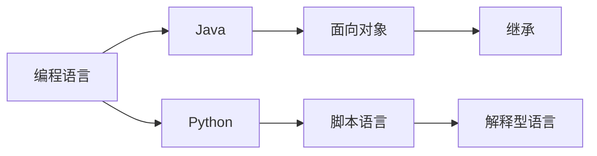

# Neo4j原理与代码实例讲解

## 1. 背景介绍

### 1.1 问题的由来

在当今数据驱动的世界中，管理和处理大规模数据集已经成为一项关键挑战。传统的关系型数据库系统在处理高度互连的数据时表现出了一些局限性,这导致了图形数据库的兴起。图形数据库以更自然和高效的方式表示和查询互连数据,从而为解决涉及复杂关系的问题提供了强大的工具。

### 1.2 研究现状

作为领先的图形数据库之一,Neo4j已经在各个领域得到了广泛应用,包括社交网络分析、推荐系统、知识图谱、欺诈检测等。Neo4j的核心是属性图模型,它以直观的方式表示实体及其关系,并提供了高效的查询语言Cypher,使得复杂的图形查询变得简单易行。

### 1.3 研究意义

深入理解Neo4j的原理和实践对于充分利用图形数据库的强大功能至关重要。本文将全面探讨Neo4j的核心概念、算法原理、数学模型、代码实现和实际应用场景,为读者提供一个系统性的Neo4j学习和实践指南。

### 1.4 本文结构

本文将按照以下结构进行阐述:

1. 背景介绍
2. 核心概念与联系
3. 核心算法原理与具体操作步骤
4. 数学模型和公式详细讲解与举例说明
5. 项目实践:代码实例和详细解释说明
6. 实际应用场景
7. 工具和资源推荐
8. 总结:未来发展趋势与挑战
9. 附录:常见问题与解答

## 2. 核心概念与联系



Neo4j的核心概念包括节点(Node)、关系(Relationship)、属性(Property)和标签(Label)。

- **节点(Node)**: 表示图形数据库中的实体,如人物、地点、事件等。每个节点都有一个唯一的标识符。

- **关系(Relationship)**: 连接两个节点,表示它们之间的关联。关系具有类型和属性,可以是有向或无向。

- **属性(Property)**: 描述节点和关系的附加信息。属性是键值对的形式,可以存储各种类型的数据。

- **标签(Label)**: 对节点进行分类和组织。一个节点可以有多个标签,标签可以用于快速查询和索引。

这些核心概念相互关联,构成了Neo4j的属性图模型。节点和关系通过属性和标签来丰富语义,从而更好地表示现实世界中的实体和关联。

## 3. 核心算法原理与具体操作步骤

### 3.1 算法原理概述

Neo4j的核心算法原理主要包括以下几个方面:

1. **图形存储**: Neo4j采用了基于本地磁盘的原生图形存储引擎,能够高效地存储和查询图形数据。

2. **图形查询语言Cypher**: Cypher是一种声明式查询语言,使用模式匹配的方式查询图形数据,语法简洁且易于理解。

3. **图形算法**: Neo4j内置了多种图形算法,如最短路径、中心度、社区发现等,用于解决复杂的图形分析问题。

4. **并行计算**: Neo4j利用多核CPU和内存映射文件等技术实现并行计算,提高查询和算法的执行效率。

5. **事务处理**: Neo4j支持ACID事务,确保数据的一致性和完整性。

6. **集群和高可用性**: Neo4j支持集群部署,提供高可用性和可扩展性。

### 3.2 算法步骤详解

以下是Neo4j中执行Cypher查询的典型步骤:



1. **词法分析**: 将Cypher查询语句分解为一系列词法单元(Token),如关键字、标识符、字面量等。

2. **语法分析**: 根据Cypher语法规则,将词法单元组合成语法树(Abstract Syntax Tree, AST)。

3. **语义分析**: 验证AST的语义正确性,解析标识符引用,执行类型检查等。

4. **查询重写**: 对AST进行优化和重写,如常量折叠、子查询展开等。

5. **查询执行计划生成**: 根据查询语句和数据统计信息,生成最优的查询执行计划。

6. **查询执行**: 遍历图形数据,执行查询操作,如扫描、过滤、投影等。

7. **结果返回**: 将查询结果返回给客户端。

### 3.3 算法优缺点

**优点**:

- 高效处理图形数据,查询性能优异。
- Cypher查询语言简洁易学,降低了使用门槛。
- 内置丰富的图形算法,满足多种分析需求。
- 支持ACID事务,确保数据一致性和完整性。
- 提供高可用性和可扩展性。

**缺点**:

- 不适合处理大量结构化数据,如关系型数据库更加合适。
- 对于复杂的分析型查询,性能可能不如专用的图形分析系统。
- 集群部署和管理相对复杂。
- 缺乏标准的图形查询语言,Cypher语法可能会发生变化。

### 3.4 算法应用领域

Neo4j的图形数据库技术在以下领域有广泛应用:

- **社交网络分析**: 分析用户之间的关系,发现社交圈、影响力等。
- **推荐系统**: 基于用户、物品之间的关系进行个性化推荐。
- **知识图谱**: 构建知识库,表示实体及其关联,支持智能问答等应用。
- **欺诈检测**: 发现复杂的欺诈关系网络,识别潜在的欺诈行为。
- **网络和IT运营**: 管理复杂的IT基础设施,分析故障根源和影响范围。
- **生物信息学**: 研究基因、蛋白质等生物实体之间的关系。

## 4. 数学模型和公式详细讲解与举例说明

### 4.1 数学模型构建

Neo4j的数学模型基于图论,将现实世界的实体和关系抽象为图形结构。一个图形$G$可以表示为$G=(V, E)$,其中$V$是节点集合,而$E$是边集合。

$$
V = \{v_1, v_2, \ldots, v_n\} \
E = \{e_1, e_2, \ldots, e_m\}
$$

每个边$e_i$连接两个节点$v_j$和$v_k$,表示它们之间存在关系。边可以是有向或无向,也可以携带属性信息。

在Neo4j中,节点和边还可以附加属性,用于描述实体的附加信息。我们可以将图形$G$扩展为属性图$G'=(V, E, P_V, P_E, \phi)$,其中:

- $P_V$是节点属性的集合
- $P_E$是边属性的集合
- $\phi$是将节点和边映射到对应属性的函数

### 4.2 公式推导过程

**shortest_path算法**

shortest_path算法用于计算两个节点之间的最短路径。我们可以使用广度优先搜索(BFS)或Dijkstra算法来实现。以下是Dijkstra算法的公式推导过程:

设$G=(V, E)$是一个加权图,源节点为$s$,目标节点为$t$。我们定义:

- $d[v]$表示从$s$到$v$的最短路径长度
- $prev[v]$表示$v$在最短路径上的前驱节点

初始化:

$$
\begin{align*}
&\forall v \in V: \
&d[v] = \infty \
&prev[v] = \text{undefined}
\end{align*}
$$

$$
d[s] = 0
$$

然后，我们重复以下步骤:

1. 找到未访问节点中距离$s$最近的节点$u$,即$d[u]$最小
2. 对于$u$的每个相邻节点$v$:

   $$
   \text{alt} = d[u] + w(u, v)
   $$

   如果$\text{alt} < d[v]$,则更新$d[v]$和$prev[v]$:

   $$
   \begin{align*}
   &d[v] = \text{alt} \
   &prev[v] = u
   \end{align*}
   $$

重复这个过程,直到目标节点$t$被访问。最终,$d[t]$就是从$s$到$t$的最短路径长度,而$prev$数组存储了最短路径上的节点序列。

**PageRank算法**

PageRank算法用于计算网页的重要性排名,Neo4j也可以用它来计算节点的重要性。PageRank的基本思想是,一个节点的重要性取决于指向它的节点的重要性及其数量。

设$G=(V, E)$是一个有向图,对于每个节点$v_i \in V$,我们定义它的PageRank值为$PR(v_i)$。初始时,所有节点的$PR$值相等:

$$
PR(v_i) = \frac{1}{|V|}
$$

然后,我们迭代计算每个节点的新$PR$值,公式如下:

$$
PR(v_i) = (1 - d) + d \sum_{v_j \in In(v_i)} \frac{PR(v_j)}{Out(v_j)}
$$

其中:

- $d$是一个阻尼系数,通常取值$0.85$
- $In(v_i)$是指向$v_i$的节点集合
- $Out(v_j)$是$v_j$指出的节点数量

我们重复这个过程,直到$PR$值收敛。最终,具有较高$PR$值的节点被认为更加重要。

### 4.3 案例分析与讲解

**社交网络案例**

假设我们有一个社交网络,其中节点表示用户,边表示用户之间的关系(如朋友或关注)。我们可以使用PageRank算法来识别影响力用户。



上图是一个简单的社交网络示例。我们可以计算每个用户的PageRank值,结果如下:

```
Alice: 0.27
Bob: 0.14
Charlie: 0.23
David: 0.18
Eve: 0.12
Frank: 0.06
```

可以看到,Alice的PageRank值最高,说明她在这个社交网络中具有较高的影响力。这可能是因为她拥有更多的关注者或朋友。

**知识图谱案例**

假设我们正在构建一个关于计算机科学的知识图谱。节点表示不同的概念,边表示概念之间的关系(如"是一种"、"属于"等)。我们可以使用shortest_path算法来查找两个概念之间的最短关系路径。



上图是一个简化的计算机科学知识图谱示例。假设我们想找出"Java"和"解释型语言"之间的最短关系路径,shortest_path算法的结果如下:

```
Java -> 面向对象 <- 编程语言 -> Python -> 脚本语言 -> 解释型语言
```

这条路径揭示了"Java"和"解释型语言"之间的语义关联,有助于理解和推理这些概念之间的联系。

### 4.4 常见问题解答

**1. Neo4j是否支持全文搜索?**

是的,Neo4j支持全文搜索。可以使用Apache Lucene集成的全文索引来实现对节点和属性的全文搜索。

**2. Neo4j是否支持地理空间数据