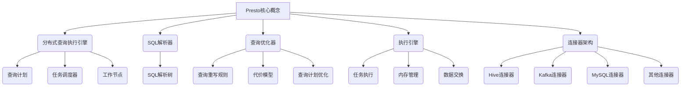

# Presto原理与代码实例讲解

## 1. 背景介绍

### 1.1 问题的由来

在当今大数据时代，数据量的快速增长使得传统的数据处理系统难以满足实时查询和分析的需求。企业和组织需要一种能够快速响应交互式数据查询的解决方案,以支持实时业务智能和数据驱动的决策过程。这就催生了新一代分布式SQL查询引擎的出现,其中Presto是一个广受欢迎的开源解决方案。

### 1.2 研究现状

Presto最初由Facebook开发,旨在解决他们内部的大规模数据分析需求。它是一个分布式SQL查询引擎,能够快速高效地处理来自不同数据源(如Hadoop、AWS S3、MySQL等)的大规模数据集。凭借其出色的查询性能和灵活的连接器架构,Presto已被许多知名公司(如Netflix、Uber、Twitter等)广泛采用。

### 1.3 研究意义

深入理解Presto的原理和实现细节对于构建高性能的大数据分析系统至关重要。本文将全面探讨Presto的核心概念、算法原理、数学模型、代码实现和实际应用场景,为读者提供一个系统性的学习和参考资料。

### 1.4 本文结构

本文将按照以下结构展开:

1. 背景介绍
2. 核心概念与联系
3. 核心算法原理与具体操作步骤
4. 数学模型和公式详细讲解与举例说明
5. 项目实践:代码实例和详细解释说明
6. 实际应用场景
7. 工具和资源推荐
8. 总结:未来发展趋势与挑战
9. 附录:常见问题与解答

## 2. 核心概念与联系



Presto是一个分布式SQL查询引擎,旨在快速高效地处理大规模数据集。它的核心概念包括:

1. **分布式查询执行引擎**: Presto采用主从架构,由一个协调节点(Coordinator)和多个工作节点(Worker)组成。协调节点负责解析SQL查询、优化查询计划并将任务分发给工作节点执行。

2. **SQL解析器**: 将SQL语句解析为抽象语法树(AST),作为查询优化和执行的基础。

3. **查询优化器**: 根据代价模型和查询重写规则对查询计划进行优化,生成高效的执行计划。

4. **执行引擎**: 负责任务调度、内存管理、数据交换等,执行优化后的查询计划。

5. **连接器架构**: 支持通过插件式连接器访问各种数据源,如Hive、Kafka、MySQL等。

这些核心概念紧密相关,共同构建了Presto的分布式查询处理能力。

## 3. 核心算法原理与具体操作步骤

### 3.1 算法原理概述

Presto的核心算法原理包括:

1. **分布式查询执行**: 将查询分解为多个阶段(Stage),每个阶段由多个并行任务(Task)组成,在工作节点上执行。通过有效的任务调度和数据交换,实现高效的分布式查询处理。

2. **成本模型驱动的查询优化**: 基于代价模型和查询重写规则,对查询计划进行逻辑优化(如谓词下推、投影剪裁等)和物理优化(如连接重排、并行化等),生成高效的执行计划。

3. **向量化执行引擎**: 采用向量化处理模式,一次处理批量数据,充分利用现代CPU的SIMD指令集,提高CPU利用率。

4. **列式存储和编码**: 使用高效的列式存储格式(如Parquet、ORC等)和编码方式(如RLE、Dictionary等),减少I/O和内存开销。

5. **自适应查询执行**: 通过动态采样和重新优化,在运行时调整查询计划,以应对数据偏斜和统计信息不准确的情况。

### 3.2 算法步骤详解

Presto的查询执行过程可分为以下几个主要步骤:

1. **SQL解析**: 将SQL语句解析为抽象语法树(AST)。

2. **逻辑查询优化**: 对AST进行一系列逻辑优化,如谓词下推、投影剪裁等,生成优化后的逻辑查询计划。

3. **物理查询优化**: 基于代价模型和查询重写规则,对逻辑查询计划进行物理优化,生成分布式执行计划。

4. **任务分发**: 协调节点将执行计划分解为多个阶段,并将任务分发给工作节点执行。

5. **本地执行**: 工作节点在本地执行分配的任务,可能涉及数据读取、过滤、聚合、连接等操作。

6. **数据交换**: 工作节点之间通过高效的数据交换机制(如散列分区、广播等)传输中间数据。

7. **结果归并**: 协调节点从工作节点收集并合并最终结果。

8. **自适应优化**(可选): 根据运行时统计信息动态重新优化查询计划。

在整个过程中,Presto通过分布式执行、向量化处理、列式存储等技术实现高性能查询。

### 3.3 算法优缺点

**优点**:

- 高查询性能:通过分布式执行、向量化处理等技术,能够快速处理大规模数据集。
- 灵活的连接器架构:支持多种数据源,易于集成到现有的大数据生态系统中。
- 标准SQL支持:提供ANSI SQL的广泛支持,降低了学习成本。
- 容错和扩展性:具有良好的容错能力和水平扩展性。

**缺点**:

- 不支持更新和事务:Presto是一个纯查询引擎,不支持数据更新和事务操作。
- 元数据管理有限:缺乏强大的元数据管理和治理功能。
- 资源隔离不足:缺乏有效的资源隔离和控制机制,可能导致资源争用问题。
- 缺乏可视化工具:缺乏直观的可视化查询分析和监控工具。

### 3.4 算法应用领域

Presto广泛应用于以下领域:

- **交互式数据分析**: 支持实时的ad-hoc查询和探索性数据分析。
- **业务智能(BI)**: 为BI工具和仪表板提供高性能的数据查询支持。
- **数据湖分析**: 能够高效查询存储在数据湖(如AWS S3、Azure Data Lake等)中的大规模数据集。
- **日志分析**: 适用于对大规模日志数据进行实时分析和监控。
- **物联网(IoT)数据分析**: 支持对海量IoT设备数据进行实时查询和分析。

## 4. 数学模型和公式详细讲解与举例说明

### 4.1 数学模型构建

在Presto中,查询优化器使用代价模型来评估不同查询计划的成本,并选择成本最低的计划执行。代价模型通常基于以下几个主要因素:

- **I/O成本**: 包括从存储读取数据和网络传输数据的成本。
- **CPU成本**: 包括执行各种操作(如过滤、聚合、连接等)的CPU开销。
- **内存成本**: 包括中间数据的内存占用成本。

假设一个查询涉及以下操作:

- 扫描两个表T1和T2,分别有N1和N2行。
- 使用谓词P1和P2过滤T1和T2。
- 使用连接键连接过滤后的T1和T2。

我们可以构建以下代价模型:

$$
Cost = C_{io}(N_1, N_2) + C_{cpu}(N_1, N_2, P_1, P_2) + C_{mem}(N_1, N_2, P_1, P_2)
$$

其中:

- $C_{io}(N_1, N_2)$表示读取T1和T2的I/O成本,通常与表的大小成正比。
- $C_{cpu}(N_1, N_2, P_1, P_2)$表示执行过滤和连接操作的CPU成本,与输入行数和谓词复杂度有关。
- $C_{mem}(N_1, N_2, P_1, P_2)$表示中间数据的内存成本,与过滤后的行数和连接键的大小有关。

通过估计这些成本,优化器可以比较不同的查询计划,选择成本最低的执行。

### 4.2 公式推导过程

我们以连接操作的代价模型为例,推导CPU成本的公式。假设使用嵌套循环连接算法,其时间复杂度为$O(N_1 \times N_2)$,其中$N_1$和$N_2$分别为连接输入的行数。

假设:

- $C_{cpu}^{row}$为处理一行数据的CPU开销。
- $f_1$和$f_2$分别为T1和T2的过滤选择率,即过滤后的行数占原始行数的比例。

则连接操作的CPU成本可表示为:

$$
\begin{aligned}
C_{cpu}(N_1, N_2, P_1, P_2) &= C_{cpu}^{row} \times N_1 \times f_1 \times N_2 \times f_2 \
&= C_{cpu}^{row} \times N_1 \times N_2 \times f_1 \times f_2
\end{aligned}
$$

其中$f_1$和$f_2$可以根据谓词$P_1$和$P_2$的选择率估计得到。

### 4.3 案例分析与讲解

假设我们有一个查询,需要连接两个表`orders`和`customers`,并按照`order_date`列进行聚合求和:

```sql
SELECT c.country, SUM(o.total_amount) AS total_sales
FROM orders o
JOIN customers c ON o.customer_id = c.id
WHERE o.order_date >= '2022-01-01'
GROUP BY c.country;
```

我们来分析一下这个查询的代价模型:

1. **I/O成本**:
   - 需要从存储中读取`orders`和`customers`两个表的数据。
   - I/O成本与表的大小成正比,假设`orders`表有$N_o$行,`customers`表有$N_c$行。

2. **CPU成本**:
   - 需要执行以下操作:过滤`orders`表、连接`orders`和`customers`表、聚合求和。
   - 过滤操作的CPU成本与`orders`表的行数$N_o$和过滤谓词的复杂度有关。
   - 连接操作的CPU成本根据前面推导的公式:$C_{cpu}^{row} \times N_o \times f_o \times N_c \times f_c$,其中$f_o$和$f_c$分别为`orders`和`customers`表的过滤选择率。
   - 聚合操作的CPU成本与输入行数和聚合键(即`country`列)的基数有关。

3. **内存成本**:
   - 需要缓存连接操作的中间数据,内存占用与连接后的行数和连接键大小有关。
   - 聚合操作也需要一定的内存空间存储中间结果。

根据这些分析,我们可以构建查询的整体代价模型,并用于优化器选择最优的执行计划。

### 4.4 常见问题解答

1. **如何估计过滤谓词的选择率?**

   Presto使用统计信息(如列的值分布直方图)来估计过滤谓词的选择率。如果缺乏准确的统计信息,可以使用启发式方法(如假设均匀分布)进行估计。此外,Presto还支持通过动态采样来获取更准确的统计信息。

2. **如何处理数据偏斜问题?**

   数据偏斜可能导致查询计划的代价估计不准确,从而选择了次优的执行计划。Presto采用以下策略来缓解