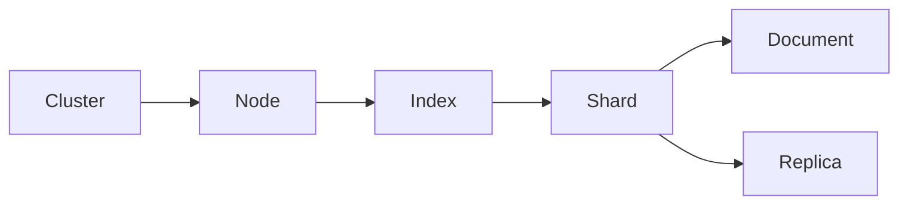

# ES搜索原理与代码实例讲解

## 1. 背景介绍
### 1.1 问题的由来
在当今大数据时代,海量数据的存储和检索成为了企业面临的一大挑战。传统的关系型数据库在处理大规模数据时性能较差,难以满足实时搜索和分析的需求。为了解决这一问题,Elasticsearch应运而生。

### 1.2 研究现状
Elasticsearch是一个基于Lucene的开源分布式搜索和分析引擎,由Elastic公司开发。它能够近乎实时地存储、搜索和分析海量数据,被广泛应用于日志分析、全文搜索、安全监控等领域。目前,Elasticsearch已成为全文搜索领域的标准解决方案之一。

### 1.3 研究意义
深入研究Elasticsearch的原理和应用,对于掌握大数据搜索技术具有重要意义。通过理解其内部机制,可以更好地利用Elasticsearch进行系统架构设计和性能优化。同时,对Elasticsearch的原理进行系统梳理,也有助于开发者快速上手并灵活运用该技术。

### 1.4 本文结构
本文将从以下几个方面对Elasticsearch进行深入探讨：

1. 介绍Elasticsearch的核心概念与技术原理
2. 阐述Elasticsearch的索引和搜索流程
3. 讲解Elasticsearch的相关数学模型和评分机制
4. 通过代码实例演示Elasticsearch的具体应用
5. 总结Elasticsearch的特点、应用场景及未来发展趋势

## 2. 核心概念与联系
要理解Elasticsearch的工作原理,首先需要了解其几个核心概念：

- 文档(Document):可以被索引的基本数据单元,以JSON格式表示。
- 索引(Index):文档的容器,类似于关系数据库中的"数据库"。
- 节点(Node):Elasticsearch集群中的一个服务器,存储数据并参与集群索引和搜索。
- 分片(Shard):将索引水平切分为多个部分的功能。
- 副本(Replica):分片的一个或多个复制,用于提高系统的容错性和处理性能。

下图展示了Elasticsearch的核心概念之间的关系:



Elasticsearch的核心是倒排索引(Inverted Index)。倒排索引以单词为关键字,记录了每个单词在文档中的位置信息,从而实现高效的全文搜索。同时,Elasticsearch采用了分布式架构设计,索引被分成多个分片,每个分片可以有多个副本,从而实现了水平扩展和高可用。

## 3. 核心算法原理 & 具体操作步骤
### 3.1 算法原理概述
Elasticsearch的核心算法主要包括:

1. 倒排索引构建算法
2. 相关性评分算法(如BM25)
3. 查询解析与优化算法
4. 文档排序算法

这些算法协同工作,共同完成文档的索引、查询和排序等功能。

### 3.2 算法步骤详解

#### 3.2.1 倒排索引构建
1. 文档分析:将文档分割成一系列词条(Term)
2. 词条归一化:对词条进行大小写转换、同义词处理、词干提取等
3. 词条索引:记录每个词条的文档ID、词频、位置等信息
4. 索引写入:将索引数据写入磁盘,以供搜索使用

#### 3.2.2 相关性评分
1. 对用户查询进行解析和分词
2. 在倒排索引中查找与查询相关的文档
3. 根据文档的词频(TF)、逆文档频率(IDF)等信息,计算每个文档的相关性得分
4. 根据相关性得分对结果进行排序

### 3.3 算法优缺点

- 优点:
  - 倒排索引使得全文搜索非常高效
  - 相关性评分提供了合理的结果排序
  - 分布式架构易于扩展,适合处理海量数据
- 缺点:
  - 实时索引更新会带来一定的性能开销
  - 占用较大的存储空间
  - 搜索结果的准确性依赖于文档分析和相关性算法的优劣

### 3.4 算法应用领域
Elasticsearch的算法广泛应用于:

- 全文搜索引擎
- 日志分析平台
- 商品推荐系统
- 安全信息和事件管理(SIEM)
- 商业智能(BI)和数据分析

## 4. 数学模型和公式 & 详细讲解 & 举例说明
### 4.1 数学模型构建
Elasticsearch的相关性评分采用了BM25模型。BM25是一种基于概率的文档排序函数,用于估计文档与查询的相关性。

### 4.2 公式推导过程
BM25的得分计算公式如下:

$score(D,Q) = \sum_{i=1}^{n} IDF(q_i) \cdot \frac{f(q_i,D) \cdot (k_1 + 1)}{f(q_i,D) + k_1 \cdot (1-b+b \cdot \frac{|D|}{avgdl})}$

其中:
- $f(q_i,D)$ 表示词条 $q_i$ 在文档 $D$ 中的词频
- $|D|$ 表示文档 $D$ 的长度
- $avgdl$ 表示文档集合的平均长度
- $k_1$、$b$ 是调节因子,控制词频和文档长度的影响力

IDF(逆文档频率)的计算公式为:

$IDF(q_i) = log \frac{N - n(q_i) + 0.5}{n(q_i) + 0.5}$

其中:
- $N$ 表示文档集合的总数
- $n(q_i)$ 表示包含词条 $q_i$ 的文档数

### 4.3 案例分析与讲解
假设有以下两个文档:

- D1: "Elasticsearch is a distributed search engine"
- D2: "Lucene is a full-text search library"

用户查询为:"search engine"

经过分词和文档分析,得到以下信息:

- 词条"search"的IDF为1.2,在D1中出现1次,在D2中出现1次
- 词条"engine"的IDF为0.8,在D1中出现1次,在D2中未出现

假设 $k_1=1.2$, $b=0.75$, 文档平均长度为10。

对于D1,有:

$score(D1,Q) = 1.2 \cdot \frac{1 \cdot 2.2}{1 + 1.2 \cdot (1-0.75+0.75 \cdot \frac{7}{10})} + 0.8 \cdot \frac{1 \cdot 2.2}{1 + 1.2 \cdot (1-0.75+0.75 \cdot \frac{7}{10})} \approx 2.06$

对于D2,有:

$score(D2,Q) = 1.2 \cdot \frac{1 \cdot 2.2}{1 + 1.2 \cdot (1-0.75+0.75 \cdot \frac{8}{10})} \approx 1.33$

因此,D1的相关性得分高于D2,搜索结果会优先返回D1。

### 4.4 常见问题解答

- 问:BM25中的 $k_1$ 和 $b$ 参数如何调优?
  答:$k_1$ 控制词频的饱和度,$k_1$ 值越大,词频的作用越明显;$b$ 控制文档长度归一化的强度,$b$ 值越大,文档长度的惩罚越大。一般情况下,$k_1$ 取1.2~2.0,$b$ 取0.75。

- 问:除了BM25,Elasticsearch还支持哪些相关性算法?
  答:Elasticsearch还支持其他相关性算法,如Divergence from Randomness(DFR)、Language Model(LM)等。可以根据实际需求选择合适的算法。

## 5. 项目实践：代码实例和详细解释说明
### 5.1 开发环境搭建
首先,需要安装并运行Elasticsearch。可以从官网下载Elasticsearch的二进制包,解压后运行以下命令启动:

```bash
./bin/elasticsearch
```

接着,安装Elasticsearch的客户端库。这里以Python为例,使用`elasticsearch`库:

```bash
pip install elasticsearch
```

### 5.2 源代码详细实现
下面通过Python代码演示Elasticsearch的基本操作:

```python
from elasticsearch import Elasticsearch

# 连接Elasticsearch
es = Elasticsearch(["http://localhost:9200"])

# 创建索引
index_name = "my_index"
if not es.indices.exists(index=index_name):
    es.indices.create(index=index_name)

# 索引文档
doc = {"title": "Elasticsearch Guide", "content": "This is a guide for Elasticsearch beginners."}
es.index(index=index_name, body=doc)

# 搜索文档
query = {"match": {"content": "Elasticsearch"}}
res = es.search(index=index_name, body={"query": query})

# 输出搜索结果
for hit in res["hits"]["hits"]:
    print(hit["_source"])
```

### 5.3 代码解读与分析

1. 首先,通过`Elasticsearch()`函数连接到本地运行的Elasticsearch实例。
2. 接着,使用`es.indices.create()`方法创建一个名为"my_index"的索引。
3. 然后,定义一个文档`doc`,包含`title`和`content`两个字段,使用`es.index()`方法将其索引到"my_index"中。
4. 在搜索阶段,构造一个`match`查询,在`content`字段中查找包含"Elasticsearch"的文档,使用`es.search()`方法执行搜索。
5. 最后,遍历搜索结果,输出每个文档的`_source`字段,即原始的JSON文档内容。

### 5.4 运行结果展示
运行上述代码,将得到类似以下的输出结果:

```
{'title': 'Elasticsearch Guide', 'content': 'This is a guide for Elasticsearch beginners.'}
```

这表明我们成功地索引了一个文档,并通过搜索查询找到了它。

## 6. 实际应用场景
Elasticsearch在实际生产中有广泛的应用,例如:

- 搜索引擎:如Wikipedia的全文搜索功能
- 日志分析:如ELK(Elasticsearch、Logstash、Kibana)技术栈,用于收集、分析和可视化各种日志数据
- 电商搜索:如商品名称、描述的搜索,以及基于用户行为的个性化推荐
- 安全分析:实时收集和分析各种安全事件,及时发现潜在的威胁

### 6.4 未来应用展望
随着数据量的不断增长和业务需求的日益复杂,Elasticsearch在未来将有更加广阔的应用前景:

1. 人工智能领域:Elasticsearch可以作为机器学习和自然语言处理的数据基础设施,为智能问答、知识图谱等应用提供支撑。
2. 物联网领域:Elasticsearch可以实时处理海量的传感器数据,实现设备监控、故障诊断等功能。
3. 医疗健康领域:Elasticsearch可以用于医学文献检索、病历分析、药物研发等,辅助医生进行临床决策。

## 7. 工具和资源推荐
### 7.1 学习资源推荐
- 官方文档:Elasticsearch提供了详尽的官方文档,包括入门教程、API参考、最佳实践等。
- 书籍:《Elasticsearch: The Definitive Guide》是学习Elasticsearch的经典书籍,由Elastic公司核心开发人员编写。
- 在线课程:Udemy、Coursera等平台上有许多关于Elasticsearch的在线课程,适合初学者快速入门。

### 7.2 开发工具推荐
- Kibana:Elastic Stack的重要组件之一,提供了对Elasticsearch数据进行可视化和管理的Web界面。
- Logstash:开源的数据处理管道,可以从多个来源采集数据,进行转换后输出到Elasticsearch等存储系统。
- Beats:轻量型数据采集器,可以将各种数据发送到Elasticsearch或Logstash进行进一步处理。

### 7.3 相关论文推荐
- "Elasticsearch: An advanced full text search database" by Bharvi Dixit, et al. 该论文系统介绍了Elasticsearch的架构和原理。
- "Comparative Study of Elasticsearch and Apache Solr" by Mita Yun, et al. 该论文对比分析了Elasticsearch和Apache Solr的异同。
- "Real-Time Full-Text Search and Analytics with Elasticsearch" by Xiaoran Wang, et al. 该论文探讨了Elasticsearch在实时全文搜索和分析方面的应用。

### 7.4 其他资源推荐
- Elasticsearch官方博