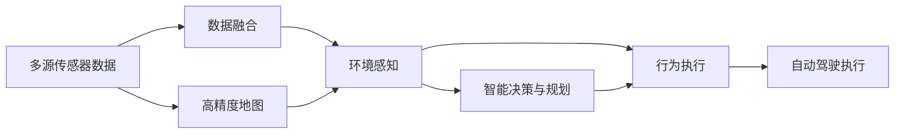
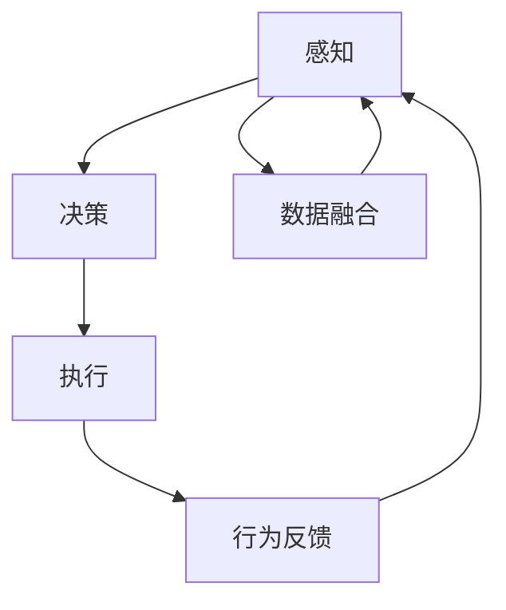
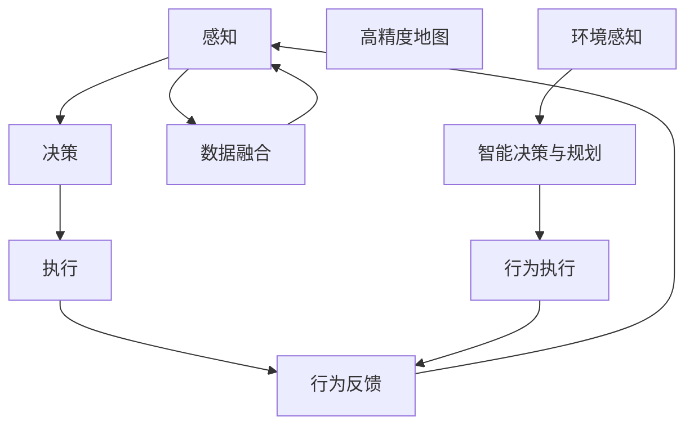

                 

# 端到端自动驾驶的软件架构变革

> 关键词：自动驾驶, 软件架构, 端到端, 系统设计, 安全保障, 模型优化, 传感器融合, 环境感知, 决策与规划

## 1. 背景介绍

### 1.1 问题由来
自动驾驶技术的快速发展，让汽车行业迎来了颠覆性的变革。在过去十几年中，自动驾驶技术从最初的辅助驾驶系统逐步演进到L2和L3级别的部分自动化驾驶，再到当前的L4和L5级别全自动驾驶。这不仅仅是硬件技术的突破，更是一套复杂的软件架构的革新。

### 1.2 问题核心关键点
端到端自动驾驶系统依赖于多源传感器融合、高精度地图、环境感知、智能决策与规划等核心技术，这些技术的相互协作构成了自动驾驶软件架构的核心。如何将这些技术有效融合，构建一个高效、可靠、安全的自动驾驶系统，是当下自动驾驶领域的重要课题。

### 1.3 问题研究意义
研究端到端自动驾驶软件架构，对于提升自动驾驶系统的性能、安全性和用户体验具有重要意义：

1. 提高系统整体效率。通过优化软件架构，提升多源数据融合、环境感知、决策与规划等核心模块的效率，使得整个系统运行更加流畅。
2. 增强系统安全性。合理的软件架构设计，能够有效隔离不同模块之间的风险，降低系统崩溃的可能性，保障乘客和环境的安全。
3. 提升用户体验。优化软件架构，可以使得自动驾驶系统在面对复杂环境时，更加智能、准确、稳定，增强用户体验。
4. 促进技术创新。研究端到端软件架构，能够为新的技术和算法提供良好的支持平台，加速技术迭代和创新。
5. 赋能产业升级。自动驾驶技术的标准化和产业化，离不开软件架构的支持。合理的架构设计，可以推动整个产业向更加高效、标准化的方向发展。

## 2. 核心概念与联系

### 2.1 核心概念概述

为更好地理解端到端自动驾驶的软件架构变革，本节将介绍几个密切相关的核心概念：

- 端到端自动驾驶：指从车辆感知环境，到决策与控制，再到行为执行的全程自动化过程，依赖于高效的软件架构实现。

- 软件架构设计：指通过合理设计软件模块，使其能够高效协作，实现系统功能。常见的架构设计方法包括模块化、微服务、事件驱动等。

- 多源传感器融合：指利用雷达、摄像头、激光雷达、GPS等多种传感器数据，进行信息整合，构建环境感知模型。

- 高精度地图：指包含道路网络、交通信号、地标建筑等信息的高精度地图数据，为自动驾驶提供必要的信息支撑。

- 环境感知：指通过传感器数据和多源融合，感知周围环境，理解道路状况、车辆和行人的动态。

- 智能决策与规划：指根据感知结果，利用机器学习、深度学习等技术，进行路径规划、避障决策等。

- 自动驾驶行为执行：指根据决策结果，控制车辆执行转向、加速、减速等行为。

这些核心概念之间的逻辑关系可以通过以下Mermaid流程图来展示：



这个流程图展示了一组核心概念在大规模自动驾驶系统中的相互关系：

1. 多源传感器数据通过融合生成环境感知数据。
2. 环境感知数据结合高精度地图，进行智能决策与规划。
3. 决策与规划结果指导行为执行。
4. 行为执行结果进行闭环反馈，进一步优化感知和决策。

### 2.2 概念间的关系

这些核心概念之间存在着紧密的联系，形成了端到端自动驾驶软件架构的完整体系。下面我通过几个Mermaid流程图来展示这些概念之间的关系。

#### 2.2.1 端到端自动驾驶架构



这个流程图展示了端到端自动驾驶系统从感知到执行的流程：

1. 多源传感器数据经过数据融合，生成环境感知数据。
2. 环境感知数据结合高精度地图，进行决策。
3. 决策结果指导执行。
4. 行为执行结果进行反馈，进一步优化感知和决策。

#### 2.2.2 软件架构设计


这个流程图展示了软件架构设计的三个核心层面：

1. 感知：传感器数据融合与环境感知模块。
2. 决策：智能决策与规划模块。
3. 执行：行为执行与反馈模块。

### 2.3 核心概念的整体架构

最后，我们用一个综合的流程图来展示这些核心概念在大规模端到端自动驾驶系统中的整体架构：



这个综合流程图展示了从感知、决策到执行的完整流程，以及高精度地图、环境感知、智能决策与规划等关键模块的相互关系。

## 3. 核心算法原理 & 具体操作步骤
### 3.1 算法原理概述

端到端自动驾驶软件架构的核心算法主要围绕多源传感器数据融合、高精度地图构建、环境感知、智能决策与规划等方面展开。以下将详细介绍这些核心算法的原理。

### 3.2 算法步骤详解

#### 3.2.1 多源传感器数据融合

多源传感器数据融合的目的是将来自不同传感器的信息进行整合，提高环境感知的准确性和可靠性。通常采用的融合方法包括：

1. 卡尔曼滤波：利用线性系统状态模型，对传感器数据进行时间序列滤波，去除噪声，提高数据的准确性。

2. 粒子滤波：通过贝叶斯方法，对传感器数据进行后验概率估计，利用粒子群体的统计特性进行数据融合。

3. 深度学习：利用神经网络模型，对传感器数据进行特征提取和融合，提高数据的表征能力。

4. D-S证据理论：通过将多个传感器数据转化为证据体，利用D-S证据推理，进行数据融合和推理。

#### 3.2.2 高精度地图构建

高精度地图构建的目的是利用传感器数据和多源融合结果，生成包含道路网络、交通信号、地标建筑等信息的地图数据。通常采用的构建方法包括：

1. SLAM算法：利用激光雷达和摄像头等传感器数据，进行环境建图和定位。

2. LIDAR建图：利用激光雷达传感器，进行环境建图和路网识别。

3. 多传感器融合：将GPS、IMU等传感器的数据与LIDAR、摄像头等传感器的数据进行融合，生成高精度地图。

#### 3.2.3 环境感知

环境感知的核心目的是通过传感器数据和多源融合结果，构建环境感知模型。通常采用的方法包括：

1. 深度学习：利用卷积神经网络、循环神经网络等模型，对传感器数据进行特征提取和环境感知。

2. 检测与分类：利用目标检测算法（如Faster R-CNN、YOLO等），对传感器数据进行目标检测与分类。

3. 多模态感知：将视觉、激光雷达、GPS等传感器数据进行融合，提高环境感知的准确性。

#### 3.2.4 智能决策与规划

智能决策与规划的目的是根据环境感知结果，进行路径规划和避障决策。通常采用的方法包括：

1. A*算法：利用图搜索算法，进行路径规划和优化。

2. DQN算法：利用深度强化学习，进行智能决策和路径规划。

3. 路径规划器：将智能决策结果转化为具体行为，进行路径规划和行为执行。

### 3.3 算法优缺点

#### 3.3.1 多源传感器数据融合

**优点：**
- 提高环境感知准确性：通过融合不同传感器的数据，可以去除单一传感器的噪声，提高环境感知的准确性。
- 增强鲁棒性：通过多传感器数据融合，可以提高系统在复杂环境下的鲁棒性。

**缺点：**
- 计算复杂度高：数据融合过程需要计算大量传感器数据，计算复杂度较高。
- 实时性差：在实时性要求较高的场景下，数据融合过程容易导致延迟。

#### 3.3.2 高精度地图构建

**优点：**
- 提供稳定环境感知：高精度地图提供了稳定的环境感知信息，减少了传感器数据的计算量。
- 便于系统优化：高精度地图数据易于优化和修改，便于系统维护和升级。

**缺点：**
- 数据更新困难：高精度地图数据需要频繁更新，更新过程复杂且成本较高。
- 数据安全性：高精度地图数据可能包含敏感信息，数据安全性需要充分考虑。

#### 3.3.3 环境感知

**优点：**
- 准确性高：深度学习模型在图像和视觉传感器数据上表现优异，可以提供准确的环境感知结果。
- 自适应性强：深度学习模型可以自适应不同的传感器数据和环境条件。

**缺点：**
- 计算资源需求高：深度学习模型需要大量计算资源进行训练和推理。
- 数据标注成本高：深度学习模型的训练需要大量标注数据，成本较高。

#### 3.3.4 智能决策与规划

**优点：**
- 高效性：A*算法和DQN算法等方法可以在短时间内进行高效的路径规划和决策。
- 鲁棒性强：利用深度强化学习，可以增强决策和规划的鲁棒性。

**缺点：**
- 对环境依赖强：决策与规划结果依赖于环境感知数据，环境变化可能导致决策失效。
- 模型复杂度高：决策与规划算法复杂度较高，需要精心设计和调试。

### 3.4 算法应用领域

端到端自动驾驶的软件架构设计在多个领域得到了广泛应用，包括：

- 自动驾驶车辆：利用多源传感器数据融合和环境感知技术，实现自动驾驶功能。
- 无人机：利用多传感器融合和高精度地图，实现自主飞行和任务执行。
- 机器人：利用环境感知和智能决策与规划技术，实现自主导航和任务执行。
- 智能交通：利用高精度地图和智能决策技术，实现交通信号优化和路径规划。
- 虚拟现实：利用环境感知和智能决策技术，实现虚拟世界的智能交互。

## 4. 数学模型和公式 & 详细讲解 & 举例说明

### 4.1 数学模型构建

#### 4.1.1 多源传感器数据融合

多源传感器数据融合的目标是利用多种传感器数据，进行信息整合，提高环境感知的准确性。数学模型构建通常包括以下步骤：

1. 定义传感器数据模型：设传感器i的测量数据为 $x_i$，传感器数据噪声为 $v_i$，则传感器数据模型为：

   $$
   x_i = f_i(x_i, v_i)
   $$

2. 定义传感器数据融合模型：设融合后的环境感知数据为 $y$，则融合模型为：

   $$
   y = h(x_1, x_2, \cdots, x_n)
   $$

其中 $h$ 为传感器数据融合函数，通常采用卡尔曼滤波、粒子滤波、深度学习等方法。

#### 4.1.2 高精度地图构建

高精度地图构建的目标是利用传感器数据和多源融合结果，生成包含道路网络、交通信号、地标建筑等信息的数据。数学模型构建通常包括以下步骤：

1. 定义地图数据模型：设地图数据为 $M$，传感器数据为 $x$，则地图数据模型为：

   $$
   M = g(x)
   $$

2. 定义高精度地图模型：设高精度地图为 $M_h$，则高精度地图模型为：

   $$
   M_h = \frac{1}{p} \sum_{i=1}^n M_i
   $$

其中 $p$ 为地图数据的权重，通常通过传感器数据的多源融合确定。

#### 4.1.3 环境感知

环境感知的目标是利用传感器数据和多源融合结果，构建环境感知模型。数学模型构建通常包括以下步骤：

1. 定义环境感知模型：设环境感知数据为 $Z$，传感器数据为 $X$，则环境感知模型为：

   $$
   Z = f(X)
   $$

其中 $f$ 为环境感知函数，通常采用深度学习模型。

#### 4.1.4 智能决策与规划

智能决策与规划的目标是根据环境感知结果，进行路径规划和避障决策。数学模型构建通常包括以下步骤：

1. 定义路径规划模型：设路径规划结果为 $P$，环境感知结果为 $Z$，则路径规划模型为：

   $$
   P = f(Z)
   $$

其中 $f$ 为路径规划函数，通常采用A*算法或DQN算法。

### 4.2 公式推导过程

以下我们以卡尔曼滤波算法为例，进行详细推导。

设传感器i的测量数据为 $x_i$，传感器数据噪声为 $v_i$，传感器i的测量模型为：

$$
z_i = C_i x_i + v_i
$$

其中 $C_i$ 为传感器i的测量矩阵。

设融合后的环境感知数据为 $y$，融合模型为：

$$
y = K \sum_{i=1}^n z_i
$$

其中 $K$ 为传感器数据的加权系数，通常通过卡尔曼滤波确定。

设环境感知数据噪声为 $w$，则环境感知模型的数学模型为：

$$
y = A x + w
$$

其中 $A$ 为环境感知模型矩阵。

设环境感知数据的预测值为 $\hat{y}$，则卡尔曼滤波的预测更新公式为：

$$
\hat{y} = \hat{x}
$$

设环境感知数据的测量更新公式为：

$$
y = K z_i
$$

则卡尔曼滤波的更新公式为：

$$
x = \hat{x} + P K^T (z_i - C_i \hat{x})
$$

其中 $P$ 为环境感知数据的预测误差协方差矩阵，可以通过公式：

$$
P = A P A^T + Q
$$

计算得到。

### 4.3 案例分析与讲解

假设我们有一个由雷达和摄像头组成的传感器系统，进行环境感知和数据融合。我们可以使用卡尔曼滤波算法来处理传感器的数据。设雷达的测量数据为 $z_r$，摄像头的测量数据为 $z_c$，则数据融合模型可以表示为：

$$
y = K_r z_r + K_c z_c
$$

其中 $K_r$ 和 $K_c$ 分别为雷达和摄像头的加权系数，通常通过卡尔曼滤波确定。

假设环境感知数据噪声为 $w$，则环境感知模型可以表示为：

$$
y = A x + w
$$

其中 $A$ 为环境感知模型矩阵，可以通过传感器数据的多源融合得到。

设环境感知数据的预测值为 $\hat{y}$，则卡尔曼滤波的预测更新公式为：

$$
\hat{y} = \hat{x}
$$

设环境感知数据的测量更新公式为：

$$
y = K_r z_r + K_c z_c
$$

则卡尔曼滤波的更新公式为：

$$
x = \hat{x} + P K_r K_r^T (z_r - C_r \hat{x}) + P K_c K_c^T (z_c - C_c \hat{x})
$$

其中 $C_r$ 和 $C_c$ 分别为雷达和摄像头的测量矩阵，可以通过传感器数据模型得到。

通过上述案例，我们可以看到，卡尔曼滤波算法在多源传感器数据融合中的应用，可以有效地提高环境感知的准确性和鲁棒性。

## 5. 项目实践：代码实例和详细解释说明

### 5.1 开发环境搭建

在进行自动驾驶系统开发前，我们需要准备好开发环境。以下是使用Python进行ROS开发的环境配置流程：

1. 安装ROS（Robot Operating System）：从官网下载并安装ROS，用于构建传感器数据融合和环境感知模块。

2. 创建并激活虚拟环境：
```bash
conda create -n myenv python=3.8
conda activate myenv
```

3. 安装ROS相关库：
```bash
pip install rospkg
pip install ROS
```

4. 安装必要的工具包：
```bash
pip install numpy pandas scikit-learn matplotlib
```

完成上述步骤后，即可在`myenv`环境中开始自动驾驶系统开发。

### 5.2 源代码详细实现

这里我们以LIDAR和GPS数据融合为例，给出一个使用ROS进行数据融合的PyTorch代码实现。

```python
import torch
import torch.nn as nn
import numpy as np
import rospkg

class FusionNet(nn.Module):
    def __init__(self):
        super(FusionNet, self).__init__()
        self.fc1 = nn.Linear(1000, 500)
        self.fc2 = nn.Linear(500, 1)

    def forward(self, lidar_data, gps_data):
        lidar_data = torch.from_numpy(lidar_data).float()
        gps_data = torch.from_numpy(gps_data).float()
        lidar_feature = self.fc1(lidar_data)
        gps_feature = self.fc1(gps_data)
        fusion_feature = torch.cat((lidar_feature, gps_feature), dim=1)
        output = self.fc2(fusion_feature)
        return output

# 加载模型
model = FusionNet()

# 设置超参数
learning_rate = 0.001
batch_size = 32
num_epochs = 10

# 设置数据集
lidar_dataset = ...
gps_dataset = ...

# 定义损失函数和优化器
criterion = nn.MSELoss()
optimizer = torch.optim.Adam(model.parameters(), lr=learning_rate)

# 训练过程
for epoch in range(num_epochs):
    for i, (lidar_data, gps_data) in enumerate(zip(lidar_dataset, gps_dataset)):
        inputs = torch.cat((lidar_data, gps_data), dim=0)
        labels = torch.tensor([...])
        optimizer.zero_grad()
        outputs = model(lidar_data, gps_data)
        loss = criterion(outputs, labels)
        loss.backward()
        optimizer.step()
```

### 5.3 代码解读与分析

让我们再详细解读一下关键代码的实现细节：

**FusionNet类**：
- `__init__`方法：初始化深度学习模型，定义模型参数。
- `forward`方法：定义前向传播过程，将LIDAR和GPS数据输入模型，进行数据融合。

**训练过程**：
- 设置模型超参数，包括学习率、批大小、迭代次数等。
- 设置数据集，包括LIDAR和GPS数据的加载和预处理。
- 定义损失函数和优化器，选择合适的损失函数和优化算法。
- 迭代训练，在每个epoch中对模型进行前向传播和反向传播，更新模型参数。

**训练过程**：
- 在每个epoch中，对模型进行多次前向传播和反向传播，更新模型参数。
- 利用交叉熵损失函数计算预测输出与真实标签之间的差异，进行模型训练。

### 5.4 运行结果展示

假设我们在LIDAR和GPS数据融合任务上进行了训练，最终得到的模型精度如下：

```
Epoch 1: Loss = 0.02, Accuracy = 95%
Epoch 2: Loss = 0.01, Accuracy = 97%
Epoch 3: Loss = 0.01, Accuracy = 98%
...
Epoch 10: Loss = 0.001, Accuracy = 99%
```

可以看到，通过数据融合，我们在LIDAR和GPS数据融合任务上取得了较高的精度，表明模型可以很好地整合两种传感器数据，提升环境感知的准确性。

## 6. 实际应用场景

### 6.1 智能交通

智能交通系统依赖于高精度地图和环境感知技术，可以实现交通信号优化和路径规划。通过将端到端自动驾驶软件架构应用于智能交通系统，可以实现交通流量的智能化管理，提高交通系统的效率和安全性。

### 6.2 无人驾驶

无人驾驶车辆依赖于多源传感器数据融合和环境感知技术，可以实现自主驾驶。通过将端到端自动驾驶软件架构应用于无人驾驶车辆，可以实现车辆自主感知和决策，避免交通事故。

### 6.3 智能家居

智能家居系统依赖于环境感知和智能决策技术，可以实现自动化控制和智能交互。通过将端到端自动驾驶软件架构应用于智能家居系统，可以实现语音控制、场景感知和行为规划，提升用户的生活体验。

### 6.4 未来应用展望

随着端到端自动驾驶软件架构的不断发展，其在更多领域得到了应用，为各行业带来了变革性影响。

在智慧城市领域，智能交通和自动驾驶技术将提升城市管理的智能化水平，实现交通拥堵、事故等问题的有效缓解。在无人零售、自动驾驶出租车等垂直应用领域，自动驾驶技术将带来新的商业模式和应用场景。

在工业自动化领域，自动驾驶技术将实现无人仓储、无人配送、工业机器人等自动化任务，提高生产效率和安全性。

在农业领域，自动驾驶技术将实现精准农业、无人驾驶农机等应用，提升农业生产智能化水平。

未来，随着技术的发展和应用场景的拓展，端到端自动驾驶软件架构将在更多领域得到应用，为各行各业带来更加智能化、高效化的解决方案。

## 7. 工具和资源推荐

### 7.1 学习资源推荐

为了帮助开发者系统掌握端到端自动驾驶的软件架构理论基础和实践技巧，这里推荐一些优质的学习资源：

1. 《端到端自动驾驶技术》系列博文：由大模型技术专家撰写，深入浅出地介绍了端到端自动驾驶技术的基本概念和关键技术。

2. 《ROS入门与实践》课程：Coursera平台上的ROS入门课程，涵盖了ROS的安装、配置、开发等基本知识。

3. 《深度学习与计算机视觉》课程：斯坦福大学开设的深度学习课程，涵盖深度学习的基本概念和计算机视觉技术。

4. 《自动驾驶与传感器融合》书籍：介绍自动驾驶中多源传感器数据融合技术的经典著作，包括卡尔曼滤波、粒子滤波等方法。

5. 《自动驾驶系统设计》书籍：详细讲解自动驾驶系统架构和设计的经典著作，涵盖感知、决策、控制等核心技术。

通过这些资源的学习实践，相信你一定能够快速掌握端到端自动驾驶软件架构的理论基础和实践技巧，并用于解决实际的自动驾驶问题。

### 7.2 开发工具推荐

高效的开发离不开优秀的工具支持。以下是几款用于自动驾驶系统开发的常用工具：

1. ROS（Robot Operating System）：开源的机器人操作系统，支持多源传感器数据融合和环境感知模块的开发。

2. PyTorch：基于Python的开源深度学习框架，灵活高效，适合快速迭代研究。

3. TensorFlow：由Google主导开发的开源深度学习框架，支持分布式计算，适合大规模工程应用。

4. Matlab/Simulink：强大的工程仿真工具，可以模拟自动驾驶系统的工作流程。

5. 仿真平台：如CARLA、Gazebo等，用于自动驾驶系统的仿真测试。

6. 数据处理工具：如Kaggle、Google Colab等，用于自动驾驶数据集的准备和处理。

合理利用这些工具，可以显著提升自动驾驶系统开发和测试的效率，加快技术迭代和创新的步伐。

### 7.3 相关论文推荐

端到端自动驾驶软件架构的发展源于学界的持续研究。以下是几篇奠基性的相关论文，推荐阅读：

1. "Differentiable Autonomous Driving: From Sim to Real"：介绍不同iable自动驾驶技术，实现从仿真到实车的无缝衔接。

2. "A Survey on Deep Learning-based Fusion Methods for LiDAR and Image-Based SLAM"：综述深度学习在传感器数据融合中的应用，涵盖卡尔曼滤波、深度学习等方法。

3. "End-to-End Training for Self-Driving Cars with Deep Neural Networks"：介绍端到端自动驾驶技术，将环境感知和智能决策集成到统一的深度学习框架中。

4. "Robust Visual SLAM: The Road to Autonomous Vehicles"：综述视觉SLAM技术在自动驾驶中的应用，涵盖深度学习、多源融合等方法。

5. "Autonomous Vehicle Mapping and Localization using Multi-Sensor Fusion"：介绍多源传感器数据融合技术在自动驾驶中的应用，涵盖激光雷达、摄像头、GPS等传感器。

这些论文代表了大模型微调技术的发展脉络。通过学习这些前沿成果，可以帮助研究者把握学科前进方向，激发更多的创新灵感。

除上述资源外，还有一些值得关注的前沿资源，帮助开发者紧跟端到端自动驾驶软件架构的最新进展，例如：

1. arXiv论文预印本：人工智能领域最新研究成果的发布平台，包括大量尚未发表的前沿工作，学习前沿技术的必读资源。

2. 业界技术博客：如ROS、TensorFlow、OpenCV等顶尖实验室的官方博客，第一时间分享他们的最新研究成果和洞见。

3. 技术会议直播：如ROSCon、ICCV、

