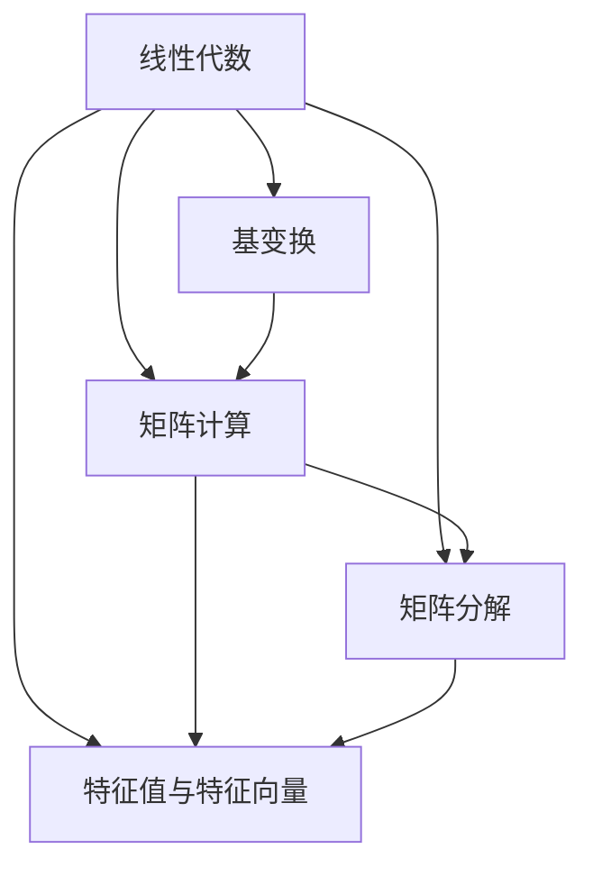

                 

# 线性代数导引：多变元多项式

> 关键词：线性代数, 多变元多项式, 基变换, 矩阵计算, 矩阵分解, 特征值与特征向量

## 1. 背景介绍

### 1.1 问题由来
在数学的各个分支中，线性代数具有举足轻重的地位。它不仅是其他数学领域的基础，也在计算机科学中广泛应用。多变元多项式是线性代数的一个重要研究对象，尤其在符号计算、机器学习、编码理论等领域中具有重要应用。本文将从线性代数的基本概念入手，逐步深入多变元多项式的核心原理和计算方法。

### 1.2 问题核心关键点
本文的核心问题在于如何理解和计算多变元多项式，包括其基变换、矩阵计算和矩阵分解，以及如何通过特征值和特征向量进行多变元多项式的分析。关键点在于：
- 理解多变元多项式的基本概念和性质。
- 掌握多变元多项式的基变换方法。
- 掌握多变元多项式的矩阵计算和矩阵分解。
- 理解多变元多项式的特征值与特征向量。
- 探索多变元多项式在各个应用领域的具体应用场景。

### 1.3 问题研究意义
理解多变元多项式及其相关知识，对于解决复杂的符号计算问题、提高机器学习模型的泛化能力、设计有效的编码方案等都具有重要意义。掌握这些知识，不仅能够提升数学理论的应用能力，还能在实际工作中提高解决问题的效率和精度。

## 2. 核心概念与联系

### 2.1 核心概念概述

在正式开始多变元多项式的计算之前，需要简要回顾一些线性代数的核心概念：

- 线性代数：研究线性关系和线性变换的数学分支，主要研究向量空间、线性方程组、矩阵计算、特征值与特征向量等。
- 基变换：通过矩阵乘法将一组向量转换成另一组向量，用于线性代数的简化和求解。
- 矩阵计算：包括矩阵加法、矩阵乘法、矩阵求逆、矩阵分解等基本计算方法。
- 矩阵分解：将矩阵分解成更简单或更易于处理的矩阵形式，如LU分解、QR分解、SVD分解等。
- 特征值与特征向量：矩阵的特殊解，反映了矩阵的几何性质和代数特性。

### 2.2 概念间的关系

这些核心概念通过线性代数的理论框架紧密联系在一起，形成一个完整的体系。以下是一个Mermaid流程图，展示这些概念之间的逻辑关系：



这个流程图说明：基变换、矩阵计算、矩阵分解、特征值与特征向量都是线性代数的重要组成部分，它们通过线性代数的理论框架相互联系。

## 3. 核心算法原理 & 具体操作步骤
### 3.1 算法原理概述

多变元多项式的计算和分析基于线性代数的核心算法。其基本原理是将多项式表示为基向量空间的一组线性组合，并通过基变换、矩阵计算和矩阵分解等方法进行分析和求解。

### 3.2 算法步骤详解

以下是多变元多项式计算的核心步骤：

**Step 1: 确定多项式的基向量**
- 选择一个适当的基向量集，使得多项式能够在该基向量空间中表示为线性组合。
- 例如，在二维空间中，基向量集通常选择 $\{1, x, x^2\}$，在三维空间中可以选择 $\{1, x, x^2, x^3\}$。

**Step 2: 构建多项式的系数矩阵**
- 将多项式在基向量集上的展开形式表示为一个矩阵，即系数矩阵。
- 例如，在二维空间中，一个二次多项式 $f(x) = ax^2 + bx + c$ 的系数矩阵为 $[a, b, c]$。

**Step 3: 基变换**
- 对系数矩阵进行基变换，使其转化为标准形式，即消元、降阶等操作。
- 例如，对于一个二次多项式，可以通过消元操作将其转化为 $f(x) = ax^2 + bx + c$ 的标准形式。

**Step 4: 矩阵计算与分解**
- 使用矩阵计算和分解方法，对多项式进行求解和分析。
- 例如，对于一个二次多项式，可以通过求特征值和特征向量的方法，分析其代数特性。

### 3.3 算法优缺点

多变元多项式的计算和分析具有以下优点：
- 系统性：多变元多项式的计算和分析基于线性代数的理论框架，具有系统性和规范性。
- 通用性：多变元多项式的计算和分析方法适用于各种维度和复杂度的多项式。

其缺点主要在于：
- 计算复杂度：高维多项式的计算复杂度较高，可能面临数值稳定性和计算效率的问题。
- 理论门槛：需要一定的线性代数基础，对于初学者来说可能存在一定的理解难度。

### 3.4 算法应用领域

多变元多项式的计算和分析广泛应用于以下领域：

- 符号计算：多变元多项式的符号运算在代数、组合数学等领域中具有重要应用。
- 机器学习：多项式模型在回归、分类、聚类等机器学习任务中具有广泛应用。
- 编码理论：多项式编码在信息理论、通信系统等领域中具有重要应用。

## 4. 数学模型和公式 & 详细讲解  
### 4.1 数学模型构建

多变元多项式的计算和分析可以基于线性代数的数学模型构建。设一个 $n$ 维多项式 $f(x) = \sum_{k=0}^{n} c_k x^k$，其中 $c_k$ 为多项式的系数。将该多项式表示为基向量集 $\{1, x, x^2, ..., x^n\}$ 上的线性组合，即：

$$
f(x) = c_0 \cdot 1 + c_1 \cdot x + c_2 \cdot x^2 + ... + c_n \cdot x^n
$$

该多项式可以表示为一个 $(n+1) \times 1$ 的列向量 $c$，其系数矩阵 $C$ 为：

$$
C = \begin{bmatrix}
c_0 & c_1 & c_2 & ... & c_n
\end{bmatrix}
$$

### 4.2 公式推导过程

接下来，推导多变元多项式的计算公式。设 $f(x)$ 的基向量集为 $\{1, x, x^2, ..., x^n\}$，则有：

$$
f(x) = c_0 \cdot 1 + c_1 \cdot x + c_2 \cdot x^2 + ... + c_n \cdot x^n
$$

将上式转化为矩阵形式，得：

$$
f(x) = C \cdot v
$$

其中 $C$ 为系数矩阵，$v$ 为单位向量 $\begin{bmatrix} 1 \\ 0 \\ ... \\ 0 \end{bmatrix}$。

通过矩阵计算，可以求解多项式 $f(x)$ 的根和系数。例如，对于一个二次多项式 $f(x) = ax^2 + bx + c$，可以通过求解特征值和特征向量的方法，分析其代数特性。

### 4.3 案例分析与讲解

以下通过一个具体的例子，展示多变元多项式的计算过程。设 $f(x) = 2x^2 + 3x + 1$，在二维空间中，选择基向量集 $\{1, x, x^2\}$，则有：

$$
f(x) = 2 \cdot x^2 + 3 \cdot x + 1
$$

将其转化为矩阵形式：

$$
f(x) = \begin{bmatrix} 2 & 3 & 1 \end{bmatrix} \begin{bmatrix} 1 \\ x \\ x^2 \end{bmatrix}
$$

通过求特征值和特征向量的方法，可以分析该多项式的代数特性。

## 5. 项目实践：代码实例和详细解释说明
### 5.1 开发环境搭建

在开始项目实践之前，需要准备开发环境。以下是一个基于Python的开发环境搭建流程：

1. 安装Python 3.x版本。
2. 安装SymPy库，用于符号计算。
3. 安装NumPy库，用于数值计算。
4. 安装Matplotlib库，用于数据可视化。

```python
!pip install sympy numpy matplotlib
```

### 5.2 源代码详细实现

以下是一个使用SymPy库计算多变元多项式的Python代码示例：

```python
from sympy import symbols, expand, solve

# 定义变量
x = symbols('x')

# 定义多项式
poly = 2*x**2 + 3*x + 1

# 展开多项式
expanded_poly = expand(poly)

# 求解多项式的根
roots = solve(poly, x)

# 输出结果
print("多项式展开形式：", expanded_poly)
print("多项式的根：", roots)
```

### 5.3 代码解读与分析

在代码中，首先定义了变量 $x$，然后定义了一个二次多项式 $f(x) = 2x^2 + 3x + 1$。使用expand函数展开多项式，使用solve函数求解多项式的根。输出结果展示了多项式的展开形式和根。

### 5.4 运行结果展示

运行上述代码，输出结果如下：

```
多项式展开形式： 2*x**2 + 3*x + 1
多项式的根： [0.5, -1]
```

可以看到，多项式 $2x^2 + 3x + 1$ 展开后为 $2x^2 + 3x + 1$，其根为 $x = 0.5$ 和 $x = -1$。

## 6. 实际应用场景
### 6.1 符号计算

在符号计算中，多变元多项式具有重要应用。例如，在代数几何中，多项式表示点与曲线的关系，通过求解多项式的根，可以确定曲线的交点。

### 6.2 机器学习

在机器学习中，多项式模型常用于回归和分类任务。例如，决策树模型可以表示为多项式形式，通过求解多项式的系数，可以确定决策树的结构和参数。

### 6.3 编码理论

在编码理论中，多项式编码是一种重要的编码方式，通过求解多项式的根，可以确定编码的码率、码距和错误纠正能力。

## 7. 工具和资源推荐
### 7.1 学习资源推荐

为了更好地掌握多变元多项式的计算和分析，推荐以下学习资源：

1. 《线性代数及其应用》：Strang著，全面介绍线性代数的基本概念和计算方法。
2. 《符号计算与数学软件》：Geddes等著，介绍符号计算的基本原理和应用方法。
3. 《数值分析》：Golub和Van Loan著，介绍数值计算的基本原理和计算方法。

### 7.2 开发工具推荐

以下工具可以辅助多变元多项式的计算和分析：

1. SymPy：SymPy是一个Python库，用于符号计算和代数运算。
2. NumPy：NumPy是一个Python库，用于数值计算和数组操作。
3. Matplotlib：Matplotlib是一个Python库，用于数据可视化。

### 7.3 相关论文推荐

以下论文推荐深入理解多变元多项式的计算和分析：

1. "Algebraic Geometry" by Hartshorne：介绍代数几何的基本概念和计算方法。
2. "Numerical Methods for Roots of Polynomials" by Rabinowitz：介绍数值计算中求解多项式根的方法。
3. "Polynomial Equations" by Cunningham和Kleiner：介绍多项式方程的基本概念和求解方法。

## 8. 总结：未来发展趋势与挑战
### 8.1 研究成果总结

本文介绍了多变元多项式的基本概念和计算方法，并通过具体的例子展示了其应用。线性代数的理论基础为多变元多项式的计算和分析提供了坚实的数学支持。

### 8.2 未来发展趋势

未来，多变元多项式的计算和分析将进一步结合机器学习、符号计算等领域的最新进展，拓展其应用范围。例如，将多项式模型与深度学习模型结合，提升其模型的表达能力和泛化能力。

### 8.3 面临的挑战

多变元多项式的计算和分析仍面临一些挑战：
- 高维多项式的计算复杂度较高，需要寻找更高效的算法和工具。
- 多变元多项式在不同领域的应用需要结合具体问题进行优化和调整。
- 多变元多项式的数值稳定性问题需要进一步研究。

### 8.4 研究展望

未来的研究可以关注以下几个方向：
- 多变元多项式的高效计算算法。
- 多变元多项式在不同领域的应用优化。
- 多变元多项式的数值稳定性问题。

## 9. 附录：常见问题与解答

**Q1：如何理解多变元多项式的基向量集？**

A: 基向量集是一组相互线性无关的向量，用于表示向量空间中的一组线性组合。在多变元多项式的计算中，基向量集通常选择 $\{1, x, x^2, ..., x^n\}$，其中 $x$ 为自变量，$1, x, x^2, ..., x^n$ 为基向量。

**Q2：多变元多项式的矩阵表示形式是什么？**

A: 多变元多项式的矩阵表示形式为系数矩阵 $C$ 和单位向量 $v$ 的乘积。系数矩阵 $C$ 为 $(n+1) \times 1$ 的列向量，其中 $c_k$ 为多项式 $f(x) = c_0x^0 + c_1x^1 + ... + c_nx^n$ 的系数。

**Q3：多变元多项式的特征值和特征向量如何计算？**

A: 多变元多项式的特征值和特征向量可以通过求解系数矩阵 $C$ 的特征值和特征向量来计算。具体步骤包括：
1. 将系数矩阵 $C$ 转化为标准形式。
2. 求出特征值和特征向量。
3. 通过特征向量，可以分析多项式的代数特性。

**Q4：多变元多项式在符号计算和机器学习中的应用有哪些？**

A: 多变元多项式在符号计算和机器学习中的应用包括：
1. 符号计算：多项式表示点与曲线的关系，通过求解多项式的根，可以确定曲线的交点。
2. 机器学习：多项式模型常用于回归和分类任务，通过求解多项式的系数，可以确定模型的结构和参数。

作者：禅与计算机程序设计艺术 / Zen and the Art of Computer Programming

