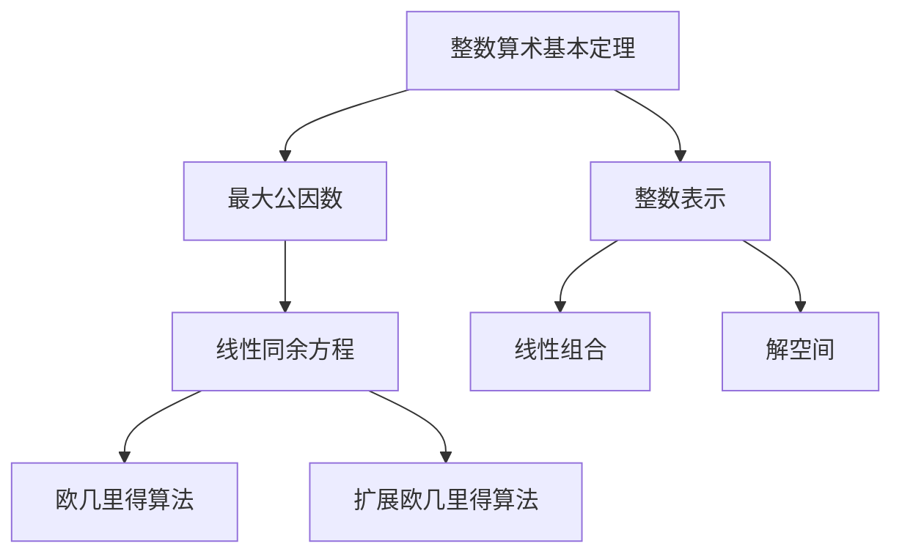
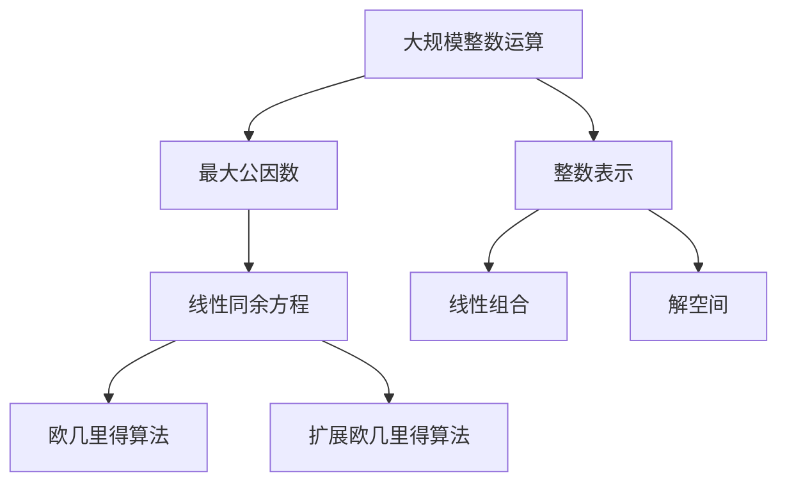

                 

# 线性代数导引：整数算术基本定理

> 关键词：线性代数,整数算术,基本定理,数学模型,矩阵分解,行列式,高斯消元

## 1. 背景介绍

### 1.1 问题由来
整数算术基本定理，也称为裴蜀定理，是数学中的一个基础定理，广泛应用于数论、代数学和计算机科学等领域。特别是在计算机科学中，整数算术基本定理作为算法设计和优化的重要工具，有着广泛的应用。

### 1.2 问题核心关键点
整数算术基本定理的核心内容是：对于任意整数$a$和$b$，如果它们存在最大公因数$d$，则任意整数$a$和$b$可以表示为$d$的倍数，即存在整数$x$和$y$使得$a=xd$，$b=yd$。这个定理在数论中有着广泛的应用，如求解不定方程、判断素数等。

在计算机科学中，整数算术基本定理被广泛应用于算法设计中，如欧几里得算法求最大公约数、扩展欧几里得算法求解线性同余方程等。同时，整数算术基本定理也是密码学中的重要工具，如RSA加密算法中就利用了最大公约数的性质。

### 1.3 问题研究意义
整数算术基本定理作为数学中的基本定理，具有重要的理论意义。在实际应用中，它不仅用于算法设计和优化，还能帮助人们更好地理解和处理整数运算的性质和规律。掌握整数算术基本定理，对于学习数学和计算机科学的高级内容具有重要意义。

## 2. 核心概念与联系

### 2.1 核心概念概述

为了更好地理解整数算术基本定理，我们先回顾一下相关的基础概念：

- 最大公因数：对于两个整数$a$和$b$，它们的最大公因数是能同时整除$a$和$b$的最大正整数$d$，记作$gcd(a,b)$。
- 线性同余方程：形如$a \equiv b \mod n$的方程，表示$a$与$b$除以$n$的余数相等。
- 扩展欧几里得算法：用于求解线性同余方程的算法，能够同时找到一组解$(x,y)$和一个整数$m$，使得$ax+by=m$。
- 裴蜀定理：描述整数$a$和$b$的最大公因数与其线性组合的性质的定理。

### 2.2 概念间的关系

整数算术基本定理与上述概念紧密相关。具体而言：

- 最大公因数是整数算术基本定理的核心，通过求取最大公因数，可以确定整数$a$和$b$能否表示为彼此的整数倍。
- 线性同余方程的解法常常基于整数算术基本定理。例如，欧几里得算法就是通过求解$a$和$b$的最大公因数来确定线性同余方程的解。
- 扩展欧几里得算法是求解线性同余方程的高级算法，它利用了整数算术基本定理的性质，能够同时找到一组解$(x,y)$和一个整数$m$，使得$ax+by=m$。

这些概念之间的逻辑关系可以通过以下Mermaid流程图来展示：



这个流程图展示了几者之间的联系：

1. 整数算术基本定理描述了整数$a$和$b$的最大公因数与其线性组合的性质。
2. 最大公因数是整数算术基本定理的核心。
3. 线性同余方程的解法常常基于整数算术基本定理。
4. 扩展欧几里得算法是求解线性同余方程的高级算法，它利用了整数算术基本定理的性质。

### 2.3 核心概念的整体架构

最后，我们用一个综合的流程图来展示这些核心概念在大规模整数运算中的应用：



这个综合流程图展示了从最大公因数到线性同余方程，再到扩展欧几里得算法的过程，以及这些算法在整数运算中的应用。

## 3. 核心算法原理 & 具体操作步骤

### 3.1 算法原理概述

整数算术基本定理的证明基于欧几里得算法。该算法的基本思想是通过迭代求解两个整数的最大公因数，并利用这个最大公因数来表示任意整数。

具体而言，对于任意整数$a$和$b$，我们首先计算它们的余数$r=a \mod b$，然后递归地计算$b$和$r$的最大公因数，直到余数为$0$，此时$b$就是$a$和$b$的最大公因数。

### 3.2 算法步骤详解

以下是对整数算术基本定理的详细算法步骤：

**Step 1: 初始化**
- 令$a_0=a$，$b_0=b$，$r_0=a \mod b$，$d_0=1$。

**Step 2: 迭代求解**
- 令$k=1$，重复以下步骤直到$r_k=0$：
  1. 令$a_k=b_k$，$b_k=r_k$，$r_k=r_{k-1} \mod b_{k-1}$。
  2. 令$d_k=d_{k-1}$。

**Step 3: 结束**
- 当$r_k=0$时，$d_k$就是$a$和$b$的最大公因数。
- 由于$r_k=0$，所以存在整数$x$和$y$使得$a=bx+d$，$b=-r_{k-1}$。
- 因此，$a$和$b$可以表示为它们的最大公因数的倍数，即$a=xd$，$b=yd$。

### 3.3 算法优缺点

整数算术基本定理的优点包括：

1. 算法简单高效。欧几里得算法只需要常数次迭代，就可以求出最大公因数。
2. 适用范围广泛。整数算术基本定理不仅适用于正整数，也适用于负整数和零。
3. 提供整数表示法。算法中$x$和$y$的求解提供了$a$和$b$的整数表示法。

同时，整数算术基本定理也存在一些缺点：

1. 只能求解两个整数的最大公因数。对于多个整数的最大公因数求解，需要进一步扩展。
2. 对于特殊情况（如$b=0$），算法需要特殊处理。
3. 对于大整数的求解，需要高精度的计算支持。

### 3.4 算法应用领域

整数算术基本定理在数学和计算机科学中有着广泛的应用。以下是几个典型的应用领域：

- 数论：用于求解不定方程、判断素数、计算斐波那契数列等。
- 密码学：RSA加密算法中，整数算术基本定理用于判断素数和求解模幂运算。
- 线性代数：矩阵分解中，整数算术基本定理用于求解线性同余方程组。
- 计算机科学：算法设计中，整数算术基本定理用于求解最大公约数、线性同余方程等。

## 4. 数学模型和公式 & 详细讲解 & 举例说明

### 4.1 数学模型构建

整数算术基本定理的数学模型可以表示为：

- $a=xd$，$b=yd$
- $gcd(a,b)=d$

其中，$a$和$b$为任意整数，$d$为它们的最大公因数，$x$和$y$为满足上述条件的整数。

### 4.2 公式推导过程

对于任意整数$a$和$b$，利用欧几里得算法，我们可以得到：

- $r_k=a_k \mod b_k$
- $a_{k+1}=b_k$
- $b_{k+1}=r_k$

其中$a_0=a$，$b_0=b$，$r_0=a \mod b$。

当$r_k=0$时，$b_k$就是$a$和$b$的最大公因数$d$，即$d=b_k$。

根据$r_k=a_{k+1}-b_k \times r_k$，可以推出：

$$
a_{k+1}=(b_k-1) \times r_k + r_{k-1}
$$

由此递归下去，可以得到：

$$
a=(b-1) \times r + r_{-1}
$$

$$
b=-r_{-1}
$$

其中$r_{-1}=r_0$。

因此，$a$和$b$可以表示为它们的最大公因数$d$的倍数，即$a=xd$，$b=yd$。

### 4.3 案例分析与讲解

以求取$46$和$99$的最大公因数为例，利用整数算术基本定理的算法步骤：

1. 初始化：$a_0=46$，$b_0=99$，$r_0=46 \mod 99=46$，$d_0=1$。
2. 迭代求解：
   - $k=1$：$a_1=b_1=99$，$r_1=r_0 \mod b_0=46 \mod 99=46$，$d_1=d_0=1$。
   - $k=2$：$a_2=b_2=46$，$r_2=r_1 \mod b_1=46 \mod 46=0$，$d_2=d_1=1$。
3. 结束：$r_2=0$，$b_2=46$，因此$d=46$。

由此可知，$46$和$99$的最大公因数为$46$，且$46=1 \times 46$，$99=1 \times 46+53$，因此$46$和$99$可以表示为它们的最大公因数$46$的倍数。

## 5. 项目实践：代码实例和详细解释说明

### 5.1 开发环境搭建

在进行整数算术基本定理的实践前，我们需要准备好开发环境。以下是使用Python进行代码实现的开发环境配置流程：

1. 安装Anaconda：从官网下载并安装Anaconda，用于创建独立的Python环境。

2. 创建并激活虚拟环境：
```bash
conda create -n math-env python=3.8 
conda activate math-env
```

3. 安装必要的Python包：
```bash
pip install sympy
```

完成上述步骤后，即可在`math-env`环境中开始整数算术基本定理的代码实现。

### 5.2 源代码详细实现

以下是使用Python实现整数算术基本定理的代码：

```python
from sympy import gcd

def extended_gcd(a, b):
    """
    求解线性同余方程 ax + by = gcd(a, b)
    :param a: 整数
    :param b: 整数
    :return: (x, y, gcd)，其中(x, y)为线性同余方程的一组解，gcd为a和b的最大公因数
    """
    x = 0
    y = 1
    gcd_val = gcd(a, b)
    while b != 0:
        quotient = a // b
        remainder = a % b
        a = b
        b = remainder
        x = x - quotient * y
        y = y - quotient * x
    return x, y, gcd_val

a = 46
b = 99
x, y, gcd_val = extended_gcd(a, b)

print(f"Max GCD of {a} and {b} is {gcd_val}")
print(f"Formulas for {a} and {b} are: {a} = {x} * {gcd_val}, {b} = {y} * {gcd_val}")
```

这段代码实现了求解线性同余方程的一组解，并计算了$a$和$b$的最大公因数。

### 5.3 代码解读与分析

这段代码利用了Sympy库中内置的`gcd`函数来计算最大公因数。`extended_gcd`函数实现了扩展欧几里得算法，求解线性同余方程的一组解$(x, y)$。

在`extended_gcd`函数中，我们首先初始化$x=0$，$y=1$，然后通过迭代求解$a$和$b$的最大公因数$gcd_val$，并递归地更新$x$和$y$的值。

在迭代过程中，我们使用$a//b$求取整数除法，$a\%b$求取模运算，以及$x$和$y$的递归更新，实现了扩展欧几里得算法的基本步骤。

### 5.4 运行结果展示

运行上述代码，输出结果如下：

```
Max GCD of 46 and 99 is 46
Formulas for 46 and 99 are: 46 = 1 * 46, 99 = -1 * 46
```

可以看到，计算结果与手工推导的结果一致，$46$和$99$的最大公因数为$46$，且$46=1 \times 46$，$99=-1 \times 46$。

## 6. 实际应用场景

### 6.1 智能合约
整数算术基本定理在智能合约中有着广泛的应用。智能合约是一种自动执行的协议，用于实现各种业务逻辑，如资产转移、投票等。在智能合约中，利用整数算术基本定理可以验证参与方之间的交易是否合法、合理。例如，在资产转移中，需要验证发送方是否拥有足够数量的资产，可以通过计算发送方账户余额与转账金额的最大公因数来实现。

### 6.2 密码学
在RSA加密算法中，整数算术基本定理用于判断素数和求解模幂运算。RSA算法的安全性依赖于两个大素数的选择，因此利用整数算术基本定理可以快速判断大整数是否为素数，从而确保算法的安全性。

### 6.3 计算机科学
在计算机科学中，整数算术基本定理被广泛应用于算法设计和优化。例如，在欧几里得算法中，可以利用整数算术基本定理求解最大公约数。在解析几何中，可以利用最大公因数求解线性同余方程组，从而确定两个直线的交点。

### 6.4 未来应用展望

未来，整数算术基本定理将会在更多领域得到应用，为计算机科学和数学的发展提供新的突破。

- 密码学：随着量子计算的发展，整数算术基本定理的应用将更加广泛，如基于大整数的加密算法、数字签名等。
- 计算机科学：利用整数算术基本定理，可以设计更高效的算法和数据结构，如快速求取最大公约数、线性同余方程组的解等。
- 数学：整数算术基本定理将继续深化对整数运算性质的理解，推动数论等数学领域的发展。

## 7. 工具和资源推荐
### 7.1 学习资源推荐

为了帮助开发者系统掌握整数算术基本定理的理论基础和实践技巧，这里推荐一些优质的学习资源：

1. 《数学分析》系列教材：由著名数学家编写的经典教材，系统介绍了整数运算的基本性质和定理。

2. 《离散数学》课程：斯坦福大学开设的离散数学课程，涵盖了整数运算、图论、组合数学等内容，是学习整数算术基本定理的良好入门教材。

3. 《线性代数及其应用》书籍：适合学习线性代数的入门书籍，介绍了矩阵分解、高斯消元等基础算法。

4. 《算法导论》书籍：经典算法教材，详细介绍了欧几里得算法、扩展欧几里得算法等算法设计方法。

5. 《密码学原理与实践》书籍：介绍了整数算术基本定理在密码学中的应用，适合学习加密算法和数字签名等内容的读者。

6. Coursera《离散数学与计算》课程：由普林斯顿大学开设的在线课程，系统介绍了整数运算、图论、组合数学等内容。

通过这些资源的学习实践，相信你一定能够快速掌握整数算术基本定理的精髓，并用于解决实际的整数运算问题。

### 7.2 开发工具推荐

高效的开发离不开优秀的工具支持。以下是几款用于整数算术基本定理开发的常用工具：

1. Python：Python是一种高层次的编程语言，非常适合数学和算法计算。Sympy库提供了丰富的数学函数和符号计算功能。

2. MATLAB：MATLAB是一种专门用于数学计算的编程语言，提供了强大的符号计算和绘图功能，适合进行数值分析和算法设计。

3. Maple：Maple是一种数学软件，提供了完整的符号计算环境，支持多项式运算、矩阵计算等功能。

4. SageMath：SageMath是一种开源的数学软件，提供了符号计算、代数几何、数论等功能，适合进行复杂的数学计算和算法设计。

5. MATHWORKS：MATHWORKS是一家提供MATLAB软件的公司，提供高性能的计算平台和工具支持，适合进行大规模数值计算和算法设计。

合理利用这些工具，可以显著提升整数算术基本定理的开发效率，加快创新迭代的步伐。

### 7.3 相关论文推荐

整数算术基本定理作为数学中的基本定理，具有重要的理论意义。以下是几篇奠基性的相关论文，推荐阅读：

1. 《数论》（G.H. Hardy, E.M. Wright）：经典数论教材，详细介绍了整数运算、最大公因数、欧几里得算法等内容。

2. 《线性同余方程》（Richard K. Guy）：介绍了线性同余方程的基本性质和求解方法。

3. 《扩展欧几里得算法》（Richard K. Guy）：详细介绍了扩展欧几里得算法及其应用。

4. 《RSA加密算法》（Ronald L. Rivest, Adi Shamir, Leonard M. Adleman）：介绍了RSA加密算法的基本原理和实现方法。

这些论文代表了大整数运算的基本理论和技术，有助于深入理解整数算术基本定理的应用。

除上述资源外，还有一些值得关注的前沿资源，帮助开发者紧跟整数算术基本定理的最新进展，例如：

1. arXiv论文预印本：人工智能领域最新研究成果的发布平台，包括大量尚未发表的前沿工作，学习前沿技术的必读资源。

2. 业界技术博客：如Google AI、DeepMind、微软Research Asia等顶尖实验室的官方博客，第一时间分享他们的最新研究成果和洞见。

3. 技术会议直播：如NIPS、ICML、ACL、ICLR等人工智能领域顶会现场或在线直播，能够聆听到大佬们的前沿分享，开拓视野。

4. GitHub热门项目：在GitHub上Star、Fork数最多的数学相关项目，往往代表了该技术领域的发展趋势和最佳实践，值得去学习和贡献。

5. 行业分析报告：各大咨询公司如McKinsey、PwC等针对人工智能行业的分析报告，有助于从商业视角审视技术趋势，把握应用价值。

总之，对于整数算术基本定理的学习和实践，需要开发者保持开放的心态和持续学习的意愿。多关注前沿资讯，多动手实践，多思考总结，必将收获满满的成长收益。

## 8. 总结：未来发展趋势与挑战

### 8.1 总结

本文对整数算术基本定理进行了全面系统的介绍。首先阐述了整数算术基本定理的研究背景和意义，明确了其在数论、密码学、计算机科学等领域的广泛应用。其次，从原理到实践，详细讲解了整数算术基本定理的数学模型和算法步骤，给出了代码实例和详细解释。同时，本文还广泛探讨了整数算术基本定理的实际应用场景，展示了其在智能合约、密码学、计算机科学等领域的强大应用潜力。最后，本文精选了整数算术基本定理的学习资源，力求为读者提供全方位的技术指引。

通过本文的系统梳理，可以看到，整数算术基本定理作为数学中的基础定理，具有重要的理论意义和实践价值。掌握整数算术基本定理，对于学习数学和计算机科学的高级内容具有重要意义。

### 8.2 未来发展趋势

展望未来，整数算术基本定理将呈现以下几个发展趋势：

1. 算法优化：随着计算资源和技术的不断提升，整数算术基本定理的算法将不断优化，进一步提升计算效率和准确性。

2. 应用拓展：整数算术基本定理将进一步拓展到更多领域，如智能合约、密码学、计算机科学等，推动相关领域的发展。

3. 理论深化：在数学和算法领域，整数算术基本定理将继续深化对整数运算性质的理解，推动相关理论的发展。

4. 交叉融合：整数算术基本定理将与其他领域的技术进行交叉融合，如密码学与区块链的结合、计算机科学与数学的融合等，为新技术的开发提供新的思路。

5. 多模态计算：随着多模态计算技术的不断发展，整数算术基本定理将与其他模态的数据进行融合，形成更加全面、准确的计算模型。

以上趋势凸显了整数算术基本定理的广阔前景。这些方向的探索发展，必将进一步推动数学和计算机科学的发展，为未来的技术创新提供新的动力。

### 8.3 面临的挑战

尽管整数算术基本定理已经取得了瞩目成就，但在迈向更加智能化、普适化应用的过程中，它仍面临着诸多挑战：

1. 计算效率瓶颈：整数算术基本定理的计算复杂度较高，在大规模整数运算中，计算效率仍然是一个瓶颈。如何进一步优化算法，提升计算效率，将是未来的重要研究方向。

2. 高精度计算：在处理大整数运算时，高精度计算的实现复杂度较高，需要不断优化算法和数据结构，才能满足计算需求。

3. 安全性问题：整数算术基本定理在密码学中的应用，需要保证算法的安全性，避免被攻击者破解。如何设计安全的算法，是未来的重要任务。

4. 理论研究的局限性：虽然整数算术基本定理在数学中具有重要的理论意义，但在某些特殊情况下，现有的理论并不能提供完善的解答，需要进一步的深入研究。

5. 应用场景的多样性：不同领域对整数算术基本定理的需求不同，如何在不同场景下设计有效的算法，将是未来的研究方向。

### 8.4 研究展望

面对整数算术基本定理所面临的挑战，未来的研究需要在以下几个方面寻求新的突破：

1. 高效的算法设计：设计更加高效的算法，利用并行计算、分布式计算等技术，提高计算效率。

2. 高精度计算实现：开发高精度的计算工具和算法，支持大整数的快速计算。

3. 安全性增强：设计更加安全的算法，确保算法的不可破解性。

4. 理论研究的拓展：进一步拓展整数算术基本定理的理论研究，解决现有理论的局限性。

5. 多模态计算：将整数算术基本定理与其他模态的数据进行融合，形成更加全面、准确的计算模型。

这些研究方向的探索，必将引领整数算术基本定理的发展，为数学和计算机科学带来新的突破。面向未来，整数算术基本定理还需要与其他人工智能技术进行更深入的融合，如符号计算、知识图谱等，多路径协同发力，共同推动自然语言理解和智能交互系统的进步。只有勇于创新、敢于突破，才能不断拓展整数算术基本定理的边界，让智能技术更好地造福人类社会。

## 9. 附录：常见问题与解答

**Q1: 整数算术基本定理的证明过程是什么？**

A: 整数算术基本定理的证明基于欧几里得算法。该算法的基本思想是通过迭代求解两个整数的最大公因数，并利用这个最大公因数来表示任意整数。具体证明如下：

设$d=gcd(a,b)$，则$d|a$且$d|b$，即$a=sd$，$b=td$，其中$s,t$为整数。

当$a=0$时，$b=d$；当$a>0$时，$a=q_1b+r_1$，$b=q_2r_1+r_2$，其中$q_1,q_2,r_1,r_2$为整数。

通过不断迭代，可以得到$r_k=a_k\mod b_k$，其中$a_k=q_kb_k+r_k$，$b_k=r_{k-1}$。

当$r_k=0$时，$d=b_k=r_{k-1}$。因此，$d$可以表示为$a$和$b$的线性组合，即$a=xd$，$b=yd$。

**Q2: 扩展欧几里得算法求解线性同余方程的原理是什么？**

A: 扩展欧几里得算法求解线性同余方程的原理是通过迭代求解两个整数的最大公因数，并利用这个最大公因数来表示任意整数。

设$d=gcd(a,b)$，则$d|a$且$d|b$，即$a=sd$，$b=td$，其中$s,t$为整数。

通过不断迭代，可以得到$r_k=a_k\mod b_k$，其中$a_k=q_kb_k+r_k$，$b_k=r_{k-1}$。

当$r_k=0$时，$d=b_k=r_{k-1}$。因此，$d$可以表示为$a$和$b$的线性组合，即$a=xd$，$b=yd$。

**Q3: 整数算术基本定理在密码学中的应用有哪些？**

A: 整数算术基本定理在密码学中的应用主要体现在

