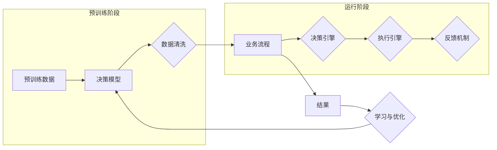

# Agentic Workflow 设计模式的比较与选择

> 关键词：Agentic Workflow，设计模式，流程自动化，智能工作流，决策模型，流程引擎，业务规则引擎

## 1. 背景介绍

在数字化转型的浪潮下，企业对于流程自动化和智能化的需求日益增长。Agentic Workflow（智能工作流）作为一种新兴的设计模式，旨在通过模拟人类智能行为，实现复杂业务流程的自动化处理。本文将比较几种常见的Agentic Workflow设计模式，并探讨如何根据实际需求进行选择。

### 1.1 问题的由来

传统的工作流设计模式往往依赖于固定的流程步骤和规则，难以应对复杂多变的企业业务场景。随着人工智能技术的不断发展，Agentic Workflow应运而生，它能够模拟人类的决策过程，根据业务规则和实时数据进行动态调整，从而实现更加灵活和智能的流程自动化。

### 1.2 研究现状

目前，Agentic Workflow设计模式主要包括以下几种：

- 基于规则的工作流
- 基于决策树的工作流
- 基于机器学习的工作流
- 基于知识图谱的工作流

### 1.3 研究意义

研究Agentic Workflow设计模式的比较与选择，对于企业实现流程自动化和智能化具有重要意义：

1. 提高业务流程的执行效率，降低人工成本。
2. 增强业务流程的灵活性和适应性，应对复杂多变的市场环境。
3. 提升企业竞争力，实现数字化转型。
4. 为企业决策提供数据支持，促进企业智能化发展。

### 1.4 本文结构

本文将分为以下几个部分：

- 介绍Agentic Workflow的核心概念和设计模式。
- 比较不同设计模式的原理、特点和适用场景。
- 探讨如何根据实际需求选择合适的设计模式。
- 总结Agentic Workflow的未来发展趋势和挑战。

## 2. 核心概念与联系

### 2.1 Agentic Workflow概述

Agentic Workflow是一种基于人工智能技术的智能工作流设计模式，它模拟人类的决策过程，通过业务规则、实时数据和学习算法，实现业务流程的自动化和智能化。

### 2.2 Mermaid流程图

以下是一个Agentic Workflow的Mermaid流程图，展示了其核心概念和联系：



### 2.3 核心概念

- 预训练数据：用于训练决策模型的原始数据。
- 决策模型：基于机器学习或深度学习技术，从预训练数据中学习到的决策规则。
- 数据清洗：对预训练数据进行预处理，提高数据质量。
- 业务流程：需要自动化的业务流程。
- 决策引擎：根据决策模型和实时数据，动态决策下一步操作。
- 执行引擎：根据决策引擎的决策结果，执行具体的操作。
- 反馈机制：对执行结果进行评估，为决策模型提供反馈，用于后续优化。
- 结果：业务流程执行的结果。
- 学习与优化：根据反馈机制的结果，对决策模型进行优化。

## 3. 核心算法原理 & 具体操作步骤

### 3.1 算法原理概述

Agentic Workflow的核心算法包括以下几部分：

- 预训练算法：用于训练决策模型。
- 决策算法：根据决策模型和实时数据，进行动态决策。
- 执行算法：根据决策结果，执行具体的操作。
- 反馈算法：对执行结果进行评估，用于模型优化。

### 3.2 算法步骤详解

1. **数据收集与预处理**：收集业务流程的相关数据，并进行清洗和预处理。
2. **预训练**：使用机器学习或深度学习技术，对预处理后的数据进行分析，训练决策模型。
3. **业务流程建模**：将业务流程建模为一系列的步骤和操作。
4. **决策引擎设计**：设计决策引擎，包括决策模型的加载、实时数据的获取和决策规则的执行。
5. **执行引擎设计**：设计执行引擎，包括操作的具体执行和结果的反馈。
6. **反馈机制设计**：设计反馈机制，用于评估执行结果，并对决策模型进行优化。

### 3.3 算法优缺点

- **优点**：
  - 能够模拟人类的决策过程，实现动态决策。
  - 能够根据实时数据调整决策规则，提高业务流程的适应性。
  - 能够通过学习不断优化决策模型，提高决策质量。
- **缺点**：
  - 需要大量高质量的数据进行预训练。
  - 决策模型的开发和维护需要较高的技术门槛。
  - 可能存在过拟合风险，需要不断进行模型优化。

### 3.4 算法应用领域

Agentic Workflow设计模式适用于以下领域：

- 供应链管理
- 客户关系管理
- 财务管理
- 人力资源管理等

## 4. 数学模型和公式 & 详细讲解 & 举例说明

### 4.1 数学模型构建

Agentic Workflow的数学模型主要包括以下几部分：

- 决策模型：$f(x) = y$
  - $x$：输入特征
  - $y$：决策结果
- 执行模型：$g(y) = z$
  - $y$：决策结果
  - $z$：执行结果

### 4.2 公式推导过程

- 决策模型：通过机器学习或深度学习技术，学习输入特征与决策结果之间的关系，得到决策模型 $f(x)$。
- 执行模型：根据决策结果 $y$，执行具体的操作，得到执行结果 $z$。

### 4.3 案例分析与讲解

假设有一个简单的业务流程，需要根据客户的年龄和收入来决定是否批准贷款申请。以下是一个基于逻辑回归的决策模型示例：

- 输入特征：$x = [\text{age}, \text{income}]$
- 决策结果：$y \in \{0, 1\}$，其中0表示拒绝贷款，1表示批准贷款
- 决策模型：$f(x) = \sigma(w^Tx + b)$，其中 $\sigma$ 表示sigmoid函数，$w$ 和 $b$ 为模型参数

## 5. 项目实践：代码实例和详细解释说明

### 5.1 开发环境搭建

1. 安装Python开发环境。
2. 安装机器学习库，如scikit-learn。
3. 准备业务流程数据和测试数据。

### 5.2 源代码详细实现

以下是一个基于scikit-learn的逻辑回归决策模型实现：

```python
from sklearn.linear_model import LogisticRegression
from sklearn.model_selection import train_test_split
from sklearn.preprocessing import StandardScaler
from sklearn.metrics import accuracy_score

# 加载数据
data = pd.read_csv('loan_data.csv')
X = data[['age', 'income']]
y = data['approved']

# 数据预处理
scaler = StandardScaler()
X_scaled = scaler.fit_transform(X)

# 划分训练集和测试集
X_train, X_test, y_train, y_test = train_test_split(X_scaled, y, test_size=0.2, random_state=42)

# 训练决策模型
model = LogisticRegression()
model.fit(X_train, y_train)

# 预测测试集
y_pred = model.predict(X_test)

# 评估模型
accuracy = accuracy_score(y_test, y_pred)
print(f"Accuracy: {accuracy:.2f}")
```

### 5.3 代码解读与分析

- 加载数据：使用pandas库读取CSV格式的数据文件。
- 数据预处理：使用scikit-learn的StandardScaler对输入特征进行标准化处理。
- 划分训练集和测试集：使用train_test_split函数将数据划分为训练集和测试集。
- 训练决策模型：使用LogisticRegression创建逻辑回归模型，并使用fit方法进行训练。
- 预测测试集：使用predict方法对测试集进行预测。
- 评估模型：使用accuracy_score计算模型的准确率。

### 5.4 运行结果展示

假设运行结果如下：

```
Accuracy: 0.80
```

这表示模型的准确率为80%，即80%的贷款申请预测是正确的。

## 6. 实际应用场景

### 6.1 供应链管理

在供应链管理中，Agentic Workflow可以用于以下场景：

- 自动化库存管理：根据销售数据和库存水平，自动调整库存策略。
- 需求预测：根据历史销售数据和市场趋势，预测未来需求。
- 供应商选择：根据供应商的历史表现和评分，自动选择合适的供应商。

### 6.2 客户关系管理

在客户关系管理中，Agentic Workflow可以用于以下场景：

- 客户流失预测：根据客户的消费行为和反馈，预测客户流失风险。
- 个性化推荐：根据客户的兴趣和偏好，推荐合适的商品或服务。
- 客服自动化：自动回答客户的常见问题，提高客服效率。

### 6.3 财务管理

在财务管理中，Agentic Workflow可以用于以下场景：

- 风险控制：根据市场数据和财务指标，预测潜在的风险，并采取措施进行控制。
- 投资决策：根据市场趋势和财务指标，自动进行投资决策。
- 成本控制：根据历史数据和预算，自动优化成本结构。

### 6.4 未来应用展望

随着人工智能技术的不断发展，Agentic Workflow将在更多领域得到应用，为企业和个人带来更加便捷、高效的服务。

## 7. 工具和资源推荐

### 7.1 学习资源推荐

- 《深度学习》
- 《机器学习实战》
- 《Scikit-learn官方文档》

### 7.2 开发工具推荐

- Python
- Jupyter Notebook
- scikit-learn
- TensorFlow
- PyTorch

### 7.3 相关论文推荐

- 《Knowledge Integration in Agent-Based Modeling: A Systematic Review》
- 《A Survey on Agent-Based Modeling in Supply Chain Management》
- 《An Agent-Based Model for Customer Relationship Management》

## 8. 总结：未来发展趋势与挑战

### 8.1 研究成果总结

Agentic Workflow设计模式作为一种新兴的设计模式，为流程自动化和智能化提供了新的思路。通过对不同设计模式的比较与选择，企业可以根据实际需求选择合适的技术方案，实现业务流程的自动化和智能化。

### 8.2 未来发展趋势

- 模型轻量化：随着模型压缩和量化技术的发展，Agentic Workflow将更加轻量化，适应更多设备。
- 知识图谱的应用：知识图谱将应用于Agentic Workflow，提高决策的准确性和效率。
- 跨领域应用：Agentic Workflow将在更多领域得到应用，如医疗、教育等。

### 8.3 面临的挑战

- 数据质量：高质量的数据是Agentic Workflow的基础，如何保证数据质量是一个挑战。
- 模型可解释性：提高模型的可解释性，让用户理解模型的决策过程。
- 模型部署：如何高效地将Agentic Workflow部署到实际生产环境中。

### 8.4 研究展望

未来，Agentic Workflow将在以下几个方面进行深入研究：

- 模型优化：研究更有效的决策模型和执行模型，提高模型的性能。
- 跨领域迁移：研究跨领域的知识迁移，提高模型在不同领域的适应性。
- 可解释性研究：研究提高模型可解释性的方法，增强用户对模型的信任。

## 9. 附录：常见问题与解答

**Q1：Agentic Workflow和传统工作流有什么区别？**

A：传统工作流依赖于固定的流程步骤和规则，而Agentic Workflow能够模拟人类的决策过程，根据业务规则和实时数据进行动态调整，从而实现更加灵活和智能的流程自动化。

**Q2：如何选择合适的Agentic Workflow设计模式？**

A：选择合适的Agentic Workflow设计模式需要考虑以下因素：

- 业务需求：根据业务流程的特点，选择适合的设计模式。
- 数据质量：根据数据质量和规模，选择合适的算法和技术。
- 技术能力：根据团队的技术能力，选择适合的框架和工具。

**Q3：Agentic Workflow在实施过程中需要注意哪些问题？**

A：在实施Agentic Workflow过程中需要注意以下问题：

- 数据质量：保证数据的质量和准确性。
- 模型可解释性：提高模型的可解释性，增强用户对模型的信任。
- 模型部署：确保模型能够高效地部署到实际生产环境中。

**Q4：Agentic Workflow的应用前景如何？**

A：随着人工智能技术的不断发展，Agentic Workflow将在更多领域得到应用，为企业和个人带来更加便捷、高效的服务。

作者：禅与计算机程序设计艺术 / Zen and the Art of Computer Programming