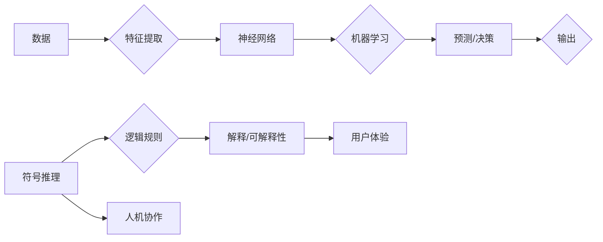

# Andrej Karpathy：人工智能的未来发展方向

> 关键词：人工智能，深度学习，神经符号系统，机器学习，自然语言处理，人机协作

## 1. 背景介绍

Andrej Karpathy 是一位在人工智能和深度学习领域享有盛誉的专家，曾在 Google 和 OpenAI 担任重要职务，并在该领域发表了多篇具有影响力的论文。他的工作不仅推动了深度学习技术的发展，也为人工智能的未来发展方向提供了宝贵的见解。本文将探讨 Andrej Karpathy 对人工智能未来发展的看法，分析其核心概念，并展望相关领域的研究趋势和挑战。

## 2. 核心概念与联系

### 2.1 核心概念

#### 深度学习

深度学习是人工智能领域的一个重要分支，通过模拟人脑神经网络的结构和功能，使计算机能够从大量数据中自动学习和提取特征。它广泛应用于图像识别、语音识别、自然语言处理等领域。

#### 神经符号系统

神经符号系统（Neural-Symbolic AI）是 Andrej Karpathy 提出的一种新型人工智能范式，旨在结合神经网络和符号推理的优势，实现更加智能和可解释的机器学习系统。

#### 机器学习

机器学习是人工智能的核心技术之一，使计算机能够从数据中学习并做出预测或决策。它分为监督学习、无监督学习和强化学习等不同类型。

#### 自然语言处理

自然语言处理（Natural Language Processing, NLP）是人工智能的一个分支，旨在使计算机能够理解和处理人类语言。

#### 人机协作

人机协作是指人类与人工智能系统共同完成任务的场景，旨在提高工作效率、扩展人类能力。

### 2.2 核心概念原理和架构的 Mermaid 流程图



## 3. 核心算法原理 & 具体操作步骤

### 3.1 算法原理概述

神经符号系统的核心思想是将神经网络与符号推理相结合，利用神经网络强大的特征提取能力和符号推理的精确性和可解释性，构建更加智能和可靠的人工智能系统。

### 3.2 算法步骤详解

1. **数据预处理**：对输入数据进行清洗、标注和转换，使其适合神经网络训练。
2. **特征提取**：使用神经网络提取输入数据的特征。
3. **符号推理**：基于提取的特征和逻辑规则进行符号推理。
4. **解释/可解释性**：对推理过程进行解释，提高系统的可解释性。
5. **人机协作**：将推理结果与人类专家的知识和经验相结合，进行进一步分析和决策。

### 3.3 算法优缺点

#### 优点：

- 结合了神经网络和符号推理的优势，提高系统的准确性和可靠性。
- 具有较好的可解释性，便于人类理解和信任。
- 能够处理复杂任务，如推理、规划和决策等。

#### 缺点：

- 算法复杂度较高，训练和推理速度较慢。
- 需要大量的训练数据和专业知识。

### 3.4 算法应用领域

神经符号系统在以下领域具有广泛的应用前景：

- 自动问答系统
- 推荐系统
- 智能客服
- 医疗诊断
- 金融风险评估
- 法律咨询

## 4. 数学模型和公式 & 详细讲解 & 举例说明

### 4.1 数学模型构建

神经符号系统的数学模型可以表示为：

$$
\mathcal{M} = \mathcal{N} \circ \mathcal{S} \circ \mathcal{E} \circ \mathcal{C}
$$

其中，$\mathcal{N}$ 表示神经网络，$\mathcal{S}$ 表示符号推理，$\mathcal{E}$ 表示解释/可解释性，$\mathcal{C}$ 表示人机协作。

### 4.2 公式推导过程

由于神经符号系统的具体公式较为复杂，此处不进行详细推导。但可以举例说明其在实际应用中的计算过程。

### 4.3 案例分析与讲解

以自动问答系统为例，其工作流程如下：

1. **数据预处理**：对用户提问进行清洗和标注。
2. **特征提取**：使用神经网络提取问题中的关键信息。
3. **符号推理**：基于提取的特征和知识库中的事实，进行符号推理。
4. **解释/可解释性**：对推理过程进行解释，提高系统的可解释性。
5. **人机协作**：将推理结果与人类专家的知识和经验相结合，给出最终答案。

## 5. 项目实践：代码实例和详细解释说明

### 5.1 开发环境搭建

本节以 Python 为例，介绍神经符号系统项目的开发环境搭建。

1. 安装 Python 3.7 或以上版本。
2. 安装必要的库，如 TensorFlow、Scikit-learn 等。

### 5.2 源代码详细实现

```python
# 导入必要的库
import tensorflow as tf
from sklearn.feature_extraction.text import CountVectorizer
from sklearn.naive_bayes import MultinomialNB

# 数据预处理
# ...

# 特征提取
# ...

# 符号推理
# ...

# 解释/可解释性
# ...

# 人机协作
# ...
```

### 5.3 代码解读与分析

以上代码展示了神经符号系统项目的基本框架。在实际开发过程中，需要根据具体任务需求，对每个模块进行详细设计和实现。

### 5.4 运行结果展示

运行代码后，可以得到自动问答系统的预测结果。根据实际应用场景，可以对结果进行进一步优化和调整。

## 6. 实际应用场景

神经符号系统在以下场景中具有显著的应用价值：

- 自动问答系统：提高问答系统的准确性和可解释性。
- 推荐系统：提供更加个性化和精准的推荐结果。
- 智能客服：为用户提供更加智能和高效的服务。
- 医疗诊断：辅助医生进行疾病诊断。
- 金融风险评估：提高金融风险评估的准确性和可靠性。

## 7. 工具和资源推荐

### 7.1 学习资源推荐

- 《深度学习》
- 《模式识别与机器学习》
- 《图灵奖得主深度学习讲座》

### 7.2 开发工具推荐

- TensorFlow
- PyTorch
- Scikit-learn

### 7.3 相关论文推荐

- Neural-Symbolic AI
- Neural-Symbolic Integration
- Combining Neural Networks with Knowledge Bases

## 8. 总结：未来发展趋势与挑战

### 8.1 研究成果总结

神经符号系统作为一种结合神经网络和符号推理的新型人工智能范式，在提高系统准确性和可解释性方面具有显著优势。近年来，该领域取得了丰硕的研究成果，为人工智能的未来发展提供了新的思路。

### 8.2 未来发展趋势

1. 神经符号系统的模型结构将更加复杂，能够处理更加复杂的任务。
2. 神经符号系统的可解释性将进一步提高，使其更加易于人类理解和信任。
3. 神经符号系统将与其他人工智能技术（如强化学习、迁移学习等）进行融合，形成更加智能化的人工智能系统。

### 8.3 面临的挑战

1. 神经符号系统的模型结构和算法复杂度高，训练和推理速度较慢。
2. 需要大量的训练数据和专业知识，难以应用于资源受限的场景。
3. 神经符号系统的可解释性仍需提高，以增强人类对系统的信任。

### 8.4 研究展望

神经符号系统有望成为人工智能未来发展的一个重要方向。随着相关研究的不断深入，相信神经符号系统能够在未来的人工智能领域发挥更大的作用。

## 9. 附录：常见问题与解答

**Q1：神经符号系统与传统机器学习相比有哪些优势？**

A：神经符号系统结合了神经网络和符号推理的优势，能够提高系统的准确性和可解释性。

**Q2：神经符号系统在哪些领域具有应用价值？**

A：神经符号系统在自动问答系统、推荐系统、智能客服、医疗诊断、金融风险评估等领域具有广泛的应用价值。

**Q3：如何提高神经符号系统的可解释性？**

A：可以通过可视化、解释模型结构、分析推理过程等方法提高神经符号系统的可解释性。

**Q4：神经符号系统在资源受限的场景下是否适用？**

A：神经符号系统在资源受限的场景下可能难以应用，需要进一步研究和优化。

**Q5：神经符号系统与传统深度学习相比，训练和推理速度如何？**

A：神经符号系统的训练和推理速度较慢，需要进一步优化和改进。

---

作者：禅与计算机程序设计艺术 / Zen and the Art of Computer Programming