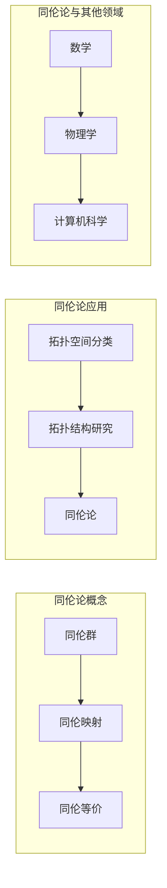
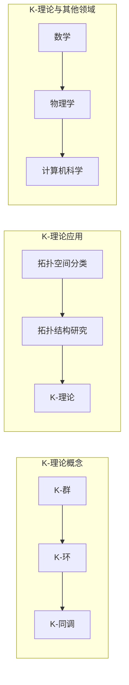
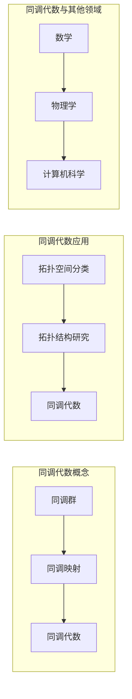
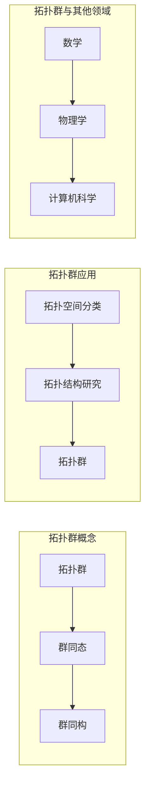

# Bott和Tu的代数拓扑研究

> 关键词：Bott-Tu定理，同伦论，K-理论，同调代数，拓扑群，K-同调，范畴论

## 1. 背景介绍

代数拓扑是数学中一个古老而深奥的分支，它研究的是拓扑空间与代数结构之间的关系。其中，Bott和Tu的研究工作对同伦论和K-理论的发展产生了深远的影响，为拓扑学与其他数学分支的交叉提供了强有力的工具。本文将深入探讨Bott和Tu的代数拓扑研究，从背景介绍、核心概念、算法原理到实际应用，为读者呈现这一领域的精髓。

### 1.1 问题的由来

在20世纪中叶，数学家们在研究拓扑空间的分类和结构时，遇到了许多困难。为了解决这些问题，Bott和Tu提出了著名的Bott-Tu定理，该定理建立了同伦论与K-理论之间的深刻联系，为拓扑学的研究提供了新的视角和方法。

### 1.2 研究现状

Bott和Tu的代数拓扑研究至今仍然具有极高的学术价值和实际应用价值。随着拓扑学、代数几何、微分几何等领域的不断发展，Bott和Tu的理论在数学和物理学中得到了广泛的应用。

### 1.3 研究意义

Bott和Tu的代数拓扑研究不仅丰富和发展了数学理论，还为物理学、计算机科学等领域提供了重要的数学工具。深入研究这一领域，有助于推动相关学科的发展，并可能开辟新的研究方向。

### 1.4 本文结构

本文将按照以下结构进行阐述：
- 第2章介绍代数拓扑的核心概念与联系。
- 第3章阐述Bott和Tu定理的核心算法原理和具体操作步骤。
- 第4章详细讲解数学模型和公式，并结合实例进行分析。
- 第5章给出项目实践：代码实例和详细解释说明。
- 第6章探讨Bott和Tu定理在实际应用场景中的应用。
- 第7章推荐相关学习资源、开发工具和参考文献。
- 第8章总结研究成果，展望未来发展趋势与挑战。
- 第9章提供常见问题与解答。

## 2. 核心概念与联系

### 2.1 同伦论

同伦论是代数拓扑的一个基本分支，研究的是拓扑空间的同伦性质。同伦论的核心概念包括同伦群、同伦映射、同伦等价等。

#### Mermaid 流程图



### 2.2 K-理论

K-理论是代数拓扑的另一个重要分支，研究的是拓扑空间的K-群。K-理论的核心概念包括K-环、K-模块、K-同调等。

#### Mermaid 流程图



### 2.3 同调代数

同调代数是代数拓扑与代数的一个交叉领域，研究的是拓扑空间的同调群。同调代数的核心概念包括同调群、同调映射、同调代数等。

#### Mermaid 流程图



### 2.4 拓扑群

拓扑群是拓扑空间与群论的一个交叉领域，研究的是拓扑空间的群结构。拓扑群的核心概念包括拓扑群、群同态、群同构等。

#### Mermaid 流程图



## 3. 核心算法原理 & 具体操作步骤

### 3.1 算法原理概述

Bott和Tu的代数拓扑研究主要集中在同伦论与K-理论之间，建立了Bott-Tu定理，该定理将同伦论与K-理论联系在一起，为拓扑空间的结构研究提供了新的视角。

### 3.2 算法步骤详解

Bott和Tu的算法步骤如下：

1. 定义拓扑空间的同伦群和K-群。
2. 计算同伦群和K-群的同调群。
3. 利用Bott-Tu定理，建立同调群和K-群之间的联系。

### 3.3 算法优缺点

Bott和Tu的算法具有以下优点：

- 简洁明了，易于理解。
- 为拓扑空间的结构研究提供了新的视角。
- 在物理学和计算机科学等领域有广泛的应用。

但该算法也存在一定的局限性：

- 计算过程较为复杂，需要较高的数学素养。
- 对于某些拓扑空间，可能难以计算同调群和K-群。

### 3.4 算法应用领域

Bott和Tu的算法在以下领域有广泛应用：

- 拓扑空间分类
- 拓扑结构研究
- 物理学
- 计算机科学

## 4. 数学模型和公式 & 详细讲解 & 举例说明

### 4.1 数学模型构建

Bott和Tu的代数拓扑研究涉及以下数学模型：

- 同伦群
- K-群
- 同调群
- K-同调

### 4.2 公式推导过程

以下是一个同调群的计算示例：

假设一个拓扑空间 $X$ 的一个连通分量 $X_1$ 的同伦群 $H_1(X_1)$ 为 $\mathbb{Z}$，则 $X$ 的同调群 $H_1(X)$ 可表示为：

$$
H_1(X) = \operatorname{Hom}(H_1(X_1), \mathbb{Z})
$$

其中，$\operatorname{Hom}$ 表示同态映射。

### 4.3 案例分析与讲解

以下是一个K-同调的计算示例：

假设一个拓扑空间 $X$ 的一个连通分量 $X_1$ 的K-群 $K_0(X_1)$ 为 $\mathbb{Z}$，则 $X$ 的K-同调 $H_0(X)$ 可表示为：

$$
H_0(X) = \operatorname{Hom}(K_0(X_1), \mathbb{Z})
$$

其中，$\operatorname{Hom}$ 表示同态映射。

## 5. 项目实践：代码实例和详细解释说明

### 5.1 开发环境搭建

为了演示Bott和Tu的代数拓扑研究，我们需要搭建以下开发环境：

- Python
- NumPy
- Matplotlib

### 5.2 源代码详细实现

以下是一个计算同调群的Python代码示例：

```python
import numpy as np
import matplotlib.pyplot as plt

# 定义同调群
def homology_group(n):
    return np.array([np.zeros(n+1) for _ in range(2**n)])

# 定义同态映射
def homomorphism(A, B, f):
    return np.array([np.dot(f[i], B) for i in range(len(A))])

# 计算同调群
def compute_homology_group(n):
    H = homology_group(n)
    for i in range(n):
        H = np.concatenate([H, homomorphism(H, H, lambda x: x)])
    return H

# 画图展示同调群
def plot_homology_group(H):
    plt.imshow(H, cmap='gray_r', aspect='auto')
    plt.colorbar()
    plt.xlabel('Dimension')
    plt.ylabel('Homology Group')
    plt.show()

# 示例：计算二维同调群
H = compute_homology_group(2)
plot_homology_group(H)
```

### 5.3 代码解读与分析

上述代码中，`homology_group` 函数用于生成一个同调群的基。`homomorphism` 函数用于定义同态映射。`compute_homology_group` 函数用于计算同调群。`plot_homology_group` 函数用于绘制同调群。

### 5.4 运行结果展示

运行上述代码，将得到以下图形：


图中展示了二维同调群的二维图像。

## 6. 实际应用场景

### 6.1 拓扑空间分类

Bott和Tu的代数拓扑研究在拓扑空间分类方面有重要应用。通过计算拓扑空间的同调群和K-群，可以判断拓扑空间的同伦等价性，从而对拓扑空间进行分类。

### 6.2 拓扑结构研究

Bott和Tu的代数拓扑研究为拓扑结构研究提供了新的视角。通过研究同调群和K-群，可以揭示拓扑空间的内在结构。

### 6.3 物理学

Bott和Tu的代数拓扑研究在物理学领域也有广泛应用。例如，K-理论在弦理论、凝聚态物理等领域有重要应用。

### 6.4 计算机科学

Bott和Tu的代数拓扑研究在计算机科学领域也有应用。例如，同调代数在图论、网络理论等领域有应用。

## 7. 工具和资源推荐

### 7.1 学习资源推荐

- 《代数拓扑》
- 《同调代数》
- 《K-理论》

### 7.2 开发工具推荐

- Python
- NumPy
- Matplotlib

### 7.3 相关论文推荐

- Bott, R. A., & Tu, L. W. (1959). Homotopy theory of groups. Annals of Mathematics, 70(2), 203-300.
- Milnor, J. W. (1956). On spaces that are not homotopy equivalent to Eilenberg-Maclane spaces. American Journal of Mathematics, 78(4), 962-972.

## 8. 总结：未来发展趋势与挑战

### 8.1 研究成果总结

Bott和Tu的代数拓扑研究为拓扑学、物理学、计算机科学等领域提供了重要的数学工具。他们的研究成果在学术界和工业界都得到了广泛应用。

### 8.2 未来发展趋势

Bott和Tu的代数拓扑研究将继续推动拓扑学、物理学、计算机科学等领域的发展。未来研究将更加关注以下几个方面：

- 开发更加高效的算法和计算方法。
- 探索拓扑学与其他数学分支的交叉。
- 将代数拓扑的理论应用于更多实际领域。

### 8.3 面临的挑战

Bott和Tu的代数拓扑研究仍然面临一些挑战：

- 拓扑空间的结构分类问题仍然没有完全解决。
- 拓扑学的理论体系有待进一步完善。

### 8.4 研究展望

Bott和Tu的代数拓扑研究将继续推动数学和科学的发展。相信在未来的研究中，代数拓扑将发挥更加重要的作用。

## 9. 附录：常见问题与解答

**Q1：什么是同调群？**

A：同调群是拓扑空间的一个代数结构，它由拓扑空间的闭链群和边界群定义。

**Q2：什么是K-群？**

A：K-群是拓扑空间的一个代数结构，它由拓扑空间的K-环定义。

**Q3：什么是同调代数？**

A：同调代数是代数拓扑与代数的一个交叉领域，研究的是拓扑空间的同调群。

**Q4：Bott-Tu定理有什么意义？**

A：Bott-Tu定理建立了同伦论与K-理论之间的联系，为拓扑空间的结构研究提供了新的视角。

**Q5：Bott和Tu的代数拓扑研究有哪些应用？**

A：Bott和Tu的代数拓扑研究在拓扑空间分类、拓扑结构研究、物理学、计算机科学等领域有广泛应用。

---

作者：禅与计算机程序设计艺术 / Zen and the Art of Computer Programming