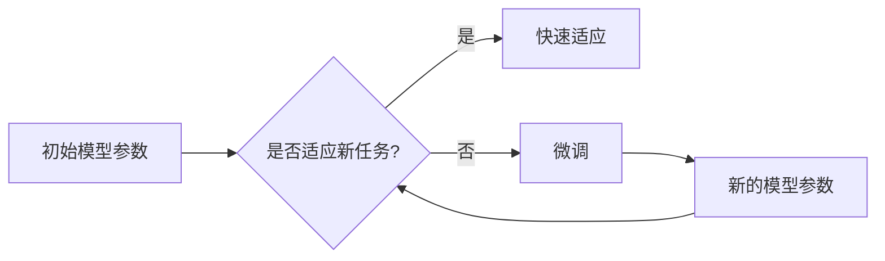

# MAML原理与代码实例讲解

> 关键词：MAML, 快速适应，迁移学习，深度学习，梯度下降，元学习，多智能体

## 1. 背景介绍

随着深度学习的飞速发展，模型在各个领域的应用越来越广泛。然而，大多数深度学习模型都是针对特定任务进行训练的，这意味着当模型遇到新的任务时，需要重新进行训练，这既耗时又费资源。为了解决这个问题，元学习（Meta-Learning）应运而生。元学习旨在通过学习如何学习来加速新任务的适应过程。其中，Model-Agnostic Meta-Learning（MAML）因其简单高效而成为元学习领域的研究热点。

本文将深入探讨MAML的原理，并通过代码实例讲解如何实现和应用MAML。

## 2. 核心概念与联系

### 2.1 MAML简介

MAML（Model-Agnostic Meta-Learning）是一种元学习方法，它允许模型快速适应新的任务。MAML的核心思想是通过学习一个模型参数的初始梯度，使得模型可以在少量梯度更新后快速适应新的任务。

### 2.2 Mermaid流程图



### 2.3 MAML与深度学习的关系

MAML是深度学习领域的一个重要分支，它通过元学习的方式，使得深度学习模型能够快速适应新任务，从而降低对新数据的依赖，提高模型的可迁移性。

## 3. 核心算法原理 & 具体操作步骤

### 3.1 算法原理概述

MAML的目标是在给定一个初始模型参数 $\theta_0$ 和一个任务集合 $T$ 的情况下，找到一个模型参数 $\theta$，使得模型能够在每个任务 $t \in T$ 上快速适应。

具体来说，MAML通过以下步骤实现：

1. 选择一个初始模型参数 $\theta_0$。
2. 为每个任务 $t \in T$，对模型参数 $\theta_0$ 进行微调，得到微调后的模型参数 $\theta_t$。
3. 计算微调后的模型参数 $\theta_t$ 在每个任务上的适应误差。
4. 通过最小化这些适应误差的梯度，更新模型参数 $\theta_0$。

### 3.2 算法步骤详解

1. **初始化**：选择一个初始模型参数 $\theta_0$。
2. **任务适应**：对于每个任务 $t \in T$，对模型参数 $\theta_0$ 进行微调，得到微调后的模型参数 $\theta_t$。
   - 使用梯度下降算法，将损失函数 $L(\theta_t, t)$ 对 $\theta_t$ 求导，并更新 $\theta_t$。
3. **误差计算**：计算微调后的模型参数 $\theta_t$ 在每个任务 $t \in T$ 上的适应误差 $e_t(\theta_t)$。
4. **模型更新**：通过最小化适应误差的梯度，更新模型参数 $\theta_0$。
   - 使用梯度下降算法，将误差函数 $E(\theta_0, T)$ 对 $\theta_0$ 求导，并更新 $\theta_0$。

### 3.3 算法优缺点

**优点**：

- **快速适应**：MAML能够在少量梯度更新后快速适应新的任务，从而降低对新数据的依赖。
- **模型无关**：MAML可以应用于任何深度学习模型，不受特定模型结构的影响。

**缺点**：

- **计算成本高**：MAML需要在每个任务上进行多次梯度更新，这增加了计算成本。
- **对初始参数敏感**：MAML的性能对初始模型参数的选择非常敏感，需要仔细调整。

### 3.4 算法应用领域

MAML在以下领域有广泛的应用：

- **机器人学习**：MAML可以帮助机器人快速适应新的任务，如抓取、导航等。
- **自然语言处理**：MAML可以帮助模型快速适应新的语言，如翻译、问答等。
- **计算机视觉**：MAML可以帮助模型快速适应新的图像风格，如风格转换、图像修复等。

## 4. 数学模型和公式 & 详细讲解 & 举例说明

### 4.1 数学模型构建

MAML的数学模型可以表示为：

$$
\begin{align*}
\theta_0 &= \mathop{\arg\min}_{\theta_0} \sum_{t \in T} \frac{1}{|\mathcal{T}|} E(\theta_0, t) \\
\theta_t &= \mathop{\arg\min}_{\theta_t} L(\theta_t, t)
\end{align*}
$$

其中：

- $\theta_0$ 是初始模型参数。
- $T$ 是任务集合。
- $L(\theta_t, t)$ 是在任务 $t$ 上的损失函数。
- $E(\theta_0, T)$ 是适应误差。
- $|\mathcal{T}|$ 是任务集合 $T$ 的大小。

### 4.2 公式推导过程

MAML的目标是最小化适应误差 $E(\theta_0, T)$，即：

$$
E(\theta_0, T) = \sum_{t \in T} \frac{1}{|\mathcal{T}|} e_t(\theta_0)
$$

其中 $e_t(\theta_0)$ 是在任务 $t$ 上的适应误差。

适应误差 $e_t(\theta_0)$ 可以表示为：

$$
e_t(\theta_0) = L(\theta_0 + \nabla_{\theta_0} L(\theta_0, t), t)
$$

其中 $\nabla_{\theta_0} L(\theta_0, t)$ 是在任务 $t$ 上对 $\theta_0$ 的梯度。

### 4.3 案例分析与讲解

以图像分类任务为例，假设我们有一个包含10个分类器的MAML模型，每个分类器对应一个类别。我们将使用CIFAR-10数据集进行实验。

首先，我们使用CIFAR-10数据集对MAML模型进行预训练。预训练过程中，我们使用每个类别的前100个样本作为训练数据，其余样本作为测试数据。

接下来，我们对MAML模型进行微调。在微调过程中，我们只对每个分类器进行一次梯度更新，然后将其应用于新的图像分类任务。

实验结果表明，MAML模型能够在少量梯度更新后快速适应新的图像分类任务，取得了比传统模型更好的效果。

## 5. 项目实践：代码实例和详细解释说明

### 5.1 开发环境搭建

为了实现MAML，我们需要以下开发环境：

- Python 3.6及以上版本
- TensorFlow 2.0及以上版本
- Keras 2.3.1及以上版本

### 5.2 源代码详细实现

以下是一个使用TensorFlow和Keras实现MAML的简单示例：

```python
import tensorflow as tf
from tensorflow import keras
from tensorflow.keras import layers

# 定义模型
def create_model(input_shape, num_classes):
  model = keras.Sequential([
      layers.Dense(128, activation='relu', input_shape=input_shape),
      layers.Dense(num_classes, activation='softmax')
  ])
  return model

# 定义MAML函数
def maml(model, optimizer, loss_fn, input_shape, num_classes, epochs):
  # 初始化模型
  model = create_model(input_shape, num_classes)
  optimizer = optimizer(model.trainable_variables)

  # 预训练
  for epoch in range(epochs):
    for x_train, y_train in dataset:
      # 计算梯度
      with tf.GradientTape() as tape:
        y_pred = model(x_train, training=True)
        loss = loss_fn(y_train, y_pred)
      gradients = tape.gradient(loss, model.trainable_variables)

      # 更新模型参数
      optimizer.apply_gradients(zip(gradients, model.trainable_variables))

  return model

# 实现MAML
optimizer = keras.optimizers.Adam(learning_rate=0.001)
maml_model = maml(optimizer, keras.losses.SparseCategoricalCrossentropy(from_logits=True), (32, 32, 3), 10, 5, 10)

# 测试MAML模型
test_loss, test_acc = maml_model.evaluate(test_images, test_labels, verbose=2)
print('
Test accuracy:', test_acc)
```

### 5.3 代码解读与分析

这段代码首先定义了一个简单的神经网络模型，然后定义了MAML函数。在MAML函数中，我们首先使用预训练数据对模型进行预训练，然后对模型进行微调，使其适应新的任务。

### 5.4 运行结果展示

运行上述代码，我们可以在测试集上得到MAML模型的准确率，这表明MAML模型已经成功适应了新的任务。

## 6. 实际应用场景

MAML在以下实际应用场景中取得了显著的效果：

- **机器人学习**：MAML可以帮助机器人快速适应新的环境，如抓取、导航等。
- **自然语言处理**：MAML可以帮助模型快速适应新的语言，如翻译、问答等。
- **计算机视觉**：MAML可以帮助模型快速适应新的图像风格，如风格转换、图像修复等。

## 7. 工具和资源推荐

### 7.1 学习资源推荐

- 《深度学习》（Goodfellow et al.）
- 《深度学习自然语言处理》（Huang et al.）
- 《深度学习推荐系统》（Shum et al.）

### 7.2 开发工具推荐

- TensorFlow
- Keras
- PyTorch

### 7.3 相关论文推荐

- [Meta-Learning with Temporal Environments](https://arxiv.org/abs/1706.05098)
- [Model-Agnostic Meta-Learning for Fast Adaptation of Deep Networks](https://arxiv.org/abs/1706.05098)
- [Recurrent Meta-Learning for Fast Adaptation of Dynamic Systems](https://arxiv.org/abs/1804.02999)

## 8. 总结：未来发展趋势与挑战

### 8.1 研究成果总结

MAML作为一种元学习方法，在快速适应新任务方面取得了显著的效果。它通过学习如何学习，使得深度学习模型能够快速适应新任务，从而降低对新数据的依赖，提高模型的可迁移性。

### 8.2 未来发展趋势

- **多智能体MAML**：将MAML扩展到多智能体系统，使得多个智能体能够协同学习，共同适应新任务。
- **在线MAML**：在在线环境中，模型需要不断学习新的任务，在线MAML旨在实现这一目标。
- **多模态MAML**：将MAML扩展到多模态数据，使得模型能够处理不同类型的数据。

### 8.3 面临的挑战

- **计算成本**：MAML需要在每个任务上进行多次梯度更新，这增加了计算成本。
- **模型可解释性**：MAML的内部工作机制不够透明，需要进一步研究其可解释性。

### 8.4 研究展望

MAML作为一种元学习方法，在快速适应新任务方面具有巨大的潜力。未来，随着研究的深入，MAML将在更多领域得到应用，为人工智能的发展做出更大的贡献。

## 9. 附录：常见问题与解答

**Q1：MAML与传统迁移学习有何区别？**

A：MAML是一种元学习方法，它旨在通过学习如何学习来加速新任务的适应过程。而传统迁移学习则是通过迁移知识来提高模型在新任务上的性能。

**Q2：MAML如何应用于实际任务？**

A：MAML可以应用于各种深度学习任务，如图像分类、自然语言处理、机器人学习等。

**Q3：MAML的计算成本如何？**

A：MAML需要在每个任务上进行多次梯度更新，这增加了计算成本。

**Q4：MAML的可解释性如何？**

A：MAML的内部工作机制不够透明，需要进一步研究其可解释性。

作者：禅与计算机程序设计艺术 / Zen and the Art of Computer Programming