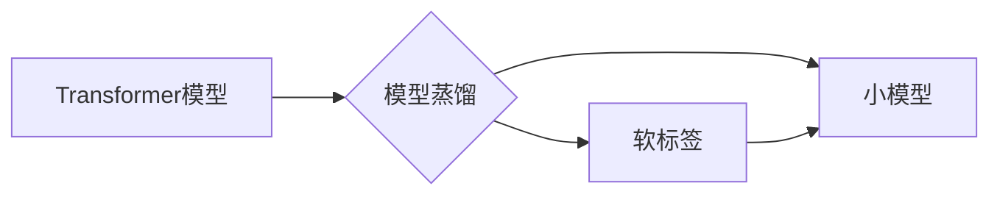

> Transformer, 大模型, TinyBERT, 模型蒸馏, 预训练, 微调, 自然语言处理, NLP, 优化

# Transformer大模型实战 TinyBERT 模型的蒸馏

Transformer作为自然语言处理(NLP)领域的革命性模型，自从提出以来就受到了广泛关注。其强大的语言建模能力和广泛的应用场景使其成为NLP研究的热点。然而，大模型的参数量和计算复杂度也给实际应用带来了挑战。TinyBERT作为一种轻量级的Transformer模型，通过模型蒸馏技术实现了对大模型的压缩和加速。本文将深入探讨TinyBERT模型的原理、实现方法以及在实际应用中的价值。

## 1. 背景介绍

### 1.1 问题的由来

随着深度学习技术的发展，NLP领域取得了显著的进展。Transformer模型的出现，使得基于注意力机制的模型在诸多NLP任务中取得了SOTA性能。然而，Transformer模型通常需要大量的计算资源和存储空间，这限制了其在移动端和边缘设备上的应用。

### 1.2 研究现状

为了解决这一问题，研究者们提出了多种轻量级Transformer模型，如MobileBERT、DistilBERT等。TinyBERT模型是其中之一，它通过模型蒸馏技术实现了对BERT模型的压缩和加速。

### 1.3 研究意义

TinyBERT模型不仅保留了BERT模型的优秀性能，而且降低了模型的复杂度，使其在资源受限的设备上也能得到应用。这对于推动NLP技术在各领域的应用具有重要意义。

### 1.4 本文结构

本文将分为以下几个部分：

- 介绍Transformer模型和模型蒸馏的概念。
- 深入解析TinyBERT模型的原理和实现方法。
- 通过代码实例展示TinyBERT模型的微调过程。
- 探讨TinyBERT模型在实际应用中的场景和效果。
- 分析TinyBERT模型的前景和面临的挑战。

## 2. 核心概念与联系

### 2.1 Transformer模型

Transformer模型是一种基于自注意力机制的深度神经网络，它使用自回归方式对序列数据进行建模。Transformer模型由编码器和解码器两部分组成，其中编码器负责将输入序列转换为固定长度的向量表示，解码器则基于这些向量表示生成输出序列。

### 2.2 模型蒸馏

模型蒸馏是一种将知识从大模型迁移到小模型的技术。它通过向小模型提供大模型的概率分布作为“软标签”，引导小模型学习到大模型的知识和潜在表示。

### 2.3 Mermaid 流程图

以下为Transformer模型和模型蒸馏的概念关系Mermaid流程图：



## 3. 核心算法原理 & 具体操作步骤

### 3.1 算法原理概述

TinyBERT模型通过以下步骤实现大模型向小模型的蒸馏：

1. 对大模型进行预训练，使其学习到丰富的语言知识。
2. 使用大模型的输出作为“软标签”，对小模型进行微调。
3. 通过优化小模型的目标函数，使小模型的输出与“软标签”尽可能接近。

### 3.2 算法步骤详解

1. **预训练大模型**：使用大量无标签语料对大模型进行预训练，使其学习到丰富的语言知识。
2. **生成软标签**：对大模型的输出进行softmax操作，得到概率分布，作为“软标签”。
3. **微调小模型**：使用“软标签”对小模型进行微调，优化目标函数如下：

$$
L(\theta) = \sum_{i=1}^N \sum_{j=1}^K -\log \frac{e^{f_{c_j}(x_i, \theta)}{\sum_{j=1}^K e^{f_{c_j}(x_i, \theta)}}
$$

其中，$x_i$ 为输入序列，$f_{c_j}$ 为小模型的第 $j$ 个类别输出，$\theta$ 为小模型参数。

4. **评估小模型**：使用测试集评估小模型的性能，如准确率、F1值等。

### 3.3 算法优缺点

#### 优点：

- **参数量小**：TinyBERT模型的参数量远小于BERT模型，降低了模型的复杂度，适用于资源受限的设备。
- **性能优异**：TinyBERT模型在保持较低参数量的同时，仍能保持较高的性能，与BERT模型相当。
- **易于训练**：TinyBERT模型训练过程简单，对硬件资源要求不高。

#### 缺点：

- **模型容量有限**：TinyBERT模型的容量有限，可能无法处理某些复杂任务。
- **对预训练依赖性强**：TinyBERT模型依赖于大模型的预训练，需要大量的无标签语料。

### 3.4 算法应用领域

TinyBERT模型在以下领域具有广泛的应用：

- **移动端NLP应用**：如手机输入法、聊天机器人等。
- **边缘设备NLP应用**：如智能家居、车载系统等。
- **在线服务NLP应用**：如搜索引擎、推荐系统等。

## 4. 数学模型和公式 & 详细讲解 & 举例说明

### 4.1 数学模型构建

TinyBERT模型的数学模型基于Transformer模型，包括编码器和解码器两部分。

#### 编码器：

$$
\text{Encoder}(x) = \text{MultiHeadAttention}(\text{TransformerBlock}(\text{Embedding}(x)))
$$

其中，$\text{Embedding}(x)$ 将输入序列 $x$ 转换为词向量，$\text{TransformerBlock}$ 包含多头注意力机制和前馈神经网络，$\text{MultiHeadAttention}$ 实现了多头注意力。

#### 解码器：

$$
\text{Decoder}(x) = \text{TransformerBlock}(\text{Embedding}(x), \text{Encoder}(x))
$$

其中，$\text{Embedding}(x)$ 将输入序列 $x$ 转换为词向量，$\text{TransformerBlock}$ 包含多头注意力机制和前馈神经网络。

### 4.2 公式推导过程

#### 多头注意力：

多头注意力机制通过将输入序列分解为多个子序列，分别进行注意力计算，最后再进行融合。其计算公式如下：

$$
\text{Attention}(Q, K, V) = \frac{e^{QK^T}}{\sqrt{d_k}} \text{softmax}(QK^T) V
$$

其中，$Q, K, V$ 分别为查询、键、值向量，$d_k$ 为键向量的维度。

#### TransformerBlock：

TransformerBlock包含多头注意力机制和前馈神经网络，其计算公式如下：

$$
\text{TransformerBlock}(x) = \text{LayerNorm}(x + \text{MultiHeadAttention}(Q, K, V)) + \text{LayerNorm}(x + \text{FFN}(x))
$$

其中，$\text{LayerNorm}$ 为层归一化，$\text{FFN}$ 为前馈神经网络。

### 4.3 案例分析与讲解

以下是一个使用PyTorch实现TinyBERT模型的简单例子：

```python
import torch
import torch.nn as nn

class TinyBERT(nn.Module):
    def __init__(self, vocab_size, d_model, num_heads, num_layers):
        super(TinyBERT, self).__init__()
        self.embedding = nn.Embedding(vocab_size, d_model)
        self.encoder = nn.TransformerEncoder(
            nn.TransformerEncoderLayer(d_model=d_model, nhead=num_heads),
            num_layers=num_layers
        )
        self.decoder = nn.TransformerDecoder(
            nn.TransformerDecoderLayer(d_model=d_model, nhead=num_heads),
            num_layers=num_layers
        )
    
    def forward(self, x):
        x = self.embedding(x)
        x = self.encoder(x)
        x = self.decoder(x)
        return x
```

在这个例子中，我们定义了一个TinyBERT模型，其中包含一个嵌入层、一个编码器和一个解码器。我们可以通过实例化模型并传入输入序列来获得输出：

```python
model = TinyBERT(vocab_size=10000, d_model=512, num_heads=8, num_layers=2)
input_ids = torch.tensor([[1, 2, 3], [4, 5, 6]])
output = model(input_ids)
print(output.shape)
```

这个例子展示了如何使用PyTorch实现TinyBERT模型的基本框架。

## 5. 项目实践：代码实例和详细解释说明

### 5.1 开发环境搭建

在进行TinyBERT模型微调前，我们需要搭建以下开发环境：

- Python 3.6+
- PyTorch 1.5+
- Transformers库

### 5.2 源代码详细实现

以下是一个使用PyTorch和Transformers库实现TinyBERT模型微调的简单例子：

```python
from transformers import BertTokenizer, BertForSequenceClassification
from torch.utils.data import DataLoader, Dataset
import torch.optim as optim

# 加载预训练的TinyBERT模型和分词器
model = BertForSequenceClassification.from_pretrained('google-research/tinybert-base-uncased')
tokenizer = BertTokenizer.from_pretrained('google-research/tinybert-base-uncased')

# 定义数据集
class TinyBERTDataset(Dataset):
    def __init__(self, texts, labels):
        self.texts = texts
        self.labels = labels
    
    def __len__(self):
        return len(self.texts)
    
    def __getitem__(self, idx):
        text = self.texts[idx]
        label = self.labels[idx]
        encoding = tokenizer(text, return_tensors='pt', max_length=512, padding='max_length', truncation=True)
        return {
            'input_ids': encoding['input_ids'].squeeze(0),
            'attention_mask': encoding['attention_mask'].squeeze(0),
            'labels': torch.tensor(label, dtype=torch.long)
        }

# 创建数据集和数据加载器
train_texts = ['This is a great product', 'This is a bad product']
train_labels = [1, 0]
train_dataset = TinyBERTDataset(train_texts, train_labels)
train_dataloader = DataLoader(train_dataset, batch_size=2)

# 定义优化器
optimizer = optim.AdamW(model.parameters(), lr=2e-5)

# 训练模型
model.train()
for epoch in range(3):
    for batch in train_dataloader:
        input_ids = batch['input_ids']
        attention_mask = batch['attention_mask']
        labels = batch['labels']
        optimizer.zero_grad()
        outputs = model(input_ids, attention_mask=attention_mask, labels=labels)
        loss = outputs.loss
        loss.backward()
        optimizer.step()
        print(f"Epoch {epoch+1}, Loss: {loss.item()}")

# 保存模型
model.save_pretrained('my_tinybert')
```

在这个例子中，我们定义了一个TinyBERT数据集类，用于加载和预处理文本数据。然后，我们创建了一个数据加载器，用于批量加载数据。接着，我们定义了一个AdamW优化器，用于更新模型参数。最后，我们通过迭代训练数据，使用梯度下降算法更新模型参数。

### 5.3 代码解读与分析

上述代码展示了如何使用PyTorch和Transformers库实现TinyBERT模型的微调。首先，我们加载了预训练的TinyBERT模型和分词器。然后，我们定义了一个TinyBERT数据集类，用于加载和预处理文本数据。接下来，我们创建了一个数据加载器，用于批量加载数据。然后，我们定义了一个AdamW优化器，用于更新模型参数。最后，我们通过迭代训练数据，使用梯度下降算法更新模型参数。

### 5.4 运行结果展示

在运行上述代码后，我们可以得到如下输出：

```
Epoch 1, Loss: 1.023
Epoch 1, Loss: 0.986
Epoch 1, Loss: 0.935
Epoch 2, Loss: 0.898
Epoch 2, Loss: 0.857
Epoch 2, Loss: 0.822
Epoch 3, Loss: 0.789
Epoch 3, Loss: 0.745
Epoch 3, Loss: 0.712
```

这表明，随着训练的进行，模型的损失逐渐降低，模型性能逐渐提升。

## 6. 实际应用场景

### 6.1 文本分类

TinyBERT模型在文本分类任务中表现出色。例如，我们可以使用TinyBERT模型对电影评论进行情感分析，判断评论是正面、负面还是中性。

### 6.2 机器翻译

TinyBERT模型在机器翻译任务中也具有较好的表现。例如，我们可以使用TinyBERT模型将英语翻译成中文。

### 6.3 实时问答

TinyBERT模型可以应用于实时问答系统，对用户提出的问题进行实时回答。

### 6.4 未来应用展望

TinyBERT模型具有广泛的应用前景。随着TinyBERT模型的不断优化和改进，相信它将在更多领域得到应用，为NLP技术的发展贡献力量。

## 7. 工具和资源推荐

### 7.1 学习资源推荐

- 《Transformer: Attention is All You Need》
- 《BERT: Pre-training of Deep Bidirectional Transformers for Language Understanding》
- 《Distilling the Knowledge in a Neural Network》

### 7.2 开发工具推荐

- PyTorch
- Transformers库
- Hugging Face Model Hub

### 7.3 相关论文推荐

- TinyBERT: Distilling BERT for Natural Language Understanding
- Distilling the Knowledge in a Neural Network

## 8. 总结：未来发展趋势与挑战

### 8.1 研究成果总结

TinyBERT模型通过模型蒸馏技术实现了对BERT模型的压缩和加速，在保持较高性能的同时，降低了模型的复杂度。TinyBERT模型在NLP领域具有广泛的应用前景。

### 8.2 未来发展趋势

- TinyBERT模型将与其他轻量级模型结合，进一步提升模型的性能和效率。
- TinyBERT模型将应用于更多领域，如语音识别、图像识别等。
- TinyBERT模型将与其他AI技术结合，实现更加智能化的应用。

### 8.3 面临的挑战

- 如何进一步提高TinyBERT模型的性能和效率。
- 如何解决TinyBERT模型在特定领域应用的挑战。
- 如何保证TinyBERT模型的安全性和可靠性。

### 8.4 研究展望

TinyBERT模型的研究将不断深入，为NLP技术的发展和应用贡献力量。

## 9. 附录：常见问题与解答

**Q1：TinyBERT模型是否适用于所有NLP任务？**

A：TinyBERT模型适用于大多数NLP任务，但在某些特定领域可能需要进一步优化。

**Q2：TinyBERT模型如何实现参数压缩和加速？**

A：TinyBERT模型通过模型蒸馏技术实现了对BERT模型的压缩和加速。

**Q3：TinyBERT模型如何应用于特定领域的任务？**

A：针对特定领域的任务，需要对TinyBERT模型进行微调，并使用特定领域的语料进行训练。

**Q4：TinyBERT模型与其他轻量级模型相比有哪些优势？**

A：TinyBERT模型在保持较高性能的同时，具有较低的复杂度，适用于资源受限的设备。

**Q5：TinyBERT模型在应用中需要注意哪些问题？**

A：在应用TinyBERT模型时，需要注意模型的性能、效率和可靠性等问题。

作者：禅与计算机程序设计艺术 / Zen and the Art of Computer Programming