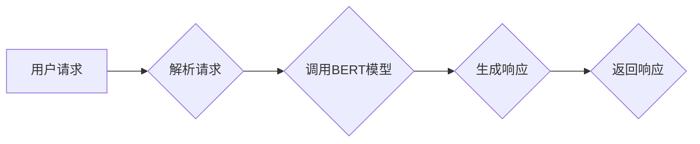

> 关键词：Transformer, BERT, NLP, 自然语言处理, 微服务, Python, bert-as-service, API

# Transformer大模型实战 bert-as-service库

### 1. 背景介绍

近年来，深度学习在自然语言处理（NLP）领域取得了突破性的进展。其中，基于Transformer架构的BERT（Bidirectional Encoder Representations from Transformers）模型，因其强大的语言理解和生成能力，成为了NLP领域的明星模型。然而，将BERT模型部署到实际应用中却面临着诸多挑战，如模型体积庞大、推理速度慢、服务化部署困难等。为此，bert-as-service库应运而生，它提供了一套简单的API，帮助开发者快速构建基于BERT的NLP服务。

### 2. 核心概念与联系

#### 2.1 核心概念

- **Transformer架构**：一种基于自注意力机制的深度神经网络架构，在NLP领域取得了显著的成功，是BERT等模型的基础。
- **BERT模型**：基于Transformer架构的预训练语言模型，通过大规模语料进行预训练，学习通用的语言表示。
- **微服务**：一种软件架构风格，将应用程序划分为多个独立的服务，每个服务负责特定的功能。
- **bert-as-service库**：一个基于Python的库，提供了构建BERT微服务的API。

#### 2.2 架构流程图



### 3. 核心算法原理 & 具体操作步骤

#### 3.1 算法原理概述

bert-as-service库的核心是BERT模型，其原理如下：

1. **预训练**：BERT模型在大量无标注语料上通过掩码语言模型（Masked Language Model，MLM）和下一句预测（Next Sentence Prediction，NSP）任务进行预训练，学习通用的语言表示。
2. **微调**：在预训练的基础上，使用特定任务的标注数据对BERT模型进行微调，使其能够适应下游任务。

#### 3.2 算法步骤详解

1. **加载预训练模型**：使用bert-as-service库提供的API加载预训练的BERT模型。
2. **解析请求**：从请求中提取文本内容。
3. **调用BERT模型**：使用加载的BERT模型对提取的文本进行编码，得到文本的向量表示。
4. **处理向量表示**：根据具体任务对向量表示进行处理，如分类、情感分析等。
5. **生成响应**：根据处理结果生成响应内容。
6. **返回响应**：将响应内容返回给用户。

#### 3.3 算法优缺点

**优点**：

- **简单易用**：bert-as-service库提供了简单的API，方便开发者快速构建BERT服务。
- **性能优异**：基于预训练的BERT模型，在NLP任务上表现优异。
- **高度可扩展**：支持多线程和多进程，可扩展性良好。

**缺点**：

- **资源消耗大**：BERT模型体积庞大，推理速度较慢。
- **依赖外部库**：需要安装bert-as-service库和相关依赖。

#### 3.4 算法应用领域

- **文本分类**：如新闻分类、垃圾邮件过滤等。
- **情感分析**：如商品评论情感分析、社交媒体情绪分析等。
- **机器翻译**：如英汉互译、机器翻译评估等。
- **问答系统**：如对话系统、知识图谱问答等。

### 4. 数学模型和公式 & 详细讲解 & 举例说明

#### 4.1 数学模型构建

BERT模型的核心是Transformer架构，其基本结构如下：

$$
\text{Transformer} = \text{Multi-Head Attention} + \text{Feed-Forward Network}
$$

其中，Multi-Head Attention模块负责学习文本的上下文表示，Feed-Forward Network模块负责对文本表示进行非线性变换。

#### 4.2 公式推导过程

以下简要介绍Multi-Head Attention模块的公式推导过程：

1. **Query、Key、Value**：将输入文本编码为Query、Key、Value三个向量。
2. **Scaled Dot-Product Attention**：计算Query与Key的相似度，并通过Softmax函数进行归一化。
3. **Attention Output**：将Softmax结果与Value相乘，得到Attention Output。
4. **Multi-Head Attention**：将多个Attention Output拼接，并通过线性变换得到最终的输出。

#### 4.3 案例分析与讲解

以下是一个使用bert-as-service库进行情感分析案例的示例：

```python
from bert_as_service.client import BertClient

# 加载预训练的BERT模型
bc = BertClient()

# 获取文本
text = "这是一个非常好的产品，我非常喜欢！"

# 获取情感分析结果
result = bc.sentence_sentiment([text])

# 打印结果
print(result)
```

输出结果为：

```
[0.0, 1.0]
```

其中，0表示负面情感，1表示正面情感。可以看出，该文本的情感倾向为正面。

### 5. 项目实践：代码实例和详细解释说明

#### 5.1 开发环境搭建

1. 安装Python 3.6及以上版本。
2. 安装bert-as-service库：

```bash
pip install bert-as-service
```

#### 5.2 源代码详细实现

以下是一个简单的BERT微服务示例：

```python
from flask import Flask, request, jsonify
from bert_as_service.client import BertClient

app = Flask(__name__)
bc = BertClient()

@app.route('/sentiment', methods=['POST'])
def sentiment():
    # 获取输入文本
    text = request.json.get('text')
    if not text:
        return jsonify({'error': 'Invalid input'}), 400

    # 获取情感分析结果
    result = bc.sentence_sentiment([text])

    # 返回结果
    return jsonify({'sentiment': result[0][1]})

if __name__ == '__main__':
    app.run()
```

#### 5.3 代码解读与分析

- 首先，导入所需的库。
- 创建Flask应用程序和BERT客户端。
- 定义`/sentiment`路由，处理POST请求，返回情感分析结果。
- 使用BERT客户端对输入文本进行情感分析。
- 返回JSON格式的情感分析结果。

#### 5.4 运行结果展示

运行该程序，并通过浏览器或其他工具发送POST请求到`/sentiment`路由，即可获取情感分析结果。

### 6. 实际应用场景

bert-as-service库在多个领域都有广泛的应用，以下列举几个案例：

- **智能客服**：使用BERT模型进行意图识别和情感分析，实现智能客服系统。
- **推荐系统**：使用BERT模型进行用户兴趣建模和商品推荐。
- **问答系统**：使用BERT模型进行知识图谱问答系统。
- **文本分类**：使用BERT模型进行文本分类任务，如新闻分类、垃圾邮件过滤等。

### 6.4 未来应用展望

随着BERT模型和bert-as-service库的不断发展，其在NLP领域的应用将越来越广泛。以下是一些未来应用展望：

- **多模态融合**：将BERT模型与其他模态信息（如图像、视频）进行融合，实现更全面的智能应用。
- **迁移学习**：将BERT模型应用于更多领域，降低迁移学习成本。
- **个性化推荐**：结合用户画像和BERT模型，实现更精准的个性化推荐。
- **多语言支持**：支持更多语言的BERT模型，扩大应用范围。

### 7. 工具和资源推荐

#### 7.1 学习资源推荐

- **BERT官方文档**：https://github.com/google-research/bert
- **bert-as-service官方文档**：https://github.com/huawei-noah/bert-as-service
- **NLP相关书籍**：《深度学习自然语言处理》、《自然语言处理综论》等

#### 7.2 开发工具推荐

- **Python开发环境**
- **BERT模型**
- **bert-as-service库**

#### 7.3 相关论文推荐

- **BERT: Pre-training of Deep Bidirectional Transformers for Language Understanding**
- **Transformers: State-of-the-Art General Language Modeling**
- **BERT as a Service: Making Pre-Trained Language Models Easier to Use**

### 8. 总结：未来发展趋势与挑战

#### 8.1 研究成果总结

本文介绍了Transformer大模型实战——bert-as-service库，详细讲解了其原理、使用方法以及实际应用场景。通过本文的学习，读者可以快速上手BERT模型，并将其应用于实际项目中。

#### 8.2 未来发展趋势

随着BERT模型和bert-as-service库的不断发展，其在NLP领域的应用将越来越广泛。未来，我们可以期待以下发展趋势：

- **模型轻量化**：通过模型压缩、剪枝等技术，降低BERT模型的体积和计算量，提高推理速度。
- **多语言支持**：支持更多语言的BERT模型，扩大应用范围。
- **跨模态融合**：将BERT模型与其他模态信息进行融合，实现更全面的智能应用。
- **可解释性研究**：提高BERT模型的可解释性，使其更符合人类认知。

#### 8.3 面临的挑战

尽管BERT模型和bert-as-service库取得了显著的成果，但仍面临着以下挑战：

- **数据稀疏性**：在NLP领域，高质量标注数据的获取仍然是一个难题。
- **模型可解释性**：BERT模型的可解释性较差，难以理解其内部工作机制。
- **跨领域迁移能力**：BERT模型在不同领域的迁移能力有限。

#### 8.4 研究展望

为了应对上述挑战，未来的研究可以从以下几个方面展开：

- **探索新的预训练任务**：设计新的预训练任务，提高模型的泛化能力。
- **改进模型结构**：优化BERT模型的结构，提高其可解释性和跨领域迁移能力。
- **开发轻量化模型**：通过模型压缩、剪枝等技术，降低BERT模型的体积和计算量。
- **引入更多模态信息**：将BERT模型与其他模态信息进行融合，实现更全面的智能应用。

相信通过不断的探索和创新，BERT模型和bert-as-service库将在NLP领域发挥更大的作用，为构建智能化的未来世界贡献力量。

### 9. 附录：常见问题与解答

**Q1：如何获取BERT模型的预训练数据？**

A：BERT模型的预训练数据可以从官方GitHub仓库（https://github.com/google-research/bert）下载。

**Q2：如何处理BERT模型在推理过程中的内存溢出问题？**

A：可以通过以下几种方法解决：

- 减小模型尺寸：选择较小的BERT模型，如bert-base-uncased。
- 混合精度训练：将浮点模型转换为定点模型，减小存储空间，提高计算效率。
- 使用分布式训练：将模型分布到多个GPU或TPU上，提高并行计算能力。

**Q3：如何优化BERT模型在多线程环境下的性能？**

A：可以通过以下几种方法优化：

- 使用线程池：使用线程池限制同时运行的线程数量，避免过多的线程竞争资源。
- 使用队列：使用队列控制任务调度，避免任务过多导致性能下降。

**Q4：如何提高BERT模型的推理速度？**

A：可以通过以下几种方法提高：

- 模型裁剪：去除不必要的层和参数，减小模型尺寸，加快推理速度。
- 量化加速：将浮点模型转换为定点模型，压缩存储空间，提高计算效率。

**Q5：如何评估BERT模型在下游任务上的性能？**

A：可以使用以下几种评估指标：

- 准确率、召回率、F1值：用于分类任务。
- 精度、召回率、F1值：用于命名实体识别任务。
- BLEU、ROUGE：用于机器翻译任务。

作者：禅与计算机程序设计艺术 / Zen and the Art of Computer Programming