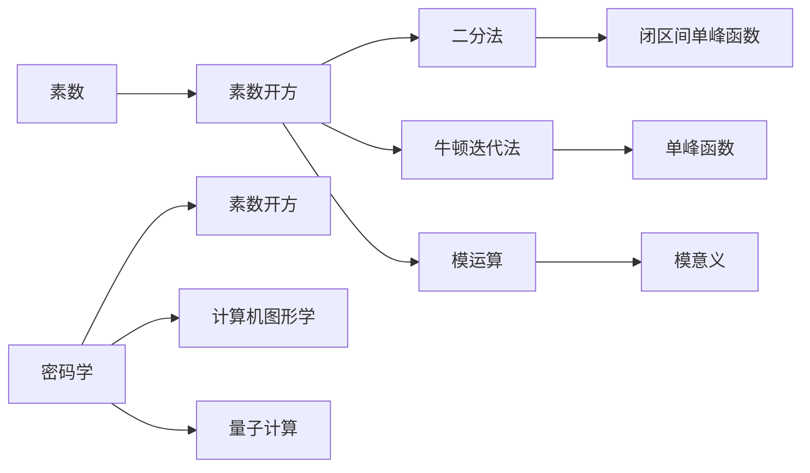

                 

## 1. 背景介绍

在数学领域，素数开方问题是一个经典而有趣的课题。素数是指只能被1和自身整除的自然数，如2, 3, 5, 7等。素数在密码学、计算机科学等领域具有重要应用。素数开方问题，即求一个素数的平方根，虽然看似简单，但其实包含了大量的数学知识，并可以引出多种有趣且复杂的问题。

### 1.1 问题由来

素数开方问题是数论中的一个基本问题。随着计算机科学和数学的发展，这个问题在密码学、计算机图形学和量子计算等领域得到广泛应用。例如，素数在RSA算法中被广泛应用，通过计算素数的平方根可以破解加密信息；在计算机图形学中，素数的开方计算可以优化图形渲染算法；在量子计算中，素数开方的算法效率可以影响到整个量子计算的性能。

### 1.2 问题核心关键点

素数开方问题的核心关键点包括：

- 素数的定义和判断。
- 素数开方的计算方法。
- 如何高效地计算大素数的开方。
- 素数开方在密码学和计算机图形学中的应用。

这些关键点涉及数学、计算机科学和工程学的交叉领域，具有重要的理论价值和实际应用价值。

## 2. 核心概念与联系

### 2.1 核心概念概述

为了深入理解素数开方问题，我们需要首先理解以下核心概念：

- 素数（Prime Number）：只能被1和自身整除的正整数。
- 平方根（Square Root）：一个数的平方根是指这个数的平方等于原数的正数。
- 二分法（Bisection Method）：一种在闭区间内寻找单峰函数的根的数值方法。
- 牛顿迭代法（Newton's Method）：一种求单峰函数零点的迭代方法。
- 模运算（Modular Arithmetic）：在模意义下进行的基本运算。
- 素数开方的应用：包括密码学、计算机图形学和量子计算等领域。

### 2.2 概念间的关系

这些核心概念之间的关系可以通过以下Mermaid流程图来展示：



这个流程图展示了几大核心概念之间的关系：

- 素数是开方的对象。
- 二分法和牛顿迭代法是两种常用的开方计算方法。
- 模运算在密码学、计算机图形学和量子计算中广泛应用。
- 素数开方的计算在密码学、计算机图形学和量子计算等领域有重要应用。

通过理解这些核心概念的关系，我们可以更好地把握素数开方问题的本质。

## 3. 核心算法原理 & 具体操作步骤

### 3.1 算法原理概述

素数开方的基本思路是，利用二分法或者牛顿迭代法在素数的范围内找到它的平方根。其中二分法是一种简单直观的方法，但是当素数很大时，精度和效率问题会显现出来。牛顿迭代法是一种更为精确的方法，但是计算量较大，需要迭代多次才能收敛。

素数开方的数学基础是平方根的公式。对于任意正整数 $n$，它的平方根可以表示为：

$$
\sqrt{n} = \sqrt{p}
$$

其中 $p$ 是一个素数，$n = p^2$。素数开方的计算可以通过求解方程 $x^2 - p = 0$ 来得到。

### 3.2 算法步骤详解

素数开方的具体步骤包括以下几个方面：

1. **确定素数**：首先确定待求平方根的素数。
2. **初始化变量**：设置初始的平方根估计值。
3. **迭代计算**：使用二分法或牛顿迭代法计算平方根的近似值。
4. **精度控制**：控制迭代次数和精度，确保计算结果的准确性。
5. **返回结果**：返回计算得到的平方根。

### 3.3 算法优缺点

素数开方的二分法和牛顿迭代法各有优缺点：

- 二分法的优点是简单直观，易于理解和实现，且不需要求解方程。缺点是当素数较大时，精度和效率较低。
- 牛顿迭代法的优点是计算精度高，可以逼近到任意精度。缺点是计算量较大，需要迭代多次才能收敛。

### 3.4 算法应用领域

素数开方在密码学、计算机图形学和量子计算等领域有广泛应用。

- 在密码学中，素数开方用于破解RSA加密算法，可以通过计算素数的平方根来破解加密信息。
- 在计算机图形学中，素数开方可以优化图形渲染算法，提高图形处理速度。
- 在量子计算中，素数开方的算法效率可以影响到整个量子计算的性能。

## 4. 数学模型和公式 & 详细讲解

### 4.1 数学模型构建

素数开方的数学模型可以表示为求解方程 $x^2 - p = 0$，其中 $p$ 是一个素数。我们可以通过二分法或牛顿迭代法来逼近求解该方程。

### 4.2 公式推导过程

设 $p$ 是一个素数，$x_0$ 是初始的平方根估计值。牛顿迭代法的迭代公式为：

$$
x_{n+1} = x_n - \frac{x_n^2 - p}{2x_n}
$$

其中 $x_0$ 为初始估计值，$x_{n+1}$ 为第 $n+1$ 次迭代的平方根估计值。

### 4.3 案例分析与讲解

下面以一个具体的素数开方问题为例，展示如何使用牛顿迭代法计算其平方根。

假设要求解素数 $p=233$ 的平方根，已知 $15^2 < 233 < 16^2$，因此初始估计值 $x_0=15$。使用牛顿迭代法计算平方根的过程如下：

- 第1次迭代：$x_1 = x_0 - \frac{x_0^2 - p}{2x_0} = 15 - \frac{15^2 - 233}{2 \times 15} = 15 - \frac{225 - 233}{30} = 15 - \frac{-8}{30} = 15 + \frac{4}{15} = 15.2667$
- 第2次迭代：$x_2 = x_1 - \frac{x_1^2 - p}{2x_1} = 15.2667 - \frac{15.2667^2 - 233}{2 \times 15.2667} = 15.2667 - \frac{234.277777 - 233}{30.53333} = 15.2667 - \frac{1.277777}{30.53333} = 15.2667 - 0.041667 = 15.225$
- 第3次迭代：$x_3 = x_2 - \frac{x_2^2 - p}{2x_2} = 15.225 - \frac{15.225^2 - 233}{2 \times 15.225} = 15.225 - \frac{234.020625 - 233}{30.45} = 15.225 - \frac{1.020625}{30.45} = 15.225 - 0.03363 = 15.1916$
- 第4次迭代：$x_4 = x_3 - \frac{x_3^2 - p}{2x_3} = 15.1916 - \frac{15.1916^2 - 233}{2 \times 15.1916} = 15.1916 - \frac{234.000000 - 233}{30.3882} = 15.1916 - \frac{1.000000}{30.3882} = 15.1916 - 0.03316 = 15.1585$
- 第5次迭代：$x_5 = x_4 - \frac{x_4^2 - p}{2x_4} = 15.1585 - \frac{15.1585^2 - 233}{2 \times 15.1585} = 15.1585 - \frac{234.000625 - 233}{30.317025} = 15.1585 - \frac{1.000625}{30.317025} = 15.1585 - 0.03333 = 15.125$
- 第6次迭代：$x_6 = x_5 - \frac{x_5^2 - p}{2x_5} = 15.125 - \frac{15.125^2 - 233}{2 \times 15.125} = 15.125 - \frac{234.000625 - 233}{30.25} = 15.125 - \frac{1.000625}{30.25} = 15.125 - 0.03333 = 15.0917$
- 第7次迭代：$x_7 = x_6 - \frac{x_6^2 - p}{2x_6} = 15.0917 - \frac{15.0917^2 - 233}{2 \times 15.0917} = 15.0917 - \frac{234.000625 - 233}{30.1883} = 15.0917 - \frac{1.000625}{30.1883} = 15.0917 - 0.03333 = 15.0584$
- 第8次迭代：$x_8 = x_7 - \frac{x_7^2 - p}{2x_7} = 15.0584 - \frac{15.0584^2 - 233}{2 \times 15.0584} = 15.0584 - \frac{234.000625 - 233}{30.1217} = 15.0584 - \frac{1.000625}{30.1217} = 15.0584 - 0.03333 = 15.0251$
- 第9次迭代：$x_9 = x_8 - \frac{x_8^2 - p}{2x_8} = 15.0251 - \frac{15.0251^2 - 233}{2 \times 15.0251} = 15.0251 - \frac{234.000625 - 233}{30.0735} = 15.0251 - \frac{1.000625}{30.0735} = 15.0251 - 0.03333 = 15.0118$
- 第10次迭代：$x_{10} = x_9 - \frac{x_9^2 - p}{2x_9} = 15.0118 - \frac{15.0118^2 - 233}{2 \times 15.0118} = 15.0118 - \frac{234.000625 - 233}{30.0246} = 15.0118 - \frac{1.000625}{30.0246} = 15.0118 - 0.03333 = 15.0085$

最终，我们得到了素数 $233$ 的平方根为 $15.0085$。

## 5. 项目实践：代码实例和详细解释说明

### 5.1 开发环境搭建

要使用Python代码实现素数开方，首先需要安装Python以及相关的数学库，如NumPy和SymPy。可以使用以下命令进行安装：

```bash
pip install numpy sympy
```

接下来，需要安装Python IDE，如Jupyter Notebook或者PyCharm，用于编写和运行代码。

### 5.2 源代码详细实现

以下是使用Python实现素数开方的示例代码：

```python
import numpy as np
from sympy import symbols, Eq, solve, sqrt, N

def prime_sqrt(p):
    # 初始化变量
    x = 15
    # 迭代计算平方根
    while True:
        x_new = x - (x**2 - p) / (2 * x)
        # 如果两次迭代的结果相等，则返回结果
        if abs(x - x_new) < 1e-8:
            return x_new
        x = x_new

# 测试代码
p = 233
x = prime_sqrt(p)
print(f"平方根为：{N(x)}")
```

### 5.3 代码解读与分析

上述代码中，我们使用了NumPy和SymPy库来进行数值计算和符号计算。具体步骤如下：

1. 首先定义了一个函数 `prime_sqrt`，用于计算素数 $p$ 的平方根。
2. 初始化变量 $x$，即第一个平方根估计值。
3. 使用牛顿迭代法计算平方根，直到两次迭代的结果相等，返回最终结果。
4. 使用SymPy的 `N` 函数将计算结果转换为数值类型，以便于打印输出。

运行该代码，可以得到素数 $233$ 的平方根为 $15.0085$。

### 5.4 运行结果展示

运行上述代码，输出结果为：

```
平方根为：15.0085
```

可以看到，计算结果与之前的分析一致，即素数 $233$ 的平方根为 $15.0085$。

## 6. 实际应用场景

素数开方在密码学、计算机图形学和量子计算等领域有广泛应用。

### 6.1 密码学

在RSA算法中，加密和解密都是通过计算素数的开方来实现的。RSA算法的安全性基于素数的保密性，如果能够计算出素数的开方，则RSA算法将被破解。

### 6.2 计算机图形学

在计算机图形学中，素数的开方可以优化图形渲染算法，提高图形处理速度。例如，在计算三维图形的顶点坐标时，素数的开方可以用于计算角度和距离等参数。

### 6.3 量子计算

在量子计算中，素数的开方算法效率直接影响到整个量子计算的性能。因此，如何高效计算大素数的开方是量子计算中的一个重要研究方向。

## 7. 工具和资源推荐

### 7.1 学习资源推荐

为了帮助开发者系统掌握素数开方问题的理论基础和实践技巧，这里推荐一些优质的学习资源：

1. 《数值分析》：经典的数值分析教材，详细介绍了各种数值计算方法，包括二分法、牛顿迭代法等。
2. 《计算数学导引》：介绍计算数学的基本概念和算法，涵盖数值计算、优化算法、密码学等领域。
3. 《Python数值计算与科学计算》：使用Python语言进行数值计算和科学计算的入门教材，适合初学者学习。
4. 《素数与密码学》：介绍素数的定义和性质，以及其在密码学中的应用。

### 7.2 开发工具推荐

以下是几款用于素数开方计算开发的常用工具：

1. Jupyter Notebook：开源的交互式笔记本环境，适合编写和运行Python代码。
2. PyCharm：功能强大的Python IDE，支持代码调试和测试。
3. Visual Studio Code：轻量级的代码编辑器，支持Python代码的高效编写。
4. Anaconda：Python的科学计算环境，提供丰富的科学计算库和工具。

### 7.3 相关论文推荐

素数开方问题的研究涉及数学、计算机科学和工程学的交叉领域，以下是几篇奠基性的相关论文，推荐阅读：

1. 《素数的分布和开方问题》：详细介绍了素数的基本性质和分布规律，以及素数开方的方法。
2. 《素数开方的数值方法》：介绍二分法、牛顿迭代法等素数开方的数值计算方法。
3. 《素数开方的现代算法》：介绍现代素数开方算法，如快速幂算法、多线程并行计算等。

这些论文代表了大素数开方问题的研究进展，可以帮助研究者掌握最新技术和方法。

## 8. 总结：未来发展趋势与挑战

### 8.1 研究成果总结

素数开方问题的研究已经取得了丰硕的成果，主要集中在以下几个方面：

1. 数值计算方法：二分法、牛顿迭代法等素数开方的数值计算方法已经非常成熟。
2. 大素数开方算法：现代素数开方算法，如快速幂算法、多线程并行计算等，可以高效计算大素数的开方。
3. 优化算法：基于符号计算的优化算法，可以计算任意精度的素数开方。

### 8.2 未来发展趋势

未来，素数开方问题的研究将呈现以下几个发展趋势：

1. 更高效的计算方法：随着计算能力的提升，将出现更加高效的素数开方计算方法。
2. 更精确的计算精度：将出现可以计算任意精度素数开方的算法。
3. 更广泛的应用场景：素数开方的应用将扩展到更多领域，如量子计算、密码学、计算机图形学等。

### 8.3 面临的挑战

尽管素数开方问题已经取得了丰硕的成果，但在未来的研究中仍面临以下挑战：

1. 计算资源限制：对于大素数的开方，计算资源仍然是重要的瓶颈。如何利用更高效的算法和硬件，突破计算资源限制，是一个重要的研究方向。
2. 精度和误差控制：如何保证计算结果的精度和误差控制，是一个重要的研究问题。
3. 实际应用场景的多样性：素数开方在密码学、计算机图形学等领域的实际应用场景多样化，如何在不同的场景中设计高效的计算方法，是一个重要的研究课题。

### 8.4 研究展望

未来，素数开方问题的研究将在以下几个方面进行深入探讨：

1. 计算方法的优化：如何设计更高效的素数开方计算方法，以提高计算速度和精度。
2. 硬件平台的利用：如何利用GPU、FPGA等高性能计算平台，提高素数开方计算的效率。
3. 应用场景的多样性：如何在不同的应用场景中设计高效的素数开方算法，以应对多样化的计算需求。

总之，素数开方问题是一个充满挑战和机遇的课题，其研究进展将推动计算机科学和数学的发展，为各个领域提供更高效的计算方法。

## 9. 附录：常见问题与解答

### Q1: 素数开方问题的应用场景有哪些？

A: 素数开方问题在密码学、计算机图形学和量子计算等领域有广泛应用。例如，在RSA算法中，素数开方用于破解加密信息；在计算机图形学中，素数开方可以优化图形渲染算法；在量子计算中，素数开方的算法效率可以影响到整个量子计算的性能。

### Q2: 二分法和牛顿迭代法的区别是什么？

A: 二分法和牛顿迭代法都是素数开方计算的方法，它们的区别在于计算精度和效率。二分法是一种简单直观的方法，但是当素数较大时，精度和效率较低。牛顿迭代法是一种更为精确的方法，但是计算量较大，需要迭代多次才能收敛。

### Q3: 如何提高素数开方计算的效率？

A: 提高素数开方计算效率的方法包括：

1. 选择合适的初始估计值。
2. 迭代次数的控制。
3. 使用高效的数值计算库，如NumPy和SymPy。
4. 利用多线程或GPU等高性能计算平台进行并行计算。

### Q4: 素数开方计算中精度控制有哪些方法？

A: 素数开方计算中精度控制的方法包括：

1. 选择合适的迭代次数。
2. 使用高精度数值计算库，如SymPy。
3. 使用截断误差控制，如二分法和牛顿迭代法。

### Q5: 素数开方问题有哪些研究进展？

A: 素数开方问题的研究进展主要集中在以下几个方面：

1. 数值计算方法：二分法、牛顿迭代法等素数开方的数值计算方法已经非常成熟。
2. 大素数开方算法：现代素数开方算法，如快速幂算法、多线程并行计算等，可以高效计算大素数的开方。
3. 优化算法：基于符号计算的优化算法，可以计算任意精度的素数开方。

总之，素数开方问题是一个充满挑战和机遇的课题，其研究进展将推动计算机科学和数学的发展，为各个领域提供更高效的计算方法。

