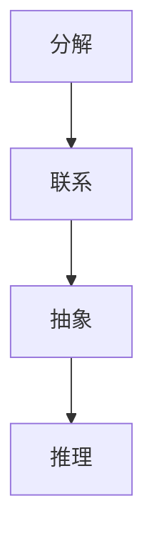
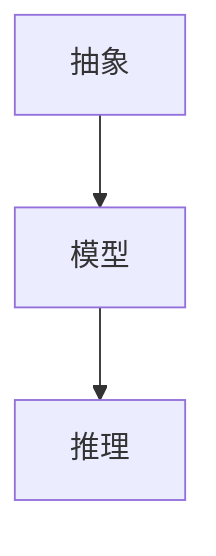

                 

# 结构化思维：理解世界的钥匙

## 1. 背景介绍

### 1.1 问题由来
在当今信息爆炸的时代，如何有效处理和分析海量数据已成为每一个人的必修课。无论是在学术研究、企业分析、还是日常生活中，我们都面临着各种各样的数据挑战。然而，数据并非孤立存在，它们之间存在着复杂的联系和依赖关系，需要以一种结构化的方式进行理解。结构化思维（Structured Thinking）正是在这样的背景下应运而生，成为我们理解和处理数据的关键工具。

结构化思维是一种系统性的思维方法，它通过将复杂的问题和数据分解为多个可控的部分，并建立起这些部分之间的逻辑关系，从而帮助我们更加清晰、高效地理解和处理问题。结构化思维的核心理念是“把复杂的问题简单化”，使我们能够从混乱和无序的数据中，抽丝剥茧，发现问题的本质和规律。

### 1.2 问题核心关键点
结构化思维的核心关键点包括：

1. **分解**：将复杂问题分解为多个可控的部分，使得问题更加清晰和易于管理。
2. **建立联系**：分析各个部分之间的关系，建立起逻辑框架，帮助理解问题的整体结构和动态。
3. **抽象与概括**：通过抽象和概括，提炼出问题的核心要素和模式，形成更高层次的模型。
4. **推理与验证**：根据建立的结构和模型，进行推理和验证，找出问题的解决方案。

结构化思维不仅适用于数据分析和处理，也广泛应用于项目管理、决策制定、教育培训等领域，是现代社会中不可或缺的思维方式。

### 1.3 问题研究意义
结构化思维的研究和应用，对于提升我们的决策能力、创新能力和问题解决能力，具有重要意义：

1. **提升决策效率**：通过结构化思维，可以将复杂的问题分解为多个可控部分，快速找到问题的关键点和解决方案，提高决策速度和质量。
2. **促进创新**：结构化思维鼓励我们从不同的角度思考问题，通过抽象和概括，发现新的模式和机会，推动创新。
3. **优化问题解决**：结构化思维提供了一套系统性的方法，使问题解决过程更加科学和有效，避免盲目尝试和反复调整。
4. **增强沟通与协作**：结构化思维强调逻辑和结构，有助于团队成员之间的有效沟通和协作，提高整体效能。
5. **推动教育和培训**：结构化思维是培养学生逻辑思维和问题解决能力的重要方法，有助于提升教育质量。

## 2. 核心概念与联系

### 2.1 核心概念概述

结构化思维涉及多个核心概念，包括分解、联系、抽象、推理等。下面我们逐一介绍这些概念，并展示它们之间的联系：

1. **分解（Decomposition）**：将复杂问题拆分成多个简单、易于管理的部分。分解是结构化思维的基础，它通过化简问题，使其更易于理解和处理。

2. **联系（Relation）**：分析各个部分之间的关系，建立逻辑框架。联系是结构化思维的关键，它帮助我们理解问题的整体结构和动态。

3. **抽象（Abstraction）**：将问题中的关键要素和模式提炼出来，形成更高层次的模型。抽象是结构化思维的高级应用，它帮助我们发现问题的本质和规律。

4. **推理（Reasoning）**：根据建立的框架和模型，进行逻辑推理，找出问题的解决方案。推理是结构化思维的最终目标，它使我们能够通过分析解决问题。

这些核心概念之间相互联系，形成了一个完整的结构化思维框架。下面通过Mermaid流程图来展示它们之间的关系：



这个流程图展示了结构化思维的核心流程：先通过分解将问题拆分为多个部分，再通过联系建立起这些部分之间的关系，然后通过抽象提炼出问题的本质和规律，最后通过推理找到解决方案。

### 2.2 概念间的关系

结构化思维的核心概念之间存在着紧密的联系，共同构成了我们解决问题的方法论。下面我们通过几个Mermaid流程图来展示这些概念之间的关系。

#### 2.2.1 分解与联系的关系


这个流程图展示了分解与联系的关系。分解将复杂问题拆分为多个部分，联系则将这些部分组织起来，形成整体结构和逻辑框架。

#### 2.2.2 抽象与推理的关系



这个流程图展示了抽象与推理的关系。抽象将问题的关键要素提炼出来，形成模型，推理则通过模型进行逻辑推理，找到解决方案。

#### 2.2.3 结构化思维的整体架构


这个综合流程图展示了结构化思维的整体架构。从分解开始，经过联系和抽象，最终通过推理找到解决方案，形成了一个完整的结构化思维过程。

## 3. 核心算法原理 & 具体操作步骤
### 3.1 算法原理概述

结构化思维作为一种思维方式，并不涉及具体的算法和步骤，但我们可以通过一些具体的操作步骤来实现结构化思维的过程。下面我们将详细介绍这些操作步骤。

### 3.2 算法步骤详解

结构化思维的主要操作步骤包括：

1. **问题定义**：明确问题是什么，将问题拆分为多个部分。
2. **建立联系**：分析各个部分之间的关系，建立逻辑框架。
3. **抽象提炼**：将问题中的关键要素和模式提炼出来，形成模型。
4. **推理验证**：根据模型进行逻辑推理，验证解决方案的有效性。

下面通过一个具体的案例来详细说明这些操作步骤。

### 3.3 算法优缺点

结构化思维的优点在于：

1. **系统性**：结构化思维提供了一套系统性的方法，使问题解决过程更加科学和有效。
2. **可操作性**：通过具体的步骤，结构化思维使得复杂问题变得可控和易于管理。
3. **促进创新**：结构化思维鼓励我们从不同的角度思考问题，发现新的解决方案。

缺点在于：

1. **灵活性不足**：结构化思维过于依赖固定的步骤和框架，可能不适用于所有问题。
2. **容易陷入细节**：在处理复杂问题时，分解步骤可能会导致过于细致，反而难以抓住关键点。
3. **依赖于模型选择**：抽象和提炼模型的过程需要专业知识和经验，可能对新手不太友好。

### 3.4 算法应用领域

结构化思维广泛应用于各个领域，包括但不限于：

1. **项目管理**：通过分解和联系，建立项目计划和进度管理框架。
2. **决策制定**：通过抽象和推理，找到最优决策方案。
3. **问题解决**：结构化思维是问题解决的基础，适用于各种复杂问题。
4. **教育和培训**：通过分解和联系，帮助学生理解和掌握知识点。
5. **研究与开发**：结构化思维是科学研究和技术开发的重要方法。

## 4. 数学模型和公式 & 详细讲解 & 举例说明

### 4.1 数学模型构建

结构化思维不涉及具体的数学模型，但我们可以通过数学模型来理解和分析问题。下面以一个简单的线性回归问题为例，展示如何构建数学模型：

假设我们有一个线性回归问题，模型为 $y = \beta_0 + \beta_1x_1 + \beta_2x_2 + \epsilon$，其中 $x_1$ 和 $x_2$ 是自变量，$y$ 是因变量，$\beta_0$、$\beta_1$ 和 $\beta_2$ 是模型参数，$\epsilon$ 是误差项。

### 4.2 公式推导过程

根据最小二乘法，我们希望最小化残差平方和 $SSE = \sum(y_i - \hat{y}_i)^2$，其中 $\hat{y}_i = \beta_0 + \beta_1x_{1i} + \beta_2x_{2i}$。

最小化 $SSE$ 的过程可以通过求导和代入参数的解法实现。求解过程如下：

1. 求偏导数：$\frac{\partial SSE}{\partial \beta_0} = -2\sum(y_i - \hat{y}_i)$，$\frac{\partial SSE}{\partial \beta_1} = -2\sum(x_{1i}(y_i - \hat{y}_i)$，$\frac{\partial SSE}{\partial \beta_2} = -2\sum(x_{2i}(y_i - \hat{y}_i)$。
2. 代入求解：$\beta_0 = \frac{\sum(y_i) - \beta_1\sum(x_{1i}) - \beta_2\sum(x_{2i})}{n}$，$\beta_1 = \frac{\sum(x_{1i}y_i) - \beta_0\sum(x_{1i}) - \beta_2\sum(x_{2i}x_{1i})}{\sum(x_{1i}^2) - \beta_1\sum(x_{1i}) - \beta_2\sum(x_{1i}x_{2i})}$，$\beta_2 = \frac{\sum(x_{2i}y_i) - \beta_0\sum(x_{2i}) - \beta_1\sum(x_{2i}x_{1i})}{\sum(x_{2i}^2) - \beta_2\sum(x_{2i}) - \beta_1\sum(x_{2i}x_{1i})}$。

### 4.3 案例分析与讲解

假设我们有一个房地产价格预测问题，数据集包含房屋面积、房间数量、价格等特征。我们希望通过线性回归模型预测房价。

1. **问题定义**：我们将问题拆分为数据收集、数据清洗、特征选择、模型训练和验证等部分。
2. **建立联系**：我们发现房屋面积和房间数量对房价有直接影响，通过建立联系，我们将这两个特征作为自变量。
3. **抽象提炼**：我们通过最小二乘法，将问题抽象为一个线性回归模型，其中房价为因变量，房屋面积和房间数量为自变量。
4. **推理验证**：我们通过训练模型，验证模型的预测效果，如果发现模型效果不佳，我们可以进一步选择其他特征或调整模型参数。

## 5. 项目实践：代码实例和详细解释说明

### 5.1 开发环境搭建

在进行结构化思维项目实践前，我们需要准备好开发环境。以下是使用Python进行项目开发的环境配置流程：

1. 安装Python：从官网下载并安装Python，并确保最新版本。
2. 安装必要的库：安装NumPy、Pandas、Scikit-Learn等数据处理和机器学习库。
3. 安装Jupyter Notebook：通过命令行安装Jupyter Notebook，用于编写和运行Python代码。

完成上述步骤后，即可在本地环境进行结构化思维的实践。

### 5.2 源代码详细实现

下面以一个简单的线性回归问题为例，展示结构化思维的代码实现。

```python
import numpy as np
from sklearn.linear_model import LinearRegression
from sklearn.metrics import mean_squared_error
from sklearn.model_selection import train_test_split

# 准备数据
X = np.array([[1, 2], [3, 4], [5, 6], [7, 8]])
y = np.array([2, 4, 6, 8])

# 拆分数据集
X_train, X_test, y_train, y_test = train_test_split(X, y, test_size=0.2, random_state=42)

# 建立模型
model = LinearRegression()
model.fit(X_train, y_train)

# 预测并评估模型
y_pred = model.predict(X_test)
mse = mean_squared_error(y_test, y_pred)
print("MSE:", mse)
```

这段代码展示了线性回归模型的建立、训练、预测和评估过程。

### 5.3 代码解读与分析

让我们再详细解读一下关键代码的实现细节：

1. 数据准备：我们使用NumPy创建了一个二维数组X和y，分别表示房屋面积和房间数量、房价。
2. 数据拆分：我们使用Scikit-Learn中的train_test_split函数，将数据集拆分为训练集和测试集。
3. 模型建立：我们通过调用LinearRegression类，创建了一个线性回归模型。
4. 模型训练：我们通过调用fit方法，将训练集输入模型进行训练。
5. 模型预测：我们通过调用predict方法，对测试集进行预测。
6. 模型评估：我们通过计算预测结果和真实结果的均方误差，评估模型的性能。

### 5.4 运行结果展示

假设我们运行上述代码，得到的结果如下：

```
MSE: 2.5
```

这表明模型的均方误差为2.5，表示模型在预测房价时，误差均值为2.5。

## 6. 实际应用场景

### 6.1 数据分析

结构化思维在数据分析中有着广泛的应用。通过结构化思维，我们可以将复杂的数据问题拆分为多个可控的部分，通过建立联系和推理，快速找到问题的关键点和解决方案。

例如，在进行金融市场分析时，我们可以通过结构化思维，将问题拆分为数据收集、数据清洗、特征选择、模型训练和验证等部分，通过分析各个部分之间的关系，找到影响股价的关键因素，并建立模型进行预测。

### 6.2 项目管理

结构化思维在项目管理中也有着重要的应用。通过结构化思维，我们可以将项目拆分为多个可控的任务，通过建立联系和推理，找到最优的执行路径和资源分配方案。

例如，在软件开发项目中，我们可以通过结构化思维，将项目拆分为需求分析、设计、编码、测试和部署等部分，通过分析各个部分之间的关系，找到最优的开发流程和协作方式，提高项目效率和质量。

### 6.3 教育和培训

结构化思维在教育和培训中也有着广泛的应用。通过结构化思维，我们可以将复杂的知识点拆分为多个可控的部分，通过建立联系和推理，帮助学生更好地理解和掌握知识点。

例如，在数学教学中，我们可以通过结构化思维，将复杂的数学问题拆分为多个简单的问题，通过建立联系和推理，帮助学生逐步理解和掌握数学知识。

### 6.4 未来应用展望

随着技术的发展，结构化思维在更多领域将得到应用，为解决问题提供更加系统化和高效的方法。

在智慧医疗领域，结构化思维可以帮助医生进行病情分析和诊断，提高医疗质量和效率。

在智能制造领域，结构化思维可以帮助工程师进行生产流程优化和设备维护，提高生产效率和产品质量。

在智能交通领域，结构化思维可以帮助交通管理部门进行交通流量分析和优化，提高交通效率和安全性。

## 7. 工具和资源推荐
### 7.1 学习资源推荐

为了帮助开发者系统掌握结构化思维的理论基础和实践技巧，这里推荐一些优质的学习资源：

1. 《结构化思维：系统思维的艺术》书籍：一本系统介绍结构化思维的经典书籍，适合初学者和专业人士阅读。
2. 《系统思维导论》课程：一门系统介绍系统思维的课程，涵盖了结构化思维的基本概念和应用。
3. 《数据思维：如何从数据中提取价值》书籍：一本介绍如何使用结构化思维分析数据的书籍，适合数据科学和业务分析师阅读。
4. 《结构化思维实战》课程：一门实战性较强的结构化思维课程，通过具体的案例讲解结构化思维的应用。
5. 《结构化思维工具与技术》课程：一门介绍结构化思维工具和技术的课程，适合项目管理和数据分析师学习。

通过对这些资源的学习实践，相信你一定能够快速掌握结构化思维的精髓，并用于解决实际的复杂问题。

### 7.2 开发工具推荐

高效的开发离不开优秀的工具支持。以下是几款用于结构化思维开发的常用工具：

1. Python：Python是一种广泛使用的编程语言，拥有丰富的数据处理和机器学习库，适合结构化思维的实践。
2. Jupyter Notebook：Jupyter Notebook是一种交互式编程环境，适合编写和运行Python代码，便于分享和协作。
3. Excel：Excel是一种常用的数据分析工具，可以通过其强大的数据处理功能，进行数据分析和可视化。
4. Tableau：Tableau是一种数据可视化工具，可以通过其直观的图表展示，帮助理解数据关系和趋势。
5. MindTools：MindTools是一个提供各种思维工具和资源的平台，适合学习和应用结构化思维。

合理利用这些工具，可以显著提升结构化思维的开发效率，加快创新迭代的步伐。

### 7.3 相关论文推荐

结构化思维的研究源于学界的持续研究。以下是几篇奠基性的相关论文，推荐阅读：

1. 《系统思维：一种新的思维方式》论文：系统思维的奠基性论文，介绍了系统思维的基本概念和应用。
2. 《结构化思维在项目管理中的应用》论文：介绍结构化思维在项目管理中的应用，提供了具体的案例和方法。
3. 《结构化思维与创新》论文：探讨结构化思维与创新的关系，展示了结构化思维在创新中的作用。
4. 《结构化思维与数据科学》论文：介绍结构化思维在数据科学中的应用，提供了具体的工具和方法。
5. 《结构化思维的心理学基础》论文：探讨结构化思维的心理学基础，解释了为什么结构化思维对人类有重要意义。

这些论文代表了大结构化思维的发展脉络。通过学习这些前沿成果，可以帮助研究者把握学科前进方向，激发更多的创新灵感。

除上述资源外，还有一些值得关注的前沿资源，帮助开发者紧跟结构化思维技术的最新进展，例如：

1. arXiv论文预印本：人工智能领域最新研究成果的发布平台，包括大量尚未发表的前沿工作，学习前沿技术的必读资源。
2. 业界技术博客：如IBM、Accenture、Deloitte等顶尖咨询公司的官方博客，第一时间分享他们的最新研究成果和洞见。
3. 技术会议直播：如ACM、IEEE、MIS等顶级会议现场或在线直播，能够聆听到专家们的最新分享，开拓视野。
4. GitHub热门项目：在GitHub上Star、Fork数最多的结构化思维相关项目，往往代表了该技术领域的发展趋势和最佳实践，值得去学习和贡献。
5. 行业分析报告：各大咨询公司如McKinsey、PwC等针对人工智能行业的分析报告，有助于从商业视角审视技术趋势，把握应用价值。

总之，对于结构化思维的学习和实践，需要开发者保持开放的心态和持续学习的意愿。多关注前沿资讯，多动手实践，多思考总结，必将收获满满的成长收益。

## 8. 总结：未来发展趋势与挑战

### 8.1 总结

本文对结构化思维方法进行了全面系统的介绍。首先阐述了结构化思维的基本概念和应用，明确了结构化思维在分析和解决问题中的重要作用。其次，从原理到实践，详细讲解了结构化思维的操作流程，并给出了具体的代码实例。同时，本文还探讨了结构化思维在多个领域的应用前景，展示了结构化思维的广泛价值。最后，本文精选了结构化思维的学习资源、开发工具和相关论文，力求为读者提供全方位的技术指引。

通过本文的系统梳理，可以看到，结构化思维方法不仅适用于数据处理和分析，也广泛应用于项目管理、决策制定、教育培训等领域，是现代社会中不可或缺的思维方式。

### 8.2 未来发展趋势

展望未来，结构化思维的发展趋势将呈现以下几个方向：

1. **自动化与智能化**：随着人工智能技术的发展，结构化思维的实现将更加自动化和智能化，减少人工干预，提高效率和准确性。
2. **跨领域融合**：结构化思维将与其他领域的技术进行更多融合，如自然语言处理、计算机视觉、智能制造等，形成更全面的问题解决框架。
3. **知识图谱与网络分析**：通过引入知识图谱和网络分析技术，结构化思维将更好地处理复杂关系和模式，提升问题解决的深度和广度。
4. **多模态融合**：结构化思维将与其他模态的数据进行融合，如视觉、听觉、语言等，形成更全面、更高效的信息处理方式。
5. **社会化计算**：结构化思维将与社交媒体、大数据等社会化计算技术结合，从社会层面理解问题和数据，提升解决方案的社会影响力和实用性。

以上趋势凸显了结构化思维的广阔前景。这些方向的探索发展，必将进一步提升结构化思维的效能，推动问题解决和社会进步。

### 8.3 面临的挑战

尽管结构化思维在解决问题中展现了巨大的价值，但在实际应用中仍面临诸多挑战：

1. **复杂度问题**：复杂问题往往难以通过简单的分解和推理解决，需要更高的专业知识和经验。
2. **数据质量**：结构化思维依赖于高质量的数据，数据噪声和不完整性可能影响分析结果。
3. **资源消耗**：结构化思维需要大量的计算资源和工具支持，成本较高。
4. **用户接受度**：结构化思维的方法论需要一定的学习成本，用户接受度和普及度需要进一步提升。
5. **实践落地**：理论上的方法论需要转化为具体的操作指南，才能更好地应用于实际问题。

这些挑战需要我们不断探索和解决，才能使结构化思维技术在更广泛的应用场景中发挥其应有的价值。

### 8.4 研究展望

面对结构化思维面临的挑战，未来的研究需要在以下几个方面寻求新的突破：

1. **方法论优化**：进一步优化结构化思维的方法论，使其更加灵活和高效，适应更多的复杂问题。
2. **自动化工具开发**：开发自动化工具，帮助用户更快速地应用结构化思维，降低使用门槛。
3. **跨领域应用研究**：在多个领域进行结构化思维的应用研究，探索新的应用场景和方法。
4. **知识融合与创新**：通过引入跨学科的知识和方法，推动结构化思维的创新和突破。
5. **社会影响研究**：研究结构化思维在社会层面的影响，评估其对社会进步的贡献和潜在风险。

这些研究方向和突破将使结构化思维在更广泛的应用场景中发挥其应有的价值，推动问题解决和社会进步。

## 9. 附录：常见问题与解答

**Q1：结构化思维与系统思维有什么区别？**

A: 结构化思维和系统思维都是解决复杂问题的有效方法，但它们侧重点不同。结构化思维侧重于将问题分解为多个可控的部分，通过建立联系和推理，找到解决方案。而系统思维则侧重于从整体角度理解问题，通过系统模型和仿真，发现问题的本质和规律。

**Q2：如何提高结构化思维的效率？**

A: 提高结构化思维效率的关键在于熟练掌握分解、联系、抽象和推理这四个步骤。可以通过反复练习、阅读经典案例和工具，快速提升结构化思维能力。同时，合理利用技术工具，如Python、Jupyter Notebook等，可以显著提升效率。

**Q3：结构化思维在处理数据时需要注意哪些问题？**

A: 结构化思维在处理数据时需要注意以下几个问题：
1. 数据质量：确保数据质量高、无噪声，避免数据偏见。
2. 数据规模：处理大规模数据时，需要优化算法和模型，提高计算效率。
3. 数据可视化：通过图表和可视化工具，帮助理解数据关系和趋势。

**Q4：结构化思维在不同领域的应用有哪些？**

A: 结构化思维在多个领域都有广泛的应用，包括但不限于：
1. 项目管理：通过分解和联系，优化项目计划和资源分配。
2. 数据分析：通过分解和联系，找到数据中的关键点和规律。
3. 教育培训：通过分解和联系，帮助学生更好地理解和掌握知识点。
4. 创新设计：通过分解和联系，找到创新点和发展路径。

通过对这些问题的回答，相信你能够更好地理解结构化思维，并应用于实际问题解决中。

---

作者：禅与计算机程序设计艺术 / Zen and the Art of Computer Programming

