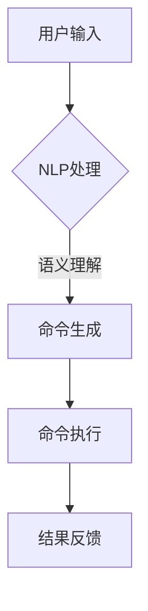

# LUI在CUI中的核心详细技术作用

> 关键词：语言用户界面(LUI),命令用户界面(CUI),人机交互,自然语言处理(NLP),语音识别,对话系统,智能助手

## 1. 背景介绍

随着人工智能技术的飞速发展，人机交互方式也在不断演变。从早期的命令用户界面（Command User Interface，CUI）到图形用户界面（Graphical User Interface，GUI），再到如今的语音用户界面（Voice User Interface，VUI），人机交互经历了从命令到图形，再到语音的变革。然而，随着自然语言处理（Natural Language Processing，NLP）技术的不断进步，语言用户界面（Language User Interface，LUI）逐渐成为CUI的升级版，成为人机交互的新趋势。

本文将深入探讨LUI在CUI中的核心技术作用，分析其工作原理、实现方式以及在实际应用中的价值。

## 2. 核心概念与联系

### 2.1 核心概念

#### 2.1.1 命令用户界面（CUI）

CUI是一种通过文本命令与计算机系统交互的用户界面。用户通过键盘输入命令，系统根据命令执行相应的操作。CUI界面简洁，易于操作，但在复杂任务和大量输入时，用户体验较差。

#### 2.1.2 语言用户界面（LUI）

LUI是一种通过自然语言与计算机系统交互的用户界面。用户可以使用自然语言进行提问、请求或操作，系统根据语义理解用户意图，并执行相应的任务。

#### 2.1.3 自然语言处理（NLP）

NLP是人工智能领域的一个重要分支，旨在让计算机理解和处理人类自然语言。NLP技术包括分词、词性标注、句法分析、语义理解、机器翻译等。

### 2.2 概念联系

LUI是CUI的升级版，它依托于NLP技术，通过理解用户的自然语言输入，实现更智能、更人性化的交互体验。LUI与CUI的关系可以用以下Mermaid流程图表示：



在上述流程中，用户输入的自然语言经过NLP处理，包括分词、词性标注、句法分析等，最终转化为计算机可以理解的命令，并执行相应操作，最后将结果反馈给用户。

## 3. 核心算法原理 & 具体操作步骤

### 3.1 算法原理概述

LUI的核心算法主要基于NLP技术，包括以下步骤：

1. **分词**：将用户的自然语言输入划分为单个词语。
2. **词性标注**：识别每个词语的词性，如名词、动词、形容词等。
3. **句法分析**：分析句子的结构，包括主语、谓语、宾语等成分。
4. **语义理解**：理解用户输入的语义，包括意图、实体、关系等。
5. **命令生成**：根据语义理解的结果，生成相应的命令。
6. **命令执行**：执行生成的命令，完成用户请求的任务。
7. **结果反馈**：将执行结果反馈给用户。

### 3.2 算法步骤详解

#### 3.2.1 分词

分词是将连续的文本序列分割成有意义的词语序列的过程。常用的分词方法包括：

1. **基于规则的分词**：根据预先定义的规则进行分词，如正向最大匹配法、逆向最大匹配法等。
2. **基于统计的分词**：利用统计信息进行分词，如基于最大熵模型、条件随机场（CRF）等。
3. **基于学习的分词**：利用机器学习算法进行分词，如基于深度学习的分词方法。

#### 3.2.2 词性标注

词性标注是对词语进行分类的过程，常用的词性标注方法包括：

1. **基于规则的方法**：根据预先定义的规则进行词性标注。
2. **基于统计的方法**：利用统计信息进行词性标注，如基于最大熵模型、CRF等。
3. **基于学习的方法**：利用机器学习算法进行词性标注，如基于深度学习的词性标注方法。

#### 3.2.3 句法分析

句法分析是对句子结构进行解析的过程，常用的句法分析方法包括：

1. **基于规则的方法**：根据预先定义的语法规则进行句法分析。
2. **基于统计的方法**：利用统计信息进行句法分析，如基于最大熵模型、CRF等。
3. **基于学习的方法**：利用机器学习算法进行句法分析，如基于深度学习的句法分析方法。

#### 3.2.4 语义理解

语义理解是理解用户输入的语义内容，包括意图、实体、关系等。常用的语义理解方法包括：

1. **基于知识库的方法**：利用知识库中的知识进行语义理解。
2. **基于深度学习的方法**：利用深度学习模型进行语义理解，如序列标注模型、文本分类模型等。

#### 3.2.5 命令生成

根据语义理解的结果，生成相应的命令。这需要根据具体的应用场景设计命令生成策略。

#### 3.2.6 命令执行

执行生成的命令，完成用户请求的任务。这需要调用相应的系统资源或API。

#### 3.2.7 结果反馈

将执行结果反馈给用户，可以使用文本、语音、图像等多种形式。

### 3.3 算法优缺点

#### 3.3.1 优点

1. **用户体验更好**：LUI允许用户使用自然语言进行交互，提高了用户体验。
2. **降低学习成本**：用户无需学习复杂的命令，降低了学习成本。
3. **提高工作效率**：LUI可以快速理解用户意图，提高工作效率。

#### 3.3.2 缺点

1. **NLP技术难度高**：LUI的实现依赖于NLP技术，NLP技术难度较高，需要大量的数据处理和模型训练。
2. **误识别率高**：NLP技术目前仍存在一定的误识别率，导致LUI的准确性有待提高。
3. **资源消耗大**：LUI的实现需要大量的计算资源，如CPU、GPU等。

### 3.4 算法应用领域

LUI在以下领域具有广泛的应用：

1. **智能助手**：如Siri、小爱同学、小冰等。
2. **智能家居**：如智能音箱、智能电视等。
3. **智能客服**：如银行、电商、政务等行业的客服系统。
4. **智能驾驶**：如车载语音控制系统。

## 4. 数学模型和公式 & 详细讲解 & 举例说明

### 4.1 数学模型构建

LUI的核心算法涉及多种数学模型，以下列举几种常用的模型：

1. **隐马尔可夫模型（HMM）**：用于语音识别和词性标注等任务。
2. **条件随机场（CRF）**：用于句法分析和词性标注等任务。
3. **循环神经网络（RNN）**：用于序列标注和文本生成等任务。
4. **卷积神经网络（CNN）**：用于图像识别和文本分类等任务。
5. **Transformer**：用于机器翻译、文本摘要等任务。

### 4.2 公式推导过程

以HMM为例，介绍其公式推导过程：

1. **状态转移概率**：$P(q_t|q_{t-1})$，表示当前状态转移到下一状态的概率。
2. **观测概率**：$P(o_t|q_t)$，表示当前状态产生的观测值。
3. **初始状态概率**：$P(q_0)$，表示初始状态的概率。
4. **路径概率**：$P(Q|O)=\prod_{t=1}^N P(q_t|q_{t-1})P(o_t|q_t)$，表示给定观测序列O的状态序列Q的概率。
5. **最可能的状态序列**：$Q^* = \arg\max_Q P(Q|O)$。

### 4.3 案例分析与讲解

以下以基于RNN的文本分类任务为例，讲解LUI的数学模型和应用。

1. **数据准备**：收集大量文本数据，并对其进行预处理，包括分词、去停用词等。
2. **模型构建**：使用RNN模型进行文本分类，输入层为词向量，隐藏层为RNN层，输出层为softmax分类器。
3. **模型训练**：使用标注数据进行模型训练，优化模型参数。
4. **模型预测**：对新的文本数据进行分类，输出预测结果。

## 5. 项目实践：代码实例和详细解释说明

### 5.1 开发环境搭建

以下是使用Python和TensorFlow进行LUI开发的开发环境搭建步骤：

1. 安装Anaconda：从官网下载并安装Anaconda，用于创建独立的Python环境。
2. 创建并激活虚拟环境：
```bash
conda create -n liu-env python=3.8
conda activate liu-env
```
3. 安装TensorFlow和相关依赖：
```bash
pip install tensorflow numpy pandas scikit-learn
```

### 5.2 源代码详细实现

以下是一个基于RNN的文本分类任务的代码示例：

```python
import tensorflow as tf
from tensorflow.keras.layers import Embedding, SimpleRNN, Dense, Dropout
from tensorflow.keras.models import Sequential

# 数据准备
max_features = 10000
maxlen = 100
embedding_size = 128
vocab_size = 10000

# 构建模型
model = Sequential()
model.add(Embedding(vocab_size, embedding_size, input_length=maxlen))
model.add(SimpleRNN(128))
model.add(Dropout(0.5))
model.add(Dense(1, activation='sigmoid'))

# 编译模型
model.compile(optimizer='adam', loss='binary_crossentropy', metrics=['accuracy'])

# 训练模型
model.fit(x_train, y_train, epochs=10, batch_size=32, validation_data=(x_val, y_val))

# 预测
y_pred = model.predict(x_test)
```

### 5.3 代码解读与分析

以上代码示例使用TensorFlow和Keras构建了一个基于RNN的文本分类模型。首先，使用`Embedding`层将文本转换为词向量，然后使用`SimpleRNN`层进行序列建模，最后使用`Dense`层进行分类。在训练过程中，使用`binary_crossentropy`损失函数和`adam`优化器进行模型训练，并在验证集上评估模型性能。

### 5.4 运行结果展示

运行以上代码，可以得到模型在测试集上的准确率。如果准确率较高，则说明模型能够有效地进行文本分类。

## 6. 实际应用场景

### 6.1 智能助手

智能助手是LUI技术最典型的应用场景。通过LUI，用户可以使用自然语言与智能助手进行交流，完成各种任务，如查询天气、设置闹钟、发送短信等。

### 6.2 智能家居

智能家居是LUI技术的另一个重要应用场景。用户可以通过LUI控制家居设备，如灯光、空调、电视等，实现智能化的家居生活。

### 6.3 智能客服

智能客服是LUI技术在服务行业的重要应用。通过LUI，企业可以提供24小时在线客服服务，提高客户满意度，降低人力成本。

### 6.4 智能驾驶

智能驾驶是LUI技术在交通领域的应用。通过LUI，驾驶员可以与车载系统进行交互，实现自动驾驶功能。

## 7. 工具和资源推荐

### 7.1 学习资源推荐

1. 《深度学习》系列书籍：由Ian Goodfellow等作者撰写，系统地介绍了深度学习的基础知识、技术和应用。
2. TensorFlow官方文档：TensorFlow官方文档提供了丰富的教程和API文档，是学习TensorFlow的必备资料。
3. Keras官方文档：Keras是TensorFlow的高层API，提供了更加简洁和易用的深度学习框架。

### 7.2 开发工具推荐

1. Anaconda：Anaconda是Python的科学计算平台，提供了丰富的数据科学和机器学习库。
2. TensorFlow：TensorFlow是Google开源的深度学习框架，适用于各种深度学习任务。
3. Jupyter Notebook：Jupyter Notebook是一款交互式的计算环境，可以方便地编写和运行Python代码。

### 7.3 相关论文推荐

1. "A Neural Probabilistic Language Model"：介绍了神经网络语言模型的原理和应用。
2. "Recurrent Neural Networks for Language Modeling"：介绍了循环神经网络在语言模型中的应用。
3. "Sequence to Sequence Learning with Neural Networks"：介绍了序列到序列学习模型在机器翻译中的应用。

## 8. 总结：未来发展趋势与挑战

### 8.1 研究成果总结

本文深入探讨了LUI在CUI中的核心技术作用，分析了其工作原理、实现方式以及在实际应用中的价值。通过介绍LUI的关键技术，如分词、词性标注、句法分析、语义理解和命令生成等，展示了LUI在提升用户体验、降低学习成本、提高工作效率等方面的优势。

### 8.2 未来发展趋势

1. **多模态融合**：将语音、图像、文本等多种模态信息进行融合，实现更全面的人机交互。
2. **跨语言交互**：支持多种语言的LUI，实现全球范围内的多语言交互。
3. **个性化交互**：根据用户习惯和喜好，提供个性化的LUI体验。

### 8.3 面临的挑战

1. **NLP技术难度高**：LUI的实现依赖于NLP技术，NLP技术难度较高，需要大量的数据处理和模型训练。
2. **误识别率高**：NLP技术目前仍存在一定的误识别率，导致LUI的准确性有待提高。
3. **资源消耗大**：LUI的实现需要大量的计算资源，如CPU、GPU等。

### 8.4 研究展望

未来，LUI技术将在人机交互领域发挥越来越重要的作用。随着NLP技术的不断进步，LUI将更加智能、高效，为人类带来更加便捷、舒适的生活体验。

## 9. 附录：常见问题与解答

**Q1：LUI和CUI的区别是什么？**

A1：LUI和CUI的区别在于交互方式。CUI通过命令与计算机系统交互，而LUI通过自然语言与计算机系统交互。

**Q2：LUI的误识别率如何降低？**

A2：降低LUI的误识别率可以通过以下方法：

1. **数据增强**：扩充训练数据，提高模型对未知输入的识别能力。
2. **模型改进**：优化模型结构，提高模型的泛化能力。
3. **用户反馈**：收集用户反馈，对模型进行持续优化。

**Q3：LUI在智能家居中的应用有哪些？**

A3：LUI在智能家居中的应用包括：

1. **控制灯光**：通过语音控制家中灯光的开关和亮度。
2. **调节空调**：通过语音调节空调的温度和风速。
3. **播放音乐**：通过语音播放音乐、广播等。

**Q4：LUI在智能客服中的应用有哪些？**

A4：LUI在智能客服中的应用包括：

1. **回答问题**：回答用户提出的各种问题。
2. **引导咨询**：引导用户进行相关咨询。
3. **投诉建议**：收集用户的投诉和建议。

**Q5：LUI在智能驾驶中的应用有哪些？**

A5：LUI在智能驾驶中的应用包括：

1. **导航**：语音导航，指引车辆行驶路线。
2. **娱乐**：播放音乐、广播等。
3. **语音控制**：通过语音控制车辆行驶速度、转向等。