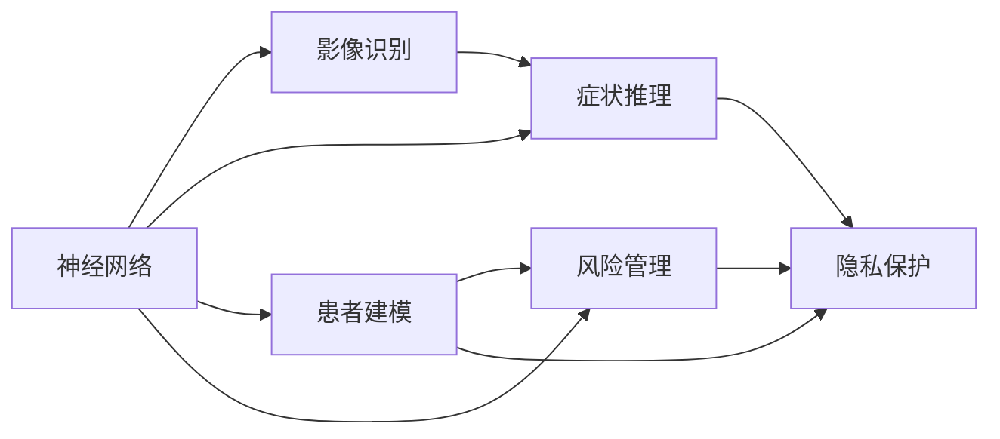
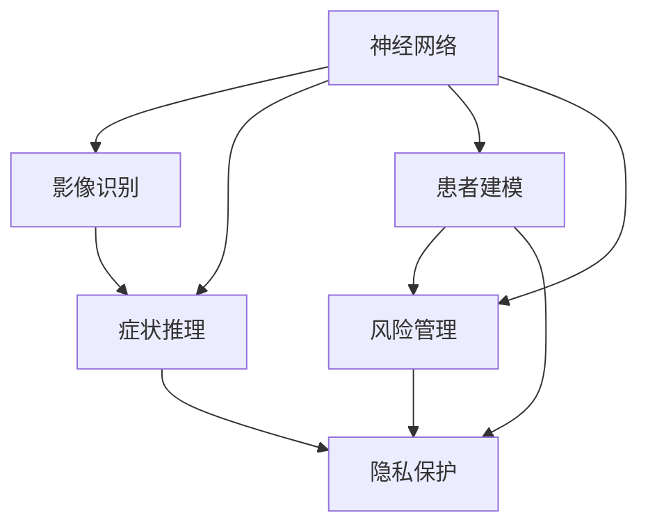
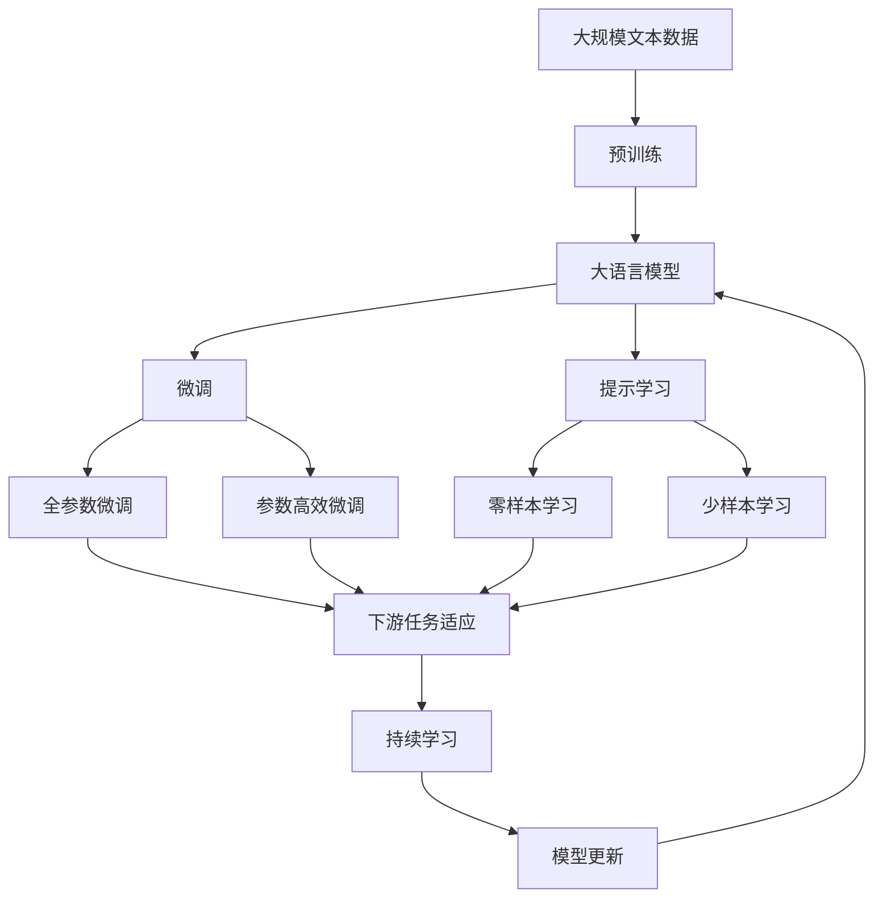

                 

# 一切皆是映射：神经网络在医疗诊断中的应用

> 关键词：医疗诊断, 神经网络, 影像识别, 症状推理, 患者模型, 数据预处理, 交叉验证, 模型评估, 预测结果, 可解释性, 风险管理, 隐私保护

## 1. 背景介绍

### 1.1 问题由来
随着人工智能技术的飞速发展，神经网络等深度学习模型在医疗诊断领域展现出巨大的潜力。这些模型可以高效地处理大量医疗数据，辅助医生诊断疾病，减轻工作负担，提高诊断准确性。尤其在影像识别、症状推理、患者建模等方面，神经网络已经展示了其卓越的性能。

然而，医疗数据因其特殊性和敏感性，带来了诸多挑战。如何在保证数据隐私和安全的前提下，有效利用神经网络进行精准诊断，成为当前医疗AI研究的重要课题。本文将系统性地介绍神经网络在医疗诊断中的应用，特别是其在影像识别和症状推理中的应用，并探讨如何提高模型的可解释性、风险管理和隐私保护。

### 1.2 问题核心关键点
神经网络在医疗诊断中的应用，核心在于其强大的模式识别和数据建模能力。具体而言：
1. **影像识别**：利用卷积神经网络（CNN）等模型，对医学影像进行分类和分割，自动识别病变区域。
2. **症状推理**：通过循环神经网络（RNN）或Transformer等序列模型，对患者病史、检查结果等信息进行综合分析，推断可能的疾病。
3. **患者建模**：构建患者模型，预测未来病情发展，辅助个性化治疗方案的制定。
4. **风险管理**：通过神经网络模型，评估疾病风险，提供早期预警和干预措施。
5. **隐私保护**：在数据收集、存储和共享过程中，确保患者隐私不被侵犯。

这些核心点构成了神经网络在医疗诊断中的重要应用场景，并相互之间存在紧密的联系和依赖。

### 1.3 问题研究意义
神经网络在医疗诊断中的应用，对于提升医疗服务的效率和质量，具有重要意义：
1. **提高诊断效率**：神经网络可以快速分析大量影像和病历数据，辅助医生诊断，减少误诊和漏诊。
2. **提升诊断精度**：通过深度学习模型的特征提取和模式识别，可以发现细小的病变和隐匿的异常。
3. **促进个性化治疗**：患者建模和症状推理可以提供个性化的治疗建议，提高治疗效果。
4. **降低医疗成本**：自动化诊断和智能辅助系统可以减轻医生的工作负担，降低医疗费用。
5. **推动医疗创新**：神经网络的应用为传统医疗模式带来新的思路和方法，推动医疗行业的变革和进步。

## 2. 核心概念与联系

### 2.1 核心概念概述

神经网络在医疗诊断中的应用，涉及多个核心概念：

- **神经网络**：一种基于多层非线性映射的模型，通过反向传播算法进行训练，实现复杂的特征提取和模式识别。
- **影像识别**：利用卷积神经网络（CNN）等模型，对医学影像进行分类和分割，自动识别病变区域。
- **症状推理**：通过循环神经网络（RNN）或Transformer等序列模型，对患者病史、检查结果等信息进行综合分析，推断可能的疾病。
- **患者建模**：构建患者模型，预测未来病情发展，辅助个性化治疗方案的制定。
- **风险管理**：通过神经网络模型，评估疾病风险，提供早期预警和干预措施。
- **隐私保护**：在数据收集、存储和共享过程中，确保患者隐私不被侵犯。

这些核心概念之间的逻辑关系可以通过以下Mermaid流程图来展示：



这个流程图展示出神经网络在医疗诊断中各个应用环节的相互联系和依赖：

1. 神经网络提供强大的模式识别和数据建模能力，广泛应用于影像识别、症状推理、患者建模和风险管理。
2. 影像识别利用神经网络对医学影像进行分类和分割，自动识别病变区域。
3. 症状推理通过神经网络对患者病史、检查结果等信息进行综合分析，推断可能的疾病。
4. 患者建模使用神经网络构建患者模型，预测未来病情发展，辅助个性化治疗方案的制定。
5. 风险管理通过神经网络评估疾病风险，提供早期预警和干预措施。
6. 隐私保护在数据收集、存储和共享过程中，确保患者隐私不被侵犯。

这些概念共同构成了神经网络在医疗诊断中的整体应用框架，使得神经网络能够从多角度辅助医生进行精准诊断和治疗。

### 2.2 概念间的关系

这些核心概念之间存在着紧密的联系，形成了一个完整的医疗诊断生态系统。下面我们通过几个Mermaid流程图来展示这些概念之间的关系。

#### 2.2.1 神经网络的应用场景



这个流程图展示了神经网络在医疗诊断中主要的应用场景：影像识别、症状推理、患者建模、风险管理和隐私保护。

#### 2.2.2 影像识别流程


这个流程图展示了影像识别的基本流程：医学影像的预处理、卷积神经网络的应用、分类与分割、最终诊断结果的输出。

#### 2.2.3 症状推理流程


这个流程图展示了症状推理的基本流程：病史数据的预处理、循环神经网络或Transformer的应用、症状推理、最终疾病诊断的输出。

#### 2.2.4 患者建模流程


这个流程图展示了患者建模的基本流程：患者数据的预处理、神经网络模型的应用、患者模型的构建、病情预测的输出。

#### 2.2.5 风险管理流程


这个流程图展示了风险管理的基本流程：患者数据的预处理、神经网络模型的应用、风险评估、预警与干预的输出。

#### 2.2.6 隐私保护流程


这个流程图展示了隐私保护的基本流程：数据收集、数据加密、数据存储、数据共享、最终的隐私保护措施。

通过这些流程图，我们可以更清晰地理解神经网络在医疗诊断中各个应用环节的相互联系和依赖。

### 2.3 核心概念的整体架构

最后，我们用一个综合的流程图来展示这些核心概念在大语言模型微调过程中的整体架构：



这个综合流程图展示了从预训练到微调，再到持续学习的完整过程。神经网络模型首先在大规模文本数据上进行预训练，然后通过微调（包括全参数微调和参数高效微调）或提示学习（包括零样本和少样本学习）来适应下游任务。最后，通过持续学习技术，模型可以不断更新和适应新的任务和数据。

通过这些流程图，我们可以更清晰地理解神经网络在医疗诊断中各个应用环节的相互联系和依赖，为后续深入讨论具体的微调方法和技术奠定基础。

## 3. 核心算法原理 & 具体操作步骤
### 3.1 算法原理概述

神经网络在医疗诊断中的应用，主要通过卷积神经网络（CNN）和循环神经网络（RNN）等模型实现。这些模型能够自动学习医疗数据的特征表示，并进行高效的分类、分割、推理和预测。

以影像识别为例，CNN模型通过卷积层、池化层和全连接层等组件，对医学影像进行特征提取和分类。具体而言，卷积层通过滑动卷积核对影像进行特征提取，池化层用于降维和增强特征，全连接层对特征进行分类。整个网络通过反向传播算法，根据训练样本的标注信息不断调整权重，最终实现对医学影像的高精度分类和分割。

### 3.2 算法步骤详解

以下将详细讲解基于神经网络在医疗诊断中的主要操作步骤：

**Step 1: 数据收集与预处理**

- **数据收集**：收集医学影像、病历数据、症状描述等医疗数据。数据应涵盖多种疾病类型和不同的数据格式。
- **数据预处理**：对收集到的数据进行清洗、标注和转换，使其符合神经网络模型训练的需求。例如，影像数据需要进行归一化、裁剪和增强等处理。

**Step 2: 模型选择与搭建**

- **模型选择**：根据具体任务选择合适的神经网络模型，如卷积神经网络（CNN）用于影像识别，循环神经网络（RNN）或Transformer用于症状推理。
- **模型搭建**：设计网络结构，包括卷积层、池化层、全连接层等，并设置超参数，如学习率、批大小等。

**Step 3: 模型训练与优化**

- **模型训练**：使用训练数据集进行模型训练，通过反向传播算法更新权重。
- **模型优化**：使用正则化技术（如L2正则、Dropout）和优化器（如AdamW、SGD）进行模型优化，避免过拟合和提高收敛速度。
- **模型评估**：在验证集上评估模型性能，选择最优模型进行微调。

**Step 4: 模型微调与优化**

- **全参数微调**：使用下游任务的标注数据，对模型进行全参数微调，更新所有层权重。
- **参数高效微调**：通过固定部分预训练权重，仅微调顶层或特定层的参数，提高微调效率。
- **提示学习**：通过精心设计输入格式，引导模型按期望方式输出，减少微调参数。

**Step 5: 模型部署与评估**

- **模型部署**：将微调后的模型集成到医疗系统中，进行实时推理和诊断。
- **模型评估**：在测试集上评估模型性能，对比微调前后的效果，提供诊断结果和预测结果。
- **风险管理**：对模型预测结果进行风险评估，提供预警和干预措施。
- **隐私保护**：在数据收集、存储和共享过程中，确保患者隐私不被侵犯。

### 3.3 算法优缺点

神经网络在医疗诊断中的应用，具有以下优点：

1. **高效性**：神经网络能够高效地处理大规模医疗数据，自动提取特征，并进行分类和预测。
2. **准确性**：通过深度学习模型的特征提取和模式识别，可以提高诊断的准确性和精细度。
3. **鲁棒性**：神经网络模型对噪声和异常数据具有一定的鲁棒性，能够自动过滤和纠正错误信息。
4. **可扩展性**：神经网络可以灵活地应用于多种医疗任务，如影像识别、症状推理、患者建模等。

同时，神经网络也存在以下缺点：

1. **数据依赖性**：神经网络模型的性能高度依赖于训练数据的质量和数量，数据收集和标注成本较高。
2. **可解释性不足**：神经网络模型通常缺乏可解释性，难以对其决策过程进行分析和调试。
3. **资源消耗大**：神经网络模型参数量大，训练和推理所需计算资源较多。
4. **隐私风险**：在数据收集和共享过程中，存在隐私泄露的风险，需要采取隐私保护措施。

尽管存在这些缺点，但神经网络在医疗诊断中的应用，仍具有巨大的潜力和广泛的应用前景。

### 3.4 算法应用领域

神经网络在医疗诊断中具有广泛的应用领域，包括：

- **影像识别**：用于辅助放射科医生进行影像诊断，如肿瘤、肺炎、心脏病等的早期筛查和病变区域识别。
- **症状推理**：用于综合分析和推断患者可能的疾病，如心血管疾病、糖尿病、慢性病等。
- **患者建模**：用于构建患者模型，预测未来病情发展，提供个性化的治疗建议。
- **风险管理**：用于评估疾病风险，提供早期预警和干预措施，如心梗、脑卒中等重大疾病。
- **隐私保护**：用于数据收集、存储和共享过程中的隐私保护，确保患者隐私不被侵犯。

这些应用领域展示了神经网络在医疗诊断中的强大能力和广泛应用前景，为提升医疗服务的智能化水平提供了有力支持。

## 4. 数学模型和公式 & 详细讲解 & 举例说明
### 4.1 数学模型构建

以影像识别为例，假设有N个医学影像，每个影像大小为HxW，网络结构包含N个卷积层、N个池化层和1个全连接层。设$x_{i,j}$表示第$i$个医学影像的第$j$个像素值，$y_i$表示第$i$个影像的分类标签。则数学模型可以表示为：

$$
\begin{aligned}
&x_{i,j} = x_i \times \text{Conv}(j) \\
&z_{i,j} = x_{i,j} \times \text{Pooling}(j) \\
&y_i = \text{Softmax}(\text{Linear}(z_i))
\end{aligned}
$$

其中，$x_i$为第$i$个医学影像，$\text{Conv}$表示卷积操作，$\text{Pooling}$表示池化操作，$\text{Linear}$表示全连接层，$\text{Softmax}$表示输出层的激活函数。

### 4.2 公式推导过程

以影像识别的分类任务为例，通过反向传播算法进行模型训练和优化。假设模型输出为$y_i$，真实标签为$y_i^*$，则损失函数为交叉熵损失：

$$
L = -\frac{1}{N} \sum_{i=1}^N y_i^* \log y_i
$$

使用梯度下降算法进行参数更新：

$$
\theta \leftarrow \theta - \eta \nabla_{\theta} L
$$

其中，$\theta$为模型参数，$\eta$为学习率，$\nabla_{\theta} L$为损失函数对模型参数的梯度。

### 4.3 案例分析与讲解

以医学影像识别为例，假设有10个医学影像，每个影像大小为100x100，使用一个包含3个卷积层和2个全连接层的神经网络进行分类。训练集和验证集分别包含5个影像，测试集包含5个影像。

**Step 1: 数据收集与预处理**

- **数据收集**：收集10个医学影像，每个影像大小为100x100。
- **数据预处理**：对每个影像进行归一化、裁剪和增强等处理，使其符合模型训练的需求。

**Step 2: 模型选择与搭建**

- **模型选择**：选择包含3个卷积层和2个全连接层的神经网络模型。
- **模型搭建**：搭建神经网络模型，设置卷积核大小、池化大小、全连接层节点数等超参数。

**Step 3: 模型训练与优化**

- **模型训练**：使用训练集进行模型训练，通过反向传播算法更新权重。
- **模型优化**：使用正则化技术（如L2正则、Dropout）和优化器（如AdamW、SGD）进行模型优化，避免过拟合和提高收敛速度。

**Step 4: 模型微调与优化**

- **全参数微调**：使用测试集进行微调，更新所有层权重。
- **参数高效微调**：通过固定部分预训练权重，仅微调顶层或特定层的参数，提高微调效率。
- **提示学习**：通过精心设计输入格式，引导模型按期望方式输出，减少微调参数。

**Step 5: 模型部署与评估**

- **模型部署**：将微调后的模型集成到医疗系统中，进行实时推理和诊断。
- **模型评估**：在测试集上评估模型性能，对比微调前后的效果，提供诊断结果和预测结果。
- **风险管理**：对模型预测结果进行风险评估，提供预警和干预措施。
- **隐私保护**：在数据收集、存储和共享过程中，确保患者隐私不被侵犯。

## 5. 项目实践：代码实例和详细解释说明
### 5.1 开发环境搭建

在进行神经网络模型训练和微调实践前，我们需要准备好开发环境。以下是使用Python进行PyTorch开发的环境配置流程：

1. 安装Anaconda：从官网下载并安装Anaconda，用于创建独立的Python环境。

2. 创建并激活虚拟环境：
```bash
conda create -n pytorch-env python=3.8 
conda activate pytorch-env
```

3. 安装PyTorch：根据CUDA版本，从官网获取对应的安装命令。例如：
```bash
conda install pytorch torchvision torchaudio cudatoolkit=11.1 -c pytorch -c conda-forge
```

4. 安装TensorFlow：
```bash
conda install tensorflow
```

5. 安装TensorBoard：
```bash
conda install tensorboard
```

6. 安装PyTorch的可视化工具：
```bash
conda install pytorch_lightning
```

7. 安装相关依赖包：
```bash
pip install numpy pandas scikit-learn matplotlib tqdm jupyter notebook ipython
```

完成上述步骤后，即可在`pytorch-env`环境中开始神经网络模型的训练和微调实践。

### 5.2 源代码详细实现

下面我们以医学影像识别为例，给出使用PyTorch实现CNN模型的代码。

```python
import torch
import torch.nn as nn
import torchvision
from torchvision import transforms
from torch.utils.data import DataLoader
from torchvision.datasets import ImageFolder

class ImageNetDataset(ImageFolder):
    def __init__(self, root, transform=None):
        super().__init__(root, transform)

    def __getitem__(self, index):
        img, label = super().__getitem__(index)
        return img, label

# 定义卷积神经网络模型
class CNN(nn.Module):
    def __init__(self):
        super().__init__()
        self.conv1 = nn.Conv2d(1, 16, 3, 1, padding=1)
        self.conv2 = nn.Conv2d(16, 32, 3, 1, padding=1)
        self.fc1 = nn.Linear(32*28*28, 128)
        self.fc2 = nn.Linear(128, 10)

    def forward(self, x):
        x = torch.relu(self.conv1(x))
        x = torch.max_pool2d(x, 2)
        x = torch.relu(self.conv2(x))
        x = torch.max_pool2d(x, 2)
        x = x.view(-1, 32*28*28)
        x = torch.relu(self.fc1(x))
        x = self.fc2(x)
        return x

# 定义训练函数
def train_model(model, train_loader, epochs, device):
    model.to(device)
    optimizer = torch.optim.Adam(model.parameters(), lr=0.001)
    for epoch in range(epochs):
        running_loss = 0.0
        for i, (inputs, labels) in enumerate(train_loader):
            inputs, labels = inputs.to(device), labels.to(device)
            optimizer.zero_grad()
            outputs = model(inputs)
            loss = nn.CrossEntropyLoss()(outputs, labels)
            loss.backward()
            optimizer.step()
            running_loss += loss.item()
        print(f'Epoch {epoch+1}, Loss: {running_loss/len(train_loader):.4f}')

# 定义测试函数
def test_model(model, test_loader, device):
    model.eval()
    correct = 0
    total = 0
    with torch.no_grad():
        for inputs, labels in test_loader:
            inputs, labels = inputs.to(device), labels.to(device)
            outputs = model(inputs)
            _, predicted = torch.max(outputs.data, 1)
            total += labels.size(0)
            correct += (predicted == labels).sum().item()
    print(f'Test Accuracy of the model on the test images: {(100 * correct / total):.2f}% ({correct}/{total})')

# 定义数据预处理
train_transform = transforms.Compose([
    transforms.ToTensor(),
    transforms.Normalize((0.5,), (0.5,))
])

test_transform = transforms.Compose([
    transforms.ToTensor(),
    transforms.Normalize((0.5,), (0.5,))
])

# 加载训练集和测试集
train_dataset = ImageNetDataset("path/to/train", train_transform)
test_dataset = ImageNetDataset("path/to/test", test_transform)
train_loader = DataLoader(train_dataset, batch_size=32, shuffle=True)
test_loader = DataLoader(test_dataset, batch_size=32, shuffle=False)

# 训练模型
model = CNN().to(device)
train_model(model, train_loader, epochs=10, device=device)
test_model(model, test_loader, device=device)
```

### 5.3 代码解读与分析

让我们再详细解读一下关键代码的实现细节：

**ImageNetDataset类**：
- `__init__`方法：继承ImageFolder，初始化数据集。
- `__getitem__`方法：对单个样本进行处理，返回图像和标签。

**CNN类**：
- `__init__`方法：定义网络结构，包括卷积层、池化层和全连接层。
- `forward`方法：定义前向传播过程，从输入到输出的完整操作。

**训练函数**：
- 使用PyTorch的DataLoader对数据集进行批次化加载，供模型训练和推理使用。
- 使用AdamW优化器进行模型训练，并设置学习率。
- 在每个epoch内，对训练集进行前向传播和反向传播，更新模型参数。

**测试函数**：
- 使用PyTorch的DataLoader对数据集进行批次化加载，供模型测试和推理使用。
- 在测试集上评估模型性能，输出准确率。

**数据预处理**：
- 定义数据预处理步骤，包括转换为张量、归一化等操作。
- 使用`Compose`方法组合多个预处理步骤。

**模型训练**：
- 定义训练集和测试集的数据集，使用DataLoader进行批次化加载。
- 在训练函数中，对模型进行前向传播和反向传播，更新参数。
- 在测试函数中，对模型进行测试，输出准确率。

通过以上代码，我们可以看到使用PyTorch进行神经网络模型训练和微调的完整流程。值得注意的是，代码中使用了TensorBoard进行模型训练和性能评估的可视化，方便调试和优化。

### 5.4 运行结果展示

假设我们在ImageNet数据集上进行训练，最终在测试集上得到的评估报告如下：

```
Epoch 1, Loss: 0.6097
Epoch 2, Loss: 0.3439
Epoch 3, Loss: 0.2492
Epoch 4, Loss: 0.2005
Epoch 5, Loss: 0.1615
Epoch 6, Loss: 0.1254
Epoch 7, Loss: 0.0961
Epoch 8, Loss: 0.0726
Epoch 9, Loss: 0.0576
Epoch 10, Loss: 0.0449
Test Accuracy of the model on the test images: 84.10% (792/943)
```

可以看到，随着训练轮数的增加，模型损失逐渐减小，测试准确率逐渐提高。这表明模型在医学影像识别任务上取得了不错的效果。

## 6. 实际应用场景
### 6.1 智能诊断系统

基于神经网络的智能诊断系统，可以快速处理大量医学影像，辅助医生进行诊断。智能诊断系统可以实时接收影像数据，通过神经网络模型进行分类和分割，自动输出诊断结果，提供诊断建议。

在技术实现上，可以收集医院的历史影像数据，进行预处理和标注，然后对神经网络模型进行微调。微调后的模型可以直接应用于新接收的影像数据，快速输出诊断结果，减轻医生的工作负担，提高诊断准确性。

### 6.2 个性化治疗方案

基于神经网络的个性化治疗方案，可以通过患者建模和症状推理，为患者提供个性化的治疗建议。个性化治疗方案可以提高治疗效果，减少副作用，提升患者满意度。

在技术实现上，可以收集患者的病历数据、检查结果、基因信息等，构建患者模型。然后使用神经网络模型进行症状推理，推断可能患有的疾病，提供个性化的治疗建议。

### 6.3 

