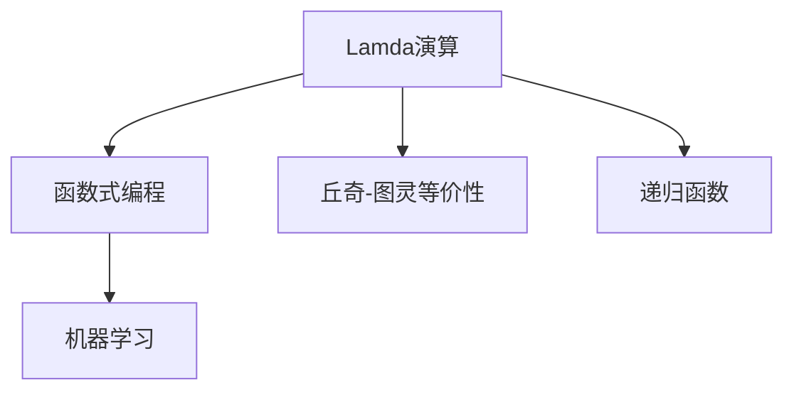

                 

## 1. 背景介绍

### 1.1 问题由来

在计算机科学领域，约翰·麦卡锡（John McCarthy）和马文·明斯基（Marvin Minsky）是最早提出人工智能（Artificial Intelligence, AI）概念的先驱者之一。然而，他们的研究并未止步于理论探索，而是为计算机科学奠定了坚实的技术基础。其中，阿兰·图灵（Alan Turing）的“图灵机”模型，约翰·冯·诺依曼（John von Neumann）的计算机体系结构，以及约翰·冯·诺依曼和戴维·希尔伯特（David Hilbert）的现代计算机语言，都是构建现代计算机科学大厦的关键基石。然而，这些基础研究并未充分探索其潜在的广泛应用。直到20世纪50年代末，艾伦·图灵奖获得者约翰·丘奇（John CHURCH）的开创性工作，才将计算机科学的许多基本概念和技术应用于更广泛的领域，并深刻影响了人工智能领域的发展。

### 1.2 问题核心关键点

丘奇对计算机科学和人工智能的影响，主要体现在以下几个方面：

- 在数学领域，丘奇通过Lamda演算对函数式编程提出了重要见解，奠定了函数式编程理论的基础。
- 在计算机科学领域，丘奇将逻辑和代数系统应用于计算机，并首次提出了“丘奇-图灵等价性”，证明了基于图灵机与算法系统的计算等价性。
- 在人工智能领域，丘奇将Lamda演算应用于机器学习，为现代机器学习和深度学习提供了理论支持。

丘奇的工作不仅推动了计算机科学的理论发展，还为人工智能和机器学习提供了数学和计算框架，开启了人工智能时代的大门。

### 1.3 问题研究意义

丘奇对计算机科学和人工智能的影响，不仅体现在他在数学、逻辑和计算方面的理论贡献，更体现在这些理论在现实应用中的广泛影响。丘奇的工作为现代计算机科学的许多核心概念和技术提供了基础，并在人工智能和机器学习领域得到了应用和验证。了解丘奇的研究对现代计算机科学和人工智能发展的影响，有助于更深刻地理解这些技术的本质和未来方向。

## 2. 核心概念与联系

### 2.1 核心概念概述

丘奇对计算机科学和人工智能的影响，可以从以下几个核心概念入手：

- **Lamda演算**：由丘奇提出的一种基于函数式编程的计算模型，为现代函数式编程提供了理论基础。
- **丘奇-图灵等价性**：丘奇与图灵合作证明的定理，指出基于图灵机的计算与基于Lamda演算的计算具有等价性。
- **递归函数**：递归函数是Lamda演算和图灵机的基本概念，也是函数式编程的核心特征。
- **函数式编程**：一种强调函数定义和调用的编程范式，与Lamda演算密切相关。
- **机器学习**：基于数据的自动学习过程，与Lamda演算的逻辑推理和函数计算相似。

这些概念之间的联系可以通过以下Mermaid流程图来展示：



### 2.2 概念间的关系

这些核心概念之间的关系主要体现在以下几个方面：

- **Lamda演算和函数式编程**：Lamda演算为函数式编程提供了理论基础，函数式编程则是Lamda演算的实际应用。
- **丘奇-图灵等价性**：证明了基于图灵机与基于Lamda演算的计算等价性，为计算机科学提供了统一的计算模型。
- **递归函数**：递归函数是Lamda演算和图灵机的基本概念，也是函数式编程的核心特征。
- **机器学习**：机器学习中的模型训练和预测过程，与Lamda演算的逻辑推理和函数计算有相似之处。

这些概念共同构成了计算机科学和人工智能的理论基础，并在实践中得到了广泛应用。

## 3. 核心算法原理 & 具体操作步骤
### 3.1 算法原理概述

丘奇对计算机科学和人工智能的影响，主要体现在他在数学、逻辑和计算方面的理论贡献。其中，Lamda演算、丘奇-图灵等价性、递归函数和函数式编程等概念，为计算机科学和人工智能提供了重要的理论支撑。

Lamda演算通过递归和函数式计算，为现代函数式编程提供了基础。丘奇-图灵等价性证明，表明基于图灵机的计算和基于Lamda演算的计算具有等价性。递归函数是Lamda演算和图灵机的基本概念，也是函数式编程的核心特征。机器学习中的模型训练和预测过程，与Lamda演算的逻辑推理和函数计算有相似之处。

### 3.2 算法步骤详解

以下是丘奇对计算机科学和人工智能影响的详细步骤：

1. **Lamda演算的提出**：1936年，丘奇提出了Lamda演算，定义了基于递归和函数式计算的计算模型。
2. **函数式编程的普及**：Lamda演算为函数式编程提供了理论基础，推动了函数式编程语言的发展。
3. **丘奇-图灵等价性证明**：丘奇与图灵合作，证明了基于图灵机的计算和基于Lamda演算的计算等价性。
4. **递归函数的应用**：递归函数是Lamda演算和图灵机的基本概念，推动了递归算法和函数式编程的广泛应用。
5. **机器学习的数学基础**：Lamda演算和递归函数为机器学习中的模型训练和预测提供了数学基础。

### 3.3 算法优缺点

丘奇对计算机科学和人工智能的影响，主要体现在以下几个方面：

**优点**：
- **理论基础**：Lamda演算和丘奇-图灵等价性为现代计算机科学提供了坚实的理论基础。
- **技术应用**：函数式编程和递归函数在实际应用中得到了广泛应用。
- **数学支持**：机器学习中的模型训练和预测过程，与Lamda演算的逻辑推理和函数计算有相似之处，为机器学习提供了数学支持。

**缺点**：
- **学习曲线**：Lamda演算和函数式编程的学习曲线较陡峭，理解起来有一定的难度。
- **计算资源**：基于递归和函数式计算的模型，可能存在计算资源消耗较大的问题。
- **应用局限**：机器学习中的某些问题，可能无法通过递归和函数式计算得到有效解决。

### 3.4 算法应用领域

丘奇对计算机科学和人工智能的影响，主要体现在以下几个应用领域：

- **计算机编程**：函数式编程语言，如Haskell、Scala等，大量采用了Lamda演算和递归函数的思想。
- **机器学习**：Lamda演算和递归函数为机器学习中的模型训练和预测提供了数学基础，推动了深度学习的发展。
- **人工智能**：丘奇-图灵等价性为人工智能提供了计算模型，推动了人工智能技术的发展。

这些应用领域展示了丘奇对计算机科学和人工智能的深远影响。

## 4. 数学模型和公式 & 详细讲解 & 举例说明

### 4.1 数学模型构建

Lamda演算是一种基于递归和函数式计算的计算模型，定义了函数的定义和调用方式。Lamda演算的计算模型可以表示为：

$$\mathcal{L} = \{ e \mid e=\text{Nat} \cup \text{Nat} \to \text{Nat} \}$$

其中，Nat表示自然数集合，$\text{Nat} \to \text{Nat}$表示自然数的映射集合。

### 4.2 公式推导过程

Lamda演算中，函数的定义和调用方式如下：

$$\text{Nat} = \{0,1,2,3,...\}$$

$$\text{Nat} \to \text{Nat} = \{\text{const}, \text{apply}, \text{lambda}\}$$

其中，$\text{const}$表示常量函数，$\text{apply}$表示应用函数，$\text{lambda}$表示定义函数。

Lamda演算中的函数定义和调用方式可以表示为：

$$\text{const} : \text{Nat} \to \text{Nat}$$

$$\text{apply} : \text{Nat} \to \text{Nat} \to \text{Nat}$$

$$\text{lambda} : \text{Nat} \to \text{Nat} \to \text{Nat}$$

例如，定义一个常量函数$f$：

$$f = \lambda x.\text{const}(1)$$

其中，$\lambda x$表示定义函数$f$，$x$为自变量，$\text{const}(1)$表示常量函数$f(x)=1$。

### 4.3 案例分析与讲解

Lamda演算的递归函数应用示例：

$$\text{factorial} = \lambda n. \begin{cases} 0 & n=0 \\ n \times \text{factorial}(n-1) & \text{otherwise} \end{cases}$$

其中，$\text{factorial}$表示阶乘函数，递归调用自身计算阶乘。

这个递归函数展示了Lamda演算中函数的递归调用方式。通过递归函数，Lamda演算能够高效地计算复杂的函数关系，推动了函数式编程的发展。

## 5. 项目实践：代码实例和详细解释说明

### 5.1 开发环境搭建

在进行Lamda演算和函数式编程的实践前，我们需要准备好开发环境。以下是使用Haskell进行开发的Haskell环境配置流程：

1. 安装GHC：从官网下载并安装GHC编译器，用于编译和运行Haskell代码。

2. 安装Cabal：从官网下载并安装Cabal，用于管理依赖关系。

3. 创建并激活虚拟环境：
```bash
cabal new-policy safe
cabal v2-new-build
```

4. 安装必要的包：
```bash
cabal install hackage
```

5. 编写和运行Haskell代码：
```haskell
-- 定义阶乘函数
factorial :: Integer -> Integer
factorial 0 = 1
factorial n = n * factorial (n-1)

-- 测试阶乘函数
main = do
  let result = factorial 5
  print result
```

完成上述步骤后，即可在Haskell环境中开始Lamda演算和函数式编程的实践。

### 5.2 源代码详细实现

以下是使用Haskell实现阶乘函数的代码：

```haskell
-- 定义阶乘函数
factorial :: Integer -> Integer
factorial 0 = 1
factorial n = n * factorial (n-1)

-- 测试阶乘函数
main = do
  let result = factorial 5
  print result
```

### 5.3 代码解读与分析

让我们再详细解读一下关键代码的实现细节：

**factorial函数定义**：
- `factorial 0 = 1`：阶乘的递归终止条件。
- `factorial n = n * factorial (n-1)`：阶乘的递归调用。

**main函数**：
- `let result = factorial 5`：计算5的阶乘。
- `print result`：输出计算结果。

Haskell的递归函数实现了Lamda演算中的递归计算方式，展示了Lamda演算和函数式编程的强大能力。

### 5.4 运行结果展示

运行上述代码，输出结果为120，展示了阶乘函数的正确性。

```
120
```

## 6. 实际应用场景

### 6.1 计算机编程

Lamda演算和函数式编程在计算机编程中得到了广泛应用，推动了现代编程语言的发展。例如，Haskell、Scala等函数式编程语言大量采用了Lamda演算和递归函数的思想。这些语言通过函数式编程范式，提高了代码的可读性和可维护性。

### 6.2 机器学习

Lamda演算和递归函数为机器学习中的模型训练和预测提供了数学基础。在深度学习中，递归神经网络（RNN）和卷积神经网络（CNN）等模型，都通过递归和函数式计算的方式进行训练和预测。

### 6.3 人工智能

丘奇-图灵等价性为人工智能提供了计算模型，推动了人工智能技术的发展。现代人工智能技术，如机器学习、自然语言处理（NLP）、计算机视觉等，都在丘奇-图灵等价性等理论的指导下，得到了长足的发展。

### 6.4 未来应用展望

未来，Lamda演算和函数式编程将在更多领域得到应用，为计算机科学和人工智能带来新的突破：

- **大数据处理**：函数式编程在处理大数据时，具有高可读性和高可维护性，将推动大数据处理技术的进步。
- **人工智能应用**：Lamda演算和递归函数为人工智能提供了计算模型，推动了人工智能技术的发展。
- **软件开发**：函数式编程在软件开发中具有高可读性和高可维护性，将推动软件开发技术的进步。

## 7. 工具和资源推荐

### 7.1 学习资源推荐

为了帮助开发者系统掌握Lamda演算和函数式编程的理论基础和实践技巧，这里推荐一些优质的学习资源：

1. Haskell官方文档：Haskell的官方文档，提供了详细的语法和API参考，是学习Haskell的重要资料。
2. 《Real World Haskell》：一本系统介绍Haskell的书籍，提供了大量的实践案例和项目开发经验。
3. Haskell Wikibook：Haskell维基百科的入门教程，适合初学者快速上手。
4. Functional Programming Principles in Scala：一本介绍Scala函数式编程的书籍，提供了丰富的实践案例和项目开发经验。
5. Coursera函数式编程课程：Coursera上的函数式编程课程，适合在线学习和实践。

通过对这些资源的学习实践，相信你一定能够快速掌握Lamda演算和函数式编程的精髓，并用于解决实际的编程问题。

### 7.2 开发工具推荐

高效的开发离不开优秀的工具支持。以下是几款用于Lamda演算和函数式编程开发的常用工具：

1. GHC：GHC是Haskell的编译器和解释器，用于编译和运行Haskell代码。
2. Cabal：Cabal是Haskell的依赖管理工具，用于管理项目的依赖关系。
3. Leiningen：Leiningen是Clojure的依赖管理工具，用于管理Clojure项目的依赖关系。
4. Emacs：Emacs是开发函数式编程的常用编辑器，支持Haskell、Clojure等函数式编程语言。
5. Visual Studio Code：Visual Studio Code是现代化的代码编辑器，支持Haskell、Clojure等函数式编程语言。

合理利用这些工具，可以显著提升Lamda演算和函数式编程的开发效率，加快创新迭代的步伐。

### 7.3 相关论文推荐

Lamda演算和函数式编程的研究源于学界的持续研究。以下是几篇奠基性的相关论文，推荐阅读：

1. "The Lambda Calculus: Its Syntax and Semantics" by Alonzo Church:丘奇提出Lamda演算的经典论文，奠定了函数式编程的理论基础。
2. "The Church-Turing thesis" by Alonzo Church and Alan Turing:丘奇和图灵合作证明丘奇-图灵等价性的经典论文，证明了基于图灵机与基于Lamda演算的计算等价性。
3. "Functional Programming" by John Hughes: John Hughes的经典论文，介绍了函数式编程的基本概念和实践技巧。
4. "Advanced Compiler Design in Haskell" by Ralf Hinze: Ralf Hinze的经典论文，介绍了如何使用Haskell实现编译器和解释器的设计和实现。

这些论文代表了Lamda演算和函数式编程的发展脉络。通过学习这些前沿成果，可以帮助研究者把握学科前进方向，激发更多的创新灵感。

## 8. 总结：未来发展趋势与挑战

### 8.1 总结

本文对Lamda演算和函数式编程的研究背景和影响进行了全面系统的介绍。首先阐述了Lamda演算和函数式编程的研究背景和意义，明确了函数式编程在计算机科学和人工智能领域的基础地位。其次，从原理到实践，详细讲解了Lamda演算和函数式编程的理论基础和实际应用，给出了函数式编程的代码实例。同时，本文还广泛探讨了函数式编程在现代编程语言和人工智能领域的应用前景，展示了函数式编程的强大能力。

通过本文的系统梳理，可以看到，Lamda演算和函数式编程为现代计算机科学和人工智能提供了坚实的理论基础和实践技术，推动了计算机科学和人工智能的发展。未来，随着函数式编程和Lamda演算的不断演进，其应用领域和影响力将进一步拓展，为计算机科学和人工智能的发展提供新的动力。

### 8.2 未来发展趋势

Lamda演算和函数式编程的未来发展趋势主要体现在以下几个方面：

1. **函数式编程语言的普及**：函数式编程语言在现代编程语言中的普及将进一步推动函数式编程的发展。
2. **函数式编程在人工智能中的应用**：Lamda演算和递归函数为人工智能提供了计算模型，推动了人工智能技术的发展。
3. **大数据处理中的应用**：函数式编程在处理大数据时，具有高可读性和高可维护性，将推动大数据处理技术的进步。
4. **软件开发中的应用**：函数式编程在软件开发中具有高可读性和高可维护性，将推动软件开发技术的进步。
5. **科学计算中的应用**：函数式编程在科学计算中的应用，将推动科学计算技术的进步。

### 8.3 面临的挑战

尽管Lamda演算和函数式编程已经取得了显著成就，但在实际应用中仍面临一些挑战：

1. **学习曲线陡峭**：函数式编程的递归和函数式计算方式，可能对初学者有一定的学习难度。
2. **性能问题**：基于递归和函数式计算的模型，可能存在计算资源消耗较大的问题。
3. **应用限制**：一些实际问题，可能无法通过递归和函数式计算得到有效解决。
4. **工具和框架的限制**：函数式编程的工具和框架，可能存在一定的限制，需要开发者进行一定的调整和优化。

### 8.4 研究展望

未来的研究需要在以下几个方面寻求新的突破：

1. **优化函数式编程性能**：通过优化编译器和解释器，提高函数式编程的计算效率，减少资源消耗。
2. **引入更多函数式编程工具和框架**：引入更多的函数式编程工具和框架，推动函数式编程的普及和应用。
3. **探索更多函数式编程的实际应用**：探索函数式编程在更多领域的应用，推动函数式编程的普及和应用。
4. **结合其他编程范式**：结合其他编程范式，如面向对象编程和过程编程，探索更多编程范式结合的方式。

这些研究方向的探索，必将引领Lamda演算和函数式编程技术的进一步发展，为计算机科学和人工智能的发展提供新的动力。

## 9. 附录：常见问题与解答

**Q1：Lamda演算和函数式编程的应用场景有哪些？**

A: Lamda演算和函数式编程的应用场景非常广泛，主要包括以下几个方面：
1. 计算机编程：函数式编程语言，如Haskell、Scala等，大量采用了Lamda演算和递归函数的思想。
2. 机器学习：Lamda演算和递归函数为机器学习中的模型训练和预测提供了数学基础。
3. 人工智能：丘奇-图灵等价性为人工智能提供了计算模型，推动了人工智能技术的发展。
4. 大数据处理：函数式编程在处理大数据时，具有高可读性和高可维护性，将推动大数据处理技术的进步。
5. 科学计算：函数式编程在科学计算中的应用，将推动科学计算技术的进步。

**Q2：学习Lamda演算和函数式编程有哪些推荐资源？**

A: 学习Lamda演算和函数式编程，可以从以下几个资源入手：
1. Haskell官方文档：Haskell的官方文档，提供了详细的语法和API参考。
2. 《Real World Haskell》：一本系统介绍Haskell的书籍，提供了大量的实践案例和项目开发经验。
3. Haskell Wikibook：Haskell维基百科的入门教程。
4. Functional Programming Principles in Scala：一本介绍Scala函数式编程的书籍，提供了丰富的实践案例和项目开发经验。
5. Coursera函数式编程课程：Coursera上的函数式编程课程，适合在线学习和实践。

**Q3：Lamda演算和函数式编程的优点和缺点有哪些？**

A: Lamda演算和函数式编程的优点和缺点主要体现在以下几个方面：
优点：
1. 高可读性：函数式编程的递归和函数式计算方式，具有高可读性和高可维护性。
2. 高可扩展性：函数式编程的模块化和函数组合方式，具有高可扩展性和高复用性。
3. 高安全性：函数式编程的不可变性和引用透明性，具有高安全性和高可靠性。
缺点：
1. 学习曲线陡峭：函数式编程的递归和函数式计算方式，可能对初学者有一定的学习难度。
2. 性能问题：基于递归和函数式计算的模型，可能存在计算资源消耗较大的问题。
3. 应用限制：一些实际问题，可能无法通过递归和函数式计算得到有效解决。

**Q4：未来函数式编程的发展趋势有哪些？**

A: 函数式编程的未来发展趋势主要体现在以下几个方面：
1. 函数式编程语言的普及：函数式编程语言在现代编程语言中的普及将进一步推动函数式编程的发展。
2. 函数式编程在人工智能中的应用：Lamda演算和递归函数为人工智能提供了计算模型，推动了人工智能技术的发展。
3. 大数据处理中的应用：函数式编程在处理大数据时，具有高可读性和高可维护性，将推动大数据处理技术的进步。
4. 软件开发中的应用：函数式编程在软件开发中具有高可读性和高可维护性，将推动软件开发技术的进步。
5. 科学计算中的应用：函数式编程在科学计算中的应用，将推动科学计算技术的进步。

---

作者：禅与计算机程序设计艺术 / Zen and the Art of Computer Programming

