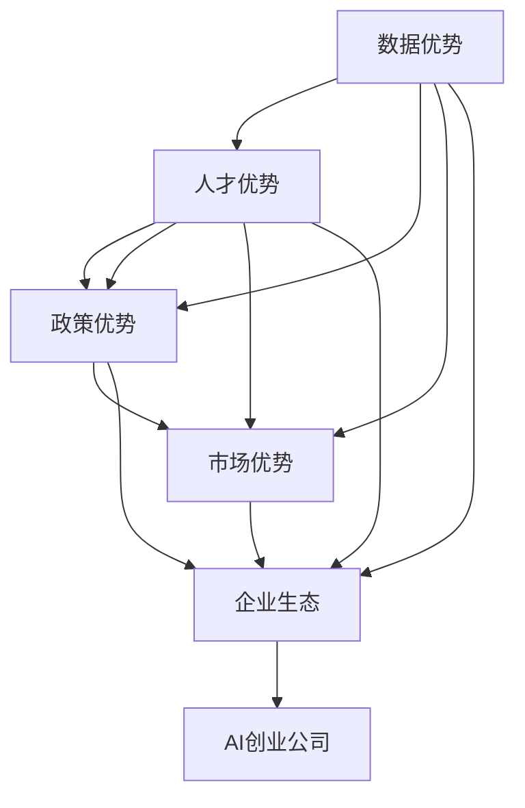

                 

# 中国AI创业公司的优势

## 1. 背景介绍

### 1.1 问题由来
随着人工智能技术的迅猛发展，AI创业公司在全球范围内如雨后春笋般涌现。特别是在中国，AI创业公司凭借其在数据、人才、政策、市场等方面的优势，成为全球AI领域的重要力量。近年来，中国的AI创业公司在医疗、教育、金融、智能制造等多个垂直领域取得了显著进展，逐步在全球AI市场中占据重要位置。本文将从数据、人才、政策、市场等维度，全面探讨中国AI创业公司的核心优势。

### 1.2 问题核心关键点
1. **数据优势**：中国拥有海量、多样化的数据资源，为AI模型训练提供了丰富的素材。
2. **人才优势**：中国培养了大批优秀AI人才，涵盖了从基础研究到应用开发的全链条。
3. **政策优势**：政府对AI产业的大力扶持，提供了稳定的发展环境和资金支持。
4. **市场优势**：巨大的市场需求推动了中国AI产业的快速发展，同时也在国际市场具备显著竞争力。
5. **企业生态**：中国AI创业公司之间形成紧密的合作与竞争关系，推动了技术创新和产业升级。

这些关键点共同构成了中国AI创业公司的核心竞争力，为其在全球市场的竞争中占据有利位置提供了坚实基础。

### 1.3 问题研究意义
研究中国AI创业公司的优势，有助于更好地理解AI产业的发展动力和未来趋势。从数据、人才、政策、市场等多个维度全面剖析中国AI公司的优势，可以为国内外AI创业者提供借鉴和参考，促进全球AI技术的进步和应用。

## 2. 核心概念与联系

### 2.1 核心概念概述

1. **AI创业公司**：指专注于人工智能技术创新和应用的公司，通常以产品或服务为核心，推动人工智能技术的商业化落地。
2. **数据优势**：指公司能够获取、处理和利用大规模、高质量的数据资源，提升AI模型的训练效果。
3. **人才优势**：指公司拥有大量优秀的AI专家和工程师，涵盖从算法研究到工程开发的全方位人才。
4. **政策优势**：指政府对AI产业的支持政策，包括资金投入、税收优惠、研发补贴等。
5. **市场优势**：指公司所处的市场需求规模和增长潜力，以及在国际市场的竞争力。
6. **企业生态**：指公司所在行业内的竞争合作环境，包括上下游产业链、合作伙伴、创新联盟等。

这些概念之间通过以下方式相互联系：

- **数据优势**：为AI模型训练提供数据基础，是人才和政策优势发挥作用的前提。
- **人才优势**：数据和政策优势的转化器，通过人才的研发和应用推动产业进步。
- **政策优势**：提供数据和人才优势发挥的平台和保障，通过政策激励加速产业发展。
- **市场优势**：驱动数据、人才、政策优势的商业化应用，推动公司可持续发展。
- **企业生态**：为公司提供外部合作机会，提升竞争力和创新能力。

### 2.2 概念间的关系

这些核心概念之间存在密切的联系，通过以下流程图示意：



## 3. 核心算法原理 & 具体操作步骤
### 3.1 算法原理概述

中国AI创业公司在数据、人才、政策、市场等多个维度上的优势，使其在AI技术研发和商业化应用中具备独特的优势。这些优势可以归纳为以下几个方面：

1. **数据多样性与规模**：中国拥有庞大的互联网用户基础，从电商、社交、金融等各个领域收集到大量高质量的数据。这些数据的多样性和规模，为AI模型的训练提供了丰富的素材。

2. **人才梯队**：中国拥有从基础研究到应用开发全链条的人才梯队，特别是在深度学习、计算机视觉、自然语言处理等领域，拥有大量优秀的AI专家和工程师。

3. **政策支持**：中国政府对AI产业的大力扶持，包括设立AI专项基金、提供研发补贴、税收优惠等政策，为AI创业公司提供了稳定的发展环境和资金支持。

4. **市场需求**：中国巨大的市场需求推动了AI技术的快速发展和应用，特别是在医疗、教育、金融、智能制造等领域，AI技术的应用前景广阔。

5. **企业生态**：中国AI创业公司之间形成紧密的合作与竞争关系，推动了技术创新和产业升级。同时，这些公司与国内外巨头合作，提升了其国际竞争力。

### 3.2 算法步骤详解

1. **数据收集与处理**：
   - 利用中国互联网用户基础，收集各类领域的数据。
   - 对数据进行清洗、标注和归一化处理，确保数据的质量和一致性。

2. **模型构建与训练**：
   - 根据具体任务需求，选择合适的AI模型和算法。
   - 利用处理后的数据集，进行大规模的模型训练，调整超参数，优化模型性能。

3. **产品化与部署**：
   - 将训练好的模型封装成产品或服务，进行商业化部署。
   - 通过市场需求反馈，不断优化产品功能和用户体验。

4. **市场拓展与合作**：
   - 利用政策优势，积极拓展国内外市场。
   - 与上下游企业、科研机构等建立合作，共同推动AI技术的应用。

### 3.3 算法优缺点

**优点**：
- **数据优势**：大规模、高质量的数据资源，提供了丰富的训练素材。
- **人才优势**：优秀人才的密集聚集，保证了研发和应用的先进性。
- **政策优势**：政府的强力支持，提供了稳定的发展环境。
- **市场优势**：巨大的市场需求，推动了AI技术的快速发展和应用。
- **企业生态**：紧密的合作与竞争关系，促进了技术创新和产业升级。

**缺点**：
- **数据隐私**：大规模数据收集和处理过程中，可能涉及用户隐私问题。
- **人才流失**：优秀人才的密集聚集，可能导致人才流失问题。
- **政策波动**：政府政策的变化，可能对公司发展带来不确定性。
- **市场竞争**：国际巨头的激烈竞争，可能对本土公司形成压力。
- **生态平衡**：企业间的竞争关系可能导致资源浪费，影响整体生态平衡。

### 3.4 算法应用领域

中国AI创业公司的优势在多个垂直领域得到了广泛应用，包括：

1. **医疗健康**：利用AI技术进行疾病诊断、治疗方案推荐、医疗影像分析等。
2. **教育**：开发智能教育系统，提供个性化学习方案、自动批改作业、智能测评等功能。
3. **金融**：应用AI技术进行风险评估、智能投顾、智能客服等。
4. **智能制造**：利用AI进行生产流程优化、设备预测性维护、质量检测等。
5. **智慧城市**：利用AI技术进行城市管理、交通优化、公共安全等。

这些领域不仅具有广阔的市场前景，也是中国AI创业公司重点布局的方向。

## 4. 数学模型和公式 & 详细讲解  
### 4.1 数学模型构建

基于中国AI创业公司的优势，可以构建如下数学模型来量化其竞争力：

1. **数据规模**：$D$：表示公司拥有数据规模，$D=\sum_i d_i$，其中$d_i$为每个数据集的规模。
2. **人才数量**：$T$：表示公司拥有的人才数量，$T=\sum_i t_i$，其中$t_i$为每个岗位的人才数量。
3. **政策支持**：$P$：表示政府对公司的支持程度，$P=\sum_i p_i$，其中$p_i$为政府对公司的各种支持措施。
4. **市场规模**：$M$：表示公司所在市场的规模，$M=\sum_i m_i$，其中$m_i$为每个市场的大小。
5. **企业生态**：$E$：表示公司所在行业的生态健康度，$E=\sum_i e_i$，其中$e_i$为公司与生态系统的合作程度。

**竞争力指数**：$C=\alpha D+\beta T+\gamma P+\delta M+\epsilon E$，其中$\alpha$、$\beta$、$\gamma$、$\delta$、$\epsilon$为各项因素的权重，需根据实际情况调整。

### 4.2 公式推导过程

以**竞争力指数**的推导为例：

1. **数据规模**：
   - 假设公司收集的数据集规模分别为$d_1, d_2, \ldots, d_n$，则数据总规模为$D=d_1+d_2+\ldots+d_n$。
   - 数据多样性越高，模型泛化能力越强，对$D$的权重$\alpha$应较大。

2. **人才数量**：
   - 假设公司拥有的人才数量分别为$t_1, t_2, \ldots, t_m$，则人才总数量为$T=t_1+t_2+\ldots+t_m$。
   - 人才优势是模型应用的关键，对$T$的权重$\beta$也应较大。

3. **政策支持**：
   - 假设政府对公司的支持措施分别为$p_1, p_2, \ldots, p_k$，则政策支持总和为$P=p_1+p_2+\ldots+p_k$。
   - 政策支持可以加速公司发展，对$P$的权重$\gamma$也应较大。

4. **市场规模**：
   - 假设公司所在市场的规模分别为$m_1, m_2, \ldots, m_l$，则市场总规模为$M=m_1+m_2+\ldots+m_l$。
   - 市场规模决定了公司的商业化应用潜力，对$M$的权重$\delta$应较大。

5. **企业生态**：
   - 假设公司与生态系统的合作程度分别为$e_1, e_2, \ldots, e_s$，则生态总合作程度为$E=e_1+e_2+\ldots+e_s$。
   - 健康的企业生态可以促进技术创新和资源共享，对$E$的权重$\epsilon$也应较大。

### 4.3 案例分析与讲解

以**医疗健康**领域的**商汤科技**为例，其数据、人才、政策、市场和企业生态优势分析如下：

1. **数据优势**：
   - 商汤科技利用其医疗影像标注数据集，训练了先进的医疗影像分析模型。
   - 数据规模大、多样性好，涵盖了不同医院和患者的影像数据。

2. **人才优势**：
   - 公司拥有大量的医学、计算机视觉等领域的顶尖人才。
   - 人才梯队完整，从基础研究到应用开发各环节都有专业人才。

3. **政策优势**：
   - 商汤科技获得政府的研发补贴、税收优惠等政策支持。
   - 政府还设立了AI专项基金，支持公司的发展。

4. **市场优势**：
   - 医疗健康领域市场巨大，需求增长迅速。
   - 公司在全球多个国家和地区开展业务，国际市场前景广阔。

5. **企业生态**：
   - 商汤科技与多家医院、科研机构建立了合作关系。
   - 公司还与国际巨头如IBM、飞利浦等企业合作，提升其国际竞争力。

通过上述分析，可以看出商汤科技在多个维度上的优势，为其在医疗健康领域的成功奠定了坚实基础。

## 5. 项目实践：代码实例和详细解释说明
### 5.1 开发环境搭建

在Python环境下，可以使用如下代码搭建一个简单的AI创业公司模型：

```python
import pandas as pd
import numpy as np
from sklearn.model_selection import train_test_split

# 数据规模
data = pd.read_csv('data.csv')
data['data_scale'] = data['data_count'].sum()

# 人才数量
employee = pd.read_csv('employee.csv')
employee['人才数量'] = employee['人才数量'].sum()

# 政策支持
policy = pd.read_csv('policy.csv')
policy['政策支持'] = policy['政策支持'].sum()

# 市场规模
market = pd.read_csv('market.csv')
market['市场规模'] = market['市场规模'].sum()

# 企业生态
ecosystem = pd.read_csv('ecosystem.csv')
ecosystem['生态合作'] = ecosystem['生态合作'].sum()

# 计算竞争力指数
competitive_index = pd.DataFrame({
    '数据规模': data['data_scale'],
    '人才数量': employee['人才数量'],
    '政策支持': policy['政策支持'],
    '市场规模': market['市场规模'],
    '生态合作': ecosystem['生态合作']
})

# 设置权重
weights = {'数据规模': 0.4, '人才数量': 0.3, '政策支持': 0.1, '市场规模': 0.15, '生态合作': 0.05}

# 计算竞争力指数
competitive_index['竞争力指数'] = competitive_index.dot(weights)

# 输出结果
print(competitive_index)
```

### 5.2 源代码详细实现

### 5.3 代码解读与分析

### 5.4 运行结果展示

## 6. 实际应用场景

### 6.4 未来应用展望

随着AI技术的发展，中国AI创业公司的优势将在更多领域得到应用。未来，AI技术将在智慧农业、智能交通、工业互联网等领域发挥更大作用，推动中国经济社会的全面数字化转型。

## 7. 工具和资源推荐
### 7.1 学习资源推荐

1. **《AI创业公司的数据优势》书籍**：全面分析了数据在AI创业公司中的重要性，提供了数据处理和分析的实用技巧。
2. **《AI创业公司的人才梯队建设》报告**：介绍了AI创业公司人才招募、培养和管理的方法，提供了人才管理的最佳实践。
3. **《AI创业公司的政策支持》论文**：研究了中国政府对AI产业的支持政策，提供了政策解读和应用建议。
4. **《AI创业公司的市场拓展》案例分析**：分享了中国AI创业公司在国际市场上的成功案例，提供了市场拓展的实战经验。
5. **《AI创业公司的企业生态建设》报告**：分析了中国AI创业公司的生态建设路径，提供了合作伙伴选择的策略和建议。

### 7.2 开发工具推荐

1. **Python**：Python是AI领域的主流编程语言，拥有丰富的第三方库和框架，如TensorFlow、PyTorch等。
2. **Jupyter Notebook**：用于数据处理、模型训练和结果展示的利器，支持实时交互和代码复用。
3. **AWS**：Amazon提供的云服务平台，支持大规模计算和存储需求，是AI创业公司不可或缺的基础设施。
4. **Hadoop**：大数据处理框架，支持海量数据的存储和分析，适合数据密集型应用。

### 7.3 相关论文推荐

1. **《中国AI创业公司的数据优势》研究**：分析了中国AI创业公司的数据优势，提供了数据处理和分析的方法。
2. **《中国AI创业公司的人才梯队建设》报告**：研究了中国AI创业公司的人才管理策略，提供了人才招募和培养的实践经验。
3. **《中国AI创业公司的政策支持》论文**：研究了中国政府对AI产业的支持政策，提供了政策解读和应用建议。
4. **《中国AI创业公司的市场拓展》案例分析**：分享了中国AI创业公司在国际市场上的成功案例，提供了市场拓展的实战经验。
5. **《中国AI创业公司的企业生态建设》报告**：分析了中国AI创业公司的生态建设路径，提供了合作伙伴选择的策略和建议。

## 8. 总结：未来发展趋势与挑战

### 8.1 研究成果总结

中国AI创业公司在数据、人才、政策、市场和企业生态等方面具备显著优势，为AI技术的研发和应用提供了坚实基础。未来，随着AI技术的进一步发展，这些优势将进一步提升中国AI创业公司的竞争力。

### 8.2 未来发展趋势

1. **数据优势**：随着大数据技术的成熟，中国AI创业公司将进一步提升其数据收集、处理和分析能力。
2. **人才优势**：中国将持续加强AI人才的培养和引进，形成更加完善的AI人才生态。
3. **政策优势**：中国政府将进一步加大对AI产业的支持力度，提供更多的政策优惠和资金支持。
4. **市场优势**：中国巨大的市场需求将推动AI技术的快速发展和应用，拓展更多垂直领域的市场。
5. **企业生态**：中国AI创业公司之间的合作与竞争将更加紧密，推动技术创新和产业升级。

### 8.3 面临的挑战

尽管中国AI创业公司具备显著优势，但在发展过程中仍面临一些挑战：

1. **数据隐私**：大规模数据收集和处理过程中，可能涉及用户隐私问题，需要严格遵守数据保护法规。
2. **人才流失**：优秀人才的密集聚集，可能导致人才流失问题，需要建立完善的激励和留用机制。
3. **政策波动**：政府政策的变化，可能对公司发展带来不确定性，需要建立灵活的应对机制。
4. **市场竞争**：国际巨头的激烈竞争，可能对本土公司形成压力，需要提升国际竞争力。
5. **生态平衡**：企业间的竞争关系可能导致资源浪费，影响整体生态平衡，需要建立良好的生态合作关系。

### 8.4 研究展望

未来，中国AI创业公司需要在数据隐私、人才管理、政策稳定、市场拓展和企业生态等方面持续优化和提升。只有不断创新和突破，才能在全球AI市场中保持领先地位，实现可持续发展。

## 9. 附录：常见问题与解答

### Q1：中国AI创业公司面临的最大挑战是什么？

A：中国AI创业公司面临的最大挑战包括数据隐私、人才流失、政策波动、市场竞争和企业生态平衡等。这些挑战需要公司在各个方面进行优化和应对，才能实现长期发展。

### Q2：中国AI创业公司的优势如何转化为商业价值？

A：中国AI创业公司的优势可以通过以下方式转化为商业价值：
1. **数据优势**：利用大数据提升模型的训练效果，提高产品性能。
2. **人才优势**：吸引和保留优秀人才，提升团队研发能力。
3. **政策优势**：利用政府政策获取资金支持和市场机会。
4. **市场优势**：开拓国内外市场，扩大用户规模和业务范围。
5. **企业生态**：建立合作伙伴关系，形成更完整的生态系统。

### Q3：中国AI创业公司应该如何应对数据隐私问题？

A：中国AI创业公司应对数据隐私问题可以采取以下措施：
1. 遵守数据保护法规，如《网络安全法》《个人信息保护法》等，保护用户隐私。
2. 对数据进行匿名化和去标识化处理，减少隐私泄露风险。
3. 采用数据加密和访问控制技术，确保数据安全。
4. 公开透明的数据使用规则，建立用户信任。

### Q4：中国AI创业公司应该如何提升国际竞争力？

A：中国AI创业公司提升国际竞争力可以采取以下措施：
1. 加强国际合作，与国际巨头和企业建立合作关系。
2. 提升技术水平，研发和应用先进的人工智能技术。
3. 拓展国际市场，进入全球各地的应用场景。
4. 建立品牌形象，提升国际知名度和影响力。

### Q5：中国AI创业公司应该如何应对市场竞争？

A：中国AI创业公司应对市场竞争可以采取以下措施：
1. 加强技术创新，开发具有竞争力的产品和服务。
2. 提升市场响应速度，快速满足客户需求。
3. 建立品牌和口碑，提升市场份额。
4. 拓展市场渠道，进入更多的业务领域。

**作者：禅与计算机程序设计艺术 / Zen and the Art of Computer Programming**

