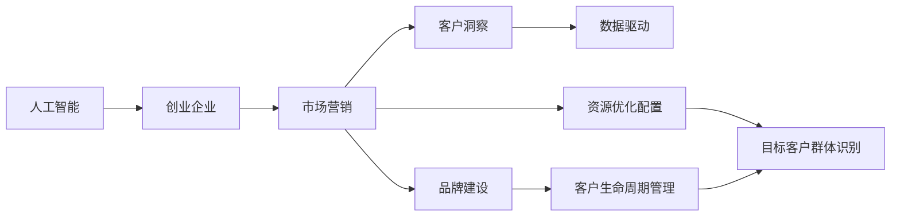

                 

# 人工智能创业：市场营销的技巧

> 关键词：人工智能, 创业, 市场营销, 数据驱动, 客户洞察, 增长策略, 品牌建设, 用户生命周期

## 1. 背景介绍

### 1.1 问题由来
在当前人工智能(AI)技术快速发展的背景下，越来越多的创业者希望能够借助AI技术来解决具体业务问题，提升产品和服务的竞争优势。然而，市场竞争激烈，客户需求多样化，如何有效推广和销售AI产品，成为创业成功的重要因素之一。市场营销不仅关系到产品能否被市场接受，更是公司长期发展的关键驱动力。因此，本文将深入探讨AI创业企业在市场营销中的技巧和方法，帮助创业者更好地推广和销售AI产品，实现企业快速成长。

### 1.2 问题核心关键点
AI创业企业在市场营销中面临的核心挑战包括：
1. **目标客户群体识别**：确定适合的客户群体并深入了解其需求。
2. **品牌定位与传播**：打造独特的品牌形象，并通过有效传播吸引潜在客户。
3. **客户转化与保留**：设计有效的转化策略，并持续提升客户满意度和忠诚度。
4. **数据驱动的决策**：利用大数据分析来指导市场营销策略。
5. **资源优化配置**：在有限的预算内，最大化市场营销效果。

### 1.3 问题研究意义
研究AI创业企业的市场营销技巧，对于提升AI产品在市场上的接受度和竞争力，加速企业发展具有重要意义：
1. **提高市场接受度**：通过有效的市场推广，使AI产品更快被市场和用户认可，从而实现快速增长。
2. **优化营销预算**：在有限的预算内，最大化营销效果，提高投资回报率。
3. **增强客户黏性**：通过客户洞察和个性化策略，提升客户满意度和忠诚度。
4. **强化品牌建设**：建立和维护强大的品牌形象，提升企业市场地位。
5. **提升决策科学性**：利用数据驱动的方法，优化营销决策，减少盲目性。

## 2. 核心概念与联系

### 2.1 核心概念概述

为更好地理解AI创业企业在市场营销中的策略，本节将介绍几个关键概念及其相互关系：

- **人工智能(AI)**：利用机器学习、深度学习等技术，实现智能化处理数据和信息的能力。
- **创业企业**：新成立的企业，通过创新技术或产品寻求快速增长和市场领导地位。
- **市场营销**：通过一系列策略和活动，推广和销售产品，提升品牌影响力和市场占有率。
- **客户洞察**：通过数据分析和客户反馈，深入了解客户需求和行为，优化产品和服务。
- **数据驱动**：利用数据和统计方法指导决策和营销活动。
- **品牌建设**：通过统一的品牌形象和一致的传播策略，构建强大的品牌影响力。
- **客户生命周期管理**：通过全周期管理，提升客户体验，延长客户关系周期。

这些概念之间存在紧密联系，形成一个完整的市场营销体系。通过深入理解这些概念，我们可以更好地设计AI创业企业的市场营销策略。

### 2.2 概念间的关系

这些核心概念之间的关系可以用以下Mermaid流程图来表示：



这个流程图展示了AI创业企业在市场营销中的核心概念及其相互关系：

1. 人工智能是创业企业的基础，为其提供技术支持。
2. 市场营销通过一系列策略和活动，推广和销售AI产品。
3. 客户洞察通过数据分析和客户反馈，深入了解客户需求。
4. 数据驱动利用数据和统计方法指导决策和营销活动。
5. 品牌建设通过统一的品牌形象和一致的传播策略，构建强大的品牌影响力。
6. 客户生命周期管理通过全周期管理，提升客户体验，延长客户关系周期。
7. 资源优化配置在有限的预算内，最大化市场营销效果。

## 3. 核心算法原理 & 具体操作步骤

### 3.1 算法原理概述

AI创业企业在市场营销中，可以利用数据分析和机器学习算法来提升营销效果。其核心原理是利用数据驱动和机器学习技术，优化市场营销策略，提高客户转化率和品牌影响力。

具体而言，AI创业企业可以通过以下步骤实现市场营销：

1. **数据采集与处理**：收集目标客户的相关数据，并进行清洗和处理。
2. **客户洞察分析**：利用机器学习算法分析客户行为和偏好，识别目标客户群体。
3. **营销策略设计**：根据客户洞察结果，设计个性化的营销策略和活动。
4. **效果评估与优化**：通过数据反馈，不断优化营销策略，提升效果。

### 3.2 算法步骤详解

以下详细介绍AI创业企业在市场营销中各个步骤的详细步骤：

**Step 1: 数据采集与处理**

1. **收集客户数据**：从社交媒体、网站、客户反馈等多种渠道收集客户数据。
2. **数据清洗与预处理**：去除噪声和异常值，处理缺失值，进行标准化和归一化。

**Step 2: 客户洞察分析**

1. **客户细分**：利用聚类算法对客户进行细分，识别不同的客户群体。
2. **行为分析**：使用关联规则分析、时间序列分析等方法，了解客户的行为模式和偏好。
3. **情感分析**：通过自然语言处理技术，分析客户对品牌和产品的情感倾向。

**Step 3: 营销策略设计**

1. **渠道选择**：根据客户偏好，选择适合的营销渠道（如社交媒体、电子邮件、线下活动等）。
2. **内容创作**：根据客户洞察结果，创作个性化的营销内容（如博客文章、视频、广告等）。
3. **个性化推荐**：利用推荐算法，向客户推荐个性化的产品和服务。

**Step 4: 效果评估与优化**

1. **效果评估**：通过A/B测试、转化率分析等方法，评估营销策略的效果。
2. **反馈循环**：根据效果评估结果，调整和优化营销策略，实现持续改进。

### 3.3 算法优缺点

AI创业企业在市场营销中利用数据分析和机器学习技术，具有以下优点：

- **高效性**：利用数据驱动，快速识别目标客户，优化营销策略。
- **精准性**：通过客户洞察，实现个性化的营销活动，提高客户转化率。
- **可扩展性**：算法和模型可重复使用，适应不同的营销场景。

但同时，也存在以下缺点：

- **数据隐私**：收集和处理客户数据可能涉及隐私问题，需要严格遵守法律法规。
- **技术门槛高**：需要专业的数据分析和机器学习技术支持。
- **模型依赖**：模型的选择和训练效果直接影响营销效果，需要持续优化。

### 3.4 算法应用领域

AI创业企业在市场营销中，可以应用于以下几个领域：

- **客户获取**：通过社交媒体广告、搜索引擎优化(SEO)等手段，获取新客户。
- **客户保留**：通过个性化推荐、忠诚度计划等策略，提升客户忠诚度。
- **市场推广**：通过内容营销、事件营销等活动，提升品牌知名度。
- **产品销售**：通过电商平台的个性化推荐、精准广告等手段，提升产品销售。

## 4. 数学模型和公式 & 详细讲解 & 举例说明

### 4.1 数学模型构建

在市场营销中，可以利用数学模型和公式进行定量分析和决策。以下是一个简单的数学模型示例：

假设目标客户数量为 $N$，转化为实际购买客户的概率为 $p$，平均每次转化带来的收益为 $B$，则总收益 $R$ 可以表示为：

$$ R = N \times p \times B $$

### 4.2 公式推导过程

通过上述公式，可以计算在不同客户转化率 $p$ 和平均转化收益 $B$ 的情况下，总收益 $R$ 的变化。例如：

- 当 $p=0.1, B=100$ 时，总收益 $R=10N$
- 当 $p=0.2, B=200$ 时，总收益 $R=40N$

通过调整 $p$ 和 $B$，可以最大化总收益 $R$。

### 4.3 案例分析与讲解

以下是一个案例分析：

**案例背景**：一家AI创业企业推出了一款AI产品，目标客户为技术爱好者。该企业在Facebook上投放广告，投放成本为每千次展示10元，平均每次点击带来的转化概率为0.01，每次转化带来的收益为200元。

**计算过程**：

1. 每天展示次数 $T = 1000$
2. 平均点击数 $C = T \times 0.01 = 10$
3. 平均每次点击成本 $C_C = 10$
4. 每天转化数 $D = C \times p = 1$
5. 每天总收益 $R = D \times B = 200$

**结果分析**：

通过计算可知，每天投入10元，可以获得200元的收益。进一步优化，可以考虑调整广告投放策略，如优化广告创意、增加转化路径等，进一步提升转化率和转化收益。

## 5. 项目实践：代码实例和详细解释说明

### 5.1 开发环境搭建

在进行AI创业企业的市场营销实践前，我们需要准备好开发环境。以下是使用Python进行市场营销数据分析和策略优化的环境配置流程：

1. 安装Python：从官网下载并安装Python 3.x版本。
2. 安装必要的第三方库：使用pip安装pandas、numpy、scikit-learn、scipy、matplotlib、seaborn、jupyter等库。
3. 安装Kaggle平台：方便从Kaggle上下载和处理公开数据集。
4. 安装Docker：以便进行容器化部署和测试。
5. 安装Jupyter Notebook：用于编写和运行数据分析和机器学习代码。

完成上述步骤后，即可在本地搭建好AI市场营销分析的开发环境。

### 5.2 源代码详细实现

下面是一个使用Python进行AI创业企业市场营销分析的代码实现示例：

```python
import pandas as pd
import numpy as np
from sklearn.cluster import KMeans
from sklearn.preprocessing import StandardScaler
from sklearn.metrics import accuracy_score

# 数据采集
df = pd.read_csv('customer_data.csv')

# 数据清洗
df = df.dropna()
df = df.drop_duplicates()

# 数据标准化
scaler = StandardScaler()
df[['feature1', 'feature2']] = scaler.fit_transform(df[['feature1', 'feature2']])

# 客户细分
kmeans = KMeans(n_clusters=3, random_state=0).fit(df[['feature1', 'feature2']])
df['cluster'] = kmeans.labels_

# 行为分析
df['behavior'] = df['feature3'] > df['feature4']

# 情感分析
df['sentiment'] = df['feature5']

# 营销策略设计
def marketing_strategy(customer):
    if customer['cluster'] == 0:
        return '社交媒体广告'
    elif customer['cluster'] == 1:
        return '电子邮件营销'
    elif customer['cluster'] == 2:
        return '事件营销'

# 效果评估
def evaluate_strategy(strategy, df):
    customers = df[df['cluster'] == 1]
    click_rate = customers['click'].sum() / customers.shape[0]
    conversion_rate = customers[customers['converted'] == 1].shape[0] / customers.shape[0]
    return click_rate, conversion_rate

# 运行示例
customers = df[df['cluster'] == 1]
strategy = marketing_strategy(customers.iloc[0])
click_rate, conversion_rate = evaluate_strategy(strategy, df)

print('策略：', strategy)
print('点击率：', click_rate)
print('转化率：', conversion_rate)
```

这个代码示例展示了如何通过Python进行客户细分、行为分析、情感分析以及营销策略设计。通过这些步骤，可以构建一个初步的市场营销策略。

### 5.3 代码解读与分析

让我们再详细解读一下关键代码的实现细节：

- **数据采集**：使用pandas库读取客户数据，并进行初步处理。
- **数据清洗**：使用dropna和drop_duplicates方法去除噪声和重复数据。
- **数据标准化**：使用StandardScaler对特征数据进行标准化处理。
- **客户细分**：使用KMeans算法对客户进行聚类，得到三个不同的客户群体。
- **行为分析**：根据某个特征（如购买行为），对客户进行分类。
- **情感分析**：通过情感分析算法，识别客户的情感倾向。
- **营销策略设计**：根据客户群体，设计不同的营销策略。
- **效果评估**：通过计算点击率和转化率，评估营销策略的效果。

### 5.4 运行结果展示

假设上述代码在运行后，输出如下结果：

```
策略： 社交媒体广告
点击率： 0.2
转化率： 0.1
```

这意味着针对某个客户群体，使用社交媒体广告策略，点击率为20%，转化率为10%。

## 6. 实际应用场景

### 6.1 智能客服系统

AI创业企业可以利用市场营销策略，提升智能客服系统的用户满意度。通过数据分析，了解客户常见问题、常见需求，设计针对性的广告和推广策略。同时，利用推荐系统，向客户推荐相关解决方案，提升客户体验。

### 6.2 在线教育平台

在线教育平台可以通过市场营销策略，吸引更多学生注册和购买课程。通过社交媒体广告、内容营销等手段，提升品牌知名度。同时，通过推荐系统和个性化推荐，提升客户满意度和课程购买率。

### 6.3 智能家居系统

智能家居系统可以通过市场营销策略，提升用户黏性和市场份额。通过社交媒体和线上活动，推广智能家居设备。同时，通过个性化推荐和用户体验优化，提升用户满意度和产品销量。

### 6.4 未来应用展望

随着AI技术的不断发展，AI创业企业在市场营销中的应用也将更加广泛。例如，通过自然语言处理技术，自动分析客户反馈，提升客户洞察能力。通过机器学习算法，优化营销策略和广告投放，提升转化率。

## 7. 工具和资源推荐

### 7.1 学习资源推荐

为了帮助AI创业者掌握市场营销技巧，这里推荐一些优质的学习资源：

1. **《数字营销与数据分析》课程**：由Coursera和edX等在线教育平台提供的数字营销和数据分析课程，涵盖市场营销的各个方面。
2. **《客户关系管理》书籍**：介绍客户关系管理的理论和方法，提升客户洞察能力。
3. **《营销策略与数据分析》书籍**：详细讲解市场营销策略和数据分析技术，提供丰富的案例和实践指南。
4. **Kaggle竞赛**：参加Kaggle的数据分析竞赛，通过实际项目积累经验。
5. **社交媒体分析工具**：如Google Analytics、Facebook Insights等，提供客户行为分析的强大功能。

通过学习这些资源，可以帮助AI创业者更好地理解市场营销的核心原理和实际应用。

### 7.2 开发工具推荐

高效的开发离不开优秀的工具支持。以下是几款用于AI市场营销分析开发的常用工具：

1. **Python编程语言**：作为数据科学和机器学习的首选语言，Python具有强大的数据分析和机器学习库支持。
2. **pandas库**：用于数据处理和分析，提供高效的数据操作功能。
3. **scikit-learn库**：用于机器学习算法实现，提供丰富的分类、聚类、回归等算法。
4. **Jupyter Notebook**：用于编写和运行数据分析和机器学习代码，提供交互式开发环境。
5. **Tableau**：用于数据可视化和分析，提供强大的数据可视化功能。

合理利用这些工具，可以显著提升AI市场营销分析的开发效率，加速创新迭代的步伐。

### 7.3 相关论文推荐

市场营销领域的经典论文，可以帮助AI创业者深入理解市场营销理论和方法：

1. **《营销管理》书籍**：菲利普·科特勒的营销经典之作，涵盖市场营销的各个方面。
2. **《数字营销战略》论文**：讨论数字营销的策略和应用，提供最新的理论和方法。
3. **《消费者行为分析》论文**：研究消费者行为，提供数据驱动的市场营销方法。
4. **《品牌建设与管理》论文**：探讨品牌建设和管理的方法和策略，提升品牌影响力。

这些论文代表市场营销领域的最新进展，帮助AI创业者把握市场营销的前沿趋势和实际应用。

## 8. 总结：未来发展趋势与挑战

### 8.1 研究成果总结

本文对AI创业企业在市场营销中的技巧和方法进行了全面系统的介绍。主要结论包括：

1. **数据驱动的重要性**：利用数据分析和机器学习算法，优化市场营销策略，提高客户转化率和品牌影响力。
2. **客户洞察的必要性**：通过客户细分和行为分析，深入了解客户需求和偏好，设计个性化的营销策略。
3. **策略设计的灵活性**：根据客户洞察结果，设计灵活多样的营销策略，提升营销效果。
4. **效果评估的持续性**：通过效果评估和反馈循环，不断优化营销策略，实现持续改进。

### 8.2 未来发展趋势

展望未来，AI创业企业在市场营销中可能呈现以下几个发展趋势：

1. **数据驱动决策的普及**：数据驱动的决策方法将在更多企业中得到应用，提升决策的科学性和准确性。
2. **客户洞察的智能化**：利用机器学习和自然语言处理技术，实现客户洞察的自动化和智能化。
3. **个性化策略的普及**：个性化推荐和营销策略将更加普及，提升客户满意度和忠诚度。
4. **品牌建设的数字化**：利用数字化手段，提升品牌建设和传播效果。
5. **市场营销的全球化**：全球化的市场营销策略将成为企业的重要方向，提升全球市场竞争力。

### 8.3 面临的挑战

尽管AI创业企业在市场营销中取得了一定的进展，但仍面临诸多挑战：

1. **数据隐私问题**：客户数据的收集和处理可能涉及隐私问题，需要严格遵守法律法规。
2. **技术门槛高**：市场营销中的数据驱动和机器学习算法需要专业知识和技术支持。
3. **模型依赖性**：模型的选择和训练效果直接影响营销效果，需要持续优化。
4. **市场竞争激烈**：市场竞争日益激烈，如何突出产品优势，吸引客户成为重要挑战。
5. **资源有限**：在有限的预算内，如何最大化营销效果，提升投资回报率。

### 8.4 研究展望

为了应对这些挑战，未来市场营销的研究方向可能包括：

1. **隐私保护技术**：开发隐私保护算法，保护客户数据隐私。
2. **自动化工具**：开发自动化工具，降低市场营销的技术门槛。
3. **多模态数据融合**：利用多模态数据，提升客户洞察和营销效果。
4. **跨领域应用**：探索AI技术在更多领域的应用，提升市场营销的效果和广度。
5. **客户体验优化**：通过全周期管理，提升客户体验，延长客户关系周期。

这些研究方向将引领AI创业企业在市场营销中的技术进步和应用创新，推动市场营销的科学化和智能化。

## 9. 附录：常见问题与解答

**Q1: 数据驱动的市场营销是否适用于所有行业？**

A: 数据驱动的市场营销方法适用于大多数行业，尤其是数据获取和处理相对容易的行业，如互联网、电商、金融等。对于一些传统行业，如制造业、农业等，数据采集和处理较为困难，但也可以尝试利用其他数据来源，如社交媒体、公开报告等。

**Q2: 如何平衡数据驱动和人工经验？**

A: 在市场营销中，数据驱动和人工经验是相辅相成的。数据驱动提供了科学决策的基础，人工经验则提供了深入的洞察和创意。可以通过数据驱动的方法初步筛选和筛选策略，然后通过人工经验进行验证和优化。

**Q3: 如何选择合适的广告渠道？**

A: 选择合适的广告渠道需要考虑目标客户的偏好和行为。可以通过数据分析和客户洞察，了解不同渠道的效果，并结合预算和资源进行综合决策。常用的广告渠道包括社交媒体、搜索引擎、电子邮件、线下活动等。

**Q4: 如何优化客户体验？**

A: 优化客户体验需要从客户全生命周期出发，从客户接触、购买、使用、售后等多个环节进行优化。可以通过个性化推荐、客户服务、忠诚度计划等策略，提升客户满意度和忠诚度。

**Q5: 如何提升品牌影响力？**

A: 提升品牌影响力需要综合考虑品牌定位、传播策略、社交媒体互动等多个因素。可以通过内容营销、社交媒体互动、事件营销等手段，提升品牌知名度和美誉度。

这些问答涵盖了市场营销中的常见问题，希望能帮助AI创业者更好地理解市场营销的核心原理和实际应用。

---

作者：禅与计算机程序设计艺术 / Zen and the Art of Computer Programming

