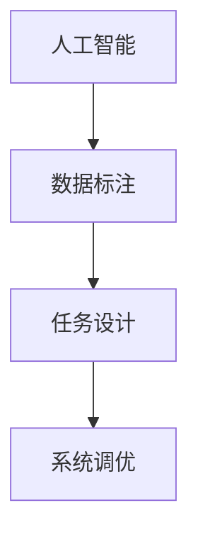

                 

# 人类计算：AI时代的关键人力要素

> 关键词：AI、计算、人类、关键要素、未来趋势

## 1. 背景介绍

### 1.1 问题由来
随着人工智能（AI）技术的发展，越来越多的行业开始采用AI解决方案，以提升效率、降低成本、改善用户体验。尽管AI技术日趋成熟，但其在复杂、精细的决策任务中仍然无法完全取代人类。在AI时代，人类计算能力成为了不可替代的核心资源。

### 1.2 问题核心关键点
人类计算，即在AI系统的辅助下，人类进行数据标注、任务设计、系统调优等关键环节的工作。这些工作对于提升AI系统的性能和可靠性至关重要，但往往需要依赖人类经验、直觉和创造力。

### 1.3 问题研究意义
研究人类计算的核心要素和实践方法，对于提升AI系统的智能化水平、推动人工智能技术在更多领域的落地应用，具有重要意义。通过系统总结人类计算的关键技能和高效方法，可以为AI开发者提供更丰富的工具和思路，加速技术创新和产业升级。

## 2. 核心概念与联系

### 2.1 核心概念概述

为了更好地理解人类计算在AI时代的重要作用，本节将介绍几个关键概念及其联系：

- **人工智能（AI）**：通过机器学习、深度学习等技术，使计算机能够模拟人类智能过程，实现自主学习和决策。
- **人类计算**：在AI系统的辅助下，人类进行数据标注、任务设计、系统调优等工作，这些工作对AI系统的性能和可靠性至关重要。
- **数据标注**：为AI模型提供监督信号的过程，包括对文本、图像、语音等数据进行人工标注。
- **任务设计**：确定AI系统要解决的具体问题，设计合适的输入输出格式和评估指标。
- **系统调优**：通过调整模型参数、改进算法等方法，提升AI系统的性能和泛化能力。

这些概念之间的联系可以通过以下Mermaid流程图来展示：



这个流程图展示了AI系统从数据准备到最终调优的完整过程，其中每个环节都依赖人类计算的支持。数据标注提供必要的监督信号，任务设计确定具体的求解目标，系统调优优化模型性能，这三个环节共同作用，推动AI系统不断迭代优化，提升其实际应用效果。

### 2.2 概念间的关系

这些核心概念之间存在着紧密的联系，形成了AI系统的关键生态。以下是几个关键的联系点：

- **数据标注与AI模型**：数据标注为AI模型提供必要的监督信号，训练其从原始数据中学习到知识。
- **任务设计与AI系统**：任务设计决定了AI系统解决的具体问题，影响其输出结果和应用场景。
- **系统调优与AI系统性能**：通过系统调优，AI系统能够在实际应用中更好地适应数据分布，提升其泛化能力和鲁棒性。

理解这些联系点，可以帮助我们更好地把握人类计算在AI系统中的重要作用，为进一步探索其优化方法和提升效率奠定基础。

## 3. 核心算法原理 & 具体操作步骤
### 3.1 算法原理概述

人类计算的核心算法原理，主要涉及数据标注、任务设计、系统调优等方面。这些算法的设计和实现，需要充分考虑人类认知特点和AI系统的工作机制，以达到最优的协同效果。

### 3.2 算法步骤详解

以下是人类计算在数据标注、任务设计和系统调优中的具体步骤：

#### 数据标注

**Step 1: 数据准备**
- 收集标注数据，确保数据质量和多样性。
- 数据清洗，去除噪声和异常值。

**Step 2: 数据标注**
- 选择合适的标注工具和标准。
- 分配标注任务给标注员，确保标注质量。
- 标注结果审核和纠错，确保标注准确性。

**Step 3: 数据合并与评估**
- 合并多个标注员的标注结果，进行统计分析。
- 使用Kappa系数等指标评估标注一致性，确保标注质量。

#### 任务设计

**Step 1: 确定目标**
- 明确AI系统要解决的具体问题。
- 确定输入输出格式，如文本、图像、语音等。

**Step 2: 设计指标**
- 选择合适的评估指标，如准确率、召回率、F1分数等。
- 设计测试数据集，确保评估结果具有代表性和可靠性。

**Step 3: 设计实验**
- 确定实验方法，如交叉验证、A/B测试等。
- 设定实验参数，如学习率、迭代次数等。

#### 系统调优

**Step 1: 选择合适的模型和算法**
- 根据任务特点，选择合适的深度学习模型和优化算法。
- 调整模型超参数，如隐藏层数、学习率、批量大小等。

**Step 2: 训练和验证**
- 使用标注数据进行模型训练，验证模型效果。
- 调整模型参数，优化模型性能。

**Step 3: 测试和部署**
- 在测试集上评估模型性能。
- 部署优化后的模型，进行实际应用。

### 3.3 算法优缺点

人类计算的优点包括：

- **精度高**：人类计算能够提供高质量的标注数据和任务设计，提升AI系统的性能。
- **灵活性**：人类计算可以根据具体任务需求进行灵活调整，适应不同的应用场景。
- **创造力**：人类计算往往涉及任务设计和系统调优，需要依赖人类创造力和直觉。

缺点包括：

- **成本高**：高质量的数据标注和任务设计需要大量时间和人力投入，成本较高。
- **效率低**：人类计算受限于人类的处理速度和认知能力，效率较低。
- **主观性**：标注结果和任务设计可能受到标注员个人偏见的影响，结果具有主观性。

### 3.4 算法应用领域

人类计算在AI时代的应用非常广泛，覆盖了多个领域：

- **自然语言处理（NLP）**：如机器翻译、情感分析、文本生成等任务，都需要高质量的数据标注和任务设计。
- **计算机视觉（CV）**：如图像分类、目标检测、人脸识别等任务，需要标注图像数据和设计任务指标。
- **机器人学**：如行为规划、路径规划等任务，需要人类计算进行任务设计和系统调优。
- **自动驾驶**：如环境感知、决策规划等任务，需要人类计算提供大量标注数据和任务设计。
- **医疗健康**：如疾病诊断、治疗方案推荐等任务，需要高质量的数据标注和任务设计。

此外，人类计算在教育、金融、法律等更多领域也有广泛应用，推动了AI技术在这些垂直行业的落地和普及。

## 4. 数学模型和公式 & 详细讲解 & 举例说明

### 4.1 数学模型构建

在人类计算过程中，常常需要使用一些数学模型来描述和优化问题。以下是一个简单的例子：

假设我们要设计一个二分类任务，任务是判断一张图像是否包含特定对象。我们可以将问题建模如下：

- **输入**：图像 $x$，标注 $y \in \{0,1\}$。
- **输出**：模型预测结果 $\hat{y} \in [0,1]$，表示图像包含对象的概率。

数学模型可以表示为：

$$
\hat{y} = M(x;\theta)
$$

其中 $M$ 表示模型，$\theta$ 表示模型参数。我们希望最小化模型输出与真实标签之间的差距，使用二分类交叉熵损失函数：

$$
\mathcal{L}(\theta) = -\frac{1}{N}\sum_{i=1}^N [y_i\log \hat{y}_i + (1-y_i)\log (1-\hat{y}_i)]
$$

目标是最小化损失函数，找到最优模型参数：

$$
\theta^* = \mathop{\arg\min}_{\theta} \mathcal{L}(\theta)
$$

### 4.2 公式推导过程

我们可以使用梯度下降等优化算法来求解上述最优化问题。具体步骤如下：

1. **计算梯度**：对损失函数求导，得到模型参数的梯度：

$$
\frac{\partial \mathcal{L}(\theta)}{\partial \theta} = -\frac{1}{N}\sum_{i=1}^N [\frac{y_i}{\hat{y}_i}-\frac{1-y_i}{1-\hat{y}_i}]\frac{\partial M(x;\theta)}{\partial \theta}
$$

2. **更新参数**：使用梯度更新模型参数：

$$
\theta \leftarrow \theta - \eta \frac{\partial \mathcal{L}(\theta)}{\partial \theta}
$$

其中 $\eta$ 为学习率。

3. **迭代优化**：重复上述步骤，直至收敛。

### 4.3 案例分析与讲解

以机器翻译为例，我们介绍如何通过人类计算进行数据标注和任务设计：

- **数据标注**：选择一定量的双语对照语料，由人工标注源语言和目标语言之间的对应关系。
- **任务设计**：确定机器翻译的具体目标，如统计机器翻译、神经机器翻译等。
- **系统调优**：选择适当的模型架构，如序列到序列模型、注意力机制等。使用标注数据进行模型训练，并在验证集上评估效果，调整超参数，优化模型性能。

## 5. 项目实践：代码实例和详细解释说明

### 5.1 开发环境搭建

在进行人类计算的项目实践前，我们需要准备好开发环境。以下是使用Python进行TensorFlow开发的环境配置流程：

1. 安装Anaconda：从官网下载并安装Anaconda，用于创建独立的Python环境。

2. 创建并激活虚拟环境：
```bash
conda create -n tf-env python=3.8 
conda activate tf-env
```

3. 安装TensorFlow：根据CUDA版本，从官网获取对应的安装命令。例如：
```bash
conda install tensorflow -c tensorflow -c conda-forge
```

4. 安装各类工具包：
```bash
pip install numpy pandas scikit-learn matplotlib tqdm jupyter notebook ipython
```

完成上述步骤后，即可在`tf-env`环境中开始项目实践。

### 5.2 源代码详细实现

下面以机器翻译任务为例，给出使用TensorFlow进行数据标注和任务设计的PyTorch代码实现。

首先，定义机器翻译任务的数据处理函数：

```python
import tensorflow as tf
from tensorflow.keras.preprocessing.text import Tokenizer
from tensorflow.keras.preprocessing.sequence import pad_sequences

def load_data(source_path, target_path, tokenizer):
    source_texts = []
    target_texts = []
    with open(source_path, 'r', encoding='utf-8') as source_file:
        for line in source_file:
            source_texts.append(line)
    with open(target_path, 'r', encoding='utf-8') as target_file:
        for line in target_file:
            target_texts.append(line)
    tokenizer.fit_on_texts(source_texts)
    source_sequences = tokenizer.texts_to_sequences(source_texts)
    target_sequences = tokenizer.texts_to_sequences(target_texts)
    return pad_sequences(source_sequences, maxlen=max_length), pad_sequences(target_sequences, maxlen=max_length)

source_texts, target_texts = load_data('source.txt', 'target.txt', tokenizer)
```

然后，定义模型和优化器：

```python
from tensorflow.keras.models import Sequential
from tensorflow.keras.layers import Embedding, LSTM, Dense

model = Sequential([
    Embedding(vocab_size, embedding_dim, input_length=max_length),
    LSTM(units=64),
    Dense(vocab_size, activation='softmax')
])
model.compile(optimizer='adam', loss='categorical_crossentropy', metrics=['accuracy'])
```

接着，定义训练和评估函数：

```python
def train(model, train_data, validation_data, epochs):
    model.fit(train_data, validation_data, epochs=epochs, batch_size=batch_size)

def evaluate(model, test_data):
    test_loss, test_accuracy = model.evaluate(test_data)
    print('Test loss:', test_loss)
    print('Test accuracy:', test_accuracy)
```

最后，启动训练流程并在测试集上评估：

```python
max_length = 50
batch_size = 32
epochs = 10

train_data, val_data = load_data('train.txt', 'train_trans.txt', tokenizer)
test_data, _ = load_data('test.txt', 'test_trans.txt', tokenizer)

train(model, train_data, val_data, epochs)
evaluate(model, test_data)
```

以上就是使用TensorFlow进行机器翻译任务的人类计算项目实践，展示了如何通过数据标注和任务设计，训练和评估机器翻译模型。

### 5.3 代码解读与分析

让我们再详细解读一下关键代码的实现细节：

**load_data函数**：
- 定义了数据加载和预处理函数，将源语言和目标语言的文本读入列表，使用Tokenizer进行分词和编码，并进行填充操作。

**模型定义**：
- 定义了一个简单的机器翻译模型，包括嵌入层、LSTM层和输出层。
- 使用交叉熵损失函数和准确率作为评估指标。

**训练和评估函数**：
- 使用TensorFlow的fit方法进行模型训练，在验证集上评估模型效果。
- 在测试集上评估模型性能，输出损失和准确率。

**训练流程**：
- 定义模型超参数，如max_length、batch_size、epochs等。
- 加载训练集和验证集数据，进行模型训练。
- 在测试集上评估模型性能，输出结果。

## 6. 实际应用场景

### 6.1 智能客服系统

在智能客服系统中，人类计算扮演着重要角色。智能客服系统通过收集用户的历史聊天记录，进行数据标注和任务设计，训练出能够理解用户意图并给出准确回答的模型。通过人类计算，智能客服系统能够不断优化，提升用户满意度，降低企业运营成本。

### 6.2 金融舆情监测

金融舆情监测系统需要实时监测金融市场舆情，及时响应市场变化。通过人类计算，系统可以设计合适的指标，标注数据集，训练出能够自动识别市场动态变化的模型。这些模型能够帮助金融机构快速响应市场变化，降低风险。

### 6.3 个性化推荐系统

个性化推荐系统需要根据用户的历史行为和兴趣，推荐合适的商品或内容。通过人类计算，系统可以设计合适的评估指标，标注数据集，训练出能够自动分析用户兴趣的模型。这些模型能够帮助电商平台和内容平台提升推荐效果，提升用户体验。

### 6.4 未来应用展望

随着人类计算的不断发展，未来将在更多领域得到应用，为各行各业带来变革性影响：

- **医疗健康**：通过人类计算，医疗系统可以设计合适的评估指标，标注数据集，训练出能够自动分析疾病风险和推荐治疗方案的模型。这些模型能够帮助医生更准确地诊断疾病，提高医疗效率。
- **教育领域**：通过人类计算，教育系统可以设计合适的评估指标，标注数据集，训练出能够自动分析学生学习行为和评估学习效果的模型。这些模型能够帮助教师更精准地了解学生学习状态，提高教学质量。
- **自动驾驶**：通过人类计算，自动驾驶系统可以设计合适的评估指标，标注数据集，训练出能够自动感知环境和做出决策的模型。这些模型能够帮助汽车制造商提升自动驾驶技术，提高行车安全。

总之，人类计算在AI时代扮演着关键角色，将在更多领域得到广泛应用，为各行各业带来变革性影响。未来，随着人类计算技术和方法的不断创新，其应用场景将更加广泛，推动人类社会进入更加智能化、普适化的新时代。

## 7. 工具和资源推荐
### 7.1 学习资源推荐

为了帮助开发者系统掌握人类计算的理论基础和实践技巧，这里推荐一些优质的学习资源：

1. **《深度学习》课程**：斯坦福大学开设的深度学习课程，涵盖了深度学习的基本概念和实践方法，是入门深度学习的最佳资源。
2. **《自然语言处理综论》书籍**：涵盖自然语言处理的基本概念和前沿技术，适合深度学习和NLP初学者阅读。
3. **TensorFlow官方文档**：TensorFlow的官方文档，提供了详细的API文档和示例代码，是学习和使用TensorFlow的最佳资源。
4. **Kaggle竞赛平台**：提供了大量数据集和竞赛项目，是锻炼人类计算能力的最佳平台。
5. **Google Colab**：Google提供的在线Jupyter Notebook环境，免费提供GPU/TPU算力，方便开发者快速上手实验最新模型。

通过对这些资源的学习实践，相信你一定能够快速掌握人类计算的精髓，并用于解决实际的NLP问题。

### 7.2 开发工具推荐

高效的开发离不开优秀的工具支持。以下是几款用于人类计算开发常用的工具：

1. **Python**：Python语言简单易学，生态丰富，是深度学习和人机交互领域的主流开发语言。
2. **TensorFlow**：由Google主导开发的深度学习框架，生产部署方便，适合大规模工程应用。
3. **Keras**：Keras是一个高层次的神经网络API，可以方便地搭建和训练深度学习模型，是TensorFlow和PyTorch的优秀替代品。
4. **Jupyter Notebook**：一个开源的Web应用，可以方便地编写和运行Python代码，支持多种代码格式和交互式调试。
5. **Anaconda**：Anaconda是一个开源的Python发行版，包含了大量常用的科学计算库和工具，是开发深度学习项目的理想环境。

合理利用这些工具，可以显著提升人类计算项目的开发效率，加快创新迭代的步伐。

### 7.3 相关论文推荐

人类计算的不断发展源于学界的持续研究。以下是几篇奠基性的相关论文，推荐阅读：

1. **深度学习在语音识别中的应用**：提出了基于深度学习的语音识别方法，展示了深度学习在人类计算中的重要应用。
2. **自然语言处理与深度学习**：介绍了深度学习在自然语言处理中的广泛应用，展示了深度学习在人类计算中的潜力。
3. **机器翻译的最新进展**：介绍了机器翻译技术的最新进展，展示了人类计算在机器翻译中的作用。
4. **计算机视觉中的深度学习**：介绍了深度学习在计算机视觉中的应用，展示了深度学习在人类计算中的作用。
5. **强化学习在机器人学中的应用**：介绍了强化学习在机器人学中的应用，展示了深度学习在人类计算中的作用。

这些论文代表了大语言模型微调技术的发展脉络。通过学习这些前沿成果，可以帮助研究者把握学科前进方向，激发更多的创新灵感。

除上述资源外，还有一些值得关注的前沿资源，帮助开发者紧跟人类计算技术的最新进展，例如：

1. **arXiv论文预印本**：人工智能领域最新研究成果的发布平台，包括大量尚未发表的前沿工作，学习前沿技术的必读资源。
2. **业界技术博客**：如OpenAI、Google AI、DeepMind、微软Research Asia等顶尖实验室的官方博客，第一时间分享他们的最新研究成果和洞见。
3. **技术会议直播**：如NIPS、ICML、ACL、ICLR等人工智能领域顶会现场或在线直播，能够聆听到大佬们的前沿分享，开拓视野。
4. **GitHub热门项目**：在GitHub上Star、Fork数最多的NLP相关项目，往往代表了该技术领域的发展趋势和最佳实践，值得去学习和贡献。
5. **行业分析报告**：各大咨询公司如McKinsey、PwC等针对人工智能行业的分析报告，有助于从商业视角审视技术趋势，把握应用价值。

总之，对于人类计算的学习和实践，需要开发者保持开放的心态和持续学习的意愿。多关注前沿资讯，多动手实践，多思考总结，必将收获满满的成长收益。

## 8. 总结：未来发展趋势与挑战

### 8.1 总结

本文对人类计算在AI时代的重要作用进行了全面系统的介绍。首先阐述了人类计算在AI系统中的核心地位和作用，明确了人类计算在提升AI系统性能和可靠性方面的关键价值。其次，从原理到实践，详细讲解了数据标注、任务设计和系统调优等核心步骤，给出了人类计算任务开发的完整代码实例。同时，本文还广泛探讨了人类计算方法在智能客服、金融舆情、个性化推荐等多个行业领域的应用前景，展示了人类计算范式的巨大潜力。此外，本文精选了人类计算技术的各类学习资源，力求为开发者提供全方位的技术指引。

通过本文的系统梳理，可以看到，人类计算在AI时代扮演着关键角色，将在更多领域得到广泛应用，为各行各业带来变革性影响。未来，随着人类计算技术和方法的不断创新，其应用场景将更加广泛，推动人类社会进入更加智能化、普适化的新时代。

### 8.2 未来发展趋势

展望未来，人类计算技术将呈现以下几个发展趋势：

1. **数据标注自动化**：随着人工智能的发展，数据标注将更加自动化，依赖人类计算的部分将逐渐减少。未来，可能会有更多的半监督学习、无监督学习和主动学习方法，减少对标注数据的依赖。
2. **任务设计智能化**：通过人工智能技术，任务设计将更加智能化，能够自动生成合适的评估指标和实验方法。这将大大减少人类计算的工作量，提升设计效率。
3. **系统调优优化**：未来，人类计算将更多地应用于系统调优的辅助工具中，如自动调参工具、超参数搜索算法等。这些工具将大大提高调优效率，降低调优成本。
4. **人机协同**：未来，人类计算将更多地与人工智能技术进行协同，形成更强大的人机协同系统。这将大大提升系统的智能化水平，推动人工智能技术在更多领域的应用。

### 8.3 面临的挑战

尽管人类计算技术已经取得了显著进展，但在迈向更加智能化、普适化应用的过程中，仍面临诸多挑战：

1. **数据质量**：尽管数据标注自动化程度不断提高，但高质量的数据标注仍然需要大量人力投入。如何提升数据标注质量，降低成本，是未来的一个重要研究方向。
2. **模型鲁棒性**：现有模型面对新数据时，泛化性能往往不足。如何在数据分布变化的情况下，提升模型的鲁棒性，避免过拟合，是未来的一个重要研究方向。
3. **计算效率**：现有深度学习模型计算量大，推理速度慢，如何提升计算效率，优化资源占用，是未来的一个重要研究方向。
4. **可解释性**：现有深度学习模型往往黑盒化，难以解释其内部工作机制和决策逻辑。如何提升模型的可解释性，增强其透明度和可信度，是未来的一个重要研究方向。
5. **安全性**：深度学习模型可能学习到有害信息，如何在模型训练过程中避免有害信息的传递，确保输出安全，是未来的一个重要研究方向。

### 8.4 研究展望

面对人类计算面临的这些挑战，未来的研究需要在以下几个方面寻求新的突破：

1. **数据增强**：通过数据增强技术，生成更多的标注数据，提升数据标注的自动化程度，降低成本。
2. **主动学习**：通过主动学习技术，有选择地标注数据，提升数据标注的效率和质量。
3. **模型优化**：通过模型优化技术，提升模型的泛化能力和鲁棒性，减少对标注数据的依赖。
4. **知识整合**：通过知识整合技术，将人类经验与模型学习相结合，提升模型的可解释性和可理解性。
5. **跨模态学习**：通过跨模态学习技术，将不同模态的数据融合起来，提升模型的综合能力。

这些研究方向将推动人类计算技术不断创新，拓展其应用边界，推动人工智能技术的不断进步。未来，随着人类计算技术和方法的不断突破，其应用场景将更加广泛，推动人类社会进入更加智能化、普适化的新时代。

## 9. 附录：常见问题与解答

**Q1: 如何提升数据标注的自动化程度？**

A: 数据标注的自动化可以通过数据增强、主动学习、半监督学习等技术实现。例如，可以使用数据增强技术生成更多标注数据，减少人工标注的工作量。使用主动学习技术，有选择地标注数据，提升标注的效率和质量。使用半监督学习技术，在少量标注数据的基础上，利用无标签数据进行训练，提升模型性能。

**Q2: 如何提升模型的鲁棒性？**

A: 模型的鲁棒性可以通过以下方法提升：
1. 增加数据多样性：使用更多的数据进行训练，提升模型的泛化能力。
2. 引入正则化技术：如L2正则化、Dropout等，减少过拟合风险。
3. 设计鲁棒性目标函数：通过设计鲁棒性目标函数，指导模型学习鲁棒特征。
4. 引入对抗训练：使用对抗样本训练模型，提升模型的鲁棒性。

**Q3: 如何提升计算效率？**

A: 计算效率可以通过以下方法提升：
1. 使用模型压缩技术：如知识蒸馏、模型剪枝等，减少模型参数量。
2. 使用模型量化技术：如整量化、定点化等，减少计算资源占用。
3. 使用模型并行技术：如数据并行、模型并行等，提升计算速度。

**Q4: 如何提升模型的可解释性？**

A: 模型的可解释性可以通过以下方法提升：
1. 使用可解释性技术：如LIME、SHAP等，生成模型的局部解释。
2. 设计可解释性模型：如规则模型、决策树等，提高模型的透明度。
3. 引入知识图谱技术：将人类知识与模型学习相结合，提升模型的可理解性。

**Q5: 如何确保模型的安全性？**

A: 模型的安全性可以通过以下方法保障：
1. 数据清洗：在训练数据中去除有害信息，避免有害信息传递。
2. 模型监控：实时监控模型输出，及时发现和处理有害信息。
3. 模型审核：使用专家审核模型输出，确保其符合伦理和法律要求。
4. 知识整合：将专家知识与模型学习相结合，提升模型的可控性和安全性。

总之，人类计算在AI时代扮演着关键角色，

