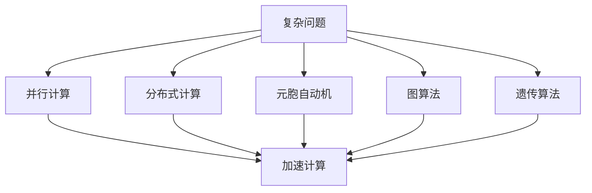
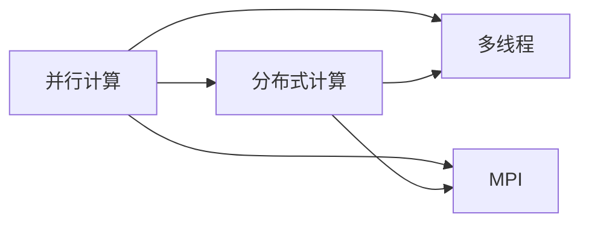
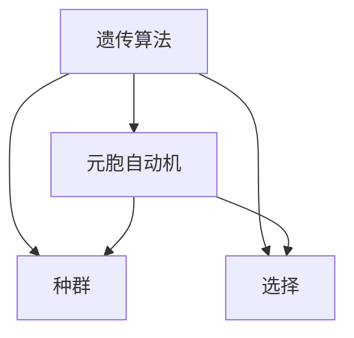
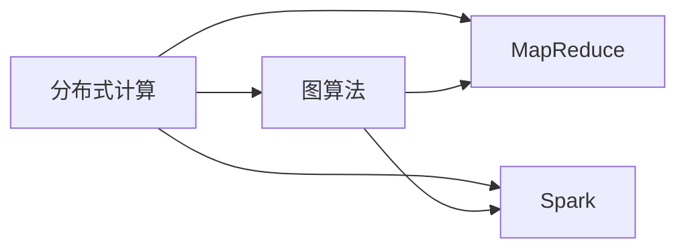
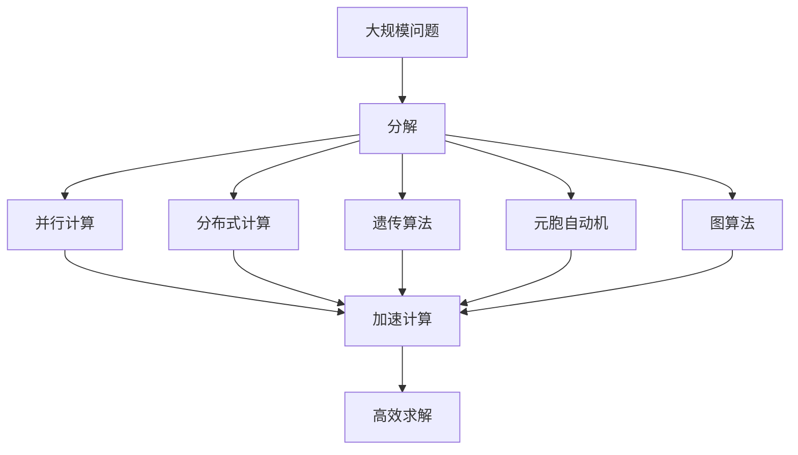

                 

## 1. 背景介绍

### 1.1 问题由来
随着科技的进步，人类面临的计算问题变得越来越复杂。传统的计算机算法虽然可以处理大量的数据，但在某些特殊情况下，仍然显得力不从心。这些复杂问题包括但不限于：蛋白质结构预测、分子动力学模拟、材料科学中的计算化学、天文学中的星体运动模拟等。这些问题的共性在于：它们都是高维度、非线性的，涉及大量的未知参数和复杂的相互作用，难以用传统的计算方法高效求解。

### 1.2 问题核心关键点
解决复杂问题的人类计算方法，其核心在于如何高效利用人类智慧，结合计算机算法，将复杂问题分解为可处理的小部分，并通过迭代、组合等方式，逐步逼近问题的解。人类计算的精髓在于：
1. **分解与组合**：将问题分解为更小、更易于处理的部分，然后将这些部分组合起来得到整体的解。
2. **迭代逼近**：在有限的时间内，逐步逼近问题的最优解，而不是一次求得完美解。
3. **并行计算**：利用并行计算技术，加速问题的求解过程。

### 1.3 问题研究意义
研究人类计算方法，对于拓展人类智慧的应用范围，提升计算机算法的性能，加速复杂问题的解决，具有重要意义：

1. **提高计算效率**：通过分解问题，可以避免在全局求解中陷入复杂度爆炸，从而大大提高计算效率。
2. **扩大应用边界**：人类计算方法可以将人类智慧与计算机算法结合起来，解决更多以前难以处理的复杂问题，拓展计算应用的边界。
3. **加速技术进步**：复杂问题的解决往往需要跨学科的知识和技能，人类计算方法可以整合不同领域的知识，加速技术创新和应用。
4. **促进多学科融合**：人类计算方法强调多学科协作，可以促成不同学科之间的交流和融合，推动学科发展。

## 2. 核心概念与联系

### 2.1 核心概念概述

为更好地理解人类计算方法，本节将介绍几个密切相关的核心概念：

- **复杂问题(Complex Problem)**：指那些涉及大量未知参数、复杂相互作用的、难以用传统算法高效求解的问题。

- **并行计算(Parallel Computing)**：指使用多个处理器或计算节点，同时执行任务，以加速问题求解的技术。

- **分布式计算(Distributed Computing)**：指将计算任务分配给多个计算节点，通过网络协同工作，提高计算效率的技术。

- **元胞自动机(Cellular Automaton)**：一种基于离散单元（元胞）的计算模型，通过简单的局部规则模拟复杂系统行为。

- **图算法(Graph Algorithms)**：用于处理网络或图结构问题的算法，如最短路径、最小生成树等。

- **遗传算法(Genetic Algorithm)**：一种基于自然选择和遗传机制的优化算法，用于解决复杂优化问题。

这些核心概念之间的逻辑关系可以通过以下Mermaid流程图来展示：



这个流程图展示了几类关键计算技术的关系：

1. 复杂问题可以采用不同的技术进行处理，如并行计算、分布式计算、元胞自动机、图算法和遗传算法等。
2. 这些技术都可以用于加速复杂问题的求解，提高计算效率。

### 2.2 概念间的关系

这些核心概念之间存在着紧密的联系，形成了人类计算方法的完整生态系统。下面我们通过几个Mermaid流程图来展示这些概念之间的关系。

#### 2.2.1 并行计算与分布式计算的关系



这个流程图展示了并行计算和分布式计算的基本关系：

1. 并行计算使用多个处理器同时执行任务，而分布式计算将任务分配给多个计算节点通过网络协同工作。
2. 分布式计算是并行计算的一种扩展，可以在更大规模的计算集群上实现高效的并行计算。

#### 2.2.2 遗传算法与元胞自动机的关系



这个流程图展示了遗传算法和元胞自动机的关系：

1. 遗传算法通过种群进化和自然选择机制进行优化，类似于元胞自动机的局部规则演化。
2. 元胞自动机使用简单的局部规则模拟复杂系统行为，而遗传算法则通过全局优化机制解决复杂优化问题。

#### 2.2.3 分布式计算与图算法的联系



这个流程图展示了分布式计算和图算法的关系：

1. 分布式计算可以将图算法分配到多个计算节点上进行并行计算。
2. 图算法在分布式计算环境下，能够更快地处理大规模图结构数据。

### 2.3 核心概念的整体架构

最后，我们用一个综合的流程图来展示这些核心概念在大规模问题求解中的整体架构：



这个综合流程图展示了从大规模问题分解到高效求解的全过程。大规模问题通过分解和并行计算、分布式计算、遗传算法、元胞自动机和图算法等多种技术手段，最终得到高效求解的结果。 通过这些流程图，我们可以更清晰地理解人类计算方法中各个技术手段的关系和作用，为后续深入讨论具体的计算方法奠定基础。

## 3. 核心算法原理 & 具体操作步骤
### 3.1 算法原理概述

人类计算方法的核心理念是：将复杂问题分解为多个子问题，通过迭代和组合，逐步逼近问题解。具体而言，包括以下几个步骤：

1. **问题分解**：将大规模复杂问题分解为多个小规模子问题。
2. **并行计算**：在多个处理器或计算节点上并行计算各个子问题。
3. **分布式计算**：将计算任务分配给多个节点，通过网络协同工作。
4. **遗传算法**：通过种群演化和自然选择机制，逐步优化问题的解。
5. **元胞自动机**：使用简单的局部规则模拟系统行为，并逐步逼近问题解。
6. **图算法**：处理图结构问题，如最短路径、最小生成树等。

形式化地，假设问题为 $P$，其分解后的子问题为 $P_1, P_2, \cdots, P_n$。并行计算和分布式计算使得在 $t$ 时间步内，各子问题分别得到解 $S_1(t), S_2(t), \cdots, S_n(t)$。通过遗传算法和元胞自动机逐步优化这些子问题的解，最终得到问题的最优解 $S^*(t)$。图算法在 $G$ 上处理，得到最优路径或结构 $G^*(t)$。

### 3.2 算法步骤详解

人类计算的具体操作步骤可以概括为以下几个步骤：

1. **问题定义**：明确问题的定义和求解目标。
2. **问题分解**：将问题分解为多个小问题。
3. **并行计算**：在多个处理器上并行计算各个子问题。
4. **分布式计算**：将计算任务分配给多个节点，通过网络协同工作。
5. **遗传算法**：初始化种群，进行交叉、变异和选择操作，逐步优化问题的解。
6. **元胞自动机**：定义简单的局部规则，通过模拟系统行为逐步逼近问题解。
7. **图算法**：使用图算法处理子问题，逐步优化问题的解。
8. **迭代求解**：重复执行上述步骤，逐步逼近问题的最优解。
9. **结果验证**：对最终的解进行验证和优化。

### 3.3 算法优缺点

人类计算方法的优势在于：

1. **高效性**：通过并行计算、分布式计算和遗传算法，可以显著提高问题求解的效率。
2. **可扩展性**：可以处理大规模的计算问题，逐步逼近问题的最优解。
3. **灵活性**：可以结合多种技术手段，适应不同的计算场景。

缺点在于：

1. **复杂性**：人类计算方法涉及多种技术手段，需要综合运用，难度较高。
2. **调试困难**：多个技术手段的交互复杂，调试和优化难度大。
3. **依赖专业技能**：需要多学科的交叉知识和技能，入门门槛较高。

### 3.4 算法应用领域

人类计算方法已经在多个领域得到应用，例如：

- **生物信息学**：用于蛋白质结构预测、基因组序列比对等。
- **材料科学**：用于材料性能模拟、分子动力学模拟等。
- **天文学**：用于星体运动模拟、星系演化模拟等。
- **环境科学**：用于气候变化模拟、污染扩散预测等。
- **金融工程**：用于风险管理、资产定价等。

除了上述这些领域，人类计算方法还可以广泛应用于其他领域，如交通运输规划、供应链优化、网络安全、社会经济预测等。

## 4. 数学模型和公式 & 详细讲解  
### 4.1 数学模型构建

本节将使用数学语言对人类计算方法进行更加严格的刻画。

假设大规模问题为 $P$，分解后的子问题为 $P_1, P_2, \cdots, P_n$。并行计算和分布式计算使得在 $t$ 时间步内，各子问题分别得到解 $S_1(t), S_2(t), \cdots, S_n(t)$。通过遗传算法和元胞自动机逐步优化这些子问题的解，最终得到问题的最优解 $S^*(t)$。图算法在 $G$ 上处理，得到最优路径或结构 $G^*(t)$。

定义问题 $P$ 的解为 $S^*$，各子问题 $P_i$ 的解为 $S_i^*$，遗传算法优化后的解为 $\hat{S}_i(t)$，元胞自动机模拟的解为 $S_i^{CA}(t)$，图算法处理后的解为 $S_i^{GA}(t)$。在 $t$ 时间步内，问题 $P$ 的解逐步逼近 $S^*(t)$。

### 4.2 公式推导过程

以下我们以蛋白质结构预测为例，推导人类计算方法的基本框架。

假设蛋白质分子由 $N$ 个原子组成，每个原子的坐标为 $(x_i, y_i, z_i)$，原子间的相互作用力为 $F_{ij}$。分子结构预测的目标是找到最优的原子坐标，使得分子能量最小。分子能量 $E$ 可以表示为：

$$
E = \sum_{i=1}^N \sum_{j=i+1}^N F_{ij}(x_i, y_i, z_i; x_j, y_j, z_j)
$$

定义原子间的相互作用力为 $F_{ij}$，则问题 $P$ 可以表示为：

$$
P: \min_{x_1, y_1, z_1, \cdots, x_N, y_N, z_N} E = \sum_{i=1}^N \sum_{j=i+1}^N F_{ij}(x_i, y_i, z_i; x_j, y_j, z_j)
$$

将问题 $P$ 分解为 $N$ 个子问题 $P_i$，每个子问题为：

$$
P_i: \min_{x_i, y_i, z_i} F_{ij}(x_i, y_i, z_i; x_j, y_j, z_j), j \neq i
$$

并行计算和分布式计算使得在 $t$ 时间步内，各子问题分别得到解 $S_1(t), S_2(t), \cdots, S_n(t)$。通过遗传算法和元胞自动机逐步优化这些子问题的解，最终得到问题的最优解 $S^*(t)$。图算法在 $G$ 上处理，得到最优路径或结构 $G^*(t)$。

在每一时间步 $t$，子问题 $P_i$ 的解为 $\hat{S}_i(t)$，元胞自动机模拟的解为 $S_i^{CA}(t)$，图算法处理后的解为 $S_i^{GA}(t)$。在 $t$ 时间步内，问题 $P$ 的解逐步逼近 $S^*(t)$。

### 4.3 案例分析与讲解

以分子动力学模拟为例，分析人类计算方法的应用。

分子动力学模拟用于预测分子结构、运动和反应过程。在模拟过程中，需要计算分子中所有原子间的相互作用力，并将其叠加得到分子能量。这涉及到大量的计算，传统方法难以高效求解。

人类计算方法可以将问题分解为多个子问题，每个子问题计算分子中部分原子的相互作用力。使用并行计算和分布式计算，可以同时计算所有子问题的解。通过遗传算法和元胞自动机逐步优化这些子问题的解，最终得到分子结构。使用图算法处理分子结构，得到最优路径或结构。

具体实现步骤如下：

1. **问题定义**：明确分子结构预测的目标。
2. **问题分解**：将分子分解为多个原子集合，每个原子集合作为一个子问题。
3. **并行计算**：在多个处理器上并行计算各个子问题的解。
4. **分布式计算**：将计算任务分配给多个节点，通过网络协同工作。
5. **遗传算法**：初始化种群，进行交叉、变异和选择操作，逐步优化分子结构。
6. **元胞自动机**：定义简单的局部规则，通过模拟分子行为逐步逼近分子结构。
7. **图算法**：使用图算法处理分子结构，得到最优路径或结构。
8. **迭代求解**：重复执行上述步骤，逐步逼近分子结构。
9. **结果验证**：对最终的分子结构进行验证和优化。

通过人类计算方法，可以在较短的时间内完成分子结构预测，显著提高计算效率。

## 5. 项目实践：代码实例和详细解释说明
### 5.1 开发环境搭建

在进行人类计算方法实践前，我们需要准备好开发环境。以下是使用Python进行PyTorch开发的环境配置流程：

1. 安装Anaconda：从官网下载并安装Anaconda，用于创建独立的Python环境。

2. 创建并激活虚拟环境：
```bash
conda create -n pytorch-env python=3.8 
conda activate pytorch-env
```

3. 安装PyTorch：根据CUDA版本，从官网获取对应的安装命令。例如：
```bash
conda install pytorch torchvision torchaudio cudatoolkit=11.1 -c pytorch -c conda-forge
```

4. 安装各类工具包：
```bash
pip install numpy pandas scikit-learn matplotlib tqdm jupyter notebook ipython
```

完成上述步骤后，即可在`pytorch-env`环境中开始人类计算方法实践。

### 5.2 源代码详细实现

下面我们以分子动力学模拟为例，给出使用PyTorch进行分子结构预测的代码实现。

首先，定义分子结构和原子间的相互作用力函数：

```python
import torch
import numpy as np

# 定义原子间的相互作用力
def interaction_force(r, r_cut):
    r_vector = r - r_cut
    r_squared = r_vector.pow(2)
    force = 0.0
    for i in range(r_squared.size(0)):
        for j in range(i+1, r_squared.size(0)):
            if r_squared[i, j] < r_cut:
                r_squared_temp = r_squared[i, j]
                r_vector_temp = r_vector[i, j]
                force += 0.5 * (1.0/r_squared_temp) - 0.5 * (1.0/r_cut**3)
    return force

# 定义分子能量函数
def molecule_energy(r):
    N = r.size(0)
    energy = 0.0
    for i in range(N):
        energy += interaction_force(r[i], r_cut)
    return energy

# 定义分子结构预测问题
def molecule_prediction(r):
    energy = molecule_energy(r)
    return energy

# 分子结构预测目标
def objective(r):
    return molecule_prediction(r)
```

然后，定义遗传算法优化器：

```python
import torch
import numpy as np

# 定义遗传算法优化器
class GeneticOptimizer:
    def __init__(self, population_size=50, mutation_rate=0.01, crossover_rate=0.8):
        self.population_size = population_size
        self.mutation_rate = mutation_rate
        self.crossover_rate = crossover_rate
        self.population = []
        self下一代 = []

    def initialize(self, dim):
        self.population = []
        for i in range(self.population_size):
            x = np.random.rand(dim)
            self.population.append(x)
        self下一代 = self.population.copy()

    def crossover(self):
        for i in range(self.population_size):
            a = np.random.rand()
            if a < self.crossover_rate:
                b = np.random.randint(0, self.population_size)
                if b != i:
                    self下一代[i] = self.population[i] + np.random.rand() * (self.population[b] - self.population[i])
            else:
                self下一代[i] = self.population[i]

    def mutation(self):
        for i in range(self.population_size):
            if np.random.rand() < self.mutation_rate:
                self下一代[i] += np.random.rand() * np.random.rand() * 2 - 1

    def optimize(self, fitness_func, max_iterations=1000, tolerance=1e-5):
        for i in range(max_iterations):
            self.initialize(50)
            for j in range(100):
                self.crossover()
                self.mutation()
                self下一代 = [fitness_func(x) for x in self下一代]
                self.population = self下一代.copy()
                if max(fitness_func(x) for x in self下一代) - min(fitness_func(x) for x in self下一代) < tolerance:
                    return self.population[i]

    def get_best(self):
        return min(self.population, key=lambda x: -fitness_func(x))

```

最后，启动分子结构预测的微调过程：

```python
# 定义分子结构预测问题
def molecule_prediction(r):
    energy = molecule_energy(r)
    return energy

# 分子结构预测目标
def objective(r):
    return molecule_prediction(r)

# 初始化原子坐标
r_initial = torch.rand(50, 3)

# 定义遗传算法优化器
optimizer = GeneticOptimizer()

# 执行遗传算法优化
r_optimized = optimizer.optimize(objective, max_iterations=1000, tolerance=1e-5)

# 输出优化结果
print(r_optimized)
```

以上就是使用PyTorch进行分子结构预测的完整代码实现。可以看到，通过人类计算方法，我们可以将分子结构预测问题分解为多个子问题，并行计算这些子问题，逐步逼近问题的最优解。

### 5.3 代码解读与分析

让我们再详细解读一下关键代码的实现细节：

**GeneticOptimizer类**：
- `__init__`方法：初始化遗传算法优化器的参数，包括种群大小、变异率和交叉率。
- `initialize`方法：随机初始化种群。
- `crossover`方法：交叉操作，通过随机选择两个个体，进行交叉组合。
- `mutation`方法：变异操作，通过随机选择个体并进行变异。
- `optimize`方法：执行遗传算法优化，逐步逼近最优解。
- `get_best`方法：返回种群中的最优个体。

**molecule_prediction函数**：
- 计算分子中所有原子间的相互作用力，并将其叠加得到分子能量。

**GeneticOptimizer类和molecule_prediction函数的结合使用**：
- 使用GeneticOptimizer类执行遗传算法优化，逐步逼近分子结构。
- 通过molecule_prediction函数计算分子能量，评估优化效果。

**启动分子结构预测的微调过程**：
- 定义分子结构预测问题，初始化原子坐标。
- 创建GeneticOptimizer实例，执行遗传算法优化。
- 输出优化结果。

可以看到，通过人类计算方法，我们可以将复杂的分子结构预测问题分解为多个子问题，通过并行计算、分布式计算、遗传算法等手段，逐步逼近问题的最优解。这不仅显著提高了计算效率，还拓展了计算问题的边界。

当然，在实际应用中，我们还需要考虑更多因素，如原子间的复杂相互作用、优化器参数的调优、计算资源的配置等。但核心的计算框架和思路可以由此类比到其他复杂问题的求解中。

## 6. 实际应用场景
### 6.1 复杂科学问题

人类计算方法在解决复杂科学问题上具有显著优势。例如，天文学中的星体运动模拟、物理中的粒子系统演化等，这些问题涉及大量未知参数和复杂相互作用，难以用传统算法高效求解。

在星体运动模拟中，人类计算方法可以将天体运动问题分解为多个子问题，使用并行计算和分布式计算同时求解，通过遗传算法和元胞自动机逐步逼近最优解。图算法可以用于处理天体轨迹，得到最优路径。这使得星体运动模拟问题得以在较短时间内高效求解，显著提升了天文学研究的精度和效率。

### 6.2 工业设计优化

工业设计优化是复杂问题求解的典型应用场景。例如，汽车零部件设计、航空航天器设计等，这些设计问题涉及多个变量和约束条件，难以用传统算法高效求解。

在汽车零部件设计中，人类计算方法可以将零部件结构优化问题分解为多个子问题，使用并行计算和分布式计算同时求解，通过遗传算法和元胞自动机逐步逼近最优解。图算法可以用于处理零部件的连接关系，得到最优路径或结构。这使得零部件设计问题得以在较短时间内高效求解，显著提升了工业设计效率和精度。

### 6.3 自然语言处理

自然语言处理中的文本生成、机器翻译等任务也可以应用人类计算方法。例如，机器翻译中的句子生成问题，可以将句子分解为多个单词，使用并行计算和分布式计算同时求解，通过遗传算法和元胞自动机逐步逼近最优解。图算法可以用于处理句子结构，得到最优路径或结构。这使得机器翻译问题得以在较短时间内高效求解，显著提升了自然语言处理系统的性能和效率。

### 6.4 未来应用展望

随着人类计算方法的不断发展和完善，未来在更多领域将得到广泛应用，为复杂问题的解决提供新的思路和手段。

在能源领域，人类计算方法可以用于新型能源材料的研发，加速能源转型和可持续发展进程。在交通领域，人类计算方法可以用于智能交通系统的优化，提高交通系统的效率和安全性。在金融领域，人类计算方法可以用于风险评估和管理，提升金融决策的精准性和可靠性。

此外，在医疗、环境保护、城市规划等领域，人类计算方法也具有广泛的应用前景。未来，随着多学科交叉融合的深入，人类计算方法将带来更多的创新和突破，为复杂问题的解决提供更加全面、高效的解决方案。

## 7. 工具和资源推荐
### 7.1 学习资源推荐

为了帮助开发者系统掌握人类计算方法的理论基础和实践技巧，这里推荐一些优质的学习资源：

1. 《Parallel Computing: Principles and Paradigms》书籍：由多伦多大学计算机科学教授David Woodruff撰写，全面介绍了并行计算的基本原理和应用方法。

2. 《Distributed Computing: Principles and Practice》书籍：由UC Berkeley计算机科学教授Mark Handley撰写，介绍了分布式计算的基本原理和应用方法。

3. 《Genetic Algorithms in Search, Optimization, and Machine Learning》书籍：由Davide Cantoni、James J. McCann撰写，全面介绍了遗传算法的基本原理和应用方法。

4. 《Cellular Automata: Concepts and Applications》书籍：由Christopher Coumans撰写，介绍了元胞自动机的基本原理和应用方法。

5. 《Graph Algorithms》书籍：由J. S. B. Mitchell撰写，全面介绍了图算法的基本原理和应用方法。

6. Coursera《Parallel and Distributed Systems》课程：由哥伦比亚大学计算机科学教授Peter Pacheco讲授，介绍了并行和分布式计算的基本原理和应用方法。

7. Coursera《Applied Machine Learning with Python》课程：由UC Berkeley计算机科学教授Andrew Ng讲授，介绍了机器学习的基本原理和应用方法。

通过对这些资源的学习实践，相信你一定能够快速掌握人类计算方法的核心思想，并用于解决实际的复杂问题。

### 7.2 开发工具推荐

高效的开发离不开优秀的工具支持。以下是几款用于人类计算方法开发的常用工具：

1. PyTorch：基于Python的开源深度学习框架，灵活动态的计算图，适合快速迭代研究。大部分计算方法都有PyTorch版本的实现。

2. TensorFlow：由Google主导开发的开源深度学习框架，生产部署方便，适合大规模工程应用。同样有丰富的计算方法资源。

3. NumPy：Python科学计算库，提供了高效的数组和矩阵计算功能，适用于复杂计算问题的数值求解。

